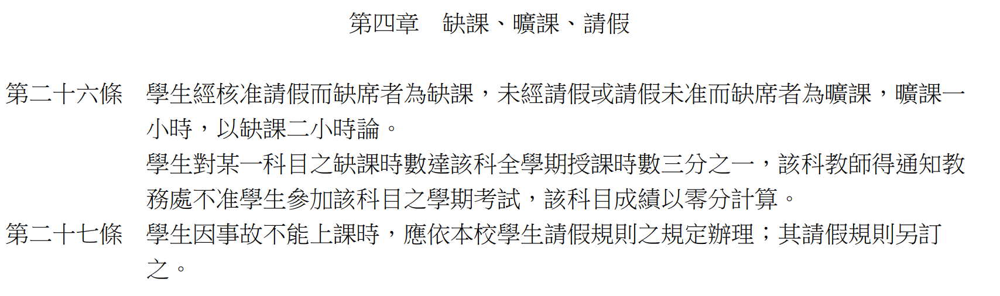
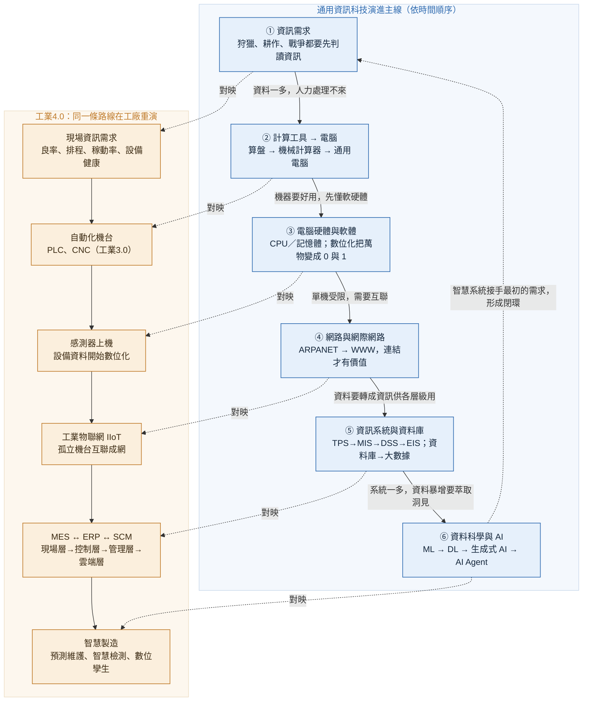

# 資訊與人工智慧概論 課程介紹

| 項目 | 內容 |
|---|---|
| 學期（課號） | 115-1（IE123） |
| 學分數 | 3 學分 |
| 授課老師 | 呂卓勲、孫天龍（以授課順序排序） |
| Email | chohsunlu@saturn.yzu.edu.tw、tsun@saturn.yzu.edu.tw |
| Office Hour | 呂老師：每週四 13:30–16:30、孫老師：請自行諮詢孫老師 |
| 上課時間 | 每週五，第 2–4 節（A班）、第 6–8 節（B班），各三小時 |
| 上課地點 | *待補* |
| 課程內容 | 理解當代計算機基礎架構、資訊科技演進、人工智慧（Artificial Intelligence, AI）現況，能讓你對於電腦與資訊科技與 AI 有基本概念 |

> **本文件很長，但每一條都會影響你的成績。請不要只在第一週聽老師講過一次就算了——找時間自己從頭到尾讀完一遍。學期中真的出狀況時，老師是依這份文件處理，不是依你記得的版本。**

讀完之後，請自己做一遍 [00-Course-Rules-Quiz.md](00-Course-Rules-Quiz.md)（課程規範理解測驗）。**這份測驗不計分、不用繳交，也不用給老師看**，答案就附在文件後面，目的只是讓你確認自己記得的版本是不是對的——每年都有同學把規則記成另一個樣子，到出狀況時才發現。**建議在第 2 週（09/18）上課前做完**，答錯的題目回頭把出處那一節重讀一次，還是不懂就在課堂上或 LINE 群組問。

若覺得有些規定你不太能接受，歡迎直接跟老師聊聊，也許只是還沒說清楚。這些規範對全班一體適用，老師沒辦法為個別同學調整；如果談過還是覺得不合適，**趁加退選期間想清楚要不要繼續修這門課就好**，在還有選擇的時候做決定，總比整學期都不自在來得好。文件若有異動，會於 LINE 群組公告，以 **最新版本** 為準。

## 本文件的適用範圍

本課程由兩位老師合授，各佔學期成績的 50%，但兩邊的評分方式、上課方式、教材與進度 **都是分開的**。

這份文件只涵蓋呂卓勲老師負責的資訊科技概論部分：底下所有關於期中考、補考、簽到簽退、扣考、複查期限的規定，講的都是呂老師這半學期的事。

孫天龍老師負責的人工智慧概論部分，評分方式與上課方式一律 **由孫老師自行公告**，本文件不代為說明，也不保證與孫老師的規定一致。文件中出現「請自行諮詢孫老師」的地方，就是指這件事。

> 請同學務必記得：等孫老師開始上課時，再跟孫老師確認一次他那部分的評分方式與課堂要求。不要拿這份文件的規定去推論孫老師那半學期怎麼算。

## 重點速覽

下表是提醒，**不能取代全文**。每一列的完整條件與例外都在「詳見」欄指出的章節裡，真的發生爭議時以該處的條文為準。

| 項目 | 重點 | 詳見 |
|---|---|---|
| 適用範圍 | **本文件只涵蓋呂卓勲老師的部分**；孫天龍老師的評分與上課方式由孫老師公告，請當面再確認一次 | 本文件的適用範圍 |
| 配分 | 呂卓勲老師 50%（期中考）、孫天龍老師 50%（計算方式請自行諮詢孫老師） | 學期配分比重 |
| 關鍵日期 | 期中考 **第 9 週（11/06）**；期中複習課程 **10/28 晚間**（暫定，自由參加） | 課程預計進度表 |
| 考試範圍 | 呂卓勲老師所教授的所有教材內容；題型為單選題與簡答題 | 期中考試 |
| 遲到與離場 | **遲到逾 20 分鐘不得入場，視同缺考**；已入場者 30 分鐘內不得交卷離場 | 期中考試／基本規定 |
| 缺考與補考 | 須依學校規定請假並另行申請補考；一般個人因素以實得分數 **80%** 計算，不可抗力並提出證明才是 **100%**，**沒請假就是 0 分** | 什麼算不可抗力？ |
| 扣考 | **本課程只看曠課**，曠課超過 18 小時逕行扣考，扣考等於不能參加期中考 | 課堂規範／扣考規則 |
| 成績複查 | 考後第一個週一公布，公布後 **當週週三前** 提出，逾期不受理 | 期中考試／基本規定 |
| 公告管道 | 所有公告都在 **LINE 群組**，請務必加入 | LINE 群組 |

## 學期配分比重

|授課老師|比重|如何評分|說明|
|---|---|---|---|
|呂卓勲|50%|期中考|假如你期中考考 80 分，總成績就拿到 80 × 50% = 40 分|
|孫天龍|50%|請自行諮詢孫老師|計算方式請記得與孫老師做最後確認|

呂老師這 50% 全部來自期中考一次定生死，細節見〈期中考試〉一節。**孫老師那 50% 怎麼算，這裡不說明也無從說明，等孫老師上課時請務必當面確認一次**，不要自己猜，也不要假設跟呂老師這邊一樣。

> 呂老師的期中考成績於考完期中考後的第一個週一公布

## 課程教材

|授課老師|哪裡找得到？|說明|
|---|---|---|
|呂卓勲|[連結](https://github.com/billy1125/Introduction-of-Information-Technology)|這是呂老師自編的教材，你可以自行再利用，例如用 AI 幫你做筆記、不懂的都可以拿去問 AI|
|孫天龍|Portal|教材與使用方式由孫老師公告，請以孫老師課堂上的說明為準|

## 課程預計進度表

下表涵蓋呂卓勲老師負責的第 1 至 9 週。實際進度可能依上課狀況微調，異動會在課堂與 LINE 群組公告。

| 週次 | 日期 | 主題 | 對應檔案 | 投影片版本 | 練習筆記本 | 說明 |
|---|---|---|---|---|---|---|
| 1 | 09/11 | 課程介紹、計算機歷史 | [00-Course-Introduction.md](00-Course-Introduction.md) [01-History-of-Computer.md](01-History-of-Computer.md) | [00-Course-Introduction.slides.md](00-Course-Introduction.slides.md) [01-History-of-Computer.slides.md](01-History-of-Computer.slides.md) | — | 講解本文件 |
| 2 | 09/18 | 電腦硬體、作業系統與應用軟體 | [02-Computer-Structure.md](02-Computer-Structure.md) | [02-Computer-Structure.slides.md](02-Computer-Structure.slides.md) | [Computer-Structure-Examples.ipynb](notebooks/Computer-Structure-Examples.ipynb) | — |
| 3 | 09/25 | **中秋節放假** | — | — | — | 停課 |
| 4 | 10/02 | 程式設計概念 | [03-Computer-Program.md](03-Computer-Program.md) | [03-Computer-Program.slides.md](03-Computer-Program.slides.md) | [Computer-Program-Examples.ipynb](notebooks/Computer-Program-Examples.ipynb) | — |
| 5 | 10/09 | **國慶日補假** | — | — | — | 停課；10/10 國慶日適逢週六，補假挪至本日 |
| 6 | 10/16 | 網路與網際網路 | [04-Networks-and-Internet.md](04-Networks-and-Internet.md) | [04-Networks-and-Internet.slides.md](04-Networks-and-Internet.slides.md) | — | — |
| 7 | 10/23 | 資訊系統與資料庫 | [05-Information-Systems-and-Database.md](05-Information-Systems-and-Database.md) | [05-Information-Systems-and-Database.slides.md](05-Information-Systems-and-Database.slides.md) | — | — |
| — | 10/28 | **期中複習** | — | — | — | **暫定，晚間加開，自由參加**；詳細時間地點另行公告 |
| 8 | 10/30 | 資料科學、人工智慧與智慧製造（含工業4.0） | [06-Data-Science-AI-and-Smart-Manufacturing.md](06-Data-Science-AI-and-Smart-Manufacturing.md) | [06-Data-Science-AI-and-Smart-Manufacturing.slides.md](06-Data-Science-AI-and-Smart-Manufacturing.slides.md) | — | 全課程終點 |
| 9 | 11/06 | **期中考** | — | — | — | **地點最晚考前一週公告** |

## 期中考試

期中考是呂老師這半學期唯一一次的正式評量，佔學期總成績的 50%，份量很重，請務必認真看待。這半學期因為連續放假被壓縮得特別緊湊，這一次考試幾乎等於呂老師這部分的成績全部，考壞了很難再補回來。

以下把考試的時間地點、範圍、當天規定與評分方式一次講清楚，其中 **遲到與離場、請假與補考、成績複查** 這幾條每年都有人沒看仔細而吃虧。請同學花幾分鐘把整節讀完，別等到考試當天才在門口懊惱，也別等成績出來才發現複查期限已經過了。

### 考試時間地點

- 時間：期中考將在「第 9 週」進行
- 地點：最晚於考前一週公告

### 考試範圍

- 題目類型：單選題、簡答題
- 範圍：呂卓勲老師所教授的所有教材內容

### 基本規定

- 遲到逾 20 分鐘者，不得入場，並 **視同缺考**；已入場者，自考試開始起算，30 分鐘內不得交卷離場，滿 30 分鐘後才可以提前交卷離開
  - 判斷方式很簡單：你走到教室門外時若門已經鎖上，就表示你已經遲到超過 20 分鐘
- 請務必準時出席；若因個人因素無法應考，須依學校規定請假，並另行申請補考
  - 請假必須有合理的理由，什麼才算合理？請見〈請假規定〉一節
  - 只有請假通過者才能參加補考，補考時間另訂
  - **補考的題目一定與正式考試不同**，不會是同一份考卷，難度則維持相當。不要以為晚考就能先跟同學打聽題目，這條路不通
  - 補考成績依請假原因分兩種計算方式：
    - **一般個人因素**（如自行安排的事務）：以實得分數的 **80%** 計算，例如補考考 90 分，最後登記為 90 × 80% = 72 分
    - **事故意外、臨時生病、家中重大變故等不可抗力**：以實得分數的 **100%** 計算，但 **務必提出相關證明**（如診斷證明、就醫紀錄、事故或相關單位開立的證明、訃聞等）
  - 兩者的分界線在哪裡？請見〈什麼算不可抗力？〉一節，那裡有完整的判斷條件與例子
  - 除上述不可抗力的情況外，請同學沒事不要缺考
- 文具請自行準備，老師不會幫你準備
- 考試進行中不得以任何理由暫時離開教室（包含上廁所），請務必在入場前就先上廁所
- 成績預計於考試後的第一個週一公布；公布後至 **當週週三前** 可提出複查，逾期恕不受理

### 什麼算不可抗力？

上一節提到補考成績分 80% 與 100% 兩種算法，差別就在「是不是不可抗力」。這條線每年都有人誤判。本節只適用於 **期中考缺考與補考計分**，平時請假請依學校規定辦理。

先講三種結果的差別：

| 情況 | 結果 |
|---|---|
| 不可抗力，且提出證明 | 可補考，成績以實得分數的 **100%** 計算 |
| 一般個人因素，但依規定請假並通過 | 可補考，成績以實得分數的 **80%** 計算 |
| 沒有請假，或請假未通過 | **視同缺考，該次考試 0 分** |

#### 一、什麼事情算是不可抗力

**住院或急診、法定傳染病隔離、重大意外、直系親屬喪事、兵役徵集、法院傳票。**

> 原則上包括以上所述事由，但不限於此。其他經學校請假系統核准，或具有相當客觀證明且確實無法事先避免之重大事由，由老師依一致標準個案認定。

要走這一邊，**三個條件必須同時成立**：

1. **事由本身不是你能決定的**：不是你決定可不可以發生的。
2. **你也沒有機會事先避開**：期中考的週次第一週就公告了，凡是你有時間事先安排、事先排開的，都不算。
3. **提得出客觀憑證**。

第 2 條是關鍵。有同學會主張「打工班表不是我排的」，班表確實不是你排的，但你有整個學期可以拿考試日期去跟雇主調班，這叫做 **有機會事先避開**。旅遊、社團活動、考照、演唱會同理：日期或許不由你定，但要不要把那天排進去、以及有沒有提早處理，都是你決定的。住院、急診、意外、法院傳票不一樣，它們沒有給你事先安排的餘地。

憑證只是證明事情真的發生，**不能讓不符合前兩個條件的事情變成不可抗力**。機票、班表、報名表也都是憑證，交得出來一樣不算不可抗力。三個條件少任何一個，都不算。

#### 二、什麼事情不算不可抗力

以下這些都 **不算不可抗力**。依學校規定請假並通過者仍可補考，但成績以 80% 計算；沒有請假或請假未通過的，就是缺考 0 分：

| 類型 | 常見例子 |
|---|---|
| 自己安排的行程 | 打工班表、旅遊、返鄉、社團活動、系上活動、球隊練習或比賽、演唱會、婚宴、家庭聚餐 |
| 可以改期或再考一次的事 | 考駕照、語言檢定、各類證照考試、企業參訪、徵才活動、公司面試 |
| 其他課的事 | 別的課考試、作業或報告撞期；別的課的實驗、實習或校外教學 |
| 沒有就醫紀錄的身體不適 | 感冒、疲勞、身體不舒服，但沒有就醫，也提不出診斷證明 |
| 自己該管的準備工作 | 睡過頭、記錯日期、熬夜念書、鬧鐘壞掉、忘記帶文具或學生證 |
| 交通問題 | 塞車、大眾運輸誤點、機車故障、找不到停車位 |

這張表不是窮舉，沒有列到的情況一樣拿上面三個條件去判斷。要特別提醒最後兩類：**塞車誤點、睡過頭、忘記帶東西，都請自己留緩衝**，考試日期你早就知道了。

#### 三、為什麼卡這麼死？

**最主要的理由是公平。** 全班同一時間、同一份考卷、同一套規則，這件事本身就是分數有意義的前提。只要有人可以因為個人因素往後挪，這個前提就破了：多出來的準備時間、可能外流的題目，對準時到場的同學都不公平。

這個道理你其實早就經歷過。你能坐在這間教室裡，靠的是學測與分科測驗，那兩場考試為什麼要規定入場時限、禁止攜帶特定物品、遲到就是不能進去？不是為了刁難誰，而是因為 **只要對某個人放寬一次，所有人的分數就都不能比了**。本課程的規定精神完全一樣，只是規模小一點。

另一個原因，是希望你養成習慣。你未來還有很多機會參加各種考試與評選：研究所考試、國家考試、各類證照檢定、公司的甄選與面試。這些場合的規則都寫在那裡，主辦方對所有人一視同仁，沒有人會為你破例。很多人敗下來，不是能力不夠，是在這些小事上翻船：晚到十分鐘、證件沒帶、報名表漏填一欄，實力再好也沒有機會證明。

還有，出了社會，別人不會因為你的個人因素配合你。以下都是離開學校之後真的會遇到的事情：

| 場合 | 你會講的理由 | 實際會發生的事 |
|---|---|---|
| 求職面試 | 「路上塞車，晚了二十分鐘」 | 面試官的時段是排定的，遲到就是取消，不會為你往後挪 |
| 對客戶提案 | 「我另一個會議撞期」 | 會議照開，你的部分換人講或直接跳過。案子沒拿到，不會因為你的理由重來一次 |
| 線上投標、報名、申請補助 | 「系統上傳到一半當掉」 | 截止時間一到系統就關閉，晚一秒都不收，沒有補件程序 |
| 報稅、繳費、各種法定期限 | 「我忘記了，也沒收到通知」 | 滯納金照算，逾期失權就是失權，沒有人有義務提醒你——老師自己就忘記過驗車，罰了 900 元，還得專程跑一趟監理所繳。跟誰都沒得談，只能認了 |
| 排定的上班班表 | 「我睡過頭」 | 曠職紀錄照登，累積到一定次數就是資遣事由 |

這些場合的共同點是：**時間是所有人一起排的，不是你一個人的事**。你晚一天，後面每一個人都得跟著改。所以請務必照規定走——至少這門課還給了你請假補考的管道、不可抗力的補救措施，以及一個願意聽你解釋的老師，這些外面都沒有。

#### 四、通報與證明

| 項目 | 規定 |
|---|---|
| 通報對象 | 任課老師 |
| 通報時限 | 知道的當下立即通知，最遲不得晚於考試當天開考前 |
| 證明文件 | 仍須依學校請假系統辦理請假，並提出診斷證明、就醫紀錄、隔離通知、訃聞或相關單位開立的公文 |

**提不出證明者不適用本節**，依一般個人因素或缺考辦理。

### 期中考評分

期中考的原始分數介於 0 到 100 分之間，並依下表換算成等第：

|期中考分數（原始）|期中評量等第|備註|
|---|---|---|
|80 分（含）以上|A|優異|
|70 分以上、未滿 80 分|B|良好|
|60 分以上、未滿 70 分|C|待加強|
|未滿 60 分|D|不及格；導師會關切，家長可能會收到通知|

期中之後，你除了看到分數，也會看到等第。如果你拿到 D，學校會通知你、導師也會關切，家長也可能會知道。

期中考佔學期總成績的 50%，換算時是用你的原始分數乘以 50%。例如原始分數 70 分，70 × 50% = 35，這 35 分就先計入你的學期總成績。

> 請同學加油！

### 期中考複習課程（畫重點？！）

因為本學期前段太多放假，預計將於 10/28 晚間（暫定，詳細時間地點會再公告），會開設考前複習或整理課程，歡迎同學多參加。

有任何本課程問題的同學都可以來，也歡迎同學可以另外找時間跟老師討論，當然同學間討論更好！

## 課堂規範

### 簽到與簽退

我們每一週上課都要簽退與簽到，助教將會在上課前 10–20 分鐘給同學簽到，下課時間後則可以簽退。

||時間|說明|
|---|---|---|
|簽到|上課前 10–20 分鐘到上課鐘響後 20 分鐘內|超過時間後助教就會離開|
|簽退|第三堂課下課後|助教會在現場等候，沒有同學要簽退就會離開|

如何計算曠課時數，請見下表：

|狀況|備註|
|---|---|
|未簽到有簽退|曠課 1 小時|
|有簽到未簽退|曠課 1 小時|
|未簽到也未簽退|曠課 3 小時|

> 請注意：簽到與簽退時間到，助教就會立刻離開教室，請同學不可因為個人因素干擾助教進行前述的工作！違者將依照學校規定處理

### 扣考規則

> **所謂扣考就是：不能參加期中考。**

學校已經將相關規定寫在學則裡面：

*圖片來源：元智大學學則*

簡單來說，如果一堂課 3 學分，全學期共有 54 小時。學校規定是缺課 18 小時就會被扣考，所謂「缺課」包括了「曠課（曠課 1 小時，以缺課 2 小時論）、病假、事假」都算在內。

換句話說，假如你的曠課、病假、事假時數通通加起來超過 18 小時，就等於被當。但是你放心，卓勲老師這裡的規定很寬鬆，如下：

> **我只看曠課，曠課 1 小時，以缺課 2 小時論，曠課超過 18 小時（等於有六次沒來上課），將逕行扣考。**

換句話說，你只要想辦法不要超過曠課 18 小時，就不會被扣考。

你自己算算看，要曠課超過 18 小時，其實很難！所以拜託，不要太誇張。

因此，如果沒有來上課，請務必請假。關於請假規定，請繼續往下讀。

### 請假規定

- 請假請自行按照學校規定申請，但是請勿濫用各種假別……務必仔細思考有必要才請假
- 你的請假理由，麻煩不要太扯，什麼叫做很扯的理由，像是：
  - 要去打工、打工班表已排好 🈲 🙅
  - 你考駕照考了四五次甚至更多 🚗 🛵
  - 老師我已經機票買好了，可以之後補考期中考嗎？
  - 要去排演唱會周邊、心儀的偶像閃電結婚/退伍 👩‍🎤 🧑‍🎤
  - 我的鬧鐘壞了 ⏰️
  - 昨晚熬夜打電動，現在太睏了 🎮
  - 男生請生理假？
  - 我頭髮骨折
  - 任何太蝦 🦐 的理由……
- 真的因為某些因素會有長期缺課，請務必聯絡任課老師，不要預設任何情況，敬請先跟任課老師討論，以免造成不可挽回的悲劇狀況

上面這串是平時上課的請假。如果你要請假的那一天是 **期中考**，判斷標準更嚴格，也直接影響補考分數怎麼算，請見〈什麼算不可抗力？〉一節。

### 其他規範

- 上課禁止使用智慧型手機，使用電腦請務必與本課程有關，要追劇、打電動、看直播、聽音樂請回家
- 如果我發現你玩得太過頭，老師不會罵人但是請你離開教室，想好好上課再回來

## 成績有問題怎麼辦？

先分清楚兩件事：**分數算錯了** 和 **分數不理想**，處理方式完全不同。

**分數算錯了**：請先跟任課老師聯絡，不要預設任何立場。成績有問題不一定是「針對你／黑箱／完全不能改」，可能只是誤植、算錯。請在〈期中考試〉的複查期限內提出問題，確認成績是否正確，不用客氣。

**分數不理想**：這種情況請先提複查，確認分數本身沒有算錯。如果複查過後分數仍然不理想，**也請同學接受這個結果**。老師原則上不會另外用補考、補交作業、加交報告之類的方式讓你補分數，那對其他同學不公平。呂老師這 50% 就是這樣了，請把力氣放在孫老師負責的另外 50%，在那邊繼續努力。

要區分清楚：這一段講的是分數不理想想要加分，那沒有管道。因為缺考而依規定請假、申請補考是另一回事，見〈期中考試〉一節。

真正有用的做法是 **提早說**。修課過程中遇到困難（身體狀況、家裡的事、或真的跟不上進度），請在還來得及的時候讓老師知道，那時候能一起想辦法的空間最大。

> 被當掉不是天崩地裂，人生還很長，真的有困難早點讓老師知道，總比成績都送出去了才來求情好得多。

## LINE 群組

本課程所有公告事務於 LINE 上公告，請加入 LINE 群組。

> 請同學務必加入，免得漏掉重要訊息，每學年都有人最後才加入，然後發現自己什麼都不知道，請不要當這種人

為避免干擾同學，若有需要公告的事務，老師將僅於上班時間週一至五 09:00–16:00 公布，除非有緊急事務，則儘可能於晚間 9 時前公布。

同學有疑問，或只是想聊天，不在此限（也請注意同學之間應有的禮節）。

### A 班

（連結另行公告）

### B 班

（連結另行公告）

## 前言：從第一份實習工作談起

你的學長分享了他第一天工廠實習的經歷：主管叫他「去 MES 系統確認今天的工單進度，再把良率資料匯出來，讓 AI 分析一下趨勢」。

學長呆在那裡，因為他不知道：

- MES 是什麼系統，更不知道怎麼登入和操作
- 「良率資料」存在哪裡，要怎麼「匯出」
- AI 分析是什麼意思，要交給誰、用什麼工具做

如果沒有基礎的資訊科技知識，你在職場上可能遇到：

- 不知道 MES、ERP、CRM 各自管什麼，只能一臉茫然地一步一步問同事，每遇到新系統都要重新摸索
- 主管說「幫我 query 一下資料庫」，你不知道資料庫是什麼，更不知道怎麼存取與使用
- 開會討論「IoT 感測器資料上雲端再接 AI 模型」，滿桌術語，你只能點頭，完全無從提問
- 評估採購哪一套資訊系統時，沒有能力判斷技術差異，只能看介面好不好看或廠商推薦什麼
- 老闆叫你去評估廠商開出來的工業電腦，你無法確認需要怎樣的 CPU？要有多少的記憶體？
- 最近 [黃爸的新 AI 電腦](https://www.nvidia.com/zh-tw/products/rtx-spark/) 除了靠北邊的貴，你完全無法理解為什麼要這麼大的記憶體？

如果有基礎的資訊科技知識，你可以：

- 理解 **資訊系統** 的基本架構，知道 MES 管生產進度、ERP 管資源規劃，能快速上手各類企業系統
- 理解 **資料庫** 的概念，能說清楚「我需要哪張資料表、哪個時間範圍的良率欄位」，和 IT 部門有效溝通
- 理解 **網路** 與 **物聯網（IoT）** 的基本概念，知道感測器資料如何從機台傳到雲端再進入分析系統
- 用 **資料科學** 的基礎邏輯讀懂 AI 分析報告，判斷數字可不可信、結論是否合理

> **這就是這門課的核心價值**：不是要把你訓練成資訊工程師或程式設計師，而是讓你具備「**在數位化工廠與企業中有效工作的資訊素養**」——聽得懂基本技術語言、讀得懂資料報告、說得清楚系統需求。

| 課程章節 | 你將獲得的能力 |
|---------|--------------|
| 計算機歷史 | 理解資訊科技的演進脈絡，不被廠商術語或話術誤導 |
| 電腦硬體、作業系統與應用軟體 | 能評估設備規格，理解 CPU、記憶體、儲存各自的角色 |
| 程式設計概念 | 讀懂基本程式邏輯，與 IT 工程師有效溝通需求 |
| 網路與網際網路 | 理解工廠 IoT 架構，能參與數位化方案的討論 |
| 資訊系統與資料庫 | 能使用並評估 ERP、MES 等企業資訊系統 |
| 資料科學、人工智慧與智慧製造 | 讀懂 AI 分析報告，判斷模型效果與應用可行性 |

> 你不需要記住每一個技術細節，但學完這門課後，面對資訊系統、資料分析、AI 應用等工作場景，你應該會知道「**這是什麼、它在做什麼、我該如何判斷好壞**」。這就是這門課真正想給你的能力。

## 課程概要

本課程內容：理解當代計算機基礎架構、資訊科技演進、人工智慧（Artificial Intelligence, AI）現況，能讓你對於電腦與資訊科技與 AI 有基本概念。本課程由呂老師與孫老師合授：

- **呂卓勲老師：當代計算機基礎架構、資訊科技演進**

無論你要做 AI 應用還是僅是要應用各種資訊科技，了解計算機基礎架構、當代資訊技術、資訊系統、網路技術……絕對有幫助。

- **孫天龍老師：負責人工智慧概論**

不管你高興不高興，喜歡不喜歡，AI 已經滲入你的生活與學習，各種 AI 應用也已經成為各行各業的重要議題，本課程幫助同學能對於 AI 有基本概念。

本文件主要是呂卓勲老師的部分，主要是本課程前半部的內容說明。而後半學期的上課方式、教材與評分，孫老師會在他自己的課堂上說明，**這份文件不代為公告**。輪到孫老師上課時，請記得把他那部分的規定聽清楚、當場問清楚。

> 注意：**本學期很悲慘**，09/25、10/09 要放假，卓勲老師必須要在六週內搞定資訊科技的部分。
>
> 上課會很快、很緊湊、拜託請認真上課、不要隨便翹課。

## 課程地圖：一條主線，從資訊需求到智慧工廠

本課程六個章節看似各自獨立，其實是一條連續的技術演進主線，一環扣一環。以下依這條主線把各章串起來，你會發現整條路線最後正在工廠裡以「工業4.0」的形式重演一遍。

### 人自古就有資訊需求

- 資訊需求與人類文明同齡：從原始時代的狩獵、耕作，到部落與國家的政治、戰爭，任何決策都得先收集並判讀資訊。
- 最初只能靠經驗與記憶，之後才發展出記錄與傳遞的方法（結繩記事、占卜、文字），並發明輔助計算的工具（算籌、算盤、日晷）。
- 核心張力：人腦記憶有限、計算容易出錯，資料一多就處理不來。這股「人力處理不了大量資訊」的壓力，正是推動後續每一次技術演進的原動力。

### 計算工具、計算機、電腦

- 17 至 19 世紀，從帕斯卡（Blaise Pascal）、萊布尼茲（Gottfried Leibniz）的機械式計算器，到巴貝奇（Charles Babbage）的分析機，「計算」第一次能交給機器——但這些機器仍是專用的、純機械的。
- 20 世紀理論先行：圖靈（Alan Turing）於 1936 年證明「通用計算機」在理論上可行，夏農（Claude Shannon）把資訊量化為位元（bit），馮諾依曼（John von Neumann）則確立「程式與資料同存於記憶體」的架構。
- 理論隨後落地為電子電腦（如 1946 年的 ENIAC）。電腦自此不再是專用計算器，而是能以程式改變用途的通用機器——同一台機器就能解決不同問題。
- 但通用機器要真正好用，得先弄懂它「由什麼組成、又如何被指揮」，這就進入硬體與軟體的討論。

### 電腦硬體與軟體

- 硬體：從電晶體取代真空管，到積體電路與微處理器，電腦變得越來越小、越來越快、越來越便宜。唯有理解 CPU、記憶體、硬碟、GPU 各自的分工，才知道資料在機器裡如何被存取與運算。
- 軟體：硬體本身只認得二進位訊號，是軟體（作業系統、程式語言、應用程式）把人的意圖翻譯成機器能執行的指令。
- 關鍵轉折在於數位化：文字、數字、照片、影像、聲音全被編碼成 0 與 1，於是「所有資訊」都能放進同一台電腦處理——這為日後的資料爆炸埋下伏筆。
- 然而單機再強，資料與運算能力仍被侷限在一台電腦裡，於是下一步是把電腦連起來。

### 網路與資訊系統

#### 電腦網路與網際網路

- 電腦硬體與軟體一開始都只存在於單一地點，連上網路後才能彼此互通有無。
- 1960 至 1970 年代，ARPANET 與 TCP/IP 讓不同電腦得以互聯；1990 年代的全球資訊網（WWW）進一步把網路變成人人可用的資訊空間，才真正引爆資訊的爆炸性成長。
- 網路的意義就在於「連結」：單機的資料唯有連起來、能被彼此取用，才會產生新的價值。當代各種資訊服務幾乎都根植於網際網路，理解了它，才能理解資訊為何要「連結」起來才有意義。

#### 資訊系統

- 一開始，計算機真的只是用來「計算」，從 1+1 到複雜的微積分，都是為了解決數學計算問題。
- 後來人們發現要計算的東西很多，需要儲存大量資料反覆運算，而計算後的結果又得再保存、或呈現成報表等另一種型態。於是計算機逐漸變成把資料轉換成資訊的工具，這就是資訊系統。
- 需求隨後擴散：從人口統計這類單一用途，到每個人、每個單位、每家公司都要用。由於組織中不同層級的人，工作型態與需要的資訊粒度都不一樣，資訊系統於是依組織層級分化出不同類型。最基層是 **交易處理系統（Transaction Processing System, TPS）**，負責處理日常、大量而例行的交易（訂單、進出貨、刷卡、薪資），講求即時與正確，是所有資料的源頭；往上一層的 **管理資訊系統（Management Information System, MIS）** 把 TPS 累積的交易資料彙整成定期報表，讓中階主管掌握營運概況；再往上，**決策支援系統（Decision Support System, DSS）** 提供模型與分析工具，協助決策者處理產能規劃、投資評估這類半結構化、非例行的決策；最高層的 **主管資訊系統（Executive Information System, EIS）** 則以儀表板將關鍵績效指標視覺化，支援高階主管的策略判斷。整體而言，越往基層處理的資料越細、越即時，越往高層看的資訊越彙整、越著重趨勢與例外——這也解釋了為何一個組織需要多套彼此銜接的資訊系統，而非一套打天下。
- 尤其當網際網路出現後，資訊系統從單機與內網走向連網，功能更多、傳輸更快，甚至能設計成對外提供服務給更多人使用。

#### 資料庫與大數據

- 資訊系統越來越多、越來越複雜、連結範圍越來越廣，就會產生大量的資料。
- 資料庫的出現（如 1970 年提出的關聯式模型），解決了「資料該如何有系統地儲存與查詢」的問題。
- 當資料的量、種類與產生速度都超出傳統資料庫的負荷，就成為大數據。

### 資料科學與人工智慧

- 大數據只會越來越龐大，光是存下來還不夠，還要能從中萃取關聯與洞見，於是需要更強大的演算法。
- 資料科學的出現，就是要透過各種數學與統計模型、建立演算法，來處理大量資料並找出其中的規律。
- 為何是「近年」才爆發：數學與統計模型、演算法其實很早就有，但過去電腦硬體不夠強、可用的資料也不夠多；直到算力、資料與演算法三者同時成熟，資料科學結合現代高速電腦系統，才催生了 AI 的出現。
- AI 一路演進：從機器學習到深度學習（2010 年代）、生成式 AI，再到 AI 代理人（AI agent），能力從「辨識」走向「生成」與「自主行動」。
- 至此回到起點：人類最初「處理不了大量資訊」的需求，如今由智慧型系統接手完成。這也是當代最前沿的資訊議題。

### 工業4.0與智慧製造

- 前面整條從「資訊需求」一路走到「AI」的演進，並不是抽象的科技史，而是正在製造現場被重演一遍——這場在工廠裡的重演，就是工業4.0。
- 工廠這個場域，本身也走過同一條路線：工業1.0 用蒸汽帶來機械化，工業2.0 靠電力與生產線達成量產，工業3.0 導入電腦與自動化（如可程式邏輯控制器 PLC、CNC 工具機）讓機台能被程式控制——這幾階段對應的正是前面講的「計算工具進入現場」。到了 2011 年德國提出的工業4.0，主軸則轉向「連結」與「智慧」，把 IT 演進後半段的網路、資料與 AI 全數搬進工廠。
- 現場的資訊需求其實古已有之：生產要決策良率、排程、稼動率、設備健康，過去只能靠人工記錄與老師傅的經驗判斷，這正是全課程開頭「人力處理不了大量資訊」那股張力，在製造現場的翻版。
- 突破口是把機台連起來：在設備上裝感測器，透過工業物聯網（Industrial IoT, IIoT）即時蒐集溫度、振動、電流、產量等資料，讓原本各自孤立的機台變成能互通訊息的網路——這一步呼應的正是前面「網路與網際網路」那一章。
- 資料一旦連通，就需要系統把它轉成可用的資訊：製造執行系統（MES）銜接現場與管理層，再往上與 ERP、SCM 整合，讓一筆訂單從接單、排程、生產到出貨全程可視——這是「資訊系統」那一章在工廠裡的落地。整座智慧工廠因此形成現場層、控制層、管理層、雲端層由下而上銜接的分層架構。
- 最後，海量的機台資料交給資料科學與 AI 處理，就長出工業4.0 最具代表性的應用：用歷史資料預測設備何時故障的預測性維護、用視覺辨識自動挑出瑕疵品的智慧檢測，以及在虛擬世界建立產線的數位分身、把試錯成本從實體搬進電腦的數位孿生（Digital Twin）。
- 於是全課程在此收束：計算機、程式、網路、資訊系統、資料科學與 AI 這一整條技術主線，最終匯流成一座能自我感知、連結與決策的智慧工廠——這也是工業工程與管理領域下一階段的核心戰場。

