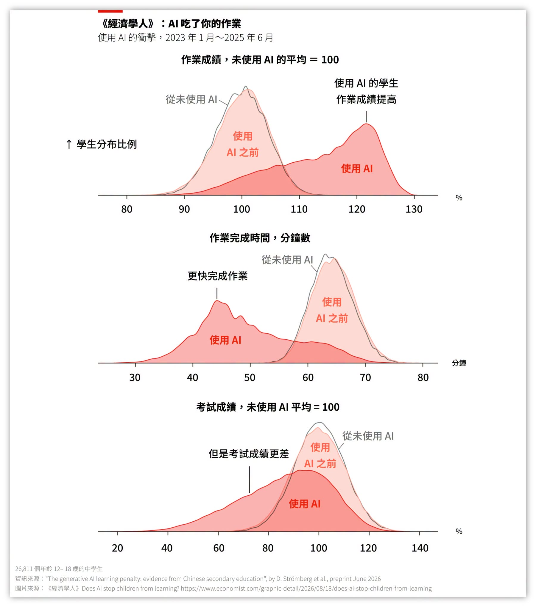

# 資訊與人工智慧概論 課程介紹

| 項目 | 內容 |
|---|---|
| 學期（課號） | 115-1（IE123） |
| 學分數 | 3 學分 |
| 授課老師 | 呂卓勲、孫天龍（以授課順序排序） |
| Email | chohsunlu@saturn.yzu.edu.tw、tsun@saturn.yzu.edu.tw |
| Office Hour | 呂老師：每週四 13:30–16:30、孫老師：請自行諮詢孫老師 |
| 上課時間 | 每週五，第 2–4 節（B 班）、第 6–8 節（A 班），各三小時。上課日若遇國定假日則停課一次。 |
| 上課地點 | 2425（B 班）、2115（A 班） |
| 課程內容 | 理解當代計算機基礎架構、資訊科技演進、人工智慧（Artificial Intelligence, AI）現況，能讓你對於電腦與資訊科技與 AI 有基本概念 |

> **本文件很長，但每一條都會影響你的成績。請不要只在第一週聽老師講過一次就算了——找時間自己從頭到尾讀完一遍。學期中真的出狀況時，老師是依這份文件處理，不是依你記得的版本。**

讀完之後，請自己做一遍 [00-Course-Rules-Quiz.md](00-Course-Rules-Quiz.md)（課程規範理解測驗）。**這份測驗不計分、不用繳交，也不用給老師看**，答案就附在文件後面，目的只是讓你確認自己記得的版本是不是對的——每年都有同學把規則記成另一個樣子，到出狀況時才發現。**建議在第 2 週（09/18）上課前做完**，答錯的題目回頭把出處那一節重讀一次，還是不懂就在課堂上或 LINE 群組問。

若覺得有些規定你不太能接受，歡迎直接跟老師聊聊，也許只是還沒說清楚。這些規範對全班一體適用，老師沒辦法為個別同學調整；如果談過還是覺得不合適，**趁加退選期間想清楚要不要繼續修這門課就好**，在還有選擇的時候做決定，總比整學期都不自在來得好。文件若有異動，會於 LINE 群組公告，以 **最新版本** 為準。

## 本文件的適用範圍

本課程由兩位老師合授，各佔學期成績的 50%，但兩邊的評分方式、上課方式、教材與進度 **都是分開的**。

這份文件只涵蓋呂卓勲老師負責的資訊科技概論部分：底下所有關於期中考、補考、簽到簽退、扣考、複查期限的規定，講的都是呂老師這半學期的事。

孫天龍老師負責的人工智慧概論部分，評分方式與上課方式一律 **由孫老師自行公告**，本文件不代為說明，也不保證與孫老師的規定一致。文件中出現「請自行諮詢孫老師」的地方，就是指這件事。

> 請同學務必記得：等孫老師開始上課時，再跟孫老師確認一次他那部分的評分方式與課堂要求。不要拿這份文件的規定去推論孫老師那半學期怎麼算。

## 重點速覽

下表是提醒，**不能取代全文**。每一列的完整條件與例外都在「詳見」欄指出的章節裡，真的發生爭議時以該處的條文為準。

| 項目 | 重點 | 詳見 |
|---|---|---|
| 適用範圍 | **本文件只涵蓋呂卓勲老師的部分**；孫天龍老師的評分與上課方式由孫老師公告，請當面再確認一次 | 本文件的適用範圍 |
| 配分 | 呂卓勲老師 50%（期中考）、孫天龍老師 50%（計算方式請自行諮詢孫老師） | 學期配分比重 |
| 關鍵日期 | 期中考 **第 9 週（11/06）**；期中複習課程 **10/28 晚間**（暫定，自由參加） | 課程預計進度表 |
| 考試範圍 | 呂卓勲老師所教授的所有教材內容；題型為單選題與簡答題 | 期中考試 |
| 遲到與離場 | **遲到逾 20 分鐘不得入場，視同缺考**；已入場者 30 分鐘內不得交卷離場 | 期中考試／基本規定 |
| 缺考與補考 | 須依學校規定請假並另行申請補考；一般個人因素以實得分數 **80%** 計算，不可抗力並提出證明才是 **100%**，**沒請假就是 0 分** | 什麼算不可抗力？ |
| 扣考 | **本課程只看曠課**，曠課超過 18 小時逕行扣考，扣考等於不能參加期中考 | 課堂規範／扣考規則 |
| 成績複查 | 考後第一個週一公布，公布後 **當週週三前** 提出，逾期不受理 | 期中考試／基本規定 |
| 公告管道 | 所有公告都在 **LINE 群組**，請務必加入 | LINE 群組 |

## 學期配分比重

|授課老師|比重|如何評分|說明|
|---|---|---|---|
|呂卓勲|50%|期中考|假如你期中考考 80 分，總成績就拿到 80 × 50% = 40 分|
|孫天龍|50%|請自行諮詢孫老師|計算方式請記得與孫老師做最後確認|

呂老師這 50% 全部來自期中考一次定生死，細節見〈期中考試〉一節。**孫老師那 50% 怎麼算，這裡不說明也無從說明，等孫老師上課時請務必當面確認一次**，不要自己猜，也不要假設跟呂老師這邊一樣。

> 呂老師的期中考成績於考完期中考後的第一個週一公布

## 課程教材

|授課老師|哪裡找得到？|說明|
|---|---|---|
|呂卓勲|[連結](https://github.com/billy1125/Introduction-of-Information-Technology)|這是呂老師自編的教材，你可以自行再利用，例如用 AI 幫你做筆記、不懂的都可以拿去問 AI|
|孫天龍|Portal|教材與使用方式由孫老師公告，請以孫老師課堂上的說明為準|

## 課程預計進度表

下表涵蓋呂卓勲老師負責的第 1 至 9 週。實際進度可能依上課狀況微調，異動會在課堂與 LINE 群組公告。

| 週次 | 日期 | 主題 | 對應檔案 | 投影片版本 | 練習筆記本 | 說明 |
|---|---|---|---|---|---|---|
| 1 | 09/11 | 課程介紹、計算機歷史 | [00-Course-Introduction.md](00-Course-Introduction.md) [01-History-of-Computer.md](01-History-of-Computer.md) | [00-Course-Introduction.slides.md](00-Course-Introduction.slides.md) [01-History-of-Computer.slides.md](01-History-of-Computer.slides.md) | — | 講解本文件 |
| 2 | 09/18 | 電腦硬體、作業系統與應用軟體 | [02-Computer-Structure.md](02-Computer-Structure.md) | [02-Computer-Structure.slides.md](02-Computer-Structure.slides.md) | [Computer-Structure-Examples.ipynb](notebooks/Computer-Structure-Examples.ipynb) | — |
| 3 | 09/25 | **中秋節放假** | — | — | — | 停課 |
| 4 | 10/02 | 程式設計概念 | [03-Computer-Program.md](03-Computer-Program.md) | [03-Computer-Program.slides.md](03-Computer-Program.slides.md) | [Computer-Program-Examples.ipynb](notebooks/Computer-Program-Examples.ipynb) | — |
| 5 | 10/09 | **國慶日補假** | — | — | — | 停課；10/10 國慶日適逢週六，補假挪至本日 |
| 6 | 10/16 | 網路與網際網路 | [04-Networks-and-Internet.md](04-Networks-and-Internet.md) | [04-Networks-and-Internet.slides.md](04-Networks-and-Internet.slides.md) | — | — |
| 7 | 10/23 | 資訊系統與資料庫 | [05-Information-Systems-and-Database.md](05-Information-Systems-and-Database.md) | [05-Information-Systems-and-Database.slides.md](05-Information-Systems-and-Database.slides.md) | — | — |
| 8 | 10/30 | 資料科學、人工智慧與智慧製造（含工業4.0） | [06-Data-Science-AI-and-Smart-Manufacturing.md](06-Data-Science-AI-and-Smart-Manufacturing.md) | [06-Data-Science-AI-and-Smart-Manufacturing.slides.md](06-Data-Science-AI-and-Smart-Manufacturing.slides.md) | — | 全課程終點 |
| 9 | 11/04 | **期中複習** | — | — | — | **自由參加**；時間：18:00-21:00、地點：2623教室 |
| 9 | 11/06 | **期中考** | — | — | — | **考試時間地點均為課程時間與教室** |

## 期中考試

期中考是呂老師這半學期唯一一次的正式評量，佔學期總成績的 50%，份量很重，請務必認真看待。這半學期因為連續放假被壓縮得特別緊湊，這一次考試幾乎等於呂老師這部分的成績全部，考壞了很難再補回來。

以下把考試的時間地點、範圍、當天規定與評分方式一次講清楚，其中 **遲到與離場、請假與補考、成績複查** 這幾條每年都有人沒看仔細而吃虧。請同學花幾分鐘把整節讀完，別等到考試當天才在門口懊惱，也別等成績出來才發現複查期限已經過了。

> **請你拿出與參加學測、分科測驗一樣的心態來考試**

### 為什麼只有考試

呂老師這半學期不出作業、也不要求做報告，成績只看期中考這一次，**原因是 AI 已經讓作業與報告很難測出你到底學了多少**。不同的課會有不同的做法：呂老師另一門「系統分析與設計」不適合用考試評量，改成做報告，但要配上上台報告、老師當場提問與面對面訪談，才能確認分數是你自己的。這門課的時數不夠，做不到這種評量方式。

《經濟學人》整理過一份追蹤中國 26,811 名學生的研究（The Economist, 2026）：用 AI 寫作業的學生，作業成績進步 18%，寫作業時間從 64 分鐘縮短到 45 分鐘；**但到了大考，這群人比從沒用過 AI 的學生退步 20%**。作業寫得越快越漂亮，考出來反而越差。同一份研究也指出，**成績沒退步的是「用了 AI 但時間沒省下來」的那群人——他們拿 AI 解釋觀念，而不是直接生成答案**。

所以只考一次試，不是為了刁難你，而是在這門課的條件下，考試是唯一還測得出「你自己會多少」的方式。

這不代表你不能用 AI。拿 AI 整理教材重點、把不懂的地方講到你聽懂、出練習題考自己，老師都鼓勵你這樣準備考試。差別在於：用它幫你弄懂觀念，而不是用它替你交差。

*圖片來源：Ko（2026），整理自 The Economist（2026）*

### 考試時間地點

- 時間：期中考將在「2026.11.06（第 9 週）」進行
- 地點：課程教室

### 考試範圍

- 題目類型：單選題、簡答題
- 範圍：呂卓勲老師所教授的所有教材內容

### 基本規定

- 遲到逾 20 分鐘者，不得入場，並 **視同缺考**；已入場者，自考試開始起算，30 分鐘內不得交卷離場，滿 30 分鐘後才可以提前交卷離開
  - 判斷方式很簡單：你走到教室門外時若門已經鎖上，就表示你已經遲到超過 20 分鐘
- 請務必準時出席；若因個人因素無法應考，須依學校規定請假，並另行申請補考
  - 請假必須有合理的理由，什麼才算合理？請見〈請假規定〉一節
  - 只有請假通過者才能參加補考，補考時間另訂
  - **補考的題目一定與正式考試不同**，不會是同一份考卷，難度則維持相當。不要以為晚考就能先跟同學打聽題目，這條路不通
  - 補考成績依請假原因分兩種計算方式：
    - **一般個人因素**（如自行安排的事務）：以實得分數的 **80%** 計算，例如補考考 90 分，最後登記為 90 × 80% = 72 分
    - **事故意外、臨時生病、家中重大變故等不可抗力**：以實得分數的 **100%** 計算，但 **務必提出相關證明**（如診斷證明、就醫紀錄、事故或相關單位開立的證明、訃聞等）
  - 兩者的分界線在哪裡？請見〈什麼算不可抗力？〉一節，那裡有完整的判斷條件與例子
  - 除上述不可抗力的情況外，請同學沒事不要缺考
- 文具請自行準備，老師不會幫你準備
- 考試進行中不得自行離開教室；如廁或身體不適須先舉手，經監考人員同意並由助教陪同才能暫時離場，離場時間不補回，建議入場前先上廁所
- 座位、身分查驗、隨身物品、答案卷填寫與交卷等當天流程，請見〈考試當天規則與注意事項〉一節
- 成績預計於考試後的第一個週一公布；公布後至 **當週週三前** 可提出複查，逾期恕不受理

### 什麼算不可抗力？

上一節提到補考成績分 80% 與 100% 兩種算法，差別就在「是不是不可抗力」。這條線每年都有人誤判。本節只適用於 **期中考缺考與補考計分**，平時請假請依學校規定辦理。

先講三種結果的差別：

| 情況 | 結果 |
|---|---|
| 不可抗力，且提出證明 | 可補考，成績以實得分數的 **100%** 計算 |
| 一般個人因素，但依規定請假並通過 | 可補考，成績以實得分數的 **80%** 計算 |
| 沒有請假，或請假未通過 | **視同缺考，該次考試 0 分** |

#### 一、什麼事情算是不可抗力

**住院或急診、法定傳染病隔離、重大意外、直系親屬喪事、兵役徵集、法院傳票。**

> 原則上包括以上所述事由，但不限於此。其他經學校請假系統核准，或具有相當客觀證明且確實無法事先避免之重大事由，由老師依一致標準個案認定。

要走這一邊，**三個條件必須同時成立**：

1. **事由本身不是你能決定的**：不是你決定可不可以發生的。
2. **你也沒有機會事先避開**：期中考的週次第一週就公告了，凡是你有時間事先安排、事先排開的，都不算。
3. **提得出客觀憑證**。

第 2 條是關鍵。有同學會主張「打工班表不是我排的」，班表確實不是你排的，但你有整個學期可以拿考試日期去跟雇主調班，這叫做 **有機會事先避開**。旅遊、社團活動、考照、演唱會同理：日期或許不由你定，但要不要把那天排進去、以及有沒有提早處理，都是你決定的。住院、急診、意外、法院傳票不一樣，它們沒有給你事先安排的餘地。

憑證只是證明事情真的發生，**不能讓不符合前兩個條件的事情變成不可抗力**。機票、班表、報名表也都是憑證，交得出來一樣不算不可抗力。三個條件少任何一個，都不算。

#### 二、什麼事情不算不可抗力

以下這些都 **不算不可抗力**。依學校規定請假並通過者仍可補考，但成績以 80% 計算；沒有請假或請假未通過的，就是缺考 0 分：

| 類型 | 常見例子 |
|---|---|
| 自己安排的行程 | 打工班表、旅遊、返鄉、社團活動、系上活動、球隊練習或比賽、演唱會、婚宴、家庭聚餐 |
| 可以改期或再考一次的事 | 考駕照、語言檢定、各類證照考試、企業參訪、徵才活動、公司面試 |
| 其他課的事 | 別的課考試、作業或報告撞期；別的課的實驗、實習或校外教學 |
| 沒有就醫紀錄的身體不適 | 感冒、疲勞、身體不舒服，但沒有就醫，也提不出診斷證明 |
| 自己該管的準備工作 | 睡過頭、記錯日期、熬夜念書、鬧鐘壞掉、忘記帶文具或學生證 |
| 交通問題 | 塞車、大眾運輸誤點、機車故障、找不到停車位 |

這張表不是窮舉，沒有列到的情況一樣拿上面三個條件去判斷。要特別提醒最後兩類：**塞車誤點、睡過頭、忘記帶東西，都請自己留緩衝**，考試日期你老早就知道了。當然也有例外：台鐵人身事故、電車線斷落這類重大事故，如果是你已經在車上才發生，就屬於三個條件同時成立，算不可抗力。

> **什麼算、什麼不算不可抗力，不是看這張表列了哪些項目，而是看那三個條件有沒有同時成立。**

#### 三、為什麼卡這麼死？

**最主要的理由是公平。** 全班同一時間、同一份考卷、同一套規則，這件事本身就是分數有意義的前提。只要有人可以因為個人因素往後挪，這個前提就破了：多出來的準備時間、可能外流的題目，對準時到場的同學都不公平。

這個道理你其實早就經歷過。你能坐在這間教室裡，靠的是學測與分科測驗，那兩場考試為什麼要規定入場時限、禁止攜帶特定物品、遲到就是不能進去？不是為了刁難誰，而是因為 **只要對某個人放寬一次，所有人的分數就都不能比了**。本課程的規定精神完全一樣，只是規模小一點。

另一個原因，是希望你養成習慣。你未來還有很多機會參加各種考試與評選：研究所考試、國家考試、各類證照檢定、公司的甄選與面試。這些場合的規則都寫在那裡，主辦方對所有人一視同仁，沒有人會為你破例。很多人敗下來，不是能力不夠，是在這些小事上翻船：晚到十分鐘、證件沒帶、報名表漏填一欄，實力再好也沒有機會證明。

還有，出了社會，別人不會因為你的個人因素配合你。以下都是離開學校之後真的會遇到的事情：

| 場合 | 你會講的理由 | 實際會發生的事 |
|---|---|---|
| 求職面試 | 「路上塞車，晚了二十分鐘」 | 面試官的時段是排定的，遲到就是取消，不會為你往後挪 |
| 對客戶提案 | 「我另一個會議撞期」 | 會議照開，你的部分換人講或直接跳過。案子沒拿到，不會因為你的理由重來一次 |
| 線上投標、報名、申請補助 | 「系統上傳到一半當掉」 | 截止時間一到系統就關閉，晚一秒都不收，沒有補件程序 |
| 報稅、繳費、各種法定期限 | 「我忘記了，也沒收到通知」 | 滯納金照算，逾期失權就是失權，沒有人有義務提醒你——老師自己就忘記過驗車，罰了 900 元，還得專程跑一趟監理所繳。跟誰都沒得談，只能認了 |
| 排定的上班班表 | 「我睡過頭」 | 曠職紀錄照登，累積到一定次數就是資遣事由 |

這些場合的共同點是：**時間是所有人一起排的，不是你一個人的事**。你晚一天，後面每一個人都得跟著改。所以請務必照規定走——至少這門課還給了你請假補考的管道、不可抗力的補救措施，以及一個願意聽你解釋的老師，這些外面都沒有。

#### 四、通報與證明

| 項目 | 規定 |
|---|---|
| 通報對象 | 任課老師 |
| 通報時限 | 知道的當下立即通知，最遲不得晚於考試當天開考前 |
| 證明文件 | 仍須依學校請假系統辦理請假，並提出診斷證明、就醫紀錄、隔離通知、訃聞或相關單位開立的公文 |

**提不出證明者不適用本節**，依一般個人因素或缺考辦理。

### 考試當天規則與注意事項

請所有同學詳閱以下規定。考試當天將依照下列規則執行，請大家配合，共同維持考場秩序與考試公平。

#### 一、考試時間與入場

兩班的考試時間不同，請依自己的班別對照：

| 項目 | A 班 | B 班 |
|---|---|---|
| 開始考試 | **13:10** | **09:10** |
| 最晚入場時間 | **13:30** | **09:30** |
| 最早交卷時間 | **13:40** | **09:40** |
| 考試結束 | **16:10** | **12:10** |

- 請準時到場，考試於上表的開始時間準時開始。
- **最晚入場時間（含）前可入場，超過後不得入場，並以缺考處理。**
- 依考試規定，考試開始後 30 分鐘內不得交卷離場，因此最早交卷時間為開考後 30 分鐘。
- 考試結束時間一到請立即停筆，不得繼續作答。

#### 二、座位安排

- 本次考試採 **隨機安排座位**。
- 複習課當天將以電腦隨機產生座位表。
- 座位表將公告於 **LINE**，考試當天也會張貼於教室外。
- 請依公告座位入座，不得自行更換座位。

#### 三、進入教室後【請特別注意】

- 為維持考場秩序，**請同學進入教室後即保持安靜**，不要交談、討論或任意離座。
- 發放題目卷前，老師會確認考場已安靜就座，再開始發放。
- 若有同學持續交談、走動或影響考場秩序，老師或助教將針對個別同學進行提醒與處理，**不會因此縮短其他同學的作答時間。**
- 請不要等待老師或助教提醒。**從進入教室開始即請主動保持安靜，並留在自己的座位上。**

#### 四、答案卷填寫與身分查驗

- 同學進入教室後，桌面上會預先放置 **答案卷**。
- 入座後可以先在答案卷指定位置填寫 **學號及姓名**，請務必書寫清楚，以利後續核對。
- 學號及姓名可使用 **鉛筆或一般原子筆** 填寫。
- 請務必攜帶 **學生證或身分證**。
- 考試開始後，老師及助教會依序進行 **點名及身分查驗**，並比對證件與答案卷上的學號、姓名，請同學配合。
- 身分查驗期間可以繼續作答；聽到點名時，再依老師或助教指示配合即可。

#### 五、隨身物品與電子裝置

- 請自行準備考試所需文具。
- 桌面上僅可放置 **文具、水壺或飲料罐**，其餘物品不得放在桌面。
- 考試開始前，背包及其他個人隨身物品請統一放置於 **講台前指定位置**。
- 手機請 **關閉聲音或設為靜音**，並放入背包內或置於講台指定位置，不得隨身攜帶或使用。
- 考試期間不得隨身攜帶或使用未經允許的電子裝置，包括 **手機、智慧型手錶、智慧型眼鏡、各種形式的耳機（包含有線耳機、無線耳機、藍牙耳機、骨傳導耳機等）**，以及其他具通訊、拍攝、錄音、顯示或運算功能的裝置。
- 若同學配戴的眼鏡外觀較難確認是否具有電子功能，老師或助教可能進行簡單查驗，請同學配合。**查驗僅為確認是否具有電子功能；確認後，同學可繼續正常配戴眼鏡。**
- 若因 **醫療或健康需求** 必須攜帶或使用電子裝置進入考場，請務必於考試前主動告知老師，以便事先確認及安排。若有臨時或緊急醫療需求，則由現場老師或監考人員依實際情況處理。

#### 六、考卷與答案卷填寫方式【請務必注意】

- 考卷將分為不同 **卷別**。
- 每位同學會有 **題目卷** 與 **答案卷**。
- 卷別標示於 **題目卷第一頁右上角**。拿到題目卷後，請先確認自己的卷別。

答案卷請務必依照以下方式填寫：

- **第 1 行：卷別。** 依題目卷第一頁右上角所標示的卷別填寫，請務必書寫清楚。
- **第 2～41 行：選擇題。** 依題號順序填寫，每題一行，共 40 題。
- **第 42 行起：簡答題。** 可依作答需要自行安排空間。

請勿將選擇題答案填寫於其他位置，以免影響答案辨識與批改。**卷別請務必確認後再填寫；若未填寫或填寫錯誤，相關辨識問題由同學自行負責。**

#### 七、身體不適、如廁與暫時離場

- 考試期間原則上不得任意離開考場。
- 若因 **身體不適、如廁或其他特殊狀況** 需要暫時離場，請先舉手告知老師或助教，**不得自行離開考場**。
- 經監考人員同意後，由 **助教或試務人員陪同離場**，並請依陪同人員指示辦理。
- 如為如廁需求，陪同人員可陪同至廁所外等候，**不會進入廁所**。
- 暫時離場期間不得使用手機、耳機、智慧型手錶或其他電子裝置，也不得與他人交談、接觸考試相關資料或自行前往其他場所。
- 若考試時間尚未結束，經監考人員同意後，**可以返回原座位繼續作答**。
- **暫時離場期間仍計入考試時間，不會因此延長作答時間。**
- 原則上不另外限制如廁次數或每次離場分鐘數；若有多次或較長時間離場的情況，將由老師或監考人員依實際狀況處理。
- 若身體狀況已無法繼續考試，請立即告知老師或助教，由監考人員依學校相關規定協助處理。

#### 八、交卷與正式離場

- **最早交卷時間（A 班 13:40、B 班 09:40）前不得交卷離場。**
- 最早交卷時間起可以交卷；交卷後即視為本次考試結束，**不得返回考場繼續作答**。
- 交卷時必須同時繳回 **題目卷** 與 **答案卷**。
- **考試結束時（A 班 16:10、B 班 12:10）請立即停筆**，不得再書寫、修改或擦拭答案。
- 請依老師及助教指示繳交題目卷與答案卷，完成交卷後再離開考場。

### 期中考評分

期中考的原始分數介於 0 到 100 分之間，並依下表換算成等第：

|期中考分數（原始）|期中評量等第|備註|
|---|---|---|
|80 分（含）以上|A|優異|
|70 分以上、未滿 80 分|B|良好|
|60 分以上、未滿 70 分|C|待加強|
|未滿 60 分|D|不及格；導師會關切，家長可能會收到通知|

期中之後，你除了看到分數，也會看到等第。如果你拿到 D，學校會通知你、導師也會關切，家長也可能會知道。

期中考佔學期總成績的 50%，換算時是用你的原始分數乘以 50%。例如原始分數 70 分，70 × 50% = 35，這 35 分就先計入你的學期總成績。

> 請同學加油！

### 期中考複習課程（畫重點？！）

因為本學期前段太多放假，預計將於 **11/04（三）18:00-21:00 地點 2623 教室**，開設考前複習或整理課程，不點名，自由參加。

有任何本課程問題的同學都可以來，也歡迎同學可以另外找時間跟老師討論，當然同學間討論更好！

## 課堂規範

### 簽到與簽退

我們每一週上課都要簽退與簽到，助教將會在上課前 10–20 分鐘給同學簽到，下課時間後則可以簽退。

||時間|說明|
|---|---|---|
|簽到|上課前 10–20 分鐘到上課鐘響後 20 分鐘內|超過時間後助教就會離開|
|簽退|第三堂課下課後|助教會在現場等候，沒有同學要簽退就會離開|

如何計算曠課時數，請見下表：

|狀況|備註|
|---|---|
|未簽到有簽退|曠課 1 小時|
|有簽到未簽退|曠課 1 小時|
|未簽到也未簽退|曠課 3 小時|

> **請注意**：簽到與簽退時間一到，助教會等所有同學簽到退完成後，立刻離開現場，請同學不可因為個人因素干擾助教進行前述的工作！或者事後再找助教補簽，違者將依照學校規定處理

### 扣考規則

> **所謂扣考就是：不能參加期中考。**

學校已經將相關規定寫在學則裡面：

*圖片來源：元智大學（無日期）*

簡單來說，如果一堂課 3 學分，全學期共有 54 小時。學校規定是缺課 18 小時就會被扣考，所謂「缺課」包括了「曠課（曠課 1 小時，以缺課 2 小時論）、病假、事假」都算在內。

換句話說，假如你的曠課、病假、事假時數通通加起來超過 18 小時，就等於被當。但是你放心，卓勲老師這裡的規定很寬鬆，如下：

> **我只看曠課，曠課 1 小時，以缺課 2 小時論，曠課超過 18 小時（等於有六次沒來上課），將逕行扣考。**

換句話說，你只要想辦法不要超過曠課 18 小時，就不會被扣考。

你自己算算看，要曠課超過 18 小時，其實很難！所以拜託，不要太誇張。

因此，如果沒有來上課，請務必請假。關於請假規定，請繼續往下讀。

### 請假規定

- 請假請自行按照學校規定申請，但是請勿濫用各種假別……務必仔細思考有必要才請假
- 你的請假理由，麻煩不要太扯，什麼叫做很扯的理由，像是：
  - 要去打工、打工班表已排好 🈲 🙅
  - 你考駕照考了四五次甚至更多 🚗 🛵
  - 老師我已經機票買好了，可以之後補考期中考嗎？
  - 要去排演唱會周邊、心儀的偶像閃電結婚／退伍 👩‍🎤 🧑‍🎤
  - 我的鬧鐘壞了 ⏰️
  - 昨晚熬夜打電動，現在太睏了 🎮
  - 男生請生理假？
  - 我頭髮骨折
  - 任何太蝦 🦐 的理由……
- 真的因為某些因素會有長期缺課，請務必聯絡任課老師，不要預設任何情況，敬請先跟任課老師討論，以免造成不可挽回的悲劇狀況

上面這串是平時上課的請假。如果你要請假的那一天是 **期中考**，判斷標準更嚴格，也直接影響補考分數怎麼算，請見〈什麼算不可抗力？〉一節。

### 其他規範

- 上課禁止使用智慧型手機，使用電腦請務必與本課程有關，要追劇、打電動、看直播、聽音樂請回家
- 如果我發現你玩得太過頭，老師不會罵人但是請你離開教室，想好好上課再回來

## 成績有問題怎麼辦？

先分清楚兩件事：**分數算錯了** 和 **分數不理想**，處理方式完全不同。

**分數算錯了**：請先跟任課老師聯絡，不要預設任何立場。成績有問題不一定是「針對你／黑箱／完全不能改」，可能只是誤植、算錯。請在〈期中考試〉的複查期限內提出問題，確認成績是否正確，不用客氣。

**分數不理想**：這種情況請先提複查，確認分數本身沒有算錯。如果複查過後分數仍然不理想，**也請同學接受這個結果**。老師原則上不會另外用補考、補交作業、加交報告之類的方式讓你補分數，那對其他同學不公平。呂老師這 50% 就是這樣了，請把力氣放在孫老師負責的另外 50%，在那邊繼續努力。

要區分清楚：這一段講的是分數不理想想要加分，那沒有管道。因為缺考而依規定請假、申請補考是另一回事，見〈期中考試〉一節。

真正有用的做法是 **提早說**。修課過程中遇到困難（身體狀況、家裡的事、或真的跟不上進度），請在還來得及的時候讓老師知道，那時候能一起想辦法的空間最大。

> 被當掉不是天崩地裂，人生還很長，真的有困難早點讓老師知道，總比成績都送出去了才來求情好得多。

## LINE 群組

本課程所有公告事務於 LINE 上公告，請加入 LINE 群組。

> 請同學務必加入，免得漏掉重要訊息，每學年都有人最後才加入，然後發現自己什麼都不知道，請不要當這種人

為避免干擾同學，若有需要公告的事務，老師將僅於上班時間週一至五 09:00–16:00 公布，除非有緊急事務，則儘可能於晚間 9 時前公布。

同學有疑問，或只是想聊天，不在此限（也請注意同學之間應有的禮節）。

### A 班

[https://line.me/ti/g/5-ASxmUASa](https://line.me/ti/g/5-ASxmUASa)

### B 班

[https://line.me/ti/g/p7uqhZyHjS](https://line.me/ti/g/p7uqhZyHjS)

## 參考文獻

- Ko, J. (2026). 《經濟學人》: AI 工具讓學生停止學習？［貼文圖卡］. Facebook. https://www.facebook.com/share/p/17doyPZUWu/
- The Economist. (2026, August 18). *Does AI stop children from learning?* https://www.economist.com/graphic-detail/2026/08/18/does-ai-stop-children-from-learning
- 元智大學（無日期）。《元智大學學則》。https://web.yzu.edu.tw/
