# 計算機歷史與資訊科技概論

## 前言：從你口袋裡的智慧型手機談起

你的手機是人類有史以來製造過最複雜的消費性產品之一。

一支現代智慧型手機中，包含了：超過一百億個電晶體的處理器晶片、可儲存上萬張照片的快閃記憶體、能同時接收 Wi-Fi、4G/5G、藍牙、GPS 訊號的通訊模組，以及比 1960 年代整間電腦機房更強大的運算能力——而它的重量不到兩百公克。

對多數 2005 年後才出生的同學來說，你可能會覺得智慧型手機的存在理所當然（第一代 iPhone 是 2007 年問世），但它是自 1940 年代後無數次技術突破的結果；現代電腦的發展通常被理解為由機械計算、機電資料處理、電子計算、個人電腦、網路化與行動運算逐步累積而成的長期演進（Campbell-Kelly et al., 2018; Ceruzzi, 2003）。

如果不理解計算機的發展歷史，你可能會：

- 不知道為什麼電腦要用「二進位（0 和 1）」，而不能直接存中文或數字
- 聽到「工業 4.0」只覺得是流行詞，說不清楚它和前三次工業革命的關聯
- 評估新舊系統時，不了解現有架構的世代背景，容易被廠商話術誤導
- 面對 AI 熱潮，分不清楚哪些是成熟技術、哪些只是噱頭，無法做出務實判斷

如果理解計算機的發展歷史，你可以：

- 說清楚 **二進位** 的原理與必要性，理解「數位化」為什麼是現代計算的基礎
- 解釋從機械計算到 **電子計算**、從大型主機到個人電腦、從網際網路到智慧工廠的演進邏輯
- 在評估系統升級或設備採購時，能判斷「這個架構是哪個世代的技術、有哪些先天限制」
- 了解 **AI** 的發展脈絡——從符號推理、統計學習到深度學習——做出更務實的技術判斷

> **這就是理解計算機歷史的核心價值**：讓你看懂今天的技術從哪裡來、往哪裡去，而不只是記住一串年份與人名。

| 你習以為常的功能 | 背後幾十年的發展歷程 |
|----------------|-------------------|
| 傳送一則 LINE 訊息 | 網路通訊協定（TCP/IP）的發明、網際網路的建立 |
| 拍一張照片並自動上傳雲端 | 數位化技術、資料壓縮演算法、雲端儲存架構 |
| 語音助理聽懂你說話 | 數十年的人工智慧與機器學習研究 |
| 計算機 App 在 0.001 秒內完成計算 | 從打孔卡到積體電路的半個世紀硬體革命 |
| 螢幕上流暢播放高清影片 | 二進位編碼、GPU 平行運算、影像壓縮技術 |

> 本章的目的是帶你走過計算機發展的重要脈絡——從最早的機械計算裝置，到電子管、電晶體、積體電路，再到今天的 AI 晶片——並在每個階段點出它如何影響人類的生產與生活方式，特別是製造業的演進。

---

## 一、導論：資訊與人類文明

### 人類自古以來就需要資訊

自古以來，人類的生活從未離開過「**資訊**」。例如：

- 一個原始人看到天空烏雲密布、悶熱的空氣忽然轉涼（從自然現象取得「天氣即將變壞」的資訊），於是判斷可能快下雨，趕在雨前收好獵物、躲回洞穴
- 一位巫師觀察龜甲燒裂的紋路或灰燼的形狀（把它解讀成「神明給的訊息」），為國王提供出征前的吉凶預測，左右一整場戰爭的決策
- 一位農夫依據節氣與物候的變化（燕子回來了、桃花開了這些自然訊號），判斷該在什麼時候播種、什麼時候收割，避免錯過農時而歉收
- 一位商人用結繩打結或在木片上刻記號（把每一筆交易資料記錄下來），追蹤貨物的進出與客戶的欠款，避免時間一久就記錯、算錯

這就是資訊處理的最初形態。資訊是人類做出決策、與他人溝通、以及傳承知識的基礎；從書寫、記帳到機械計算，資訊處理的歷史也常被視為文明管理複雜度的歷史（Aspray, 1990; Ifrah, 2000）。

隨著文明的進步，人類所需處理的資訊量越來越龐大，也越來越複雜：農業社會需要記錄收成與稅務；商業社會需要計算貿易與利潤；現代社會則每天產生數以兆計的數位資料。從數千年前的古代文明到今天的數位時代，人類對資訊的需求從未改變，改變的只是處理資訊的「工具」與「方法」——而計算機（電腦）便是這套工具演進至今，最重要的發明之一。

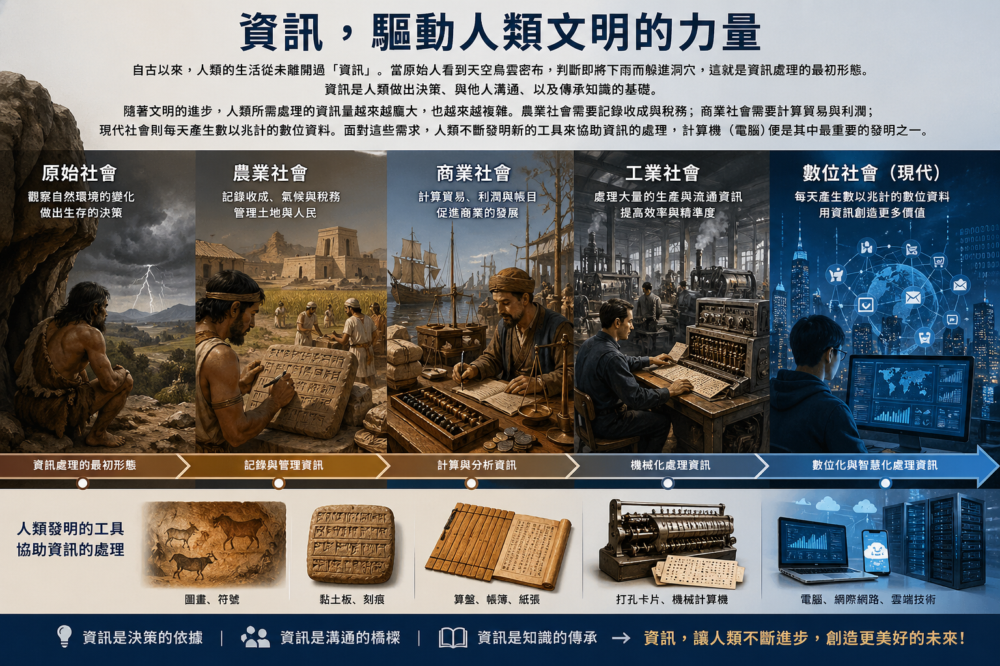

*圖片來源：ChatGPT 生成，由作者審閱其正確性*

### 從資料到資訊，再到知識

人類需要的「資訊」並非憑空而來，而是從「資料」經過蒐集與整合而成，再透過長期累積，才進一步淬鍊為「知識」。在往下討論之前，我們必須先釐清這三個常被混淆的概念：

- **資料（Data）**：是原始、未經處理的符號、數字或文字。例如「25」、「臺北」、「12:00」，這些單獨看起來沒有完整意義的原始素材，就是資料。
- **資訊（Information）**：是將資料經過 **蒐集與整合**、解讀後，對人類有意義的內容。例如「臺北今天中午12點的氣溫是25度」，這就是資訊——它有脈絡、有意義、可以幫助我們做決定。
- **知識（Knowledge）**：是將多筆資訊經過長期累積、歸納後，形成的可重複應用的判斷原則或因果關係。資訊告訴你「發生了什麼」，知識則告訴你「為什麼會這樣、下次該怎麼做」。

簡單來說：**資料經過蒐集與整合後成為資訊；資訊經過長期累積與歸納後成為知識。** 這種從原始資料到可行動知識的層級化理解，也常見於管理資訊系統與知識管理的教材脈絡中（Laudon & Laudon, 2022）。

```
資料（Data） → 資訊（Information） → 知識（Knowledge）
   （蒐集、整合）        （累積、歸納）
```

這個「資料 → 資訊 → 知識」的轉換，具體來說可以拆解為三個步驟：

1. **蒐集（Input）**：透過各種方式收集原始資料。例如：問卷調查、感測器偵測、文件記錄。
2. **整合／處理（Process）**：對資料進行計算、分類、篩選、比較等操作，使其產生脈絡與意義，成為資訊。
3. **應用（Output）**：將資訊用於決策、傳播或保存；當這些決策與應用的經驗不斷累積、歸納，就會沉澱為知識。

這個流程不論在古代還是現代都適用，只是使用的工具從算盤變成了手機等行動裝置、個人電腦、大型超級電腦...。

> **生活例子**：超市收銀機每天掃描數千條商品條碼，這些條碼數字就是「資料」；系統彙整後告訴店長「今天賣出最多的是礦泉水，應該補貨」，這是「資訊」；而店長長期觀察後歸納出「每逢寒流來襲，礦泉水與泡麵的銷量就會上升」，未來只要看到寒流的氣象預報就能提前備貨，這便是「知識」。

> **工業工程例子**：產線上感測器記錄的溫度、轉速數字是「資料」；彙整後顯示「本班次不良率為 3%」是「資訊」；長期累積後歸納出「機台轉速超過每分鐘 2000 轉時，不良率會顯著上升」，就是能協助工程師預防性維護的「知識」。

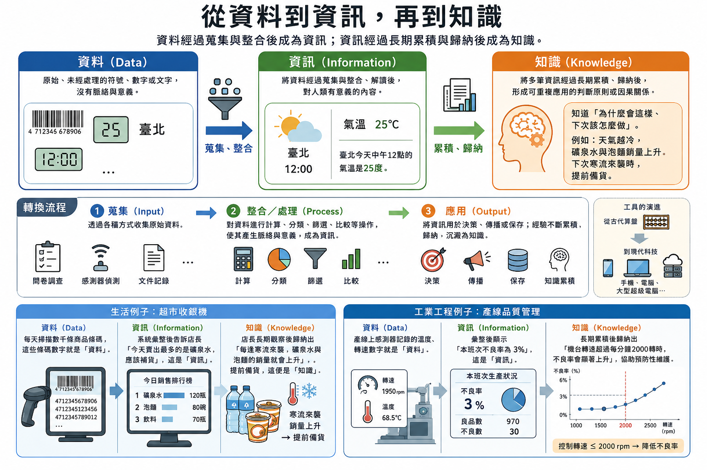

*圖片來源：ChatGPT 生成，由作者審閱其正確性*

### 人類為何需要計算工具

然而，隨著資料量越來越龐大，人腦在蒐集、整合、歸納這些資料時逐漸力不從心：速度慢、容易疲勞、可能犯錯。為了彌補這些不足，人類發展出各種計算工具，追求速度、精確度、容量與自動化；這些需求正是早期計算工具與後來電腦發展的重要驅動因素（Aspray, 1990; Campbell-Kelly et al., 2018）。

- **速度**：更快完成計算任務
- **精確度**：減少人為錯誤
- **容量**：處理超出人腦記憶範圍的資料量
- **自動化**：讓機器代替人力執行重複性工作

---

## 二、早期資訊處理與計算工具

### 在講計算機之前，同學要先釐清...

> 請注意這裡討論的都只是「計算工具」，連「計算機」都還談不上。

為什麼這裡講的「計算工具」都不是「計算機」？首先我們要先定義「計算機」。

> 廣義而言，**計算機（Computer）** 是指：任何能夠接受輸入資料、執行處理操作、並產生輸出結果的裝置。

然而，在有計算機之前，人類先經歷了「**計算工具**」的階段。這類工具僅是以簡單物理構造處理數值，藉由物理結構的位移或刻度對位，以簡單的機械動作處理特定數值或資料的輔助工具。例如：你的雙手、算盤、日晷、沙漏、計算尺...，雖然這些工具都是輔助計算，但仍然不是計算機。

隨著人類日漸有更多資料處理的需求，希望能夠更快更好的處理複雜資料，更為複雜的「[機械計算機（Mechanical Calculator）](https://zh.wikipedia.org/wiki/%E6%9C%BA%E6%A2%B0%E8%AE%A1%E7%AE%97%E6%9C%BA)或[電力機械計算機（Electromechanical Computer）](https://en.wikipedia.org/wiki/Mechanical_computer#Electro-mechanical_computers)」才在這樣的背景下誕生。這些機器不再只是單純的刻度對位，而是利用齒輪、槓桿、凸輪等機械元件，將算術運算的「邏輯」實體化。其動力來源包括人力（手搖）、獸力，乃至後來的蒸汽機與電力。

它們第一次把運算的「思考過程」做進齒輪與槓桿的硬體裡，也成為後來「[電子計算機 (Electronic Computer)](https://zh.wikipedia.org/zh-tw/%E7%94%B5%E5%AD%90%E8%AE%A1%E7%AE%97%E5%99%A8)」的邏輯前身。

因此，「**計算機**」其實並非專指現代的個人電腦、電腦伺服器或行動裝置，而是 **泛指所有能夠接受輸入資料、執行處理操作、並產生輸出結果的裝置**。只不過因為現代都是以電子計算機為主流，因此一般來說，我們講到「計算機」，通常指的是「電子計算機」。

根據其運作媒介與能量來源的不同，我們可以將其視為一個演進的光譜：

| 分類                                   | 定義說明                        | 運作原理與媒介                        | 典型代表         |
| ------------------------------------ | --------------------------- | ------------------------------ | ------------ |
| 計算工具 (Calculation Tool)              | 以簡單器械處理特定數值或資料，作為人腦的延伸。     | 依賴物理構造的對位或位移（如長度、撥珠），無自動化邏輯。   | 計算尺、算盤       |
| 機械計算機 (Mechanical Computer)          | 利用機械連動模擬運算邏輯，能自動執行部分計算過程。   | 以人力、獸力或蒸汽推動齒輪、槓桿、凸輪等元件。        | 帕斯卡加法器、差分機   |
| 電力機械計算機 (Electromechanical Computer) | 介於機械與電子的過渡類型，利用電力驅動機械開關。    | 利用繼電器（Relays）或開關的物理動作來傳遞訊號與運算。 | 哈佛一號（Mark I） |
| 電子計算機 (Electronic Computer)          | 完全透過電子流動進行運算，擺脫了物理元件的慣性與限制。 | 以電力為能量，透過真空管、電晶體或晶片等電子元件運作。    | ENIAC、現代筆電   |

> 不過這裡同學請先把「計算機」放在一邊，以下我們討論的是「計算工具」

### 1. 原始計算方式

人類最早的計算工具，其實就是自己的身體與簡單的工具。從手指計數、刻痕、算籌到算盤，這些工具反映了人類將抽象數量外化為可操作符號與物件的長期歷史（Aspray, 1990; Ifrah, 2000）。

- **手指計數**：是最直觀的計算方式，也是「[十進位](https://zh.wikipedia.org/zh-tw/%E5%8D%81%E8%BF%9B%E5%88%B6#%E6%9D%A5%E6%BA%90)」系統得以誕生的根本原因——因為人有十根手指。當數量超過十，人類便開始尋找其他輔助方式。

- **結繩記事**：是許多古文明共同發展出的方法，藉由在繩子上打不同類型的結，記錄數量或事件。南美洲的印加帝國就擁有一套精密的結繩記數系統，稱為「[奇普（Quipu）](https://zh.wikipedia.org/zh-tw/%E5%A5%87%E6%99%AE)」，用以管理帝國的稅收與人口統計。

- **刻痕記錄**：則是在骨頭、木頭或石頭上刻下痕跡以計數。目前已知最古老的計數骨頭——「[伊尚戈骨頭（Ishango Bone）](https://zh.wikipedia.org/zh-tw/%E4%BC%8A%E5%B0%9A%E6%88%88%E9%AA%A8)」，距今約兩萬年，上面刻有一系列刻痕，可能是人類早期的計數或曆法紀錄。

- **石子與貝殼**：計數也廣泛流行，透過移動實物來對應數量，這正是「算盤」的概念雛形。

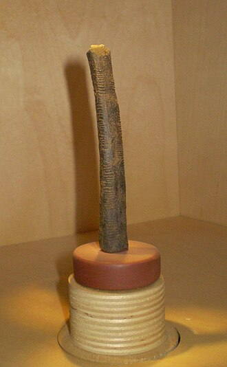

*圖片來源：[維基共享資源「Os d'Ishango IRSNB.JPG」](https://commons.wikimedia.org/wiki/File:Os_d%27Ishango_IRSNB.JPG)，作者 Ben2，授權 CC BY-SA 3.0*

> **趣味小知識**：不是所有文明都採用十進位。馬雅文明把手指和腳趾都算進去，發展出「二十進位」系統；巴比倫人則使用「六十進位」——這正是為什麼今天的時鐘是 60 分鐘、60 秒，圓一圈是 360 度，這些看似「不方便」的數字，其實是四千多年前巴比倫人計數習慣留下的痕跡。

### 2. 古文明的計算與記錄

隨著定居農業與城市文明的出現，資訊處理的需求急劇上升，各大古文明發展出各自的計算與記錄系統。

- **蘇美文明的記帳系統**：約五千年前，位於現今伊拉克的蘇美文明（Sumer）發展出楔形文字，主要用於商業記帳——記錄穀物、牲畜與土地的交易。這可說是人類史上最早的「資料庫」。

- **古埃及的土地測量**：尼羅河每年氾濫後，土地邊界會消失，埃及人必須重新測量土地、分配農地。這促使幾何學（Geometry，源自希臘語，意為「土地測量」）的誕生，展示了數學在實際生活中的應用。

- **天文與曆法計算**：古代美索不達米亞、埃及、馬雅等文明，都對天文現象進行精密觀測，計算日月星辰的運行週期，制定曆法以指導農業活動。這些複雜計算是當時最高階的「資訊處理」活動。


*圖片來源：[維基共享資源「Rope stretching」](https://commons.wikimedia.org/wiki/File:Rope_stretching.jpg)*

### 3. 早期工具

- **算盤（Abacus）**：算盤是人類最重要的早期計算工具之一，約在西元前2000至3000年間出現於中東或中國。透過撥動珠子在固定欄位上的位置，可以快速執行加減運算，熟練的使用者甚至能與計算機一較高下。算盤用的正是「位值制」：同一顆珠子擺在不同欄位，就代表不同的值（個位、十位、百位……）。

- **計算板（Counting Board）**：古希臘羅馬時代廣泛使用的計算工具，在一張有格線的板上撥動石子或籌碼，功能類似算盤，是西方世界的主流計算工具。

- **日晷（Sundial）**：藉由太陽投射的陰影位置來判讀時間，是古代測量「時間資訊」的主要工具。

- **沙漏**：利用沙子在兩個玻璃球之間流動的速率來計時，適合在陰天或室內使用，是日晷的補充工具。

- **計算尺（Slide Rule）**：在小型的隨身電子計算機出現之前，20世紀的工程師們也會使用「[計算尺](https://zh.wikipedia.org/zh-tw/%E8%AE%A1%E7%AE%97%E5%B0%BA)」，用來進行科學計算。通常由三個互相鎖定的有刻度的長條和一個滑動窗口（稱為游標）組成，看起來就像是一把長尺，工程師滑動它來計算複雜的數學，例如：平方根，指數，對數，和三角函式...。有趣的是，這種計算工具卻無法計算加減法，但是阿波羅登月計劃的工程師與科學家曾經使用它計算飛船軌道，就連愛因斯坦也曾使用過。

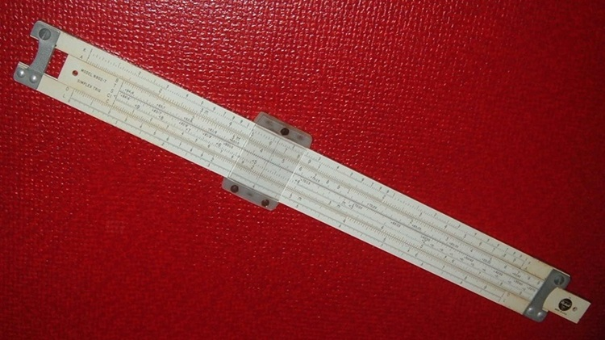

*圖片來源：[維基共享資源「Sliderule.PickettN902T.agr.jpg」](https://commons.wikimedia.org/wiki/File:Sliderule.PickettN902T.agr.jpg)，作者 ArnoldReinhold，授權 CC BY-SA 3.0*

> **趣味小知識**：1946年，東京曾舉辦一場轟動一時的「算盤 vs. 電動計算機」對決：日本郵政職員松崎清使用傳統算盤，對上使用當時最先進電動計算機的美軍下士。結果在加法、減法、除法與混合運算等項目中，算盤幾乎全勝，電動計算機只在乘法項目扳回一城。工具的新舊，有時比不上使用者的熟練程度。

> **小結**：人類早期的計算工具雖然簡單，但它們展現了一個不變的本質——人類永遠在尋找更有效率的方式來處理資訊。

---

## 三、機械式計算機時代

> 本章節由於提及的計算機繁多，如果每個計算機都加入圖片說明會相當繁雜，老師在重要的項目中增加圖片說明，但是仍建議同學可以延伸閱讀附加的超連結，以增加印象。

### 1. 機械計算機的出現

進入十七世紀，隨著科學革命的興起，人們對於精確計算的需求大幅提升。天文、航海、工程與稅務行政對大量準確計算的需求，推動了機械計算機的出現（Aspray, 1990; Campbell-Kelly et al., 2018）。

天文學家需要計算行星軌道、工程師需要計算結構荷重、政府需要統計稅賦。人力計算不僅耗時，且容易出錯。於是，科學家與發明家開始思考：能否製造一部機器，來代替人腦執行計算？

### 2. 代表性機械計算機

[巴斯卡加法器（Pascaline，1642年）](https://zh.wikipedia.org/zh-tw/%E6%BB%BE%E8%BC%AA%E5%BC%8F%E5%8A%A0%E6%B3%95%E5%99%A8)

法國數學家[布萊茲·巴斯卡（Blaise Pascal）](https://zh.wikipedia.org/zh-tw/%E5%B8%83%E8%8E%B1%E6%96%AF%C2%B7%E5%B8%95%E6%96%AF%E5%8D%A1)為了幫助擔任稅務官的父親計算稅款，在19歲時發明了這台機械加法器。它透過一系列相互連動的齒輪，完成加法與減法運算——當一個齒輪轉滿十格，就會自動撥動下一個齒輪前進一格，實現「進位」。這個設計與今天電腦的二進位進位原理，在本質上是相通的。

[差分機（Difference Engine，1820年代）](https://zh.wikipedia.org/zh-tw/%E5%B7%AE%E5%88%86%E6%A9%9F)

英國數學家[查爾斯·巴貝奇（Charles Babbage）](https://zh.wikipedia.org/zh-tw/%E6%9F%A5%E5%B0%94%E6%96%AF%C2%B7%E5%B7%B4%E8%B4%9D%E5%A5%87)觀察到當時大量手工計算的數學表（如對數表、三角函數表）充滿錯誤，便設計了「差分機」——一台能自動計算多項式函數並列印結果的大型機械計算機。雖然礙於當時的製造技術，差分機在巴貝奇生前始終未能完成，但其設計概念極為先進。倫敦科學博物館後來依照巴貝奇的圖紙建造了一台完整的差分機，證明設計本身是正確可行的。

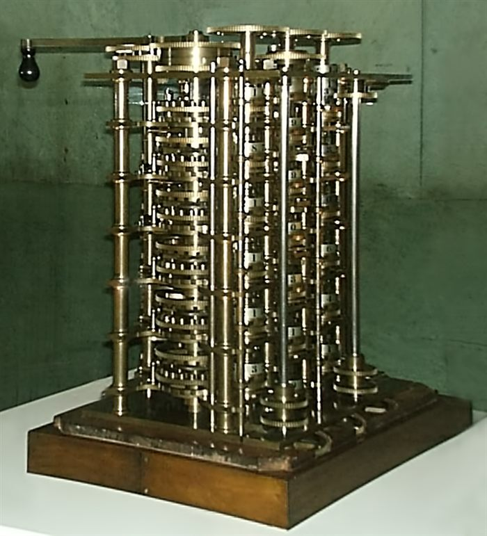

*圖片來源：[維基共享資源「Babbages difference engine 1832.jpg」](https://commons.wikimedia.org/wiki/File:Babbages_difference_engine_1832.jpg)，作者 Sebastian Wallroth，授權 Public Domain*

[分析機（Analytical Engine，1830年代）](https://zh.wikipedia.org/zh-tw/%E5%88%86%E6%9E%90%E6%A9%9F)

這是巴貝奇更宏大的構想：一台 **通用** 的機械計算機，能根據不同的指令執行各種運算——不僅限於特定類型的數學計算。分析機之所以重要，是因為它已經包含輸入、儲存、運算與輸出等後來通用電腦的基本構想（Aspray, 1990; Campbell-Kelly et al., 2018）。分析機包含了現代電腦的幾個核心概念：

- **輸入（Input）**：透過打孔卡片輸入資料與指令
- **記憶（Store）**：儲存中間計算結果
- **運算（Mill）**：執行算術與邏輯運算
- **輸出（Output）**：列印計算結果

英國數學家[愛達·勒芙蕾絲（Ada Lovelace）](https://zh.wikipedia.org/zh-tw/%E6%84%9B%E9%81%94%C2%B7%E5%8B%92%E8%8A%99%E8%95%BE%E7%B5%B2)為分析機撰寫了一套計算白努利數的演算法，被許多人視為 **史上第一位程式設計師**。她已經看出分析機的潛力不限於數學計算，還可能延伸到音樂創作或符號處理。


*圖片來源：[維基共享資源「Ada Lovelace portrait.jpg」](https://commons.wikimedia.org/wiki/File:Ada_Lovelace_portrait.jpg)，作者 Alfred Edward Chalon，授權 Public Domain*

> **趣味小知識**：愛達·勒芙蕾絲的父親，正是著名的浪漫主義詩人拜倫勳爵（Lord Byron）。愛達出生沒多久父母便分居，母親擔心她遺傳到拜倫「詩人的瘋狂」，刻意安排她自小接受嚴格的數學與科學教育——沒想到這個決定，意外造就了史上第一位程式設計師。

### 3. 核心概念

**程式化（Programmability）**：分析機最革命性的創新，在於它可以被「程式化」——透過改變指令，讓同一台機器執行不同的任務。這與只能執行固定計算的算盤或差分機截然不同。

**打孔卡片的概念**：利用卡片上有孔/無孔的位置來代表不同的指令或資料，是一種早期的「數位」編碼方式。這個概念最早來自法國紡織業的[提花織布機（Jacquard Loom）](https://zh.wikipedia.org/zh-tw/%E9%9B%85%E5%8D%A1%E5%B0%94%E7%BB%87%E5%B8%83%E6%9C%BA)，巴貝奇將其引入計算領域。

**通用計算機的雛形**：分析機的設計，讓人類第一次有了「通用計算機」的概念——一台可以透過改變程式來解決任何數學問題的機器，這個夢想在一百年後由電子計算機實現。

### 4. 限制

儘管理念先進，機械計算機面臨嚴重的限制：

- **只能解決特定問題**：大多數機械計算機只能執行有限種類的運算，缺乏真正的通用性。
- **機械複雜度高**：精密的齒輪系統對製造精度要求極高，在十九世紀的工業水準下幾乎無法實現。
- **速度慢**：機械傳動的速度遠不如後來的電氣元件。
- **維護困難**：複雜的機械結構容易磨損、故障，且難以修復。

---

## 四、電力與機電式計算機

### 1. 電力的導入

十九世紀末，電力技術成熟，開始被用來驅動計算與資料處理設備。特別是打孔卡與機電式製表設備，使資料處理從人工統計逐步轉向大規模自動化（Campbell-Kelly et al., 2018）。

**電動馬達** 的應用讓計算機不再依賴人力搖動，大幅提升了運算速度與穩定性。這個時期的計算機結合了機械元件（如齒輪、凸輪）與電力驅動，形成「機電式（Electromechanical）」系統——機械負責計算邏輯，電力負責提供動力與控制信號。

### 2. 重要發展

**Hollerith 打孔卡系統**

美國發明家[赫爾曼·霍勒里斯（Herman Hollerith）](https://zh.wikipedia.org/zh-tw/%E8%B5%AB%E7%88%BE%E6%9B%BC%C2%B7%E4%BD%95%E6%A8%82%E7%A6%AE)在十九世紀末發明了一套利用打孔卡片處理資料的電動機器系統。卡片上不同位置的孔洞代表不同的資料（如性別、年齡、職業），機器透過金屬探針感測孔洞位置，自動完成統計分析。

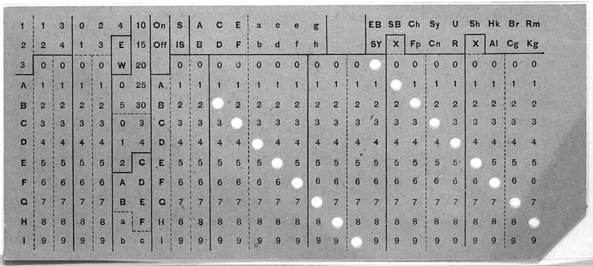

*圖片來源：[維基共享資源「Hollerith Punched Card.jpg」](https://commons.wikimedia.org/wiki/File:Hollerith_Punched_Card.jpg)，美國國會圖書館館藏，授權 Public Domain*

**人口普查自動化**

1890年，美國政府面臨嚴重挑戰：1880年的人口普查花了整整七年才完成統計，而人口規模還在持續增長，1890年的普查若沿用舊方法，恐怕要等到下一次普查才能完成。霍勒里斯的打孔卡系統被採用後，僅花了 **六週** 就完成了基本統計，大幅展示了自動化資料處理的威力。

霍勒里斯後來成立的公司，幾經合併後，成為了日後的[IBM（國際商業機器公司）](https://zh.wikipedia.org/wiki/%E8%AE%A1%E7%AE%97%E5%88%97%E8%A1%A8%E7%BA%AA%E5%BD%95%E5%85%AC%E5%8F%B8)，這家公司在二十世紀的電腦發展史上舉足輕重。

何樂禮的系統除了打孔卡片外，還包含兩項關鍵設備：讀取卡片並自動累計統計數字的 **製表機（Tabulator）**，以及依卡片孔洞位置自動分類、歸檔卡片的 **分類機（Sorter）**。

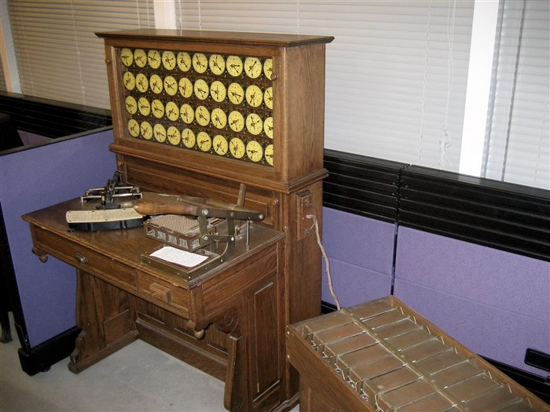

*圖片來源：[維基共享資源「HollerithMachine.CHM.jpg」](https://commons.wikimedia.org/wiki/File:HollerithMachine.CHM.jpg)，攝影 Adam Schuster，授權 CC BY 2.0*

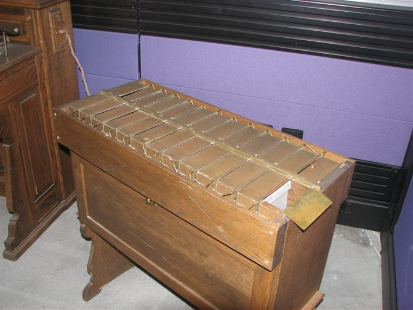

*圖片來源：[維基共享資源「Hollerith punch-card sorter」](https://commons.wikimedia.org/wiki/File:Hollerith_punch-card_sorter_(2586173692).jpg)，攝影 Erik Pitti，授權 CC BY 2.0*

> **趣味小知識**：霍勒里斯設計的打孔卡片，尺寸剛好和當時美國的一美元紙鈔一模一樣——因為他直接借用了美國財政部原本用來裁切紙鈔的機器來裁切卡片，索性沿用了同樣的尺寸。這個「美鈔尺寸」的打孔卡規格，後來竟沿用了超過半個世紀。

### 3. 資料處理的進步

這個時期帶來了幾項重要的資訊處理突破：

**資料儲存與分類**：打孔卡片不只是計算工具，更是一種資料儲存媒介。大量的卡片可以按照需要排序、分類、重新組合，實現了靈活的「資料庫」功能。

**自動化統計**：機電式系統能自動計算各種統計數字（人口總數、各地區人口、職業分布等），遠比人工計算更快速且準確，這正是「自動化資料處理」的起點。

> **時代意義**：機電式計算機是從純機械到電子計算機的重要橋梁。它們證明了電力可以大幅提升計算效率，也讓人類開始構想更進一步的自動化可能性。

---

## 五、電子計算機的誕生

### 1. 電子元件的導入

二十世紀初，物理學與電子工程的快速發展，帶來了全新的計算可能性。電子元件取代機械運動後，計算速度與可靠性都出現質變，這也奠定第一代電子計算機的技術基礎（Ceruzzi, 2003; Petzold, 2022）。相較於機械齒輪，**電子元件** 具有幾個革命性的優勢：速度快（電子訊號接近光速傳遞）、無機械磨耗、可以微型化。

[真空管（Vacuum Tube）](https://zh.wikipedia.org/wiki/%E7%9C%9F%E7%A9%BA%E7%AE%A1)：真空管是一種能控制電子流動的電子元件，可作為電子開關（開/關）或訊號放大器。它的「開/關」兩種狀態，完美對應了二進位系統的「0/1」，成為第一代電子計算機的核心元件。

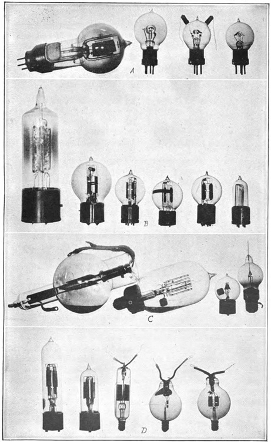

*圖片來源：[維基共享資源「Early triode vacuum tubes.jpg」](https://commons.wikimedia.org/wiki/File:Early_triode_vacuum_tubes.jpg)，美國訊號兵團 1918 年刊物，授權 Public Domain*

[繼電器（Relay）](https://zh.wikipedia.org/zh-tw/%E7%BB%A7%E7%94%B5%E5%99%A8)：繼電器是利用電磁原理控制開關的機電元件，速度比純機械裝置快，但仍不及真空管。早期電子計算機曾大量使用繼電器。

**電容與電子電路**：電容能儲存微量電荷，配合電阻、電感等元件組成各種功能的電子電路，為計算機提供了豐富的「積木」。這樣的思路一路延續到今天——現代電腦主機板上隨處可見的積體電路（IC），本質上就是把電晶體、電容、電阻等電子元件大量濃縮到一小片晶片上。

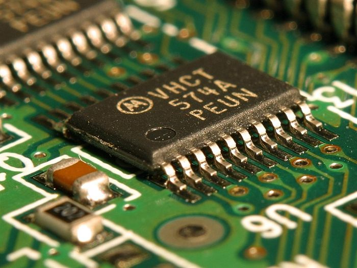

*圖片來源：[維基共享資源「Integrated circuit on microchip.jpg」](https://commons.wikimedia.org/wiki/File:Integrated_circuit_on_microchip.jpg)，作者 Jon Sullivan，授權 Public Domain*

### 2. 第一台電子計算機

[ABC 計算機（Atanasoff-Berry Computer，1942年）](https://zh.wikipedia.org/zh-tw/%E9%98%BF%E5%A1%94%E7%BA%B3%E7%B4%A2%E5%A4%AB-%E8%B4%9D%E7%91%9E%E8%AE%A1%E7%AE%97%E6%9C%BA)

由美國物理學家[約翰·阿塔納索夫（John Atanasoff）](https://zh.wikipedia.org/zh-tw/%E7%BA%A6%E7%BF%B0%C2%B7%E6%96%87%E6%A3%AE%E7%89%B9%C2%B7%E9%98%BF%E5%A1%94%E7%BA%B3%E7%B4%A2%E5%A4%AB)與研究生克利福·貝瑞（Clifford Berry）在愛荷華州立大學建造。ABC 是第一台使用 **電子元件**（真空管）執行計算的機器，也首次採用了二進位運算與電容記憶體。由於當時未能申請專利，其歷史地位長期被忽略，直到法院判決才確認其先驅地位。

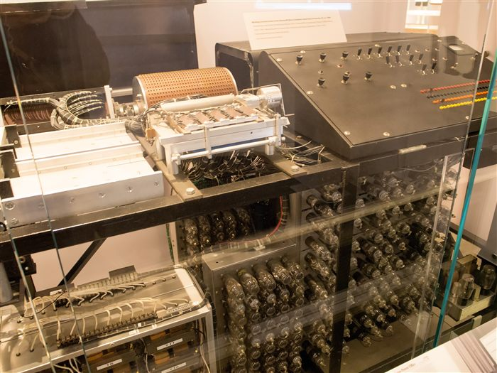

*圖片來源：[維基共享資源「Atanasoff-Berry Computer」](https://commons.wikimedia.org/wiki/File:Atanasoff-Berry_Computer_%E3%83%BC_Computer_History_Museum_(30781535612).jpg)，攝影 Ik T，授權 CC BY 2.0*

[ENIAC（Electronic Numerical Integrator and Computer，1945年）](https://zh.wikipedia.org/zh-tw/%E9%9B%BB%E5%AD%90%E6%95%B8%E5%80%BC%E7%A9%8D%E5%88%86%E8%A8%88%E7%AE%97%E6%A9%9F)

ENIAC 是美國賓州大學為美國陸軍建造的大型電子計算機，用於計算砲兵射擊表。它是第一台 **通用電子計算機**，主要規格令人印象深刻：

| 特徵 | 數據 |
|------|------|
| 真空管數量 | 約 17,468 個 |
| 重量 | 約 30 公噸 |
| 佔地面積 | 約 167 平方公尺（半個籃球場） |
| 耗電量 | 約 150 千瓦 |
| 計算速度 | 每秒可執行 5,000 次加法 |

ENIAC 的速度比當時所有機械或機電計算機都快上數千倍，電子計算的時代由此開始。

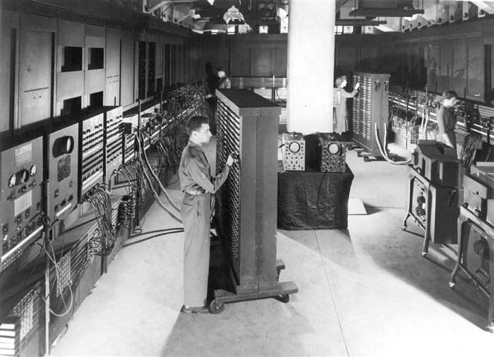

*圖片來源：[維基共享資源「Classic shot of the ENIAC」](https://commons.wikimedia.org/wiki/File:Classic_shot_of_the_ENIAC_(full_resolution).jpg)，美國陸軍攝影，授權 Public Domain*

> **趣味小知識**：ENIAC 啟動時，據說費城附近的燈光會因為其耗電量而短暫變暗。早期電腦不只佔地廣大，與現代的 AI 伺服器一樣都是「**吃電大戶**」。

---

## 六、電腦世代演進

電腦的發展歷史通常按照核心技術元件，區分為四個主要世代。每一個世代的更迭，都帶來了性能的大幅躍升與體積的顯著縮小；這種分期方式常用於電腦史與資訊科技導論教材中，用來說明真空管、電晶體、積體電路與微處理器之間的技術替代關係（Campbell-Kelly et al., 2018; Ceruzzi, 2003）。

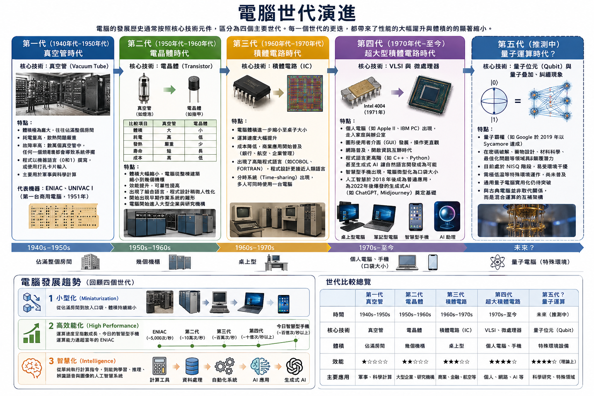

*本圖由 ChatGPT 生成，已由作者審核內容正確性*

### 第一代（1940年代–1950年代）：真空管時代

**核心技術**：真空管（Vacuum Tube）

**特點**：
- 體積 **極為龐大**，往往佔滿整個房間
- **耗電量高**，散熱問題嚴重
- **故障率高**：數萬個真空管中，任何一個燒壞都會導致系統停擺
- 程式以 **機器語言**（0和1）撰寫，或使用打孔卡片輸入
- 主要用於軍事與科學計算

**代表機器**：ENIAC、[UNIVAC I](https://en.wikipedia.org/wiki/UNIVAC_I)（第一台商用電腦，1951年）

---

### 第二代（1950年代–1960年代）：電晶體時代

**核心技術**：電晶體（Transistor）

1947年，[貝爾實驗室](https://zh.wikipedia.org/zh-tw/%E8%B4%9D%E5%B0%94%E5%AE%9E%E9%AA%8C%E5%AE%A4)的科學家發明了電晶體。電晶體同樣可以作為電子開關，但相較於真空管有著革命性的優勢：

| 比較項目 | 真空管 | 電晶體 |
|---------|-------|-------|
| 體積 | 大（如燈泡） | 小（如指甲） |
| 耗電 | 高 | 低 |
| 發熱 | 嚴重 | 少 |
| 壽命 | 短 | 長 |
| 成本 | 高 | 低 |

**特點**：
- 體積大幅縮小，電腦從整棟建築縮小到幾個機櫃
- 效能提升，可靠性提高
- 出現了[組合語言（Assembly Language）](https://zh.wikipedia.org/zh-tw/%E6%B1%87%E7%BC%96%E8%AF%AD%E8%A8%80)，程式設計稍微人性化
- 開始出現早期 **作業系統** 的雛形
- 電腦開始進入大型企業與研究機構

> **有趣小知識**：老師某日在 [facebook 上面看到一篇文章](https://www.facebook.com/share/p/18KB2JtmDi/)，以下是它的簡要內容 **（由於圖片有版權限制，建議同學連進去看看裡面的電腦與打孔卡片的照片）**：

> 1970 年代末期，台灣的大學電腦教育正處於萌芽階段。當時電腦資源極其昂貴且稀缺，一台包含螢幕與磁碟機的 Apple II 個人電腦售價高達二十多萬元，遠非一般學生所能觸及。學生要學習程式，全靠學校唯一的電腦主機與打孔卡系統。

> 文章中指出當時學校引進國稅局退役的 CDC 6400 主機，並搭配 IBM 029 打孔機。由於 CDC 的 BCD 碼與 IBM 的 EBCDIC 碼不盡相同，學生打孔時還得對照字碼表。在沒有色帶印出文字的設備下，學生甚至要練就直接看孔洞猜字碼的本事。當時一行程式就是一張卡片，一份作業往往動輒兩百張卡片，若不慎摔落地上簡直是災難。

> 程式寫好後，需交由電腦室職員批次讀卡，隔天才能拿到印表機輸出的結果。由於缺乏專業資訊師資，學生遇到除錯或 JCL 指令問題，多半只能求助機房人員或自行摸索。

> 在那個記憶體與算力均極為昂貴的年代，編寫程式講求高度精簡。雖然主機計算能力無法與現代手機相比，但專用機房的高速行式印表機一秒能印 20 行，若指令寫錯導致每行換頁，瞬間就會印出數十頁報表。這段必須手抓打孔卡、等待隔天報表的歷程，真實記錄了早期台灣資訊開拓者的艱辛與趣味。

---

### 第三代（1960年代–1970年代）：積體電路時代

**核心技術**：[積體電路（Integrated Circuit，IC）](https://zh.wikipedia.org/zh-tw/%E9%9B%86%E6%88%90%E7%94%B5%E8%B7%AF)

積體電路（又稱「晶片」）是將多個電晶體、電阻、電容等電子元件，透過微影技術 **整合在一片矽晶片** 上的技術，由[傑克·基爾比（Jack Kilby）](https://zh.wikipedia.org/zh-tw/%E5%82%91%E5%85%8B%C2%B7%E5%9F%BA%E7%88%BE%E6%AF%94)與[羅伯特·諾伊斯（Robert Noyce）](https://zh.wikipedia.org/zh-tw/%E7%BD%97%E4%BC%AF%E7%89%B9%C2%B7%E8%AF%BA%E4%BC%8A%E6%96%AF)分別在1958-1959年間發明。

**特點**：
- 電腦體積進一步縮小至桌子大小
- 運算速度大幅提升
- 成本降低，**商業應用** 開始普及（銀行、航空、企業管理）
- 出現了 **高階程式語言**（如[COBOL](https://en.wikipedia.org/wiki/COBOL)、[FORTRAN](https://zh.wikipedia.org/zh-hk/Fortran%E7%BC%96%E7%A8%8B%E8%AF%AD%E8%A8%80)），程式設計更接近人類語言
- [分時系統（Time-sharing）](https://zh.wikipedia.org/zh-tw/%E5%88%86%E6%99%82%E7%B3%BB%E7%B5%B1)出現，多人可同時使用一台電腦

---

### 第四代（1970年代–至今）：超大型積體電路時代

**核心技術**：[超大型積體電路（Very Large Scale Integration，VLSI）](https://zh.wikipedia.org/zh-tw/%E8%B6%85%E5%A4%A7%E8%A7%84%E6%A8%A1%E9%9B%86%E6%88%90%E7%94%B5%E8%B7%AF)與微處理器

1971年，[英特爾（Intel）](https://zh.wikipedia.org/zh-tw/%E8%8B%B1%E7%89%B9%E5%B0%94)推出了世界上第一個商業化的[微處理器（Microprocessor）](https://zh.wikipedia.org/zh-tw/%E5%BE%AE%E5%A4%84%E7%90%86%E5%99%A8)——[Intel 4004](https://zh.wikipedia.org/wiki/Intel_4004)，將完整的運算單元整合在一片晶片上。隨著製程技術不斷進步，單一晶片上可容納的電晶體數量呈指數成長（遵循著名的[摩爾定律](https://zh.wikipedia.org/zh-tw/%E6%91%A9%E5%B0%94%E5%AE%9A%E5%BE%8B)：每約兩年，晶片上的電晶體數量翻倍）。

**特點**：
- [個人電腦（Personal Computer，PC）](https://zh.wikipedia.org/zh-tw/%E4%B8%AA%E4%BA%BA%E7%94%B5%E8%84%91) 的出現（如 [Apple II](https://en.wikipedia.org/wiki/Apple_II)、[IBM PC](https://zh.wikipedia.org/zh-tw/IBM_PC)）
- 電腦走入家庭與辦公室，成為個人工具
- [圖形使用者介面（GUI）](https://zh.wikipedia.org/zh-tw/%E5%9B%BE%E5%BD%A2%E7%94%A8%E6%88%B7%E7%95%8C%E9%9D%A2)的發展，讓電腦操作更直觀
- 網路的普及，開啟了資訊互聯的時代
- 更高階的程式語言出現，更接近人類語言（例如：[C++](https://zh.wikipedia.org/zh-tw/C++%E8%AF%AD%E8%A8%80)、[Python](https://zh.wikipedia.org/zh-hant/Python%E8%AF%AD%E8%A8%80)），甚至生成式AI讓自然語言可以開發電腦軟體成為現實
- 智慧型手機的出現，讓電腦進一步微型化為口袋大小
- 人工智慧於2018年後成為普遍性的應用，這些進展正是2022年後爆發的生成式AI（如 [ChatGPT](https://en.wikipedia.org/wiki/ChatGPT), [Midjourney](https://en.wikipedia.org/wiki/Midjourney)）的技術基礎
---

### 第五代（推測中）：量子運算時代？

> 第五代電腦就是「量子運算」的說法，還沒有得到普遍學術與實務界的認可，同學不妨未來多加關注。

**核心技術**：量子位元（Qubit）與量子疊加、糾纏現象

若傳統電腦的演進是以物理元件的革新為指標（從電子管、電晶體到積體電路），那麼量子電腦則代表了從「**古典物理**」跨越到「**量子物理**」的本質性飛躍。量子電腦利用[量子位元（Quantum Bit，Qubit）](https://zh.wikipedia.org/zh-tw/%E9%87%8F%E5%AD%90%E4%BD%8D%E5%85%83) 取代傳統的二進位位元，藉由[疊加（Superposition）](https://zh.wikipedia.org/zh-tw/%E5%8F%A0%E5%8A%A0%E6%80%81) 與[糾纏（Entanglement）](https://zh.wikipedia.org/zh-tw/%E9%87%8F%E5%AD%90%E7%BA%8F%E7%B5%90) 等量子現象，理論上能在特定問題上實現指數級的運算加速。

**特點**：
- [量子霸權（Quantum Supremacy）](https://zh.wikipedia.org/zh/%E9%87%8F%E5%AD%90%E9%9C%B8%E6%AC%8A) 的里程碑（如 [Google](https://zh.wikipedia.org/wiki/Google) 於 2019 年宣稱以 Sycamore 處理器達成）
- 在密碼破解、藥物設計、材料科學、最佳化問題等特定領域具有顛覆性潛力
- 目前仍處於 [NISQ（Noisy Intermediate-Scale Quantum，含噪中等規模量子）](https://zh.wikipedia.org/wiki/%E5%90%AB%E5%99%AA%E5%A3%B0%E4%B8%AD%E5%B0%BA%E5%BA%A6%E9%87%8F%E5%AD%90%E8%AE%A1%E7%AE%97) 階段，容易受環境干擾而出錯
- 需要極低溫（接近絕對零度）等特殊環境運作，尚未走入家庭與一般辦公室
- 儘管目前IBM、Google、大學等機構持續投入，但通用量子電腦的實用化仍有待突破
- 與古典電腦並非取代關係，而是「混合運算（Hybrid Computing）」的互補架構

如果說前四代電腦是「算力的量變」，那麼量子電腦就是「運算本質的質變」。它不僅是速度的提升，更是人類首次利用微觀物理定律直接進行資訊處理，這確實「**可能**」符合第五代電腦作為新時代開端的定義。

### 電腦發展趨勢

回顧四個世代（暫時先忽略可能的第五代），電腦發展呈現出三大清晰的趨勢：

1. **小型化（Miniaturization）**：從佔滿房間到放入口袋，體積持續縮小
2. **高效能化（High Performance）**：運算速度呈指數成長，今日的智慧型手機運算能力遠超當年的ENIAC
3. **智慧化（Intelligence）**：從單純執行計算指令，到能夠學習、推理、辨識語音與圖像的人工智慧系統

> **趣味小知識**：1969年阿波羅11號登陸月球時，負責導航與控制的「阿波羅導引電腦」，運算能力遠遠比不上今天一支普通的智慧型手機。人類就是靠著比現在手機弱上許多的機器，完成了登陸月球這項壯舉。

---

## 七、數位化與電腦運作原理

> **延伸閱讀**：本節只先建立二進位與數位化的基本概念，讓大家理解「為什麼電腦只用 0 和 1」。更完整的進位轉換（十進位／二進位／十六進位互換）、浮點數（IEEE 754）表示法等技術細節，將在 [02-Computer-Structure.md](02-Computer-Structure.md)〈電腦系統架構——資料〉篇中的「資料表示與數位化」「數字系統與進位轉換」「浮點數與 IEEE 754」進一步說明。

### 1. 二進位系統

電腦之所以能處理各種資訊，關鍵在於[二進位（Binary）](https://zh.wikipedia.org/zh-tw/%E4%BA%8C%E8%BF%9B%E5%88%B6)系統。從電路開關、繼電器、邏輯閘到位元表示，二進位之所以成為現代數位電腦的基礎，主要是因為它能以穩定且可工程化的方式對應電子元件的兩種狀態（Petzold, 2022）。

電子元件（如電晶體）最自然的存在狀態只有兩種：**通電（1）** 或 **不通電（0）**。電腦利用這兩種狀態的組合，來表示所有的資料與指令。這種只使用 0 和 1 的數字系統，稱為二進位（Binary，基底為2）。

**為什麼不用十進位？**

雖然人類習慣使用十進位，但要讓電路穩定地區分十種不同電壓等級極為困難，且容易出錯。而只需區分「有電/沒電」兩種狀態則簡單可靠得多。

**二進位計數範例**：

| 十進位 | 二進位 |
|-------|-------|
| 0 | 0000 |
| 1 | 0001 |
| 2 | 0010 |
| 3 | 0011 |
| 4 | 0100 |
| 8 | 1000 |
| 15 | 1111 |

- 1 個[位元（bit）](https://zh.wikipedia.org/zh-tw/%E4%BD%8D%E5%85%83)可表示 2 種狀態（0 或 1）
- 8 個位元（bits）= 1 個[位元組（Byte）](https://zh.wikipedia.org/zh-tw/%E5%AD%97%E8%8A%82)，可表示 2⁸ = 256 種狀態
- 電腦的所有資料——文字、圖片、聲音、影片——最終都是由無數個 0 和 1 所組成的。

### 2. 資料數位化

「數位化」意指將各種現實世界的資訊，轉換成電腦可以處理的 0 和 1 序列。文字、圖像、聲音與影片雖然在人類感知上不同，但在電腦內部都可被編碼為位元序列，再透過軟硬體進行儲存、傳輸與處理（Petzold, 2022）。

**文字（ASCII 編碼）**

[ASCII](https://zh.wikipedia.org/wiki/ASCII)（美國資訊交換標準碼）是最早期的文字編碼標準，用 7 個位元（共128種組合）來對應英文字母、數字與常用符號。例如，大寫字母「A」對應的 ASCII 碼是 65（二進位：1000001）。

然而，128種組合無法涵蓋全球所有語言的字元。為此，現代電腦普遍採用 [Unicode](https://zh.wikipedia.org/zh-hant/%E7%BB%9F%E4%B8%80%E7%A0%81) 編碼標準（如 [UTF-8](https://zh.wikipedia.org/wiki/Utf8)），可以表示超過 14 萬個字元，涵蓋中文、日文、阿拉伯文、甚至表情符號（Emoji）。

> **趣味小知識**：英文字母的大小寫轉換，其實只是「翻轉一個位元」的把戲。大寫「A」的 ASCII 碼是 65（二進位 1000001），小寫「a」是 97（二進位 1100001）——兩者只差在其中一個位元，這也是為什麼程式語言常能用簡單的位元運算，就完成大小寫轉換。

**圖像（像素與RGB）**

數位圖像由無數個微小的彩色方格組成，每個方格稱為[像素（Pixel，Picture Element的縮寫）](https://zh.wikipedia.org/zh-tw/%E5%83%8F%E7%B4%A0)。每個像素的顏色以 [RGB](https://zh.wikipedia.org/zh-hans/%E4%B8%89%E5%8E%9F%E8%89%B2%E5%85%89%E6%A8%A1%E5%BC%8F) 模型表示：

- **R（Red）紅色**：0–255 的數值
- **G（Green）綠色**：0–255 的數值
- **B（Blue）藍色**：0–255 的數值

例如：純紅色是 RGB(255, 0, 0)；純白色是 RGB(255, 255, 255)；純黑色是 RGB(0, 0, 0)。

一張 1920×1080 解析度的全高清圖片，共有 1,920 × 1,080 = 約 200 萬個像素，每個像素需要 3 個 Byte（RGB 各一），未壓縮時約需 6MB 的儲存空間。

**聲音（取樣）**

聲音是連續的模擬波形，數位化的過程稱為[取樣（Sampling）](https://zh.wikipedia.org/zh-tw/%E9%87%87%E6%A0%B7_(%E4%BF%A1%E5%8F%B7%E5%A4%84%E7%90%86))：以固定的時間間隔，記錄聲波在該瞬間的振幅數值。

- **取樣率（Sample Rate）**：每秒取樣次數。CD 音質的取樣率為 44,100 Hz（每秒取 44,100 個樣本）。
- **位元深度（Bit Depth）**：每個樣本的精確度。CD 音質使用 16 位元，代表振幅可分為 2¹⁶ = 65,536 個等級。

取樣率越高、位元深度越大，數位聲音還原的真實感越好，但檔案也越大。

**影片與3D**

- **影片**：本質上是連續播放的圖像序列（每秒 24、30 或 60 張畫面），加上同步的聲音。
- **3D 圖像**：以座標系統描述三維空間中的點、線、面，再透過渲染（Rendering）技術計算光線折射，產生逼真的立體畫面。

### 3. 多媒體資料

**多媒體（Multimedia）** 指的是結合文字、圖像、聲音、動畫與影片的複合型資訊。現代的數位媒體——從 YouTube 影片、串流音樂到電玩遊戲——都是多媒體資料的應用。

電玩遊戲是多媒體技術最複雜的整合應用之一：即時的 3D 場景渲染、音效處理、物理模擬、使用者輸入回應……全都在每秒數十次的運算循環中完成，考驗著電腦的運算極限。

---

## 八、網路與網際網路的發展

> **延伸閱讀**：本節先建立網路與網際網路的發展脈絡；網路拓樸、硬體設備、TCP/IP 各層通訊協定、封包交換、DNS、WWW 運作原理等技術細節，將在 [04-Networks-and-Internet.md](04-Networks-and-Internet.md) 進一步說明。

### 1. 網路起源

[ARPANET](https://zh.wikipedia.org/wiki/ARPANET)（1960年代）

網際網路的前身是[美國國防部高等研究計畫署（ARPA，後更名為 DARPA）](https://zh.wikipedia.org/zh-tw/%E5%9C%8B%E9%98%B2%E9%AB%98%E7%AD%89%E7%A0%94%E7%A9%B6%E8%A8%88%E5%8A%83%E7%BD%B2)所主持的 **ARPANET** 計畫。ARPANET 的發展不只是技術故事，也涉及冷戰研究資助、學術社群協作與開放式網路架構的形成（Abbate, 1999）。其設計目標之一，是建立一個即使部分節點被摧毀（如核戰攻擊），資訊仍能透過其他路徑繼續傳遞的韌性通訊網路。

ARPANET 採用了革命性的「[封包交換（Packet Switching）](https://zh.wikipedia.org/zh-tw/%E5%88%86%E7%BB%84%E4%BA%A4%E6%8D%A2)」技術（相對於傳統電話的「電路交換」），將資料切割成小包裹分別傳送，大幅提升了網路使用效率。

**第一個連線（1969年）**

1969年10月29日，ARPANET 成功地在[加州大學洛杉磯分校（UCLA）](https://zh.wikipedia.org/zh-tw/%E5%8A%A0%E5%B7%9E%E5%A4%A7%E5%AD%A6%E6%B4%9B%E6%9D%89%E7%9F%B6%E5%88%86%E6%A0%A1)與[史丹佛研究院（SRI）](https://zh.wikipedia.org/wiki/%E5%9B%BD%E9%99%85%E6%96%AF%E5%9D%A6%E7%A6%8F%E7%A0%94%E7%A9%B6%E6%89%80)之間傳送了第一條訊息。研究人員嘗試傳送 "LOGIN" 這個字，但系統在傳到第二個字母 "O" 後便當機，因此人類史上第一條網路訊息其實是 **"LO"**。

### 2. 關鍵技術

[TCP/IP 協定](https://zh.wikipedia.org/zh-tw/%E7%B6%B2%E9%9A%9B%E7%B6%B2%E8%B7%AF%E5%8D%94%E8%AD%B0%E5%A5%97%E7%B5%84)

網際網路能夠連結全球數十億台不同廠牌、不同作業系統的裝置，靠的是一套共同遵守的通訊規則——**TCP/IP 協定**（傳輸控制協定/網際網路協定）。從分層模型、位址配置到端對端傳輸控制，網路協定的核心精神是讓異質系統能以共同規則交換資料（Kurose & Ross, 2021; Tanenbaum & Wetherall, 2011）。

- [IP（Internet Protocol）](https://zh.wikipedia.org/zh-tw/%E7%BD%91%E9%99%85%E5%8D%8F%E8%AE%AE)：為網路上每台裝置分配一個唯一的「網際網路位址（IP 位址）」，如同郵件上的地址。
- [TCP（Transmission Control Protocol）](https://zh.wikipedia.org/zh-tw/%E4%BC%A0%E8%BE%93%E6%8E%A7%E5%88%B6%E5%8D%8F%E8%AE%AE)：負責確保資料完整、正確地傳送到目的地，若有封包遺失則要求重傳。

**封包傳輸**

資料在網路上傳輸時，不是整批傳送，而是被切割成許多小的[封包（Packet）](https://zh.wikipedia.org/zh-tw/%E7%B6%B2%E8%B7%AF%E5%B0%81%E5%8C%85)。每個封包帶有目的地位址，可能走不同的路徑抵達目的地，最後再重新組合成完整的資料。這種方式讓網路更有效率、更具容錯能力。

### 3. 全球資訊網（WWW）的發明

[Tim Berners-Lee（提姆·伯納斯-李）](https://zh.wikipedia.org/zh-hant/%E8%92%82%E5%A7%86%C2%B7%E4%BC%AF%E7%B4%8D%E6%96%AF-%E6%9D%8E)

1989年，在[歐洲核子研究組織（CERN）](https://zh.wikipedia.org/zh-hans/%E6%AD%90%E6%B4%B2%E6%A0%B8%E5%AD%90%E7%A0%94%E7%A9%B6%E7%B5%84%E7%B9%94)任職的英國科學家提姆·伯納斯-李，為了解決科學家之間分享研究資料困難的問題，提出了[全球資訊網（World Wide Web，WWW）](https://zh.wikipedia.org/zh-tw/%E4%B8%87%E7%BB%B4%E7%BD%91)的構想，並於1991年正式對外公開。

WWW 建立在三項關鍵技術上：
- [HTML（HyperText Markup Language）](https://zh.wikipedia.org/wiki/HTML)：描述網頁內容與結構的語言
- [HTTP（HyperText Transfer Protocol）](https://zh.wikipedia.org/zh-tw/%E8%B6%85%E6%96%87%E6%9C%AC%E4%BC%A0%E8%BE%93%E5%8D%8F%E8%AE%AE)：網頁資料在網路上傳輸的協定
- [URL（Uniform Resource Locator）](https://zh.wikipedia.org/zh-tw/%E7%BB%9F%E4%B8%80%E8%B5%84%E6%BA%90%E5%AE%9A%E4%BD%8D%E7%AC%A6)：網頁的統一資源定位器（俗稱「網址」）

[超連結（Hyperlink）](https://zh.wikipedia.org/zh-tw/%E8%B6%85%E9%80%A3%E7%B5%90)是 WWW 最重要的創新——透過點擊文字或圖片中的連結，可以立即跳轉到另一個網頁，讓資訊之間形成了相互連結的「蜘蛛網」。伯納斯-李決定將 WWW 的技術開放給全世界免費使用，這個決定深刻地影響了網路的普及速度。

> **注意**：「網際網路（Internet）」和「全球資訊網（WWW）」是不同的概念。網際網路是電腦互相連接的基礎設施（如同公路系統）；WWW 是在網際網路上運行的一種服務（如同在公路上行駛的汽車）。電子郵件、即時通訊等也是在網際網路上運行的服務，但不屬於 WWW。

> **趣味小知識**：全世界第一台網頁伺服器，是伯納斯－李在 CERN 使用的一台 NeXT 電腦。因為當時整個全球資訊網都只靠這一台機器運作，他還特地在機殼上貼了一張警告紙條：「這台機器是伺服器，請勿關機！！」

### 4. 網路的影響

網際網路與 WWW 的普及，對人類社會產生了深遠影響：

**資訊共享**：知識的取得方式從「去圖書館查書」轉變為隨時隨地搜尋。[維基百科（Wikipedia）](https://zh.wikipedia.org/wiki/%E7%BB%B4%E5%9F%BA%E7%99%BE%E7%A7%91)這樣的集體知識庫，讓全球數十億人能免費獲得百科全書級別的資訊。

**全球連結**：電子郵件、社群媒體讓跨越地理的溝通幾乎無成本。全球化的速度因此大幅加快，商業模式、文化交流都產生了根本性的改變。

**去中心化**：傳統媒體（報紙、電視）由少數機構掌控資訊發布；網路讓每個人都可以成為資訊的生產者與傳播者（例如你可以單純在 YouTube 觀看影片，但是也可以成為 [YouTuber](https://zh.wikipedia.org/zh-tw/YouTuber) 製作影片將資訊分享在網路上），改變了社會的資訊生態。

**AI 服務的基礎**：網路同時也是當今 AI 服務得以運作的基礎建設。如果沒有網際網路，AI 就難以取得訓練所需的大量文字、圖片與影音資料，我們也無法隨時透過雲端使用 ChatGPT、語音助理等 AI 服務。換句話說，網際網路本身就是一座持續累積、不斷擴充的巨大資料庫，是 AI 賴以學習與運作的資料來源。

---

## 九、現代資訊系統

> **延伸閱讀**：本節先建立網路化資訊系統、雲端運算與物聯網的基本概念；資訊系統的層級與類型（TPS/MIS/DSS/EIS）、ERP/MES/SCM/CRM 等企業應用系統、資料庫與大數據技術，將在 [05-Information-Systems-and-Database.md](05-Information-Systems-and-Database.md) 進一步說明；物聯網與低功耗網路技術則在 [04-Networks-and-Internet.md](04-Networks-and-Internet.md)〈九、物聯網與低功耗網路〉有更完整的介紹。

### 1. 網路化資訊系統

進入二十一世紀，資訊系統不再是孤立的單一電腦，而是透過網路緊密連結的 **分散式系統**。企業資訊系統的重點也從單一部門自動化，逐步轉向跨流程、跨組織與跨平台的資料整合（Laudon & Laudon, 2022）。

**線上購物**：電子商務平台（如蝦皮、Amazon）整合了商品資料庫、金流系統、物流追蹤、使用者評論……數十個子系統協同運作，讓消費者能在幾次點擊內完成購物，並在幾天內收到商品。

**雲端服務**：使用者不再需要在自己的電腦上安裝所有軟體或儲存所有資料，而是透過網路使用遠端伺服器提供的運算能力與儲存空間。Google 雲端硬碟、Dropbox 等服務，讓資料可以跨裝置同步存取。

**跨系統整合**：現代企業的資訊系統往往涉及多個不同的平台相互溝通，如訂單系統連接庫存系統、庫存系統觸發採購系統、採購系統連接財務系統，形成自動化的業務流程。

### 2. 雲端運算

[雲端運算（Cloud Computing）](https://zh.wikipedia.org/zh-tw/%E9%9B%B2%E7%AB%AF%E9%81%8B%E7%AE%97) 是指透過網際網路（「雲端」是網際網路的象徵性稱呼）提供各種運算資源的模式，使用者按需取用、按量付費，不需自行購置和維護硬體。這種模式將運算、儲存與應用服務平台化，成為現代企業資訊系統與數位服務的重要基礎（Laudon & Laudon, 2022）。

雲端服務通常分為三個層次：

| 層次 | 英文縮寫 | 說明 | 典型範例 |
|-----|---------|-----|---------|
| [軟體即服務](https://zh.wikipedia.org/zh-tw/%E8%BD%AF%E4%BB%B6%E5%8D%B3%E6%9C%8D%E5%8A%A1) | SaaS | 直接使用完整的應用程式 | Gmail、Office 365、Salesforce |
| [平台即服務](https://zh.wikipedia.org/wiki/%E5%B9%B3%E5%8F%B0%E5%8D%B3%E6%9C%8D%E5%8A%A1) | PaaS | 提供開發與部署應用程式的環境 | [Google App Engine](https://zh.wikipedia.org/zh/Google%E6%87%89%E7%94%A8%E6%9C%8D%E5%8B%99%E5%BC%95%E6%93%8E)、[Heroku](https://zh.wikipedia.org/wiki/Heroku) |
| [基礎設施即服務](https://zh.wikipedia.org/zh-tw/%E5%9F%BA%E7%A4%8E%E8%A8%AD%E6%96%BD%E5%8D%B3%E6%9C%8D%E5%8B%99) | IaaS | 提供虛擬化的硬體資源 | [AWS EC2](https://zh.wikipedia.org/wiki/Amazon_EC2)、[Microsoft Azure](https://zh.wikipedia.org/zh-tw/Microsoft_Azure_%E9%9B%B2%E7%AB%AF%E6%9C%8D%E5%8B%99) |

雲端運算的優點包括：彈性擴展（需求增加時可快速增加資源）、降低初期投資成本、以及讓企業專注於核心業務而非 IT 基礎設施維護。

### 3. 物聯網（IoT）

[物聯網（Internet of Things，IoT）](https://zh.wikipedia.org/zh-tw/%E7%89%A9%E8%81%94%E7%BD%91) 是指將各種實體裝置（家電、交通工具、工廠機器、醫療設備……）連接到網際網路，使其能夠感測環境、收集資料並相互通訊的技術。

**智慧設備範例**：
- **智慧家居**：智慧冰箱能偵測食材不足並自動購買；智慧空調根據在家/外出狀態自動調整溫度
- **智慧城市**：路燈根據行人流量自動調整亮度；停車場即時顯示空位資訊
- **工業IoT**：工廠機器的感測器即時回傳運作狀態，預測維修需求以避免突發停機

**即時資料收集**：IoT 設備持續不斷地產生大量感測資料，這些資料被傳送到雲端平台進行即時分析，支援各種智慧化應用。物聯網與雲端運算、大數據分析、人工智慧的結合，正在催生新一波的數位化革命。

---

## 十、人工智慧與未來科技

> **延伸閱讀**：本節先建立 AI、機器學習、深度學習的基本概念與未來趨勢；機器學習的訓練原理、神經網路架構、生成式 AI 與 Transformer、AI 代理人等技術細節，將在 [06-Data-Science-AI-and-Smart-Manufacturing.md](06-Data-Science-AI-and-Smart-Manufacturing.md) 進一步說明。

### 1. AI 基本概念與應用領域

[人工智慧（Artificial Intelligence，AI）](https://zh.wikipedia.org/zh-tw/%E4%BA%BA%E5%B7%A5%E6%99%BA%E8%83%BD) 是指讓電腦系統具備模擬人類智慧行為——如學習、推理、問題解決、語言理解與感知——的技術領域。主流 AI 教材通常將 AI 視為一組研究智慧代理人如何感知環境、推理並採取行動的理論與技術（Russell & Norvig, 2020）。

AI 的發展目標，是讓機器能夠執行那些「通常需要人類智慧才能完成」的任務。

**AI 的關鍵技術**：現代 AI 的突破，主要來自[機器學習（Machine Learning）](https://zh.wikipedia.org/zh-tw/%E6%9C%BA%E5%99%A8%E5%AD%A6%E4%B9%A0)和[深度學習（Deep Learning）](https://zh.wikipedia.org/zh-tw/%E6%B7%B1%E5%BA%A6%E5%AD%A6%E4%B9%A0)——讓電腦從大量資料中自動學習規律，而非依靠人工撰寫規則。深度學習特別強調以多層表示學習從資料中抽取特徵，並已成為影像、語音與自然語言處理的重要基礎（Goodfellow et al., 2016; Russell & Norvig, 2020）。這些技術目前已經發展出許多成熟的應用領域：

#### [弱 AI（Narrow AI）](https://zh.wikipedia.org/zh-tw/%E5%BC%B1%E4%BA%BA%E5%B7%A5%E6%99%BA%E6%85%A7) 

是指只能在特定領域執行特定任務的 AI 系統。目前所有實際應用的 AI 都屬於弱 AI，例如：
- 能擊敗世界棋王的 [AlphaGo](https://zh.wikipedia.org/zh-tw/AlphaGo%E4%B8%96%E7%B4%80%E5%B0%8D%E6%B1%BA)，只懂下圍棋
- 人臉辨識系統只能辨識臉，不能幫你寫報告
- 聊天機器人雖能對話，但不具備真正的理解或意識，仍需要使用者提供更詳細的指示、資料或文件，才能給出符合需求的回應

> **趣味小知識**：2016年 AlphaGo 對戰世界棋王李世乭的第二局，AlphaGo 在第37手下出一步人類職業棋士從未想過、甚至一度以為是失誤的「肩衝」，事後證明是決定性的神來一手。這步棋後來被稱為「Move 37」，成為 AI 展現超越人類直覺的經典案例。

#### 強 AI（Strong AI）

強 AI 是指具備與人類相似思維方式的 AI——不只是「看起來會做事」，而是真正具有理解、意識、自我覺察等心智特質。強 AI 既是哲學上探討「機器是否能真正思考」的理論目標，也是工程上曾經追求的長遠方向，但由於「意識」本身難以定義、更難以驗證，目前完全停留在理論階段，尚無任何系統被證實達到這個層次。

#### 通用人工智慧（Artificial General Intelligence，AGI）

[通用人工智慧（AGI）](https://zh.wikipedia.org/zh-tw/%E9%80%9A%E7%94%A8%E4%BA%BA%E5%B7%A5%E6%99%BA%E6%85%A7) 是指能像人類一樣跨領域學習、理解並靈活運用知識解決各種不同問題的 AI 系統——不需要針對每個任務重新設計或訓練，只要給予提示或少量示範，就能舉一反三、觸類旁通。AGI 與強 AI 的概念高度重疊，但更強調「跨領域的實用能力」而非「是否具備意識」，因此比強 AI 更容易被具體定義、測試與逐步逼近。

這正是為什麼 AGI（而非強 AI）已成為目前產業界（如 OpenAI、Google DeepMind、Anthropic 等）與學術界最主要的長期研發目標：與其糾結「機器是否真正具有意識」這種難以驗證的哲學問題，業界更傾向把 AGI 當作一個可以持續逼近的工程目標——一種不需要針對特定任務額外訓練、只需簡單提示或微調就能勝任多種工作的通用型 AI。因此，近年評估 AI 是否接近 AGI 的方式，也逐漸從單一任務的準確率，轉向更貼近真實工作場景的能力指標：能否通過各領域的專業考試、完成多步驟的實際工作任務、甚至自主規劃並執行複雜流程——也就是[代理式 AI（Agentic AI）](https://zh.wikipedia.org/wiki/%E4%BA%BA%E5%B7%A5%E6%99%BA%E8%83%BD%E4%BB%A3%E7%90%86)的能力，而不再糾結於哲學上的意識問題。

換言之，當代 AGI 的發展路線並非追求機器擁有與人類相同的意識，而是聚焦於「能否取代人類完成大多數具經濟價值的工作」——這也是 OpenAI 等機構在其官方定義中，直接以「經濟價值」作為 AGI 判準的原因。

如前所述，AGI 已是產業界與學術界公認的下一個里程碑。部分科學家與業界人士認為 AGI 可能在本世紀內實現，也有人持懷疑態度。無論確切時程為何，AGI 一旦實現，都將對人類社會產生難以估量的影響，引發了廣泛的倫理與安全討論。

**生活情境**：像「幫我規劃下週出差行程、訂好符合預算的機票與飯店，並避開海鮮餐廳」這類任務，其實現在的代理式 AI（如結合外部工具的聊天機器人）大致就能完成——正因為這類任務範圍明確、所需資料結構化程度高，屬於「有限但實用的能力」，還稱不上真正的通用智慧，目前尚未達到 AGI 的標準。真正的 AGI 意味著同一套系統不需要額外設計、訓練或切換工具，就能無縫應付完全陌生、跨領域的任務——例如你臨時追加「順便根據這次拜訪客戶的產業背景，寫一份符合當地商業禮儀的提案簡報，並用當地語言幫我練習口說」，AGI 也能像人類助理一樣立刻理解情境轉換並勝任，而不會因為任務類型改變就表現失常。這種「跨領域、不需重新訓練也能靈活遷移」的能力，才是現在的 AI 服務與真正 AGI 之間的關鍵差距。

**工業工程與管理情境**：目前的 AI 系統多半只能完成單一任務，例如預測產線不良率，或是優化排程演算法，仍需要工程師整合不同系統的結果來做決策。若達到 AGI 等級，系統將能像一位資深廠務經理一樣，同時掌握生產排程、品質異常、供應鏈延遲與人力調度等跨部門資訊，自主判斷「這批急單該插單生產、還是先完成設備歲修」，並直接調整產線排程、通知供應商、重新分配人力——把原本分散在 ERP、MES、品管系統中的資訊整合成一個決策，而不只是提供單一指標的建議。

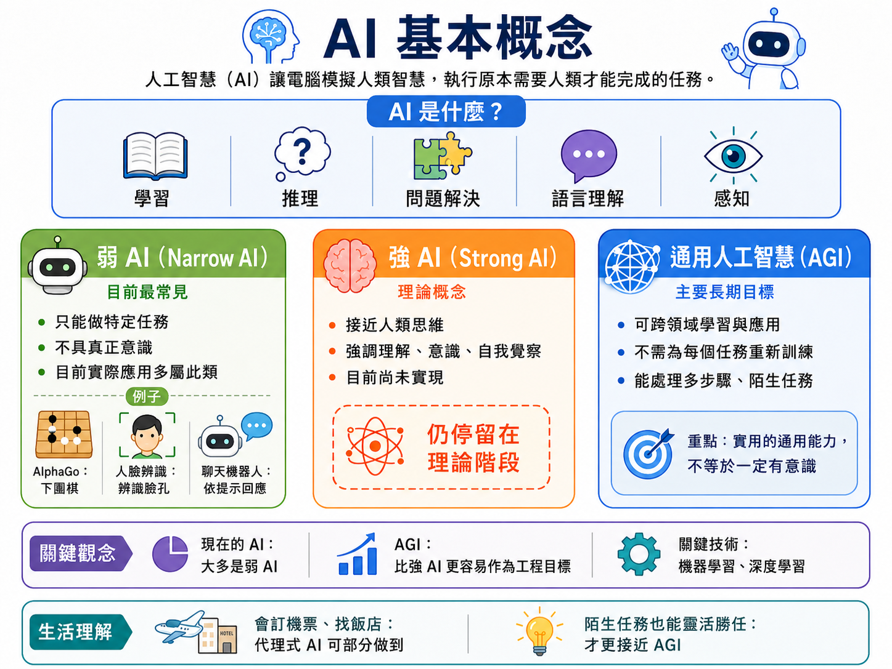

*圖片來源：ChatGPT 生成，由作者審閱其正確性*

#### AI 應用的類型

> 以下主要指出常見且目前的主流，但實際上 AI 應用範圍廣泛，並且日新月異，以下僅指出常見且主流的類型。

**影像辨識（Image Recognition）**：深度學習使得電腦辨識圖片中物件的準確率，在某些任務上已超越人類。應用包括：醫療影像診斷（從 X 光或 MRI 中偵測腫瘤）、自動駕駛中的障礙物偵測、工廠產品瑕疵檢測等。

**語音助理（Voice Assistant）**：Siri、Google Assistant、Amazon Alexa 等語音助理，結合了 **語音辨識**（將聲音轉為文字）、[自然語言處理](https://zh.wikipedia.org/zh-tw/%E8%87%AA%E7%84%B6%E8%AF%AD%E8%A8%80%E5%A4%84%E7%90%86)（理解句子的意思）與 **語音合成**（將回答轉為語音）三種技術，讓人機互動更自然。

> **趣味小知識**：早在1966年，MIT 學者約瑟夫·維森鮑姆就寫了一支名叫「ELIZA」的聊天程式，它其實只是用簡單的關鍵字比對與句型套用，模仿心理治療師的對話方式。沒想到許多受測者明知道對方是程式，卻仍對它傾訴心事、產生情感依附——這種「明知是機器仍投入情感」的現象，後來被稱為「ELIZA 效應」，至今仍是討論聊天機器人與 AI 陪伴應用時的重要參考案例。

**推薦系統（Recommendation System）**：YouTube 的影片推薦、Netflix 的劇集建議、蝦皮的商品推薦，都依靠 AI 分析你的歷史行為，預測你最可能感興趣的內容，是現代科技平台留住用戶注意力的核心武器。

**自動駕駛（Autonomous Driving）**：結合影像辨識、感測器融合、地圖資料與深度學習，讓車輛能夠感知周遭環境、判斷交通狀況並自主做出駕駛決策。目前正處於快速發展且仍面臨諸多技術與法規挑戰的階段。

**自然語言處理與機器翻譯（NLP & Machine Translation）**：延續前面語音助理提到的[自然語言處理](https://zh.wikipedia.org/zh-tw/%E8%87%AA%E7%84%B6%E8%AF%AD%E8%A8%80%E5%A4%84%E7%90%86)技術，[機器翻譯](https://zh.wikipedia.org/zh-tw/%E6%9C%BA%E5%99%A8%E7%BF%BB%E8%AD%AF)是其中最貼近生活的應用，如 Google 翻譯、DeepL，讓不同語言的使用者能即時溝通。對工廠而言，這也是與海外客戶、供應商往來文件、跨國廠務會議溝通的重要輔助工具。

**生成式 AI（Generative AI）**：不同於前面「辨識、預測」型的 AI，[生成式人工智慧](https://zh.wikipedia.org/zh-tw/%E7%94%9F%E6%88%90%E5%BC%8F%E4%BA%BA%E5%B7%A5%E6%99%BA%E8%83%BD)能直接「創造」全新的文字、圖片、程式碼，例如 ChatGPT、Midjourney。這是近年 AI 領域發展最快的分支，完整的技術原理（如 Transformer 架構）將在 [06-Data-Science-AI-and-Smart-Manufacturing.md](06-Data-Science-AI-and-Smart-Manufacturing.md) 進一步說明。

> **趣味小知識**：生成對抗網路（GAN）——早期生成圖像的關鍵技術之一，據說是發明者伊恩·古德費洛在2014年一場酒吧聚會上與朋友辯論時，靈光一閃想出來的點子：讓兩個神經網路互相對抗，一個努力「造假」，另一個努力「抓包」，兩者你來我往、共同進步，最後「造假」的一方就能生成以假亂真的圖像。這個誕生於酒吧的想法，後來成為生成式 AI 發展史上的重要里程碑。

**機器人與自動化（Robotics）**：[機器人學](https://zh.wikipedia.org/zh-tw/%E6%9C%BA%E5%99%A8%E4%BA%BA%E5%AD%A6)結合了 AI 與機械工程，讓機器不只能「思考」，還能實際「動手」執行任務——工廠中常見的機械手臂、倉儲物流的自動導引車（AGV），都是機器人與自動化技術的具體展現，也是工業工程領域最直接接觸到的 AI 應用之一。

**預測性維護（Predictive Maintenance）**：前面「九、現代資訊系統」提過，工業物聯網（IoT）設備會持續回傳機台的溫度、震動等感測資料；AI 能從這些歷史資料中學習正常與異常的模式，提前[預測性維護](https://zh.wikipedia.org/zh-tw/%E9%A2%84%E6%B5%8B%E6%80%A7%E7%BB%B4%E6%8A%A4)機台可能發生故障的時間點，讓廠務團隊能在真正停機之前安排維修，避免產線意外中斷造成的損失。這是與工業工程管理最相關的一項 AI 應用，它在智慧工廠中的完整樣貌，見 [06-Data-Science-AI-and-Smart-Manufacturing.md](06-Data-Science-AI-and-Smart-Manufacturing.md)〈五、3. 智慧工廠：從感測器到決策的四層資料流〉。

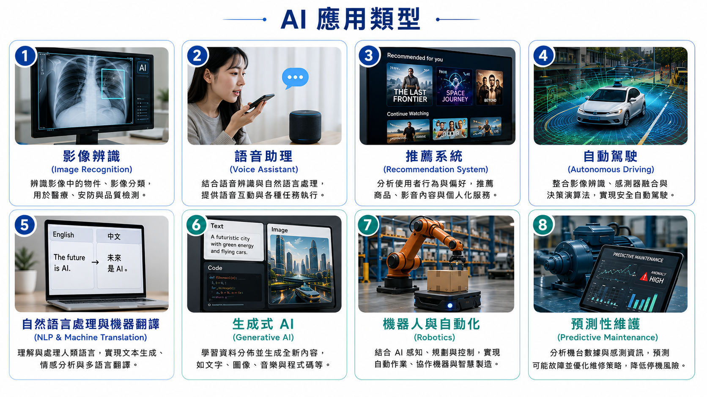

*圖片來源：ChatGPT 生成，由作者審閱其正確性*

### 2. 未來發展

**量子計算（Quantum Computing）**：傳統電腦的最小計算單位是「位元（bit）」，只能是 0 或 1。量子計算機使用「量子位元（Qubit）」與量子閘作為基礎，利用量子力學的 **疊加（Superposition）** 與糾纏等現象處理特定計算問題；理論上，它能在密碼學、藥物分子模擬、材料科學等特定問題上帶來不同於古典電腦的運算能力（Nielsen & Chuang, 2010）。目前 IBM、Google 等公司都已推出實驗性的量子計算機，但整體仍在研究階段，面臨極低溫操作、量子錯誤率等重大工程挑戰，距離普及應用還有一段距離。

**VR / AR / 元宇宙（Metaverse）**：這三個概念都與「延伸真實世界的感官體驗」有關，但切入的角度不同：

- [虛擬實境（VR，Virtual Reality）](https://zh.wikipedia.org/zh-tw/%E8%99%9A%E6%8B%9F%E7%8E%B0%E5%AE%9E)：透過 Meta Quest、HTC Vive 等頭戴式裝置，讓使用者完全沉浸在電腦生成的虛擬世界中，視覺與聽覺幾乎與現實世界隔絕。在工業場域中，VR 已被用於高風險作業（如高壓電維修、化學品處理）的模擬訓練，讓新進員工在零風險的虛擬環境中反覆練習，再上場操作真實設備。
- [擴增實境（AR，Augmented Reality）](https://zh.wikipedia.org/wiki/%E6%93%B4%E5%A2%9E%E5%AF%A6%E5%A2%83)：將虛擬資訊疊加在現實世界的影像上（如 Pikmin Bloom、Pokemon Go、IKEA 的家具試擺 App）。相較於 VR 的完全沉浸，AR 保留了使用者對現實環境的感知，因此更適合「一邊看真實設備、一邊看操作指引」的場景——例如產線人員戴上 AR 眼鏡，畫面上直接疊加設備維修步驟，或讓遠端專家透過 AR 即時標註畫面，指導現場人員排除故障，不必親自到場。這類應用背後，往往需要搭配[數位孿生（Digital Twin）](https://zh.wikipedia.org/zh-tw/%E6%95%B0%E5%AD%97%E6%98%A0%E5%B0%84)技術——先在虛擬世界建好一份與實體設備即時同步的數位模型，AR/VR 才有精確的資料可以呈現。
- [元宇宙（Metaverse）](https://zh.wikipedia.org/zh-tw/%E5%85%83%E5%AE%87%E5%AE%99)：一個持續存在、多人共享的虛擬世界，整合了社交、工作、娛樂與經濟活動。目前已有企業（例如：facebook 母公司 Meta）嘗試將元宇宙用於虛擬展會、跨國團隊的虛擬協作辦公室，但整體而言，缺乏殺手級應用、使用者體驗（如長時間配戴頭戴裝置的不適感）等問題，讓元宇宙的技術與商業模式至今仍未成熟。
- [空間運算（Spatial Computing）](https://futurecity.cw.com.tw/article/3076) ：近年 VR 與 AR 的界線逐漸模糊，兩者匯流出「空間運算」這個新方向——以 [Apple Vision Pro](https://zh.wikipedia.org/zh-tw/Apple_Vision_Pro) 為代表，裝置能同時處理虛擬內容與真實空間的互動，讓使用者依需求在「完全沉浸」與「疊加現實」之間自由切換，被視為 VR/AR 技術下一階段的整合趨勢。

**具身智慧與人形機器人（Embodied AI）**：前面提到的「機器人與自動化」，目前多半只能執行特定、重複性高的任務；[具身智慧](https://zh.wikipedia.org/zh-tw/%E5%85%B7%E8%BA%AB%E6%99%BA%E8%83%BD)則是讓 AI 不再只停留在螢幕裡回答問題，而是擁有實際的物理身體，能感知環境、自主移動並完成多樣化任務。Tesla Optimus、Figure AI 等公司正投入開發通用型人形機器人，目標是讓機器人像人類一樣，靠雙手雙腳適應各種既有的工作環境，而不需要為每一種任務重新設計專屬機具。這意味著未來的產線上，人形機器人有機會補位執行多變、危險或人力短缺的工作，是繼 AGI 之後，另一個備受業界關注的 AI 發展方向。

**情感科技（Affective Computing）**：[情感計算](https://zh.wikipedia.org/zh-tw/%E6%83%85%E6%84%9F%E8%AE%A1%E7%AE%97)（又稱情緒 AI，Emotion AI）作為一個明確的學術研究框架，通常可追溯至 MIT Media Lab 學者 Rosalind Picard 在 1995 年提出的相關研究，並在其 1997 年出版的《Affective Computing》中獲得更完整的系統化闡述（Picard, 1997）。不過，在一般大眾的日常經驗中，對「機器能表現、辨識或回應情緒」的感知，並不一定最先來自學術研究本身，而是更多透過電子遊戲、動畫、多媒體互動、虛擬角色與語音介面等應用場景逐漸形成。這些場域中的角色表情、聲音反應與情緒化互動，最初往往主要服務於娛樂體驗、沉浸感與角色可信度；但它們也在實際上培養了大眾對情緒化人機互動的接受與想像，進而成為後來情緒 AI 應用得以被理解的重要文化基礎。

如果說具身智慧是讓 AI 擁有「身體」，那麼情緒 AI 則可被理解為讓 AI 逐漸具備「感知與回應情緒線索」的能力。這類技術通常透過分析臉部表情、語音語調、用字遣詞，甚至心率、皮膚電反應等生理訊號，推估使用者當下可能的情緒、壓力或疲勞狀態，並據此調整互動方式。隨著大數據、機器學習與感測技術的發展，情緒 AI 的應用範圍已從娛樂產業逐步擴展至客服中心、車用駕駛監控、健康照護、教育科技與陪伴型 AI 等場景。例如，客服系統可用來輔助判斷顧客語氣是否不滿，駕駛監控系統可偵測疲勞或分心狀態，虛擬角色與陪伴型機器人則被嘗試用於回應使用者的孤獨感與情緒支持需求。在工業與職業安全場域，情緒 AI 也開始被研究或試行於監測作業人員的疲勞、壓力與注意力狀態，作為人因工程與安全管理的輔助工具；未來若與人機協作機器人結合，也可能使機器人依操作人員的身心狀態調整互動節奏與協作方式。

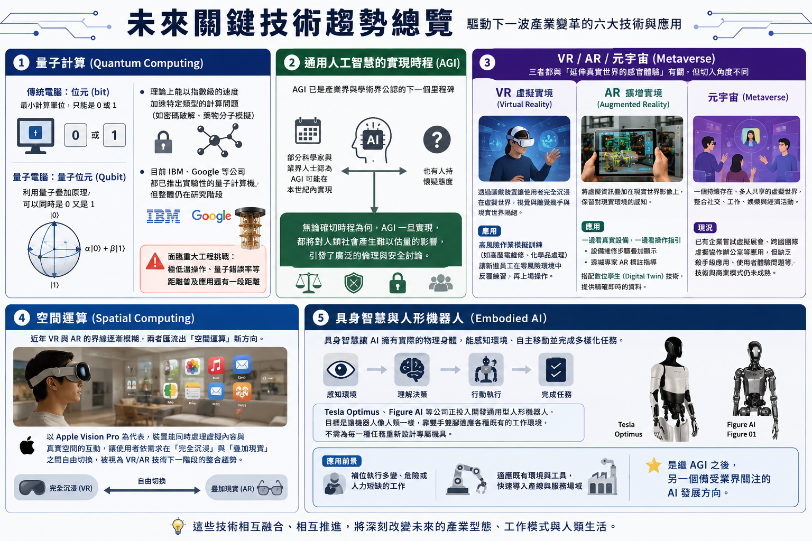

*圖片來源：ChatGPT 生成，由作者審閱其正確性*

---

## 十一、學習重點總結

讀完本章後，你應該能夠理解以下核心概念，並將其應用於工業場域的思考與決策：

**計算機的發展，一直由人類的需求驅動**

回顧整個計算機發展的歷程，我們可以清楚地看到一個貫穿始終的主題：**人類的需求驅動技術的創新**。從農業社會需要記帳計數，到工業社會需要處理海量統計資料，再到現代社會對即時全球資訊的渴望——每一次計算工具的革命，都對應著人類社會一個新的需求與挑戰。這個規律到今天依然成立：工廠導入智慧製造，起點從來不是「有什麼新技術」，而是「有什麼問題非解不可」。

**技術演進的脈絡：每一代都站在前一代的基礎上**

計算工具的演進，沿著一條清晰的主線不斷前進：

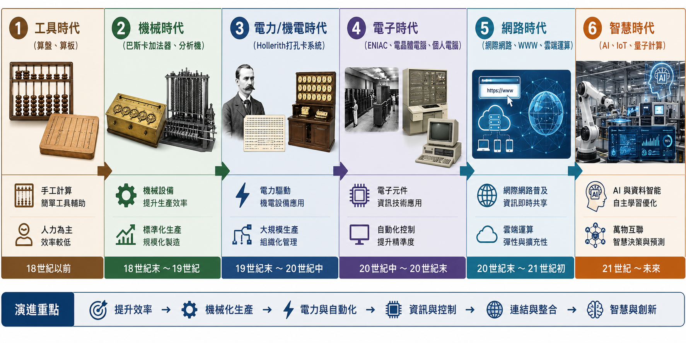

*圖片來源：ChatGPT 生成，由作者審閱其正確性*

每一個時代都建立在前一個時代的基礎上，且演進的速度越來越快——從算盤被使用了數千年，到電腦世代每十年就迭代一次，再到今天 AI 技術以年為單位快速突破。理解這條主線的意義在於：你在課程後面學到的每一項技術，都不是憑空出現的，它們都在回應前一代技術解不掉的問題。

**數位化與二進位是所有現代資訊技術的共同起點**

無論是文字、聲音、影像，還是產線上的溫度與振動讀值，電腦處理它們的方式都一樣：先轉換成 0 與 1 的組合。這個「把真實世界翻譯成數字」的過程就是數位化，它是後續所有技術——儲存、運算、傳輸、分析——能夠成立的前提。工廠裡的感測器之所以能被電腦讀懂，正是因為它把物理量做了同樣一件事。

**網路讓資訊的價值從單機釋放出來**

從 ARPANET 到全球網際網路，這段歷史說明了一件事：資料留在單一台電腦裡，價值有限；能流動、能被跨組織共享，價值才會放大。今天工廠的機台之所以要連上網路，而不是各自守著自己的資料，背後是同一個道理。

**人工智慧是這條長路目前的最前沿，但仍是同一條路**

AI 看似橫空出世，實際上它踩在前面每一階之上：沒有足夠的運算能力、沒有累積數十年的數位化資料、沒有網路把資料匯集起來，深度學習不會在 2010 年代才突然可行。理解這一點，有助於你在面對「AI 能不能解決我的問題」時，先回頭檢查前面那幾階——資料有沒有、品質好不好、拿不拿得到。

**資訊科技已經是每個專業的背景知識**

站在今天的視角，資訊科技正以我們難以完全預見的方式，更深入地融入每個人的日常生活。健康監測、教育學習、工作協作、城市管理、醫療診斷……幾乎沒有一個領域不在被資訊科技重塑。身為這個時代的大學生，理解計算機的歷史與運作原理，不僅是知識上的充實，更是在數位社會中做出明智判斷的基礎——無論你的未來職業是工程師、設計師、醫生、還是藝術家，資訊科技都將是你不可忽視的背景。

> **銜接提示**：本章走過的這條「從算盤到 AI」的長路，會在全課程最後的 [06-Data-Science-AI-and-Smart-Manufacturing.md](06-Data-Science-AI-and-Smart-Manufacturing.md)〈五、工業4.0與智慧製造：把整條技術鏈放進工廠〉中收束成一座真實的智慧工廠——屆時你會發現，這裡提到的每一個里程碑，都還活在那座工廠的某個角落：二進位活在感測器的讀值裡，網路活在機台與雲端之間，而 AI 活在那張預測機台何時故障的報表上。

---

## 參考文獻

- Abbate, J. (1999). *Inventing the Internet*. MIT Press.
- Aspray, W. (Ed.). (1990). *Computing before computers*. Iowa State University Press.
- Berners-Lee, T., & Fischetti, M. (1999). *Weaving the Web: The original design and ultimate destiny of the World Wide Web by its inventor*. Harper San Francisco.
- Boole, G. (1854). *An investigation of the laws of thought, on which are founded the mathematical theories of logic and probabilities*. Walton and Maberly.
- Campbell-Kelly, M., Aspray, W., Ensmenger, N., & Yost, J. R. (2018). *Computer: A history of the information machine* (3rd ed.). Routledge.
- Ceruzzi, P. E. (2003). *A history of modern computing* (2nd ed.). MIT Press.
- Goodfellow, I., Bengio, Y., & Courville, A. (2016). *Deep learning*. MIT Press.
- Hodges, A. (1983). *Alan Turing: The enigma*. Simon & Schuster.
- Ifrah, G. (2000). *The universal history of numbers: From prehistory to the invention of the computer* (D. Bellos, E. F. Harding, S. Wood, & I. Monk, Trans.). Wiley.
- Isaacson, W. (2014). *The innovators: How a group of hackers, geniuses, and geeks created the digital revolution*. Simon & Schuster.
- Kurose, J. F., & Ross, K. W. (2021). *Computer networking: A top-down approach* (8th ed.). Pearson.
- Laudon, K. C., & Laudon, J. P. (2022). *Management information systems: Managing the digital firm* (17th ed.). Pearson.
- Licklider, J. C. R. (1960). Man-computer symbiosis. *IRE Transactions on Human Factors in Electronics, HFE-1*(1), 4–11. https://doi.org/10.1109/THFE2.1960.4503259
- Metropolis, N., Howlett, J., & Rota, G.-C. (Eds.). (1980). *A history of computing in the twentieth century*. Academic Press.
- Nielsen, M. A., & Chuang, I. L. (2010). *Quantum computation and quantum information* (10th anniversary ed.). Cambridge University Press.
- Petzold, C. (2022). *Code: The hidden language of computer hardware and software* (2nd ed.). Microsoft Press.
- Picard, R. W. (1997). *Affective computing*. MIT Press.
- Randell, B. (Ed.). (1982). *The origins of digital computers: Selected papers* (3rd ed.). Springer-Verlag.
- Russell, S., & Norvig, P. (2020). *Artificial intelligence: A modern approach* (4th ed.). Pearson.
- Shannon, C. E. (1938). A symbolic analysis of relay and switching circuits. *Transactions of the American Institute of Electrical Engineers, 57*(12), 713–723. https://doi.org/10.1109/T-AIEE.1938.5057767
- Shannon, C. E. (1948). A mathematical theory of communication. *Bell System Technical Journal, 27*, 379–423, 623–656.
- Tanenbaum, A. S., & Wetherall, D. J. (2011). *Computer networks* (5th ed.). Pearson.
- Turing, A. M. (1936). On computable numbers, with an application to the Entscheidungsproblem. *Proceedings of the London Mathematical Society, s2-42*(1), 230–265. https://doi.org/10.1112/plms/s2-42.1.230
- Turing, A. M. (1950). Computing machinery and intelligence. *Mind, 59*(236), 433–460. https://doi.org/10.1093/mind/LIX.236.433
- Wiener, N. (1948). *Cybernetics: Or control and communication in the animal and the machine*. MIT Press.

---

*本教材涵蓋計算機歷史的主要脈絡，建議搭配延伸閱讀與實際操作練習，以加深理解。*