# 電腦硬體、作業系統與應用軟體——工業工程管理導向

## 前言：從開機的那三十秒談起

每次你按下電腦的電源鍵，然後等著 Windows 或 macOS 載入桌面——那三十秒裡，電腦正在執行一連串精密的初始化程序：

- 電源供應器（PSU）將市電轉為穩定電壓，供電給各元件
- CPU 執行 BIOS/UEFI 韌體，逐一檢查硬體是否正常（POST 自我測試）
- 儲存裝置（SSD/HDD）將作業系統核心讀入記憶體（RAM）
- 作業系統接管控制權，載入驅動程式，啟動系統服務，才出現你看到的桌面

若不具備基礎的電腦基本結構，在日常維護、採購或與專業人員溝通時，可能會面臨以下困境：

- **無法精準判斷系統效能瓶頸**：當電腦運作遲緩時，只能得出「設備老舊需汰換」的模糊結論，無法分辨核心問題究竟出在中央處理器（CPU）、記憶體（RAM）或是硬碟儲存空間。
- **缺乏設備規格的評估能力**：面對硬體規格表時，即使看到「Intel i7 處理器與 16GB 記憶體」等明確參數，亦無法理解其代表的效能意義與實際價值。
- **難以落實工業應用的精準採購**： 在評估工廠生產設備時，無法判斷工業電腦（IPC）的硬體規格是否能滿足生產管理系統（MES）等軟體的運作需求。
- **與技術人員存在溝通障礙**：當資訊（IT）人員提及「記憶體不足」或「輸入/輸出（I/O）瓶頸」等專業術語時，因缺乏背景知識而難以理解問題核心。
- **無法理解高階應用的硬體需求邏輯**：難以明白為何一台要以 4K 解析度全特效運作的電競主機，需要至少 32GB 記憶體與 RTX 5070 16GB 顯示卡，亦無法理解人工智慧（AI）工作站為何動輒需要 128GB 以上的記憶體配置。

如果理解電腦的結構，你可以：

- 理解 **CPU**、**記憶體（RAM）**、**儲存裝置** 各自的角色，協助 IT 人員快速定位問題
- 看懂規格表，判斷「這台工業電腦的規格，能不能同時跑 MES 和即時感測資料分析」
- 理解 **作業系統** 如何分配資源，能合理設定生產管理軟體的執行優先順序
- 在 **工業 4.0** 設備的選擇與評估時，能確認感測器、控制器、工業電腦的規格是否符合需求
- 能夠知道為什麼當代 AI 基礎與應用服務供應商們的競爭，除了演算法與數據為核心能力外，更是 **硬體算力** 的競賽

> **這就是理解電腦結構的核心價值**：讓你從「使用者」走向「設計者」的視角，能評估硬體規格、理解系統瓶頸，在數位化工廠的設備選型與維運討論中提出有意義的問題。

| 開機階段 | 對應的硬體概念 |
|---------|--------------|
| 電源接通，風扇啟動 | 電源供應器（PSU）的電壓轉換 |
| 螢幕顯示廠商 Logo | CPU 執行 BIOS/UEFI 韌體的 POST 自我測試 |
| 硬碟燈閃爍 | SSD/HDD 將 OS 核心讀入 RAM |
| 桌面逐漸出現 | 作業系統接管控制、驅動程式初始化 |
| 你點開應用程式 | OS 分配 CPU 時間與記憶體空間給程式 |

> 本章依「計算機科學基本理論與歷史」，以及電腦系統架構所構成的「資料、硬體與軟體」逐篇逐章說明，目的是帶你理解電腦為什麼長成現在這個樣子、CPU／記憶體／儲存／I/O 介面各自的角色，以及作業系統如何協調這些硬體共同運作，並將這個理解應用到工業4.0中的智慧設備與製造系統的規劃與評估。

> **課程主線定位**：資訊與數位科技的本質，是把 **資料** 有效處理成 **資訊**，再轉化為能支援決策的 **知識**。資料要被處理，得先有一台機器負責存放與運算。本章講的是硬體如何完成這件事，以及作業系統與應用軟體如何調度這些硬體，讓資料的處理能真正跑起來。讀的時候不必死背名詞，隨時想想：這項技術為什麼出現、它解決了什麼問題、解決之後又帶出什麼新問題。

---

## 第一篇：計算機科學基本理論與歷史

---

## 一、計算機科學的思想基礎：圖靈、馮諾依曼與資訊理論

現代電腦的樣子，其實是二十世紀中葉幾位思想家的理論決定的。在介紹硬體細節之前，先了解這三個思想支柱，有助於理解「電腦為什麼長成現在這個樣子」。

### 1. 艾倫·圖靈與可計算性（Alan Turing & Computability）

1936年，英國數學家[艾倫·圖靈（Alan Turing）](https://zh.wikipedia.org/zh-tw/艾倫·圖靈)發表了一篇改變歷史的論文（Turing, 1936），提出了「[圖靈機（Turing Machine）](https://zh.wikipedia.org/zh-tw/圖靈機)」的抽象概念。圖靈機不是一台真實的機器，而是一個思想模型：一條無限長的紙帶、一個讀寫頭、一組有限的規則——圖靈證明了這個極度簡化的模型，在理論上能夠計算任何「可計算」的問題。


*圖片來源：[Wikimedia Commons「Alan Turing (1951).jpg」](https://commons.wikimedia.org/wiki/File:Alan_Turing_(1951).jpg)，攝影師 Elliott & Fry，公有領域（Public Domain）*

下圖是圖靈機的示意圖：一條分割成方格的紙帶，每格可寫入一個符號；讀寫頭停在某一格上，根據目前的「狀態」（圖中以 $q_4$ 表示）與讀到的符號，決定下一步要寫入什麼、往左或往右移動、以及切換到哪個新狀態。


*圖片來源：[Wikimedia Commons「Turing machine 2a.svg」](https://commons.wikimedia.org/wiki/File:Turing_machine_2a.svg)，作者 Nynexman4464，公有領域（Public Domain）*

這個概念帶來了兩個深遠的影響：

- **定義了「計算」的邊界**：圖靈同時證明，存在某些問題是任何電腦永遠無法解決的（著名的「[停機問題（Halting Problem）](https://zh.wikipedia.org/zh-tw/停機問題)」），為電腦科學劃定了能力的極限。
- **通用計算機的理論依據**：圖靈機的概念說明，一台「可程式化」的通用機器，只要改變輸入的指令，就能解決任何可計算的問題——這正是今天所有電腦的設計哲學。

二戰期間，圖靈主導了破解德軍 [Enigma 密碼機](https://zh.wikipedia.org/zh-tw/恩尼格瑪密碼機)的工作，他的貢獻被認為大幅縮短了戰爭進程。今天，電腦科學界最高榮譽獎項即以他命名——[圖靈獎（Turing Award）](https://zh.wikipedia.org/zh-tw/圖靈獎)，被譽為「電腦科學的諾貝爾獎」。

### 2. 馮諾依曼架構（Von Neumann Architecture）

1945年，數學家[約翰·馮諾依曼（John von Neumann，又譯馮曼紐）](https://zh.wikipedia.org/zh-tw/約翰·馮·諾伊曼)提出了一份影響至今的電腦架構報告（von Neumann, 1993），描述了一種將「程式」與「資料」**共同儲存在同一記憶體** 中的電腦設計，稱為[馮諾依曼架構（Von Neumann Architecture）](https://zh.wikipedia.org/zh-tw/馮·諾伊曼架構)。


*圖片來源：[Wikimedia Commons「John von Neumann.jpg」](https://commons.wikimedia.org/wiki/File:John_von_Neumann.jpg)，作者 wikispaces，授權 CC BY-SA 3.0*

這個架構由五個核心部件組成：**控制單元（Control Unit）**、**算術邏輯單元（ALU）**（兩者合稱 **中央處理器，CPU**）、**記憶體（Memory Unit）**、**輸入裝置（Input Device）** 與 **輸出裝置（Output Device）**，彼此透過匯流排（Bus）傳遞資料與控制訊號，如下圖所示：


*圖片來源：[Wikimedia Commons「Von Neumann Architecture.svg」](https://commons.wikimedia.org/wiki/File:Von_Neumann_Architecture.svg)，作者 Kapooht，授權 CC BY-SA 3.0*

馮諾依曼架構的關鍵創新在於「**程式儲存（Stored Program）**」的概念：在此之前，許多計算機（如 ENIAC）需要透過重新接線來改變程式；馮諾依曼架構讓程式以資料的形式存在記憶體中，只需載入不同的程式，同一台機器就能執行完全不同的任務。

今天你使用的電腦、手機、伺服器，在架構上幾乎都仍是馮諾依曼架構的延伸與變形。然而這個架構也有其先天限制：CPU 與記憶體之間的資料傳輸速率，遠跟不上 CPU 的運算速度，形成所謂的「[馮諾依曼瓶頸（Von Neumann Bottleneck）](https://zh.wikipedia.org/zh-tw/馮·諾伊曼架構#馮·諾伊曼瓶頸)」，這也是現代電腦設計中快取（Cache）存在的根本原因之一。

### 3. 克勞德·夏農與資訊理論（Claude Shannon & Information Theory）

如果說圖靈定義了「什麼可以被計算」，馮諾依曼給了電腦一個具體的身體架構，那麼[克勞德·夏農（Claude Shannon）](https://zh.wikipedia.org/zh-tw/克勞德·夏農) 則回答了一個更根本的問題：「**資訊本身是什麼？可以如何量化？**」


*圖片來源：[Wikimedia Commons「ClaudeShannon MFO3807.jpg」](https://commons.wikimedia.org/wiki/File:ClaudeShannon_MFO3807.jpg)，攝影師 Konrad Jacobs（Mathematisches Forschungsinstitut Oberwolfach），授權 CC BY-SA 2.0 Germany*

1948年，夏農在貝爾實驗室發表《通信的數學理論（A Mathematical Theory of Communication）》（Shannon, 1948），創立了[資訊理論（Information Theory）](https://zh.wikipedia.org/zh-tw/資訊理論)，提出了幾個至今仍是數位世界基礎的概念：

- **位元（Bit）是資訊的基本單位**：夏農提出用「位元」來衡量資訊量——一個能解答一個「是/否」問題的最小資訊單位。這個概念將抽象的「資訊」轉化為可數學計算的量，奠定了所有數位通訊與儲存的理論基礎。

- **[熵（Entropy）](https://zh.wikipedia.org/zh-tw/熵_(資訊理論))與資訊量**：夏農用「熵」來描述訊息的不確定性——越難以預測的訊息，攜帶的資訊量越大。例如，「明天太陽會從東邊升起」幾乎是確定的，資訊量接近零；而「明天彩券中獎號碼是 03-17-28-33-41-49」充滿不確定性，資訊量極高。

- [通道容量（Channel Capacity）](https://zh.wikipedia.org/zh-tw/頻道容量)：夏農證明任何通訊通道都有理論上的最大傳輸速率上限（稱為「夏農極限」），並且只要傳輸速率不超過此上限，就可以設計出幾乎無錯誤的通訊系統。這個定理至今仍指導著 Wi-Fi、5G 等無線通訊標準的設計。

> **趣味小知識**：由 Anthropic 公司開發、廣為人知的大型語言模型 **Claude**，其名稱正是為了向克勞德·夏農（Claude Shannon）致敬——這位「資訊理論之父」的名字，就這樣以意想不到的方式延續到了今天的人工智慧時代。

> **三位先驅的連結**：圖靈告訴我們電腦「能做什麼」，夏農告訴我們資訊「是什麼、怎麼傳」，馮諾依曼告訴我們電腦「長什麼樣子」。三人的思想在二十世紀中葉交匯，共同構築了現代數位文明的理論地基。在工業應用中，這三個概念同樣無所不在：工廠的控制程式體現圖靈的可計算性、每一台工業電腦都以馮諾依曼架構運作、而每一條工業網路的頻寬設計都受到夏農理論的指導。

---

## 第二篇：電腦系統架構——資料

---

## 二、電腦系統架構總覽

一台電腦系統由三個核心要素組成，缺一不可：

- **資料（Data）**：被電腦處理的原始素材，如數字、文字、圖片、影片，以及在工廠中來自感測器的量測值。
- **硬體（Hardware）**：所有看得見、摸得到的實體元件，如處理器、記憶體、硬碟、螢幕、鍵盤等。
- **軟體（Software）**：控制硬體運作的程式與指令集，包括作業系統與各種應用程式。

三者的關係可以用一個簡單的比喻來理解：**硬體是廚房的爐具與刀具（工具），軟體是食譜（指令），資料則是食材（原料）**。無論多好的廚具，沒有食譜與食材，都做不出一道菜。

在工業環境中，這個三元架構特別重要——一台工業電腦（如生產線上的控制主機）的硬體規格、搭載的控制軟體，以及所接收的感測器資料，共同決定了整條生產線能否穩定、精確地運作。

了解計算機科學的思想基礎後，接下來我們依電腦系統架構所構成的 **資料、硬體與軟體** 三大要素，逐篇逐章說明——首先從資料的表示方式談起。

> **用詞說明**：本篇沿用 [01-History-of-Computer.md](01-History-of-Computer.md)〈從資料到資訊，再到知識〉的定義——「資料」是未經處理的原始素材（如感測器數值、位元序列），本篇以「資料」作為主要用詞；內容經整理、賦予脈絡後才稱為「資訊」（如報表、儀表板呈現的分析結果，見〈資料分析與決策支援〉一章）。另外，後面會提到的「夏農資訊理論」中的「資訊（Information）」是通訊工程對不確定性/位元量的數學定義，與此處資料/資訊之分屬於不同脈絡，請勿混淆。

---

## 三、資料表示與數位化

> **前情提要**：[01-History-of-Computer.md](01-History-of-Computer.md)〈七、數位化與電腦運作原理〉已先介紹過二進位與數位化的基本概念，本節在此基礎上補充完整的進位轉換與浮點數表示法。

電腦只認識兩種狀態：**0（無電）** 與 **1（有電）**，所有資料都必須轉換為由 0 和 1 組成的序列，才能被電腦處理，這個過程稱為[數位化（Digitization）](https://zh.wikipedia.org/zh-tw/數位化)。

- 最小的資料單位是 **位元（bit）**，只能是 0 或 1
- 8 個位元組成 1 個 **位元組（Byte）**，可表示 256 種不同狀態
- 常見單位：1 KB（千位元組）≈ 1,024 Bytes；1 MB ≈ 1,024 KB；1 GB ≈ 1,024 MB

> **趣味小知識**：買一顆標示「1TB」的硬碟，接上電腦卻顯示只有約 931 GB，並不是被廠商偷斤減兩。硬碟製造商以「1 TB = 1,000,000,000,000 Bytes」（十進位）計算容量，作業系統卻以「1 TB = 1024⁴ Bytes」（二進位）換算顯示——同一個「TB」，兩種算法，差了將近 10%。

**在製造環境中的感測資料**：工廠裡充滿各種感測器，它們測量的是連續的物理量（如溫度 25.3°C、壓力 101.5 kPa），這些類比訊號必須透過[類比數位轉換器（ADC，Analog-to-Digital Converter）](https://zh.wikipedia.org/zh-tw/類比數位轉換器) 轉換為數位資料，才能傳入電腦進行分析與儲存。取樣的頻率與精度（解析度）越高，資料越能忠實反映現實，但也需要更多儲存空間與運算資源。

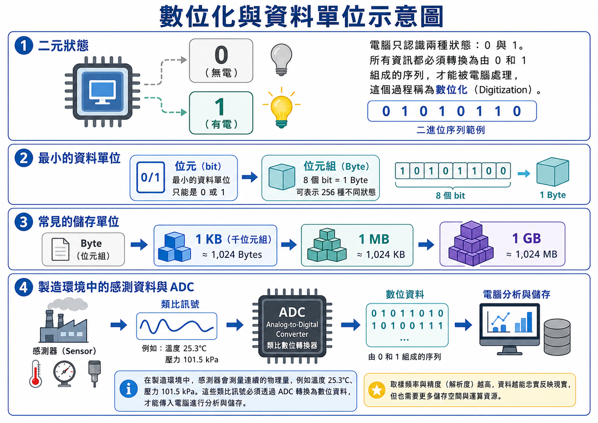

*本圖由 ChatGPT 生成，已由作者審核內容正確性*

---

## 四、數字系統與進位轉換（必考）

> 本課程很少直接提示甚麼一定會考，但這章節一定會考，請同學多練習

電腦使用二進位，但人類習慣十進位。工程師在分析記憶體位址、感測器原始資料、通訊封包時，經常需要在這兩種（乃至十六進位）之間來回轉換，因此進位轉換是電腦概論的基礎技能。

### 1. 三種進位的基本格式

在學習轉換之前，先認識三種數字系統各自的基本規則：

| 進位系統 | 基底 | 使用符號 | 常見標示法 | 範例 |
| --- | --- | --- | --- | --- |
| 十進位（Decimal） | 10 | 0–9，共 10 個 | 數字後加下標 ₁₀（通常可省略） | 43、43₁₀ |
| 二進位（Binary） | 2 | 0、1，共 2 個 | 數字後加下標 ₂ | 101011₂ |
| 十六進位（Hexadecimal） | 16 | 0–9、A–F，共 16 個 | 數字後加下標 ₁₆，或加前綴 `0x` | AF₁₆、0xAF |

無論哪一種進位，都遵循相同的 [位值制（Positional Notation）](https://zh.wikipedia.org/zh-tw/進位制) 原則：每個位置上的數字，其實際代表的值＝**該數字 × 基底的次方**，次方由右到左依序是 0、1、2、3……。例如十進位的 **43** 代表 4×10¹ + 3×10⁰；二進位的 **101011₂** 代表 1×2⁵ + 0×2⁴ + 1×2³ + 0×2² + 1×2¹ + 1×2⁰。這個原則是後面所有進位轉換方法的共同基礎。

### 2. 十進位轉二進位（整數）

方法：**連續除以 2，記錄餘數，由下往上讀取。**

以十進位 **43** 轉二進位 **101011₂** 為例：

```
43 ÷ 2 = 21 ... 餘 1   ↑ 最高位
21 ÷ 2 = 10 ... 餘 1   │
10 ÷ 2 =  5 ... 餘 0   │
 5 ÷ 2 =  2 ... 餘 1   │
 2 ÷ 2 =  1 ... 餘 0   │
 1 ÷ 2 =  0 ... 餘 1   ↓ 最低位

由下往上讀：43₁₀ = 101011₂
```

驗算（由左到右，每位乘以對應的 2 的次方）：

```
1×2⁵ + 0×2⁴ + 1×2³ + 0×2² + 1×2¹ + 1×2⁰
= 32  +  0  +  8  +  0  +  2  +  1  = 43  ✓
```

### 3. 二進位轉十進位

方法：**每個位元乘以對應的 2 的次方，加總即可。**

以二進位 **1101₂** 轉十進位 **13** 為例：

```
位元位置（從右數起，從 0 開始）：
  1   1   0   1
  ↑   ↑   ↑   ↑
 2³  2²  2¹  2⁰
  8   4   0   1  → 8 + 4 + 0 + 1 = 13₁₀
```

### 4. 十進位小數轉二進位

方法：**連續乘以 2，記錄整數部分，由上往下讀取。**

以十進位小數 **0.625** 轉二進位 **0.101₂** 為例：

```
0.625 × 2 = 1.25  → 取整數 1，剩 0.25   ↓ 最高位
0.25  × 2 = 0.5   → 取整數 0，剩 0.5    │
0.5   × 2 = 1.0   → 取整數 1，剩 0.0    ↓ 最低位（結束）

由上往下讀：0.625₁₀ = 0.101₂
```

> **注意**：並非所有十進位小數都能被二進位有限位數精確表示。例如十進位的 **0.1** 在二進位中是一個無限循環小數（0.0001100110011…₂），這正是浮點數計算誤差的根本來源，在工業資料分析中對精度要求較高時需特別注意。

### 5. 十六進位（Hexadecimal）

二進位雖然是電腦的語言，但一串落落長的 0 和 1 對人類極不友善。**十六進位（Hex，基底為16）** 是工程師最常用的縮寫方式：每 4 個二進位位元恰好對應一個十六進位數字，大幅縮短表示長度。

十六進位使用 0–9 以及 A–F（代表 10–15）共 16 個符號：

| 十進位 | 二進位 | 十六進位 |
| --- | --- | --- |
| 0 | 0000 | 0 |
| 9 | 1001 | 9 |
| 10 | 1010 | A |
| 15 | 1111 | F |
| 16 | 0001 0000 | 10 |
| 255 | 1111 1111 | FF |

> **趣味小知識**：網頁設計常見的顏色代碼（如白色 `#FFFFFF`、黑色 `#000000`）其實就是十六進位——每兩位十六進位對應紅、綠、藍其中一個色版 0–255 的亮度，而 `FF` 正是十六進位表示的 255（8 個位元能表示的最大值）。下次調色盤跳出 `#FF5733` 這種代碼，你已經知道它在算什麼了。

**二進位 → 十六進位**

方法：**將二進位從右向左每 4 位一組，各組獨立轉為十六進位數字。**

以二進位 **1010 1111₂** 轉十六進位 **0xAF** 為例：

```
二進位：1010 1111
         ↓    ↓
十六進位:  A    F   → 0xAF
```

**十進位 → 十六進位**

> **記憶法**：A–F 緊接在 9 後面，照英文字母順序數 6 個就對應 10–15：**A=10、B=11、C=12、D=13、E=14、F=15**。

方法：**連續除以 16，記錄餘數（10–15 以 A–F 表示），由下往上讀取。**

以十進位 **202** 轉十六進位 **0xCA** 為例：

```
202 ÷ 16 = 12 ... 餘 10（A）   ↑ 最高位
 12 ÷ 16 =  0 ... 餘 12（C）   ↓ 最低位

由下往上讀：202₁₀ = CA₁₆ = 0xCA
```

**十六進位 → 十進位**

方法：**每個十六進位數字乘以對應的 16 的次方，加總即可。**

以十六進位 **0x2F** 轉十進位 **47** 為例：

```
位數（從右數起，從 0 開始）：
   2       F
   ↑       ↑
  16¹     16⁰
2×16=32  F(15)×1=15   → 32 + 15 = 47₁₀
```

> **工業應用範例**：網路通訊中的 MAC 位址（如 `3C:22:FB:A1:0D:5E`）、PLC 暫存器位址、顏色 RGB 碼（如 `#FF5733`）都是以十六進位表示的，理解十六進位有助於閱讀設備手冊與通訊協定文件。

### 6. 0–15 對照表

十進位、二進位、十六進位是本節最常互相轉換的三種表示法，以下列出 0–15 的完整對照，供查閱與練習使用：

| 十進位 | 二進位 | 十六進位 |
| --- | --- | --- |
| 0 | 0000 | 0 |
| 1 | 0001 | 1 |
| 2 | 0010 | 2 |
| 3 | 0011 | 3 |
| 4 | 0100 | 4 |
| 5 | 0101 | 5 |
| 6 | 0110 | 6 |
| 7 | 0111 | 7 |
| 8 | 1000 | 8 |
| 9 | 1001 | 9 |
| 10 | 1010 | A |
| 11 | 1011 | B |
| 12 | 1100 | C |
| 13 | 1101 | D |
| 14 | 1110 | E |
| 15 | 1111 | F |

### 7. 自我練習

想動手練習進位轉換嗎？完整的 25 道練習題（涵蓋六種轉換類型），每一題都附上詳細計算過程與 Python 程式驗證，請見練習筆記本：[notebooks/Computer-Structure-Examples.ipynb](notebooks/Computer-Structure-Examples.ipynb)。

### 8. 動手驗算：善用計算工具

手算之外，也可以利用現成的工具快速轉換，你還可以拿計算機練習手算（隨機出數字，手算後用計算機驗證），熟練計算過程：

- **Windows 內建「小算盤」**：在開始功能表搜尋「小算盤」並開啟，點選左上角選單切換為「**程式設計人員**」模式，就能直接輸入十進位、二進位、十六進位或八進位，畫面會同步顯示其餘三種進位的結果，是驗證手算最方便的方式。
- **macOS 內建「計算機」App**：開啟後從選單列點選「顯示」→「程式設計者」（或按 `Cmd+3`），同樣能在十進位、二進位、十六進位之間即時切換對照。
- **線上進位轉換工具**：如 [RapidTables 網站提供的 Base Converter](https://www.rapidtables.com/convert/number/base-converter.html)，或直接在 Google 搜尋列輸入「43 to binary」「0x2F to decimal」之類的關鍵字，也能立即得到答案。

---

## 五、浮點數與 IEEE 754

### 1. 為什麼需要浮點數？

整數（如 42、-7）可以用前述的二進位方法精確表示，但現實世界中充滿了 **帶有小數的數值**，例如：溫度 23.75°C、電壓 3.14159 V、良率 0.9823。若只用整數，就無法儲存這些數值。

[浮點數（Floating-Point Number）](https://zh.wikipedia.org/zh-tw/浮點數運算) 是電腦表示實數（含小數）的標準方式。名稱中的「浮點」，是相對於「定點（Fixed-Point）」而言：定點數的小數點就像釘死在地上的木樁，永遠固定在同一個位置；浮點數的小數點則像相機的變焦鏡頭，會隨著數值的大小自由「滑動」——數值越大，小數點就往右滑得越遠，讓出更多整數位；數值越小，小數點就往左滑得越深，讓出更多小數位。正因為這個小數點是可以「浮動」的，同樣長度的位元，才能一下子表示天文數字般的大數，一下子又表示奈米等級的極小數，這正是「浮點」之名的由來。

### 2. IEEE 754 標準

為了讓不同廠牌、不同架構的電腦能夠以相同的方式處理浮點數，電機電子工程師學會（IEEE）於1985年制定了 [IEEE 754](https://zh.wikipedia.org/zh-tw/IEEE_754) 浮點數標準（IEEE, 2019），至今仍是幾乎所有現代電腦、程式語言與微控制器的浮點數基礎。

IEEE 754 最常用的兩種格式：

| 格式 | 總位元數 | 精確度 | 典型用途 |
| --- | --- | --- | --- |
| 單精度（Single Precision） | 32 bits | 約 7 位有效十進位數字 | 一般運算、感測器資料、遊戲 |
| 雙精度（Double Precision） | 64 bits | 約 15 位有效十進位數字 | 科學計算、財務計算、資料分析 |

### 3. 單精度浮點數的結構（32 bits）

一個 32 位元的 IEEE 754 單精度浮點數，由三個欄位組成：

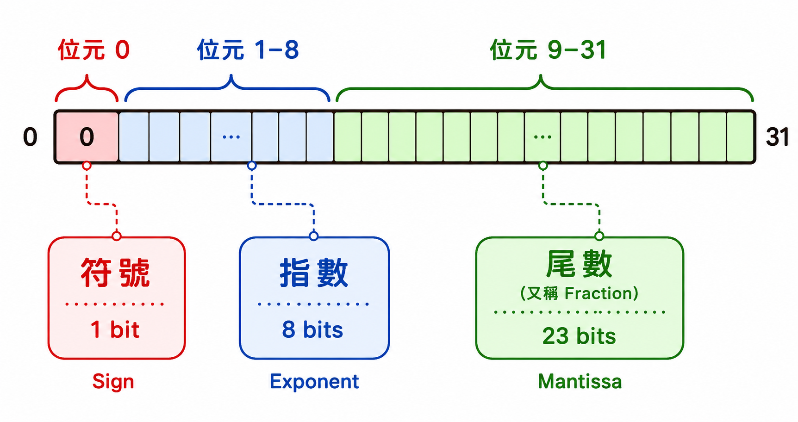

*本圖由 ChatGPT 生成，已由作者審核內容正確性*

- **符號位（Sign）**：0 代表正數，1 代表負數
- **指數（Exponent）**：以「偏移值（Bias = 127）」的方式儲存，實際指數 = 儲存值 − 127
- **尾數（Mantissa）**：儲存有效數字的小數部分（整數部分固定為 1，省略不存）

### 4. 表示原理：科學記號的二進位版本

IEEE 754 的核心概念，是將一個二進位數表示為類似科學記號的形式：

$$
\text{數值} = (-1)^{\text{符號}} \times 1.\text{尾數} \times 2^{(\text{指數} - 127)}
$$

以十進位 **-6.5** 轉 IEEE 754 單精度浮點數 **1 10000001 10100000000000000000000** 為例，逐步轉換：

**Step 1**：確定符號。負數，符號位 = **1**。

**Step 2**：將 6.5 轉為二進位。
```
整數部分：6 = 110₂
小數部分：0.5 = 0.1₂
合併：6.5₁₀ = 110.1₂
```

**Step 3**：正規化（移動小數點，使整數部分為 1）。
```
110.1₂ = 1.101₂ × 2²
```

**Step 4**：計算指數欄位的儲存值。
```
實際指數 = 2
儲存值 = 2 + 127 = 129 = 10000001₂
```

**Step 5**：取尾數（小數點後的部分）。
```
1.101₂ → 尾數 = 101，後面補 0 至 23 bits
尾數欄位 = 10100000000000000000000
```

**Step 6**：組合結果。
```
符號  指數          尾數
 1   10000001   10100000000000000000000

完整 32 bits：1 10000001 10100000000000000000000
```

### 5. 自我練習

想動手算算看嗎？完整的 5 道練習題（前三題為十進位轉 IEEE 754 單精度浮點數，後兩題為反向轉換），每一題都附上詳細計算過程與 Python 程式驗證，請見練習筆記本：[notebooks/Computer-Structure-Examples.ipynb](notebooks/Computer-Structure-Examples.ipynb)。

### 6. 浮點數的精度限制與工業影響

浮點數在電腦中的儲存是 **近似值**，而非精確值。這帶來了一個工程師必須了解的現象：**浮點誤差（Floating-Point Error）**。

一個著名的例子：在許多程式語言中，`0.1 + 0.2` 的計算結果並非精確的 `0.3`，而是 `0.30000000000000004`。這是因為 0.1 和 0.2 在二進位中都是無限循環小數，儲存時已經產生了微小的截斷誤差，累加後誤差就顯現出來。

> **趣味小知識**：1994年，Intel 的 Pentium 處理器被發現在某些除法運算中會產生錯誤結果（後來稱為「Pentium FDIV 臭蟲」），根本原因就出在浮點數運算單元的一個微小瑕疵（Edelman, 1997）。這個看似極小的誤差，最終讓 Intel 付出了 4 億 7 千 5 百萬美元的代價，全面回收並更換有問題的晶片——浮點數的精度問題，從來不只是理論上的小數點遊戲。

> **工業場景的影響**：在工廠的統計製程管制（SPC）或品質分析中，若對大量感測器資料進行累加、平均等運算，浮點誤差會逐漸累積。雖然單次誤差極小（通常在小數點後十幾位），但在高精度量測（如半導體製程的奈米級尺寸控制）或大量資料的金融結算中，必須採用 **雙精度（64 bits）** 或更高精度的資料型態，有時甚至需要特殊的高精度數學函式庫，以確保計算結果的正確性。

常見的浮點數特殊值（IEEE 754 規定）：

| 特殊值 | 含義 | 出現情境 |
| --- | --- | --- |
| `+∞` / `-∞` | 正/負無窮大 | 除以零（如 1.0 / 0.0） |
| [`NaN`（Not a Number）](https://zh.wikipedia.org/zh-tw/NaN) | 非數值 | 無效運算（如 0.0 / 0.0、負數開根號） |
| `+0` / `-0` | 正/負零 | 極小數超出範圍時 |

在工業程式設計中，出現 `NaN` 或 `Inf` 通常代表資料異常（如感測器斷線回傳 0，導致除以零），必須在程式中加入檢查機制，避免異常值流入後續的分析計算。

> **小結**：進位轉換讓我們理解電腦「看資料的方式」；IEEE 754 則說明電腦「如何儲存帶有小數的數值」，以及為何這種儲存方式存在先天的精度限制。對於工業工程管理的學生而言，不需要手動計算每一個浮點數的位元表示，但理解「浮點數是近似值」、「雙精度比單精度更精確但耗用更多記憶體」這兩個核心概念，有助於在分析工業資料時做出正確的工具選擇與結果解讀。

---

## 六、電腦在工業系統中的角色

在現代製造業中，電腦扮演著三種核心角色：

| 角色 | 說明 | 工業範例 |
| --- | --- | --- |
| **控制（Control）** | 根據設定的邏輯，自動執行操作指令 | PLC 控制機械手臂移動 |
| **監測（Monitoring）** | 持續蒐集並顯示系統狀態 | SCADA 系統即時顯示各站溫度與壓力 |
| **分析（Analysis）** | 對歷史與即時資料進行運算，支援決策 | 分析良率數據，找出不良品原因 |

這三種角色往往層層疊加：底層電腦控制機台，中層電腦彙整監測資料，上層電腦分析數據並協助管理者做出決策（Groover, 2019）。這正是工業4.0所追求的「**垂直整合**」架構。

---

## 第三篇：電腦系統架構——硬體

---

## 七、中央處理器（CPU）與運算架構

在〈一、計算機科學的思想基礎〉中，我們認識了 **馮諾依曼架構**：將控制單元、算術邏輯單元（兩者合稱 CPU）、記憶體、輸入裝置與輸出裝置整合在一起，透過匯流排彼此溝通的電腦設計藍圖（Patterson & Hennessy, 2021）。時至今日，無論是桌上型電腦、伺服器，還是工廠裡的工業電腦（IPC），其硬體架構本質上都仍是這個藍圖的具體實現與延伸。

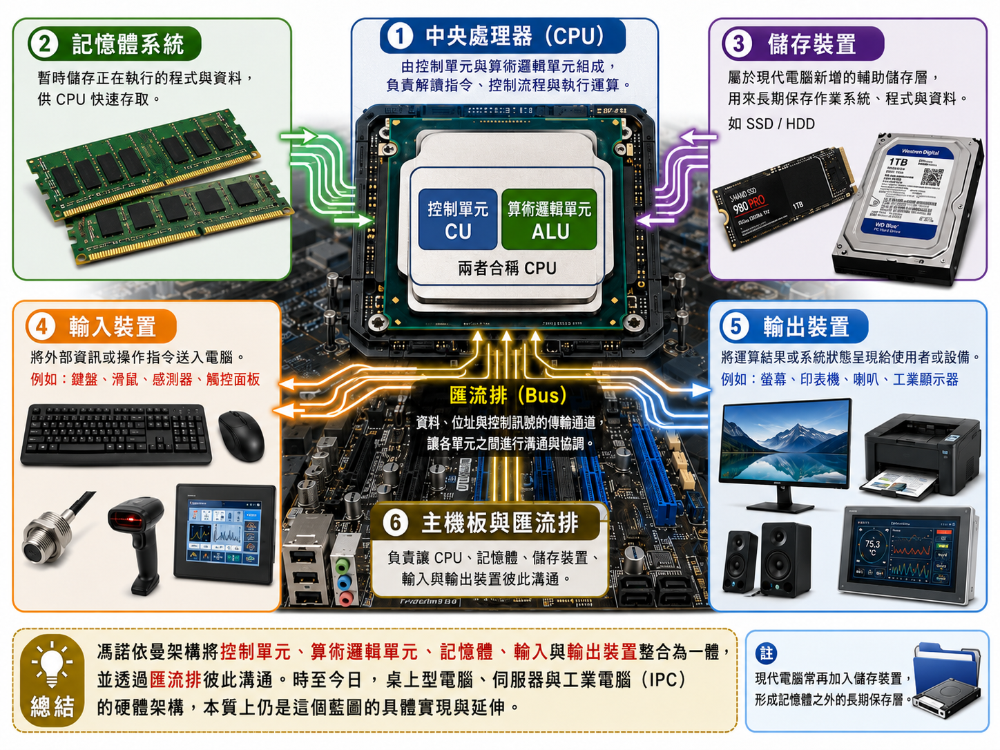

*本圖由 ChatGPT 生成，已由作者審核內容正確性*

本篇接下來就依循這個架構逐一介紹硬體：**中央處理器**（對應控制單元與算術邏輯單元）、**記憶體系統**、**儲存裝置**（現代電腦在馮諾依曼架構之外新增的輔助儲存層）、**輸入與輸出裝置**，以及讓這些元件彼此溝通的 **主機板與匯流排**，最後再介紹工業4.0時代興起的新型硬體。

### 1. CPU 基本組成與運作

[中央處理器（Central Processing Unit，CPU）](https://zh.wikipedia.org/zh-tw/中央處理器) 是電腦的核心，負責執行所有的運算與邏輯判斷，常被稱為電腦的「大腦」。CPU 主要由三個部分組成：

- [算術邏輯單元（ALU，Arithmetic Logic Unit）](https://zh.wikipedia.org/zh-tw/算術邏輯單元)：執行加減乘除等算術運算，以及 AND、OR、NOT 等邏輯判斷
- **控制單元（CU，Control Unit）**：從記憶體取得指令、解讀指令意義，並協調 ALU 與記憶體等各元件的運作
- [暫存器（Register）](https://zh.wikipedia.org/zh-tw/暫存器)：極少量但極高速的儲存空間，暫時存放 CPU 正在處理的資料

CPU 的運作遵循一個稱為 **取指—解碼—執行（Fetch-Decode-Execute）** 的循環：先從記憶體取得指令，解讀其意義，再執行對應的操作。這個循環每秒可重複數十億次，這就是[時脈頻率（Clock Speed，單位 GHz）](https://zh.wikipedia.org/zh-tw/時脈頻率) 所代表的意義——現代 CPU 每秒可執行數十億次指令。

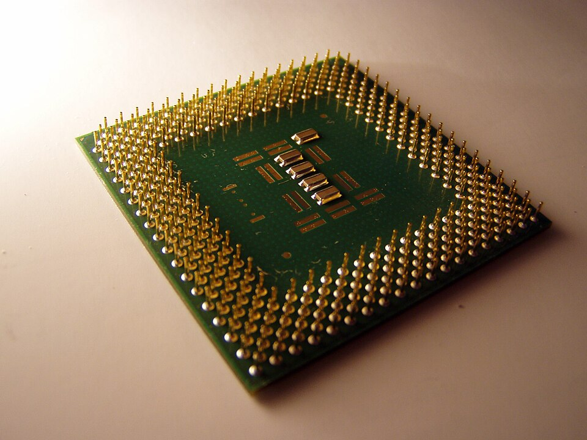

*圖片來源：[Wikimedia Commons「Cpu.jpg」](https://commons.wikimedia.org/wiki/File:Cpu.jpg)，作者 Poooow，公有領域（Public Domain）*

### 2. 多核心與平行處理

早期 CPU 只有一個核心，只能一次執行一個指令序列。[多核心（Multi-core）](https://zh.wikipedia.org/zh-tw/多核心處理器) CPU 將數個獨立的運算核心整合在同一晶片上，讓電腦能夠真正 **同時** 執行多個工作，稱為[平行處理（Parallel Processing）](https://zh.wikipedia.org/zh-tw/並行計算)。

例如，一顆 8 核心 CPU 理論上可以同時執行 8 個獨立的運算任務。這對於需要大量運算的應用（如影像分析、模擬運算）尤其重要。

**工業應用案例：生產排程最佳化**

工廠的生產排程（Production Scheduling）是一個計算上極為複雜的問題：在眾多機台、工人、訂單、截止日期的限制下，如何安排生產順序以最大化產能並最小化成本？這類排程問題（尤其是大規模的）需要強大的運算能力。多核心 CPU 配合平行演算法，可以同時探索多種可能的排程方案，大幅縮短求解時間——從可能需要數小時的計算壓縮到數分鐘內完成。

**即時控制系統** 則有不同的要求：不需要最複雜的運算，但對 **時間延遲（Latency）** 極度敏感。工業機器人的控制系統必須在幾毫秒（甚至微秒）內回應感測器輸入，否則可能造成加工誤差甚至安全事故。這類系統通常使用專為即時控制設計的處理器與作業系統。

> **小結**：CPU 的效能（核心數、時脈頻率、快取大小）直接影響系統的回應速度與運算能力。在選購或規劃工業電腦系統時，必須根據應用需求——是強調即時回應的控制任務，還是強調吞吐量的分析任務——來選擇合適的 CPU 規格。

### 3. GPU、顯示卡與 AI 晶片

[GPU（Graphics Processing Unit，圖形處理器）](https://zh.wikipedia.org/zh-tw/圖形處理器) 原本是為了快速渲染遊戲畫面而設計，其架構與 CPU 有本質上的差異：CPU 只有少數幾個核心，但每個核心都配備強大的控制單元與大容量快取，擅長處理需要複雜判斷、有先後順序的任務；GPU 則相反，擁有數千個結構簡單的運算核心（ALU），每個核心的控制與快取都很精簡，但可以同時對大量資料執行相同的運算，也就是 **大規模平行運算**，如下圖所示：

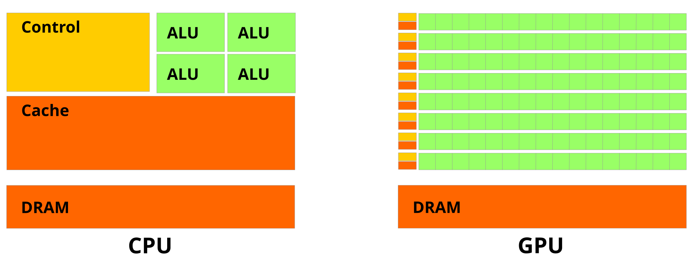

*圖片來源：[Wikimedia Commons「Cpu-gpu.svg」](https://commons.wikimedia.org/wiki/File:Cpu-gpu.svg)，作者 NVIDIA（取自 NVIDIA CUDA Programming Guide），授權 CC BY 3.0*

下圖則是實際 GPU 晶片（GeForce RTX 3090）的顯微攝影照片，可以看到晶片本體（die）上蝕刻的 NVIDIA 品牌字樣，以及周圍密密麻麻、用來與電路板連接的接點：

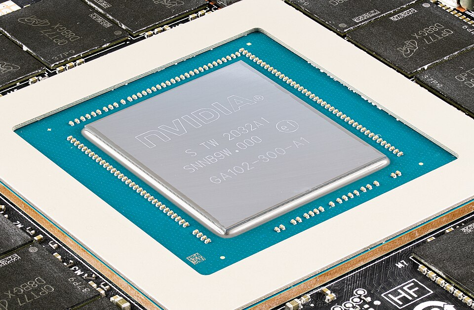

*圖片來源：[Wikimedia Commons「Nvidia@8nm@Ampere@GA102@GeForce RTX 3090...jpg」](https://commons.wikimedia.org/wiki/File:Nvidia@8nm@Ampere@GA102@GeForce_RTX_3090@S_TW_2032A1_SNNB9W.000_GA102-300-A1_DSC06025-DSC06107_(50740715646).jpg)，攝影師 Fritzchens Fritz，公有領域（CC0，Public Domain）*

> **有趣小知識**：NVIDIA 曾與知名科普節目《流言終結者（MythBusters）》合作拍攝一支經典示範影片：主持人先用機關槍一發一發擊發顏料彈，慢慢描出《蒙娜麗莎》的輪廓，代表 CPU「依序、逐一處理」的運作方式；接著改用上千管顏料彈同時擊發，一瞬間就完整畫出整幅《蒙娜麗莎》，代表 GPU「同時、大量平行處理」的威力。[點此觀看影片](https://www.youtube.com/watch?v=Ge-g3xZ5bb8)，能直觀感受「循序運算」與「平行運算」的差異。

不過這支影片容易讓人誤以為 GPU 全面「比 CPU 強」，實際上兩者是 **分工互補** 的關係，而非誰取代誰：CPU 擅長需要複雜邏輯判斷、有先後順序的任務（例如作業系統排程、程式流程控制），只在「同一種運算、大量重複」的情境下，GPU 才能發揮平行處理的優勢。一台完整的電腦或 AI 系統仍然需要 CPU 負責整體協調與複雜邏輯，再把適合平行化的運算工作交給 GPU 執行，兩者缺一不可。

這種「數千個小核心同時運算」的特性，其實正好呼應了螢幕畫面呈現的本質：一張畫面由數百萬個像素組成，每個像素的顏色計算大多彼此獨立，可以同時平行運算完成；播放動畫更是如此，每一影格都必須在極短時間內重新計算數百萬個像素——這正是 GPU 從一開始就被設計成「數千個小核心同時平行運算」的原因。而深度學習模型的核心運算——大量的矩陣乘法——同樣具有「同一種運算、大量重複、彼此獨立」的特性，與繪圖運算的本質相通。也因為這個共通點，原本專為多媒體繪圖設計的 GPU，才被研究者發現同樣適合拿來加速 AI 運算，使 GPU 逐漸從單純的「繪圖晶片」，發展成今日訓練與執行 AI 模型不可或缺的主力硬體；但即使是 AI 工作站，依然需要 CPU 負責系統排程與資料前處理，才能讓 GPU 專心加速運算。

**顯示卡（Graphics Card，俗稱顯卡）** 是將 GPU、專屬的[視訊記憶體（VRAM，Video RAM）](https://zh.wikipedia.org/zh-tw/顯示記憶體) 與散熱模組整合在一起的獨立硬體元件，透過 PCIe 插槽安裝在主機板上；許多筆電與商用電腦的 CPU 則內建 **內顯（Integrated Graphics）**，效能較弱，但足以應付文書處理、影音播放等一般需求，不需另外加裝獨立顯示卡。

**AI 晶片與神經網路晶片**：為了讓 AI 運算更有效率，近年業界也發展出專為 AI 設計的晶片，統稱為 **AI 加速器（AI Accelerator）**：

- **NPU（Neural Processing Unit，神經網路處理器）**：常見於手機、筆電等裝置，專門加速 AI 推論（Inference）並降低耗電，是目前許多「AI PC」與智慧型手機宣傳的重點規格。
- [TPU（Tensor Processing Unit，張量處理器）](https://zh.wikipedia.org/zh-tw/張量處理單元)：由 Google 研發，專門加速張量（多維矩陣）運算，大量部署於資料中心，用於訓練與執行大型 AI 模型。
- 這類晶片多屬於[特殊應用積體電路（ASIC，Application-Specific Integrated Circuit）](https://zh.wikipedia.org/zh-tw/特定應用積體電路)：以犧牲通用彈性為代價，換取在特定 AI 運算任務上遠優於通用 CPU／GPU 的效能與能源效率。

> **延伸閱讀**：本節只先說明 GPU／AI 晶片「為什麼適合」加速 AI 運算的硬體原理；機器學習與深度學習訓練、推論的實際運作方式，請見 [06-Data-Science-AI-and-Smart-Manufacturing.md](06-Data-Science-AI-and-Smart-Manufacturing.md)〈二、資料科學與人工智慧〉與〈三、當代人工智慧議題〉。

---

## 八、記憶體單元（記憶體系統、儲存裝置）

不論是主記憶體（RAM）、硬碟（HDD）、固態硬碟（SSD），還是隨身碟、光碟，本質上都是電腦用來存放資料的「**記憶單元（Memory Unit）**」，差別只在於速度、容量、成本與是否斷電後仍保留資料。本章依存取速度由快到慢，依序介紹這些記憶單元。

### 1. 揮發性儲存：主記憶體與快取

[主記憶體（Main Memory / RAM，隨機存取記憶體）](https://zh.wikipedia.org/zh-tw/隨機存取記憶體) 是電腦執行程式時，暫時存放程式碼與資料的工作區域，屬於 **揮發性儲存（Volatile Storage）**。RAM 的特性是：

- **速度快**：存取時間以奈秒（ns）計算
- **揮發性（Volatile）**：斷電後資料消失，只能暫存，不能長期保存

**快取記憶體（Cache Memory）** 是 CPU 內部或緊鄰 CPU 的超高速記憶體，容量遠小於 RAM，但速度更快。CPU 會將最近或最常用的資料預先複製到快取，下次需要時直接從快取取用，避免等待較慢的 RAM，大幅提升執行效率。

### 2. 記憶體階層與效能

電腦的記憶體系統由多層組成，越靠近 CPU 的層級速度越快、成本越高、容量越小。各層級的容量、速度與成本差異，整理如下：

| 層級 | 常見容量 | 存取時間（延遲） | 每 GB 成本 | 揮發性 |
| --- | --- | --- | --- | --- |
| CPU 暫存器（Register） | 數十個（Bytes 等級） | < 1 ns | 極高 | 揮發性 |
| L1／L2／L3 快取 | 數十 KB～數十 MB | 約 1–20 ns | 很高～較高 | 揮發性 |
| 主記憶體（RAM） | 數 GB～數百 GB | 約 50–100 ns | 中等 | 揮發性 |
| 儲存裝置（SSD/HDD） | 數百 GB～數十 TB | SSD 約 10–100 μs／HDD 約 5–10 ms | 低 | 非揮發性 |

由上表可以看出：越靠近 CPU 的層級，容量越小、成本越高，但延遲以「奈秒（ns）」計算；一旦跨越到主記憶體以外的儲存裝置，延遲就跳升到「微秒（μs）」甚至「毫秒（ms）」等級——這正是為什麼即時系統會盡量把常用資料留在 RAM 甚至快取中，而不是每次都向硬碟或 SSD 讀取。

CPU 暫存器與 L1、L2、L3 快取雖然速度、容量各不相同，但目前的處理器設計都已將這四者 **整合在同一顆 CPU 晶片內部**：暫存器與 L1 快取通常各自專屬於單一核心，L2 快取多為單一核心獨享或少數核心共享，L3 快取則進一步放大、由晶片上所有核心共享。正因為全部整合在晶片內，資料不需要離開 CPU 就能在這幾層之間快速交換，這也是它們的延遲能維持在奈秒等級的關鍵原因；相對地，主記憶體與儲存裝置都是透過主機板上的匯流排與 CPU 晶片外部連接，資料必須離開晶片，延遲自然大幅增加。

這個階層設計的目標是在成本可接受的前提下，讓 CPU 盡可能快速地取得所需資料。表中最底層的「儲存裝置」，就是接下來要介紹的非揮發性儲存。

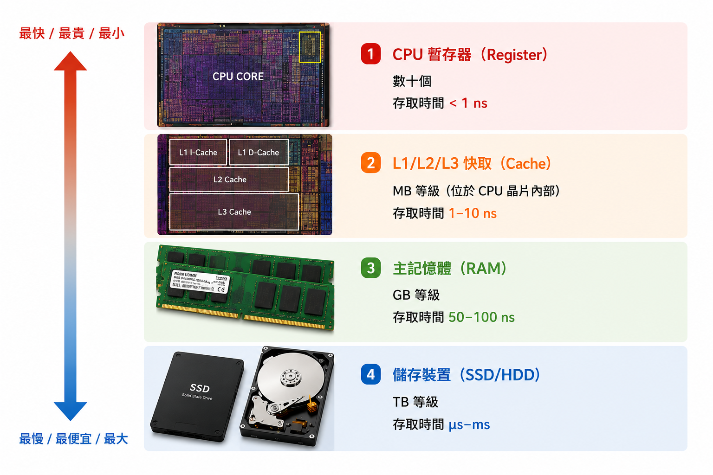

*本圖由 ChatGPT 生成，已由作者審核內容正確性*

### 3. 非揮發性儲存：HDD、SSD、隨身碟與光碟

相對於第 1 小節介紹的 **揮發性儲存（RAM）**，本節要介紹的是 **非揮發性儲存（Non-volatile Storage）**：斷電後資料仍會保留，但存取速度通常比 RAM 慢上許多。兩者的差異整理如下：

| 比較項目 | 揮發性儲存（RAM） | 非揮發性儲存（HDD／SSD／隨身碟／光碟） |
| --- | --- | --- |
| 斷電後資料 | 消失 | 保留 |
| 存取速度 | 極快（奈秒等級） | 較慢（微秒～毫秒等級，依媒體而異） |
| 常見容量 | 較小（GB 等級，例如記憶體多半是16-128GB） | 範圍較大（大的可達 TB 等級，例如主流的 SSD 大概為 1-2TB、HDD 多以 2TB 起跳，小的例如隨身碟多在 512GB 以下、藍光光碟為 50 GB 以下） |
| 每 GB 成本 | 較高 | 較低 |
| 主要用途 | 暫存執行中的程式與資料 | 長期保存程式與資料 |

> **補充小知識**：「非揮發性」指的是不需要持續通電就能保留資料，這正是它與 RAM、快取記憶體最大的差異；但這不代表非揮發性儲存裝置「永遠不會壞」——HDD 仍可能因機械故障而損毀，SSD 與隨身碟的快閃記憶體有寫入次數上限、用久了會耗損，光碟片也可能因刮傷、褪色而無法讀取。任何儲存媒體都有其壽命與故障風險，資料保護仍須搭配定期備份與汰換，而不是仰賴單一裝置「一勞永逸」。

常見的非揮發性儲存媒體有以下幾種：

[HDD（Hard Disk Drive，硬碟機）](https://zh.wikipedia.org/zh-tw/硬碟) 利用磁頭讀寫旋轉的磁性碟片：容量大、每 GB 成本低，但含有機械轉動零件，容易因震動或撞擊損壞，讀寫速度也受限於機械轉速。

[SSD（Solid State Drive，固態硬碟）](https://zh.wikipedia.org/zh-tw/固態硬碟) 使用[快閃記憶體（Flash Memory）](https://zh.wikipedia.org/zh-tw/快閃記憶體)儲存資料，完全無機械零件：讀寫速度遠快於 HDD（可達 10 倍以上），抗震、耐衝擊、靜音、體積小，但同容量的成本高於 HDD，且寫入次數有限制。

**隨身碟（USB Flash Drive）與記憶卡（如 SD 卡）** 使用的也是與 SSD 相同的快閃記憶體技術，體積更小、可隨插即用，方便攜帶與交換資料，但容量與耐用度通常低於一般 SSD，常用於臨時資料交換、備份，或作為行動裝置與工業設備的擴充儲存。

**光碟片（Optical Disc，如 CD、DVD、藍光光碟 Blu-ray）** 是完全不同的儲存技術：利用雷射光讀寫碟片表面的凹凸紋路來記錄資料。優點是單片成本低、不易受電磁干擾、適合長期封存不常變動的資料（如出廠光碟、法規要求的歸檔備份）；缺點是讀寫速度慢、容量遠小於 HDD/SSD，且需要專用的光碟機才能讀取。隨著 USB 儲存與雲端儲存普及，光碟在一般消費與工業應用中已逐漸式微，但仍常見於資料封存與軟體發行等場景。

將以上四種常見的非揮發性儲存媒體綜合比較如下：

| 比較項目 | HDD | SSD | 隨身碟／記憶卡 | 光碟片（CD/DVD/藍光） |
| --- | --- | --- | --- | --- |
| 讀寫速度 | 約 100–200 MB/s | 約 500–7,000 MB/s | 約 10–400 MB/s | 約 1–50 MB/s |
| 抗震能力 | 弱（機械結構） | 強（無機械零件） | 強（無機械零件） | 中（怕刮傷、怕強光曝曬） |
| 噪音 | 有 | 無 | 無 | 讀取轉動時略有聲音 |
| 每GB成本 | 低 | 較高 | 中等 | 極低 |
| 可攜性 | 中（需拆機或外接盒） | 中（需拆機或外接盒） | 高（隨插即用） | 高（單片可直接攜帶） |
| 適用場景 | 大量冷資料儲存 | 系統碟、高速應用 | 臨時資料交換、行動擴充 | 長期封存、軟體發行 |

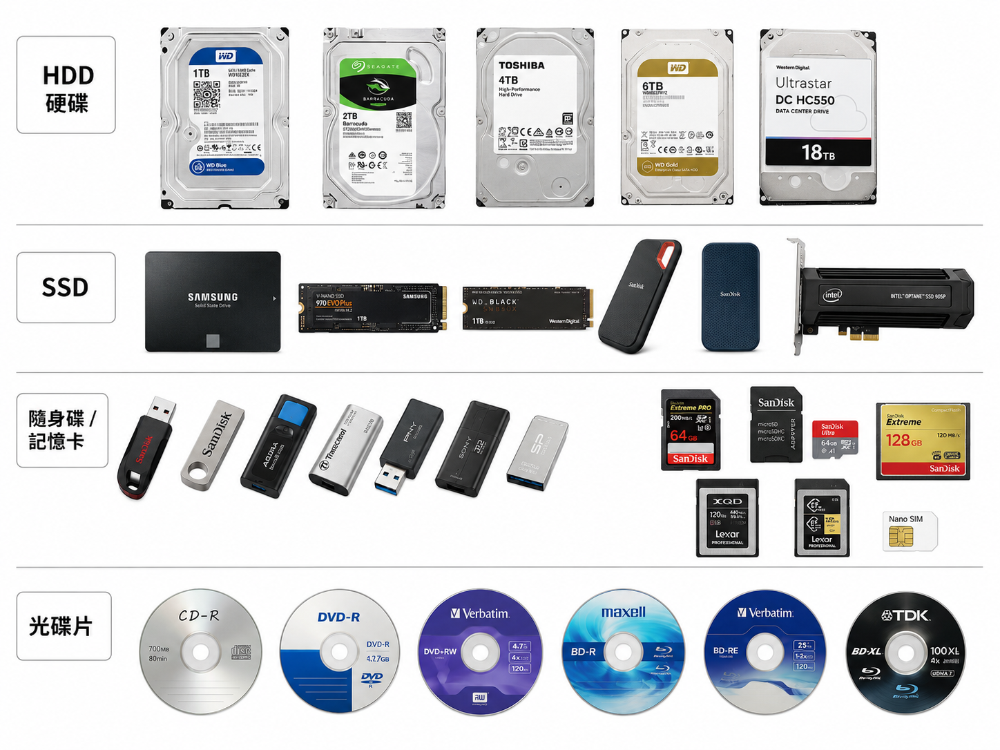

*本圖由 ChatGPT 生成，已由作者審核內容正確性*

### 4. 工業應用：即時資料緩衝與儲存需求

在智慧製造環境中，工廠部署了大量的感測器，每秒產生龐大的資料量（溫度、壓力、振動、電流……）。若每筆感測資料都即時寫入硬碟，硬碟的存取速度將成為瓶頸，導致資料遺失或系統延遲。

解決方案是利用 RAM 作為 **緩衝（Buffer）**：感測器資料先快速寫入 RAM，系統再以批次方式將 RAM 中的資料定期寫入較慢的儲存裝置。這種「寫緩衝」設計確保了即時資料不遺失，同時不讓存取延遲影響控制系統的即時性。工業場域中，有時還會使用 **非揮發性 RAM（NVRAM）** 或帶電池保護的 RAM，確保即使突然斷電，緩衝區中尚未寫入硬碟的資料也不會遺失。

而在非揮發性儲存的一端，現代智慧工廠每天產生的資料量同樣驚人：一條配備完整感測器的汽車零件生產線，每天可能產生數十 GB 至 TB 等級的資料，涵蓋機台狀態、加工參數、品質量測、影像紀錄等。工業儲存系統的設計需考量速度（即時寫入不得影響控制系統）、耐用性（SSD 更適合震動環境）、容量規劃（熱資料本地、冷資料雲端歸檔），以及可靠性（任何儲存裝置都可能故障，必須有備援機制）。

### 5. 基本備援概念（RAID）與資料可靠性

[RAID（Redundant Array of Independent Disks，獨立磁碟冗餘陣列）](https://zh.wikipedia.org/zh-tw/RAID) 是將多顆硬碟組合起來，提升效能或可靠性（或兩者兼顧）的技術。常見模式：

- **RAID 0（條帶化）**：資料分散寫在多顆磁碟，速度快，但任一磁碟故障即全盤失敗，可靠性低
- **RAID 1（鏡像）**：資料同時寫入兩顆磁碟（互為備份），任一磁碟故障仍可繼續運作，但容量利用率僅50%
- **RAID 5（分散奇偶校驗）**：兼顧速度與可靠性，允許一顆磁碟故障不失資料，是企業環境常用的折衷方案

在工業場景中，生產資料一旦遺失可能造成品質追溯失效、法規合規問題，甚至無法釐清事故責任。除 RAID 外，定期異地備份（如備份至雲端）也是完整資料保護策略的一部分。

---

## 九、輸入與輸出裝置（I/O）

### 1. 傳統 I/O 設備

電腦透過 **輸入裝置（Input Device）** 接收外部資料，例如使用者的按鍵、滑鼠移動或聲音；再透過 **輸出裝置（Output Device）** 將處理後的結果傳遞給外部世界，例如在螢幕上顯示畫面或透過喇叭播放聲音。輸入與輸出裝置合稱 **I/O 裝置**，在一般消費性電腦的情境中，也常被簡稱為 **電腦周邊（Peripherals）**——因為它們通常是外接於主機、圍繞在 CPU 周圍運作的元件。無論型態如何，I/O 裝置的共同目的都是扮演「人與電腦之間的橋樑」：讓人類能透過輸入裝置下達指令、控制電腦，也能經由輸出裝置直接觀察到電腦的運算過程與結果。

常見的 I/O 裝置可依功能分類如下：

| 類型 | 範例 |
| --- | --- |
| 輸入裝置 | 鍵盤、滑鼠、觸控螢幕、麥克風、攝影機、掃描器、遊戲手把／搖桿、VR 手把 |
| 輸出裝置 | 螢幕、印表機、喇叭、投影機、VR 頭盔 |
| 兼具輸入與輸出 | 觸控螢幕（顯示畫面＋接收觸控）、硬碟等儲存裝置（可讀取亦可寫入） |

> **小提醒**：硬碟等儲存裝置在〈八、記憶體單元（記憶體系統、儲存裝置）〉已經介紹過，這裡為什麼又被歸類為 I/O 裝置？因為兩章討論的是同一個裝置的不同面向：第八章關心的是「資料存放在記憶體階層的哪一層」（速度、容量、是否揮發）；本章關心的則是「CPU 如何與周邊元件溝通」——CPU 無法直接定址存取硬碟，必須透過 I/O 控制器與匯流排下達讀寫指令，資料才能在硬碟與主記憶體之間搬移，這正是「磁碟 I/O」一詞的由來。

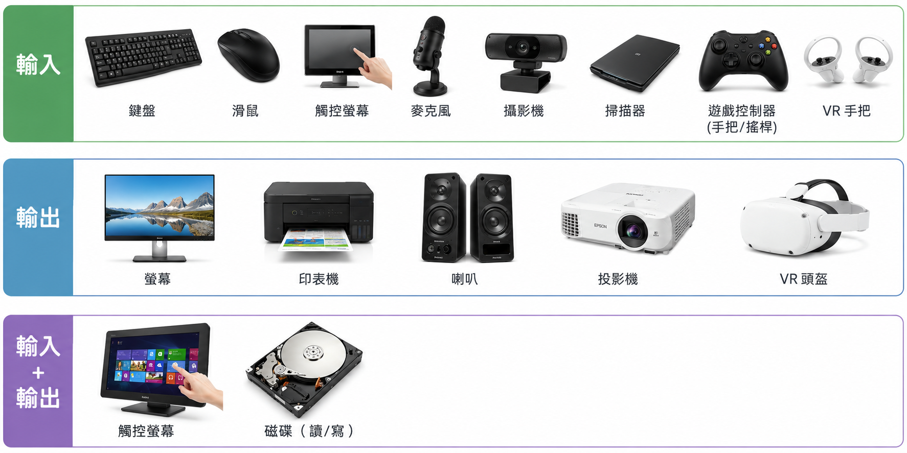

*本圖由 ChatGPT 生成，已由作者審核內容正確性*


### 2. 工業設備中的感測器與致動器

在工業環境中，I/O 的概念大幅延伸。[感測器（Sensor）](https://zh.wikipedia.org/zh-tw/感測器) 是工業系統的「輸入裝置」，將物理量轉換為電子訊號輸入電腦：

| 感測器類型 | 量測物理量 | 工業應用範例 |
| --- | --- | --- |
| 溫度感測器 | 溫度 | 監測熱處理爐溫度 |
| 壓力感測器 | 壓力 | 監測液壓系統壓力 |
| 光電感測器 | 有無物體 | 計數生產線上的零件 |
| 視覺感測器/工業相機 | 影像 | 外觀瑕疵檢測 |
| 振動感測器（加速度計） | 振動 | 設備健康監測（預測維護） |
| 編碼器（Encoder） | 位置/轉速 | 控制馬達精確定位 |

[致動器（Actuator）](https://zh.wikipedia.org/zh-tw/執行器) 是工業系統的「輸出裝置」，接受電腦指令後產生物理動作：電動馬達驅動輸送帶與機械手臂、氣壓缸或液壓缸推動夾具與沖壓機構、電磁閥控制液體或氣體的流量、警示燈與警報器通知操作人員異常狀況。

「感測器─電腦─致動器」這條迴路，構成了自動化製造的基礎：感測器偵測現況，電腦判斷是否需要調整，致動器執行調整動作。

### 3. 人機介面（HMI）

**HMI（Human-Machine Interface，人機介面）** 是工業現場讓操作人員與機器進行互動的介面，通常是一台具有觸控螢幕的工業級電腦，顯示機台狀態、報警訊息，並允許操作員輸入參數或下達指令。良好的 HMI 設計需要讓操作員在嘈雜、戴手套的工廠環境中，仍能快速判讀資訊並正確操作，強調清晰、直觀與容錯，與消費性電子產品的設計邏輯大不相同。

---

## 十、主機板

### 1. 主機板的角色與功能

[主機板（Motherboard）](https://zh.wikipedia.org/zh-tw/主機板) 是一片安裝在機殼內的大型印刷電路板（PCB），扮演電腦所有硬體元件的「骨幹」與「中樞」：它提供 CPU 插槽、記憶體插槽、擴充插槽（如 PCIe）與各種連接埠，讓 CPU、RAM、顯示卡、儲存裝置與周邊設備能夠實際安裝、固定並互相連接；主機板上的[晶片組（Chipset）](https://zh.wikipedia.org/zh-tw/晶片組) 則負責協調這些元件之間的資料流動，並將主機電源供應器送來的電力，依各元件需求分配到正確的電壓與位置。換句話說，若把 CPU 比喻為電腦的大腦，主機板就是連結大腦與身體各器官的神經系統與骨架。

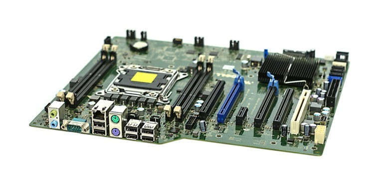

*圖片來源：[Wikimedia Commons「Computer-motherboard.jpg」](https://commons.wikimedia.org/wiki/File:Computer-motherboard.jpg)，作者 Marcin Wieclaw，授權 CC BY-SA 4.0*

上圖是一片典型的 ATX 主機板：中央方形的插槽（黃色保護蓋處）是 **CPU 插槽**，其旁邊一排排的插槽是 **記憶體插槽**；下方深色的長條插槽是提供顯示卡等裝置使用的 **PCIe 插槽**；左側則是滑鼠、鍵盤、網路線、USB 裝置等周邊設備的連接埠。

### 2. 匯流排與資料傳輸

主機板透過稱為 **匯流排（Bus）** 的電路連接，讓 CPU、RAM、儲存裝置、顯示卡等各元件能夠相互通訊、傳遞資料。常見連接介面包括：[PCIe（PCI Express）](https://zh.wikipedia.org/zh-tw/PCI_Express)（高速連接顯示卡、NVMe SSD 等高頻寬裝置）、[SATA](https://zh.wikipedia.org/zh-tw/序列ATA)（連接傳統 HDD 與 SATA SSD），以及 [USB](https://zh.wikipedia.org/zh-tw/USB)（連接鍵盤、滑鼠、隨身碟等周邊設備）。

匯流排依傳遞內容的不同，又可細分為三種：**位址匯流排（Address Bus）** 傳遞資料要存取的記憶體位址、**資料匯流排（Data Bus）** 實際傳輸資料本身、**控制匯流排（Control Bus）** 傳遞讀取／寫入等控制訊號，三者共同構成連接 CPU、記憶體與輸入輸出裝置的系統匯流排（System Bus），如下圖所示：

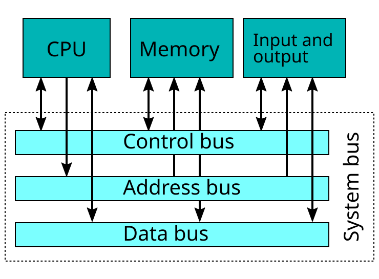

*圖片來源：[Wikimedia Commons「Computer system bus.svg」](https://commons.wikimedia.org/wiki/File:Computer_system_bus.svg)，作者 W Nowicki，授權 CC BY-SA 3.0*

上圖是匯流排的概念示意，實際上「匯流排」在主機板上就是一束並排的細小銅箔線路，如下圖所示：

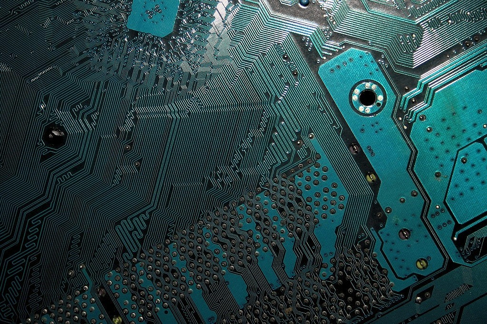

*圖片來源：[Wikimedia Commons「Motherboard bus.jpg」](https://commons.wikimedia.org/wiki/File:Motherboard_bus.jpg)，作者 Chrihern，公有領域（Public Domain）*

照片中一條條並排、彎曲走線的銅箔，就是實際的位址／資料／控制匯流排線路；設計者刻意讓每組線路的長度盡量相同（因此走線常出現規律的鋸齒狀彎折），確保訊號能同時抵達目的地，避免時序不同步造成資料錯誤。

### 3. 工業通訊概念

第 1、2 小節介紹的主機板與匯流排，是「一台電腦內部」元件相互溝通的方式；若把視角從一片主機板拉大到一整座工廠，數十乃至數百台機台、感測器與電腦系統之間，同樣需要類似匯流排的概念來讓資料互通——只是規模從電路板等級，擴大到整個廠房，而一般辦公環境中電腦與周邊設備間相對單純的連接方式，已不敷使用。

[PLC（Programmable Logic Controller，可程式邏輯控制器）](https://zh.wikipedia.org/zh-tw/可程式化邏輯控制器) 是工廠自動化的核心元件，是一種專為工業環境設計的強固型電腦，能在惡劣的溫度、濕度與震動條件下穩定運作（Bolton, 2015）。PLC 的主要任務是根據預先設定的邏輯，即時控制機台動作（例如：「若感測器偵測到零件到位，則啟動夾具夾緊，再啟動鑽頭加工」），一般電腦負責上層的資料蒐集與分析，PLC 負責底層的即時控制。值得注意的是，許多工業級 PLC 採用「機架式（Rack-based）」架構：各種輸入／輸出模組插在同一個機架上，透過機架 **背板匯流排（Backplane Bus）** 互相溝通並取得電力——這與第 1 小節主機板插槽、第 2 小節匯流排的概念完全相同，只是外型從桌上型電腦的主機板，換成了適應工廠環境的強固型機架，如下圖所示：

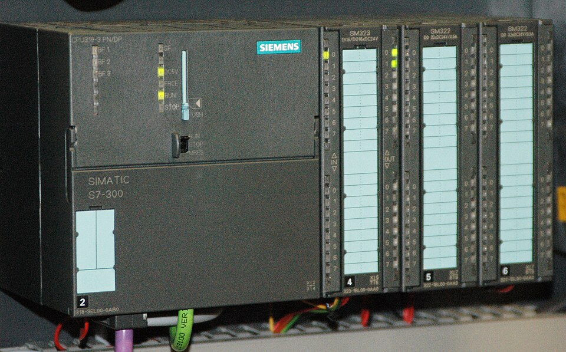

*圖片來源：[Wikimedia Commons「S7300.JPG」](https://commons.wikimedia.org/wiki/File:S7300.JPG)，作者 Ulli1105，授權 CC BY-SA 2.5*

照片左側是負責運算與邏輯判斷的 CPU 模組，右側 SM322、SM323 等則是輸入／輸出模組，各模組並排卡在同一條導軌上，彼此透過背板匯流排交換資料——概念上就等於一片被拉直、模組化的主機板。

**SCADA（Supervisory Control and Data Acquisition，監控與資料擷取系統）** 是一套結合硬體與軟體的系統，負責從工廠各處的 PLC 與感測器蒐集資料，集中顯示於監控中心的畫面，並允許操作員遠端下達控制指令。SCADA 廣泛應用於製造業、電力、自來水、石油管線等關鍵基礎設施的監控管理。

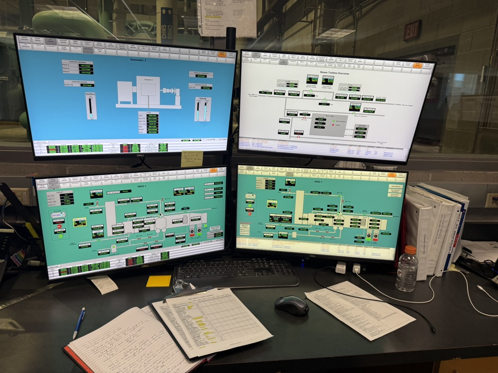

*圖片來源：[Wikimedia Commons「Chiller plant SCADA system.jpg」](https://commons.wikimedia.org/wiki/File:Chiller_plant_SCADA_system.jpg)，作者 Rsparks3，公有領域（CC0，Public Domain）*

操作員只需坐在這個監控台前，就能同時掌握廠內多套設備（發電機、渦輪機、鍋爐等）的即時運轉狀態，並在異常發生時立即介入處理——這正是 SCADA「集中監控、遠端操作」的具體樣貌。

### 4. 基礎工業網路

> **延伸閱讀**：本節僅先點出工業通訊協定的名稱與角色；這些協定如何分層組成從現場設備到雲端的完整智慧工廠網路架構，請見 [04-Networks-and-Internet.md](04-Networks-and-Internet.md)〈二十三、智慧製造網路架構（概念性）〉。

工業設備間的通訊不能使用一般消費性裝置的 Wi-Fi 或 USB，需要可靠、低延遲且能抗電磁干擾的工業通訊協定，這些協定可以視為「匯流排」概念從機板內部的短距離高速通訊，延伸到工廠現場的長距離可靠通訊：

- **Modbus**：歷史悠久的工業序列通訊協定，簡單可靠
- **PROFIBUS / PROFINET**：廣泛應用於歐洲工廠的現場匯流排協定，PROFIBUS 的英文全名「Process Field Bus（製程現場匯流排）」，命名上就直接繼承了「匯流排（Bus）」的概念
- **EtherNet/IP**：基於標準乙太網路技術的工業通訊協定，因使用熟悉的網路基礎設施而日益普及

---

## 十一、新興硬體與工業4.0

工業4.0的核心概念，是將實體設備與資訊系統緊密結合，形成能自我感測、分析並回應的「[資訊物理系統（Cyber-Physical System, CPS）](https://en.wikipedia.org/wiki/Cyber-physical_system)」（Lee et al., 2015）；以下介紹的 IoT、邊緣運算與 AI 硬體，正是實現這套架構的關鍵新興硬體。

### 1. IoT（物聯網）設備

**物聯網（Internet of Things，IoT）** 是指將各種實體裝置連接到網際網路，使其能夠蒐集資料、相互通訊的概念。在工業領域，這被稱為 **工業物聯網（IIoT，Industrial Internet of Things）**（Xu et al., 2014）。IIoT 設備通常是小型、低功耗的嵌入式裝置，具備感測器（收集資料）、微控制器（處理資料）與無線通訊模組（傳送資料，如 Wi-Fi、4G/5G、LoRa）。透過 IIoT，原本孤立的機台資料可以匯聚到中央平台，使工廠管理者不再需要在現場親自巡視，就能掌握全廠設備的即時狀態。

### 2. 邊緣運算（Edge Computing）

傳統雲端架構的資料流向是：感測器 → 網路 → 雲端伺服器 → 分析結果 → 回傳控制指令。然而這樣的流程存在 **網路延遲（Latency）** 問題：若雲端伺服器距離遙遠，來回一趟可能需要數百毫秒，對於需要即時反應的工業控制，這是無法接受的。

[邊緣運算（Edge Computing）](https://zh.wikipedia.org/zh-tw/邊緣運算) 的概念是：將運算能力部署到靠近資料來源的「邊緣」（如工廠現場的一台伺服器，甚至是感測器本身），讓資料在本地就完成即時分析與決策，只將重要的彙整結果或異常警報傳送到雲端（Shi et al., 2016）。這帶來低延遲（本地運算毫秒內完成）、降低頻寬需求（不需將所有原始資料傳至雲端）以及離線運作能力（即使網路中斷，本地控制仍能維持）等優點。

邊緣運算與雲端運算不是競爭關係，而是互補：邊緣負責即時、本地的運算；雲端負責跨廠區的長期資料儲存、全域分析與模型訓練。

### 3. GPU 在影像檢測與品質控制的應用

在製造業的品質控制中，[機器視覺（Machine Vision）](https://zh.wikipedia.org/zh-tw/機器視覺) 系統利用工業相機拍攝產品影像，再交由深度學習模型（執行於 GPU 或 AI 晶片上，詳見〈七、中央處理器（CPU）與運算架構〉）判斷是否有瑕疵（如刮痕、變形、缺料）。相較於人工目視檢測，機器視覺速度快（每秒可檢測數十至數百個產品）、一致性高（不受疲勞或情緒影響）、可留存記錄（支援品質追溯）。GPU 與 AI 晶片加速的深度學習影像檢測，已成為現代智慧製造不可或缺的品質保障工具。

### 4. AI 工作站：馮諾依曼架構在 AI 時代的縮影

以 NVIDIA 於 2025 年推出的迷你 AI 超級電腦 **DGX Spark** 為例（NVIDIA, 2025），這台外型只比一個路由器略大的裝置，正是本篇一路介紹的電腦硬體架構，在 AI 時代的具體縮影——它同樣由 CPU、GPU、記憶體、儲存裝置與高速匯流排組成，只是每一項規格都被拉高到足以應付 AI 訓練與推論的需求：

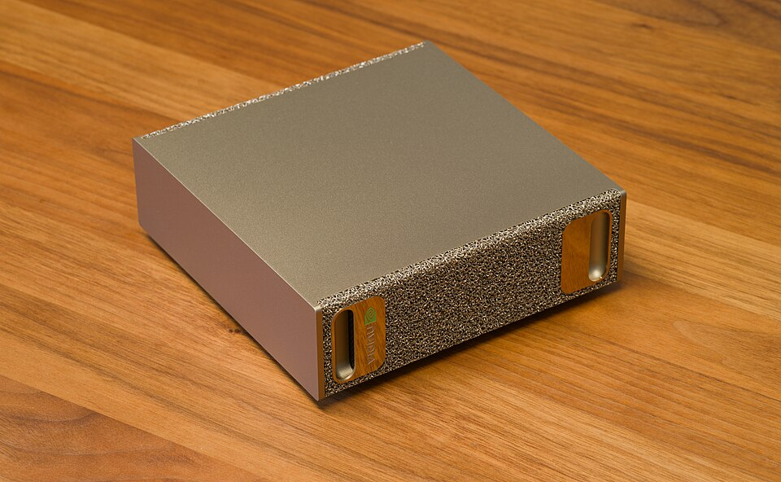

*圖片來源：[Wikimedia Commons「Nvidia DGX Spark oblique view dllu.jpg」](https://commons.wikimedia.org/wiki/File:Nvidia_DGX_Spark_oblique_view_dllu.jpg)，攝影師 Daniel Lu（User:dllu），授權 CC BY-SA 4.0*

DGX Spark 的核心是 **GB10 Grace Blackwell 超級晶片**：一顆結合 20 核心 Arm CPU（10 個高效能核心＋10 個省電核心，呼應〈七、中央處理器（CPU）與運算架構〉提到的多核心設計）與 Blackwell 架構 GPU 的單一晶片，兩者再透過高速互連技術直接相連。它的每一項規格，幾乎都是為了滿足 AI 運算的需求而設計：

- **128 GB 統一記憶體（Unified Memory）**：AI 模型動輒有數十億甚至上兆個參數，訓練與推論前都必須先載入記憶體才能運算；「統一」代表 CPU 與 GPU 共用同一塊記憶體，不需要像傳統架構那樣在 CPU 主記憶體與獨立顯示卡的 VRAM 之間來回複製資料——這正好緩解了〈一、計算機科學的思想基礎〉提到的 **馮諾依曼瓶頸**，讓資料搬移的延遲大幅降低。
- **上千個 Tensor Core、每秒可達 1 PFLOP（一千兆次浮點運算）的算力**：呼應〈七、中央處理器（CPU）與運算架構〉「GPU、顯示卡與 AI 晶片」小節提到的大規模平行運算——深度學習的核心運算是巨量的矩陣乘法，正需要數千個核心同時平行處理才能加速。
- **4 TB 高速固態硬碟（SSD）**：訓練用的資料集與模型檢查點（Checkpoint）動輒數百 GB，若儲存裝置的讀寫速度跟不上，再強的運算核心也只能空等資料，呼應〈八、記憶體單元（記憶體系統、儲存裝置）〉提到「儲存速度可能成為系統瓶頸」的概念。

換句話說，即使技術演進到了生成式 AI 的時代，電腦仍然遵循著圖靈、馮諾依曼奠定的基本架構——CPU＋記憶體＋儲存＋輸入輸出，只是每個部件都因應新的運算需求不斷演化。對工業工程管理的學生而言，理解這套架構，才能看懂企業導入 AI 應用（如良率預測、視覺檢測、生成式排程建議）時，硬體採購規劃需要考慮的不只是「買一台厲害的電腦」，而是記憶體、算力與儲存三者是否均衡搭配。

---

## 第四篇：電腦系統架構——軟體：作業系統

---

## 十二、作業系統概述

### 1. OS 的角色與功能

[作業系統（Operating System，簡稱 OS）](https://zh.wikipedia.org/zh-tw/作業系統) 是管理電腦硬體資源、並為應用程式提供執行環境的核心系統軟體（Silberschatz et al., 2018）。若缺乏作業系統，應用程式必須直接與底層硬體進行溝通，這將大幅增加軟體開發與執行的複雜度。它的角色就像是「餐廳的總經理」，如果沒有作業系統，手機或電腦裡的 App（應用程式）就必須自己去搬桌椅、進廚房、管帳目，這對 App 來說簡直是不可能的任務。

**作業系統的核心功能** 主要包括：

- **資源管理**：負責協調與分配中央處理器（CPU）時間、記憶體空間及儲存裝置等系統資源給各個執行程式。
- **硬體抽象化**：隱藏底層硬體的技術細節，為應用程式提供統一的標準介面（例如：不論印表機廠牌為何，應用程式皆透過相同的系統呼叫進行列印）。
- **使用者介面**：提供人類與電腦互動的媒介，包含[圖形使用者介面（GUI）](https://zh.wikipedia.org/zh-tw/圖形使用者介面)與[命令列介面（CLI）](https://zh.wikipedia.org/zh-tw/命令列介面)。
- **安全性與防護**：嚴格控管各個程式與使用者對系統資源的存取權限，防止未授權的干擾。

**具體而言**：在缺乏作業系統的環境下，即使是開發一款簡單的純文字編輯軟體（例如「記事本」），開發者也必須親自撰寫程式去處理鍵盤訊號偵測、硬碟寫入軌道、以及螢幕顯示訊號等底層細節。而作業系統的角色即是整合並封裝了這些繁雜的硬體溝通與資源分配工作。你都必須親自寫程式去抓鍵盤按鍵的微弱電流、去控制硬碟磁區的轉動、還要調整螢幕發光的發光二極體（LED）。

藉由作業系統提供的基礎服務，程式設計師得以專注於軟體核心功能的開發，無需耗費精力在底層的硬體操作上，只要專心把「記事本」的功能和畫面寫好就可以了。

### 2. 常見的作業系統

作業系統依使用場景可分為個人電腦、行動裝置、伺服器／雲端、嵌入式系統四大類；依授權模式則可分為 **開放原始碼（Open Source）**（原始碼公開，任何人可檢視、修改、散布）與 **私有／封閉原始碼（Proprietary）**（原始碼不公開，由單一廠商掌控開發與授權）兩種：

| 使用場景 | 開放原始碼 | 私有（封閉原始碼） |
|---------|-----------|-------------------|
| 個人電腦／桌面 | Linux 各發行版（Ubuntu、Fedora、Debian 等） | Windows、macOS |
| 行動裝置 | Android（核心原始碼開放，各手機廠商再客製化後多以封閉形式發行） | iOS／iPadOS、HarmonyOS（部分模組開源） |
| 伺服器／雲端 | Linux 各發行版（Ubuntu Server、Red Hat Enterprise Linux、CentOS）、FreeBSD | Windows Server、Unix 系列（如 IBM AIX、Oracle Solaris） |
| 嵌入式／即時系統 | FreeRTOS、Zephyr | VxWorks、QNX |

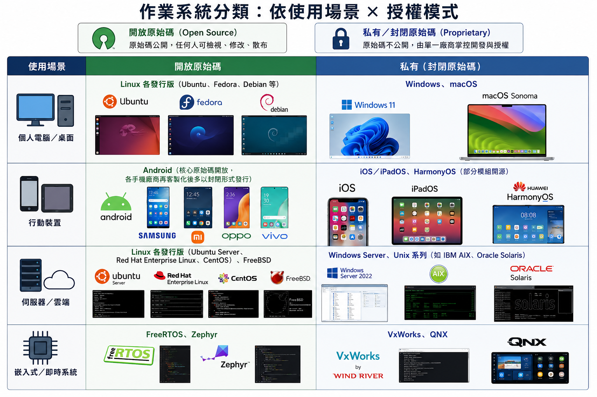

*本圖由 ChatGPT 生成，已由作者審核內容正確性*

#### 桌面作業系統

如果是個人電腦，你最常接觸的作業系統大概有三類：

- **Windows**：目前桌上型電腦與企業環境中最普及的作業系統，具備直覺的使用者介面與豐富的軟體生態系，市面上絕大多數的應用軟體、遊戲與顯示卡驅動程式（如 NVIDIA）都完整支援。
- **macOS**：蘋果公司（Apple）專為 Mac 系列電腦設計的作業系統，以 Unix 架構為基礎，強調流暢度與美觀的介面設計，並與 iPhone、iPad 等蘋果自家裝置深度整合。
- **Linux**：開放原始碼（Open Source）的作業系統，穩定性高、客製化彈性大、安全性強，廣泛應用於伺服器、雲端平台、AI 工作站與嵌入式系統。原始碼公開也讓 Linux 衍生出數百種[發行版（Distribution）](https://zh.wikipedia.org/zh-tw/Linux發行版)，例如適合入門的 Ubuntu、Fedora，以及面向企業級伺服器的 Red Hat Enterprise Linux（RHEL）。

> **補充小知識**：細心的同學可能會發現，市面上的 Mac 電腦幾乎看不到 NVIDIA 顯示卡的蹤影。這其實不是單純的產品線選擇——Apple 與 NVIDIA 一度因顯示卡瑕疵與驅動程式支援等爭議關係生變，蘋果自 2018 年起的 macOS 版本便不再原生支援 NVIDIA 顯示卡；加上近年 Apple 全面轉向自家設計的 Apple Silicon（M 系列晶片）與內建 GPU，兩家公司的產品線也就漸行漸遠。也因此，若想在桌上型電腦暢玩高效能、高顯卡規格需求的遊戲，目前幾乎只剩 Windows 這個選擇。

#### 行動作業系統

這個你可能更熟悉，因為手機或平板大概就這兩種作業系統：

- **Android**：由 Google 主導開發，其核心基於 Linux 且原始碼開放，憑藉著高度的硬體相容性與彈性，成為全球市占率最高的行動作業系統。
- **iOS／iPadOS**：為蘋果公司專為 iPhone 與 iPad 設計的封閉原始碼系統，以極佳的系統流暢度、直覺的操作體驗及完善的生態圈整合著稱。

#### 伺服器與嵌入式作業系統

近年來 AI 伺服器與工作站的發展相當快速，這類硬體多數皆採用伺服器作業系統。相較於面向個人操作、強調圖形介面與多媒體體驗的桌面與行動作業系統，伺服器與嵌入式作業系統更專注於系統穩定性、大規模資源調度、特定硬體的高效控制以及長期不間斷的運作能力：

- **伺服器與雲端平台作業系統**：主流以 Linux 發行版與微軟的 Windows Server 為主。隨著雲端運算技術的興起，這些系統也成為各大雲端服務供應商（如 AWS、Azure、Google Cloud）建置大型資料中心與虛擬化環境的基礎底層。
- **嵌入式作業系統（Embedded OS）**：專為硬體資源有限的特定裝置（如 PLC、工業路由器、醫療設備）所設計，典型代表包括 FreeRTOS、VxWorks 與 QNX。此類系統的設計核心在於即時性（Real-time），必須保證系統能在嚴格且精準的時間限制內完成指令響應，以確保設備運作的安全與穩定。

### 3. 工業應用：設備控制系統中的 OS

工業設備的控制系統對 OS 有特殊要求：即時性（必須在確定的時間內回應感測器輸入）、穩定性（工廠機台往往 24 小時不間斷運作，OS 不能無故當機）、強固性（需在高溫、高濕、電磁干擾的環境下正常運作），以及安全性（防止未授權存取或惡意軟體入侵控制系統）。這些需求使得工業控制系統通常採用嵌入式即時 OS，而非一般的 Windows 或標準 Linux。

工業現場使用的作業系統，種類上其實仍不脫上表所列的這些系統家族，但 **版本與設定通常和家用、辦公室環境不同**。例如同樣掛名 Windows，產線的人機介面（HMI）電腦可能安裝的是專為工業用途設計的 **Windows IoT Enterprise**，而非一般消費者購買電腦時附帶的家用版；同樣是 Linux，控制器裡跑的也往往是經過裁剪、拿掉不必要功能以換取更高穩定性與即時性的 **即時強化版本（如加上 PREEMPT_RT 即時延伸模組的 Linux）**，而非一般桌機安裝的標準發行版。

換言之，工業與一般消費環境用的不是「完全不同的作業系統」，而是同一系列作業系統中，為了滿足工廠現場「不能當機、反應要快、環境要耐受」等要求所做的 **特化版本**。

---

## 十三、行程與執行緒管理

### 1. Process 與 Thread

[行程（Process）](https://zh.wikipedia.org/zh-tw/行程) 是一個正在執行中的程式。當你打開 Excel，作業系統就建立了一個 Excel 的行程；再打開 Chrome，又有一個 Chrome 的行程。每個行程擁有獨立的記憶體空間，互不干擾。

作業系統通常會提供一個工具，讓使用者即時檢視目前有哪些行程正在執行、各自佔用多少 CPU 與記憶體資源——在 Windows 上是「工作管理員（Task Manager）」，在 Linux 上則有 `htop`、`top` 等指令列工具，或圖形化的「系統監視器」。下圖是 Linux 系統監控工具 `htop` 的畫面，每一列代表一個正在執行的行程，可以看到 PID（行程編號）、CPU% 與 MEM%（該行程佔用的 CPU 與記憶體百分比）等欄位；同一個瀏覽器（如圖中的 Chromium、Firefox）常常會同時對應好幾個行程，這是因為瀏覽器會把不同分頁或外掛獨立成不同行程，避免其中一個分頁當機拖垮整個瀏覽器：

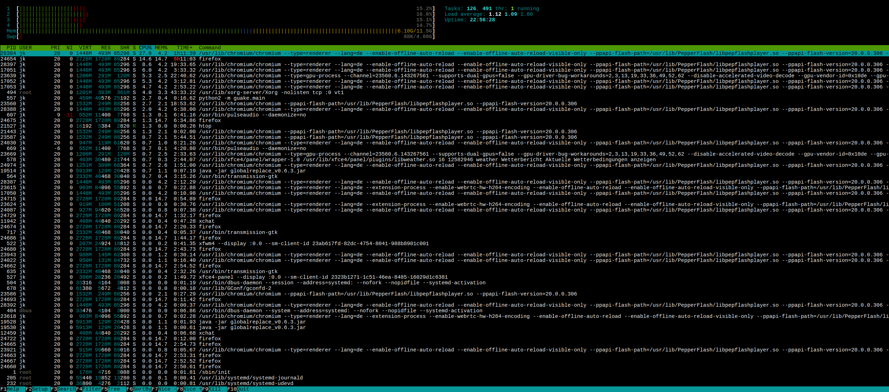

*圖片來源：[Wikimedia Commons「Htop-2.0.0.png」](https://commons.wikimedia.org/wiki/File:Htop-2.0.0.png)，作者 Kopiersperre，授權 GNU General Public License v2 或以上*

[執行緒（Thread）](https://zh.wikipedia.org/zh-tw/執行緒) 是行程內的更小執行單位。一個行程可以包含多個執行緒，這些執行緒 **共享** 同一個行程的記憶體空間，但可以並行執行。例如，一個影片播放程式可能有多個執行緒：一個負責解碼影像、一個負責解碼音訊、一個負責更新畫面顯示，它們同時進行，讓你感受到流暢的影音播放。

### 2. 排程概念

當系統中有多個行程同時存在，**排程器（Scheduler）** 決定哪個行程在哪個時間點獲得 CPU 的執行權。常見的排程策略包括先到先服務（FCFS）、最短工作優先（SJF）、優先權排程（Priority Scheduling），以及時間片輪轉（Round-Robin，每個行程輪流獲得固定長度的 CPU 時間，防止任何一個行程獨佔資源）。

### 3. 工業情境：多機台監控與即時任務

在工廠的電腦監控系統中，往往同時執行多個任務，包括蒐集各機台感測器資料、更新監控畫面、記錄日誌，以及偵測異常並發出警報。這些任務的 **優先權** 不同：異常警報的優先權最高，必須立即處理；更新畫面的優先權較低，稍微延遲不影響安全。

[即時作業系統（RTOS，Real-Time Operating System）](https://zh.wikipedia.org/zh-tw/即時作業系統) 正是為此設計——它提供 **確定性（Determinism）**：保證高優先權任務一定能在規定時間內被執行，這是一般 OS（如 Windows）無法保證的。

---

## 十四、記憶體管理

### 1. 基本記憶體配置

作業系統負責管理 RAM，決定哪個行程使用哪段記憶體空間。當一個程式啟動時，OS 為其分配一塊記憶體；程式結束後，OS 回收這塊記憶體供其他程式使用。記憶體管理需要防止行程互相干擾（行程 A 不能讀寫行程 B 的記憶體）、有效利用記憶體空間，並處理記憶體不足時的因應策略。

### 2. 虛擬記憶體

[虛擬記憶體（Virtual Memory）](https://zh.wikipedia.org/zh-tw/虛擬記憶體) 是一種讓每個行程「以為」自己擁有遠超過實際 RAM 的連續記憶體空間的技術。OS 將部分暫時不用的記憶體內容移到硬碟的交換空間（Swap Space），需要時再移回 RAM，這個過程稱為 **分頁（Paging）**。虛擬記憶體讓系統可以同時執行比實體 RAM 總量更多的程式，但頻繁的資料在 RAM 與硬碟之間交換會大幅降低效能。

### 3. 在資料密集應用中的影響

工廠資料分析軟體（如統計製程管制系統、AI 模型推論）往往需要在記憶體中同時載入大量資料。若 RAM 不足，頻繁的虛擬記憶體置換將使分析速度大幅下降。因此，在規劃工業資料分析伺服器時，**RAM 要先給足**——這比升級 CPU 更能提升分析效能。實際規劃時，需估算同時執行的分析任務中最大的單一資料集大小，並配置至少兩倍的 RAM 作為緩衝。

---

## 十五、檔案系統

### 1. 檔案結構與管理

[檔案系統（File System）](https://zh.wikipedia.org/zh-tw/檔案系統) 是作業系統管理儲存裝置上資料的方式，提供了「資料夾（目錄）」與「檔案」的概念，讓使用者可以有系統地組織儲存資料。常見的檔案系統包括：**NTFS**（Windows，支援大容量磁碟、權限管理、加密與壓縮）、**ext4**（Linux 最常用的檔案系統，效能穩定），以及 **FAT32**（相容性最廣，但不支援超過 4 GB 的單一檔案，常用於 USB 隨身碟）。

為了讓使用者不必透過指令列也能瀏覽與整理資料，主流作業系統都內建了圖形化的 **檔案管理軟體**：Windows 的「檔案總管（File Explorer）」、macOS 的「Finder」，以及 Linux 各桌面環境的檔案管理員（如 GNOME 的 Files／Nautilus、KDE 的 Dolphin）。這類軟體以資料夾樹狀結構搭配圖示呈現，讓使用者能用滑鼠拖曳、複製、搬移、刪除與重新命名檔案，背後對應的正是前述檔案系統的目錄與檔案概念。下圖為 GNOME 的檔案管理員 Files 顯示使用者家目錄（Home）下的預設資料夾，如 Documents、Downloads、Pictures 等：

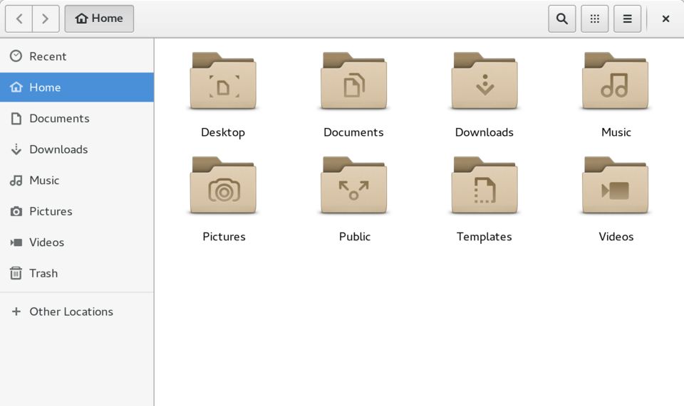

*圖片來源：[Wikimedia Commons「GNOME Nautilus.png」](https://commons.wikimedia.org/wiki/File:GNOME_Nautilus.png)，作者 Emphrase，授權 CC BY-SA 3.0*

### 2. 權限與資料安全

現代檔案系統允許為每個檔案或資料夾設定存取權限，指定哪些使用者可以「讀取」、「寫入」或「執行」該檔案。在工業環境中，這尤為重要：製程配方（Recipe）是工廠的核心機密，不能讓所有員工都能隨意修改；設備控制程式也不應允許非專業人員改動，以防安全事故。

在需要 **追溯性（Traceability）** 的產業，權限設計還有另一層意義。食品、藥品、航空業必須能對每一個出廠的產品，追出它由哪台機台、哪批原料、哪位操作員做出來——因此生產紀錄一旦建立就應 **限制修改**（能改的紀錄就不算證據），並依法規保存數年、甚至數十年（航空零件即是如此）。

> **延伸閱讀**：本節只先談檔案權限在追溯上的角色；一個零件的「數位身份」如何在整條產線上被完整記錄，形成批次、設備、人員、製程、品質五重追溯，請見 [06-Data-Science-AI-and-Smart-Manufacturing.md](06-Data-Science-AI-and-Smart-Manufacturing.md)〈五、4. 數位孿生：把試錯成本從實體世界搬到虛擬世界〉。

---

## 十六、裝置與 I/O 管理

### 1. 驅動程式概念

電腦連接的每種硬體裝置各有其獨特的通訊方式。[驅動程式（Driver）](https://zh.wikipedia.org/zh-tw/驅動程式) 作為中介——它了解特定裝置的通訊協定，並向 OS 提供標準化的介面，讓作業系統與應用程式不需針對每種裝置個別設計。在工業環境中，工業相機、資料擷取卡（DAQ Card）等設備同樣需要安裝對應的驅動程式，才能讓分析軟體正常存取。

### 2. 中斷機制

[中斷（Interrupt）](https://zh.wikipedia.org/zh-tw/中斷) 是硬體通知 CPU「我有事情需要處理」的機制，讓 CPU 不需一直詢問「有沒有輸入？」（稱為輪詢，Polling），可以專心執行任務，只在真正有事件發生時才中斷。在工業控制系統中，緊急停機訊號（E-Stop）必須以最高優先權的中斷方式處理，確保無論 CPU 正在執行什麼任務，都能在最短時間內響應安全事件。

> **趣味小知識**：大家熟悉的「Ctrl+Alt+Delete」強制中斷組合鍵，是 IBM 工程師 David Bradley 在1981年設計的。他刻意選擇需要「兩隻手才按得到」的按鍵組合，就是為了避免使用者不小心觸發——沒想到後來反而成了 Windows 用戶最常按、也最容易誤觸的組合鍵之一。

### 3. 工業設備整合

將工業設備（如 PLC、機器人控制器、量測儀器）與電腦整合，需要解決物理連接（使用什麼介面）、通訊協定（雙方說「同一種語言」）、驅動程式（OS 能識別並管理該裝置），以及時序同步（多台設備的資料時間戳記需一致，才能做有意義的跨設備比對分析）等問題。

**OPC UA（OPC Unified Architecture）** 是近年工業4.0中最受重視的跨廠商、跨平台工業通訊標準，提供安全、可靠且語義豐富的資料交換能力，正在成為智慧工廠資料整合的通用語言。

---

## 十七、使用者介面與操作

### 1. CLI 與 GUI

**命令列介面（CLI，Command-Line Interface）** 讓使用者透過鍵入文字指令與電腦互動。看似古老，但 CLI 對於系統管理員和工程師仍然極為重要——批次操作、自動化腳本、遠端連線管理等任務，CLI 往往更有效率、更靈活。

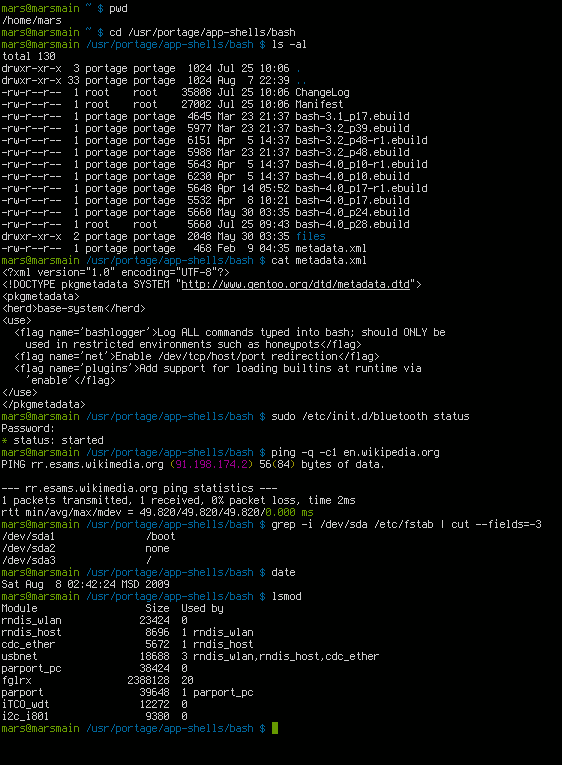

*圖片來源：[Wikimedia Commons「Bash screenshot.png」](https://commons.wikimedia.org/wiki/File:Bash_screenshot.png)，作者 Emx，授權 GNU General Public License v2 或以上*

**圖形使用者介面（GUI，Graphical User Interface）** 以視覺化的圖示、視窗、選單呈現操作選項，大幅降低了學習門檻，讓非技術人員也能使用電腦。

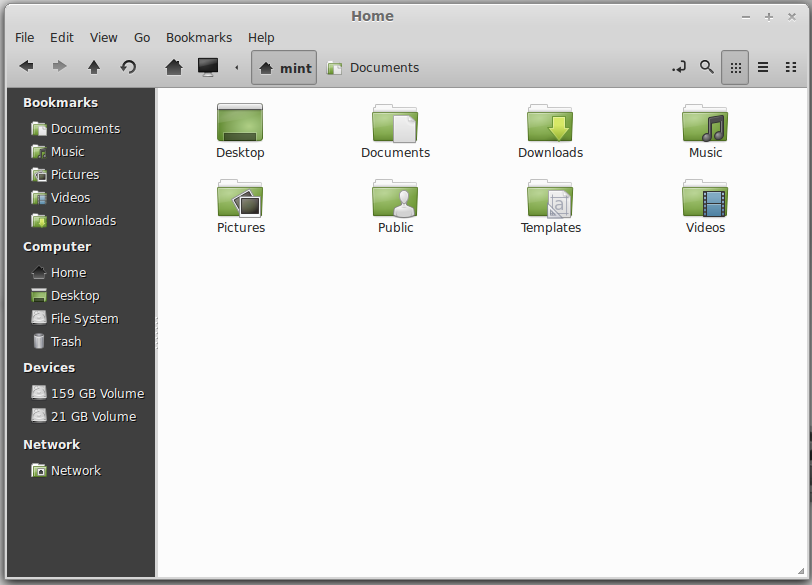

*圖片來源：[Wikimedia Commons「Screenshot of Nemo (file manager).png」](https://commons.wikimedia.org/wiki/File:Screenshot_of_Nemo_(file_manager).png)，作者 Gaba p，授權 CC BY-SA 3.0*

### 2. 基本系統操作

作為工業工程管理的學生，以下基本操作能力非常實用：檔案管理（建立、複製、移動、刪除、搜尋）、基本 CLI 指令（如 `dir` 列出資料夾內容、`cd` 切換目錄、`copy` 複製檔案），以及任務管理員（查看哪些程式正在執行、系統 CPU 與記憶體的使用狀況）。

### 3. 工業應用：監控系統操作介面

工廠 SCADA 系統的操作介面設計有幾個核心原則：**情境圖（Mimic Diagram）** 以工廠流程圖形式呈現各設備狀態；**顏色語義** 一致（綠色正常、黃色警告、紅色緊急）；**報警管理** 清楚標示位置、時間與嚴重程度，並記錄操作員的確認動作；**歷史趨勢** 允許查看過去一段時間內某個參數的變化，協助判斷問題原因。

---

## 十八、系統安全與維護

### 1. 帳號管理與權限

現代 OS 支援多使用者環境，每個使用者擁有獨立的帳號，並被分配特定的權限等級。在工業環境中，典型的權限層級如下：

| 角色 | 可執行操作 |
| --- | --- |
| 操作員 | 監看設備狀態、啟動/停止生產 |
| 技術員 | 調整製程參數、查看報警歷史 |
| 工程師 | 修改控制程式、新增設備 |
| 系統管理員 | 所有操作，包括帳號管理與系統設定 |

> [最小權限原則（Principle of Least Privilege）](https://zh.wikipedia.org/zh-tw/最小權限原則)：每個使用者只應擁有完成工作所需的最低權限，多餘的權限是潛在的安全風險。

### 2. 基礎資安（對工業控制系統的重要性）

工業控制系統的資安（稱為 **OT Security，Operational Technology Security**）是近年日益重要的議題。歷史上曾有多起工廠、電廠遭受網路攻擊的案例：2010年的 [Stuxnet](https://zh.wikipedia.org/zh-tw/震網) 蠕蟲專門攻擊特定型號 PLC，造成伊朗核設施離心機大量損壞（Zetter, 2014）；2021年佛羅里達州水處理廠事件中，據報導疑似遭駭客遠端入侵系統，嘗試大幅提高水中化學物質濃度（Robles & Perlroth, 2021；後續調查對是否為外部攻擊仍有爭議）。基本工業資安措施包括網路隔離（將工業控制網路與辦公室 IT 網路隔離）、定期更新（需充分測試後再部署）、強密碼與多因素驗證，以及稽核日誌（記錄所有登入與操作指令）。

> **趣味小知識**：世界上第一個電腦病毒「爬行者（Creeper）」誕生於1971年，它會在感染的電腦螢幕上顯示一句挑釁的訊息：「I'm the creeper, catch me if you can!（我是爬行者，來抓我啊！）」。為了對付它，工程師寫了一支專門刪除 Creeper 的程式，取名「收割者（Reaper）」——這是史上第一支防毒軟體，「防毒」與「病毒」的攻防戰，從那時就開始了。

### 3. 系統更新與穩定性

工業控制系統的軟體更新需要特別謹慎——與辦公室電腦不同，控制系統的更新可能影響生產。一般建議在測試環境或非生產時段進行更新，更新前備份系統設定與資料，並制定回滾（Rollback）計畫，若更新後出現問題能快速恢復。

---

## 第五篇：電腦系統架構——軟體：應用軟體

---

## 十九、應用軟體概述

### 1. 軟體分類與應用範圍

**應用軟體（Application Software）** 是安裝在作業系統之上、針對特定用途開發的軟體。常見的分類包括生產力工具（Word、Excel、PowerPoint）、通訊工具（電子郵件、即時通訊、視訊會議）、[資料庫管理系統（DBMS）](https://zh.wikipedia.org/zh-tw/資料庫管理系統)、設計工具（[CAD](https://zh.wikipedia.org/zh-tw/電腦輔助設計)），以及工業專業軟體（ERP、MES、SCADA、品質管理系統）。

### 2. 工業軟體與一般商業軟體的差異

| 比較面向 | 一般商業軟體 | 工業專業軟體 |
| --- | --- | --- |
| 使用者 | 辦公室人員 | 製造現場操作員、工程師、管理者 |
| 介面設計 | 以易用性為主 | 強調即時性、清晰性、操作容錯 |
| 整合需求 | 較低 | 高度整合（與機台、感測器、其他系統） |
| 穩定性要求 | 當機可重開 | 必須 24/7 不中斷 |
| 法規合規 | 一般 | 可能需符合 ISO、FDA、GMP 等嚴格規範 |
| 資料安全 | 標準防護 | OT 資安要求，攻擊後果嚴重 |

---

## 二十、辦公與資料處理工具

日常辦公最常接觸的軟體，不外乎文書處理、試算表、簡報三類。常見的辦公室軟體包括微軟的 **Word**（文書處理）、**Excel**（試算表）、**PowerPoint**（簡報），Google 的 **Google 文件／試算表／簡報**（雲端版本，可多人即時協作），開放原始碼的 **LibreOffice Writer／Calc／Impress**，以及在兩岸三地也相當普及的 **WPS Office**。這些軟體雖然廠牌不同，但功能高度對應、檔案格式也大多可互通。

**辦公室套裝軟體（Office Suite）** 正是把上述這些各自獨立的工具，整合成一套統一介面、可互相搭配使用的軟體組合——例如 **Microsoft Office** 把 Word、Excel、PowerPoint 綁在一起銷售與更新，**Google Workspace** 把文件、試算表、簡報、雲端硬碟整合在同一個帳號底下，**LibreOffice** 則把 Writer、Calc、Impress，再加上繪圖工具 **Draw**，打包成一套免費的開放原始碼方案。下圖為 LibreOffice 套件中 Writer、Calc、Impress、Draw 四個應用程式同時開啟的畫面，可以看出「套裝」軟體的意涵——同一介面風格、不同用途的工具被整合在一起：

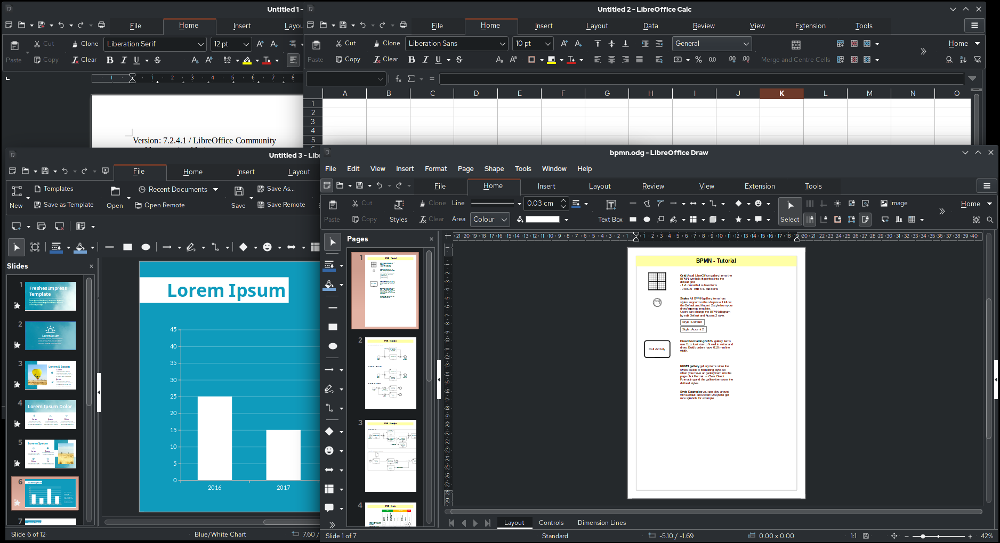

*圖片來源：[Wikimedia Commons「LibreOffice 7.2.4.1 Writer Calc Impress and Draw screenshot.png」](https://commons.wikimedia.org/wiki/File:LibreOffice_7.2.4.1_Writer_Calc_Impress_and_Draw_screenshot.png)，作者 VulcanSphere，授權 Mozilla Public License 2.0 / GNU LGPL v3 或以上*

「把多個相關工具打包成一套」這種 **套裝軟體（Software Suite）** 的概念，並不只限於辦公室應用，在其他專業領域也很常見：設計領域有 **Adobe Creative Cloud**（Photoshop、Illustrator、Premiere Pro 等整合訂閱），工程領域有 **Autodesk** 產品家族（AutoCAD 製圖、Inventor 3D 建模、Fusion 360 模擬分析），統計分析領域有 **IBM SPSS**、**Minitab** 等內建多種統計工具的套裝軟體。企業級的套裝軟體則進一步整合到 ERP、MES 等系統，將採購、生產、銷售、財務等模組統一在同一套平台之下，完整介紹見 [05-Information-Systems-and-Database.md](05-Information-Systems-and-Database.md)〈三、企業應用系統〉。

在工業工程管理實務中，辦公室套裝軟體三類工具的分工大致如下：

- **文書處理（Word Processing）**：以 **Word**、WPS 文字、LibreOffice Writer 為代表，用於撰寫標準作業程序（SOP）、作業指導書、品質稽核報告等需要大量文字說明、版面編排的文件。
- **試算表（Spreadsheet）**：以 **Excel**、Google 試算表、LibreOffice Calc 為代表，用於生產數據的記錄、計算與分析，例如產量統計、良率計算、製程參數整理。
- **簡報（Presentation）**：以 **PowerPoint**、Google 簡報、LibreOffice Impress 為代表，用於向管理階層或客戶呈現分析結果與改善方案，強調重點視覺化而非大量文字。

三者之中，試算表由於兼具資料記錄與運算分析能力，是工業現場使用頻率最高的工具。以下依序介紹這三類工具在製造業實務中的具體應用。

### 1. 文書處理（重點：Word）

**Microsoft Word**（及其開放原始碼對應軟體 LibreOffice Writer、WPS 文字）是製造業現場最基本的文件撰寫工具，用來產出標準作業程序（SOP）、作業指導書、品質異常報告、會議記錄等以文字說明與版面編排為主的文件。相較於試算表著重「計算」、簡報著重「呈現」，文書處理軟體的核心價值在於 **結構化的長篇文字排版**：標題階層、段落樣式、目錄自動產生、版本修訂追蹤（Track Changes）等功能，讓多人協作編修同一份文件時，仍能維持格式一致、修改歷程可追溯。

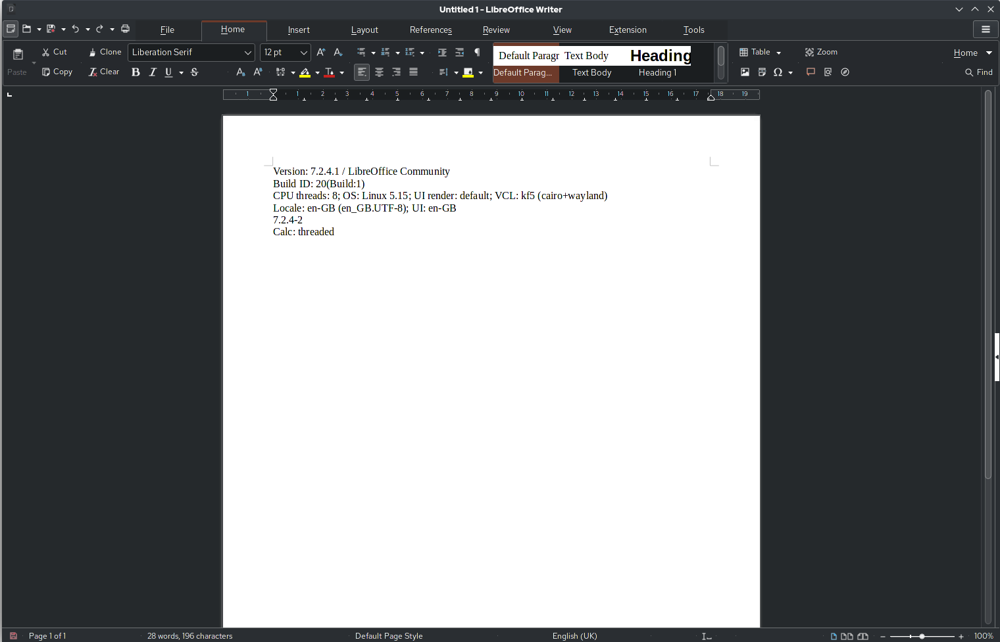

*圖片來源：[Wikimedia Commons「LibreOffice 7.2.4.1 Writer screenshot.png」](https://commons.wikimedia.org/wiki/File:LibreOffice_7.2.4.1_Writer_screenshot.png)，作者 VulcanSphere，授權 Mozilla Public License 2.0 / GNU LGPL v3 或以上*

> **趣味小知識**：1997 年，微軟在 Word 中加入了一個會自動跳出來「提供建議」的動畫小助手——迴紋針「Clippy」。它出現的時機經常抓錯（例如使用者才剛打完「親愛的」就跳出來問「你是不是要寫信？」），被許多使用者視為多餘又煩人的干擾，2010 年甚至被《時代雜誌》列入「史上 50 大最糟發明」之一，最終微軟在後續版本中將其徹底移除。有趣的是，二十多年後的今天，隨著生成式 **AI 代理人（AI Agent）** 興起，「主動觀察使用者在做什麼、跳出來提供協助」這種構想不但沒有消失，反而重出江湖——只是換成了整合在 Word、Excel 等軟體中的 **Microsoft Copilot** 等 AI 助理，憑藉更強的語言理解能力，抓時機、給建議的準確度已不可同日而語。

### 2. 試算表（重點：Excel）

儘管有許多專業分析工具，**Microsoft Excel** 在製造業仍然是使用最廣泛的資料處理與分析工具，原因在於其強大的靈活性與普及度。

| 函數 | 功能 | 工業應用範例 |
| --- | --- | --- |
| `SUM()` | 加總 | 計算當月總產量 |
| `AVERAGE()` | 平均值 | 計算製程參數平均值 |
| `STDEV()` | 標準差 | 評估製程變異程度 |
| `MAX()` / `MIN()` | 最大/最小值 | 找出最高/最低的量測值 |
| `COUNTIF()` | 條件計數 | 計算不合格品數量 |
| `VLOOKUP()` | 垂直查詢 | 根據零件編號查詢對應的規格 |
| `IF()` | 條件判斷 | 判斷量測值是否在規格內 |

一個典型的應用情境：從 MES 匯出的生產日報表（CSV 格式）匯入 Excel 後，工程師可以使用樞紐分析表（PivotTable）快速彙整各機台、各班別的產量與良率，使用圖表視覺化趨勢，使用條件格式設定自動標記異常值，並建立標準化的報告模板讓每天的報告自動填入最新資料。

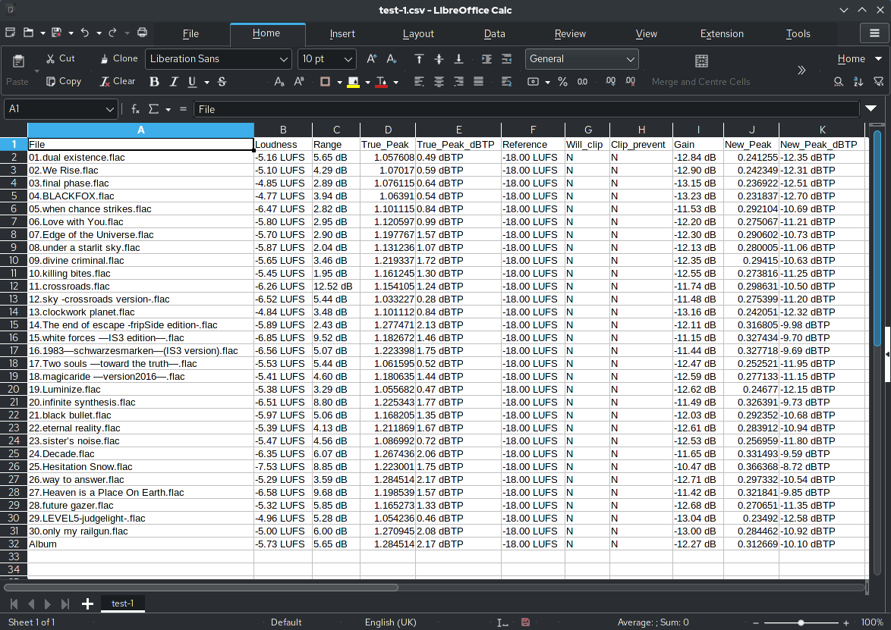

*圖片來源：[Wikimedia Commons「LibreOffice 7.2.4.1 Calc with csv screenshot.png」](https://commons.wikimedia.org/wiki/File:LibreOffice_7.2.4.1_Calc_with_csv_screenshot.png)，作者 VulcanSphere，授權 Mozilla Public License 2.0 / GNU LGPL v3 或以上*

> **趣味小知識**：Excel 會自動把看起來像日期的文字轉換格式，這個「貼心」功能曾經惹出大麻煩——不少基因名稱（如 `MARCH1`、`SEPT2`）被 Excel 自動誤判成日期並改寫，導致大量科學論文的資料出錯。國際基因命名委員會後來乾脆修改了數十個基因的正式名稱，只為了避開 Excel 的自動校正。連科學家都栽在試算表的預設行為上，可見小心資料格式有多重要。

### 3. 簡報與報告工具

工程師的工作成果最終需要清楚地傳達給管理階層或客戶。**PowerPoint**（及 LibreOffice Impress、Google 簡報）是最常用的簡報工具，製作工業報告的幾個原則：數字視覺化（一張好的圖表勝過一堆數字）、結論先行（先說結論，再說支持的數據），以及適度簡化（管理層更想看影響與建議行動，而非所有技術細節）。

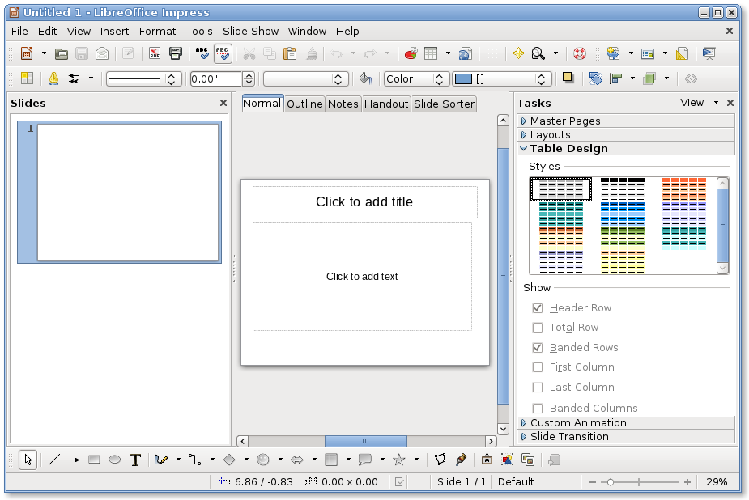

*圖片來源：[Wikimedia Commons「LibreOffice Impress 4.0.1 screenshot.png」](https://commons.wikimedia.org/wiki/File:LibreOffice_Impress_4.0.1_screenshot.png)，作者 The Document Foundation，授權 GNU LGPL v2.1 或以上*

> **趣味小知識**：並非所有企業都推崇簡報。Amazon 創辦人貝佐斯（Jeff Bezos）就明文禁止公司內部會議使用 PowerPoint，改要求提案者事先寫成一份結構完整的敘事型備忘錄（6-page memo），會議開始先安靜閱讀。他認為條列式的簡報格式容易讓簡報者用漂亮的排版掩蓋掉論述中不夠嚴謹的邏輯，反而是完整的文章形式更能檢驗一個想法是否經得起推敲。

---

## 二十一、資料分析與決策支援

### 1. 基本資料分析概念

在工業環境中，資料分析的目的是從大量的生產數據中萃取有用的資訊，支援決策。

**描述性統計（Descriptive Statistics）** 描述資料的基本特性，如平均值（Mean）、中位數（Median）、標準差（Standard Deviation）、最大最小值等。**製程能力分析（Process Capability Analysis）** 評估製造製程是否能穩定地生產出符合規格的產品，常用指標為 **Cp** 與 **Cpk**（一般要求 Cpk ≥ 1.33）。[統計製程管制（SPC，Statistical Process Control）](https://zh.wikipedia.org/zh-tw/統計過程控制) 透過持續監測製程中的關鍵品質特性，並以 **管制圖（Control Chart）** 視覺化呈現，即時偵測製程是否出現「失控」跡象。

### 2. 商業智慧（BI）工具概念

[商業智慧（Business Intelligence，BI）](https://zh.wikipedia.org/zh-tw/商業智慧型) 工具是一類專為資料視覺化與分析而設計的軟體，代表性工具如 Power BI（Microsoft）、Tableau、Qlik 等。其特點是可連接多個資料來源（ERP、MES、資料庫）、提供拖拉式的圖表設計介面（不需寫程式）、自動更新（讓報表永遠反映最新資料），以及可設計互動式儀表板（Dashboard），讓管理者自行篩選查看所需資訊。

### 3. 工業應用：產能分析與品質改善

**產能分析（Capacity Analysis）** 分析每個生產步驟的理論產能與實際產能，識別限制整體產出的 **瓶頸（Bottleneck）**（此概念源自管理學中的限制理論，Theory of Constraints）。**品質改善** 則利用資料分析找出影響良率的關鍵因子：使用 **散布圖（Scatter Plot）** 觀察不良率與某個製程參數的相關性；使用 **柏拉圖（Pareto Chart）** 識別造成最多不良品的前幾個缺陷類型（依據「[80/20 法則](https://zh.wikipedia.org/zh-tw/帕雷托法則)」：80% 的問題來自 20% 的原因），從而決定改善的優先順序。

> **趣味小知識**：「柏拉圖」與「80/20 法則」的命名，來自十九世紀義大利經濟學家[維爾弗雷多·柏拉圖（Vilfredo Pareto）](https://zh.wikipedia.org/zh-tw/維爾弗雷多·帕雷托)。他當年觀察到義大利約 80% 的土地，掌握在 20% 的人口手中，這個「少數關鍵、多數次要」的現象後來被發現廣泛存在於品質管理、業績分配，甚至你我的待辦清單中——多數成果，往往來自少數關鍵因素。

決策支援系統（DSS）在資訊系統中的定位、大數據分析的完整流程，以及 Power BI、Tableau 等 BI 工具背後的資料庫技術，請見 [05-Information-Systems-and-Database.md](05-Information-Systems-and-Database.md)〈二、資訊系統的類型〉與〈八、大數據如何改變資訊系統〉。

---

## 二十二、專業工業應用軟體

工業現場除了通用的辦公與分析軟體，還有三類專為製造業設計的大型應用系統：[ERP（企業資源規劃）](https://zh.wikipedia.org/zh-tw/企業資源計劃) 管理訂單、採購、財務等「計畫層」資料；[MES（製造執行系統）](https://zh.wikipedia.org/zh-tw/製造執行系統) 位於 ERP 與現場設備之間，管理工廠車間的即時執行狀況；[SCM（供應鏈管理）](https://zh.wikipedia.org/zh-tw/供應鏈管理) 管理原物料到成品交付的整個鏈條。這三套系統再加上負責蒐集現場資料的 SCADA，彼此透過資料流相互整合，是工業4.0「垂直整合」的基礎。完整介紹（含各系統功能、代表產品與資料庫技術）請見 [05-Information-Systems-and-Database.md](05-Information-Systems-and-Database.md)〈三、企業應用系統〉；這些系統如何在一座智慧工廠中協同運作的完整案例，則見 [06-Data-Science-AI-and-Smart-Manufacturing.md](06-Data-Science-AI-and-Smart-Manufacturing.md)〈五、3. 智慧工廠：從感測器到決策的四層資料流〉。

---

## 二十三、軟體授權與資訊倫理

### 1. 授權類型

使用軟體必須遵守授權協議（License），不同類型的授權決定了使用者的權利與義務：

| 授權類型 | 說明 | 範例 |
| --- | --- | --- |
| **商業授權（Commercial）** | 付費購買，有使用限制，不可修改原始碼 | Microsoft Office、SAP |
| **免費軟體（Freeware）** | 免費使用，但不可修改或再發布原始碼 | Adobe Acrobat Reader |
| [開放原始碼（Open Source）](https://zh.wikipedia.org/zh-tw/開放原始碼) | 原始碼公開，可自由使用、修改、再發布 | Linux、Python、MySQL |
| **訂閱制（Subscription）** | 按月或按年付費，停止訂閱即無法使用 | Microsoft 365、AutoCAD |
| **試用版（Trial）** | 提供有時限或功能受限的試用 | 多數商業軟體 |

在工業環境中，ERP、MES 等大型系統的授權費用動輒數百萬，是系統導入成本的重要組成部分。

### 2. 工業資料保護與隱私

工廠資料往往包含高度敏感的商業機密：製程配方、生產效率、良率曲線、客戶訂單……這些資料若外洩，可能造成嚴重的競爭損失。工業資料保護的實踐措施包括依需要知悉原則（Need-to-Know）限制資料存取、對敏感資料的儲存與傳輸加密、與供應商簽訂保密協議（NDA），以及強化員工資訊安全意識（社交工程是最常見的資安漏洞）。若生產系統記錄員工操作行為（如人臉辨識打卡），必須符合個人資料保護法規，確保資料收集有明確目的、有員工知情同意，並妥善保管。

### 3. 資訊使用規範

在組織中使用資訊系統，員工應遵守合理使用原則（公司電腦與網路資源用於業務目的）、智慧財產權（不使用盜版軟體，尊重著作權）、資料真實性（不在生產記錄中填寫虛假數據，資料造假在許多管制產業是重罪），以及社群媒體規範（不在社群媒體上分享未經授權的工廠資訊或公司機密）。

---

## 二十四、學習重點總結

讀完本章後，你應該能夠理解以下核心概念，並將其應用於工業場域的思考與決策：

**電腦的理論基礎：可計算性、儲存程式與資訊量**

圖靈機告訴我們哪些問題原則上可以被計算、哪些不行；馮紐曼架構的「程式與資料一起存在記憶體裡」，是今天從桌機到 PLC 幾乎所有電腦的共同設計；夏農的資訊理論則給了「一個位元」明確的意義。這三件事看似抽象，卻界定了後面所有硬體與軟體的可能範圍——當廠商說某套系統「什麼都能自動判斷」時，你會知道要先問問這個問題是否真的可計算。

**數位化與數字系統：電腦如何表示真實世界**

二進位、十六進位與進位轉換不是為了考試才存在的技巧，而是理解電腦行為的必要工具。感測器讀值的解析度、通訊協定的位元組定義、記憶體位址的表示，全都建立在這套表示法之上。浮點數與 IEEE 754 則提醒了一件重要的事：**電腦的小數運算是有誤差的**，良率、成本、公差這類計算若不理解這個限制，可能在報表上得出令人費解的數字。

**硬體架構：CPU、記憶體、儲存與 I/O 的分工**

CPU 負責運算與控制，記憶體提供高速但揮發的工作空間，儲存裝置提供大容量的長期保存，I/O 裝置負責與外界溝通，主機板把它們連在一起。理解這套分工與記憶體階層（暫存器→快取→主記憶體→儲存裝置）的速度與成本差異，是評估工業電腦、伺服器或邊緣運算設備規格時的判斷依據——知道瓶頸通常不在「CPU 不夠快」，而在資料搬運。

**作業系統：讓有限的硬體資源被有效共享**

行程與執行緒管理、記憶體管理、檔案系統、裝置管理，這些機制的共同目的是在有限的硬體上，讓多個工作安全且有效率地共存。工廠中的即時控制系統之所以需要即時作業系統（RTOS）而非一般 Windows，正是因為它對「反應時間必須有上限」這件事的要求，是一般作業系統的排程機制無法保證的。

**應用軟體與授權：工具的選擇與使用的責任**

從試算表、資料分析工具到 ERP、MES 等大型系統，軟體的選擇取決於問題的規模與性質，而不是功能表上的長度。同時，授權型態決定了成本結構與使用限制，工業資料保護與資訊倫理則決定了你能不能長久地把系統用下去——製程配方外洩或生產數據造假的代價，遠高於任何軟體授權費。

> **銜接提示**：本章介紹的硬體架構、作業系統與應用軟體，會在全課程最後的 [06-Data-Science-AI-and-Smart-Manufacturing.md](06-Data-Science-AI-and-Smart-Manufacturing.md)〈五、工業4.0與智慧製造：把整條技術鏈放進工廠〉中，與程式設計、網路、資訊系統、資料科學一起，整合成一個完整的智慧工廠案例。屆時你會看到，產線上的感測器、PLC 與工業電腦，用的正是本章講過的同一套原理。

---

## 參考文獻

- Bolton, W. (2015). *Programmable logic controllers* (6th ed.). Newnes/Elsevier.
- Bryant, R. E., & O'Hallaron, D. R. (2016). *Computer systems: A programmer's perspective* (3rd ed.). Pearson.
- Edelman, A. (1997). The mathematics of the Pentium division bug. *SIAM Review, 39*(1), 54–67. https://doi.org/10.1137/S0036144595293959
- Goldberg, D. (1991). What every computer scientist should know about floating-point arithmetic. *ACM Computing Surveys, 23*(1), 5–48. https://doi.org/10.1145/103162.103163
- Groover, M. P. (2019). *Automation, production systems, and computer-integrated manufacturing* (5th ed.). Pearson.
- Hennessy, J. L., & Patterson, D. A. (2019). *Computer architecture: A quantitative approach* (6th ed.). Morgan Kaufmann/Elsevier.
- Institute of Electrical and Electronics Engineers. (2019). *IEEE standard for floating-point arithmetic* (IEEE Std 754-2019). IEEE. https://doi.org/10.1109/IEEESTD.2019.8766229
- Lee, J., Bagheri, B., & Kao, H.-A. (2015). A cyber-physical systems architecture for Industry 4.0-based manufacturing systems. *Manufacturing Letters, 3*, 18–23. https://doi.org/10.1016/j.mfglet.2014.12.001
- Moore, G. E. (1965). Cramming more components onto integrated circuits. *Electronics, 38*(8), 114–117.
- NVIDIA. (2025). *NVIDIA DGX Spark: Personal AI supercomputer powered by Blackwell* [Product page]. https://www.nvidia.com/en-us/products/workstations/dgx-spark/
- Null, L., & Lobur, J. (2018). *The essentials of computer organization and architecture* (5th ed.). Jones & Bartlett Learning.
- Patterson, D. A., & Hennessy, J. L. (2021). *Computer organization and design RISC-V edition: The hardware/software interface* (2nd ed.). Morgan Kaufmann/Elsevier.
- Robles, F., & Perlroth, N. (2021, February 8). 'Dangerous stuff': Hackers tried to poison water supply of Florida town. *The New York Times*. https://www.nytimes.com/2021/02/08/us/oldsmar-florida-water-supply-hack.html
- Shannon, C. E. (1948). A mathematical theory of communication. *Bell System Technical Journal, 27*, 379–423, 623–656.
- Shi, W., Cao, J., Zhang, Q., Li, Y., & Xu, L. (2016). Edge computing: Vision and challenges. *IEEE Internet of Things Journal, 3*(5), 637–646. https://doi.org/10.1109/JIOT.2016.2579198
- Silberschatz, A., Galvin, P. B., & Gagne, G. (2018). *Operating system concepts* (10th ed.). Wiley.
- Stallings, W. (2016). *Computer organization and architecture: Designing for performance* (10th ed.). Pearson.
- Stallings, W. (2018). *Operating systems: Internals and design principles* (9th ed.). Pearson.
- Tanenbaum, A. S., & Austin, T. (2013). *Structured computer organization* (6th ed.). Pearson.
- Tanenbaum, A. S., & Bos, H. (2015). *Modern operating systems* (4th ed.). Pearson.
- Turing, A. M. (1936). On computable numbers, with an application to the Entscheidungsproblem. *Proceedings of the London Mathematical Society, s2-42*(1), 230–265. https://doi.org/10.1112/plms/s2-42.1.230
- von Neumann, J. (1993). First draft of a report on the EDVAC (M. D. Godfrey, Ed.). *IEEE Annals of the History of Computing, 15*(4), 27–75. https://doi.org/10.1109/85.238389
- Xu, L. D., He, W., & Li, S. (2014). Internet of things in industries: A survey. *IEEE Transactions on Industrial Informatics, 10*(4), 2233–2243. https://doi.org/10.1109/TII.2014.2300753
- Zetter, K. (2014). *Countdown to zero day: Stuxnet and the launch of the world's first digital weapon*. Crown Publishers.

---

*本教材為大一計算機概論課程用途，著重概念理解與工業應用情境，建議搭配硬體規格比較、作業系統操作練習，以加深理解與應用能力。完整的智慧工廠整合案例與工業4.0應用實例，請見 [06-Data-Science-AI-and-Smart-Manufacturing.md](06-Data-Science-AI-and-Smart-Manufacturing.md)〈五、工業4.0與智慧製造：把整條技術鏈放進工廠〉。*
