# 程式設計概念——工業工程管理導向

## 前言：從排班表談起

想像一個場景：你是工廠的生產排程員，需要為下週的生產線安排工作：

- 共有 3 條生產線，每條每天 3 班
- 共有 45 名操作員，每人每週最多上 5 班
- 部分操作員只能操作特定機台
- 需要在每條線的每班維持至少 3 名有資格的操作員
- 部分員工請假或有輪班限制

如果沒有電腦，你會遇到以下困境：

- 用手工排班，可能需要數個小時，而且很容易出錯
- 用紙筆紀錄，不容易管理與使用，而且不易保存
- 手工排班的邏輯與限制，不僅難以計算，你也很難傳給下一個新手使用

如果有電腦，你可以有效的做以下事情：

- 將手工排班邏輯用「**程式語言**」轉換成一個程式：你只需要輸入人員名單、機台資格與請假紀錄，程式幾秒鐘就能給你一份符合所有條件的排班表
- 排班所需要的各項資料，以良好的「**資料結構**」有效地存到電腦記憶體或硬碟：電腦可以快速存取，並且不需要儲存大量的紙本記錄，更不需要擔心如果辦公室空間不夠、不容易保存與備份等問題
- 以有效率的「**演算法**」計算排班的邏輯：不用花幾個小時甚至好幾天就能處理完畢，甚至能以 AI 模型自動最佳化，同時考慮更多參數，讓加班成本最小化

> **這就是程式語言、資料結構與演算法的核心價值**：把人類解決問題的邏輯，以電腦能理解的方式寫下來，讓電腦幫你重複執行、高效儲存、快速計算，能夠快速且有效地處理大量資料。

| 工業場景中的問題 | 對應的程式設計概念 |
|---------------|----------------|
| 記錄每台機器每日產量 | 變數與資料型態 |
| 依序執行品管檢查步驟 | 流程控制（循序、條件、迴圈） |
| 管理數百筆訂單資料 | 資料結構（串列、字典） |
| 計算最短搬運路徑 | 演算法（搜尋、最佳化） |
| 自動產生生產報表 | 函式與模組化設計 |

> 本章的目的不是把你訓練成程式設計師，而是幫助你理解「程式是如何思考問題的」——掌握運算思維、讀懂基本程式邏輯、理解資料結構與演算法的用途，讓你在面對數位化工作環境時，能夠與 IT 與 AI 工程師有效溝通，並具備自動化工具的基本應用能力。

---

## 第一篇：程式設計與運算思維

---

## 一、問題解決與運算思維

### 程式設計師怎麼寫程式

> 在正式介紹運算思維之前，我們先來看看程式設計師實際上是怎麼工作的。

程式設計師寫程式，並不是直接坐下來一直打字，而是先理解「要解決什麼問題」。他們會先確認需求，例如：這個程式要給誰用？使用者會輸入什麼？程式要輸出什麼結果？有哪些限制？這一步很像解題前先讀懂題目，避免寫到一半才發現方向錯了。

理解需求之後，程式設計師接著會設計做法，也就是把大問題拆成小步驟。例如要做一個成績計算程式，就可以拆成「輸入分數」、「計算平均」、「判斷及格或不及格」、「顯示結果」。這個階段不一定馬上寫程式，有時會先畫流程圖、寫簡單的步驟說明，或先想好資料要怎麼儲存。

設計好流程後，第三步才是實際寫程式。程式設計師會把前面設計好的流程，用某一種程式語言寫出來，例如 Python、JavaScript 或 C++。寫程式時，他們通常不會一次完成全部功能，而是先寫出一小部分，確認可以運作後，再逐步增加新功能。

程式寫完，工作也還沒結束，一定要測試和除錯。測試是檢查程式在不同情況下能不能正常運作；除錯則是找出錯誤原因並修正。錯誤可能是語法打錯、邏輯想錯，或是某些特殊情況沒有考慮到。程式設計師會看錯誤訊息、印出中間結果、逐步檢查程式執行過程，直到找到問題所在。

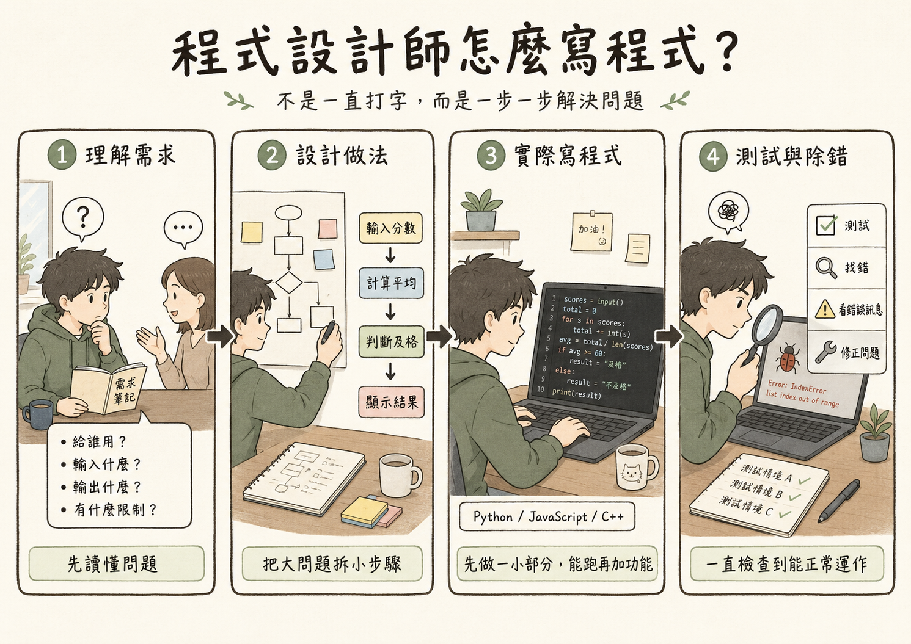

*本圖由 ChatGPT 生成，已由作者審核內容正確性*

> **趣味小知識**：「臭蟲（Bug）」與「除錯（Debug）」這兩個程式設計術語，據說源自1947年——[葛麗絲·霍普（Grace Hopper）](https://zh.wikipedia.org/zh-tw/葛丽丝·霍普)的團隊在排查哈佛 Mark II 電腦的故障時，真的在繼電器裡發現了一隻被夾死的飛蛾，導致電路短路。他們把這隻蛾貼在維修日誌上，並寫下「第一個發現真正臭蟲的案例」，這個詞從此沿用至今。霍普本人也是電腦科學史上的傳奇人物：她是哈佛 Mark I 電腦最早的程式設計師之一，後來更開發出世界第一個編譯器（Compiler），並主導設計了影響深遠的商用程式語言 COBOL。

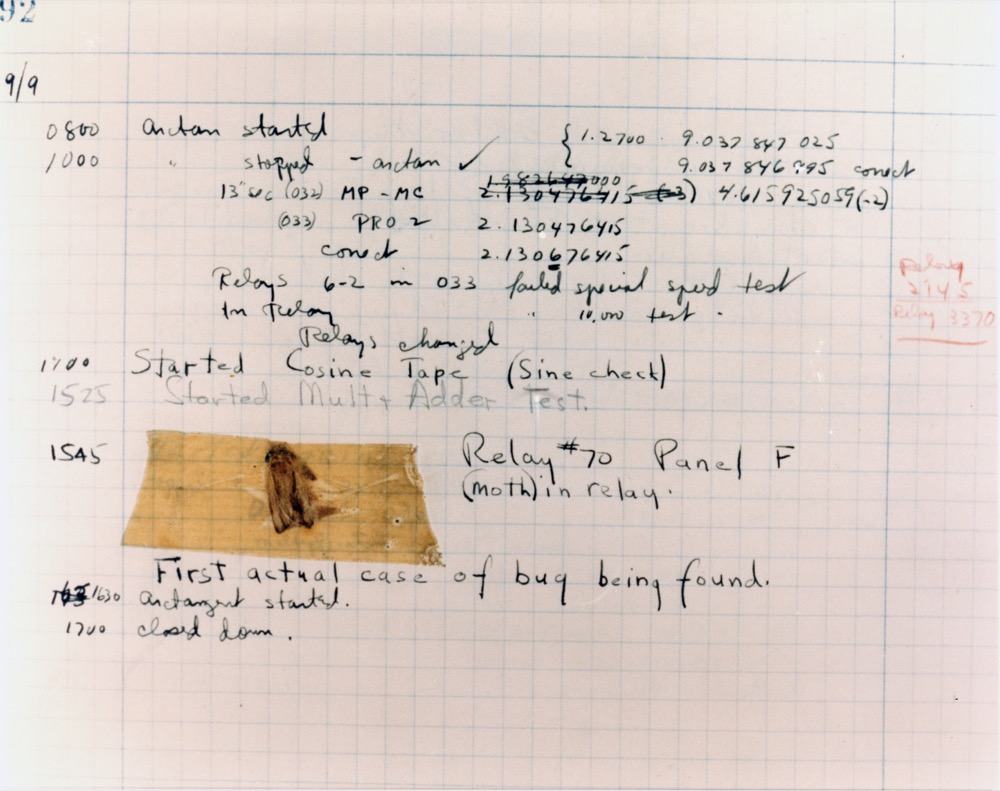

*圖片來源：[Wikimedia Commons「First Computer Bug, 1947.jpg」](https://commons.wikimedia.org/wiki/File:First_Computer_Bug,_1947.jpg)，美國海軍水面作戰中心典藏，公有領域（Public Domain）*

> **真實世界**：實務上的程式設計工作，通常沒有這麼順利。程式設計師真正花在寫程式、想程式、除錯上的時間，往往只佔一部分；以老師的經驗來說，大概只有 20% 到 30%。更多時間其實是在溝通，例如確認需求、討論規格、說明為什麼某個功能做不到、和同事協調不同看法，甚至有時候是在「和人吵架」。所以基本流程雖然可以整理成：理解需求 → 設計流程 → 寫程式 → 測試與除蟲 → 整理與改進，但在真實工作中，這些步驟常常會因為溝通、修改需求和反覆確認而來回循環。

> 也因此，系統與軟體開發有一門重要的學問，叫做「**軟體工程（Software Engineering）**」。它不是只教人怎麼寫程式，而是在探索如何更有效地完成「寫程式」與「開發資訊系統」這件事，例如如何理解需求、分工合作、管理進度、測試品質，以及讓軟體在長期維護時不會變得一團混亂。

從上面的流程可以看出，無論問題大小，程式設計師都是先理解問題、拆解步驟，再動手處理，最後檢查結果——這種思考方式並不限於寫程式，而是一套可以套用在任何複雜問題上的通用方法，也就是接下來要介紹的「運算思維」。

### 1. 什麼是運算思維？

[運算思維（或稱計算思維，Computational Thinking）](https://zh.wikipedia.org/zh-tw/計算思維) 並不是說只有會寫程式的人才能運用，而是一種 **用電腦可以理解的方式來解決問題的思考方法**。即使你從未寫過一行程式碼，運算思維也能幫助你更有系統地分析複雜問題、設計解決方案。

> 當然，如果你想要實現運算思維的思考內容，通常最簡單的方式就是實作程式。

運算思維由四個核心能力組成，**問題分解**、**模式辨識**、**抽象化**、**演算法思考**，它們互相支撐，共同構成解決問題的完整框架，以下依序說明。

> **補充小知識**：「運算思維」的概念雖然可追溯至更早，但真正讓它成為全球中小學到大學教育界共同重視的關鍵推手，是美國電腦科學家珍妮特·溫（Jeannette M. Wing）於 2006 年在《ACM 通訊》發表的一篇短文（Wing, 2006）。她主張運算思維應該像讀、寫、算一樣，成為每個人的基本素養，而不只是電腦科學家的專業技能——這個主張後來深刻影響了許多國家的資訊教育政策，也是本章不斷強調「即使不寫程式也該具備運算思維」的理論依據。

### 2. 問題分解（Decomposition）

面對一個複雜的問題，第一步不是立刻尋找答案，而是將它 **拆解成較小、較易處理的子問題**。每個子問題可以獨立解決，最後再將答案組合起來。

這個概念在工程領域極為普遍。蓋一棟大樓不是一個問題，而是地基、結構、水電、裝潢……數十個子問題的組合。同樣地，撰寫一套工廠管理系統，也可以拆解為訂單管理、庫存追蹤、品質紀錄、報表產生等獨立模組。

**工業應用：生產流程拆解**

一條完整的生產線看似複雜，但透過問題分解，可以將其拆為：原料入庫 → 備料 → 加工站A → 加工站B → 品質檢測 → 包裝 → 出貨。每個步驟都有明確的輸入（上一站的半成品）與輸出（下一站的輸入），這種結構化的拆解方式，正是撰寫生產管理程式的基礎。

### 3. 模式辨識（Pattern Recognition）

解決一個新問題時，我們往往可以發現它與過去解決過的問題有相似之處。**模式辨識** 是找出問題中重複出現的規律或結構，藉此套用已知的解法，而不必每次都從零開始。

例如，「計算每條生產線的日平均產量」與「計算每位業務員的月平均銷售額」在結構上完全相同：都是「對一組數字取平均值」。辨識出這個共通模式，同一段程式邏輯就能處理兩種情境。

**工業應用：作業標準化（SOP）**

工廠的標準作業程序（SOP）正是模式辨識的體現：不同的機台、不同的零件，若其加工流程遵循相同的「夾緊 → 加工 → 量測 → 記錄」模式，就可以用同一套程式框架來管理，只需替換各步驟的參數即可。

### 4. 抽象化（Abstraction）

**抽象化** 是指忽略問題中不重要的細節，只保留對解決問題真正有用的資訊。這讓我們能夠專注在本質上，而不被枝微末節淹沒。

一個好例子是地圖：真實的城市遠比地圖複雜，但地圖省略了建築物的顏色、路旁的樹木，只保留道路、地名等關鍵資訊，反而讓導航變得可行。程式中的「函式」（後面會介紹）正是抽象化的實踐——你不需要知道 `計算平均值()` 這個函式內部如何運作，只需要知道「給它一串數字，它會回傳平均值」。

### 5. 演算法思考（Algorithmic Thinking）

[演算法（Algorithm）](https://zh.wikipedia.org/zh-tw/演算法) 是解決特定問題的 **一系列明確、有限、有序的步驟**。演算法思考是將問題的解法，轉化為可以讓電腦逐步執行的清晰指令序列。

演算法必須具備幾個特性：

- **明確性**：每一個步驟必須清楚無歧義，不能有「大概做一下」這種模糊指令
- **有限性**：必須在有限步驟內結束，不能無止境地執行
- **有效性**：每一個步驟都是電腦可以實際執行的操作
- **輸入與輸出**：有明確的輸入資料，並產生預期的輸出結果

讀到這裡你可能已經發現：工廠的 **標準作業流程（SOP）** 其實就是給人執行的演算法——差別只在執行者是人還是電腦。這個對照在〈十一、演算法基本概念〉會再細談。

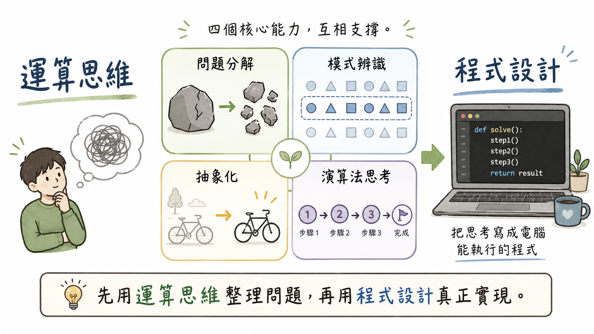

*本圖由 ChatGPT 生成，已由作者審核內容正確性*

> **小結**：運算思維的四個面向——分解、模式辨識、抽象化、演算法思考——不是孤立的技巧，而是解決複雜問題時自然流動的思考過程。在面對工廠流程改善、系統設計或資料分析任務時，有意識地運用這四個思維工具，往往能讓問題變得清晰可解。

---

## 二、程式設計基本概念

運算思維讓我們學會拆解問題、辨認規律、抽象化重點、設計演算法，但這些思考的成果終究要寫成電腦能讀懂的語言、真正執行出來，才能發揮作用——這正是「程式設計」要做的事。接下來，我們從程式設計最基本的概念開始，看看運算思維如何一步步轉化為電腦真正能執行的程式。

> 系上的「程式設計」課程會把這一節的概念講得更清楚，這裡你可以建立最基本的概念。

### 1. 程式的本質

一個程式，無論多複雜，其本質都可以用三個字描述：**輸入 → 處理 → 輸出**。

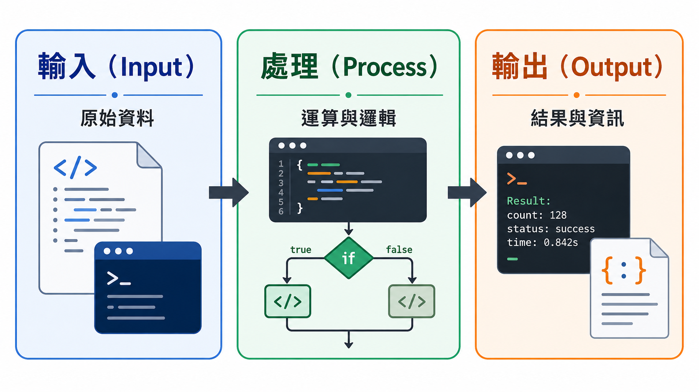

*本圖由 ChatGPT 生成，已由作者審核內容正確性*

- **輸入**：程式接收的資料，來源可以是鍵盤輸入、檔案讀取、感測器訊號、資料庫查詢……
- **處理**：程式對資料進行的計算、判斷、轉換等操作
- **輸出**：處理完成後產生的結果，可以是螢幕顯示、檔案寫入、發送指令給機台……

**工業應用範例：良率計算程式**

- 輸入：今日生產總數（500件）、不良品數（12件）
- 處理：良率 = (500 - 12) / 500 × 100%
- 輸出：良率 97.6%，顯示於報表並存入資料庫

這個例子雖然簡單，但結構與任何複雜程式完全相同。

### 2. 變數與資料型態

**變數（Variable）** 是程式中用來儲存資料的「容器」，有名稱（讓你找得到它）和值（實際儲存的內容）。就像倉庫中貼了標籤的儲位：「A-01」儲位裡放著「齒輪，數量：50」。

不同性質的資料需要不同的[資料型態（Data Type）](https://zh.wikipedia.org/zh-tw/資料型態) 來儲存，這影響了資料在記憶體中的表示方式與可進行的操作：

| 資料型態 | 說明 | 工業範例 |
| --- | --- | --- |
| **整數（Integer）** | 沒有小數的數字 | 今日產量 500（件）、不良品數 12（件）、批次序號 1023 |
| **浮點數（Float）** | 帶有小數的數字 | 溫度 23.5°C、良率 0.976、重量 1.25 kg |
| **字串（String）** | 文字資料，以引號括住 | 產品名稱「精密齒輪」、操作員姓名「王小明」、機台型號「CNC-500」 |
| **布林（Boolean）** | 只有兩種值：真（True）或假（False） | 機台是否運作中 → True、零件是否合格 → False |

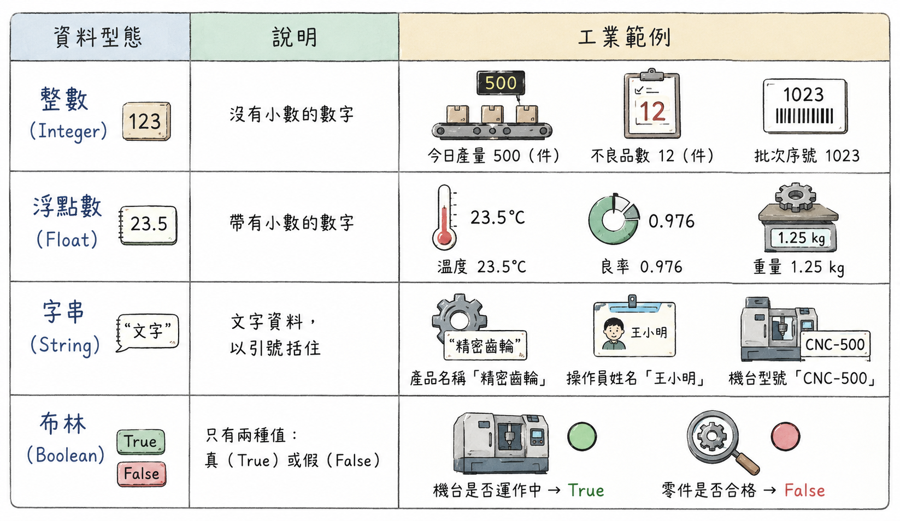

*本圖由 ChatGPT 生成，已由作者審核內容正確性*

**為什麼資料型態重要？**

資料型態錯誤是程式常見的錯誤來源，而且特別容易被忽略——因為在螢幕上，數字 50 與文字「50」看起來一模一樣，光用眼睛完全分辨不出來，只有程式本身知道它實際儲存的是哪一種型態。例如，若產品數量被儲存為字串「50」而非整數 50，表面上顯示完全正常，但程式在計算「50 + 30」時，可能不是做數學加法得到 80，而是把兩段文字直接接在一起變成「5030」。這種問題在工業系統中格外常見：從 CSV 檔案、感測器訊號或使用者輸入讀進來的資料，預設往往都是文字，若沒有明確轉換成正確的型態，就可能導致產量統計錯誤，造成錯誤的生產決策。

### 3. 基本運算

程式可以對資料進行兩大類運算：

**算術運算（Arithmetic Operations）**：

| 運算 | 符號 | 範例 | 結果 |
| --- | --- | --- | --- |
| 加法 | `+` | `良品數 = 總數 - 不良數` | 488 |
| 減法 | `-` | `500 - 12` | 488 |
| 乘法 | `*` | `單價 * 數量` | 總金額 |
| 除法 | `/` | `488 / 500` | 0.976 |
| 取餘數 | `%` | `17 % 5` | 2（17除以5餘2） |

**邏輯運算（Logical Operations）**：

邏輯運算用於判斷條件，結果為真（True）或假（False）：

| 運算 | 說明 | 工業範例 |
| --- | --- | --- |
| `AND`（且） | 兩個條件都為真，結果才為真 | 溫度正常 AND 壓力正常 → 製程正常 |
| `OR`（或） | 任一條件為真，結果即為真 | 溫度異常 OR 壓力異常 → 觸發警報 |
| `NOT`（非） | 將真假反轉 | NOT 合格 → 不合格 |

**工業應用：生產資料計算**

```
今日產量    = 500
不良品數    = 12
良品數      = 今日產量 - 不良品數    → 488
良率        = 良品數 / 今日產量      → 0.976
良率百分比  = 良率 * 100             → 97.6%

是否達標    = 良率 >= 0.95           → True（達標）
```

---

## 三、控制結構

### 為什麼需要控制結構？

若程式只能從頭到尾執行一遍，它能做的事情非常有限。**控制結構（Control Structure）** 讓程式能夠根據條件做出不同的選擇，或重複執行某些步驟，使程式具備真正的「邏輯判斷」與「自動化」能力。

> 其實要真正的了解控制結構，**光看教材文字說明是絕對不夠的**，一定要把程式寫起來看看，你才能真正理解。請同學一定要開啟 [Computer-Program-Examples.ipynb](notebooks/Computer-Program-Examples.ipynb) 的筆記本，實際操作裡面的程式。雖然我們的課程不是程式設計，但我們仍提供最簡單的範例，系上大一的必修「**程式設計**」課程會深入說明（由主任授課），希望也能對同學在學習這堂課程有所幫助。

控制結構主要有四種：依序執行（sequence）、條件判斷（selection）、重複執行（或稱迴圈，loop），以及一些特殊的流程控制（break 與 continue），以下依序介紹。（也有人只稱三種基本控制結構——依序、條件、重複，而將 break、continue 視為迴圈內部的補充寫法，而非獨立的第四種類型。）

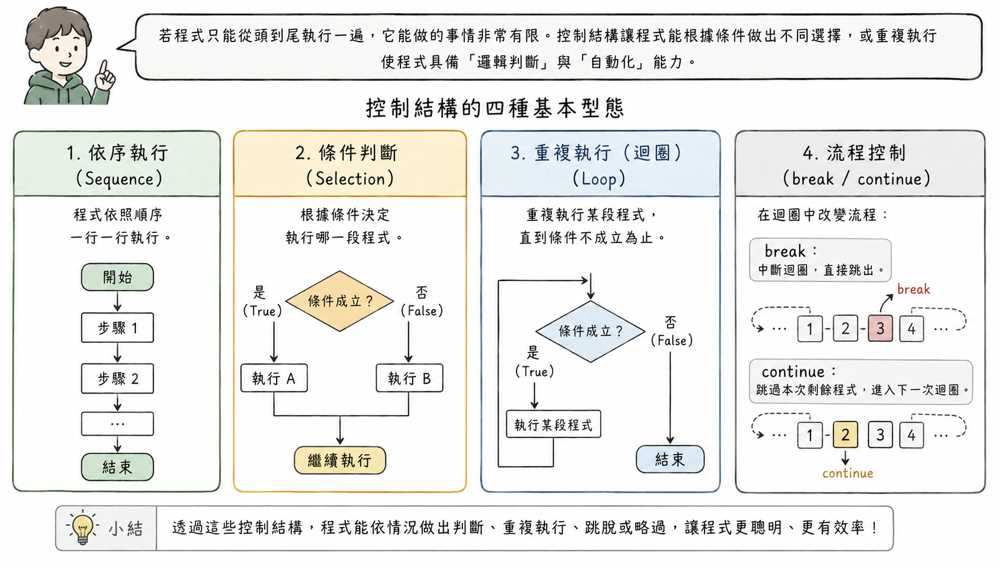

*本圖由 ChatGPT 生成，已由作者審核內容正確性*

### 1. 依序執行（sequence）

**依序執行** 是最基本的控制結構：程式碼由上而下、一行接著一行執行，沒有分支也沒有重複。前面提到的良率計算程式（輸入 → 處理 → 輸出）就是依序執行的例子——讀取產量與不良品數、計算良率、印出結果，每一步都只執行一次，且順序固定。

依序執行本身雖然單純，卻是條件判斷與迴圈的基礎：接下來的兩種控制結構，其實都是在「依序執行」的骨架上，加入分支或重複的能力。

### 2. 條件判斷（selection）

**條件判斷** 讓程式根據某個條件是否成立，選擇執行不同的程式碼區塊，通常大多數的程式語言都用「**if-else**」的語法來表示。其基本邏輯是：

```
如果 [條件成立]:
    執行 A
否則:
    執行 B
```

**工業應用：品質檢測條件判斷**

```
量測值 = 讀取感測器()

如果 量測值 >= 下限 AND 量測值 <= 上限:
    判定 = "合格"
    記錄至良品區
否則如果 量測值 < 下限:
    判定 = "過小，不合格"
    記錄至不良品區，觸發警報
否則:
    判定 = "過大，不合格"
    記錄至不良品區，觸發警報

列印報告(量測值, 判定)
```

這個邏輯可以嵌入 PLC 程式或 MES 系統，讓機器自動分類產品，無需人工逐一判斷。

### 3. 重複執行（或稱迴圈，loop）

**迴圈（Loop）** 讓程式能夠重複執行一段程式碼，直到某個條件達成，通常大多數的程式語言都用「**loop**」、「**for**」與「**while**」的語法來表示。這正是電腦「不知疲倦」的關鍵——它可以用同樣的速度重複執行一個操作一萬次，而不會因疲勞而出錯。

**for 迴圈**：適合用在 **已知重複次數** 的情境。

```
對 工單清單 中的每一張工單:
    讀取工單內容
    計算所需原料
    更新庫存
    列印領料單
```

**while 迴圈**：適合用在 **重複到某條件成立為止** 的情境。

```
當 生產線尚未完成今日配額:
    繼續生產
    更新已生產數量
    如果原料不足: 發出補料警報
```

**工業應用：批次作業**

工廠常見的批次作業（Batch Processing）天然適合用迴圈表達：

```
批次清單 = [批次001, 批次002, 批次003, ..., 批次050]

對 批次清單 中的每一個批次:
    投入原料
    執行加工流程
    進行品質量測
    記錄批次結果
    如果良率 < 95%: 發出警告，等候工程師確認
```

### 4. 一些特殊的流程控制（break 與 continue）

在迴圈執行過程中，還有一些常用的特殊流程控制寫法，讓迴圈的行為更有彈性，其中最常見的是 break 與 continue：

- **break（中斷）**：立即結束整個迴圈，跳出迴圈繼續往下執行。常用於找到目標後不需繼續搜尋，或偵測到嚴重異常需立即停止的情境。
- **continue（繼續）**：跳過本次迴圈剩餘的步驟，直接進入下一次迴圈。常用於略過不需處理的特殊情況。

**工業情境範例：**

```
對 感測器資料清單 中的每一筆資料:
    如果 資料 是空值（感測器離線）:
        continue    ← 跳過這筆，繼續下一筆
    如果 溫度 > 緊急上限:
        觸發緊急停機
        break       ← 立即停止所有處理，進入緊急程序
    正常分析資料
```

> **補充小知識**：早期程式語言其實還有一種更自由、但也更危險的跳轉方式——`goto`（跳到某一行繼續執行），可以跳到程式的任何角落。1968年，荷蘭電腦科學家[艾茲赫爾·戴克斯特拉（Edsger Dijkstra）](https://zh.wikipedia.org/zh-tw/艾兹格·迪杰斯特拉)發表了一篇影響深遠的短文〈Go To Statement Considered Harmful〉（Dijkstra, 1968），指出濫用 `goto` 會讓程式邏輯像一團纏繞的麵條般難以追蹤，後人稱之為「[義大利麵條式程式碼（Spaghetti Code）](https://zh.wikipedia.org/zh-tw/意大利面条式代码)」。這篇文章推動了[結構化程式設計（Structured Programming）](https://zh.wikipedia.org/zh-tw/結構化程式設計)的興起——也就是只用循序、條件判斷、迴圈這三種「規矩」的控制結構取代自由的 `goto`，這正是本節你所學到的 if-else 與迴圈的歷史由來。

### 如果程式只能一行一行往下執行...

程式設計如果只能一行一行照順序執行，代表每一個動作都必須被明確寫出來。遇到不同情況時，程式無法自己選擇該走哪一條路，只能把各種可能都用直線式的方式展開，這會讓程式很快變得冗長、重複，也不容易閱讀。

判斷式、迴圈和流程控制的存在，是為了讓程式能更有效率地處理問題。判斷式可以讓程式根據條件做出不同反應；迴圈可以重複執行相同或類似的工作；break 和 continue 則可以讓程式在適當時機中止迴圈或略過某些步驟，使整體流程更有彈性。

如果缺少這些控制流程的工具，程式不只會變得又臭又長，後續維護也會非常困難。當程式出錯時，開發者需要在大量重複的程式碼中尋找問題；想要修正或最佳化時，也可能必須修改許多相似的地方。因此，流程控制能讓程式更簡潔、清楚，也更容易除錯與改進。

> **小結**：條件判斷讓程式「有邏輯」，迴圈讓程式「有效率」。這兩種控制結構的組合，是幾乎所有自動化程式的核心骨架。在工業場域中，大量重複性的判斷與計算工作——從感測器資料篩選到批次報表生成——都可以透過這兩種結構自動化完成。

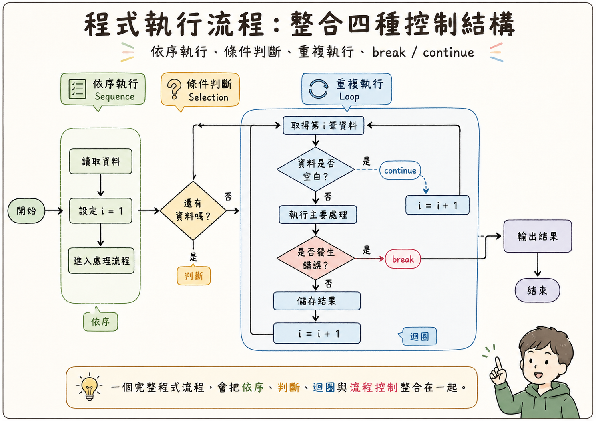

*本圖由 ChatGPT 生成，已由作者審核內容正確性*

---

## 四、函式與模組化

有了循序、條件、重複這些控制結構，程式已經能處理相當複雜的邏輯；但程式規模一旦變大，同樣的邏輯難免會在不同地方重複出現。函式與模組化，就是用來管理這種複雜度、避免重複的工具。

### 1. 函式的概念

[函式（Function）](https://zh.wikipedia.org/zh-tw/子程式) 是一段被命名、可重複呼叫的程式碼區塊，用來完成一個特定的任務。函式接受 **輸入（參數，Parameter）**，執行處理，並回傳 **輸出（回傳值，Return Value）**。

用一個工廠機台的比喻來理解：一台 **計算良率的機器**，你放入「總產量」和「不良品數」（輸入），它自動計算後輸出「良率百分比」（輸出）。每次需要計算良率時，直接使用這台機器，不需重新製造一台。

```
函式定義：
    計算良率(總產量, 不良品數):
        良品數 = 總產量 - 不良品數
        良率   = 良品數 / 總產量 * 100
        回傳   良率

函式呼叫：
    A線良率 = 計算良率(500, 12)    → 回傳 97.6
    B線良率 = 計算良率(320,  8)    → 回傳 97.5
    C線良率 = 計算良率(410, 31)    → 回傳 92.4
```

同樣的計算邏輯只寫一次，卻可以在任何需要的地方重複使用。

### 2. 重複使用與模組化設計

[模組化（Modularization）](https://zh.wikipedia.org/zh-tw/模組化編程) 是將程式切分為多個功能獨立的函式（或模組），每個函式只負責一件事，並且可以被其他程式重複呼叫。這帶來幾個重要優點：

- **可讀性**：程式邏輯清晰，每個函式名稱就說明了它的用途
- **可維護性**：修改一個函式不影響其他部分；若計算方式改變，只需修改一處
- **可重用性**：同一個函式可被不同的程式或模組呼叫，避免重複撰寫相同邏輯
- **可測試性**：每個函式可以獨立測試，確保其正確性後再整合

**工業應用：將生產流程拆成可重複的作業單元**

一套完整的生產日報系統，可以用模組化的方式設計：

```
函式：讀取感測器資料(機台編號, 日期)
函式：計算良率(總產量, 不良品數)
函式：判斷是否達標(良率, 目標良率)
函式：生成日報表(機台清單, 日期)
函式：寄送警報郵件(收件人, 警報內容)

主程式：
    對 每台機台:
        資料   = 讀取感測器資料(機台, 今天)
        良率   = 計算良率(資料.產量, 資料.不良數)
        達標   = 判斷是否達標(良率, 95%)
        如果 NOT 達標:
            寄送警報郵件(工程師, "機台X良率不達標")
    生成日報表(所有機台, 今天)
```

每個函式職責單一、邊界清晰，整個系統的邏輯一目了然。

### 3. 為什麼程式需要函式與模組化？

程式雖然可以只靠循序、選擇與重複這三種基本結構撰寫，讓指令依序執行、依條件分支，或重複執行某些動作；但是當程式規模變大時，程式碼會逐漸變長，邏輯也會變得分散。此時即使每一段程式本身都能正確執行，整體仍可能變得難以閱讀、難以檢查，也不容易看出各段程式之間的關係。

隨著功能增加，程式中常會出現相似甚至完全相同的程式碼。例如不同地方都需要計算總分、檢查輸入資料、格式化輸出結果，或執行同一套判斷規則。如果每次都重新寫一遍，不但會讓程式變得冗長，也會增加錯誤發生的機會；一旦規則需要修改，所有重複出現的地方都必須同步更改，否則容易造成結果不一致。

因此，程式需要函式與模組化。函式可以把重複使用的邏輯集中成一個可呼叫的單位，讓程式在需要時直接使用；模組化則能把相關功能整理在一起，使程式結構更清楚。透過函式與模組化，程式可以減少重複、提高可讀性，也讓維護、測試與擴充變得更容易。

函式與模組化解決了「邏輯重複」的問題，但當程式中有大量「資料」與「操作這些資料的邏輯」需要綁在一起管理時——例如同一台機台的多項屬性（機台編號、狀態、良率）與相關操作（啟動、停機、記錄良率）——單靠函式與模組化就不夠直覺了。這正是「**物件導向（Object-Oriented Programming）**」概念出現的原因。

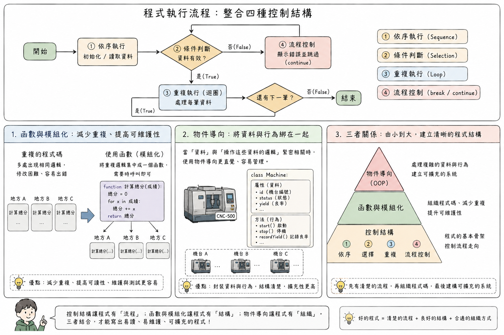

*本圖由 ChatGPT 生成，已由作者審核內容正確性*

### 4. 物件導向概念簡介

[物件導向程式設計（Object-Oriented Programming, OOP）](https://zh.wikipedia.org/zh-tw/物件導向程式設計) 是一種把「資料」與「操作資料的函式」包在一起管理的程式設計方式。核心概念是 **類別（Class）** 與 **物件（Object）**：類別是一張藍圖，定義了某一類事物該有哪些 **屬性（Attribute，資料）** 與 **方法（Method，函式）**；物件則是依照這張藍圖實際產生出來的一個個實體。

用工廠機台來比喻：「機台」可以設計成一個類別，定義它共同擁有的屬性（機台編號、目前狀態、良率）與方法（啟動、停機、記錄良率）。實際產線上的「A線沖床」、「B線車床」都是依照這個類別產生出來的物件，各自擁有獨立的屬性值，卻共用同一套方法。

```
類別：機台
    屬性：機台編號、狀態、良率
    方法：啟動()、停機()、記錄良率(良率)

物件：
    A線沖床 = 機台(編號="M01", 狀態="運轉中", 良率=97.6)
    B線車床 = 機台(編號="M02", 狀態="待機中", 良率=95.2)

    A線沖床.記錄良率(98.1)
```

物件導向讓「資料」與「操作資料的邏輯」綁在一起，貼近我們對真實世界物件（機台、工單、產品）的認知方式，是目前主流程式語言（如 Python、Java、C++）共同採用的設計典範，也是許多資訊系統與軟體框架背後的基礎概念。

---

## 五、基本資料處理

### 1. 陣列與列表（List）

到目前為止，我們討論的變數一次只儲存一個值。但實際工作中，我們往往需要處理 **一組同類型的資料**，例如：今天 24 小時內每小時的溫度量測值、本週五天的每日產量。

[陣列（Array）](https://zh.wikipedia.org/zh-tw/陣列) 或 **列表（List）** 是一種資料結構，可以在一個變數名稱下，依序儲存多個值，並透過 **索引（Index）** 存取特定位置的值。

```
每日產量 = [480, 512, 498, 467, 521]
             ↑     ↑     ↑     ↑     ↑
           [0]   [1]   [2]   [3]   [4]   ← 索引從 0 開始

每日產量[0] → 480（星期一）
每日產量[2] → 498（星期三）
每日產量[4] → 521（星期五）
```

> **注意**：大多數程式語言的索引從 0 開始，而非從 1 開始。這是初學者最常見的混淆點之一，請特別留意。

有了列表，就能用迴圈輕鬆處理一整週的資料：

```
每日產量 = [480, 512, 498, 467, 521]
總產量   = 0

對 每日產量 中的每一個值:
    總產量 = 總產量 + 該值

平均產量 = 總產量 / 5    → 495.6
```

**工業應用：生產紀錄與庫存清單**

列表在工業資訊系統中無所不在：

- `感測器讀值 = [23.1, 23.4, 23.2, 24.8, 23.0, ...]`（每分鐘溫度）
- `工單清單 = ["WO-001", "WO-002", "WO-003", ...]`（待加工工單）
- `不良原因 = ["尺寸超差", "表面刮傷", "尺寸超差", "缺料", ...]`（品質記錄）

### 2. 簡單資料讀取與整理

在工業環境中，資料往往來自外部檔案（如 CSV 格式的感測器匯出資料）或資料庫查詢。基本的資料處理流程包含以下幾個步驟：

**1. 讀取資料**：從檔案、資料庫或感測器取得原始資料，存入列表或其他資料結構。

**2. 篩選（Filtering）**：從大量資料中，只取出符合條件的資料。例如，從一個月的感測器紀錄中，篩選出溫度超過上限的所有時間點。

**3. 排序（Sorting）**：將資料按照特定順序排列，例如將工單依優先級由高到低排列，或將不良品記錄依時間排序。

**4. 彙整（Aggregation）**：計算統計值，如總計、平均、最大值、最小值、計數等，將大量資料壓縮為有意義的摘要資訊。

**5. 輸出（Output）**：將處理後的結果寫入報表、存回資料庫，或顯示於監控畫面。

```
原始資料（從感測器 CSV 讀入）：
溫度紀錄 = [23.1, 24.5, 23.8, 26.2, 23.4, 25.9, 27.1, 23.0]

篩選異常（溫度 > 25.0）：
異常紀錄 = [26.2, 25.9, 27.1]

彙整：
最高溫度 = 最大值(溫度紀錄)   → 27.1
平均溫度 = 平均值(溫度紀錄)   → 24.6
異常次數 = 長度(異常紀錄)     → 3
```

---

## 第二篇：資料結構基礎

---

## 六、資料結構的角色

### 1. 為何需要資料結構？

想像一間沒有任何整理系統的倉庫：所有零件散落各地，每次要找某個零件都需要翻遍整個倉庫。這種倉庫雖然能儲存零件，但效率極差。現在想像同一間倉庫，依照零件類型分區、每個儲位都有編號、入庫出庫都有記錄——找東西不再是問題。

[資料結構（Data Structure）](https://zh.wikipedia.org/zh-tw/資料結構) 就是程式中的「倉庫整理系統」：它決定了資料如何被組織、儲存，以及如何被存取（Cormen et al., 2022）。選擇正確的資料結構，往往是程式效能好壞的關鍵。

同樣是「儲存一批工單」，放進不同的資料結構，存取的效率與適用的操作就大不相同：放進 **列表** 可以依序處理；放進 **佇列** 可以確保先到先服務；放進 **映射** 可以用工單號碼瞬間查到工單內容。

### 2. 抽象資料型態（ADT）

[抽象資料型態（Abstract Data Type，ADT）](https://zh.wikipedia.org/zh-tw/抽象資料型別) 是從「使用者角度」定義資料結構：它 **能做什麼操作**，而不涉及內部如何實作。就像你使用電梯，只需要知道「按樓層按鈕，門會打開，電梯會移動到指定樓層」，不需要知道纜繩、馬達的運作細節。

這個概念讓程式設計者能夠專注在「我需要什麼功能」，而不是「我要如何在記憶體中排列資料」，大幅降低了設計的複雜度。

**工業應用：訂單、庫存、工單管理**

| 管理場景 | 需要的操作 | 適合的資料結構 |
| --- | --- | --- |
| 訂單等候處理 | 先進先出、加入尾端、取出頭部 | 佇列（Queue） |
| 操作歷史紀錄（可復原） | 後進先出、加入頂端、取出頂端 | 堆疊（Stack） |
| 用工單號碼查詢工單 | 快速依鍵值查找 | 映射（Map） |
| 依優先序處理工單 | 取出最高優先的項目 | 優先佇列 |
| 組織物料清單層級 | 上下層關係、子節點存取 | 樹（Tree） |

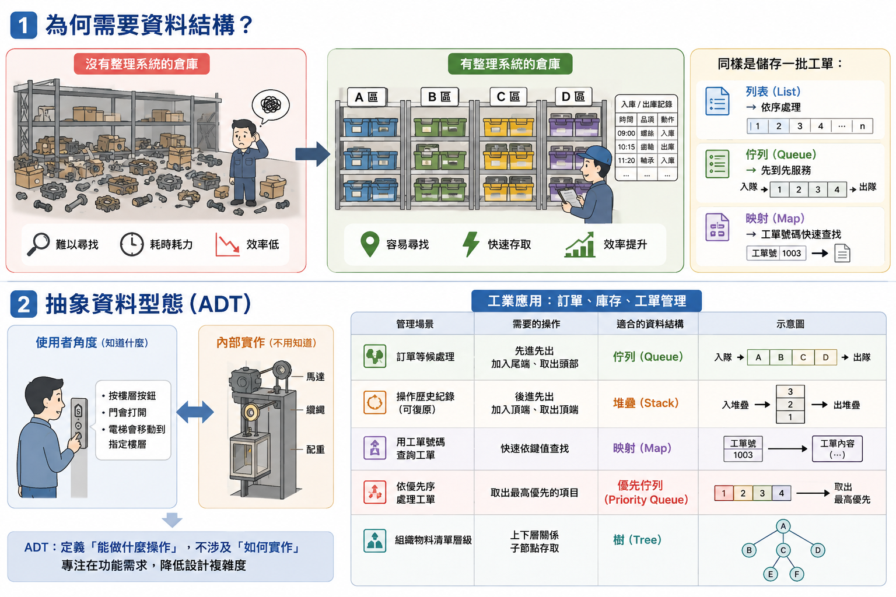

*本圖由 ChatGPT 生成，已由作者審核內容正確性*

> **動手做**：接下來介紹的列表、堆疊、佇列、集合與映射，都可以在 [Computer-Program-Examples.ipynb](notebooks/Computer-Program-Examples.ipynb) 的〈第二篇：資料結構基礎〉直接執行看看。建議邊讀邊跑，改幾個數值觀察輸出怎麼變，會比只看文字有感覺得多。

---

## 七、陣列與列表（Array / List）

### 1. 順序儲存概念

陣列與列表是最基本、最直觀的資料結構：將多個資料元素 **依照順序排列在一起**，每個元素有一個對應的 **索引（Index）** 指示其位置。每個元素所存放的內容，最終都落在記憶體裡；而記憶體本身也是一排排列整齊的儲存格，每一格都有專屬的 **記憶體位址（Memory Address）**，用來標示某筆內容究竟存在哪一格。只是記憶體位址數量龐大又不易記憶，程式一次通常只處理其中一小段資料，因此改用從 0 開始的索引來指稱「第幾個元素」，遠比直接記位址方便。

在記憶體中，陣列的元素通常是 **連續排列** 的，就像超市貨架上一排緊鄰的商品——你知道第一個的位置，就能直接計算第 n 個在哪裡，不需逐一搜尋。這使得 **依索引存取**（如「給我第3個元素」）的速度極快，無論陣列有多長，都能在固定時間內完成。

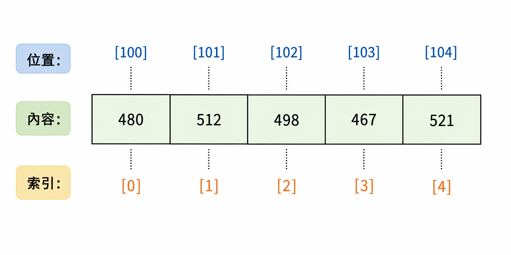

*本圖由 ChatGPT 生成，已由作者審核內容正確性*

### 2. 存取與走訪

對陣列最常見的兩種操作：

**隨機存取（Random Access）**：直接透過索引取得特定位置的元素。速度很快，不論陣列多長，存取任意一個元素的時間相同。

**走訪（Traversal，也稱遍歷）**：從頭到尾依序存取陣列中的每一個元素，通常搭配迴圈使用。

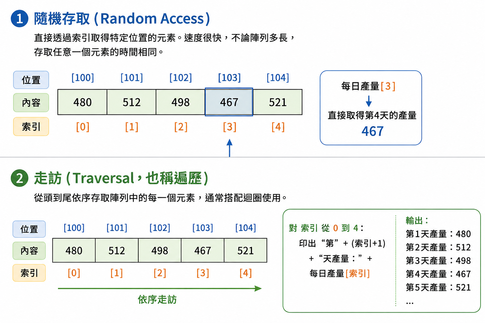

*本圖由 ChatGPT 生成，已由作者審核內容正確性*

### 3. 工業應用：每日產量紀錄

**每日產量記錄**：將一個月 30 天的每日產量存入列表，可以輕鬆計算月總量、月平均量、找出最高產日與最低產日：

```
月產量紀錄 = [480, 512, 498, 467, 521, 489, 503, ...]  ← 共30個值

月總量   = 加總(月產量紀錄)
月平均   = 月總量 / 30
最高產日 = 找最大值的索引(月產量紀錄) + 1
最低產日 = 找最小值的索引(月產量紀錄) + 1
```

**感測器時序資料**：每 10 秒記錄一次溫度，一天下來有 8,640 筆資料，存入列表後，可以用迴圈掃描找出異常時段，或計算各時段的平均溫度。

---

## 八、堆疊與佇列（Stack & Queue）

### 1. 兩種截然不同的存取方式

堆疊與佇列都是管理「一序列資料」的結構，但它們規定資料進出的順序截然不同，也因此適合不同的應用場合。

### 2. 堆疊（Stack）——後進先出（LIFO）

[堆疊（Stack）](https://zh.wikipedia.org/zh-tw/堆疊) 遵循 **LIFO（Last In, First Out，後進先出）** 的原則：最後放入的資料，最先被取出。

想像一疊盤子：你只能從最頂端放入（push）或取出（pop）盤子，不能從中間抽取。

> **趣味小知識**：堆疊的「push」與「pop」這兩個術語，據說正是來自這個「一疊盤子」的畫面——早期美式自助餐廳常見一種彈簧式疊盤機（spring-loaded plate dispenser）：你把盤子往下壓（push）放進去，彈簧會把它連同下面所有盤子一起頂住；抽走最上面一個（pop），彈簧又把剩下的盤子頂高一階。1950年代的電腦科學家借用了這個生活中隨處可見的裝置，來命名堆疊「後進先出」的存取方式，比起憑空發明術語，直接借用日常經驗反而更容易讓人一聽就懂。

堆疊的兩個基本操作：
- **Push（推入）**：將新元素放到堆疊頂端
- **Pop（彈出）**：取出並移除堆疊頂端的元素

**工業應用：流程回溯與操作步驟檢查**

堆疊最常見的應用是「復原（Undo）」功能：每次操作都被推入堆疊，按下「復原」時，從頂端彈出最後一次操作並執行反向動作。

在工業環境中，**設備操作步驟的檢查** 也適合用堆疊模型：某些設備的啟動程序必須嚴格按照順序執行，關閉時必須以相反順序（後啟動的先關閉）拆除，確保安全。

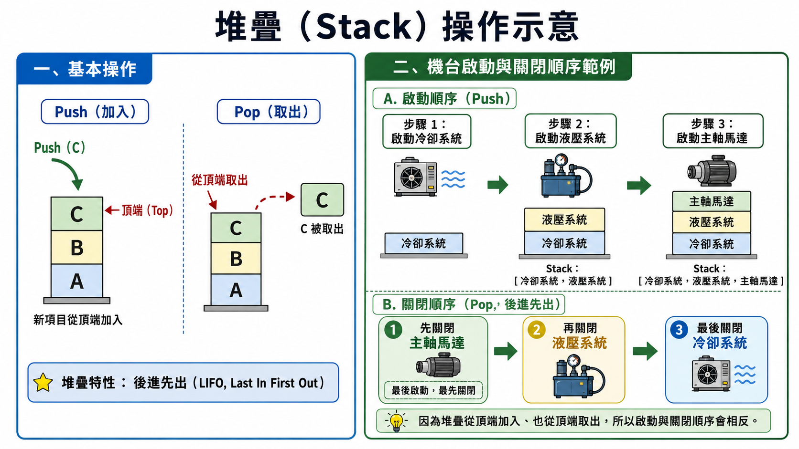

*本圖由 ChatGPT 生成，已由作者審核內容正確性*

### 3. 佇列（Queue）——先進先出（FIFO）

[佇列（Queue）](https://zh.wikipedia.org/zh-tw/佇列) 遵循 **FIFO（First In, First Out，先進先出）** 的原則：最先放入的資料，最先被取出。

這正是日常生活中排隊的邏輯：先到者先被服務，後到者排在後面等待。

佇列的兩個基本操作：
- **Enqueue（入隊，加入佇列）**：將新元素加入佇列尾端
- **Dequeue（出隊，移出佇列）**：取出並移除佇列頭部的元素

**工業應用：生產排程與等候加工**

佇列幾乎是所有 **排隊等候系統** 的天然模型：

- **生產排程**：工單依照下達時間排入佇列，機台空出時，從佇列頭部取出下一張工單開始加工，確保先下達的工單先被處理
- **訂單處理系統**：客戶訂單依照收到時間排入佇列，客服人員依序處理
- **列印工作排隊**：多人同時列印時，列印工作依序排入佇列，印表機一次處理一個

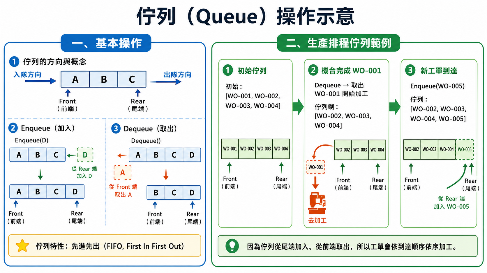

*本圖由 ChatGPT 生成，已由作者審核內容正確性*

> **小結**：堆疊（後進先出）與佇列（先進先出）分別對應兩種截然不同的現實場景。工廠中的「等候加工隊列」是佇列；「操作步驟的逆序回溯」是堆疊。理解這兩種結構，能幫助你在設計工業資訊系統時，為不同的等候或順序問題選擇正確的資料模型。

---

## 九、集合與映射（Set / Map）

### 1. 集合（Set）——唯一性

**集合（Set）** 是一種只儲存 **不重複元素** 的資料結構。當你將資料加入集合時，若相同的值已經存在，集合會自動忽略，不會產生重複。

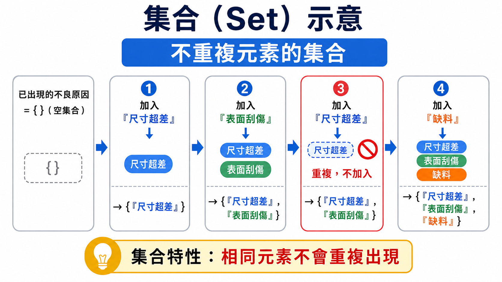

*本圖由 ChatGPT 生成，已由作者審核內容正確性*

集合最常用於：快速判斷某個值 **是否已出現**、從大量資料中取得 **不重複的種類清單**。

**工業應用範例**：從一個月的不良品紀錄中，快速找出「本月共出現了哪些不良類型」，而不用逐一去除重複值。

### 2. 映射（Map）——鍵值對

**映射（Map）**，又稱字典（Dictionary），內部常以[雜湊表（Hash Table）](https://zh.wikipedia.org/zh-tw/雜湊表) 實作，是一種儲存 **鍵值對（Key-Value Pair）** 的資料結構：每個 **鍵（Key）** 對應一個 **值（Value）**，就像現實中的字典——查「apple」這個字（鍵），得到它的意思（值）。

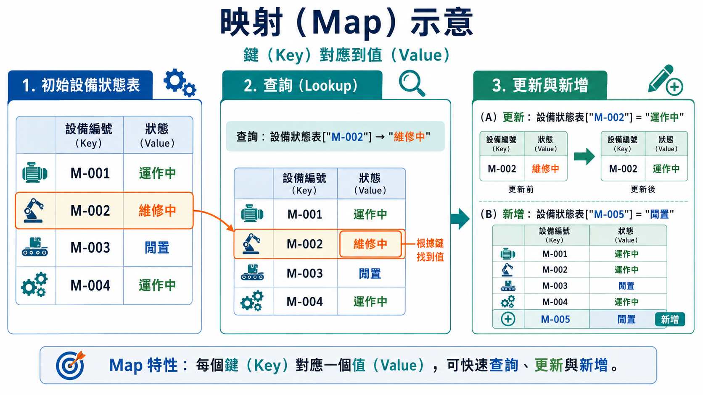

*本圖由 ChatGPT 生成，已由作者審核內容正確性*

映射的核心優勢是：**依鍵查值的速度極快**，不論映射中有多少筆資料，查詢時間幾乎固定。這與必須逐一搜尋的列表相比，在大量資料時有顯著的效能差異。

**工業應用：物料編號查詢與設備對應表**

- **物料主檔**：`{"MAT-001": {"名稱": "齒輪", "單位": "個", "安全庫存": 100}, "MAT-002": {...}, ...}` ——用料號瞬間查到完整物料資訊
- **設備對應表**：`{"機台編號": "負責技術員姓名"}` ——發生異常時立即查出聯絡人
- **產品規格表**：`{"產品料號": {"長度": 50.0, "寬度": 30.0, "公差": 0.05}}` ——加工前查詢規格

---

## 十、樹與層級結構（概念性介紹）

### 1. 什麼是樹？

前面介紹的列表、堆疊、佇列都是 **線性** 結構——資料一個接一個地排列。但現實世界中，許多資料天然具有 **層級（Hierarchical）** 關係，例如公司的組織架構、產品的零件組成，這類資料用 **[樹（Tree）](https://zh.wikipedia.org/zh-tw/樹_(資料結構))** 來表示最為自然。

樹由 **節點（Node）** 和連接節點的 **邊（Edge）** 組成。以下就樹的各種結構進行說明：

- 最頂端的節點稱為 **根節點（Root）**（如「總經理」）
- 有子節點的節點稱為 **父節點（Parent）**
- 沒有子節點的節點稱為 **葉節點（Leaf）**（如「生產線A」）
- 從根到任一節點的距離稱為 **層級（Level）**

### 2. 工業應用：組織架構與產品結構（BOM）

[產品物料清單（BOM，Bill of Materials）](https://zh.wikipedia.org/zh-tw/材料清單) 是樹狀結構在製造業最重要的應用之一。BOM 描述了一個成品由哪些零組件組成，每個零組件又由哪些更小的零件組成，形成一個層級分明的樹狀結構：

ERP 系統在計算生產一輛自行車需要多少原材料時，就是沿著這棵 BOM 樹向下展開，逐層計算每個子零件的需求量，這個過程稱為 [MRP 展算（Material Requirements Planning）](https://zh.wikipedia.org/zh-tw/物料需求計劃)。

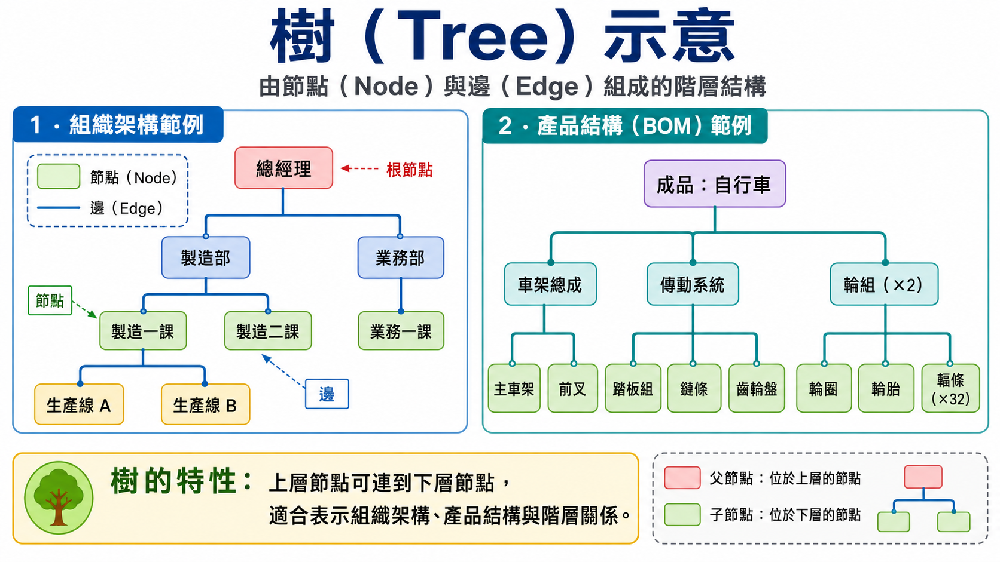

*本圖由 ChatGPT 生成，已由作者審核內容正確性*

> **小結**：樹狀結構是表達「整體—部分」或「上層—下層」關係的最自然工具。在工業場域中，組織架構、設備層級（工廠 → 產線 → 機台 → 模組）、產品 BOM、工作分解結構（WBS）都是樹狀結構的體現。理解樹的概念，有助於理解 ERP/MES 系統中許多資料組織的方式。

> **延伸閱讀**：本節只先說明 BOM／MRP 背後「樹狀結構」的資料觀點；ERP、MES 等企業應用系統的完整功能與運作方式，請見 [05-Information-Systems-and-Database.md](05-Information-Systems-and-Database.md)〈三、企業應用系統〉。

---

## 第三篇：演算法基礎與效率概念

---

## 十一、演算法基本概念

### 1. 演算法的定義與特性

**演算法（Algorithm）** 是解決特定問題的 **一系列明確、有限、有序的步驟**（Cormen et al., 2022）。這個定義在第一章已經介紹過，這裡我們進一步深入。

一個好的演算法必須具備：

- **明確性（Definiteness）**：每個步驟清楚無歧義，電腦能理解並執行
- **有限性（Finiteness）**：必須在有限步驟後終止，不能無限執行下去
- **輸入（Input）**：有零個或多個明確定義的輸入
- **輸出（Output）**：有一個或多個明確定義的輸出結果
- **有效性（Effectiveness）**：每個步驟都是電腦可以實際執行的基本操作

### 2. 演算法與程式的關係

演算法是 **概念層面的解題步驟**，程式則是演算法的 **具體實作**。同一個演算法，可以用不同的程式語言（Python、Java、C++）寫出來；反過來說，同一個問題通常也有好幾種演算法可選，效率高低差很多。

也因為演算法屬於概念層面，它不一定要用程式語言表達。下面兩個例子都只用中文描述步驟，一樣能把演算法的樣貌講清楚。

> *問題：媽媽要你拿著購物清單去超級市場買東西*

```
演算法（語言無關）：
  1. 拿出購物清單，從第一項開始
  2. 找到該項商品所在的貨架
  3. 確認品項與數量無誤後，放進購物車
  4. 在清單上把該項打勾，換到下一項
  5. 重複步驟 2–4，直到清單上所有品項都打勾
  6. 到收銀台結帳，完成採購
```

看到這裡你應該會發現，演算法的基本概念其實很單純：把步驟一條一條列清楚、照著做，遇到不同情況就走不同的路徑。接下來我們換一個跟資料處理有關的題目：

> *問題：在一個列表中，找出最大值*

```
演算法（語言無關）：
  1. 將「目前最大值」設為列表的第一個元素
  2. 從第二個元素開始，逐一與「目前最大值」比較
  3. 若當前元素比「目前最大值」還大，就更新「目前最大值」
  4. 重複步驟 2–3，直到所有元素都比較完畢
  5. 回傳「目前最大值」
```

如果把上面這段中文步驟改寫成 Python 程式，會長成這樣：

```python
每日產量 = [480, 512, 498, 467, 521]

目前最大值 = 每日產量[0]        # 步驟 1：先假設第一個元素最大
for 產量 in 每日產量[1:]:       # 步驟 2：從第二個元素開始逐一比較
    if 產量 > 目前最大值:       # 步驟 3：發現更大的就換掉
        目前最大值 = 產量

print(目前最大值)               # 步驟 5：輸出結果 → 521
```

對照一下就會發現，程式碼幾乎是中文步驟的一句一句翻譯：「設為第一個元素」變成 `目前最大值 = 每日產量[0]`、「逐一比較」變成 `for` 迴圈、「若⋯⋯則更新」變成 `if` 判斷；至於步驟 4 的「重複」，`for` 迴圈本身就做完了，不必另外寫一行。

換句話說，真正花腦力的是想出這五個步驟，把它翻成某種程式語言反而比較機械。這也是為什麼學程式設計的重點從來不是背語法，而是先把解題步驟想清楚。

> **趣味小知識**：Python 其實允許用中文當變數名稱，上面的程式真的可以跑。這裡刻意這樣寫是為了跟中文步驟對照，實務上還是以英文命名為主——不是中文不行，而是同事、套件與錯誤訊息都講英文，混用反而容易出錯。

**工業應用：SOP 就是工廠版的演算法**

工廠的 SOP 與演算法在結構上高度相似：

| 演算法特性 | SOP 對應 |
| --- | --- |
| 明確性 | 每個操作步驟清楚描述，不允許模糊 |
| 有限性 | 作業有明確的開始與結束 |
| 輸入 | 原料、半成品、設備參數 |
| 輸出 | 成品、品質量測結果、生產記錄 |
| 有效性 | 每個步驟都是操作員可實際執行的動作 |

將 SOP 轉化為電腦可執行的演算法，正是「流程數位化與自動化」的核心工作。

**演算法與程式設計的關係**

程式設計與演算法，其實是同一件事的兩面：

- **演算法決定「怎麼解」**
- **程式語言決定「怎麼把解法轉換電腦可以執行的形式」**

演算法本身只是「想法」，寫在紙上不會自己動起來，一定要有人或某個東西把步驟真的執行完，才會產生價值。人當然可以執行，前面買東西的例子就是人在跑演算法；但人一小時只能核對幾十筆資料，還會看錯、會累、會因為心情不同而做出不同判斷。電腦剛好相反：一秒鐘可以處理幾百萬筆，不會累也不會分心，同樣的輸入永遠給你同樣的輸出。

所以，把演算法寫成 **電腦程式**，是目前把「解題步驟」變成「實際產出」最快、最便宜也最可靠的方式。SOP 寫好了要靠作業員照著執行，還得訓練與稽核；演算法寫成程式後只要對一次，就能在每台電腦上重複執行。

---

## 十二、基本演算法範例

### 1. 搜尋——如何找到你要的資料

前面小節所說的「**問題：在一個列表中，找出最大值**」就是搜尋的概念。因此 **搜尋（Search）** 是在一組資料中，找出符合特定條件的元素。這是程式中最頻繁的操作之一。

[線性搜尋（Linear Search）](https://zh.wikipedia.org/zh-tw/線性搜索) 是最直觀的搜尋方式：從頭到尾逐一檢查每個元素，直到找到目標或確認不存在。

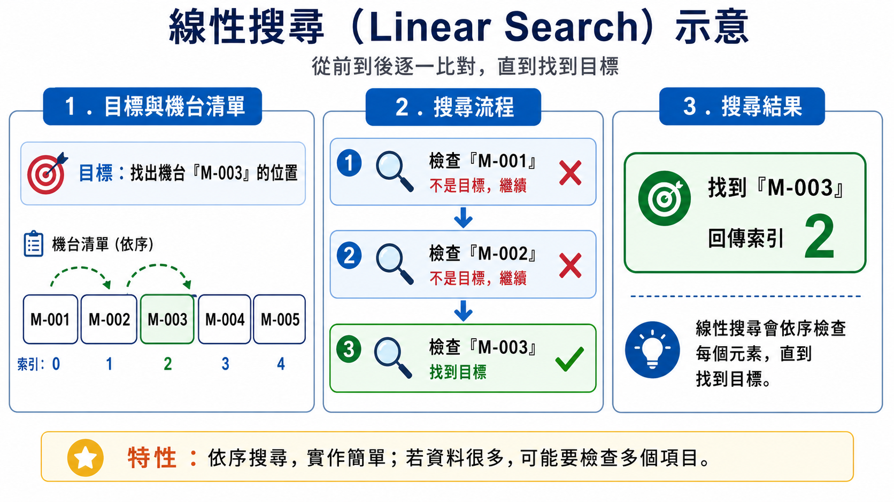

*本圖由 ChatGPT 生成，已由作者審核內容正確性*

線性搜尋的優點是邏輯簡單，不需要資料事先排序；缺點是若資料量很大，且目標在末端或不存在，需要逐一檢查每一筆資料，效率較低。這正是後面「效率分析」要討論的核心議題。

### 2. 排序——讓資料有序

[排序（Sorting）](https://zh.wikipedia.org/zh-tw/排序演算法)（Sedgewick & Wayne, 2011）是將一組資料依照特定順序（如數字大小、字母順序、日期先後）重新排列。排序後的資料往往更容易搜尋、分析和呈現。

以[泡沫排序（Bubble Sort）](https://zh.wikipedia.org/zh-tw/泡沫排序) 為例說明排序的基本概念（直觀但非最有效率）：

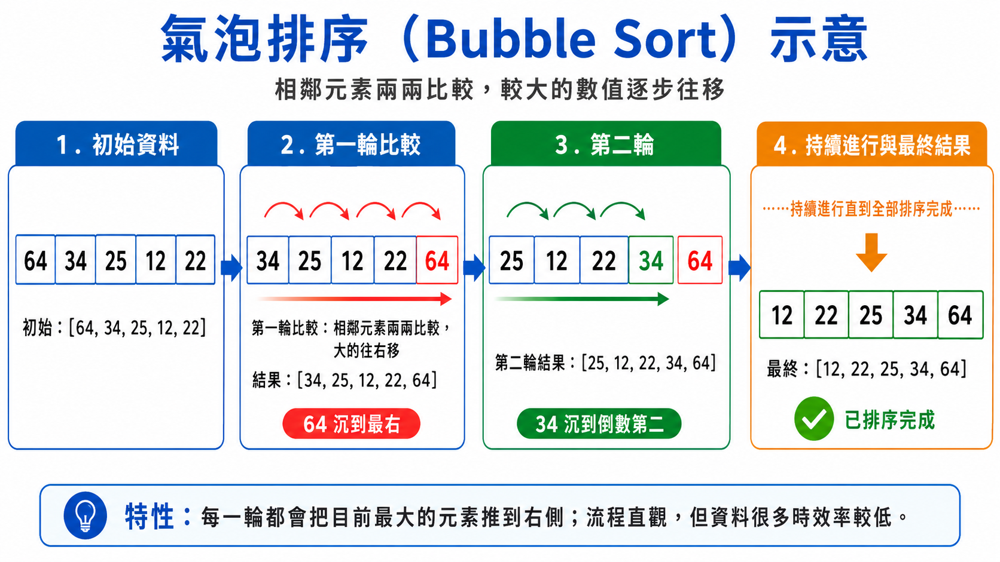

*本圖由 ChatGPT 生成，已由作者審核內容正確性*

> **重點在流程，不在細節**：本章的目的不是要你記住泡沫排序的每一個步驟，而是理解「排序是透過反覆比較與交換，逐漸將資料調整到正確位置」的這個基本流程。實際工作中，程式語言都已內建高效的排序函式，不需要自己實作。

**工業應用**：

- 將工單依照「截止日期」排序，確保緊急工單優先處理
- 將不良品依照「不良次數由多到少」排序，找出最嚴重的品質問題（柏拉圖分析的基礎）
- 將設備依照「OEE 數值由低到高」排序，找出最需要改善的機台

> **趣味小知識**：泡沫排序雖然直觀好懂，卻不是實務上常用的排序法——真正撐起現代程式語言內建排序功能的，多半是英國電腦科學家[東尼·霍爾（Tony Hoare）](https://zh.wikipedia.org/zh-tw/托尼·霍尔)於1959年發明的[快速排序（Quicksort）](https://zh.wikipedia.org/zh-tw/快速排序)。有趣的是，霍爾當時人在莫斯科國立大學擔任訪問學生，原本只是想寫一支「機器翻譯」程式把俄文詞典按字母排序，才意外發明了這個影響後世超過一甲子的演算法（Hoare, 1962）。相較於泡沫排序在資料量大時效能急速惡化，快速排序平均效能出色，至今仍是許多程式語言內建排序函式的核心邏輯之一。

---

## 十三、效率與時間複雜度概念

### 1. 為何需要效率分析？

同一個問題，可以用不同的演算法解決，但效率可能天差地別。當資料量小時，差異或許感覺不出來；當資料量增長到成千上萬，甚至數百萬筆時，低效率的演算法可能讓一個本來幾秒鐘就能完成的計算，變成需要等待幾小時。

**生活情境**：想像你手上有一本 2,000 頁的英文字典，要查 「manufacturing」這個字。第一種找法是從第 1 頁開始一頁一頁翻，運氣最差時要翻 2,000 次才找得到。第二種是你實際上會用的方法：先翻到中間，發現翻過頭就往前找一半、還不夠就往後找一半，每翻一次就把還沒排除的範圍砍掉一半——這樣最多 11 次就能定位到那一頁（因為 2 的 11 次方是 2,048，已經超過 2,000）。

同一本字典、同一個單字，兩種找法的工作量是 2,000 比 11。更關鍵的是後面這件事：假如字典加厚到 4,000 頁，第一種找法要多翻 2,000 次，第二種只要多翻 1 次。資料量越大，兩者的差距就被拉得越開——這正是效率分析真正在意的地方。

**工業情境**：你的工廠有 1,000 筆庫存品項，搜尋某個料號可能只要 0.001 秒。但當品項增長到 1,000,000 筆時，同樣的搜尋方法會需要 1 秒甚至更長。若每次領料都需要搜尋一次，系統的回應速度就會明顯變慢。

這就是為什麼電腦科學家要研究演算法效率——不是因為喜歡數學，而是因為 **規模增大時，效率的差異會被放大到無法忽視**。

### 2. 時間複雜度（Time Complexity）——直覺理解

[時間複雜度](https://zh.wikipedia.org/zh-tw/時間複雜度) 描述的是：當輸入資料量（通常以 n 表示）增加時，演算法所需的執行時間如何成長。我們用 [大 O 符號（Big-O Notation）](https://zh.wikipedia.org/zh-tw/大O符號) 來表示，它描述的是「最壞情況下的成長趨勢」。

> **趣味小知識**：大 O 符號其實不是電腦科學家發明的——它最早由德國數論學家保羅·巴赫曼（Paul Bachmann）於1892年提出，用來描述數學函數的成長趨勢，後來由另一位數論學家艾德蒙·蘭道（Edmund Landau）發揚光大。真正把它帶進電腦科學、成為分析演算法效率標準工具的，是被譽為「演算法分析之父」的美國電腦科學家[唐納·克努斯（Donald Knuth）](https://zh.wikipedia.org/zh-tw/高德纳)。他窮盡數十年心力撰寫的巨著《電腦程式設計的藝術（The Art of Computer Programming）》，至今仍是演算法領域公認的經典（Knuth, 1997）。

#### O(1)——常數時間

無論 n 有多大，執行時間 **固定不變**。

這個特性你在〈九、集合與映射（Set / Map）〉其實已經見過了：當時說映射「依鍵查值的速度極快，不論映射中有多少筆資料，查詢時間幾乎固定」——換成這一節的語言，那句話講的就是 O(1)。拿料號去查物料主檔，不管主檔裡有 100 筆還是 100 萬筆，查一次花的時間都差不多。

```
範例：透過索引直接存取列表中的某個元素

每日產量[3] → 無論列表有 5 個還是 5,000 個元素，
              存取第 4 個元素的時間完全相同
```

這是最理想的情況，但不是每種操作都做得到。

**工廠類比**：倉庫有固定編號的儲位，只要知道儲位號碼，直接走過去拿，不需要搜尋，不管倉庫有多大，時間一樣。

#### O(n)——線性時間

執行時間 **與 n 成正比**：資料量變成 2 倍，時間也大約變成 2 倍。

回想〈十二、基本演算法範例〉的線性搜尋：從頭到尾逐一檢查，資料有幾筆，最壞情況就得看幾次。前面查字典時一頁一頁翻的那種找法，也屬於這一類。

```
範例：線性搜尋

在 100 筆資料中搜尋 → 最多 100 次比較
在 1,000 筆資料中搜尋 → 最多 1,000 次比較
在 10,000 筆資料中搜尋 → 最多 10,000 次比較
```

**工廠類比**：倉庫沒有分區，要找一個零件只能從頭開始逐一尋找。倉庫裡的零件越多，找到目標平均要花的時間就越長，且成正比。

#### O(n²)——平方時間

執行時間 **與 n 的平方成正比**：資料量變成 2 倍，時間變成 4 倍；資料量變成 10 倍，時間變成 100 倍。

這裡請同學回想前面的泡沫排序：每一輪都要把相鄰元素兩兩比較過一遍，而這樣的輪次又要跑將近 n 輪，比較次數自然就落在 n×n 的量級。那一節提醒「實務上直接用程式語言內建的排序函式」，原因就在這裡——內建的排序遠比自己手寫的泡沫排序有效率。

```
範例：泡沫排序（對 n 個元素排序，需要進行約 n×n 次比較）

排序 10 筆資料  → 約 100 次比較
排序 100 筆資料 → 約 10,000 次比較
排序 1,000 筆資料 → 約 1,000,000 次比較
```

當 n 不大時，O(n²) 算法勉強可以接受；但一旦 n 變大，效能就會急速惡化。

**直覺式比較**（假設每次基本操作花 1 微秒）：

| n（資料量） | O(1) | O(n) | O(n²) |
| --- | --- | --- | --- |
| 10 | 1 μs | 10 μs | 100 μs |
| 1,000 | 1 μs | 1 ms | 1 秒 |
| 1,000,000 | 1 μs | 1 秒 | **11.6 天** |

這張表清楚地說明了為什麼效率分析很重要——對於百萬筆資料，O(1) 的演算法瞬間完成，O(n) 需要 1 秒，而 O(n²) 需要將近兩週。

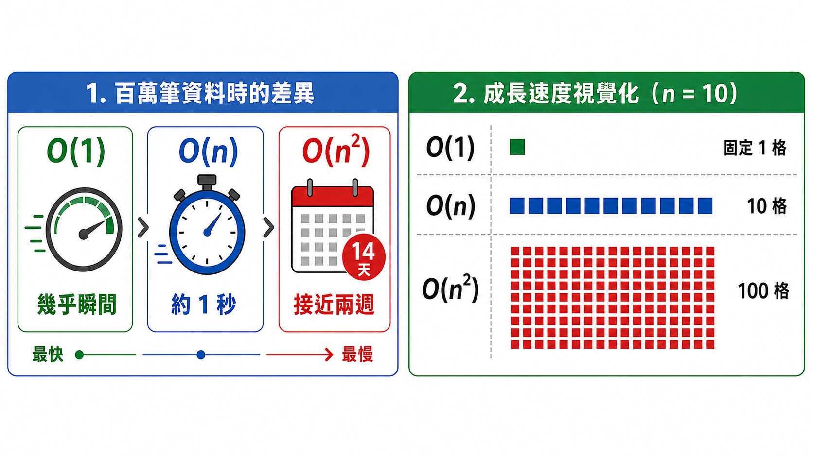

*本圖由 ChatGPT 生成，已由作者審核內容正確性*

---

## 十四、工業情境中的效率思考

### 1. 生產線瓶頸（Bottleneck）類比

演算法效率的概念，與工業工程中源自[限制理論（Theory of Constraints，TOC）](https://zh.wikipedia.org/zh-tw/限制理論)（Goldratt & Cox, 1984）的「**瓶頸（Bottleneck）**」概念高度相似。

在一條生產線上，整體的產出速度受限於最慢的那個工站——即使其他工站的效率再高，整體產出仍然無法超過瓶頸工站的速度。改善非瓶頸工站的效率對整體產出幾乎沒有幫助；唯有改善瓶頸，整體才能提升。

同樣地，在一套複雜的程式系統中，整體效能往往由最低效的那個步驟決定。工程師進行程式效能最佳化時，首要任務是找出程式中的「效能瓶頸」（耗時最長的部分），優先改善它，而非平均地對每個部分進行微小最佳化。

```
生產線效能比喻：

工站A：每分鐘 100 件
工站B：每分鐘  30 件  ← 瓶頸
工站C：每分鐘  80 件

整體產出受限於工站B，每分鐘只能產出 30 件。
提升A到200件/分鐘，整體仍是30件/分鐘。
只有改善B，整體才能提升。

程式效能類比：
步驟1：讀取資料（0.01 秒）
步驟2：資料分析（45 秒）  ← 效能瓶頸
步驟3：輸出報表（0.05 秒）

優先改善步驟2，其餘步驟的最佳化意義不大。
```

### 2. 排程效率 vs 計算效率

工業工程師熟悉的「排程最佳化」，在計算效率上是一個著名的困難問題。

**生產排程** 的本質，是在眾多工單、機台、工人、截止日期的限制下，找出「最佳」的生產安排。當工單數量少時（如10張），電腦可以窮舉所有可能的排列，找到最佳解。但工單數量增加時，可能的排列數量呈[階乘（n!）成長](https://en.wikipedia.org/wiki/Combinatorial_explosion)——比 O(n²) 還要快得多，這種現象稱為「組合爆炸（Combinatorial Explosion）」：

```
10 張工單的排列數：10! = 3,628,800 種
20 張工單的排列數：20! ≈ 2,400,000,000,000,000,000 種（2.4 × 10¹⁸）
```

這就是為什麼實際工廠的排程系統不使用「窮舉所有可能」的方法，而是採用[啟發式演算法（Heuristic Algorithm）](https://zh.wikipedia.org/zh-tw/啟發式演算法)——不保證找到最佳解，但能在合理的時間內找到「夠好的解」。這也是「計算效率」與「排程品質」之間的現實折衷。

> **延伸閱讀**：本節只先說明「窮舉不可行、需要啟發式方法」的效率困境；這類排程最佳化問題如何進一步結合機器學習與資料驅動的方式求解，請見 [06-Data-Science-AI-and-Smart-Manufacturing.md](06-Data-Science-AI-and-Smart-Manufacturing.md)〈二、資料科學與人工智慧〉。

### 3. 資料量增加對決策時間的影響

工業4.0帶來了海量的感測器資料，但「資料多」不等於「決策快」——如果資料分析的演算法效率不佳，資料量增加反而可能讓決策系統變慢，甚至失去即時性。

**實際影響場景**：

- **即時品質判斷**：生產線上的視覺檢測系統，每秒需要判斷數十個零件。若判斷演算法的時間複雜度過高，在高速生產線上將無法跟上生產節拍，導致瓶頸。
- **預測性維護**：若每隔 10 分鐘根據最新感測器資料重新訓練預測模型，但模型訓練需要 30 分鐘，系統就永遠趕不上資料的更新速度。
- **供應鏈最佳化**：當供應商數量、品項數量、工廠數量增加時，最佳化演算法的複雜度可能以超線性的速度增長，必須採用近似演算法或分散式計算。

> **小結**：效率分析不是電腦科學家專屬的學術課題，工業工程師在設計或評估資訊系統時同樣用得上。理解 O(1)、O(n)、O(n²) 的直覺含義，能幫助你在面對「為什麼系統越來越慢」、「增加一倍的機台數量對系統效能有什麼影響」這類問題時，做出更有根據的判斷。

---

## 第四篇：程式設計與工業應用整合

---

## 十五、資料驅動的流程改善

### 1. 用簡單程式分析生產資料

「資料驅動（Data-Driven）」是工業4.0的核心理念之一：決策不再單純依賴經驗與直覺，而是基於客觀的資料分析。即使是簡單的程式邏輯，也能從生產資料中萃取出有價值的洞見。

一個典型的分析流程：

```
原始資料（一個月的每日良率）：
良率記錄 = [0.976, 0.981, 0.968, 0.943, 0.972, 0.985,
            0.961, 0.978, 0.924, 0.969, ...]

分析步驟：
1. 計算月平均良率：平均(良率記錄)  → 0.962
2. 找出低於目標的日期：篩選(良率 < 0.95)  → [第4天:0.943, 第9天:0.924]
3. 計算低於目標的天數佔比：2/30 → 6.7%
4. 找出最低良率日：最小值(良率記錄) → 第9天 0.924
```

這個分析若每天手動進行，需要幾分鐘；若寫成程式，只需不到 1 秒，且可以在每天生產結束後自動執行，讓工程師能在隔天早上就看到昨天的分析結果。

### 2. 找出異常與趨勢

**異常偵測（Anomaly Detection）** 是資料分析中最直接的應用：設定正常範圍，自動標記超出範圍的資料點。

```
製程溫度監控：
上限 = 25.0°C
下限 = 20.0°C
溫度資料 = [22.1, 23.4, 21.8, 26.2, 22.9, 19.8, 23.1]

異常偵測：
對 每一筆溫度資料:
    如果 溫度 > 上限: 記錄「過高異常」，時間戳，溫度值
    如果 溫度 < 下限: 記錄「過低異常」，時間戳，溫度值

結果：
  過高異常：26.2°C（第4筆）
  過低異常：19.8°C（第6筆）
```

**趨勢分析（Trend Analysis）** 則是觀察資料隨時間的變化方向，例如良率是逐漸下滑還是穩定提升，這往往能在問題爆發前提供預警。

---

## 十六、自動化思維

**自動化（Automation）** 是工業4.0三大核心特徵之一：透過軟硬體整合，讓更多原本需要人工執行的步驟，改由程式自動完成（Groover, 2019）。

### 1. 重複性工作自動化

如果你每天早上都要執行同樣的步驟——打開系統、匯出昨天的資料、貼到 Excel、計算幾個數字、填入報表、寄給主管——這正是程式自動化的最佳目標。

**適合自動化的工作特徵**：

- **重複性高**：每天、每週、每批次都要做一遍
- **規則明確**：步驟固定，判斷標準清楚，不需要複雜的人為判斷
- **資料量大**：人工處理費時費力，且容易出錯
- **時效性要求高**：需要在特定時間內完成（如班次結束後立即產出報表）

### 2. 工業應用：報表自動生成與資料整理

**報表自動生成** 是工廠最常見的自動化需求之一：

```
每日生產報表自動化流程：
1. 班次結束（觸發條件）
2. 自動連線 MES 資料庫
3. 查詢今日各機台的產量、良率、稼動率
4. 計算各項 KPI（OEE、達成率、不良率...）
5. 將結果填入標準報表模板
6. 儲存為 PDF 與 Excel 格式
7. 自動寄送給相關人員（班長、工程師、主管）

以往：班長花 30–60 分鐘手動整理
自動化後：程式 5 秒完成，班長可以專注在異常處理
```

**資料整理自動化**：

- 自動將不同機台匯出的 CSV 格式統一化（欄位名稱、日期格式、單位）
- 自動清除明顯的異常值（如感測器離線時回傳的 -999）
- 自動將資料依批次號、日期、機台分類存檔

---

## 十七、工業4.0概念導入

### 1. 資料 → 資訊 → 決策

工業4.0的核心價值鏈，可以用三個層次來描述：

```
感測器原始資料
（溫度: 23.5, 壓力: 101.2, 振動: 0.03...）
         ↓  [資料處理與分析程式]
有意義的資訊
（主軸溫度正常、液壓系統壓力偏低、振動值在正常範圍內）
         ↓  [決策邏輯]
可執行的決策
（發出液壓系統預警，通知技術員於本班次結束前檢查）
```

程式扮演的正是「資料」到「資訊」這個轉化過程的核心角色：透過計算、比較、判斷、統計，將原始的數字轉化為人類能理解且能採取行動的資訊。

### 2. IoT 資料如何進入程式處理流程

在工業物聯網（IIoT）架構中，感測器資料從產生到被程式利用，通常經過以下流程：

```
[感測器]
  ↓ 類比訊號（溫度、壓力、振動...）
[ADC 轉換]
  ↓ 數位訊號
[PLC / 邊緣裝置]
  ↓ 工業通訊協定（Modbus、OPC UA...）
[資料擷取程式]
  ↓ 數值資料（Float、Integer...）
[資料處理程式]
  ├─ 存入資料庫（歷史紀錄）
  ├─ 即時異常偵測（條件判斷）
  └─ 更新監控儀表板（輸出）
```

每個箭頭之間，都有程式在運作——擷取、轉換、驗證、儲存、分析。理解這個流程，有助於你在面對工業資訊系統的設計或問題排查時，能夠定位問題發生在哪個環節。

> **延伸閱讀**：本節只先說明資料從感測器流向程式的整體脈絡；ADC、PLC 等硬體元件請見 [02-Computer-Structure.md](02-Computer-Structure.md)〈七、中央處理器（CPU）與運算架構〉與〈三、資料表示與數位化〉；Modbus、OPC UA 等工業通訊協定的完整介紹，請見 [04-Networks-and-Internet.md](04-Networks-and-Internet.md)〈二十三、智慧製造網路架構（概念性）〉。

### 3. 簡單案例：感測器資料分析流程

以 **設備振動監測** 為例，展示一個完整的端對端資料處理流程：

```
目標：監測主軸振動，預警異常

資料來源：振動感測器，每秒回傳一個加速度值（m/s²）

程式邏輯：

振動閾值 = 0.5  （正常範圍上限）
警告閾值 = 0.8  （預警門檻）
緊急閾值 = 1.2  （緊急停機門檻）
連續異常計數 = 0

無限迴圈（持續監測）:
    振動值 = 讀取感測器()
    記錄至資料庫(時間戳, 振動值)

    如果 振動值 > 緊急閾值:
        執行緊急停機程序()
        發送緊急警報(所有人員)
        break  ← 退出監測迴圈，等待人員處置

    否則如果 振動值 > 警告閾值:
        連續異常計數 += 1
        如果 連續異常計數 >= 5:  ← 連續5秒超過警告值
            發送預警通知(技術員)
            連續異常計數 = 0  ← 重置計數

    否則:
        連續異常計數 = 0  ← 恢復正常，重置計數

    等待 1 秒
```

---

## 十八、系統觀點

### 1. 程式 + 資料結構 + 硬體/系統整合

在真實的工業環境中，程式不是孤立運作的，而是嵌入在一個由硬體、網路、作業系統、其他軟體共同構成的複雜系統中。

一個完整的工業資訊系統，從底層到上層可以分為：

```
應用層：ERP、MES、SCADA、BI 儀表板
   ↑ 程式邏輯（演算法 + 資料結構）
平台層：資料庫、訊息佇列、API 服務
   ↑ 作業系統（資源管理、行程調度）
基礎設施層：伺服器、工業電腦、PLC、感測器
   ↑ 硬體（CPU、記憶體、儲存、網路）
```

每一層都依賴下層提供的服務，也為上層提供基礎。程式設計發生在「應用層」與「平台層」，但其效能直接受到下層硬體的限制——這就是為什麼理解硬體（CPU、記憶體、儲存）對程式效能的影響，對工業工程師同樣重要。

### 2. MES / ERP 背後的資料處理概念

ERP 與 MES 這些大型工業軟體，看起來功能複雜，但其背後的資料處理邏輯，往往可以用本教材介紹的基礎概念來理解：

**ERP 的物料需求規劃（MRP）**：

```
本質：BOM 樹的走訪（樹狀結構）+ 庫存查詢（映射）+ 計算

流程：
  對 每一張生產工單:                 ← 迴圈
    展開 BOM 樹，取得所有子零件      ← 樹的走訪
    對 每一個子零件:                 ← 迴圈
      查詢現有庫存量                 ← 映射查詢 O(1)
      計算需求量 = 需求 - 庫存       ← 算術運算
      如果 需求量 > 0:               ← 條件判斷
        產生採購申請或生產工單
```

**MES 的生產排程**：

```
本質：工單列表（列表）+ 優先序排列（排序）+ 機台分配（映射）

流程：
  工單佇列 = 讀取所有待排程工單     ← 建立佇列
  依優先級排序工單                  ← 排序演算法
  對 每台可用機台:                  ← 迴圈
    取出優先級最高的工單            ← 佇列出隊
    分配工單到機台                  ← 映射更新
    計算預計完工時間                ← 算術運算
```

這些系統雖然龐大，但其核心邏輯都是由迴圈、條件判斷、資料結構操作所構成的。理解這些基礎，有助於你在使用這些系統時，理解其行為背後的邏輯，也有助於你在與 IT 部門溝通需求時，能夠更精確地表達你的想法。

> **銜接提示**：本篇（十五～十八）談的「資料驅動流程改善」「自動化思維」「工業4.0資料流」「ERP/MES 背後的程式邏輯」，會在全課程最後的 [06-Data-Science-AI-and-Smart-Manufacturing.md](06-Data-Science-AI-and-Smart-Manufacturing.md)〈五、工業4.0與智慧製造：把整條技術鏈放進工廠〉中，與硬體、資訊系統、資料科學的內容一起，整合成一個完整的智慧工廠案例，屆時可以回頭對照這裡學過的概念。

---

## 第五篇：實作與應用建議

---

## 十九、基礎練習

### 1. 資料計算

以下是幾個適合初學者的基礎計算練習，建議用任何你熟悉的工具（Excel 公式、Python、或甚至純粹的邏輯描述）來實作：

**練習1：良率計算**

```
輸入：今日各機台的總產量與不良品數
處理：計算每台機台的良率、全廠平均良率
輸出：各機台良率列表，標示低於目標（95%）的機台
```

**練習2：感測器統計**

```
輸入：一天內每小時的溫度記錄（24筆）
處理：計算最高溫、最低溫、平均溫、超出正常範圍的次數
輸出：統計報告，包含是否有異常的判斷
```

**練習3：庫存警示**

```
輸入：各品項的現有庫存量與安全庫存量
處理：比較現有庫存與安全庫存，找出需要補貨的品項
輸出：需要補貨的品項清單，依缺口大小排序
```

### 2. 條件判斷（品質分類）

**練習：尺寸分類系統**

```
規格：長度目標值 50.0 mm，公差 ±0.1 mm
  → 合格範圍：49.9 mm ~ 50.1 mm
  → 過小：< 49.9 mm
  → 過大：> 50.1 mm

量測值清單 = [50.05, 49.85, 50.12, 50.01, 49.92, 50.15, 49.99]

對 每一個量測值:
    如果 49.9 <= 量測值 <= 50.1:
        分類 = "合格"
    否則如果 量測值 < 49.9:
        分類 = "過小，報廢/重工"
    否則:
        分類 = "過大，報廢/重工"
    記錄(量測值, 分類)

計算：合格率、各類別數量
```

---

## 二十、小型應用案例

### 1. 簡單庫存管理模擬

設計一個簡單的庫存管理邏輯，支援以下操作：

```
庫存資料（映射）：
{
  "MAT-001": {"名稱": "螺栓M5", "庫存": 500, "安全庫存": 100},
  "MAT-002": {"名稱": "軸承6205", "庫存": 45, "安全庫存": 50},
  "MAT-003": {"名稱": "密封圈", "庫存": 230, "安全庫存": 80}
}

操作1：入庫
  輸入：料號、數量
  處理：庫存[料號] += 數量
  輸出：更新後庫存量

操作2：出庫
  輸入：料號、數量
  處理：如果庫存充足，庫存[料號] -= 數量；否則回報庫存不足
  輸出：成功或庫存不足警告

操作3：庫存盤點報告
  處理：走訪所有品項，找出庫存低於安全庫存的品項
  輸出：需補貨清單，包含料號、名稱、現有庫存、安全庫存、缺口
```

### 2. 生產排程（簡化版 Queue 模型）

```
情境：一台機台，多張工單等候加工，以 FIFO 原則排程

工單佇列（Queue）：
初始：[WO-001(急), WO-002(一般), WO-003(一般), WO-004(急)]

排程流程：
1. 將工單依優先級（急件優先）與下達時間排入佇列
2. 機台完成一張工單後，自動從佇列頭部取出下一張
3. 若有新工單插入，根據優先級插入佇列適當位置
4. 顯示預估每張工單的開始與完成時間

輸出範例：
WO-001：09:00 開始，10:30 完成（加工時間 90分鐘）
WO-004：10:30 開始，11:30 完成（加工時間 60分鐘）← 急件插隊
WO-002：11:30 開始，12:30 完成
WO-003：12:30 開始，14:00 完成
```

### 3. 生產資料統計報表

```
輸入：一週（5天）各班次（3班）的生產記錄
  格式：日期、班次、機台、產量、不良數、停機時間（分鐘）

處理：
1. 計算每天各班次的良率
2. 計算每台機台的週累計產量
3. 計算各機台的稼動率（實際運作時間 / 計畫運作時間）
4. 找出本週最佳班次（良率最高）與最差班次
5. 列出停機時間超過 30 分鐘的事件

輸出：結構化報表，包含各項 KPI 匯總與異常清單
```

---

## 二十一、視覺化與呈現（選擇性）

### 1. 基本圖表概念

資料分析的最後一步，往往是將結果視覺化——轉換為圖表，讓人更容易看出趨勢、比較差異、發現異常。不同類型的資料適合不同類型的圖表：

| 圖表類型 | 適合呈現 | 工業應用範例 |
| --- | --- | --- |
| **折線圖（Line Chart）** | 隨時間變化的趨勢 | 每日良率趨勢、每月產量走勢 |
| **柱狀圖（Bar Chart）** | 不同類別的比較 | 各機台產量比較、各班次良率比較 |
| **柏拉圖（Pareto Chart）** | 頻率由高到低的排名（兼顯累計比例） | 不良原因分析（80/20 法則） |
| **散布圖（Scatter Plot）** | 兩個變數的相關性 | 製程溫度與良率的關係 |
| **管制圖（Control Chart）** | 製程資料與管制界限 | SPC 品質管制 |
| **圓餅圖（Pie Chart）** | 各部分佔整體的比例 | 不良類型佔比（謹慎使用） |

### 2. 工業應用：產量趨勢圖

一張良好的產量趨勢圖應該包含：

- **X 軸**：時間（日期、週次、月份）
- **Y 軸**：產量或良率數值
- **目標線**：清楚標示目標值（如良率目標 95%）
- **異常標記**：明顯標示低於目標的時間點
- **趨勢線**：顯示整體走向（上升、下降或持平）

這樣的圖表讓管理者在幾秒鐘內就能掌握本月生產狀況，遠比閱讀一張充滿數字的 Excel 表格更有效率。

> **工具建議**：對於初學者，Excel 的圖表功能已經足以製作上述大多數圖表。若希望更進一步，Python 的 matplotlib 和 seaborn 套件，或商業 BI 工具（如 Power BI、Tableau）能製作更靈活、更互動的視覺化報表。

---

## 二十二、學習重點總結

讀完本章後，你應該能夠理解以下核心概念，並將其應用於工業場域的思考與決策：

**運算思維與問題拆解**

能夠面對一個複雜的工業問題（如「如何讓報表自動化」、「如何找出生產異常的原因」），運用問題分解、模式辨識、抽象化、演算法思考，將其轉化為可執行的解決步驟。

**基本程式邏輯理解**

能夠閱讀並理解基本程式邏輯（變數、條件判斷、迴圈、函式），即使不限定特定語言，也能表達清楚的程式設計思路。在與 IT 人員溝通系統需求時，能夠精確描述「程式應該如何判斷」、「資料應該如何流動」。

**資料結構的直覺理解**

理解列表、堆疊、佇列、映射、樹等常見資料結構各自的特性與適用情境，在面對不同的工業資料管理問題時，能夠選擇合適的組織方式。

**效率概念的應用**

能夠用直覺理解 O(1)、O(n)、O(n²) 的差異，在評估工業資訊系統的效能問題時，理解「資料量增加對系統速度的影響」，並以此作為系統設計或採購評估的依據之一。

**程式設計與工業流程的連結**

能夠將程式設計的基本概念（輸入→處理→輸出、函式與模組化、資料結構選擇）與工廠的實際流程（生產記錄、品質管制、排程、庫存管理）連結，理解 MES、ERP 等系統背後的資料處理邏輯，並能提出合理的自動化改善方向。

---

> **給同學的話**：本教材刻意避免語法細節與複雜的數學推導，重點在於建立「**可應用於工業場域的計算思維**」。程式語言的語法可以查手冊，但思考問題的方式、選擇合適資料結構的直覺、判斷系統效能瓶頸的能力，才是真正有價值、長期有效的核心素養。建議搭配實際動手練習（哪怕只是用 Excel 或線上程式編輯器），理解才能真正落地。

---

## 參考文獻

- Abelson, H., & Sussman, G. J. (1996). *Structure and interpretation of computer programs* (2nd ed.). MIT Press.
- Aho, A. V., Lam, M. S., Sethi, R., & Ullman, J. D. (2006). *Compilers: Principles, techniques, and tools* (2nd ed.). Addison-Wesley.
- Böhm, C., & Jacopini, G. (1966). Flow diagrams, Turing machines and languages with only two formation rules. *Communications of the ACM, 9*(5), 366–371. https://doi.org/10.1145/355592.365646
- Brooks, F. P. (1995). *The mythical man-month: Essays on software engineering* (Anniversary ed.). Addison-Wesley.
- Cormen, T. H., Leiserson, C. E., Rivest, R. L., & Stein, C. (2022). *Introduction to algorithms* (4th ed.). MIT Press.
- Dijkstra, E. W. (1968). Go to statement considered harmful. *Communications of the ACM, 11*(3), 147–148. https://doi.org/10.1145/362929.362947
- Gamma, E., Helm, R., Johnson, R., & Vlissides, J. (1994). *Design patterns: Elements of reusable object-oriented software*. Addison-Wesley.
- Goldratt, E. M., & Cox, J. (1984). *The goal: A process of ongoing improvement*. North River Press.
- Goodrich, M. T., Tamassia, R., & Goldwasser, M. H. (2013). *Data structures and algorithms in Python*. Wiley.
- Groover, M. P. (2019). *Automation, production systems, and computer-integrated manufacturing* (5th ed.). Pearson.
- Hoare, C. A. R. (1962). Quicksort. *The Computer Journal, 5*(1), 10–16. https://doi.org/10.1093/comjnl/5.1.10
- Hopcroft, J. E., Motwani, R., & Ullman, J. D. (2006). *Introduction to automata theory, languages, and computation* (3rd ed.). Pearson.
- Kernighan, B. W., & Ritchie, D. M. (1988). *The C programming language* (2nd ed.). Prentice Hall.
- Knuth, D. E. (1997). *The art of computer programming: Fundamental algorithms* (3rd ed., Vol. 1). Addison-Wesley.
- Knuth, D. E. (1998). *The art of computer programming: Sorting and searching* (2nd ed., Vol. 3). Addison-Wesley.
- Lutz, M. (2013). *Learning Python* (5th ed.). O'Reilly Media.
- Martin, R. C. (2008). *Clean code: A handbook of agile software craftsmanship*. Prentice Hall.
- McConnell, S. (2004). *Code complete: A practical handbook of software construction* (2nd ed.). Microsoft Press.
- Sedgewick, R., & Wayne, K. (2011). *Algorithms* (4th ed.). Addison-Wesley.
- Sipser, M. (2013). *Introduction to the theory of computation* (3rd ed.). Cengage Learning.
- Skiena, S. S. (2020). *The algorithm design manual* (3rd ed.). Springer.
- Wing, J. M. (2006). Computational thinking. *Communications of the ACM, 49*(3), 33–35. https://doi.org/10.1145/1118178.1118215
- Wirth, N. (1976). *Algorithms + data structures = programs*. Prentice Hall.

---

*本教材為大一程式設計概論課程用途，著重概念理解與工業應用情境，建議搭配實際案例討論與程式練習，以加深理解與應用能力。*