# 程式設計概念

把解決問題的邏輯，寫成電腦能懂、能重複執行的步驟

課程教材：[GitHub](https://github.com/billy1125/Introduction-of-Information-Technology)

---

## 前言：從排班表談起

想像你是工廠的生產排程員，要為下週安排工作：3 條產線、每天 3 班、45 名操作員、部分人只能操作特定機台、每班至少 3 名合格人員、還有人請假。

如果沒有電腦：手工排班要花數小時且容易出錯，紙筆紀錄難以管理保存，邏輯也很難傳給下一個新手。

---

## 不懂程式設計，你可能會……

- 排班、記錄、計算全靠手工，耗時又容易出錯
- 大量資料只能用紙本管理，不易保存、難以備份
- 不知道如何把解決問題的邏輯講清楚，難以傳承給他人
- 與 IT／AI 工程師溝通需求時，說不清楚「程式該怎麼判斷」
- 面對「資料量變大系統變慢」的問題，不知道問題出在哪裡

---

## 懂程式設計，你可以……

- 用 **程式語言** 把排班邏輯寫成程式，幾秒鐘產生符合條件的排班表
- 用良好的 **資料結構** 有效率地儲存與存取大量資料
- 用有效率的 **演算法** 計算複雜邏輯，甚至讓 AI 模型自動最佳化
- 與 IT、AI 工程師有效溝通，具備自動化工具的基本應用能力

> **把人類解決問題的邏輯，以電腦能理解的方式寫下來，讓電腦幫你重複執行、高效儲存、快速計算**

---

## 工業場景問題 對應 程式設計概念

| 工業場景中的問題 | 對應的程式設計概念 |
|---|---|
| 記錄每台機器每日產量 | 變數與資料型態 |
| 依序執行品管檢查步驟 | 流程控制（循序、條件、迴圈） |
| 管理數百筆訂單資料 | 資料結構（串列、字典） |
| 計算最短搬運路徑 | 演算法（搜尋、最佳化） |
| 自動產生生產報表 | 函式與模組化設計 |

---

## 課程主線定位

- 整門課只在講一件事：把 **資料** 有效處理成 **資訊**，再變成能支援決策的 **知識**
- 本章負責的是：把處理資料的邏輯交給電腦——程式語言描述步驟，資料結構決定怎麼擺，演算法決定怎麼算得快
- 讀的時候問自己：這項技術為什麼出現？解決了什麼問題？解決之後又帶出什麼新問題？

> **資料 → 資訊 → 知識，是整門課唯一的主軸。**

---

# 第一篇：程式設計基礎

---

# 一、為什麼要寫程式

本章的目的不是把你訓練成程式設計師，而是幫助你理解「程式是如何思考問題的」。

讀懂基本程式邏輯，讓你在面對數位化工作環境時，能與 IT、AI 工程師有效溝通。

---

## 為什麼要寫程式

- 電腦只會照指令執行：**程式（Program）** 就是寫給電腦看的一連串指令
- 現成軟體只能做設計者事先想到的事，工廠專屬的規則得自己寫成程式
- 重複的工作最划算：20 台機台每天手算良率半小時，一年 250 個工作天就是 125 小時
- 不一定要親手寫，但要講得清楚「要電腦做什麼」，也要看得懂結果對不對

> **Excel 能算平均，但不知道「連續 3 批良率低於 95% 就要通知班長」**

---

## 程式設計師怎麼寫程式

- **理解需求**：這程式給誰用？使用者輸入什麼？要輸出什麼？有哪些限制
- **設計做法**：把大問題拆成小步驟，先畫流程圖或寫步驟說明
- **實際寫程式**：先寫一小部分，確認能跑，再逐步加功能
- **測試與除錯**：看錯誤訊息、印出中間結果，逐步找出問題所在
- **整理與改進**：讓程式好讀、好維護

> **真實世界：寫程式、想程式、除錯大概只占 20% 到 30% 的時間，其餘都在溝通需求與協調看法。**

---

<!-- ## 程式設計師的工作流程 -->

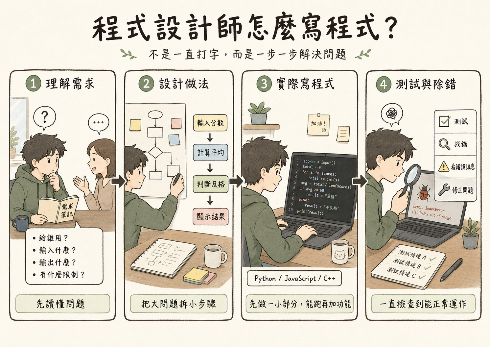

---

# 二、程式設計基本概念

系上的「程式設計」課程會把這一節的概念講得更清楚，這裡建立最基本的概念。

本章介紹程式的本質、變數與資料型態、基本運算——所有程式邏輯的起點。

---

## 程式的本質

一個程式，無論多複雜，其本質都可以用三個字描述：**輸入 → 處理 → 輸出**

- **輸入**：鍵盤、檔案、感測器訊號、資料庫查詢……
- **處理**：計算、判斷、轉換等操作
- **輸出**：螢幕顯示、檔案寫入、發送指令給機台……

---

<!-- ## 程式的本質 -->

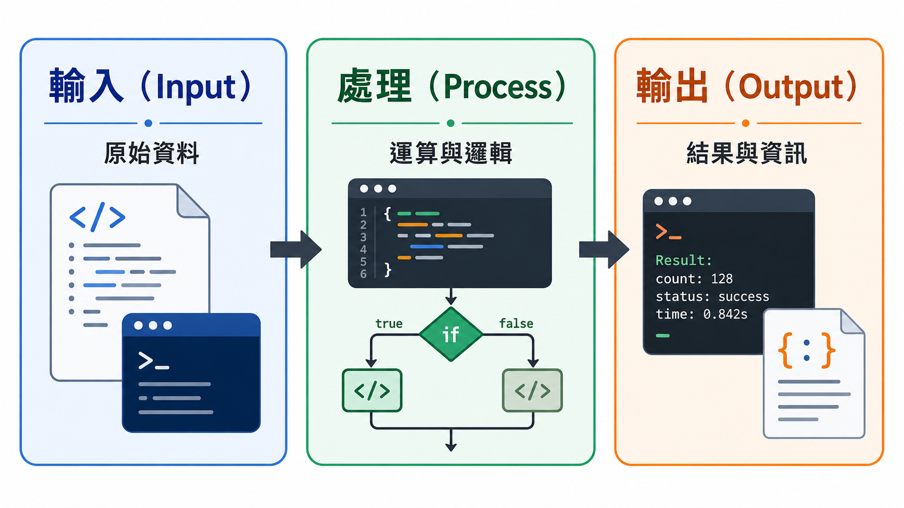

---

## 工業應用：良率計算程式

用 **偽代碼（Pseudocode）** 寫——接近白話、不管語法規定，重點是把流程講清楚

```
程式：計算今日良率

【輸入】
  取得 生產總數 ← 500 件
  取得 不良品數 ← 12 件

【處理】
  良品數 ← 生產總數 - 不良品數      # 488
  良率   ← 良品數 ÷ 生產總數 × 100  # 97.6

【輸出】
  顯示「今日良率：97.6 %」
```

---

## 三段各管一件事

- **輸入** 只負責把資料拿進來
- **處理** 只負責計算
- **輸出** 只負責把結果交出去

> **換成一萬行的程式，外層骨架還是這三段**

---

## 變數與資料型態

**變數（Variable）** 是程式中用來儲存資料的「容器」，有名稱和值——就像倉庫中貼了標籤的儲位

| 資料型態 | 說明 | 工業範例 |
|---|---|---|
| **整數（Integer）** | 沒有小數的數字 | 產品數量、批次編號 |
| **浮點數（Float）** | 帶有小數的數字 | 溫度 23.5°C、良率 0.976 |
| **字串（String）** | 文字資料 | 產品名稱、操作員姓名 |
| **布林（Boolean）** | 真（True）或假（False） | 機台是否運作中 |

---

## 為什麼資料型態重要？

不同性質的資料，轉成二進位的方式不同——同樣是「50」，存成不同型態，位元完全不同

| 資料 | 資料型態 | 轉成二進位的方式 | 二進位表示（示意） |
|---|---|---|---|
| 50 | 整數 | 直接換算（8 位元） | `00110010` |
| 50.0 | 浮點數 | IEEE 754 單精度 | `0 10000100 1001000…0` |
| 「50」 | 字串 | 逐字查 ASCII | `00110101 00110000` |
| True | 布林 | 兩種狀態對應 1 與 0 | `1` |

> **看不懂這些位元怎麼來的？請複習上一章的二進位轉換與資料數位化**

---

## 資料型態決定解讀方式與運算

- **解讀方式**：同一串位元用不同方式解讀，會得到不同的資料，程式必須記住每筆資料的型態
- **整數（Integer）**：加減交給 CPU 的加法電路，速度快且結果精確
- **浮點數（Float）**：依 IEEE 754 運算，範圍大，但結果是近似值
- **字串（String）**：提供串接、搜尋、切割等文字專用操作

> **各種程式語言都會針對不同的資料型態分別最佳化**

---

## 資料型態錯誤：50 + 30 = 5030？

資料型態錯誤是程式常見的錯誤來源，而且在螢幕上看不出來

- 若將產品數量儲存為字串「50」而非整數 50
- 計算「50 + 30」時可能得到字串「5030」而非數字 80
- 在工業系統中，這類型別錯誤可能導致產量統計錯誤，造成錯誤的生產決策

---

<!-- ## 資料型態 -->

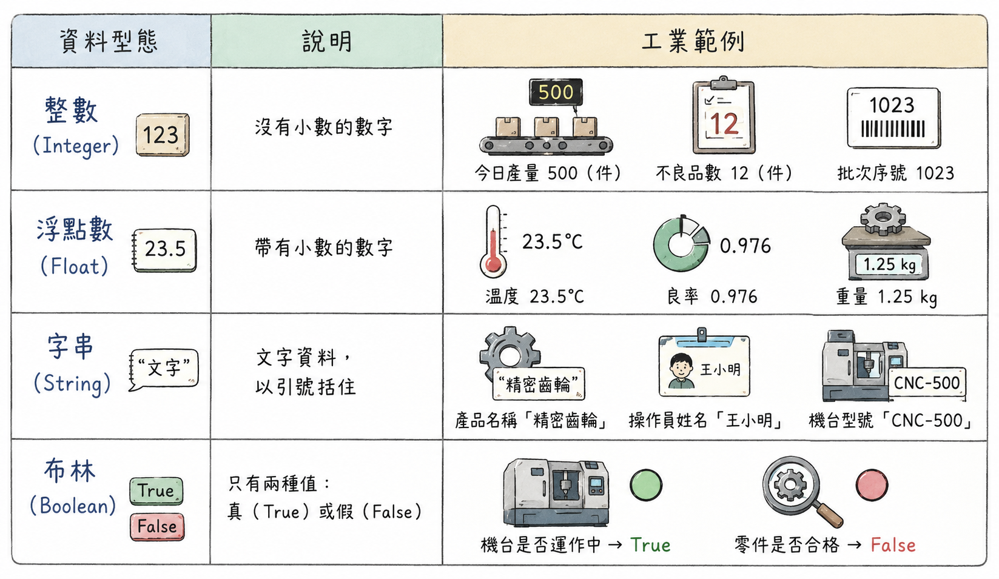

---

## 趣味小知識：臭蟲的由來

- 「臭蟲（Bug）」「除錯（Debug）」據說源自 1947 年
- 葛麗絲·霍普的團隊排查哈佛 Mark II 故障時，真的在繼電器發現一隻被夾死的飛蛾
- 貼在維修日誌上，寫下「第一個發現真正臭蟲的案例」
- 霍普也是最早的程式設計師之一，開發出世界第一個編譯器，並主導設計 COBOL

---

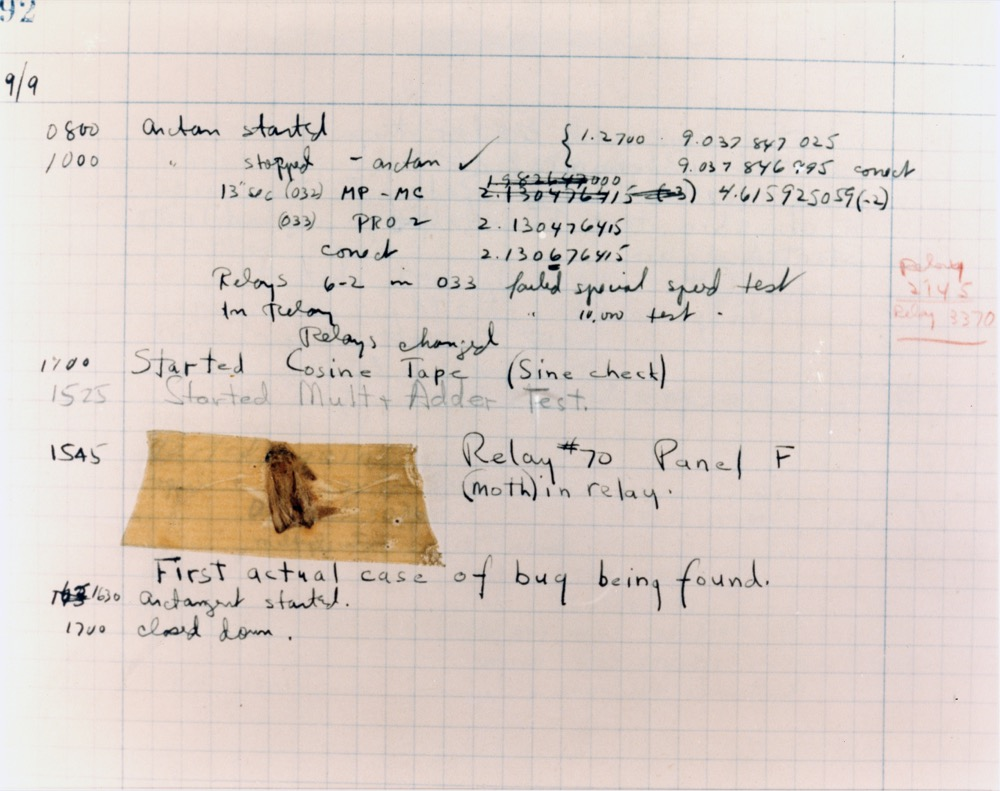

---

## 基本運算：算術與邏輯

**算術運算**：`+` `-` `*` `/` `%`（取餘數）

**邏輯運算**（結果為 True 或 False）：

| 運算 | 說明 | 工業範例 |
|---|---|---|
| `AND`（且） | 兩條件都真才為真 | 溫度正常 AND 壓力正常 → 製程正常 |
| `OR`（或） | 任一為真即為真 | 溫度異常 OR 壓力異常 → 觸發警報 |
| `NOT`（非） | 真假反轉 | NOT 合格 → 不合格 |

---

## 工業應用：生產資料計算

以下程式判斷今日良率是否達標，算術運算與邏輯運算同時出現在一支程式裡

```

【輸入】
  取得 生產總數 ← 500 件
  取得 不良品數 ← 12 件
  取得 良率標準 ← 0.95

【處理】
  良品數   ← 生產總數 - 不良品數   # 算術運算 → 488
  良率     ← 良品數 ÷ 生產總數     # 算術運算 → 0.976
  是否達標 ← 良率 ≥ 良率標準       # 邏輯運算 → True

【輸出】
  顯示「今日良率：97.6 %，是否達標：True」
```

---

# 三、控制結構

若程式只能從頭到尾執行一遍，能做的事情非常有限。

控制結構讓程式能根據條件做出不同選擇、或重複執行步驟，具備真正的「邏輯判斷」與「自動化」能力。

---

<!-- ## 控制結構 -->

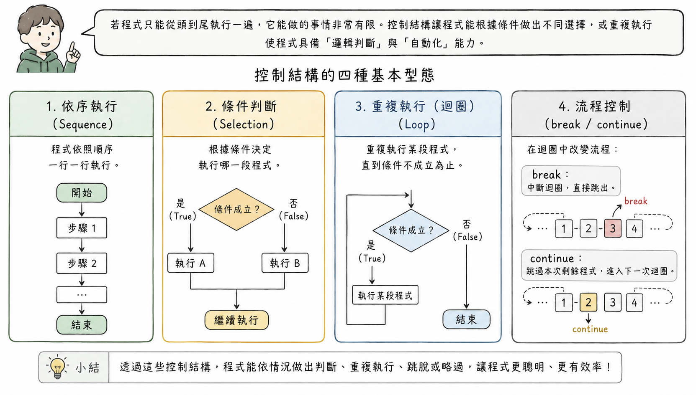

---

## 條件判斷（if-else）

讓程式根據某個條件是否成立，選擇執行不同的程式碼區塊

```
如果 [條件成立]:
    執行 A
否則:
    執行 B
```

---

## 工業應用：良率分級判定

```
程式：今日良率判定

  良率 ← (生產總數 - 不良品數) ÷ 生產總數   # 0.976

  如果 良率 ≥ 0.98：
      判定 ← 「優良」
  否則 如果 良率 ≥ 0.95：
      判定 ← 「合格」
  否則：
      判定 ← 「未達標」
      通知生產線主管
```

> **三個分支只會走其中一條，「未達標」那一段這次完全不會執行**

---

## 迴圈（for、while）

**迴圈（Loop）** 讓程式重複執行一段程式碼，直到某個條件達成——這是電腦「不知疲倦」的關鍵

**for 迴圈**：適合 **已知重複次數** 的情境——三條線就算三次

```
對 生產線清單（A 線、B 線、C 線）中的每一條生產線：
    良率 ← (該線生產總數 - 該線不良品數) ÷ 該線生產總數
    把 該線名稱 與 良率 記進 良率報表
```

---

## 迴圈（for、while）

**while 迴圈**：適合 **重複到某條件成立為止** 的情境——沒人知道這一班會生產幾件

```
當 這一班還沒結束：
    等待下一件產品完成，更新 生產總數 與 不良品數
    良率 ← (生產總數 - 不良品數) ÷ 生產總數
    如果 良率 < 良率標準：看板顯示紅燈
```

---

## 工業應用：批次作業

```
程式：全日批次良率彙總

  總生產數 ← 0
  總不良數 ← 0

  對 批次清單（批次 001 ～ 批次 050）中的每一個批次：
      總生產數 ← 總生產數 + 該批次生產數
      總不良數 ← 總不良數 + 該批次不良數
      批次良率 ← (該批次生產數 - 該批次不良數) ÷ 該批次生產數
      如果 批次良率 < 0.95：把 該批次 記進 待檢討清單

  全日良率 ← (總生產數 - 總不良數) ÷ 總生產數
```

> **在迴圈外歸零、在迴圈裡累加，跑完 50 圈才算得出全日良率**

---

## break 與 continue

- **break（中斷）**：立即結束整個迴圈，常用於找到目標後不需繼續搜尋
- **continue（繼續）**：跳過本次迴圈剩餘步驟，直接進入下一次迴圈

```
對 批次清單 中的每一個批次：
    如果 該批次還沒完成量測：
        continue    # 跳過這一批，直接看下一批
    批次良率 ← (該批次生產數 - 該批次不良數) ÷ 該批次生產數
    如果 批次良率 < 0.80：
        通知停線檢修
        break       # 良率崩掉了，整個迴圈就此結束
    把 批次良率 記進 良率報表
```

---

## 補充小知識：goto 與結構化程式設計

- 早期語言還有更自由但危險的跳轉方式：`goto`
- 1968 年戴克斯特拉發表〈Go To Statement Considered Harmful〉
- 濫用 goto 讓程式邏輯像纏繞的麵條——「義大利麵條式程式碼」
- 這篇文章推動了 **結構化程式設計** 的興起

---

## 如果程式只能一行一行往下執行……

- 每個動作都得明確寫出來，遇到不同情況只能把各種可能直線展開
- 程式很快變得冗長、重複，也不容易閱讀
- 出錯時要在大量重複的程式碼裡找問題，要改就得改很多處
- 判斷式讓程式依條件反應，迴圈重複處理相似工作，`break`／`continue` 讓流程更有彈性

---

## 小結：控制結構

> **條件判斷讓程式「有邏輯」，迴圈讓程式「有效率」**

- 兩種控制結構的組合，是幾乎所有自動化程式的核心骨架
- 在工業場域中，感測器資料篩選到批次報表生成，都能透過這兩種結構自動化

---

<!-- ## 控制結構混合使用 -->

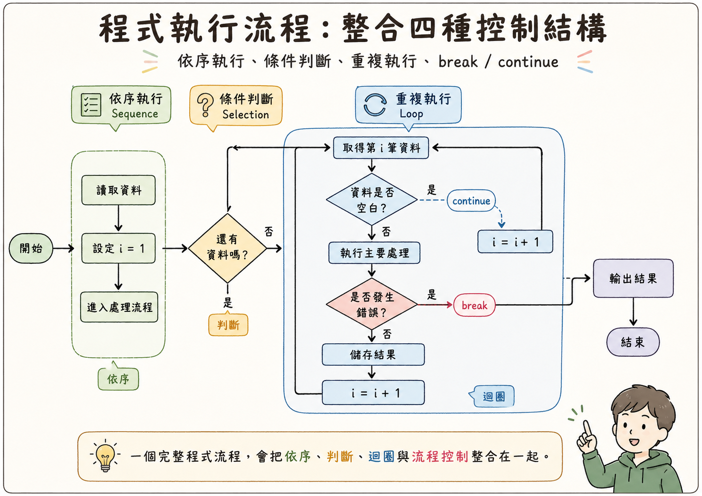

---

# 四、函式與模組化

把常用的邏輯包裝成可重複呼叫的單元，是程式設計中最重要的抽象化實踐之一。

本章介紹函式的概念，以及模組化設計如何讓大型系統保持可讀、可維護。

---

## 函式的概念

**函式（Function）** 是一段被命名、可重複呼叫的程式碼區塊，接受 **輸入（參數）**，執行處理，回傳 **輸出（回傳值）**

用工廠機台比喻：一台「計算良率的機器」，放入「總產量」「不良品數」，自動輸出「良率百分比」

```
函式定義：
    計算良率(總產量, 不良品數):
        回傳 (總產量-不良品數) / 總產量 * 100

函式呼叫：
    A線良率 = 計算良率(500, 12)    → 97.6
    B線良率 = 計算良率(320,  8)    → 97.5
```

---

## 重複使用與模組化設計

**模組化（Modularization）** 將程式切分為多個功能獨立的函式，每個只負責一件事

- **可讀性**：函式名稱就說明了用途
- **可維護性**：修改一處不影響其他部分
- **可重用性**：同一函式可被不同程式重複呼叫
- **可測試性**：每個函式可獨立測試

---

## 為什麼程式需要函式與模組化

- 程式規模變大後，程式碼變長、邏輯分散，每段都對但整體難讀難查
- 相似甚至相同的程式碼重複出現：計算總分、檢查輸入、格式化輸出
- 規則一改，所有重複的地方都得同步改，否則結果不一致
- 函式把重複邏輯集中成一個可呼叫的單位，模組化把相關功能整理在一起
- 這正是前面提到的「把大問題拆成小步驟」，落實在程式裡的做法

> **把程式拆解成一個個子功能，就能像積木一樣組合，不必每次都從頭寫起**

---

<!-- ## 程式模組化概念 -->

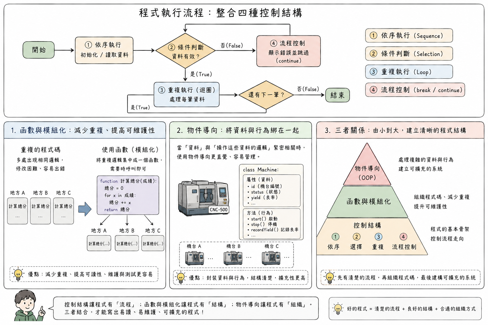

---

## 工業應用：生產日報系統

```
函式：讀取感測器資料(機台編號, 日期)
函式：計算良率(總產量, 不良品數)
函式：判斷是否達標(良率, 目標良率)
函式：寄送警報郵件(收件人, 內容)

主程式：
    對 每台機台:
        資料 = 讀取感測器資料(機台, 今天)
        良率 = 計算良率(資料.產量, 資料.不良數)
        如果 NOT 判斷是否達標(良率, 95%):
            寄送警報郵件(工程師, "良率不達標")
```

---

## 物件導向概念簡介

**物件導向程式設計（Object-Oriented Programming, OOP）** 把資料與操作資料的函式包在一起管理。

```
類別：機台
    屬性：機台編號、狀態、良率
    方法：啟動()、停機()、記錄良率(良率)

物件：A線沖床 = 機台("M01", "運轉中", 97.6)
      B線車床 = 機台("M02", "待機中", 95.2)
```

- **類別（Class）** 是藍圖，**物件（Object）** 是依藍圖產生的實體
- 兩台機台各有自己的屬性值，卻共用同一套方法

---

# 第二篇：資料結構基礎

---

# 五、資料結構的角色

實際工作中，我們往往需要處理一組同類型的資料，而非只有單一數值。

資料結構決定了資料如何被組織、儲存，以及如何被存取。

本章建立整體概念，後續各章逐一介紹列表、堆疊、佇列、映射、樹等常見資料結構。

---

## 為何需要資料結構？

想像一間沒有整理系統的倉庫：所有零件散落各地，每次找零件都要翻遍整個倉庫

**資料結構（Data Structure）** 就是程式中的「倉庫整理系統」

- 同樣是「儲存一批工單」，放進不同資料結構，效率大不相同
- **列表** 可依序處理；**佇列** 確保先到先服務；**映射** 能瞬間查到內容

---

<!-- ## 為何需要資料結構 -->

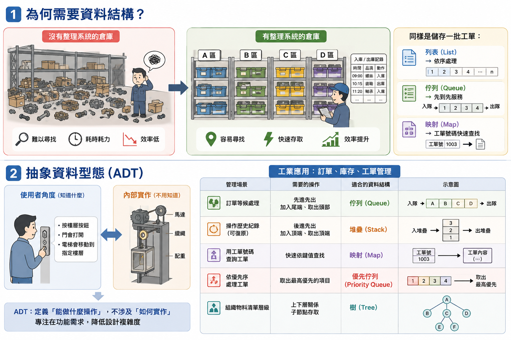

---

## 抽象資料型態（ADT）

**抽象資料型態（ADT）** 從「使用者角度」定義資料結構：它 **能做什麼操作**，而非內部如何實作

- 就像使用電梯：只需知道「按按鈕，電梯移動到指定樓層」
- 不需要知道纜繩、馬達的運作細節
- 讓設計者專注在「我需要什麼功能」，而非「如何在記憶體中排列資料」

---

# 六、陣列與列表（Array / List）

陣列與列表是最基本、最直觀的資料結構。

本章深入說明陣列在記憶體中的儲存方式，以及隨機存取與遍歷兩種核心操作。

---

## 陣列與列表（List）

**陣列（Array）** 或 **列表（List）** 依序儲存多個值，並透過 **索引（Index）** 存取特定位置的值

```
每日產量 = [480, 512, 498, 467, 521]
索引:      [0]   [1]   [2]   [3]   [4]   ← 索引從 0 開始

每日產量[0] → 480（星期一）
每日產量[4] → 521（星期五）
```

> **大多數程式語言的索引從 0 開始，是初學者最常見的混淆點之一**

---

## 順序儲存概念

陣列元素 **依照順序排列在一起**，每個元素有對應的 **索引** 指示其位置

```
記憶體中的陣列示意：
位置:  [100] [101] [102] [103] [104]
內容:   480   512   498   467   521
索引:   [0]   [1]   [2]   [3]   [4]
```

> **元素通常連續排列，知道第一個位置就能直接算出第 n 個在哪裡——依索引存取的速度極快**

---

<!-- ## 記憶體中的陣列 -->

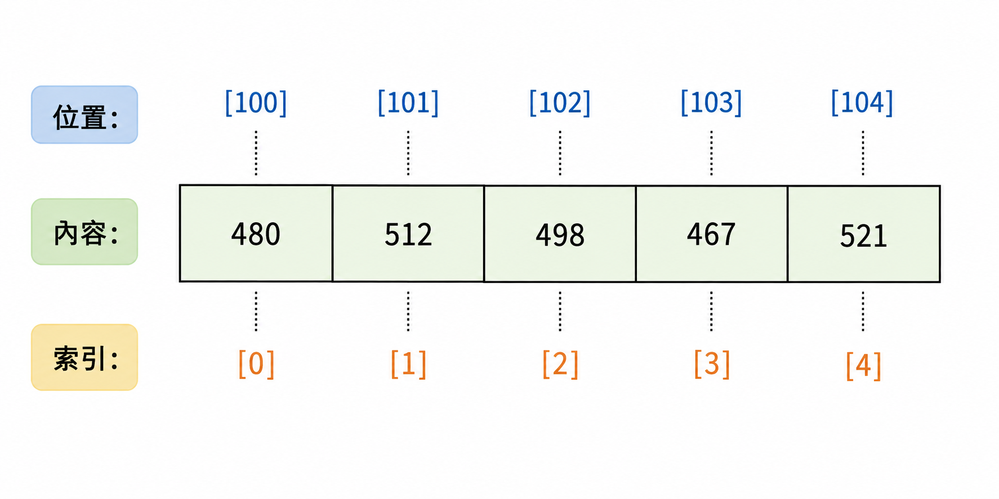

---

## 存取與遍歷

**隨機存取（Random Access）**：直接透過索引取得元素，速度固定不變

```
每日產量[3] → 直接取得第4天的產量 467
```

**遍歷（Traversal）**：從頭到尾依序訪問每個元素，通常搭配迴圈

```
對 索引 從 0 到 4:
    印出 "第" + (索引+1) + "天產量：" + 每日產量[索引]
```

---

## 用迴圈處理整週資料

```
每日產量 = [480, 512, 498, 467, 521]
總產量   = 0

對 每日產量 中的每一個值:
    總產量 = 總產量 + 該值

平均產量 = 總產量 / 5    → 495.6
```

**工業應用**：`感測器讀值`、`工單清單`、`不良原因` 等列表在工業資訊系統中無所不在

---

<!-- ## 存取與走訪 -->

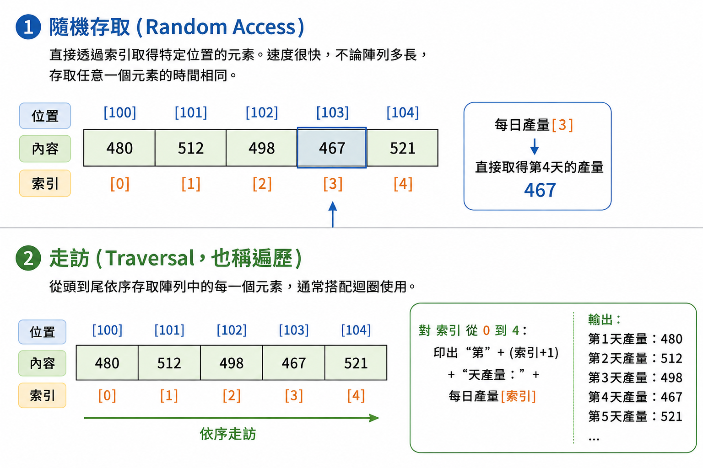

---

## 工業應用：生產紀錄與感測器資料

```
月產量紀錄 = [480, 512, 498, 467, 521, ...]  ← 共30個值

月總量   = 加總(月產量紀錄)
月平均   = 月總量 / 30
最高產日 = 找最大值的索引(月產量紀錄) + 1
```

**感測器時序資料**：每 10 秒記錄溫度，一天 8,640 筆資料，可用迴圈掃描異常時段

---

# 七、基本資料處理

有了列表，就能把一整批資料交給程式處理。

本章介紹從讀取到輸出的完整資料處理流程，處理的對象就是上一章的列表。

---

## 簡單資料讀取與整理：五步驟

1. **讀取資料**：從檔案、資料庫或感測器取得原始數據
2. **篩選（Filtering）**：只取出符合條件的資料
3. **排序（Sorting）**：依特定順序排列
4. **彙整（Aggregation）**：計算總計、平均、最大最小值
5. **輸出（Output）**：寫入報表、存回資料庫、顯示於監控畫面

---

## 工業應用：感測器資料處理

```
原始資料：溫度紀錄 = [23.1, 24.5, 23.8, 26.2, 23.4, 25.9, 27.1, 23.0]

篩選異常（溫度 > 25.0）：
異常紀錄 = [26.2, 25.9, 27.1]

彙整：
最高溫度 = 27.1　平均溫度 = 24.6　異常次數 = 3
```

---

# 八、其他常見資料結構（延伸介紹）

列表把資料一個接一個排好，但現實中的資料不是每一種都適合這樣擺。

本章快速看過堆疊、佇列、集合、映射與樹：它們各自規定資料怎麼進出，以及在工廠裡對應什麼場景。

這一小節屬於延伸介紹，原則上不會考，目的是讓你知道列表之外還有哪些資料結構、各自用在什麼場景。

---

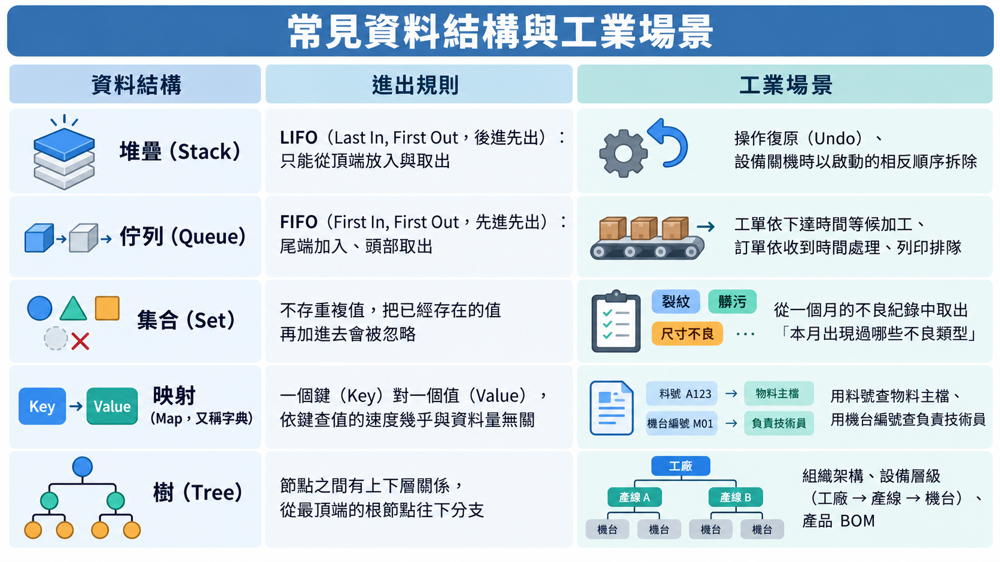

---

# 第三篇：演算法基礎與效率概念

---

# 九、演算法基本概念

演算法是解決特定問題的一系列明確、有限、有序的步驟。

本章深入演算法的特性，並釐清演算法與程式之間「概念」與「實作」的關係。

---

## 演算法的定義與特性

一個好的演算法必須具備：

- **明確性（Definiteness）**：每步驟清楚無歧義
- **有限性（Finiteness）**：有限步驟後終止
- **輸入（Input）**：零個或多個明確定義的輸入
- **輸出（Output）**：一個或多個明確定義的輸出
- **有效性（Effectiveness）**：每步驟都可實際執行

---

## 演算法與程式的關係

演算法是 **概念層面的解題步驟**，程式則是演算法的 **具體實作**

```
問題：在一個列表中，找出最大值

演算法（語言無關）：
  1. 將「目前最大值」設為列表第一個元素
  2. 逐一與「目前最大值」比較，較大則更新
  3. 重複直到所有元素比較完畢
  4. 回傳「目前最大值」
```

---

## 工業應用：SOP 的演算法本質

| 演算法特性 | SOP 對應 |
|---|---|
| 明確性 | 每個操作步驟清楚描述 |
| 有限性 | 作業有明確開始與結束 |
| 輸入 | 原料、半成品、設備參數 |
| 輸出 | 成品、品質量測結果 |

> **將 SOP 轉化為電腦可執行的演算法，正是「流程數位化與自動化」的核心工作**

---

# 十、基本演算法範例

搜尋與排序，是程式中最頻繁使用的兩類演算法。

本章以線性搜尋、泡沫排序為例，建立對演算法效率的直覺理解。

這兩個只是最簡單的例子。實際上演算法的種類非常多，其餘的留給系上的「演算法」相關課程。

---

## 搜尋：線性搜尋（Linear Search）

從頭到尾逐一檢查每個元素，直到找到目標或確認不存在

```
目標：找出機台 "M-003" 的位置
機台清單 = ["M-001", "M-002", "M-003", "M-004", "M-005"]

步驟1：檢查 "M-001"，不是目標，繼續
步驟2：檢查 "M-002"，不是目標，繼續
步驟3：檢查 "M-003"，找到！→ 回傳索引 2
```

> **優點是邏輯簡單、不需事先排序；缺點是資料量大時效率較低**

---

<!-- ## 線性搜尋 -->

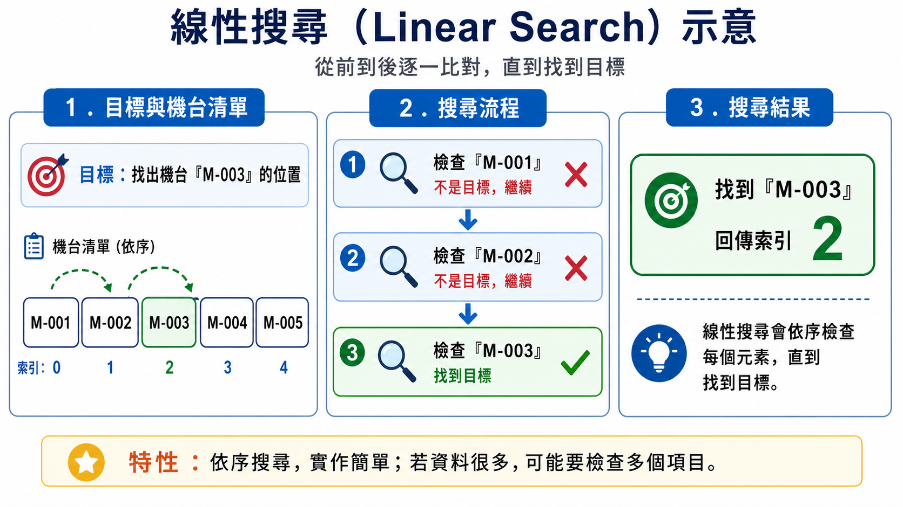

---

## 排序：泡沫排序（Bubble Sort）

反覆比較相鄰元素、交換位置，逐漸將資料調整到正確位置

```
初始：[64, 34, 25, 12, 22]
第一輪：[34, 25, 12, 22, 64]  ← 64 沉到最右
第二輪：[25, 12, 22, 34, 64]  ← 34 沉到倒數第二
...
最終：[12, 22, 25, 34, 64]
```

> **重點在流程不在細節：排序是透過反覆比較與交換，逐漸將資料調整到正確位置**

---

<!-- ## 泡沫排序 -->

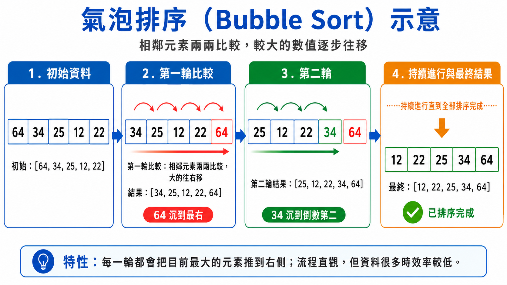

---

## 想一想：用偽代碼寫寫看

如果用前面學過的偽代碼來寫線性搜尋與泡沫排序，你會怎麼寫？

- 先自己在紙上寫一遍，再對照後面兩頁的參考寫法
- 偽代碼沒有標準答案，步驟明確、照著做能得到正確結果就可以

> **這一小節不會考，目的是練習把演算法的步驟寫成程式的樣子**

---

## 參考寫法一：線性搜尋

```
【輸入】
  取得 機台清單 ← [M-001、M-002、M-003、M-004、M-005]
  取得 目標 ← M-003

【處理】
  位置 ← 「找不到」
  對 索引 從 0 到 (清單長度 - 1)：
      如果 機台清單[索引] = 目標：
          位置 ← 索引
          break           # 找到了，後面不必再檢查

【輸出】
  顯示 位置          # 2
```

---

## 參考寫法二：泡沫排序

```
【輸入】
  取得 資料 ← [64, 34, 25, 12, 22]
  n ← 資料的長度          # 5

【處理】
  對 輪次 從 1 到 (n - 1)：
      對 索引 從 0 到 (n - 輪次 - 1)：
          如果 資料[索引] > 資料[索引 + 1]：
              交換 資料[索引] 與 資料[索引 + 1]

【輸出】
  顯示 資料          # [12, 22, 25, 34, 64]
```

---

# 十一、效率與時間複雜度概念

同一個問題可以用不同演算法解決，但效率可能天差地別。

本章建立時間複雜度與大 O 符號的直覺理解，這是評估系統效能的基礎工具。

---

## 為何需要效率分析？

**工業情境**：工廠有 1,000 筆庫存品項，搜尋只要 0.001 秒；增長到 1,000,000 筆，需要 1 秒甚至更長

> **規模增大時，效率的差異會被放大到無法忽視**

---

## 時間複雜度與大 O 符號

- **時間複雜度**：輸入資料量增加時，執行時間如何成長
- **大 O 符號**：描述「最壞情況下的成長趨勢」
- 大 O 符號最早由數論學家提出，真正帶進電腦科學的是唐納·克努斯
- 他的巨著《電腦程式設計的藝術》至今仍是演算法領域經典

---

## O(1)——常數時間

無論 n 多大，執行時間 **固定不變**

```
每日產量[3] → 無論列表有 5 個還是 5,000 個元素，
              存取第 4 個元素的時間完全相同
```

**工廠類比**：倉庫有固定編號儲位，直接走過去拿，不需搜尋

---

## O(n)——線性時間

執行時間 **與 n 成正比**：資料量變 2 倍，時間也變 2 倍

```
在 100 筆資料中搜尋 → 最多 100 次比較
在 10,000 筆資料中搜尋 → 最多 10,000 次比較
```

**工廠類比**：倉庫沒有分區，只能從頭逐一尋找，零件越多越花時間

---

## O(n²)——平方時間

執行時間 **與 n 的平方成正比**：資料量變 2 倍，時間變 4 倍

```
排序 10 筆資料    → 約 100 次比較
排序 1,000 筆資料 → 約 1,000,000 次比較
```

當 n 不大時勉強可接受，但一旦 n 變大，效能就會急速惡化

---

## 直覺式比較

假設每次基本操作花 1 微秒：

| n（資料量） | O(1) | O(n) | O(n²) |
|---|---|---|---|
| 10 | 1 μs | 10 μs | 100 μs |
| 1,000 | 1 μs | 1 ms | 1 秒 |
| 1,000,000 | 1 μs | 1 秒 | **11.6 天** |

> **百萬筆資料時，O(1) 瞬間完成，O(n) 需要 1 秒，O(n²) 需要將近兩週**

---

<!-- ## 時間複雜度 -->

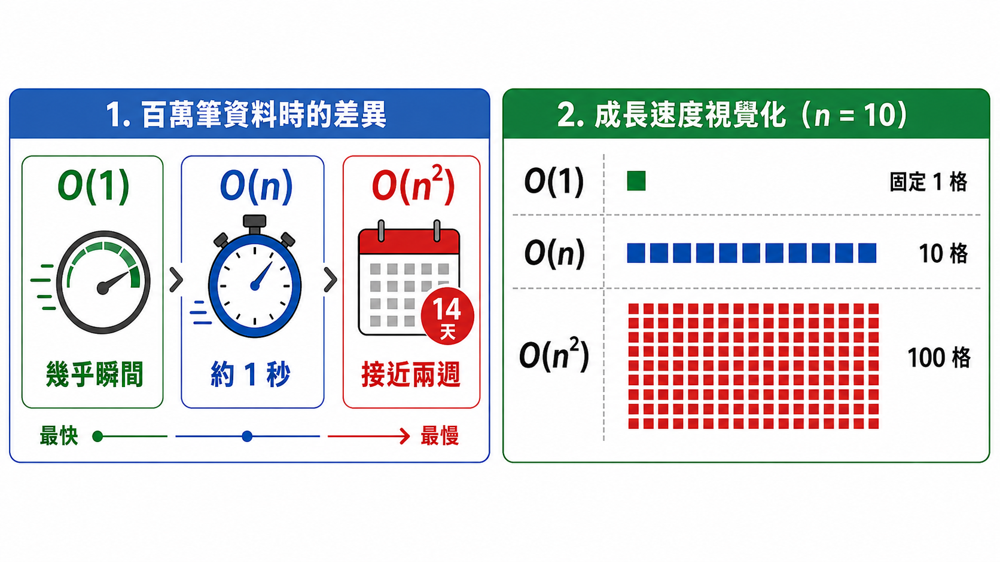

---

## 工業情境中的效率思考

演算法效率的概念，與工業工程的「瓶頸」高度相似。以下把效率分析連結到限制理論、排程最佳化，以及資料量增長對決策速度的影響。

---

## 生產線瓶頸類比

> **整體產出受限於最慢的工站——改善非瓶頸工站幾乎沒有幫助，唯有改善瓶頸，整體才能提升**

```
工站A：100件/分　工站B：30件/分 ← 瓶頸　工站C：80件/分
整體產出受限於工站B，提升A到200件/分，整體仍是30件/分
```

- 程式效能最佳化：優先找出並改善「效能瓶頸」，而非平均微調每個部分

---

## 排程效率 vs 計算效率

生產排程本質：在工單、機台、工人、截止日期限制下找最佳安排

```
10 張工單的排列數：10! = 3,628,800 種
20 張工單的排列數：20! ≈ 2.4 × 10¹⁸ 種
```

> **這種現象稱為「組合爆炸」——實際工廠不窮舉所有可能，而是採用啟發式演算法，找「夠好的解」**

---

## 資料量增加對決策時間的影響

「資料多」不等於「決策快」——演算法效率不佳，資料量增加反而讓系統變慢：

- **即時品質判斷**：視覺檢測若複雜度過高，跟不上生產節拍
- **預測性維護**：模型訓練時間若超過資料更新週期，永遠追不上
- **供應鏈優化**：複雜度超線性增長，須採用近似演算法或分散式計算

---

## 小結：效率分析的價值

> **理解 O(1)、O(n)、O(n²) 的直覺含義，能幫助你判斷「為什麼系統越來越慢」這類問題**

- 效率分析不是純學術課題，工業工程師設計或評估資訊系統時同樣用得上

---

# 第四篇：程式設計與工業應用整合

前面三篇分開講程式設計概念、資料結構、演算法與效率，是為了一次只學一件事。在工廠裡，這三樣永遠綁在一起出現。

---

## 三條線怎麼收攏

| 前三篇學到的 | 在工業應用裡決定什麼 | 本篇的例子 |
|---|---|---|
| 程式設計概念 | 處理流程長什麼樣：怎麼判斷、怎麼重複、怎麼拆分 | 異常偵測的條件判斷、報表自動生成 |
| 資料結構 | 資料怎麼擺：擺對了後面每一步都省力 | 每日良率與溫度紀錄用列表存放 |
| 演算法與效率 | 算不算得完：資料量放大十倍還撐不撐得住 | 逐筆計算平均、篩選、找最小值 |

> **讀這一篇請帶著三個問題：流程怎麼走、資料怎麼擺、算得夠不夠快。**

---

# 十二、資料驅動的流程改善

「資料驅動」是工業4.0的核心理念之一：決策不再單純依賴經驗，而是基於客觀資料分析。

本章示範如何用簡單程式邏輯，從生產資料中找出異常與趨勢。

---

## 用簡單程式分析生產資料

```
良率記錄 = [0.976, 0.981, 0.968, 0.943, 0.972, ...]

分析步驟：
1. 計算月平均良率 → 0.962
2. 找出低於目標的日期 → [第4天:0.943, 第9天:0.924]
3. 計算低於目標天數佔比 → 2/30 = 6.7%
```

> **手動分析需要幾分鐘，寫成程式只需不到 1 秒，且能每天自動執行**

---

## 找出異常與趨勢

**異常偵測（Anomaly Detection）**：設定正常範圍，自動標記超出範圍的資料點

```
上限 = 25.0°C　下限 = 20.0°C
溫度資料 = [22.1, 23.4, 21.8, 26.2, 22.9, 19.8, 23.1]

結果：過高異常 26.2°C（第4筆）　過低異常 19.8°C（第6筆）
```

**趨勢分析**：觀察資料隨時間的變化方向，在問題爆發前提供預警

---

# 十三、自動化思維

自動化是工業4.0三大核心特徵之一：讓更多原本需要人工執行的步驟，改由程式自動完成。

本章說明哪些工作適合自動化，並以生產報表為例展示完整流程。

---

## 適合自動化的工作特徵

- **重複性高**：每天、每週、每批次都要做一遍
- **規則明確**：步驟固定，判斷標準清楚
- **資料量大**：人工處理費時費力，且容易出錯
- **時效性要求高**：需要在特定時間內完成

---

## 工業應用：報表自動生成

```
1. 班次結束（觸發條件）
2. 自動連線 MES 資料庫
3. 查詢今日各機台的產量、良率、稼動率
4. 計算各項 KPI（OEE、達成率、不良率）
5. 儲存為 PDF 與 Excel，自動寄送相關人員
```

> **以往：班長花 30–60 分鐘手動整理；自動化後：程式 5 秒完成**

---

## 銜接提示

本篇（十二～十三）談的資料驅動、自動化，會在全課程最後的智慧工廠案例中，與硬體、資訊系統、資料科學內容整合在一起。

屆時可以回頭對照這裡學過的概念。

---

# 十四、動手實作與資料呈現

讀得懂程式碼，跟寫得出程式碼是兩回事。這一章把概念帶進練習筆記本，並整理資料呈現的基本原則。

---

## 把概念寫成程式

打開 [Computer-Program-Examples.ipynb](notebooks/Computer-Program-Examples.ipynb)，把讀過的東西實際跑一遍：

> **動手做：每個範例先自己猜一次輸出，再按執行鍵對答案——猜錯的地方就是還沒弄懂的地方。**

---

# 十五、學習重點總結

完成本課程後，你應該具備以下五項能力。

---

## 你應該具備的能力（一）

**問題拆解與開發流程**：能先理解需求，再把大問題拆成小步驟，把複雜工業問題轉化為可執行步驟

**基本程式邏輯理解**：能閱讀並理解變數、條件判斷、迴圈、函式，與 IT 人員精確溝通系統需求

---

## 你應該具備的能力（二）

**資料結構的直覺理解**：理解列表、堆疊、佇列、映射、樹的特性與適用情境

**效率概念的應用**：用直覺理解 O(1)、O(n)、O(n²) 的差異，評估系統效能問題

**程式設計與工業流程的連結**：能把程式設計概念與工廠實際流程連結，提出合理的自動化改善方向

---

## 給同學的話

> **程式語言的語法可以查手冊，但思考問題的方式、選擇合適資料結構的直覺、判斷系統效能瓶頸的能力，才是真正有價值、長期有效的核心素養**

- 本教材刻意避免語法細節與複雜數學推導
- 建議搭配實際動手練習，理解才能真正落地
