# 網路與網際網路——工業工程管理導向

## 前言：從連上宿舍 Wi-Fi 談起

各位同學你從出生開始就是網路世代，沒有網路，不只沒辦法玩電玩、和朋友在線上交流，甚至無法線上購物、請假、查詢各種資料。

網路看起來就像是家中水龍頭，一開電腦、手機與平板就有，但每次你在宿舍打開筆電連上校園 Wi-Fi，其實短短幾秒內發生了許多事：

- 你的裝置向無線基地台（AP）發出連線請求，基地台驗證密碼
- 基地台分配一個 IP 位址給你的裝置，讓網路能辨識「你在哪裡」
- 你輸入網址後，DNS 伺服器將網址翻譯成伺服器的 IP 位址
- 資料封包從遠端伺服器，經過多個路由器，逐一傳送到你的裝置並重組顯示

如果不理解網路的運作原理，在工廠環境中你可能遇到：

- 生產線感測器突然無法傳資料到 MES，你分不清楚是斷線、IP 衝突還是防火牆問題
- 規劃新廠房網路時，無法評估「這條線的頻寬夠不夠」，也不知道要問哪些問題
- 看到 IoT 設備規格上的「MQTT」、「Modbus TCP」，完全不知道這代表什麼通訊規範
- 廠商說「建議用工業乙太網路取代現有無線網路」，你無法判斷這個建議是否合理

如果理解網路的運作原理，你可以：

- 理解 **IP 位址**、**子網路**、**路由器** 的基本概念，能協助初步診斷工廠連線問題
- 知道 **封包** 如何從感測器傳到雲端，理解資料流的完整路徑，評估延遲的可能原因
- 理解常見 **工業通訊協定** 的基本用途，能和設備廠商進行有效的技術需求確認
- 在規劃工廠 **物聯網（IoT）** 架構時，能提出有意義的問題，協助設計合理的連線方案

> **這就是理解網路的核心價值**：讓工業工程師能看懂資料如何在工廠中流動，在智慧製造的規劃與問題排查中，說出有意義的話、問出有價值的問題。

| 你的動作 | 對應的網路概念 |
|---------|--------------|
| 選擇 Wi-Fi 並輸入密碼 | 無線接取點（AP）的認證機制 |
| 等待連線圖示出現 | DHCP 協定分配 IP 位址 |
| 打開瀏覽器輸入網址 | DNS 將域名解析為 IP 位址 |
| 網頁開始載入 | TCP/IP 封包路由與傳輸 |
| 影片流暢播放 | 封包重組與串流解碼 |

> 本章的目的是幫助你從使用者走向理解者：理解網路的基本元件與通訊原理、網際網路的運作機制與標準協定，以及這些技術如何支撐現代工廠的物聯網（IoT）、智慧製造與工業4.0應用。

---

## 第一篇：網路（Network）——基礎架構與連線技術

---

## 一、網路基本概念

> **前情提要**：[01-History-of-Computer.md](01-History-of-Computer.md)〈八、網路與網際網路的發展〉已先介紹過 ARPANET、TCP/IP、WWW 的發展歷史，本章在此基礎上深入網路拓樸、硬體設備、通訊協定分層架構等技術細節。

### 1. 什麼是網路？

**網路（[Network](https://zh.wikipedia.org/wiki/電腦網路)）** 是指兩台或兩台以上的裝置，透過某種傳輸媒介（有線或無線）相互連接，以便交換資料、共享資源的系統。網路中的每一個連接裝置，稱為 **節點（Node）**，可以是電腦、印表機、感測器、手機，甚至是生產機台。

最簡單的網路只有兩台電腦直接相連；最複雜的網路則是將全球數十億台裝置互相連結的網際網路。不論規模大小，所有網路的核心目的都相同：**讓裝置之間能夠溝通與共享**。

### 2. 網路的功能

網路的存在帶來了幾項根本性的能力：

- **資料傳輸（Data Transfer）**：將資訊從一個裝置傳遞到另一個裝置，例如感測器將量測值傳送到控制系統
- **資源共享（Resource Sharing）**：多台裝置共用同一台印表機、同一個資料庫或同一套軟體授權，降低成本
- **集中管理（Centralized Management）**：透過網路，管理人員可以從單一位置監控、設定並更新多台遠端裝置
- **協同作業（Collaboration）**：不同地點的人員可以即時存取同一份資料，共同完成工作

> **注意**：以上談的都是單純的電腦網路，也就是由傳輸媒介連接起來的兩台以上裝置。這和大家日常說的「上網」並不一定是同一件事，接下來就來釐清「網路」與「網際網路」的差別。

### 3. 網路 v.s. 網際網路（概念區分）

初學者常將「網路」與「網際網路」混為一談。這兩個概念確實有重疊（網際網路本身也是一種網路，同樣是把裝置連起來交換資料），但兩者並非同一個層次的東西。

差別藏在英文原文裡：Internet 由字首 inter-（之間）加上 network（網路）組成，直譯就是「網路與網路之間」。換句話說，**網際網路不是「一個很大的網路」，而是讓無數個各自獨立的網路能夠互相連通的架構**。你家的無線網路、學校的校園網路、工廠的內部網路，各自是一個獨立的網路，彼此的設備廠牌、線路型式、管理單位都不一樣；網際網路的價值，在於提供一套人人遵守的共通規則（也就是稍後會介紹的 **TCP/IP** 通訊協定），讓這些原本互不相干的網路能夠對話。

| 面向 | 網路（Network） | 網際網路（Internet） |
| --- | --- | --- |
| 定位 | 把裝置連起來的一套系統 | 把眾多網路連起來的共通架構 |
| 範圍 | 單一或局部連線（如一棟建築、一個工廠） | 全球數十億台裝置的互聯系統 |
| 通訊協定 | 可自行選用，各網路不必相同 | 必須共同遵守 TCP/IP，否則無法互通 |
| 所有權 | 通常由單一組織擁有與管理 | 無單一所有者，由各國各組織共同維運 |
| 比喻 | 一棟大樓的內部電話系統 | 讓各棟大樓的電話系統彼此接得通的公共電話網路 |

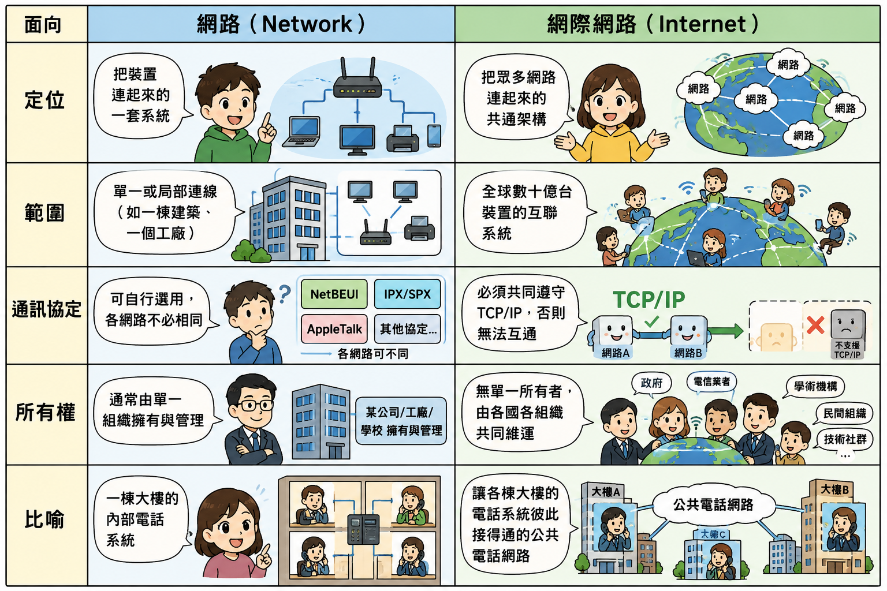

*本圖由 ChatGPT 生成，已由作者審核內容正確性*

> 簡單來說：**你家的電腦、平板、手機連上無線 AP、工廠內的設備彼此相連，這些是「網路」；當你要連到某個網站、和朋友玩連線遊戲，或工廠的系統要把資料送上雲端平台，就得跨出自己的網路，透過「網際網路」和別人的網路接軌**。本篇先深入了解「網路」的基礎，下一篇再討論「網際網路」。

---

## 二、網路拓樸（Topology）

### 1. 什麼是網路拓樸？

**網路拓樸（[Network Topology](https://zh.wikipedia.org/wiki/網路拓撲)）** 是描述網路中各節點如何相互連接的幾何佈局方式。拓樸的選擇，決定了網路的可靠性、擴充性、成本與維護難度。就像工廠的廠房配置影響物料流動效率，網路拓樸影響資料流動的效率與韌性。以下介紹比較常見的星狀、匯流排、環狀、網狀網路拓樸。

先說結論：**實際的工廠不會只用一種拓樸，而是混合搭配**——辦公區與工程師站用星狀連到核心交換器，產線上的感測器可能掛在匯流排或環狀上與 PLC 連接，關鍵控制系統之間則用部分網狀確保高可靠性。所以下面四種拓樸不是四選一的考題，而是四種工具；讀的時候不妨想想：每一種各自付出什麼代價、換到什麼好處，才會被放在工廠的那個位置上。

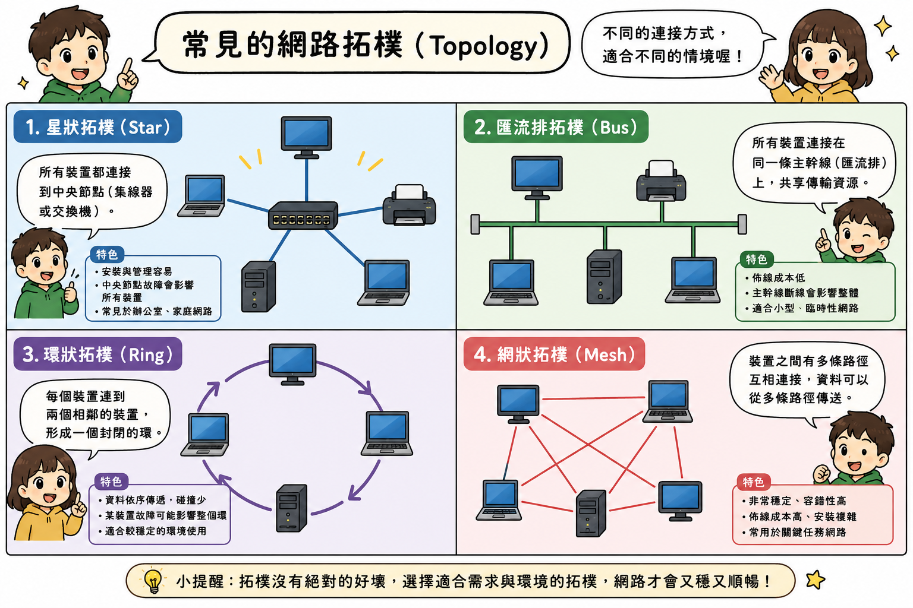

*本圖由 ChatGPT 生成，已由作者審核內容正確性*

### 2. 星狀拓樸（Star Topology）

所有節點都連接到一個中央裝置（通常是 **交換器 Switch**），節點與節點之間不直接相連，所有通訊都經由中央裝置轉發。

- **優點**：任一節點故障不影響其他節點；新增節點容易；故障診斷簡單
- **缺點**：中央交換器是單點故障（SPOF）——若交換器故障，整個網路癱瘓；纜線用量較大

星狀拓樸是 **現代家庭、辦公室與工廠內部網路最常見的選擇**，因為其管理簡便、擴充容易，現在常見的 Wi-Fi 無線網路也是星狀拓樸。

### 3. 匯流排拓樸（Bus Topology）

所有節點共用一條主幹線（[匯流排](https://zh.wikipedia.org/wiki/匯流排網路)），訊號沿著主幹線傳播，每個節點都能接收到，但只有目標節點會處理該訊號。

- **優點**：佈線簡單、成本低
- **缺點**：主幹線斷線即全線癱瘓；節點越多，碰撞與延遲越嚴重

匯流排拓樸在早期以太網路廣泛使用，現今已少見於一般辦公網路，但在某些 **工業現場匯流排（Fieldbus）** 中仍有應用。

> **趣味小故事**：老師1999年在中央大學念書時，宿舍的網路就還是匯流排架構——那時它其實已經快被淘汰了。上面提到的「主幹線斷線即全線癱瘓」，對當年的我們不是課本上的一句話，而是會造成大家困擾的問題：只要有一位同學的網路線鬆脫或網路卡故障，整條走廊的人就一起斷線。所以每當遊戲打到一半突然連不上，整層樓的每個同學都會衝出房間沿路敲門，一間一間追查到底是哪個房間、哪位同學是「兇手」。後來星狀拓樸普及，這種集體抓兇手的場面也就跟著走入歷史了。

### 4. 環狀拓樸（Ring Topology）

每個節點只與前後相鄰的節點連接，形成一個封閉的環形。資料沿著環形依序傳遞，直到到達目的節點。

- **優點**：每個節點機會平等，不容易發生碰撞；可預測的資料傳輸時間（對即時控制有優勢）
- **缺點**：任一節點或連線故障可能中斷整個環；新增節點需要中斷網路

環狀拓樸今日主要用在兩種場合，理由各不相同。

- 工業通訊協定（如 PROFIBUS 的部分應用）：資料繞行一圈的時間可以事先估算，這種可預測的延遲對即時控制特別友善
- 電信業者或大型組織的骨幹網路：這類網路常以光纖串成環狀，並刻意佈設雙向的路徑，如此一來，即使某一段線路被挖斷，流量也能立刻改由環的另一個方向繞行——這正好補上了前面提到「任一節點或連線故障可能中斷整個環」的弱點

### 5. 網狀拓樸（Mesh Topology）

在[網狀拓樸](https://zh.wikipedia.org/wiki/網狀網路)中，每個節點都與多個（甚至全部）其他節點直接相連，資料可以選擇多條路徑到達目的地。

- **完全網狀（Full Mesh）**：每個節點與所有其他節點直接連接，可靠性最高
- **部分網狀（Partial Mesh）**：只有關鍵節點間有多條連接路徑

- **優點**：極高的容錯性——即使多條連線故障，資料仍可繞道傳輸；適合高可靠性需求
- **缺點**：佈線複雜、成本極高，管理困難

網狀拓樸用於 **對可靠性要求極高的關鍵基礎設施**（如電力公司的控制網路、骨幹網路）；工業無線感測網路（WSN）也常採用網狀結構，讓感測器節點互相中繼訊號，擴大覆蓋範圍。

選擇拓樸時，工業工程師需要權衡：設備數量、可靠性要求、佈線成本、維護難度，以及未來擴充的彈性。

---

## 三、網路硬體設備

前一節談的拓樸是網路的「配置圖」，但圖要落實成一座真正能運作的網路，得靠實體設備。網路硬體的種類相當多元，從一張巴掌大的網路卡，到機房裡整櫃的交換器、路由器與防火牆，再到工廠現場負責轉譯不同通訊協定的閘道器，各自扮演不同角色；而且同一類設備還會因為規模與等級的差異，衍生出家用、企業級、工業級等不同版本。

在智慧工廠中，上述各種硬體設備協同運作：NIC 讓每台機器具備連網能力、工業交換器在現場層傳遞 PLC 與感測器資料、工業閘道器轉換協定、路由器連接工廠網路與企業廣域網路、AP 讓移動中的操作員可用平板電腦存取系統。

以下介紹五種最常見、也最基礎的設備：網路卡、交換器、路由器、存取點與閘道。認識它們各自負責什麼，日後不論是看懂機房的機櫃、或是排查工廠產線的連線問題，都會是重要的基礎。

### 1. 網路卡（NIC）

**網路介面卡（Network Interface Card，NIC）** 是讓裝置能夠連接網路的硬體元件，每台需要連網的裝置都必須配備 NIC。NIC 負責將裝置產生的資料，轉換為可在網路媒介上傳輸的電子訊號（有線）或無線電波（無線），並反向將接收到的訊號還原為資料。

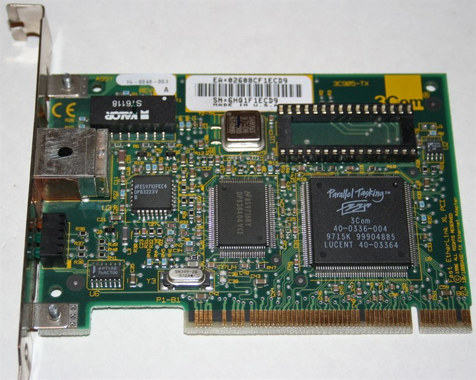

*圖片來源：[Wikimedia Commons「3Com 3c905-tx NIC.jpg」](https://commons.wikimedia.org/wiki/File:3Com_3c905-tx_NIC.jpg)，攝影師 Roberto Amorim，公有領域（Public Domain）*

上圖是一張 1990 年代末期的網路卡，左側是插網路線的 RJ-45 接頭，下方的金手指則插進主機板的擴充槽。今日的桌上型電腦、筆電與手機，早已把 NIC 的功能直接整合進主機板或晶片組，不再需要這樣一張獨立的卡，但它負責的工作始終沒變。

每張 NIC 都有一個全球唯一的 **[MAC 位址（Media Access Control Address）](https://zh.wikipedia.org/wiki/MAC地址)**，由 48 個位元組成，通常以十六進位表示（如 `3C:22:FB:A1:0D:5E`）。MAC 位址就像裝置的「身分證號碼」，用於在區域網路中識別特定裝置。仔細看上圖那張白色貼紙，上頭印的 `EA=02608CF1ECD9`（EA 即 Ethernet Address），就是這張卡出廠時被寫死的 MAC 位址。

> **趣味小知識**：MAC 位址並非雜亂無章。它的前 3 個位元組（如 `3C:22:FB`）稱為「組織唯一識別碼（OUI）」，由 IEEE 統一分配給各家網路設備製造商。因此，只要查一台裝置 MAC 位址的前半段，往往就能反推出它是哪家廠牌的網路卡——這在工廠排查「不明裝置連上內網」時，是很實用的線索。

### 2. 交換器（Switch）

**交換器（[Switch](https://zh.wikipedia.org/wiki/網路交換器)）** 是區域網路中的核心連接裝置，提供多個連接埠，讓多台裝置能夠相互連通。交換器的智慧之處在於：它會學習並記錄每個連接埠所對應的 MAC 位址，當收到一個資料框時，**只將資料傳送到目的裝置所在的連接埠**，而不是廣播給所有人。這大幅降低了網路流量，提高效率。

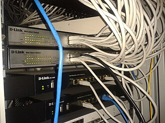

*圖片來源：[Wikimedia Commons「DLink switches 2016.jpg」](https://commons.wikimedia.org/wiki/File:DLink_switches_2016.jpg)，作者 MSDN.WhiteKnight，公有領域（CC0，Public Domain）*

上圖是機房機櫃的實景，最上方兩台印有「Web Smart Switch」字樣的就是交換器，可以看到整排的 RJ-45 連接埠、以及每個埠上方顯示連線狀態的指示燈——燈亮代表該埠接著一台正在運作的裝置。下方兩台則是防火牆設備（機殼上標示 NetDefend UTM Firewall），負責管制哪些流量可以進出這個網路。這也說明了機房設備的常態：交換器很少單獨存在，而是和路由器、防火牆等設備一起裝在機櫃中協同運作。

**交換器 vs 集線器（[Hub](https://zh.wikipedia.org/wiki/集線器)）的差異**：舊式的集線器會將收到的訊號廣播到所有連接埠，效率低且容易造成碰撞；交換器則精確傳送，是現代網路的標準選擇。

### 3. 路由器（Router）

**路由器（[Router](https://zh.wikipedia.org/wiki/路由器)）** 負責在 **不同網路之間** 轉發資料，是網際網路運作的核心設備。若說交換器是管理「同一棟大樓內部的通訊」，路由器就是負責「不同城市、不同國家之間的郵件分揀與轉送」。

路由器依據資料封包中的 **IP 位址**，決定最佳的轉發路徑。家用路由器同時兼具多重功能：連接家庭內部網路（LAN）與寬頻網路（WAN）、提供 Wi-Fi 存取、執行防火牆功能、以及透過 DHCP 自動分配 IP 位址給家中各裝置。

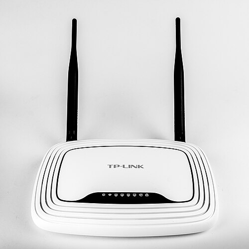

*圖片來源：[Wikimedia Commons「TP-Link TL-WR841N-2920.jpg」](https://commons.wikimedia.org/wiki/File:TP-Link_TL-WR841N-2920.jpg)，作者 Raimond Spekking，授權 CC BY-SA 4.0*

上圖這台兩根天線的白色小盒子，就是典型的家用路由器，也是許多人家中的 Wi-Fi 來源。這裡要說明一個容易混淆的地方：**我們平常也把這種機器稱為「無線路由器」或「Wi-Fi 分享器」，因為它並不只是一台路由器**。它把好幾種角色整合進同一個機殼：對外連接電信業者的線路、負責跨網路轉發的是「路由器」；把有線訊號轉成無線電波的是下一節要介紹的「AP」；背面那幾個給網路線插的孔，則是一台小型「交換器」。換句話說，這個盒子裡其實同時住著三種設備——這也是為什麼一般人常把「路由器」「AP」「分享器」混著講。

> 附帶一提，假如你現在想買一台無線路由器，建議至少選 **Wi-Fi 6（正式名稱為 [IEEE 802.11ax](https://zh.wikipedia.org/wiki/IEEE_802.11ax)）** 以上的機種。「Wi-Fi 6」是 Wi-Fi 聯盟為了讓消費者好記而取的行銷名稱，802.11ax 才是 IEEE 制定的正式標準編號；依此回推，Wi-Fi 5 是 802.11ac、Wi-Fi 4 則是 802.11n——上圖那台 TL-WR841N 正屬於 Wi-Fi 4 世代。Wi-Fi 6 的重點不只是「更快」，而在於它導入了 OFDMA 與 MU-MIMO 等技術，讓路由器能同時服務多台裝置。現代家庭動輒十幾台手機、電視、遊戲機、掃地機器人一起連線，這種「同時應付很多台」的能力，實際使用起來往往比單台的極速數字更有感。以入門機種為例，[華碩 RT-AX1800S](https://24h.pchome.com.tw/prod/DRAFJ5-A900HRBAI) 這類雙頻 Wi-Fi 6 路由器約在兩千元上下，對一般家庭已相當夠用。

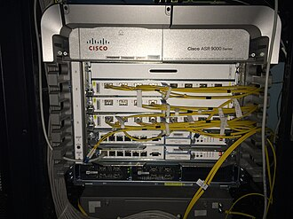

*圖片來源：[Wikimedia Commons「ASR9006.jpg」](https://commons.wikimedia.org/wiki/File:ASR9006.jpg)，攝影師 Redfox hq，授權 CC BY 3.0*

不過家用路由器只是路由器家族中最小的一員。上圖這台 Cisco ASR 9006 屬於電信業者等級，和家裡那台小盒子是完全不同的量級：機箱裡插著一片片可抽換的模組，每一片都能再擴充連接埠，需要更大容量時抽換模組即可，不必整台換掉；接的也不是 RJ-45 網路線，而是整束黃色的光纖，才承載得起匯集自成千上萬用戶的流量。它同時裝了兩張互為備援的控制模組（圖中標示 RSP 0 與 RSP 1），一張故障時另一張立刻接手——這正是前面談環狀拓樸時提過的骨幹網路，對可靠性錙銖必較的具體展現。

### 4. 存取點（Access Point，AP）

**無線存取點（Access Point）** 將有線網路延伸為無線網路，讓 Wi-Fi 裝置能夠加入有線網路。在大型場所（如工廠、醫院、購物中心），通常部署多個 AP，確保無線訊號的完整覆蓋。

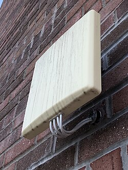

*圖片來源：[Wikimedia Commons「Outdoors Wireless Access Point.jpg」](https://commons.wikimedia.org/wiki/File:Outdoors_Wireless_Access_Point.jpg)，攝影師 Mbrickn，授權 CC BY 4.0*

上圖是一台安裝在建築外牆上的戶外型 AP，用來涵蓋校園的戶外活動區域，外殼因為長期日曬雨淋已留下明顯的髒污痕跡。相較於上一節那台家用機種，它才是嚴謹意義下的 AP：**只負責無線訊號的收發，不含路由功能**——它自己不決定封包該往哪裡送，而是把無線裝置的資料交給有線網路，再由後端的交換器與路由器處理。

值得注意的是，這台設備只接了一條線。這是因為 AP 通常採用 **乙太網路供電（Power over Ethernet，PoE）**：同一條網路線既傳資料、也供電，因此裝設地點不需要另外拉一組電源插座。對於要把 AP 裝在天花板、外牆或廠房高處的場合，這省下的施工成本相當可觀。

在工廠、學校或辦公大樓這類大型場所，這樣的 AP 往往部署了數十甚至上百台，並由中央的 **無線控制器（WLC）** 統一管理：分配各台的頻道以免彼此干擾、調整訊號強度，並讓使用者從地點的一端走到另一端時，能在不同 AP 之間自動接續、不中斷連線。

> 不妨抬頭看看教室天花板，可能也剛好有一台 AP，他不一定長得跟上圖一樣方方正正，可能像是一個圓盤型或橢圓形的機器。

### 5. 閘道（Gateway）

**閘道（[Gateway](https://zh.wikipedia.org/wiki/閘道器)）** 是連接兩個使用 **不同通訊協定** 的網路的橋梁。它不只是轉發資料，還要進行協定轉換，讓原本「說不同語言」的系統能夠溝通。

這裡沒有另外附上照片，是因為 **閘道器的外觀通常和路由器、交換器長得很像**——同樣是一只裝在機櫃或配電箱裡的金屬盒子，同樣有幾個 RJ-45 連接埠與指示燈，光看外表往往分不出來。事實上，前面提過的家用「無線路由器」也內建了閘道的角色。這正好點出本節一個重要的觀念：**這些設備的區別不在於長什麼樣子，而在於它負責做什麼事**。交換器看 MAC 位址在同一個網路內轉送；路由器看 IP 位址在不同網路之間轉送；閘道則要讀懂兩種不同的通訊協定，並在中間翻譯。同一個機殼裡要裝進哪幾種角色，是廠商的產品設計選擇，與它的外形無關。

工廠裡就有一個最典型的例子：PLC 使用 [Modbus](https://zh.wikipedia.org/wiki/Modbus) 或 [PROFIBUS](https://zh.wikipedia.org/wiki/PROFIBUS) 等工業通訊協定，而上層的 MES 系統使用標準的 TCP/IP 網路協定，兩邊講的話彼此聽不懂。工業閘道器負責在中間翻譯，讓 PLC 的資料能夠順利傳入 IT 系統——它正是工業4.0「OT/IT 整合」的關鍵硬體節點（OT 指營運技術，即現場的機台與控制系統；IT 指資訊技術，即企業的資訊系統。這兩個原本各自獨立、由不同部門管理的世界要接起來，第一道關卡往往就是協定不通）。

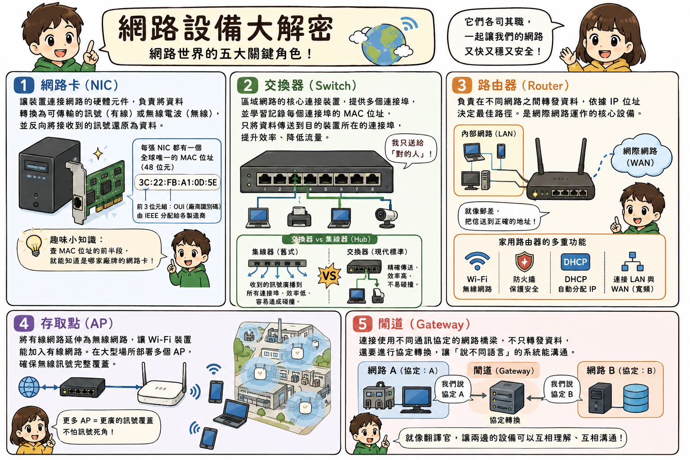

*本圖由 ChatGPT 生成，已由作者審核內容正確性*

---

## 四、區域網路（LAN）

### 1. 什麼是區域網路？

**區域網路（Local Area Network，LAN）** 是在有限地理範圍內（如一個房間、一棟建築、一個工廠廠區）連接多台裝置的網路。LAN 的特點是範圍有限但傳輸速度快、延遲低、管理集中，通常由單一組織擁有並維護。

### 2. 有線區域網路（Ethernet）

**乙太網路（[Ethernet](https://zh.wikipedia.org/wiki/乙太網路)）** 是目前有線區域網路的主流標準，由 IEEE 802.3 規範制定。乙太網路使用[雙絞線](https://zh.wikipedia.org/wiki/雙絞線)（如常見的 Cat5e、Cat6 網路線）或光纖作為傳輸媒介，透過 [RJ-45](https://zh.wikipedia.org/wiki/8P8C) 接頭連接到交換器。

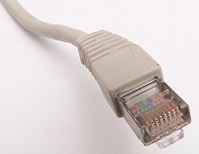

*圖片來源：[維基共享資源「Ethernet RJ45 connector p1160054.jpg」](https://commons.wikimedia.org/wiki/File:Ethernet_RJ45_connector_p1160054.jpg)，作者 David Monniaux，授權 CC BY-SA 2.0 fr*

乙太網路的傳輸速度一路演進：從最早的 10 Mbps（每秒百萬位元），到 100 Mbps 的快速乙太網路（Fast Ethernet），再到現今的主流規格——**1 Gbps 的 [Gigabit Ethernet](https://zh.wikipedia.org/wiki/千兆乙太網)（1000BASE-T，IEEE 802.3ab）**。今日市售的主機板、筆電與家用路由器幾乎都已內建 1 Gbps 網路埠，前面介紹 Wi-Fi 6 路由器時提到的「Gigabit LAN 埠」指的正是這個規格。工業環境則因為既有設備的服役年限長，100 Mbps 仍相當常見，但新建的產線多半已直接採用 1 Gbps。再往上，資料中心與骨幹網路則使用 10/25/100 Gbps 乃至更高的規格。

> **附帶一提**：要真正跑滿 1 Gbps，除了兩端的設備都要支援，很多人會忽略中間那條網路線。好消息是 **Cat5e 就足以跑滿 1 Gbps**（100 公尺以內），不必額外花錢買更貴的線；真正會拖後腿的，通常是更早期的 Cat5（沒有 e）舊線、品質不良的線材，或是接頭壓接不良、線身被家具長期壓折而受損——遇到這些狀況，網路埠會自動降速到 100 Mbps 以求連線穩定，而使用者往往渾然不覺，只覺得「網路好像怪怪的」。如果是新買，建議直接選 **Cat6**（例如這條 [群加 Cat.6 網路線](https://24h.pchome.com.tw/prod/DCACMA-A9006WBKE)，一公尺一百多元），和 Cat5e 的價差不大，卻能為日後升級 2.5G／10G 預留餘裕。這裡還有個選購陷阱要提醒：賣場常看到標示「Cat6e」的線材，但 **TIA 從來沒有制定過「Cat6e」這個標準**，那純粹是廠商自創的行銷名稱；正式標準中，Cat6 之上是 Cat6A（可在 100 公尺內支援 10 Gbps）。認明 Cat6 或 Cat6A 即可，不必為「多一個 e」多付錢。

工業環境中，使用的是特別強化的 **工業乙太網路（Industrial Ethernet）**，在標準乙太網路的基礎上，加強了抗電磁干擾能力、擴大了操作溫度範圍、提高了連接器的防護等級（IP 等級），以應對工廠的惡劣環境。

> **趣味小知識**：前面〈二、網路拓樸〉提到老師當年宿舍的匯流排網路，其實並不是另一種網路，那正是 **乙太網路的早期規格**——多半是俗稱「細網路（Thinnet）」的 [10BASE2](https://zh.wikipedia.org/wiki/10BASE2)：以一條同軸電纜串起整層樓，每個房間用 BNC「T 型接頭」掛在這條線上，速度 10 Mbps，而且電纜兩端各要裝一顆終端電阻，否則訊號會反彈回來干擾全線。換句話說，**乙太網路一開始並不是星狀的**。也正因為大家共用一條線、同一時間只能有一個人「說話」，乙太網路才需要 [CSMA/CD（載波感測多重存取／碰撞偵測）](https://zh.wikipedia.org/wiki/CSMA/CD) 這套「先聽再說、撞到就各自等一下再重試」的機制。直到1990年 10BASE-T 問世，改用雙絞線接上集線器與交換器，乙太網路才變成今天大家熟悉的星狀樣貌，「哪個房間是兇手」也隨之走入歷史。所以，你手上這條 RJ-45 網路線，和當年那條同軸電纜，其實是同一個 IEEE 802.3 標準家族的成員。

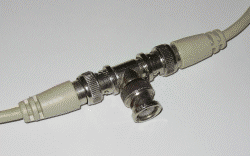

*圖片來源：[Wikimedia Commons「10base2 t-piece.png」](https://commons.wikimedia.org/wiki/File:10base2_t-piece.png)，攝影師 Duncan Lock，公有領域（Public Domain）*

上圖就是當年那個關鍵的 BNC「T 型接頭」。左右兩端接的是同軸電纜，一條來自隔壁房間、一條通往下一個房間，中間朝下的接頭則插進自己電腦的網路卡——整層樓的電腦就是這樣一個接一個串成一條線。也因為如此，只要有人把接頭轉鬆、或是自作主張把電纜拔掉，這條線就當場斷成兩截，全線一起陣亡。

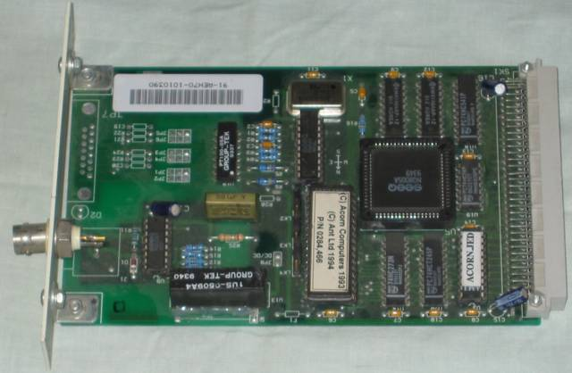

*圖片來源：[Wikimedia Commons「Acorn AEH70 Ethernet 10base2 podule (top).jpg」](https://commons.wikimedia.org/wiki/File:Acorn_AEH70_Ethernet_10base2_podule_\(top\).jpg)，攝影師 Chris Whytehead，授權 CC BY-SA 3.0*

這是一張1990年代初期的 10BASE2 乙太網路卡，T 型接頭就插在左側金屬檔板上那個圓形的 BNC 接座。把它和前面〈三、網路硬體設備〉那張 3Com 網路卡對照著看，可以清楚看出乙太網路的世代交替：同樣是網路卡、同樣屬於 IEEE 802.3 家族，接頭卻從圓形的 BNC 換成了方形的 RJ-45，網路也從一條線串到底的匯流排，變成各自連回交換器的星狀。

> **延伸閱讀**：一台裝置要加入區域網路，需要設定 IP 位址、子網路遮罩、預設閘道與 DNS 等基本參數，也可交由 DHCP 自動分配。由於這些設定與 IP 位址的關係最為密切，本教材把它們連同實際的電腦、手機設定畫面，一併放到後面〈十六、IP 位址系統〉的〈3. 從設定畫面認識 IP〉一起說明。

### 3. 網路分割與隔離（VLAN）

一個區域網路不見得要讓所有裝置都能互通。**把網路切開**，是網路設計中很重要的一招——工廠的內部網路（稱為 **工廠局域網路，Factory LAN**）就是典型例子，它通常與外部網際網路實體隔離或嚴格管控，目的有二：**安全性**（防止外部攻擊入侵工業控制系統）與 **可靠性**（不受外部網路波動影響，確保生產控制的穩定）。

即使在內網之內，也還要再切。工廠內網通常按功能劃分為多個區段（Segment），例如辦公室區段、工程師站區段、現場控制區段，各區段之間透過防火牆或 [VLAN（虛擬區域網路）](https://zh.wikipedia.org/wiki/VLAN)加以隔離。這樣做的用意在於：**就算某一段被攻破，攻擊者也無法長驅直入其他區段**——業務同事的電腦中了勒索軟體，不該連帶讓產線的 PLC 一起停擺。這正是資安的「縱深防禦」原則，後面〈二十一、2〉談工業控制系統安全時會再回頭用到它。

---

## 五、無線網路（Wireless Networks）

### 1. Wi-Fi 基本原理

**[Wi-Fi](https://zh.wikipedia.org/wiki/Wi-Fi)** 是無線區域網路（Wireless LAN，WLAN）的通用名稱，基於 [IEEE 802.11](https://zh.wikipedia.org/wiki/IEEE_802.11) 系列標準。Wi-Fi 使用無線電波在裝置與無線存取點（AP）之間傳輸資料，讓裝置無需實體纜線即可連接網路（Kurose & Ross, 2021）。

> **趣味小知識**：很多人以為「Wi-Fi」是「Wireless Fidelity（無線傳真）」的縮寫，其實不然。這個名字是 1999 年 Wi-Fi 聯盟委託行銷公司 Interbrand 想出來的——只是覺得念起來順口、又能讓人聯想到當年高傳真音響「Hi-Fi」，本身並沒有任何技術上的全稱。所以正確答案是：Wi-Fi 什麼都不是縮寫，就只是個好記的品牌名。

Wi-Fi 標準持續演進，每代帶來更高的速度與更好的效能：

| Wi-Fi 世代 | 標準 | 最高速度 | 主要特性 |
| --- | --- | --- | --- |
| Wi-Fi 4 | 802.11n | 600 Mbps | 雙頻（2.4/5 GHz），MIMO 技術 |
| Wi-Fi 5 | 802.11ac | 3.5 Gbps | 5 GHz 專用，MU-MIMO |
| Wi-Fi 6 | 802.11ax | 9.6 Gbps | 高密度環境最佳化，低延遲，省電 |
| Wi-Fi 6E | 802.11ax | 9.6 Gbps | 新增 6 GHz 頻段，干擾更少 |

Wi-Fi 使用 **2.4 GHz** 與 **5 GHz** 兩個主要頻段：2.4 GHz 穿透力強但速度較慢，適合大範圍覆蓋；5 GHz 速度快但穿透力弱，適合短距離高速傳輸。

上面講的都是規格表上的名詞，不妨看一台真的機器。下圖就是前面提過的華碩 RT-AX1800S，也是老師實驗室正在服役的無線路由器：

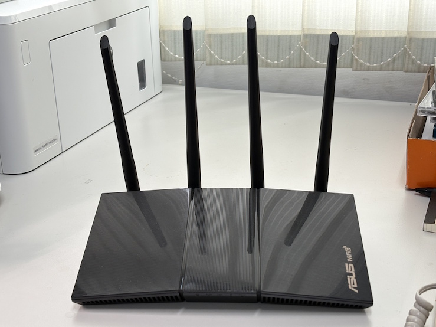

*圖片來源：作者拍攝自個人使用的機器*

正面除了四根外接天線之外，右下角印著一個小小的 `WiFi 6` 標誌——這就是它支援 802.11ax 的宣告。四根天線並不是為了「訊號更遠」，而是對應前面提到的 MIMO：多根天線可以同時收發多路資料流，也才有辦法一次服務多台裝置。

再把它轉過來看背面：

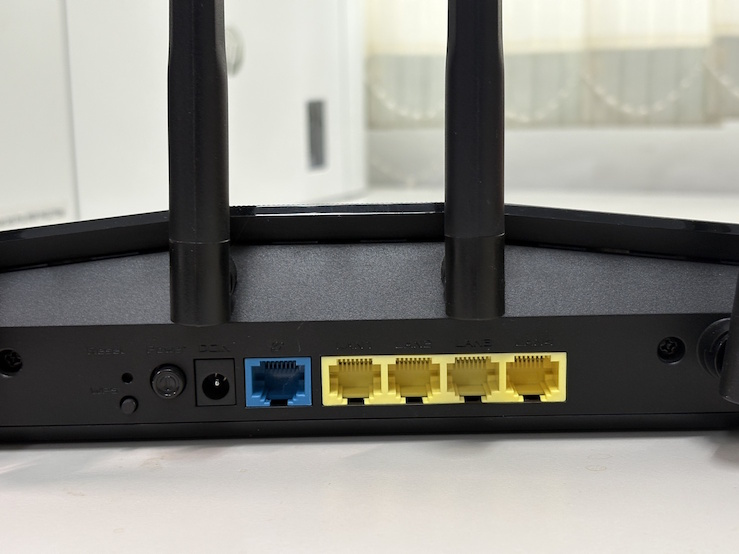

*圖片來源：作者拍攝自個人使用的機器*

這張照片正好把前面〈路由器〉一節說的「一個盒子裡住著三種設備」變成看得見的東西。由左而右分別是重置孔、WPS 按鈕、電源鍵、電源輸入孔，接著是一個 **藍色** 的埠與四個 **黃色** 的埠。顏色不是隨便配的：藍色那個是 **WAN 埠**，用來接電信業者拉進家裡的線路，這是它作為「路由器」對外的那一腳；四個黃色的是 **LAN 埠**，給家中的電腦、電視、遊戲機插網路線，這四個孔合起來其實就是一台小型「交換器」。至於「AP」的部分沒有孔可以指，因為它就是那四根天線。三種角色、同一個機殼，看完這張背面圖應該就不難理解為什麼大家會把這幾個名詞混著講了。

認得這些埠之後，接下來的問題很實際：搬進新家或宿舍、拆開一台新買的路由器，這些線到底該怎麼接？其實現代無線路由器的安裝已經簡化到只剩幾個步驟：

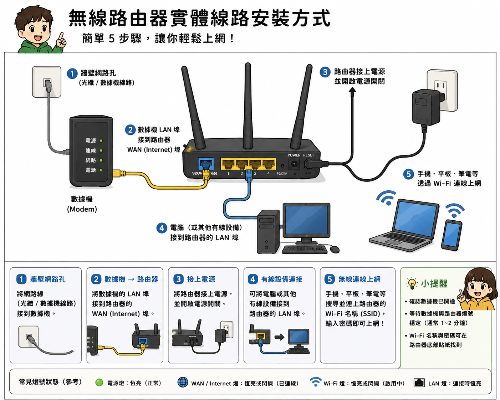

*本圖由 ChatGPT 生成，已由作者審核內容正確性*

圖中出現了一個前面還沒提過的角色：**數據機（Modem）**。電信業者送進家裡的訊號（光纖或電話線）並不是電腦看得懂的乙太網路訊號，數據機的工作就是把兩者互相轉換——依前面〈閘道〉一節的定義，它其實正是一種閘道器。所以整條路徑是這樣的：牆上的網路孔接到數據機，數據機再用網路線接到路由器的 **WAN 埠**（步驟 2，也就是那個藍色的孔）；至於電腦、電視這些有線設備，則插在 **LAN 埠**（步驟 4，那四個黃色的孔）。回頭看前面那張背面照，藍黃兩種顏色的分工在這裡就完全對上了。

真正要記住的其實只有一句話：**WAN 埠朝外接數據機，LAN 埠朝內接設備，別插錯**。這也是最常見的安裝失誤。剩下的步驟（接電源、用手機搜尋 SSID 並輸入密碼）多數人憑直覺就能完成；而預設的 Wi-Fi 名稱與密碼，通常就印在路由器底部的貼紙上。

> **趣味小知識**：許多電信業者提供的機器，是把數據機和路由器合併在同一個機殼裡的（俗稱「數據機路由器一體機」），這時候你家裡就只會看到一台機器，不是圖中的兩台。這也解釋了為什麼有些人家中會出現「兩層路由器」的狀況：業者的機器本身已經在做路由與 NAT，使用者又自己接了一台無線路由器，於是形成兩層網路。這種架構通常還是能上網，但偶爾會讓某些遊戲或連線應用出狀況。

那麼那個藍色的 WAN 埠，實際上是怎麼設定的？下圖是老師另一台無線路由器（華碩 RT-BE3600S）的設定畫面。這類機器都內建網頁介面，用瀏覽器連上它的位址就能登入管理：

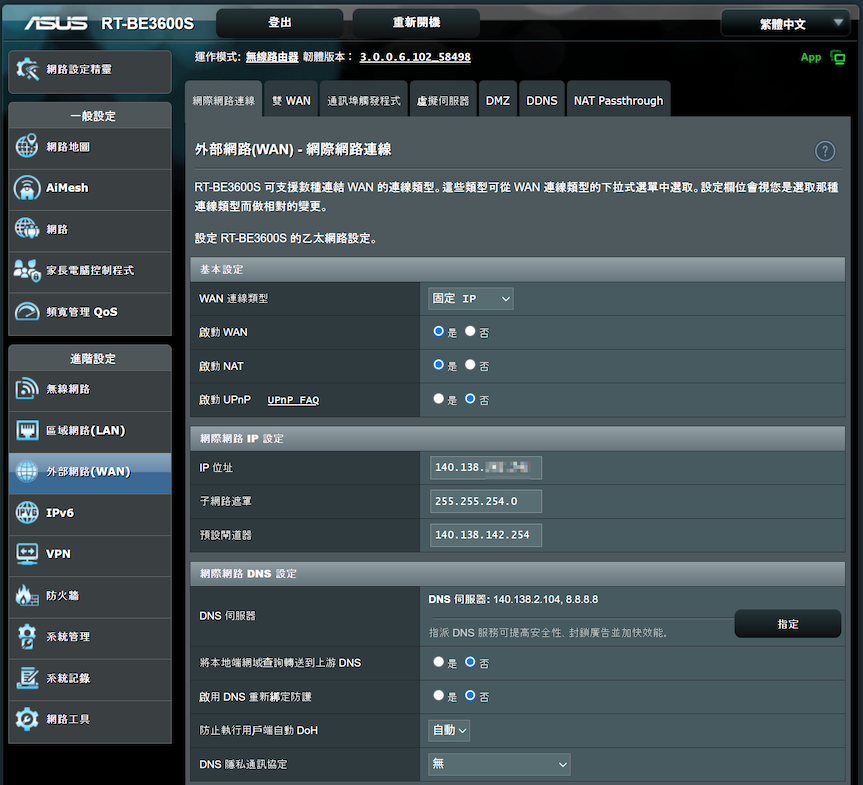

*圖片來源：作者擷取自個人使用的另一台無線路由器設定畫面，敏感資訊已加上馬賽克*

先看左側的選單，會發現前面介紹過的名詞幾乎都在上面：無線網路、區域網路（LAN）、外部網路（WAN）、防火牆——這台機器的設定選單，本身就是一份網路概念的清單。上方還標明了「運作模式：無線路由器」，正是前一節說的那個身兼多職的角色。

畫面中間是重點。「WAN 連接類型」設為 **固定 IP**，底下的「IP 位址」是 `140.138` 開頭——**這是一個公用 IP（Public IP），不是我們在電腦截圖裡看到的 `192.168` 開頭的私有位址**。這帶出一件容易被忽略的事：**一台路由器同時擁有兩個 IP 位址，分屬兩個不同的網路**。對外這一面拿到的是公用 IP，對內那一面則是家中裝置看到的預設閘道（前面那台是 `192.168.50.1`）。所謂「路由」，指的正是它站在兩個網路的交界上，把封包從這一邊轉送到另一邊。至於底下「啟動 NAT：是」，就是讓內部多台私有 IP 裝置共用這一個對外位址的機制，我們留到後面〈IP 位址〉一節再談。

另外兩個細節也值得一看。「子網路遮罩」是 `255.255.254.0`，而不是電腦截圖裡的 `255.255.255.0`——可見遮罩並非只有一種長相，它會隨網路規模而不同。而「DNS 伺服器」填了兩組：`140.138.2.104` 與 `8.8.8.8`，後者就是後面〈DNS〉一節會提到的 Google 公用 DNS。

> **延伸閱讀**：這張畫面裡的公用 IP 與私有 IP、子網路遮罩、NAT 等概念，都屬於 IP 位址系統的範疇。它們的完整說明，以及電腦、手機端的 IP 設定畫面，見後面〈十六、IP 位址系統〉，其中〈3. 從設定畫面認識 IP〉會用實際截圖逐一對照。

### 2. 無線網路安全性

無線訊號在空中傳播，任何在訊號範圍內的裝置理論上都能接收，因此 **安全性是無線網路的重要課題**。

**[WPA3（Wi-Fi Protected Access 3）](https://zh.wikipedia.org/wiki/WPA)** 是目前最新的 Wi-Fi 安全標準，提供更強的加密（256 位元加密）與更好的防護（即使密碼被破解，歷史通訊仍受保護），是新建網路的推薦選擇。較舊的 **[WEP（有線等效加密）](https://zh.wikipedia.org/wiki/有線等效加密)** 已被證實不安全，不應再使用。

這些名詞在設定畫面上長什麼樣子？下圖是同一台 RT-BE3600S 的無線網路設定：

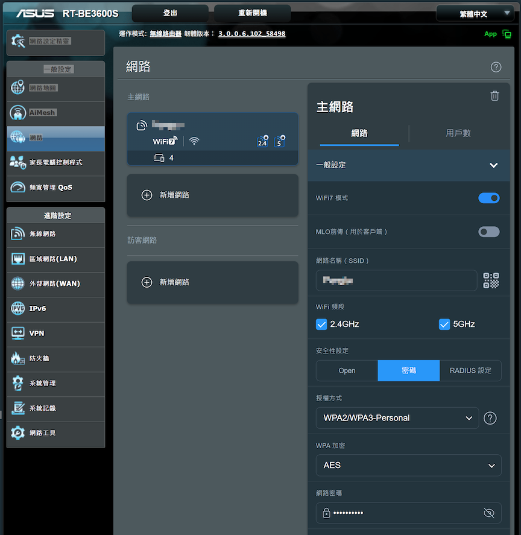

*圖片來源：作者擷取自個人使用的另一台無線路由器設定畫面，敏感資訊已加上馬賽克*

由上往下看：「網路名稱（SSID）」就是手機上搜尋 Wi-Fi 時會看到的那個名字；「WiFi 頻段」勾選了 2.4GHz 與 5GHz，正是前面說的雙頻。真正的重點在「安全性設定」那一排三個選項：**Open** 代表不設密碼，任何人走過來都連得上——這也提醒我們，那些在外面看到「免密碼」的公用 Wi-Fi，資料其實是以明文在空中飄；**密碼** 是一般家庭的選擇；**RADIUS 設定** 則是企業與校園用的做法，每個人有各自的帳號密碼，而不是全校共用一組。

底下的「授權方式」設為 **WPA2/WPA3-Personal**，這是一種相容模式：支援 WPA3 的新裝置就用 WPA3，較舊的裝置則退回 WPA2，兼顧安全與相容性。「WPA 加密」則是 AES。順帶一提，這台機種是 Wi-Fi 7（[IEEE 802.11be](https://zh.wikipedia.org/wiki/IEEE_802.11be)），比前面表格最後一列的 Wi-Fi 6E 又新了一代，所以畫面上會多出「WiFi7 模式」與「MLO」這類前面表格還沒收錄的選項。

其他重要的無線安全措施包括：更改路由器預設密碼、隱藏 [SSID](https://zh.wikipedia.org/wiki/SSID)（網路名稱）、啟用 MAC 位址過濾，以及定期更新路由器韌體。

### 3. 無線感測網路（WSN）

前面談的 Wi-Fi，是為了讓「人」上網而設計的。但工廠裡還有另一種無線需求：讓成百上千個感測器把讀值送出來。這類網路有自己的名字——**[無線感測網路（Wireless Sensor Network，WSN）](https://zh.wikipedia.org/wiki/無線感測器網路)**，由大量低功耗的無線感測節點所組成，每個節點具備感測（如溫度、濕度、震動）、簡單運算與無線通訊的能力。

WSN 特別適合下列場景：感測節點分布廣泛而佈線困難的大型廠區；移動設備（如 AGV 自動導引車）或產品在生產過程中的追蹤；舊廠翻新時，無法輕易在現有設備上加裝有線網路的情況。

WSN 的主要挑戰是電池壽命與訊號可靠性——感測器往往裝在沒有電源可接的地方，換一次電池要停機。因此工業 WSN 不使用耗電的 Wi-Fi，而是採用專為此設計的低功耗通訊協定（如 [Zigbee](https://zh.wikipedia.org/wiki/ZigBee)、LoRaWAN），並設計節能的運作模式（例如平時休眠、每隔幾分鐘才醒來傳一次資料）。這些協定的特性與取捨，留待〈九、2. 低功耗廣域網路（LPWAN）〉再細談。

---

## 六、廣域網路（WAN）

### 1. 什麼是廣域網路？

**廣域網路（Wide Area Network，WAN）** 是跨越較大地理範圍（城市、國家乃至全球）的網路，通常由電信業者提供，企業租用其骨幹線路來連接分散各地的分支機構。網際網路本身可以視為全球最大的廣域網路。

WAN 的傳輸速度通常低於 LAN，延遲也較高（因為資料需要傳輸更遠的距離），但現代光纖骨幹網路已大幅改善了這些限制。

> **趣味小知識**：跨國網路流量是「上天」還是「入海」？答案是入海。全球約 **99% 的國際網路資料** 其實是透過鋪設在海底的光纖電纜傳輸，而非衛星。這些海底電纜總長超過百萬公里，是名副其實的全球網路命脈——所以當某條海纜被船錨或地震扯斷時，一整個地區的網路都可能瞬間變慢。台灣對外的網路，也高度倚賴幾條登陸的海底電纜。

### 2. WAN 概念與應用

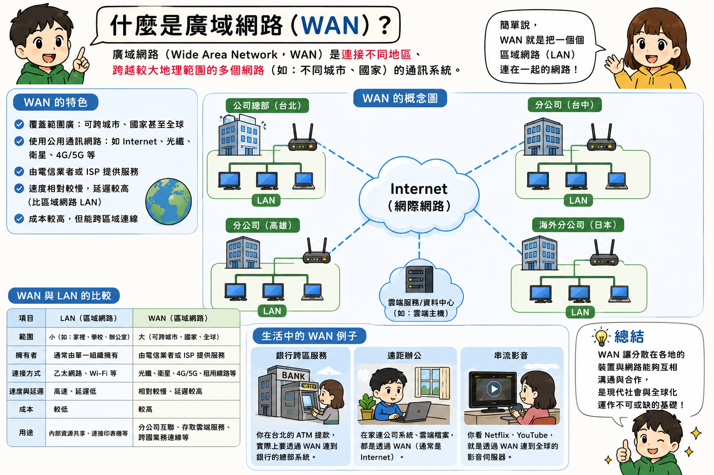

*本圖由 ChatGPT 生成，已由作者審核內容正確性*

企業使用 WAN 的主要方式有幾種：

**專線（Leased Line）**：向電信業者租用一條點對點的專用線路，確保固定頻寬、低延遲與高可靠性，但費用昂貴。適合對連線品質要求極高的金融機構或大型製造企業。

**[MPLS（多協定標籤交換）](https://zh.wikipedia.org/wiki/MPLS)**：一種高效的 WAN 技術，讓企業的多個分支機構透過電信業者的骨幹網路互聯，具有服務品質（QoS）保障。近年也常見以 **[SD-WAN](https://zh.wikipedia.org/wiki/SD-WAN)** 取代或搭配 MPLS——它用軟體來調度多條線路（專線、寬頻、4G/5G），依流量的重要性自動選擇走哪一條，成本較低也較有彈性。一家在台灣、越南、墨西哥各有工廠的零件製造商，就是靠這類技術把三地的生產資料即時整合回台灣總部，讓管理層看得到全球產能與良率，做出跨廠的產能調配決策。

**[VPN（虛擬私人網路）](https://zh.wikipedia.org/wiki/虛擬私人網路)**：在公共的網際網路上建立一條加密的「虛擬專線」，讓遠端工作者或分支機構能安全地存取總部資源。成本遠低於實體專線，是中小企業常用的選擇。（VPN 的運作原理、部署方式與工業應用，詳見後面[〈十九、2. VPN——在公共網路上打造安全通道〉](#2-vpn在公共網路上打造安全通道)。）

---

## 七、行動通訊技術（1G–5G）

### 1. 行動通訊的世代演進

行動通訊技術歷經數十年演進，每一代（Generation，G）都帶來傳輸速度、容量與功能的重大躍升：

**1G（1980年代）**：第一代類比行動通訊，只能傳輸語音，通話品質差、容量小，無加密保護。台灣於1989年開放 1G 服務。

> **趣味小知識**：1G 時代的手機又大又重，最經典的就是俗稱「黑金剛」的 Motorola 大哥大——機身像一塊磚頭、重達近 800 公克，售價可抵當時一台機車甚至一輛小汽車。它不只是通訊工具，更是身分與財力的象徵，握著它講電話幾乎等於昭告天下「我是大老闆」。短短三十多年，手機就從半公斤的磚頭變成放進口袋、運算能力遠勝當年超級電腦的智慧型手機。

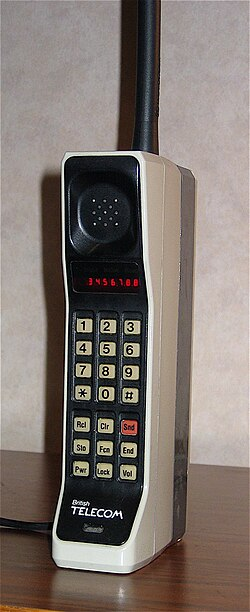

*圖片來源：[Wikimedia Commons「DynaTAC8000X.jpg」](https://commons.wikimedia.org/wiki/File:DynaTAC8000X.jpg)，作者 Redrum0486，授權 CC BY-SA 3.0*

這就是「黑金剛」本尊。注意螢幕的部分：那一排紅色的東西不是液晶螢幕，而是 **發光二極體（LED）數字管**，只顯示得出數字——因為 1G 手機除了打電話之外，什麼也不會做。機身頂端那根粗黑的天線也不是裝飾，類比訊號需要它才收得到。

**2G（1990年代）**：轉為數位訊號，語音品質提升，並開始支援簡訊（SMS）與低速資料傳輸（GPRS/EDGE，速度約 10–384 kbps）。這個時代催生了 LINE 的前身——簡訊文化。

*圖片來源：[Wikimedia Commons「Nokia 3310 blue.jpg」](https://commons.wikimedia.org/wiki/File:Nokia_3310_blue.jpg)，作者 Michael Brandtner，公有領域（Public Domain）*

2G 的代表非 **Nokia 3310**（2000年上市）莫屬，它是史上最暢銷的手機之一，以「摔不壞」和待機好幾天的續航聞名。和黑金剛相比，最明顯的差別是它有了一塊真正的單色液晶螢幕，能顯示文字與圖案。而簡訊文化的證據就藏在鍵盤上：每個數字鍵下方都印著三到四個英文字母，想打出一個 `c`，得連按三下 `2`——這種被稱為「多次輕觸輸入」的打字方式，正是那個年代年輕人練出來的絕技。

**3G（2000年代）**：速度大幅提升至數 Mbps，讓智慧型手機能夠瀏覽網頁、收發電子郵件、使用行動應用程式，開啟了行動網際網路時代。

*圖片來源：[Wikimedia Commons「IPhone_and_iPhone_3G_(Yutaka_Tsutano).jpg」](https://commons.wikimedia.org/wiki/File:IPhone_and_iPhone_3G_(Yutaka_Tsutano).jpg)，作者 Yutaka Tsutano，授權 CC BY 2.0*

3G 世代最具代表性的機種是 2008 年的 **iPhone 3G**——它的名字直接取自這一代的網路規格，可見當年「能用 3G 上網」本身就是最大的賣點。從這張圖也看得出手機外型的根本轉變：實體鍵盤消失了，整個正面只剩一塊觸控螢幕與一個 Home 鍵。鍵盤之所以能被拿掉，正是因為 3G 的速度讓手機從「打電話的工具」變成「上網的工具」，而上網需要的是大螢幕，不是數字鍵。

接下來的 4G 與 5G，我們刻意繼續用 iPhone 來對照——同一個系列擺在一起，比較看得出每一代網路帶來的改變。

**4G [LTE](https://zh.wikipedia.org/wiki/LTE)（2010年代）**：速度達到數十至一百多 Mbps，讓串流影音（YouTube、Netflix）、視訊通話成為日常，也使得行動支付與各種 App 服務蓬勃發展。

*圖片來源：[Wikimedia Commons「IPhone_5_1_2016-06-08.jpg」](https://commons.wikimedia.org/wiki/File:IPhone_5_1_2016-06-08.jpg)，作者 FASTILY，授權 CC BY-SA 4.0*

**iPhone 5**（2012年）是 Apple 第一款支援 4G LTE 的機型。和上一張的 iPhone 3G 擺在一起看，會發現螢幕明顯變長了——這不是偶然：當網路快到可以隨時看影片，螢幕就成了最需要被放大的部位。往後十年手機螢幕不斷變大、邊框不斷變窄，動力其實都來自同一件事。

**[5G](https://zh.wikipedia.org/wiki/5G)（2020年代起）**：目前最新一代，帶來三大關鍵特性：

*圖片來源：[Wikimedia Commons「IPhone_12_Pro_backside.jpgg」](https://commons.wikimedia.org/wiki/File:IPhone_12_Pro_backside.jpg)，作者 茅野ふたば，授權 CC BY-SA 4.0*

**iPhone 12**（2020年）則是 Apple 第一款支援 5G 的機型。把 1G 的黑金剛和它並排——一個是要用手臂扛著、只顯示得出幾個紅色數字的磚頭，一個是薄得可以塞進褲子口袋、正面幾乎整片都是螢幕的玻璃板。中間隔了三十七年，五個世代。

| 特性 | 數字 | 意義 |
| --- | --- | --- |
| 超高速（eMBB） | 最高 20 Gbps | 4G 的 20 倍，超高清影像即時傳輸 |
| 超低延遲（URLLC） | < 1 毫秒 | 工業機器人即時控制、自動駕駛 |
| 大規模連接（mMTC） | 每平方公里 100 萬台裝置 | 大規模 IoT 感測器部署 |

### 2. 私有 5G 網路

表格中的「超低延遲」對工廠的意義特別重大：傳統 Wi-Fi 的延遲約 10–50 毫秒，而機器人協作、精密切削的即時回饋往往需要小於 5 毫秒——這道門檻過去只有拉實體線才跨得過，而拉線就意味著設備不能移動。

於是 **私有 5G 網路（Private 5G）** 成為近年智慧製造的重要趨勢：企業在工廠內部部署專屬的 5G 基地台，建立只服務本廠的私有 5G 網路。相比公共 5G 網路，私有 5G 提供更高的安全性（資料不離廠）、更可預測的服務品質，以及更大的客製化彈性。AGV、移動式機器手臂這類「既要動、又要即時控制」的設備，正是它最典型的用武之地。

---

## 八、個人網路與短距離通訊

前面幾節談的網路，動輒橫跨廠區、城市甚至全球。但有一類網路剛好相反：它的範圍只有你伸手可及的幾公尺、甚至幾公分，圍繞著「一個人」打轉。這類技術其實早就嵌進你我的日常，普遍到幾乎感覺不到它的存在——戴上 AirPods 聽音樂、用無線滑鼠和鍵盤打報告，是手機或電腦透過藍牙和隨身裝置組成的小網路；搭捷運、公車時嗶一下悠遊卡或手機進出閘門，走進宿舍、圖書館刷學生證感應開門，則是靠 NFC 與 RFID 這類「碰一下就通」的極短距離感應。

這些看似各不相干的動作，背後其實是同一組概念：以個人為中心、覆蓋範圍極小的短距離無線通訊。這一節就把它們一次認識清楚——從涵蓋 10 公尺內的個人區域網路（PAN）與藍牙，到只在幾公分內作用的 NFC 與 RFID。

### 1. 個人區域網路（PAN）

**[個人區域網路（Personal Area Network，PAN）](https://zh.wikipedia.org/wiki/個人區域網路)** 是以個人為中心、覆蓋範圍極小（通常在 10 公尺以內）的網路，用於連接個人隨身裝置。最典型的例子是手機透過藍牙連接耳機、手錶、鍵盤等周邊設備。

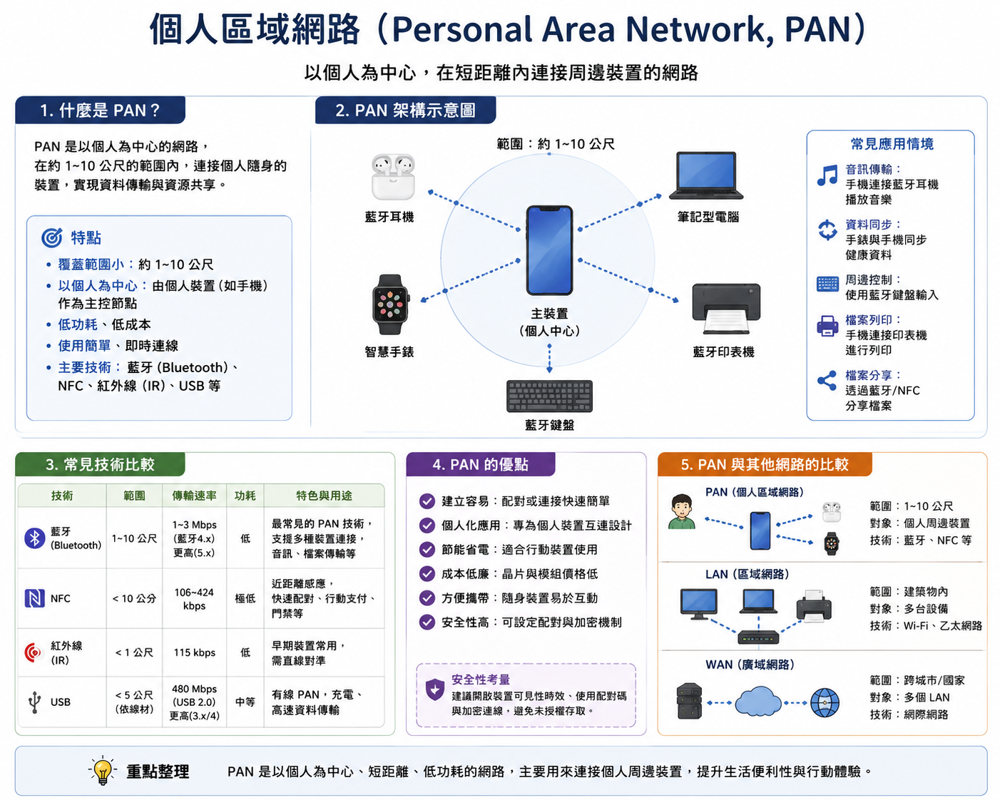

*本圖由 ChatGPT 生成，已由作者審核內容正確性*

### 2. 藍牙（Bluetooth）

**藍牙（[Bluetooth](https://zh.wikipedia.org/wiki/藍牙)）** 是最廣泛使用的短距離無線通訊技術，使用 2.4 GHz 頻段，覆蓋範圍通常在 10 公尺以內（Class 1 藍牙可達 100 公尺）。

> **趣味小知識**：藍牙（Bluetooth）這個名字來自一位一千多年前的維京國王——10 世紀統一了丹麥與挪威的哈拉爾德一世，綽號「藍牙王（Harald Blåtand）」，據說是因為他愛吃藍莓把牙齒染藍了。1990 年代發明者借用這個典故，寓意藍牙要「統一」各家廠商的通訊標準。就連藍牙的 logo，也是把國王姓名縮寫「H」與「B」的北歐盧恩字母疊在一起而成的。

**[藍牙低功耗（Bluetooth Low Energy，BLE）](https://zh.wikipedia.org/wiki/低功耗藍牙)** 是藍牙的省電版本，大幅降低了功耗，特別適合需要長期運作的電池供電裝置，如工業用的資產標籤、穿戴式設備。BLE 感測器每次發送資料的耗電量極低，一顆鈕扣電池甚至可以支撐數年的運作。

*圖片來源：[Wikimedia Commons「AirPods (cropped).jpg」](https://commons.wikimedia.org/wiki/File:AirPods_(cropped).jpg)，作者 Maurizio Pesce，授權 CC BY 2.0*

本章開頭提到的 AirPods，就是最普及的個人藍牙裝置之一。它一邊透過藍牙與手機配對、接收音訊串流，一邊靠 BLE 在收納盒與耳機之間交換電量、配對狀態這類低功耗的控制訊息——同一副耳機裡，藍牙的兩種面貌各司其職。

### 3. NFC（近場通訊）

**[NFC（Near Field Communication，近場通訊）](https://zh.wikipedia.org/wiki/近場通訊)** 是一種極短距離（4 公分以內）的無線通訊技術，通常用於「碰一下」就能完成的快速資料交換或感應。

日常生活中，NFC 的應用包括：悠遊卡與門禁卡（感應刷卡）、手機行動支付（Apple Pay、Google Pay）、電子票券。在工業場合，NFC 可用於工具或設備的快速身份識別：技術員用手機輕碰機台上的 NFC 標籤，立即讀取該機台的保養記錄、操作手冊或最近的警報歷史。

### 4. RFID 基本原理

**[RFID（Radio Frequency Identification，無線射頻識別）](https://zh.wikipedia.org/wiki/無線射頻辨識)** 是利用無線電波進行非接觸式識別的技術，由 **標籤（Tag）** 和 **讀取器（Reader）** 組成：

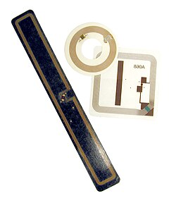

*圖片來源：[維基共享資源「RFID Tags.jpg」](https://commons.wikimedia.org/wiki/File:RFID_Tags.jpg)，作者 Grika，授權 CC BY 2.5*

- **被動式 RFID 標籤**：本身無電池，靠讀取器發出的無線電波感應供電後回傳資料。成本低、體積小、壽命長，但讀取距離短（通常 < 1 公尺），需在讀取器附近才能被讀取。
- **主動式 RFID 標籤**：內建電池，主動定期發送訊號，讀取距離可達數十公尺，但成本較高、需更換電池。

RFID 與條碼的最大差異在於：RFID **不需要對準讀取器**，可以穿透非金屬包裝讀取，且一次可同時讀取多個標籤，大幅提升作業效率。這三個特性直接決定了它在倉儲的用法——叉車開過貨架就完成整排盤點（不必對準、能同時讀多個），貨物通過 RFID 閘門就自動完成出貨紀錄（能穿透外箱，不必拆箱掃描）。

---

## 九、物聯網與低功耗網路

### 1. IoT 概念

**[物聯網（Internet of Things，IoT）](https://zh.wikipedia.org/wiki/物聯網)** 是指將各種實體物件（機器、家電、車輛、建築設施……）嵌入感測器、處理器與通訊模組，使其能夠蒐集資料並透過網路相互通訊、相互協作的概念（Xu et al., 2014）。

IoT 的核心思想是「讓物品能夠感知自己的狀態，並與外界溝通」。一台傳統的工廠壓縮機只會運轉；一台 IoT 壓縮機會即時回報自己的溫度、振動、電流、出口壓力，並在數值異常時主動發出警報。

其實 IoT 離大家的生活一點也不遠，最貼近日常的例子就是智慧家電。掃地機器人會自己記住家裡的格局、避開障礙物，掃完還能用手機 App 查看清掃路線與進度；智慧插座、智慧燈泡與冷氣可以用手機遠端開關，甚至設定「回家前半小時自動開冷氣」；有些冰箱還會在門沒關好時傳訊息提醒你。這些家電的共同點，是把原本「只會做一件事」的機器接上網路，讓它們能感知自己的狀態、也能和你的手機互通。這其實就是前面那台工廠 IoT 壓縮機的家用版本。

這裡要正式介紹一個本章會反覆用到的名詞：**[工業物聯網（Industrial IoT，IIoT）](https://zh.wikipedia.org/wiki/工業物聯網)**。它其實就是 IoT 用在工業場域的分支，把感測與連線的能力，落實到工廠的生產機台、產線與設備上。IIoT 與消費級 IoT 的原理相同，要求卻嚴苛得多：家裡的智慧燈泡偶爾斷線，頂多一時不便；產線上的 IIoT 感測器若漏傳或延遲，卻可能讓一整批產品報廢，甚至造成設備損壞與安全事故。因此 IIoT 對可靠性、即時性、資訊安全與耐惡劣環境的要求，都遠高於一般消費性應用。前面那台會回報溫度與振動的壓縮機，正是 IIoT 的典型例子；本章之後所說的 IIoT，指的都是這個工業版本的物聯網。

不過，光是把資料蒐集、傳送出來還不夠。真正讓這些資料發揮價值的，是在 IoT 之上再加一層人工智慧，也就是近年常聽到的 **AIoT（AI + IoT，人工智慧物聯網）**。簡單說，IoT 負責「感知與蒐集」，AI 負責「判斷與決策」：感測器把海量資料送上來後，交由 AI 模型即時分析，讓系統不只「回報數據」，還能「看懂數據」，自動辨識異常、預測趨勢，甚至主動下達調整指令。前面提到的預測性維護就是最典型的 AIoT 應用——感測器（IoT）持續蒐集機台的振動與溫度，AI 則從這些數據中學會辨認故障前的微小徵兆，在機器真正壞掉之前就發出預警。至於 AI 是如何從資料中「學會」判斷的，本章末的延伸閱讀會指向專門討論的章節；這裡先記得，AIoT 就是「會分析、能決策」的物聯網。

### 2. 低功耗廣域網路（LPWAN）

IoT 設備的特性往往是數量龐大、分布廣泛、電池供電（不能頻繁更換），且每次只傳送少量資料。傳統的 Wi-Fi 或 4G 對這類應用而言功耗太高。為此，專門針對 IoT 需求設計的 **低功耗廣域網路（LPWAN）** 技術應運而生：

**[LoRaWAN（Long Range WAN）](https://zh.wikipedia.org/wiki/LoRa)**：能以極低功耗傳輸訊號，覆蓋範圍可達數公里至十幾公里（開闊地形），一顆 AA 電池可支撐感測器運作長達數年。適合農業感測（土壤濕度、氣象）、智慧城市（路燈、停車格）、工廠偏遠角落的感測器。

**[NB-IoT（Narrowband IoT）](https://zh.wikipedia.org/wiki/窄頻物聯網)**：基於現有的 4G/5G 蜂巢式網路，由電信業者提供覆蓋，訊號能穿透建築物，適合需要電信業者級別覆蓋的應用（如分布在城市各處的智慧電錶）。

**Zigbee**：低功耗的短距離無線協定，常用於工廠與智慧家庭（Xu et al., 2014）。Zigbee 裝置可以形成網狀網路，互相中繼訊號，擴大覆蓋範圍，非常適合工廠現場大量感測器的部署。

這些低功耗技術之所以在工廠裡如此關鍵，是因為 IIoT 最重要的應用（**預測性維護**）完全建立在它們之上：裝在機台上的振動與溫度感測器多半沒有電源可接，只能靠電池撐上數年，而它們回傳的資料正是 AI 判斷「這台機器快壞了」的原料。

不過，把資料傳出來只是整個故事的開頭。IIoT 對工業「管理」的真正意義，不在於裝了多少感測器，而在於這些原本散落在機台、看不見也留不住的現場狀態（溫度、振動、稼動率、能耗），第一次被連續記錄下來，成為可以儲存、比對與分析的資料。少了這層連線，管理者掌握現場只能靠人工抄表與定期報表，永遠慢半拍；有了它，現場的每一個變化才第一次變得可被衡量、也可被管理。這正是工業4.0所說「資料驅動決策」的物質基礎——沒有無所不在的感測與連線，一切分析與最佳化都是無米之炊。

也正因如此，IIoT 是本課程後面幾章的共同起點。一座裝滿感測器的工廠，本身就是一座龐大的資料產生器：成千上萬個節點、每隔幾秒回報一次，日積月累就是可觀的資料量。這些由 IoT 源源不絕產生的海量資料，要先被儲存、整理成資訊系統與資料庫裡有結構的紀錄，才談得上後續運用——這正是資訊系統與資料庫要承接與管理的對象；接著交給資料科學與機器學習，從中提煉出人眼看不出的故障前兆與趨勢；最後在智慧工廠的整體架構裡，串成一條從現場設備到經營決策的完整迴路。網路的角色是把現場的資料「送出來」，至於送出來之後能長出多少價值，正是接下來三章要回答的問題。

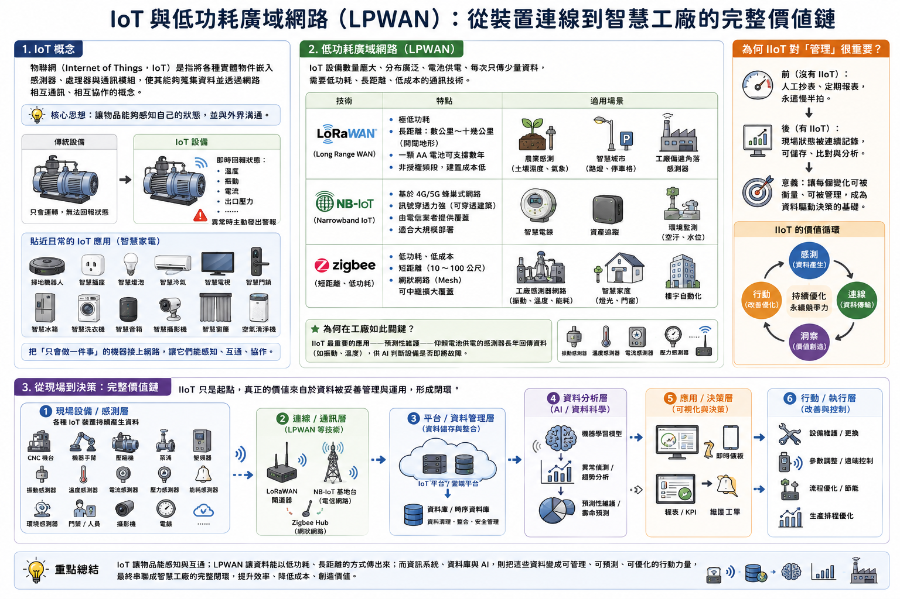

*本圖由 ChatGPT 生成，已由作者審核內容正確性*

> **延伸閱讀**：本節只先說明這些感測資料「如何傳出來」。資料傳出來之後，如何存入資料庫、由 MES 與 ERP 等企業應用系統整理成管理資訊，見 [05-Information-Systems-and-Database.md](05-Information-Systems-and-Database.md)〈三、企業應用系統〉；如何被機器學習模型分析出故障前兆，見 [06-Data-Science-AI-and-Smart-Manufacturing.md](06-Data-Science-AI-and-Smart-Manufacturing.md)〈二、資料科學與人工智慧〉；而預測性維護在智慧工廠中的完整應用情境，則見 [06-Data-Science-AI-and-Smart-Manufacturing.md](06-Data-Science-AI-and-Smart-Manufacturing.md)〈五、3. 智慧工廠：從感測器到決策的四層資料流〉。

---

## 十、低軌衛星與新型網路

### 1. 傳統衛星通訊的限制

傳統的通訊衛星運行在距離地球約 35,786 公里高的 **[地球靜止軌道（GEO）](https://zh.wikipedia.org/wiki/地球同步軌道)**。由於距離遙遠，訊號往返一趟（地面 → 衛星 → 地面）的時間約需 **600 毫秒以上**，這個延遲使得 GEO 衛星不適合需要即時互動的應用（如視訊通話、線上遊戲、工業即時控制）。

### 2. 低軌衛星（LEO）概念

**[低軌衛星（Low Earth Orbit，LEO）](https://zh.wikipedia.org/wiki/近地軌道)** 運行在距離地球 200–2,000 公里的低軌道。由於距離大幅縮短，訊號往返延遲僅約 **20–40 毫秒**，與地面寬頻網路相近，因此能提供真正可用的寬頻網際網路存取。

由於每顆 LEO 衛星的覆蓋範圍較小（相比 GEO），需要數百至數千顆衛星組成 **衛星星座（Constellation）** 才能提供全球持續覆蓋。代表性的 LEO 衛星網路系統包括 SpaceX 的 **[Starlink](https://zh.wikipedia.org/wiki/星鏈)**（目前已部署超過五千顆衛星）與 Amazon 的 Kuiper 計畫。

*圖片來源：[Wikimedia Commons「Starlink Mission (47926144123).jpg」](https://commons.wikimedia.org/wiki/File:Starlink_Mission_(47926144123).jpg)，作者 Official SpaceX Photos，授權 CC0（公眾領域）*

要在天上鋪出數千顆衛星，靠的是「一箭多星」的分批發射。上圖是 Falcon 9 火箭整流罩內堆疊的 60 顆 Starlink 衛星，一次任務就把它們一起送上軌道，再由衛星各自展開太陽能板、爬升到指定高度後散開。正是靠這種一次數十顆的密集發射，Starlink 才能在短短幾年內把衛星數量堆到數千顆的規模。

這個延遲的改善，讓過去接不到地面光纖的地方第一次有了實用的網路：礦場、海上鑽油平台、偏遠農場得以接入工業 IoT 平台，海上運輸的貨輪也能即時回報位置與貨況，把供應鏈的可視性延伸到最後一哩。

*圖片來源：[維基共享資源「Starlink Satellites Imaged from CTIO.jpg」](https://commons.wikimedia.org/wiki/File:Starlink_Satellites_Imaged_from_CTIO.jpg)，作者 NSF's National Optical-Infrared Astronomy Research Laboratory/CTIO/AURA/DELVE，授權 CC BY 4.0*

> **趣味小知識**：剛發射升空的 Starlink 衛星，因為尚未散開到各自的軌道，會像一列珍珠般排成長長一串在夜空中移動，被稱為「**星鏈列車（Starlink train）**」，肉眼就看得到，還常被民眾誤認為 UFO 而通報。不過天文學家對此可笑不出來——這些明亮的衛星軌跡（如上圖）會劃過天文望遠鏡的長曝光影像，干擾天文觀測，是低軌衛星大量部署帶來的新爭議。

*圖片來源：[Wikimedia Commons「Starlink increases Comm capabilities at RAB (6855152).jpg」](https://commons.wikimedia.org/wiki/File:Starlink_increases_Comm_capabilities_at_RAB_(6855152).jpg)，作者 Senior Airman Thomas Karol／美國空軍，公有領域（Public Domain）*

要連上 Starlink，需要的不只是天上的衛星，還得有一具地面終端機——也就是上圖這種俗稱「碟型天線」的接收設備，負責對準天上的衛星、收發訊號。裝好終端機、對準天空，就能在沒有光纖與基地台的地方連上網路，這也是 Starlink 特別適合偏遠地區、災區、軍事與海上場景的原因。

不過，寫到這裡有個台灣讀者一定會問的問題：**為什麼台灣到現在還用不到 Starlink？** 這其實不是技術問題，而是卡在法規與國家安全的考量。依台灣現行的《電信管理法》第 36 條，設置公眾電信網路的業者，董事長須具中華民國國籍，外國人持股比例也受到限制（直接持股不得超過 49%）。而 SpaceX 早在 2021 年就與[國家通訊傳播委員會（NCC）](https://zh.wikipedia.org/wiki/國家通訊傳播委員會)接觸，卻堅持要在台灣成立「100% 完全持股」的獨資公司經營，與這條法規正面衝突，協商因而破局。此外，也有立法委員擔心 SpaceX 創辦人[馬斯克](https://zh.wikipedia.org/wiki/伊隆·馬斯克)在中國有龐大商業利益，把關鍵通訊基礎設施交由其掌握恐有國安疑慮，使得開放更趨謹慎。截至 2026 年，立法院正在審議修法，擬在通過國家安全審查的前提下，鬆綁衛星通訊業者的外資與國籍限制；與此同時，台灣也轉向其他低軌衛星方案（如 Amazon 的 Kuiper、與 AST SpaceMobile 的合作）作為替代。從這個例子可以看到：一項網路技術能不能落地，往往不只取決於技術本身，還牽涉法規、產業政策與地緣政治。

### 3. 傳統衛星 vs 低軌衛星比較

| 比較項目 | GEO 衛星 | LEO 衛星 |
| --- | --- | --- |
| 軌道高度 | 約 35,786 km | 200–2,000 km |
| 延遲 | 600+ ms | 20–40 ms |
| 覆蓋範圍（單顆） | 全球約 1/3 | 小，需要大量衛星 |
| 衛星數量需求 | 少（3顆可覆蓋全球） | 數百至數千顆 |
| 適用應用 | 廣播、氣象、GPS | 寬頻網際網路、IoT |

---

## 第二篇：網際網路（Internet）——全球互聯與通訊機制

---

## 十一、網際網路基本概念

### 1. Internet 的定義

**[網際網路（Internet）](https://zh.wikipedia.org/wiki/網際網路)** 是全球規模的網路系統，由數十億台裝置、數百萬個局部網路（LAN、WAN），透過共同遵守的通訊標準（TCP/IP 協定）互相連接而成（Tanenbaum et al., 2021）。它不是某個組織擁有的單一系統，而是無數個局部網路透過共同語言相互串聯的「網路的網路（Network of Networks）」。

### 2. Network vs Internet 的本質差異

「網路」與「網際網路」的本質差異（包含所有權、通訊協定、規模與連接方式的完整對照表與比喻）已在本章第一篇[〈3. 網路 v.s. 網際網路（概念區分）〉](#3-網路-vs-網際網路概念區分)詳細說明。簡言之，**網路是把裝置連起來的局部系統，網際網路則是讓眾多獨立網路能透過共通的 TCP/IP 協定互相連通的全球架構**。若對兩者的區分還不清楚，建議點擊上方連結回到該小節複習後再繼續。

這個區分不只是名詞遊戲。工廠在規劃資訊系統時，第一個要回答的問題往往就是「**哪些資料該留在內網、哪些可以上雲端**」——留在內網的東西外人碰不到，但也就無法跨廠比對、無法讓客戶自助查詢；上了雲端則反之。這道界線畫在哪裡，是資安、成本與便利性的三方拉扯。

---

## 十二、網際網路簡史

### 1. ARPANET 起源（1960–1970年代）

網際網路的起源可以追溯到1969年，美國國防部高等研究計畫署（ARPA）建立了 **[ARPANET](https://zh.wikipedia.org/wiki/ARPANET)**，最初的目的是建立一個即使部分節點被摧毀（如核戰攻擊），資訊仍能透過其他路徑繼續傳遞的韌性通訊網路（Abbate, 1999）。

1969年10月29日，ARPANET 完成了人類史上第一次電腦網路通訊：從加州大學洛杉磯分校（UCLA）傳送 "LOGIN" 到史丹佛研究院（SRI）。

*圖片來源：[維基共享資源「Arpanet logical map, march 1977.png」](https://commons.wikimedia.org/wiki/File:Arpanet_logical_map,_march_1977.png)，作者 ARPANET，授權 Public Domain*

> **趣味小知識**：人類史上第一則網路訊息其實是個「當機的美麗意外」。1969 年那晚，UCLA 團隊想把 "LOGIN" 這個字傳到史丹佛，才打到第三個字母，系統就在傳出 "O" 之後當機了——於是史上第一則跨電腦傳送的訊息，就這麼巧地變成了 **"LO"**，聽起來剛好像英文打招呼的 "Lo!"（相當於 "Hey!"）。當年主導這場實驗的克萊因羅克教授後來笑說，他們無意間傳出了一句比「一小步」更謙虛、卻同樣劃時代的問候。

### 2. TCP/IP 發展（1970–1980年代）

早期的 ARPANET 使用多種不相容的通訊協定，不同網路之間難以互聯。1974年，[文頓·瑟夫（Vint Cerf）](https://zh.wikipedia.org/wiki/文特·瑟夫)與[鮑伯·卡恩（Bob Kahn）](https://zh.wikipedia.org/wiki/鲍勃·卡恩)共同發表了 **[TCP/IP 協定](https://zh.wikipedia.org/wiki/TCP/IP)**，提供了一套讓不同網路能夠互相通訊的共同語言。

1983年，ARPANET 全面切換至 TCP/IP，這一天被視為現代網際網路誕生的關鍵節點。TCP/IP 的開放性與通用性，是網際網路能夠無限擴展至今天規模的根本原因。

### 3. WWW 興起（1990年代）

1989年，在[歐洲核子研究中心（CERN）](https://zh.wikipedia.org/wiki/歐洲核子研究組織)任職的英國科學家 **[提姆·伯納斯-李（Tim Berners-Lee）](https://zh.wikipedia.org/wiki/蒂姆·伯纳斯-李)** 提出了[全球資訊網（World Wide Web，WWW）](https://zh.wikipedia.org/wiki/全球資訊網)的構想，並於1991年公開。WWW 在 TCP/IP 網路之上，增加了超文字（Hypertext）連結的概念，讓任何人都能透過瀏覽器，以點擊連結的方式在網頁之間漫遊。

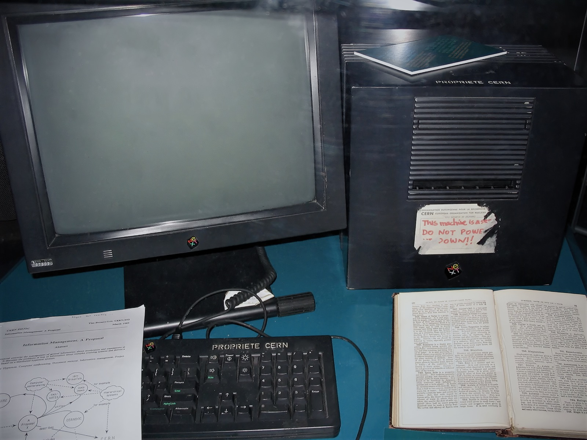

*圖片來源：[維基共享資源「First Web Server.jpg」](https://commons.wikimedia.org/wiki/File:First_Web_Server.jpg)，作者 Coolcaesar，授權 CC BY-SA 3.0*

1993年，第一個圖形化瀏覽器 **[Mosaic](https://zh.wikipedia.org/wiki/Mosaic)** 發布，讓普通人（而非只有工程師）也能輕鬆使用網際網路。1990年代下半，網際網路使用者數量以指數速度增長，電子商務、搜尋引擎、電子郵件成為主流，深刻改變了商業與社會運作。（此處僅簡述 WWW 的歷史，其三大技術標準、瀏覽器的出現與運作原理，將在後面[〈十七、全球資訊網（WWW）與瀏覽器〉](#十七全球資訊網www與瀏覽器)深入說明。）

### 4. 行動網際網路時代（2000年代至今）

2007年，iPhone 的推出開啟了行動網際網路時代。結合 3G/4G/5G 行動通訊、觸控螢幕與 App 生態，網際網路從固定的桌面電腦，延伸到每個人的口袋中，成為隨時隨地存取資訊與服務的基礎設施。

*圖片來源：[維基共享資源「Steve Jobs Headshot 2010-CROP (cropped 2).jpg」](https://commons.wikimedia.org/wiki/File:Steve_Jobs_Headshot_2010-CROP_(cropped_2).jpg)，作者 Matthew Yohe，授權 CC BY-SA 3.0*

從 1969 年 UCLA 傳出的那個 "LO"，到今天，這套系統已經走過半個多世紀。

---

## 十三、封包交換（Packet Switching）

### 1. 封包的概念

在網際網路上，資料並非整塊傳送，而是被切割成許多小的 **封包（Packet）**（Kurose & Ross, 2021）。每個封包都包含：

- **標頭（Header）**：來源 IP 位址、目的地 IP 位址、封包編號、封包大小等控制資訊
- **資料（Payload）**：實際要傳送的內容（檔案的一個片段、網頁的一部分……）

以傳送一份 10 MB 的生產報告為例，這份報告可能被切割成數千個封包，每個封包大小約 1,500 位元組，分別在網路上獨立傳送，最後在目的端重新組合還原成完整的報告。

### 2. 封包傳遞流程

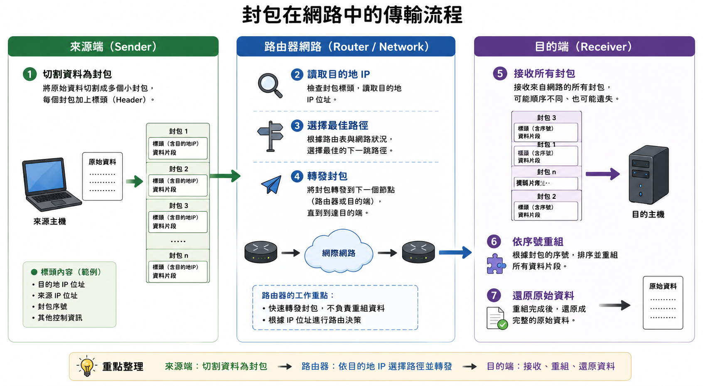

*本圖由 ChatGPT 生成，已由作者審核內容正確性*

每個路由器收到封包後，讀取目的地 IP 位址，根據路由表選擇下一個轉發點，再將封包送出。同一份資料的不同封包，可能走完全不同的路徑到達目的地，最終在接收端按照序號重新組合。

### 3. 封包交換 vs 電路交換

傳統電話網路使用 **[電路交換（Circuit Switching）](https://zh.wikipedia.org/wiki/電路交換)**：通話開始時，在發話端與受話端之間建立一條「專屬電路」，通話期間這條電路完全被這通電話佔用，即使沉默無聲時也一樣。通話結束後才釋放電路。

**[封包交換（Packet Switching）](https://zh.wikipedia.org/wiki/分組交換)** 則沒有專屬電路的概念：多個使用者共享同一條網路線路，各自的資料封包依序（或交錯）通過。這帶來了幾個重要優勢：線路使用效率大幅提升（因為沒有資料時，線路可以被其他人使用）；單一鏈路故障時，封包可以自動繞道；也更容易擴展以服務更多使用者。

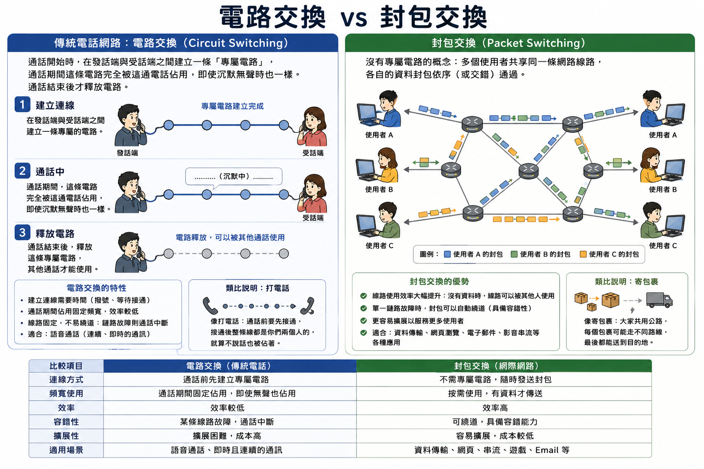

*本圖由 ChatGPT 生成，已由作者審核內容正確性*

不過，共享線路是有代價的。工廠的即時監控資料（感測器讀值、設備狀態）透過封包交換網路傳輸時，由於多個封包共享線路，且各封包可能走不同路徑，**到達時間不一定按照傳送順序**，造成 **延遲（Latency）** 與 **抖動（Jitter）**——後者指的是每個封包延遲時間不一致，時快時慢。對於需要精確時序的工業控制，這正是專屬電路那個「浪費」換來的東西：可預測。因此工業網路通常需要 [QoS（服務品質）](https://zh.wikipedia.org/wiki/服務品質)機制或專用網路，來保障關鍵資料的傳輸優先權。

---

## 十四、通訊協定與分層架構

### 1. 為何需要通訊協定？

**通訊協定（Protocol）** 是通訊雙方必須共同遵守的規則與標準。就像人與人溝通需要說「同一種語言」，電腦與電腦之間也需要協定才能有效溝通。

沒有統一的協定，不同廠商製造的設備將無法互相通訊——就像蘋果手機的充電器不能用於三星手機一樣的困境，只是放大到了全球數十億台裝置的規模。TCP/IP 等開放標準協定，正是讓全球不同廠牌、不同作業系統的裝置能夠無縫互聯的關鍵。

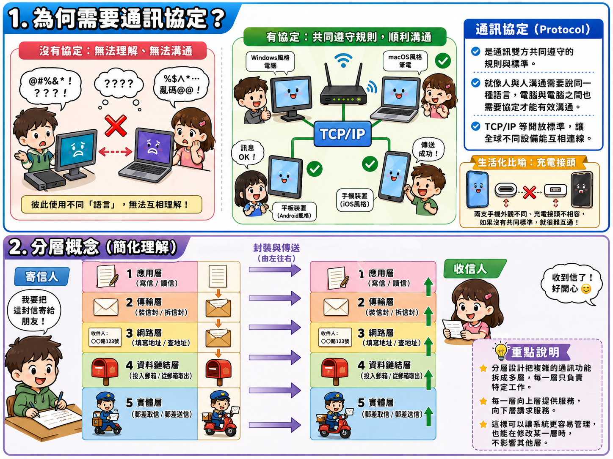

*本圖由 ChatGPT 生成，已由作者審核內容正確性*

### 2. 分層概念（簡化理解）

網路通訊的複雜功能，被拆解為多個 **分層（Layer）**，每一層只負責特定的功能，並向上層提供服務、向下層請求服務。分層設計讓複雜的通訊系統變得可管理——修改某一層的實作，不影響其他層的運作。

分層究竟是什麼意思？用寄一封信來想最容易理解。

你要寄信給朋友，第一件事是 **寫信**——這時你只管內容要寫什麼，這是「應用層」。寫完把信紙 **裝進信封**，順便決定要寄平信還是掛號，這是「傳輸層」。接著在信封上 **填寫收件地址**，讓郵局知道該送到哪裡，這是「網路層」。然後把信 **投進郵筒**，這是「資料鏈結層」。最後由 **郵差把信實際載運出去**，這是「實體層」。收信的一方則完全反過來走一遍：郵差送信、從信箱取出、看地址確認沒送錯、拆開信封，最後才讀到信的內容。

這個比喻真正的重點，不在於有幾層，而在於 **每一層只管自己的事，而且不需要知道其他層是怎麼做的**。你寫信的時候，完全不必考慮郵差今天是騎機車還是開貨車；反過來，郵差也不需要看懂信裡寫些什麼，他只要看信封上的地址再把信送到地址就好。這種「各司其職、互不過問」的分工，正是分層架構的精髓。

而分工帶來的最大好處是：**要改變其中一層的做法，只要動那一層就好，不必把整套系統換掉**。郵局把長途運送從火車改成飛機，全國人民不需要重新學怎麼寫信；同樣地，你改用不同的信紙、甚至換一種語言寫信，郵差的工作也完全不受影響。

現代通訊協定正是這樣設計的，而且這件事你每天都在受惠。把家裡的電腦從插網路線改成連 Wi-Fi，換掉的只是最底層，瀏覽器、LINE、YouTube 一行程式都不必改；電信業者把基地台從 4G 升級到 5G，你手機裡的 App 照跑不誤。反過來也成立：網頁從 HTTP 改成加密的 HTTPS，那是上層的事，沿途的路由器完全不需要為此更新。**每一層的軟體或硬體都可以獨立汰換、各自進步，只要它對上下層的介面不變。**

在工廠裡，這個特性的價值更為明顯。假設一條產線原本用有線乙太網路把設備資料送到 MES 系統，現在為了產線重新配置的彈性，想改用無線傳輸——需要更換的只有網路存取層的設備，上層的 MES 軟體不必重寫。如果沒有分層，牽一髮就得動全身，任何一個小改動都可能逼你把整套系統重做一次。這正是分層被視為現代網路最重要的設計思想之一的原因。

### 3. TCP/IP 架構概覽

現代網際網路使用的 **TCP/IP 協定族**，通常以四層架構描述（Tanenbaum et al., 2021; Kurose & Ross, 2021）：

| 層次 | 功能 | 代表協定 | 直觀說明 |
| --- | --- | --- | --- |
| **應用層** | 提供使用者直接使用的服務 | HTTP、HTTPS、FTP、DNS、SMTP | 你實際使用的服務（瀏覽網頁、收發郵件） |
| **傳輸層** | 確保資料可靠或快速送達 | TCP、UDP | 決定「如何寄送」（掛號還是普通信） |
| **網路層** | 負責跨網路的路由與定址 | IP | 決定「走哪條路」送達目的地 |
| **網路存取層** | 在同一網路內的實體傳輸 | Ethernet、Wi-Fi | 實際搬運資料的「貨車與道路」 |

資料從應用程式出發，依序向下通過各層（每層加上該層的控制資訊）；抵達目的端後，依序向上通過各層（每層剝除對應的控制資訊），最終還原原始資料交給應用程式。這種「發送端逐層封裝、接收端逐層拆解」的過程，正是前面寄信比喻的實際運作方式。

> **補充小知識：另一套分層標準——OSI 七層模型**
>
> 除了實務上主流的 TCP/IP 四層架構，還有一套由國際標準化組織（ISO）在 1984 年提出的 **[OSI 參考模型（Open Systems Interconnection Model）](https://zh.wikipedia.org/wiki/OSI模型)**。值得注意的是，TCP/IP 其實發展得更早——相關協定在 1970 年代就已成形，ARPANET 更於 1983 年全面改用 TCP/IP；OSI 則是稍後才提出、試圖建立的一套通用標準。OSI 把網路通訊細分為 **七層**：由上而下依序是應用層、表現層、會議層、傳輸層、網路層、資料鏈結層、實體層。相較之下，TCP/IP 把 OSI 上面三層（應用、表現、會議）合併為單一的「應用層」，把下面兩層（資料鏈結、實體）合併為「網路存取層」，因此變成四層。
>
> 兩套模型的對應關係大致如下：
>
> | OSI 七層模型 | TCP/IP 四層架構 |
> | --- | --- |
> | 應用層、表現層、會議層 | 應用層 |
> | 傳輸層 | 傳輸層 |
> | 網路層 | 網路層 |
> | 資料鏈結層、實體層 | 網路存取層 |
>
> 為什麼實務上以 TCP/IP 為主，OSI 卻仍值得認識？因為 OSI 雖然沒有成為真正運作的協定族，卻是網路教學與工程溝通時的 **通用參考語言**。工程師口中常說的「這是第七層（L7）的問題」（指應用層，例如網頁程式錯誤）或「這是第二層（L2）的交換器」（指資料鏈結層，例如乙太網路交換器），用的都是 OSI 的層號。因此，理解 TCP/IP 的實際運作，同時記得 OSI 的分層術語，兩者搭配就能在實務與溝通上都游刃有餘。

---

## 十五、TCP/IP 基本概念

### 1. IP——定位與位址

**[IP（Internet Protocol）](https://zh.wikipedia.org/wiki/網際協定)** 是網際網路的基礎定址協定，為網路上的每一台裝置分配一個唯一的 **IP 位址（IP Address）**，讓資料知道要送往何處。IP 位址就像家庭住址——告訴郵差「你要把這封信送到哪裡」。

IP 協定本身是 **不可靠的（Best-Effort）**：它盡力將封包從來源送到目的地，但不保證封包一定到達、不保證順序、不保證沒有重複。可靠性由上層的 TCP 協定來負責。

### 2. TCP——可靠傳輸

**[TCP（Transmission Control Protocol，傳輸控制協定）](https://zh.wikipedia.org/wiki/傳輸控制協定)** 在 IP 的基礎上，提供 **可靠、有序、無差錯** 的資料傳輸。TCP 透過以下機制確保可靠性：

- **[三向交握（Three-Way Handshake）](https://zh.wikipedia.org/wiki/傳輸控制協定#連接建立)**：連線建立前，發送端與接收端先完成三次確認，確保雙方都準備好
- **確認應答（ACK）**：接收端收到每個封包後，回傳確認訊號；若發送端未收到確認，則重傳
- **流量控制（Flow Control）**：根據接收端的處理能力，調整發送速率，避免接收端被資料淹沒
- **擁塞控制（Congestion Control）**：感知網路壅塞時，主動降低發送速率，避免惡化壅塞

TCP 適合需要確保資料完整性的應用：檔案傳輸、網頁瀏覽、電子郵件、資料庫查詢。

### 3. UDP——快速但不保證

**[UDP（User Datagram Protocol，使用者資料包協定）](https://zh.wikipedia.org/wiki/使用者資料包協定)** 是一種更輕量的傳輸協定。它不建立連線、不確認收到、不重傳遺失的封包——簡單地將資料包發送出去，不管對方是否收到。

UDP 的優勢是 **延遲極低**：省去了 TCP 的各種確認與重傳機制，資料能以最快速度傳送。適合以下應用：即時影音串流（少量畫面遺失可接受，但不能停頓等待重傳）、線上遊戲（低延遲比完整性更重要）、DNS 查詢（簡短的問答，發送一次若沒回應就再發）。

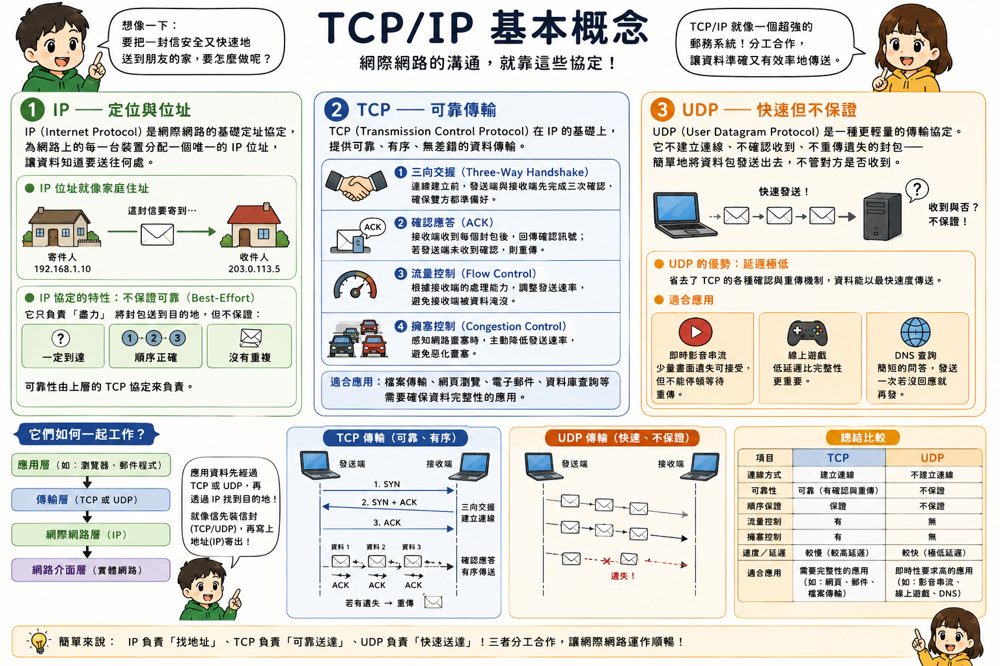

*本圖由 ChatGPT 生成，已由作者審核內容正確性*

**那麼，該選 TCP 還是 UDP？** 這個取捨在工廠裡每天都在發生：

| 應用場景 | 適合協定 | 原因 |
| --- | --- | --- |
| 生產報表上傳 ERP | TCP | 資料完整性最重要，延遲可接受 |
| 設備即時監控畫面 | UDP | 即時性優先，偶爾一幀遺失可接受 |
| 工業機器人即時控制 | UDP（或專用協定） | 延遲必須極低，重傳會造成危險 |
| 品質量測記錄存入資料庫 | TCP | 每一筆記錄都不能遺失 |

---

## 十六、IP 位址系統

### 1. IPv4 基本概念

前一節〈十五、TCP/IP 基本概念〉說過，IP 是一種 **定址協定**：它為網路上的每一台裝置分配一個地址，作用就像現實生活中每間房子的門牌號碼。資料要送達，得先知道對方的地址在哪；通訊的兩端，也正是靠這組地址才找得到彼此、建立起連線。那麼這個「網路上的門牌」實際長什麼樣子？這一節就來拆解它的結構。

**[IPv4（Internet Protocol version 4）](https://zh.wikipedia.org/wiki/IPv4)** 是目前仍廣泛使用的 IP 位址格式，由 **32 個位元** 組成，通常以四組十進位數字表示，每組數字範圍為 0–255，組與組之間以點分隔，例如 `192.168.1.100`。

換句話說，**你手上任何一台要上網的裝置，不論是電腦、手機、平板，還是工廠裡的每一台感測器與機台，都會被分配到這樣一組 IP 位址**，否則網路就不知道該把資料送去哪裡。這些 IP 實際在裝置上長什麼樣、又是怎麼設定的，本節稍後的〈3. 從設定畫面認識 IP〉會用真實的電腦與手機截圖帶你看。

同一個機構所使用的 IP，開頭往往是固定的一段。以 **元智大學** 為例，校內的 IP 幾乎都是 `140.138` 開頭。回頭看前面〈五、1〉那張無線路由器設定截圖：WAN 端拿到的公用 IP 是 `140.138` 開頭，連填的 DNS 伺服器 `140.138.2.104` 也同樣是 `140.138` 開頭，正是因為那台機器就接在元智的校園網路裡。下次你在校內查自己裝置的 IP，只要看到 `140.138` 開頭，就代表你正掛在元智大學這個大網路底下。

32 位元的 IPv4 最多能表示 **2³² ≈ 43 億** 個不同的位址。在網際網路發展初期，這個數量看似充裕，但隨著連網裝置的爆炸性成長，IPv4 位址已於2011年全球正式耗盡（各地區分配機構陸續宣告用盡）。

**私有 IP 位址（Private IP）** 是只在內部網路使用、不在網際網路上路由的位址範圍，例如 `192.168.0.0/16`（家用路由器常用）、`10.0.0.0/8`（企業內網常用）。透過 **[NAT（網路位址轉換）](https://zh.wikipedia.org/wiki/網路位址轉譯)** 技術，多台使用私有 IP 的裝置可以共用一個公共 IP 位址連接網際網路，這是延緩 IPv4 耗盡的主要手段。

### 2. IPv6 發展背景與特性

**[IPv6（Internet Protocol version 6）](https://zh.wikipedia.org/wiki/IPv6)** 是為了解決 IPv4 位址耗盡問題而設計的下一代 IP 協定，使用 **128 個位元**，以十六進位表示，例如 `2001:0db8:85a3:0000:0000:8a2e:0370:7334`。

128 位元的 IPv6 理論上可以提供 **2¹²⁸ ≈ 3.4 × 10³⁸** 個位址——這個數字大到幾乎不可能耗盡，地球上每一粒沙都能分配到數百億個 IP 位址。這也是為什麼工業4.0談得起 IPv6：一座配齊 IIoT 的工廠，光是感測器、PLC、HMI、攝影機、AGV 就可能有數千個節點要分配位址，而這樣的工廠全世界有數十萬座。

除了位址空間大幅擴展，IPv6 還帶來了其他改進：更有效率的路由（簡化的標頭格式）、更好的安全性（IPSec 原生支援）、自動配置（裝置可以自動產生自己的 IPv6 位址）。

### 3. 從設定畫面認識 IP

前面把 IPv4 與 IPv6 的結構講完了，但這些位址並不是躺在教科書裡的抽象規格——你現在使用的每一台裝置，作業系統裡都設定著一組真實的 IP 位址，只是平常都交給 DHCP 自動處理，你從來不需要去動它。這一節就打開真正的設定畫面，把前面學到的名詞一一對上。

一台裝置要連上網路，通常需要幾項基本設定：

- **IP 位址（IP Address）**：裝置在網路中的地址，讓其他裝置知道如何「找到它」，也就是前兩節談的那組 IPv4／IPv6 位址
- **子網路遮罩（Subnet Mask）**：定義哪些 IP 位址屬於同一個網路
- **預設閘道（Default Gateway）**：當資料需要傳到網路外部時，先送往哪裡（通常是路由器的 IP）
- **DNS 伺服器**：將網域名稱轉換為 IP 位址的服務（詳見後面〈十八、網址與網域名稱系統（DNS）〉）

這些設定可以手動配置，也可以透過 **[DHCP（Dynamic Host Configuration Protocol）](https://zh.wikipedia.org/wiki/動態主機設定協定)** 由網路自動分配，大幅簡化了管理工作。

以 Windows 為例，在「設定 → 網路和網際網路」中點開目前的連線，或在舊版控制台的網路連線上按右鍵選「狀態 → 詳細資料」，就會看到下面這個畫面（macOS 在「系統設定 → 網路」、Linux 則可用 `ip addr` 指令查到同樣的資訊）：

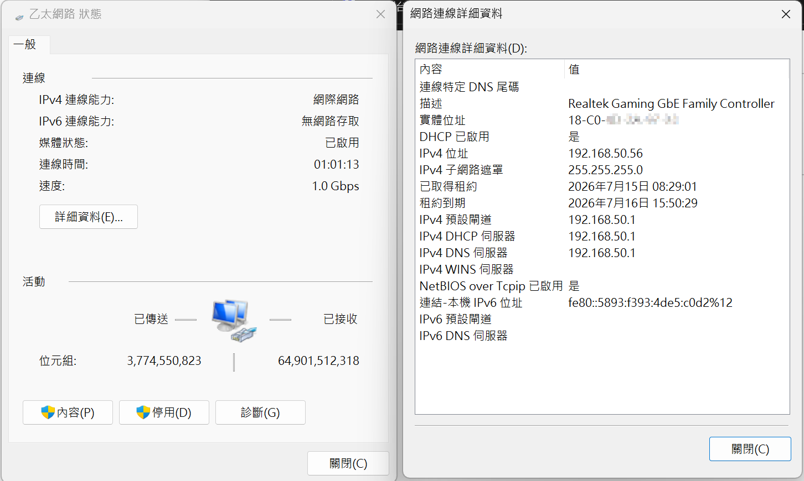

*圖片來源：作者擷取自個人電腦的網路設定畫面*

把這個畫面對照前面的清單，剛才學到的名詞就全部對上了：

- **IPv4 位址**：`192.168.50.56` 是這台電腦在家中網路裡的地址
- **子網路遮罩**：`255.255.255.0` 表示前三段相同（`192.168.50.x`）的裝置都屬於同一個網路
- **預設閘道**：`192.168.50.1` 就是那台無線路由器，凡是要送到網路外面的資料都先交給它
- **DNS 伺服器** 與 **DHCP 伺服器**：也都是同一個位址 `192.168.50.1`，這正好印證了前面說的：家用路由器一台身兼多職。左側視窗的 **速度** 顯示 `1.0 Gbps`，代表這條線與兩端的設備都跑在 Gigabit Ethernet 上
- **實體位址**：`18-C0-4D-2A-97-33` 就是這張網路卡的 MAC 位址，有興趣的話，不妨用前面〈三、1. 網路卡〉提過的方法，查查看它的前 3 個位元組是哪家廠商的 OUI。

畫面中還有一個細節值得注意：DHCP 分配的 IP 位址並非永久擁有，而是像租房子一樣有期限，因此才會有「**已取得租約**」與「**租約到期**」兩個時間。租約到期前，電腦會自動向 DHCP 伺服器續約；如果你把筆電帶去別的地方再回來，拿到的 IP 位址也可能因此不同——這就是為什麼工廠裡的伺服器或機台，通常會改用固定不變的手動設定，而不是交給 DHCP。

這些設定也不是電腦專屬的。任何要連上網路的裝置都必須具備，你口袋裡的手機當然也不例外。在 iPhone 上依序點開「設定 → Wi-Fi」，再點目前連線名稱右側的資訊圖示，就會看到：

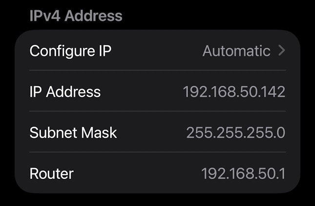

*圖片來源：作者擷取自個人手機的網路設定畫面*

請把這個畫面和上一張電腦的截圖擺在一起看，會發現兩件有意思的事。第一，**這兩台是同一個家用網路裡的成員**：手機的 `Router` 與電腦的預設閘道同樣是 `192.168.50.1`，子網路遮罩同樣是 `255.255.255.0`，只有最後一段的 IP 位址不同（電腦是 `.56`、手機是 `.142`）——這正是子網路遮罩的作用，它們前三段相同，所以屬於同一個網路，可以直接互相溝通。第二，**同樣的概念，不同的作業系統可能用不同的名字**：Windows 稱為「預設閘道」，Apple 直接叫它「Router」；Windows 顯示「DHCP 已啟用：是」，iPhone 則寫成「Configure IP：Automatic」。名稱雖然不同，指的其實是同一件事。日後你若看到陌生的設定畫面，只要認得出這幾個角色，不論在哪一種系統上都能找到方向。

---

## 十七、全球資訊網（WWW）與瀏覽器

### 1. 從專用協定到 WWW：一個瀏覽器統一上網體驗

上一章談到，IP 與 TCP/IP 讓全球裝置能夠互通。但「能互通」不等於「好使用」。在 WWW 出現之前，網際網路上的每一種服務，各自使用一套專屬的 **應用層通訊協定**：收發電子郵件用 [SMTP](https://zh.wikipedia.org/wiki/簡單郵件傳輸協定)／[POP](https://zh.wikipedia.org/zh-tw/郵局協定)、遠端登入主機用 [Telnet](https://zh.wikipedia.org/wiki/Telnet)、傳輸檔案用 [FTP](https://zh.wikipedia.org/wiki/檔案傳輸協定)、即時聊天用 [IRC](https://zh.wikipedia.org/wiki/IRC)、瀏覽文件目錄用 [Gopher](https://zh.wikipedia.org/wiki/Gopher_(通訊協定))……。

> 這些協定不少都有數十年歷史，其中 Telnet、Gopher 等如今已幾乎退場——如果你對這些名字完全陌生，正好說明你是在 WWW 早已一統天下的年代才開始上網的世代。

這種「一種服務、一套協定」的模式帶來很高的使用門檻：每接觸一種新服務，使用者就得 **另外安裝一套專屬軟體、學習該協定的操作指令，還要理解它獨特的資料呈現方式**。想寄信、傳檔、聊天、查資料，桌面上就得擺上一堆彼此不相通的程式。

1990 年代初，**全球資訊網（World Wide Web，WWW）** 的出現徹底改變了這個局面。有了 WWW，使用者 **只需要一個瀏覽器，在網址列輸入網址就能進入任何網站**，不必再為每種服務各裝一套軟體、各學一套操作。這個突破性的便利，讓許多原本需要專屬協定的服務（webmail 取代桌面郵件軟體、網頁版即時通訊取代 IRC、雲端硬碟取代 FTP）紛紛改以網頁形式重新提供，透過 HTTP/HTTPS 連線。發展至今，**現代的網路服務已逐漸「由 HTTP／HTTPS 統一」**：絕大多數服務都收斂到瀏覽器與 HTTP 這條共通管道之上（這個「走向 HTTP 統一」的趨勢，會在〈十九、當代常見的網際網路服務〉進一步說明）。

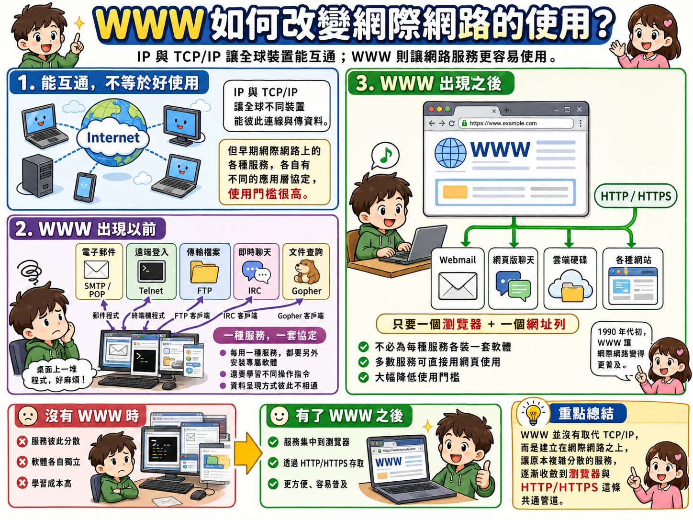

*本圖由 ChatGPT 生成，已由作者審核內容正確性*

> **趣味小知識**：台灣人最熟悉的 **[批踢踢（PTT）](https://zh.wikipedia.org/wiki/批踢踢)**，正是一個存活到 21 世紀、至今仍有人在用的 Telnet 服務。當年許多 BBS 站台都靠 Telnet 連線，多數早已走入歷史，PTT 卻是少數的「活化石」。在還沒有 Threads、Dcard 這類社群平台的年代，像老師這輩的大學生，就是靠 PTT 追時事、討論課業、和同學網友互動、揪團出遊，可以說是那個世代共同的網路生活記憶。不過，即使是 PTT，如今也順應了 WWW 化的潮流：除了傳統用 Telnet 連線軟體登入，官方也推出了網頁版（[PTT Web](https://www.ptt.cc/bbs/index.html)），讓使用者不必安裝專門的連線程式，直接打開瀏覽器就能看板、讀文——這正是本節所說「服務逐漸由 HTTP 統一」最貼近生活的一個縮影。時至今日，PTT 仍是台灣流量數一數二的社群平台，許多新聞話題都從這裡發酵；只不過使用者的年齡層，也和老師一樣逐漸偏長，年輕世代反而更常出沒在 Threads、Dcard 等新平台上。

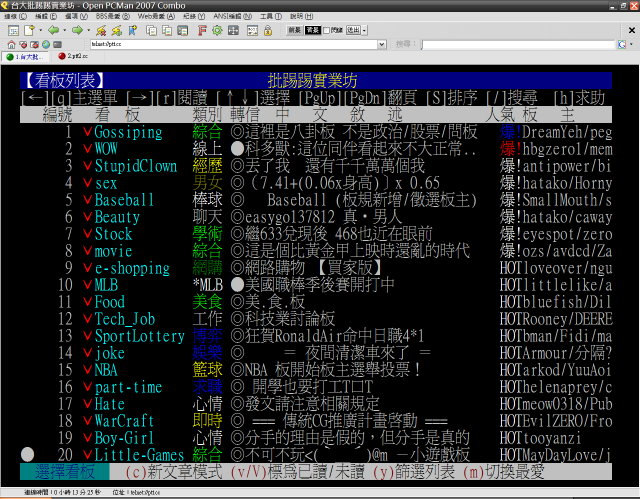

*圖片來源：[維基共享資源「PTT-boards.jpg」](https://commons.wikimedia.org/wiki/File:PTT-boards.jpg)，作者 moboo，授權 CC BY-SA 3.0*

### 2. WWW 的概念與三大技術標準

**全球資訊網（WWW）** 是建立在網際網路基礎設施之上的一個 **超文字資訊系統**。它的核心創新是 **超連結（Hyperlink）**：網頁中的文字或圖片可以連結到其他網頁，使用者點擊後立即跳轉，讓資訊之間形成相互連結的「蜘蛛網」。

> **重要區分**：「網際網路（Internet）」是實體的基礎設施（電纜、路由器、協定）；「WWW」是運作在這個基礎設施上的一個服務（網頁與超連結系統）。電子郵件、即時通訊、串流影音也是運作在網際網路上的服務，但不屬於 WWW。

WWW 之所以能做到「一個瀏覽器走天下」，是因為它建立在三項互相配合的技術標準上：

| 技術標準 | 角色 | 說明 |
| --- | --- | --- |
| **[HTML](https://zh.wikipedia.org/wiki/HTML)**（超文字標記語言） | 呈現 | 描述網頁內容與結構的語言，規定一份文件裡哪些是標題、段落、圖片、連結，讓瀏覽器知道該如何呈現。 |
| **[HTTP／HTTPS](https://zh.wikipedia.org/wiki/超文本傳輸協定)**（超文字傳輸協定） | 傳輸 | 瀏覽器與網站伺服器之間傳輸網頁資料的協定，HTTPS 是加上加密的安全版本。它取代了過去五花八門的專屬協定，成為承載網路服務的共通管道。 |
| **[URL](https://zh.wikipedia.org/wiki/統一資源定位符)**（統一資源定位器） | 定位 | 定位網頁資源的位址格式，也就是俗稱的「網址」，讓使用者只要輸入一串位址就能精確找到目標資源。 |

有了這三者的分工（URL 負責「定位」、HTTP 負責「傳輸」、HTML 負責「呈現」），使用者不必再懂各種協定的細節，就能自由地在網頁世界之間漫遊。（URL 的完整結構，以及網址背後如何轉換成 IP 位址，將在下一節〈十八、網址與網域名稱系統（DNS）〉詳細說明。）

> **趣味小知識**：世界上第一個網路攝影機（Webcam），竟然是為了「看咖啡壺」而誕生的。1991 年，英國劍橋大學電腦實驗室的研究人員為了不想白跑一趟卻發現咖啡已被喝光，架了一台攝影機對準走廊的咖啡壺，把畫面接上內部網路即時更新。1993 年這個「特洛伊房間咖啡壺（Trojan Room Coffee Pot）」接上全球資訊網後爆紅，全世界的人都上線盯著英國一台咖啡壺看——這台咖啡壺後來還被拍賣，成為網路史上的著名軼事。

### 3. 瀏覽器的出現與演進

前面談到的 HTML、HTTP/HTTPS、URL 三項技術標準，本身只是規格與協定——要讓一般使用者真正「用得到」它們，還需要一個把三者整合起來、操作簡單的工具，這個工具就是 **瀏覽器（Web Browser）**。所謂瀏覽器，就是一套替使用者「照著 URL 去向伺服器要網頁（HTTP）、看懂網頁（解讀 HTML/CSS/JavaScript）、再把網頁畫出來（呈現在螢幕上）」的軟體：它把三大標準包裝在網址列與畫面背後，讓使用者不必懂任何技術細節，就能通往整個 WWW。而這個關鍵入口本身，也是一段值得認識的演進史。

- **第一個瀏覽器（1990）**：WWW 的發明人伯納斯-李在 CERN 寫出了世界上第一個瀏覽器，取名就叫 **WorldWideWeb**（後改名 Nexus）。它既能瀏覽也能編輯網頁，但只能在當時少見的 NeXT 電腦上執行，尚未普及。
- **引爆普及的關鍵（1993）**：圖形化瀏覽器 **[Mosaic](https://zh.wikipedia.org/wiki/Mosaic)** 問世，能在網頁中直接顯示圖片、支援多種作業系統、安裝又簡單，讓不懂技術的一般人也能輕鬆上網，堪稱 WWW 走入大眾的引爆點（詳見前面〈十二、3. WWW 興起〉）。
- **瀏覽器大戰（1990 年代末～2000 年代）**：Mosaic 的團隊隨後推出商業化的 **[Netscape Navigator](https://zh.wikipedia.org/wiki/Netscape_Navigator)**，一度稱霸市場；微軟則以內建於 Windows 的 **[Internet Explorer（IE）](https://zh.wikipedia.org/wiki/Internet_Explorer)** 強勢競爭，掀起著名的「瀏覽器大戰」。
- **今日主流**：現在最常用的瀏覽器包括 **[Chrome](https://zh.wikipedia.org/wiki/Google_Chrome)、[Safari](https://zh.wikipedia.org/wiki/Safari)、[Firefox](https://zh.wikipedia.org/wiki/Mozilla_Firefox)、[Edge](https://zh.wikipedia.org/wiki/Microsoft_Edge)** 等。它們早就不只用來看網頁，還能跑地圖、文件、視訊會議這些複雜的「**網頁應用（Web App）**」。

從三十年前到今天，瀏覽器的樣貌變化極大：

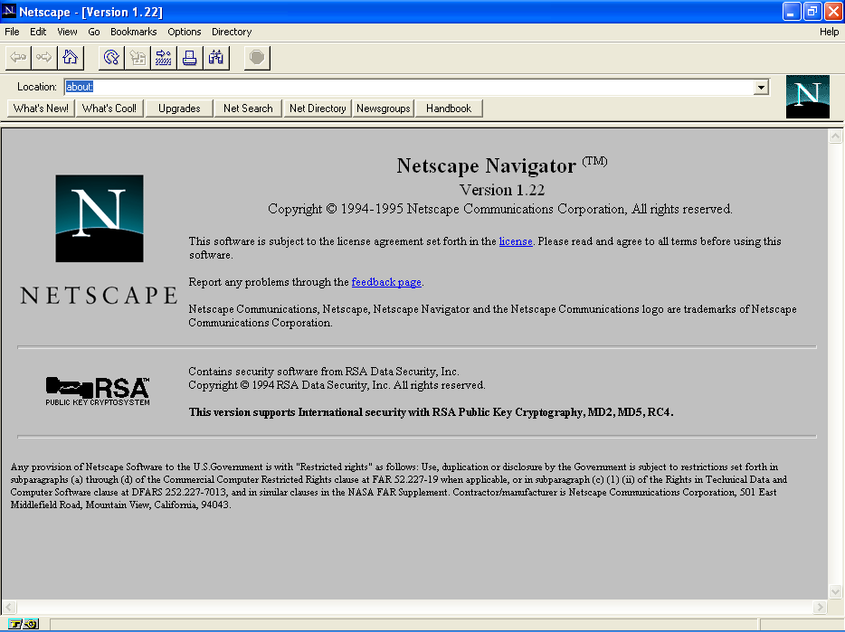

*圖片來源：[維基共享資源「Netscape Navigator 1.22 Screenshot.png」](https://commons.wikimedia.org/wiki/File:Netscape_Navigator_1.22_Screenshot.png)，作者 Indolering，授權 CC0（公眾領域）*

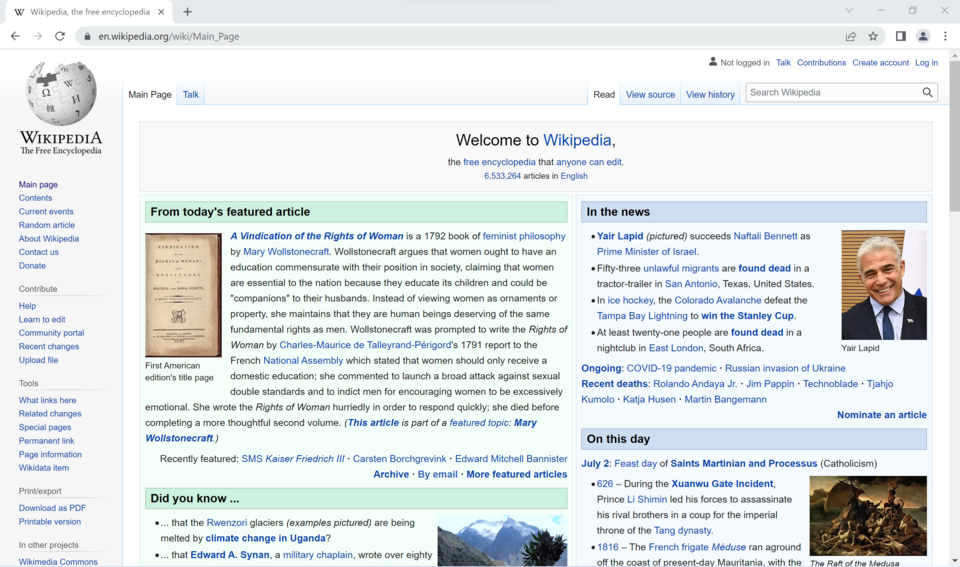

*圖片來源：[維基共享資源「Google Chrome on Windows 11.png」](https://commons.wikimedia.org/wiki/File:Google_Chrome_on_Windows_11.png)，作者 Megamanfan3，授權 CC BY-SA 4.0*

這麼多瀏覽器，背後其實只由少數幾種 **[瀏覽器引擎（Browser Engine，又稱排版引擎）](https://zh.wikipedia.org/wiki/排版引擎)** 驅動——瀏覽器引擎是真正負責「解讀 HTML/CSS、把網頁畫出來」的核心元件。以 [Statcounter](https://gs.statcounter.com/browser-market-share) 統計的 2026 年 6 月全球瀏覽器市佔為例，就能看出引擎的集中程度：

- **[Blink](https://zh.wikipedia.org/wiki/Blink)**（Google 主導）：Chrome（約 69.7%）、Edge（約 5.2%）、Samsung Internet、Opera 等 Chromium 系瀏覽器都採用它，合計約佔 **78%**。
- **[WebKit](https://zh.wikipedia.org/wiki/WebKit)**（Apple）：Safari 使用，也是 iPhone/iPad 上所有瀏覽器的共同基礎，約佔 **15%**。
- **[Gecko](https://zh.wikipedia.org/wiki/Gecko)**（Mozilla）：Firefox 使用，是目前少數仍獨立發展的引擎，約佔 **3%**。

換算下來，光是 Blink 與 WebKit 就涵蓋了全球九成以上的網頁瀏覽。由於多數瀏覽器共用相同引擎，網頁開發者只要針對這幾種引擎測試，就能確保網站在大部分裝置上呈現一致。

正因為瀏覽器跨平台、免安裝、人人都有，前面提過的工業 Web-based 監控系統才得以「寫一次、到處都能開」——工程師不論用哪種裝置，只要打開瀏覽器輸入網址，就能看到相同的生產儀表板。

### 4. 瀏覽器運作基本流程

當你在瀏覽器輸入一個網址並按下 Enter，背後發生了一系列複雜的步驟：

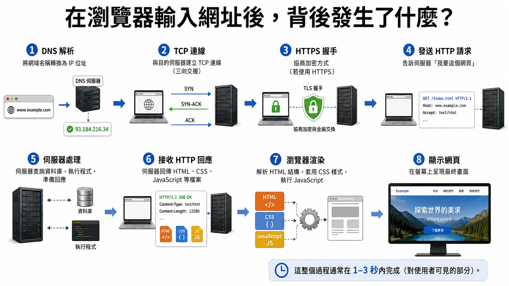

*本圖由 ChatGPT 生成，已由作者審核內容正確性*

這整個過程通常在 1–3 秒內完成（對使用者可見的部分）。

### 5. 用戶端與伺服器（Client-Server）

WWW 運作在 **[用戶端—伺服器（Client-Server）](https://zh.wikipedia.org/wiki/主從式架構)** 架構之上：**用戶端（Client）** 是提出請求的一方（你的瀏覽器），**伺服器（Server）** 是回應請求、提供服務的一方（網站的主機）。

這種架構有清楚的職責分工：用戶端負責呈現介面與接受使用者操作，伺服器負責儲存資料與執行業務邏輯。同一個伺服器可以同時服務數千甚至數百萬個用戶端，這正是雲端服務能夠大規模提供服務的基礎。工廠的 MES 與 SCADA 近年也大量改用這種架構——工程師開瀏覽器輸入內部網址就能看到即時儀表板，不必在每台電腦安裝專用軟體，系統要更新時也只需要動伺服器那一端。

---

## 十八、網址與網域名稱系統（DNS）

### 1. URL 結構

**[URL（Uniform Resource Locator，統一資源定位器）](https://zh.wikipedia.org/wiki/統一資源定位符)** 是在網際網路上精確定位某一資源（網頁、檔案、服務）的標準格式，俗稱「網址」，也是前一節提到的 WWW 三大技術標準之一。一個完整的 URL 由幾個部分組成：

- **協定（Protocol）**：說明使用哪種通訊方式存取資源。`http://` 是未加密的[超文字傳輸協定](https://zh.wikipedia.org/wiki/超文本傳輸協定)；`https://` 是加密版本（[Hypertext Transfer Protocol Secure](https://zh.wikipedia.org/wiki/HTTPS)），現代網站應全面採用 HTTPS
- **網域名稱（Domain Name）**：人類可讀的主機識別名稱，如 `www.google.com`
- **路徑（Path）**：伺服器上的資源位置，如 `/products/item`
- **查詢參數（Query Parameters）**：傳遞給伺服器的額外資訊，如 `?id=123`

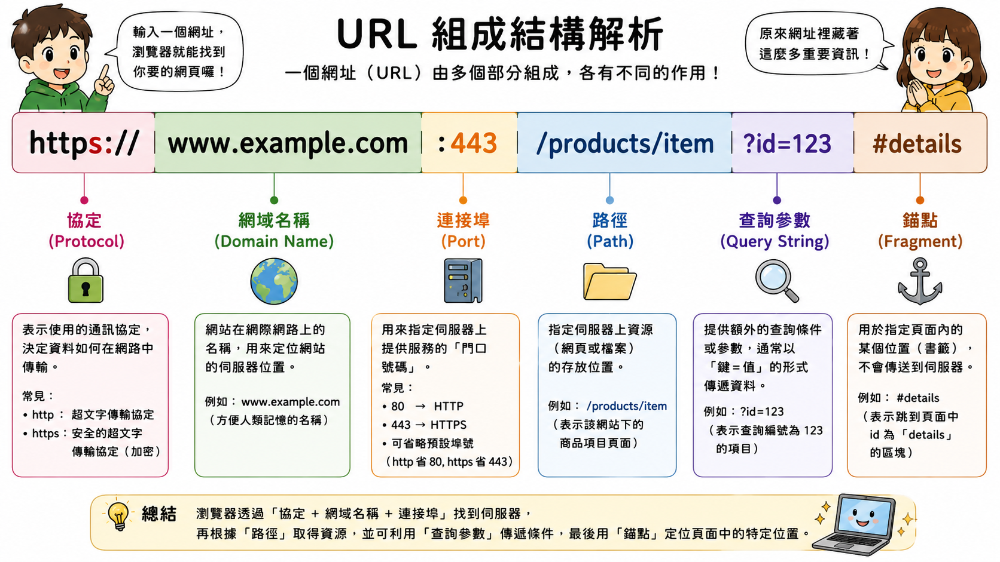

*本圖由 ChatGPT 生成，已由作者審核內容正確性*

### 2. DNS 的角色

電腦在網路上只認識 IP 位址，不認識 `www.google.com` 這樣的網域名稱。**[DNS（Domain Name System，網域名稱系統）](https://zh.wikipedia.org/wiki/網域名稱系統)** 扮演的就是「網際網路的電話簿」角色：將人類好記的網域名稱，轉換為電腦能識別的 IP 位址。整個 DNS 解析過程通常在數十毫秒內完成，對使用者幾乎是無感的。

DNS 的價值其實不只是「好記」，更在於它多了一層 **間接**：工廠的 IIoT 閘道器設定裡寫的是 `iot.us-east-1.amazonaws.com`，而不是一組 IP。哪天雲端業者換了伺服器、IP 變了，設備端一行設定都不必動——這對散佈在廠區各角落、動輒上百台的設備來說，是省下大量維護工時的關鍵設計。

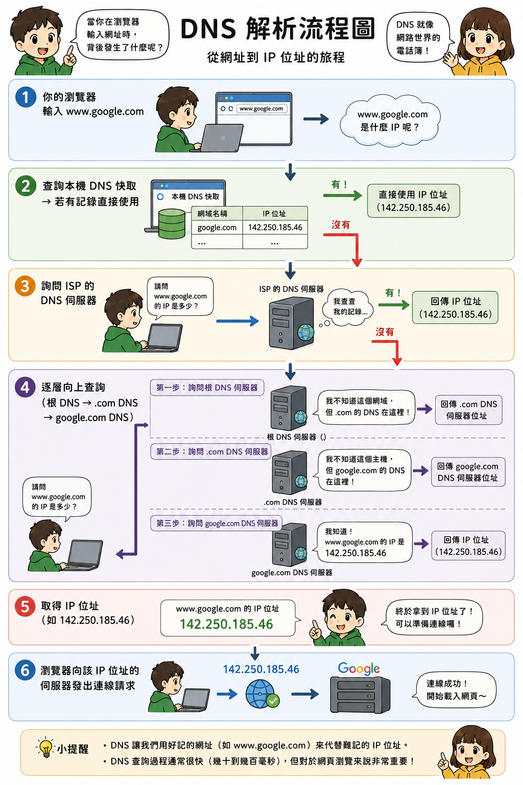

*本圖由 ChatGPT 生成，已由作者審核內容正確性*

> **趣味小知識**：你或許看過 `8.8.8.8` 這組 IP 位址——它是 Google 提供的免費公用 DNS 伺服器。當年 Google 特地爭取到這組「四個 8」的位址，就是看中它極度好記（8 在華人文化裡還格外吉利）。當你覺得電信業者的 DNS 太慢，把電腦或路由器的 DNS 改成 `8.8.8.8`，往往能讓網頁「查地址」的速度變快一些，是很多人上網的第一個小撇步。

---

## 十九、當代常見的網際網路服務

前面介紹了全球資訊網（WWW）與瀏覽器。事實上，WWW 只是眾多網際網路服務的一種——我們日常「上網」所做的每一件事，背後都是某種 **網際網路服務（Internet Service）**，它們都建立在相同的 TCP/IP 基礎之上，卻各自針對不同需求，發展出不同的協定與使用型態。本節綜覽當代常見的網際網路服務，並深入介紹在工業與個人場景都日益重要的 VPN，以及這些服務全面走向 HTTPS 加密的共同趨勢。

### 1. 網際網路服務百花齊放

今天的網際網路早已不只是瀏覽網頁，常見的服務類型包括：

| 服務類型 | 用途說明 | 常見例子 |
| --- | --- | --- |
| 全球資訊網（WWW） | 以瀏覽器點擊超連結瀏覽網頁與網路應用 | 各類網站、網頁版應用系統 |
| 電子郵件 | 非即時的訊息與檔案往來 | Gmail、Outlook |
| 即時通訊與社群 | 即時文字、語音、影像交流 | LINE、WhatsApp、Facebook |
| 串流影音 | 邊下載邊播放的影音內容 | YouTube、Netflix、Spotify |
| 雲端服務 | 雲端儲存、線上文件、雲端運算平台 | Google Drive、Microsoft 365、AWS |
| 檔案傳輸 | 在裝置與伺服器間搬移檔案 | 雲端硬碟、FTP |
| VPN（虛擬私人網路） | 在公共網路上建立加密的私密通道 | 企業 VPN、消費型 VPN |

對工業工程管理而言，這些服務同樣無所不在：企業以雲端服務部署 ERP、MES；工廠以即時通訊工具推播設備警報；管理層透過網頁儀表板查看 KPI；跨廠資料則常透過 VPN 安全傳輸。理解各種服務的特性，有助於在導入工業資訊系統時，選對合適的工具與傳輸方式。

### 2. VPN——在公共網路上打造安全通道

在上述服務中，**[VPN（虛擬私人網路，Virtual Private Network）](https://zh.wikipedia.org/wiki/虛擬私人網路)** 較為特別：它本身不提供內容，而是 **為其他連線提供一層安全保護**。前面介紹廣域網路時，曾提到 VPN 是連接分支機構的常見選擇（見〈六、2. WAN 概念與應用〉）；隨著遠端工作與 OT/IT 整合普及，VPN 已成為當代網路的核心工具，值得進一步認識。

**VPN 解決什麼問題？** 網際網路是公開的環境，資料在傳輸途中可能被攔截或竊聽（也就是後面〈二十一、當代網路議題〉會談到的中間人攻擊）。若要讓遠端員工或分支工廠安全地存取企業內部資源，拉一條實體專線既昂貴又缺乏彈性。VPN 的做法是：**在公共的網際網路之上，建立一條經過加密的「虛擬專線」**，讓資料彷彿走在一條只有通訊雙方看得懂的私密通道裡，即使被第三方攔截，看到的也只是無法解讀的密文。

**運作原理：通道化與加密。** VPN 的核心是兩項技術的結合：

- **通道化（Tunneling）**：把原本的資料封包再包上一層 VPN 專用的封包外殼（稱為封裝，Encapsulation），如同把信件再裝進一個不透明的公文袋，外人只看得到公文袋、看不到裡面的信。
- **加密（Encryption）**：對封裝後的內容進行加密，只有持有正確金鑰的兩端才能解密還原，確保途中即使被截取也無法被讀取或竄改。

**兩種常見部署方式：**

- **遠端存取 VPN（Remote Access VPN）**：讓「個別使用者」的裝置連回公司內網，適合出差員工、在家工作者或需要遠端登入的工程師。
- **站對站 VPN（Site-to-Site VPN）**：讓「兩個網路」整體互聯，例如把海外工廠的區域網路與總部內網連成一體，員工感覺就像在同一個內網中工作。

**常見的 VPN 協定：** 早期以 **[IPsec](https://zh.wikipedia.org/wiki/IPsec)**（運作於網路層，常用於站對站）與 **[SSL/TLS VPN](https://zh.wikipedia.org/wiki/傳輸層安全性協定)**（透過瀏覽器即可使用，部署方便）為主流；近年輕量、高效能的 **[WireGuard](https://zh.wikipedia.org/wiki/WireGuard)** 也快速普及。

**工業應用：設備遠端維護與跨廠連線。** VPN 在智慧製造中扮演關鍵角色：設備供應商可透過 VPN 安全地遠端登入客戶工廠的機台進行診斷與韌體更新，省去到場的時間與成本；跨國企業以站對站 VPN 串連各地工廠的 MES 與 ERP 資料；工程師出差在外時，也能透過遠端存取 VPN 安全連回廠內系統監看產線。不過要特別注意：VPN 打通了外部與內部網路的通道，等於在原本隔離的 OT 網路上開了一扇門，因此必須搭配最小權限原則、多因素驗證與存取稽核等資安措施（詳見後面〈二十一、當代網路議題〉），避免這條「安全通道」反而成為攻擊者入侵工業控制系統的破口。

**消費型 VPN 與企業 VPN 有何不同？** 你可能在網路廣告上看過 **[NordVPN](https://nordvpn.com/)、[ExpressVPN](https://www.expressvpn.com/)、[Surfshark](https://surfshark.com/)** 之類的 VPN 服務，它們底層用的通道化與加密技術，和企業 VPN 其實是同一套概念，但 **使用目的與連線方向正好相反**。企業 VPN 的目的是「連進去」——把遠端使用者或分支機構安全地接回公司內部網路，重點在於保護與存取內部資源；消費型 VPN 的目的則是「繞出去」——把個人裝置的流量先加密送到服務商在世界各地的伺服器，再由該伺服器代替你連上目標網站，藉此隱藏真實 IP 與所在地、避免在公共 Wi-Fi 上被竊聽，或存取有地區限制的內容。

| 比較面向 | 企業 VPN | 消費型 VPN（如 NordVPN） |
| --- | --- | --- |
| 主要目的 | 安全存取公司內部資源 | 隱藏身分、保護隱私、跨區存取 |
| 連線方向 | 連回「自己公司」的內網 | 繞經「服務商」的伺服器再上網 |
| 建置者 | 企業自行架設與管理 | 向第三方服務商付費訂閱 |
| 主要使用者 | 員工、分支機構、設備供應商 | 一般個人消費者 |
| 信任對象 | 自家公司的 IT 部門 | 外部 VPN 服務商 |

要提醒的是，使用消費型 VPN 等於把你所有的網路流量都交給該服務商，因此它是否真正遵守「不記錄使用紀錄（No-log）」的承諾就非常關鍵——選擇時應留意服務商的信譽與所在國的法規。

### 3. 共同趨勢：全面走向 HTTPS 加密

觀察上述各種服務，會發現它們有一個共同的演進方向：**通訊內容全面加密，而其中最具代表性的協定就是 HTTPS**。

**[HTTPS（HyperText Transfer Protocol Secure）](https://zh.wikipedia.org/wiki/超文本傳輸安全協定)** 就是在原本的 HTTP 之上，加上一層 **[TLS（Transport Layer Security，傳輸層安全性協定）](https://zh.wikipedia.org/wiki/傳輸層安全性協定)** 加密。它同時做到兩件事：**加密**（傳輸內容變成密文，途中被攔截也無法解讀）與 **驗證**（透過憑證確認你連上的確實是正牌網站，而非釣魚假站）。瀏覽器網址列上的那把「鎖頭」符號，代表的就是這條連線已受 HTTPS 保護。

過去 HTTPS 只用在登入、付款等敏感頁面；如今則成為所有網站的 **預設標準**。這個轉變背後有幾股推力：主流瀏覽器會把仍使用 HTTP 的網站明白標示為「不安全」；[Let's Encrypt](https://letsencrypt.org/) 等機構提供免費憑證，大幅降低了架設 HTTPS 的門檻；搜尋引擎也對 HTTPS 網站給予排名優勢。

而且這股「預設加密」的趨勢不只發生在網頁：電子郵件改用加密連線收發、應用程式與雲端服務之間的 API 幾乎一律走 HTTPS、前面介紹的 VPN 也大量採用同一套 TLS 技術。可以說，**加密已從「特殊需求」變成「基本配備」**。對工業應用而言，這一點尤其重要：工廠設備上傳資料到雲端平台、MES 與 ERP 之間的系統串接、行動 App 存取生產資料，如今幾乎都要求以 HTTPS／TLS 加密傳輸，才能確保生產機密與營運資料在公開網路上不被竊取或竄改。

---

## 二十、行動裝置與網際網路

### 1. 行動網路與 App 生態

智慧型手機的普及，徹底改變了人類使用網際網路的方式。透過行動數據網路（4G/5G）或 Wi-Fi，手機隨時隨地都能連線，催生了豐富的 **App 生態系**：每個 App 都是一個針對行動裝置最佳化的軟體，提供從社群媒體、電子商務到工業監控的各種服務。

行動裝置的普及也帶動了 **API（Application Programming Interface，應用程式介面）** 經濟的興起：不同的 App 和服務透過 API 相互呼叫，形成服務之間互相整合的生態系統。例如，工廠的 MES App 可以透過 API 呼叫 ERP 系統取得訂單資料，再透過另一個 API 呼叫天氣服務取得氣象預報，輔助生產排程決策。

### 2. 即時資料與邊緣應用

行動裝置不只是資料的「消費者」，也可以是資料的「蒐集者」。現代智慧型手機配備了 GPS、加速度計、攝影機、麥克風等多種感測器，使其成為強大的行動感測平台。

在工業場合，**[邊緣運算（Edge Computing）](https://zh.wikipedia.org/wiki/邊緣運算)** 的概念越來越重要：部分資料處理任務不傳回中央伺服器，而是在行動裝置或現場裝置上直接完成，以降低延遲並減少網路頻寬需求（Shi et al., 2016）。例如，工廠巡檢人員的手機 App 可以利用本機的 AI 模型，對著設備拍照後立即判斷是否有異常，而不需要先上傳照片到雲端再等待回傳結果。

走進工廠車間的行動裝置，往往不是你我口袋裡那支手機，而是符合 **IP67 防塵防水等級** 的工業平板——車間有油污、粉塵、切削液噴濺，一般手機撐不了多久。工人用它掃條碼報工，維護工程師用它在機台旁調閱歷史資料與操作手冊。

---

## 二十一、當代網路議題

### 1. 網路安全（資安基本概念）

隨著網路連線的普及，**資訊安全（Cybersecurity）** 成為所有組織必須認真對待的議題。常見的網路威脅包括：

- **[惡意軟體（Malware）](https://zh.wikipedia.org/wiki/惡意軟體)**：病毒、木馬、[勒索軟體](https://zh.wikipedia.org/wiki/勒索軟體)等，入侵裝置後竊取資料或加密勒索
- **[釣魚攻擊（Phishing）](https://zh.wikipedia.org/wiki/網路釣魚)**：偽裝成可信任的寄件者，誘騙使用者洩漏帳號密碼或點擊惡意連結
- **[阻斷服務攻擊（DDoS）](https://zh.wikipedia.org/wiki/阻斷服務攻擊)**：大量的偽造請求淹沒目標伺服器，使其無法正常服務合法使用者
- **[中間人攻擊（Man-in-the-Middle）](https://zh.wikipedia.org/wiki/中間人攻擊)**：攻擊者暗中攔截通訊雙方的資料，竊聽或竄改

基本的個人資安防護措施：使用強密碼並定期更換、啟用[多因素驗證（MFA）](https://zh.wikipedia.org/wiki/多重要素驗證)、定期更新作業系統與軟體、不隨意點擊可疑連結、使用 HTTPS 加密的網站。

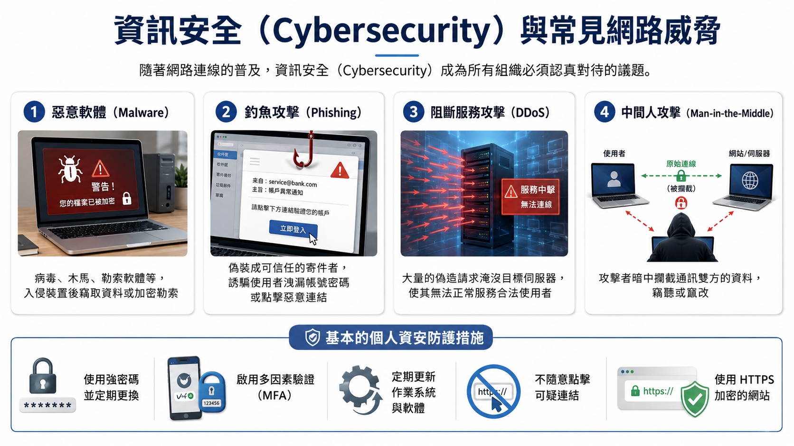

*本圖由 ChatGPT 生成，已由作者審核內容正確性*

### 2. 工業控制系統（ICS）安全

**[工業控制系統（Industrial Control System，ICS）](https://zh.wikipedia.org/wiki/工業控制系統)** 的資安（稱為 OT Security）是製造業面臨的獨特挑戰。傳統上，工業控制系統與外部網路實體隔離，被認為天然安全；但工業4.0推動的 OT/IT 整合，讓工業控制系統越來越多連接到企業網路乃至網際網路，使其暴露於更多的資安風險。

工業控制系統一旦遭受攻擊，後果遠比辦公室電腦被駭嚴重：機台控制異常可能造成產品報廢、設備損毀，甚至人員傷亡。2010年的 [Stuxnet（震網）](https://zh.wikipedia.org/wiki/震網)事件（針對核電設施 PLC 的蠕蟲攻擊）是工業資安史上的重大警示。

工業資安的基本防護原則包括：網路隔離（IT 網路與 OT 網路分開，中間設防火牆）、最小權限原則（每個帳號只有執行其工作所需的最低權限）、定期稽核（記錄並審查所有系統存取行為）、員工教育訓練。

### 3. 資料隱私與保護

網際網路上的資料傳輸與儲存，涉及大量的個人資料與企業機密。**資料隱私（Data Privacy）** 保護的是個人對自己資料的控制權；**資料保護（Data Protection）** 則是確保資料不被未授權的人存取或使用。

各國已陸續制定相關法規，如歐盟的 **[GDPR（一般資料保護規則）](https://zh.wikipedia.org/wiki/一般資料保護規範)**、台灣的 **個人資料保護法**，要求企業在蒐集、處理、使用個人資料時，必須取得當事人同意、說明用途、確保安全儲存，並在不再需要時予以刪除。

### 4. 網路壅塞、效能與數位落差

**網路壅塞（Network Congestion）** 發生在網路節點需要處理的資料量超過其容量時，導致封包延遲甚至遺失。在工業環境中，若大量的感測器同時上傳資料（如換班時大量設備同時回報狀態），可能造成網路瞬間壅塞，影響即時監控的即時性。

**數位落差（Digital Divide）** 是指不同地區、不同群體之間在網路存取能力上的差距。在製造業供應鏈的角度，部分供應商因地處偏遠或規模較小而缺乏可靠的高速網路，可能成為供應鏈數位化的瓶頸。Starlink 這類 LEO 衛星網路，讓地處偏遠、拉不到光纖的供應商也能接上高速網路，正在把這道地理落差補起來。

---

## 第三篇：整合觀點（Network + Internet + 工業4.0）

---

## 二十二、從設備到雲端的資料流

### 1. 完整的資料旅程

在工業4.0情境中，一筆感測器資料從產生到最終支援管理決策，要歷經多個層次的網路傳輸。以工廠內一台 CNC 加工機床的主軸溫度感測器為例：

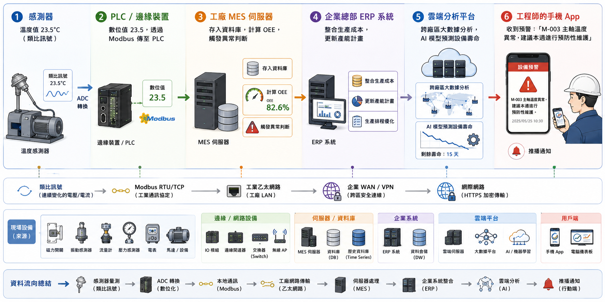

*本圖由 ChatGPT 生成，已由作者審核內容正確性*

每一個箭頭都代表一段網路傳輸，使用了不同的網路類型（工廠 LAN、企業 WAN、公共網際網路）與不同的協定（Modbus、TCP/IP、HTTPS）。

### 2. 資料整合的挑戰

在實際工廠中，這條資料旅程面臨幾個常見的挑戰：**協定異構**（不同廠商的設備說不同的工業語言，需要閘道器轉換）；**網路可靠性**（工廠環境的電磁干擾可能造成訊號不穩）；**資安邊界**（工廠內網與企業外網的交界需要嚴格管控）；**資料時序**（來自不同設備的資料需要統一時間戳記，才能做有意義的關聯分析）。

---

## 二十三、智慧製造網路架構（概念性）

### 1. 四層架構

前一節追的是「一筆資料」的旅程——它從感測器出發，一路走到雲端。這一節則把那趟旅程凝結成一張靜態的架構圖：**同樣的東西，一個是動態的過程，一個是分層的地圖**。工廠裡的網路規劃、設備採購與資安邊界，談的都是這張地圖。

現代智慧工廠的網路與資訊架構，通常以「四層」模型（Four-Layer Architecture）來描述，從底層的物理設備到頂層的雲端分析，每一層有其專屬的功能與通訊需求。這套分層並非本教材獨創，它脫胎自製造業行之有年的 **自動化金字塔（Automation Pyramid）**，正式的標準依據是國際標準 **ISA-95（對應國際電工委員會標準 IEC 62264）** 與 1990 年代的 **普渡企業參考架構（Purdue Enterprise Reference Architecture，PERA，俗稱普渡模型）**（Williams, 1994; Groover, 2019）。以下由下而上介紹四層，各層並附上常見的英文名稱：

**第一層：現場層／設備層（Field Level）**

這是最接近物理世界的一層，包含生產機台、感測器、致動器、機器人等實體設備。這一層的通訊特點是：**即時性要求極高**（毫秒甚至微秒級）、資料量大但每筆資料小、使用工業專用通訊協定（Modbus、PROFIBUS、[EtherNet/IP](https://zh.wikipedia.org/wiki/EtherNet/IP)）。

**第二層：控制層（PLC / SCADA 層，Control Level）**

PLC 從現場層設備蒐集感測資料，執行即時控制邏輯，並將資料彙整後向上傳送。SCADA 系統在這一層提供操作員的監控介面。通訊需求仍需要低延遲，但可容許稍多的資料量，使用工業乙太網路（[PROFINET](https://zh.wikipedia.org/wiki/PROFINET)、EtherNet/IP）。

**第三層：管理層（MES / ERP 層，Management Level）**

這一層由 MES（製造執行系統）與 ERP（企業資源規劃）等企業應用系統組成，負責把現場上來的生產資料轉成管理者看得懂的資訊。從網路的角度看，它的特徵是使用標準的 TCP/IP 企業網路，延遲要求相對寬鬆（秒級）——這與下面兩層錙銖必較的毫秒級要求，是完全不同的世界。

> **延伸閱讀**：本節只從「網路分層」的角度看待 MES 與 ERP；這些系統各自的完整功能、代表產品與資料庫技術，請見 [05-Information-Systems-and-Database.md](05-Information-Systems-and-Database.md)〈三、企業應用系統〉。

**第四層：雲端層（分析與決策層，Cloud Level）**

雲端平台接收來自管理層的生產資料，執行跨廠區的大數據分析、AI 模型訓練與推論（預測性維護、需求預測）、企業級儀表板呈現。這一層透過網際網路連接，使用 HTTPS、[MQTT](https://zh.wikipedia.org/wiki/MQTT) 等標準網路協定。

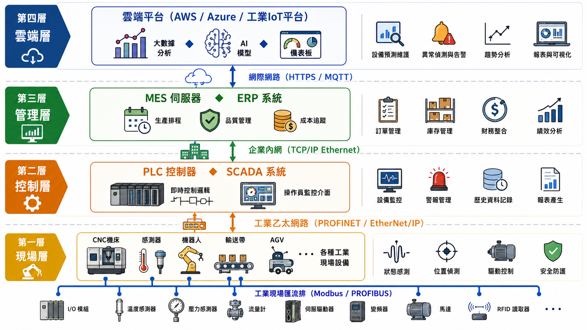

*本圖由 ChatGPT 生成，已由作者審核內容正確性*

> **補充小知識：這套四層架構的來歷——自動化金字塔與 ISA-95**
>
> 本節的四層模型並非本教材獨創，而是脫胎自製造業沿用數十年的 **自動化金字塔（Automation Pyramid）**。這座金字塔的正式標準依據，是國際標準 **ISA-95**（由國際自動化學會 ISA 制定，國際上對應 IEC 62264 標準），其思想又可追溯到 1990 年代的 **普渡企業參考架構（Purdue Enterprise Reference Architecture，PERA）**（Williams, 1994; International Society of Automation, 2010）。
>
> 嚴格來說，ISA-95 原始的金字塔分為 **五級（Level 0～4）**：Level 0 是物理製程、Level 1 是感測器與致動器、Level 2 是 PLC 與 SCADA、Level 3 是 MES、Level 4 是 ERP。本節的四層是它的簡化與現代化版本——把 Level 0～1 併為「現場層」、Level 2 對應「控制層」、Level 3～4 併為「管理層」，並在最上面新增了 ISA-95 原本沒有的 **「雲端層」**，以涵蓋工業4.0之後才興起的跨廠區大數據與 AI 分析。換句話說，你在不同教科書或廠商文件上看到的「四層」「五層」畫法，源頭其實是同一座金字塔，只是切法與新舊詳略不同。

> **補充小知識：另一套說法——物聯網的三層架構**
>
> 你在物聯網（IoT）的文獻或廠商簡報中，可能會看到另一套「**感知層、網路層、應用層**」的三層說法。它與這裡的四層架構描述的是同一件事，只是切法不同：
>
> | IoT 三層架構 | 本節的四層架構 |
> | --- | --- |
> | 感知層 | 現場層 ＋ 控制層 |
> | 網路層 | （不對應任何單一層，見下） |
> | 應用層 | 管理層 ＋ 雲端層 |
>
> 兩者最大的差異在於「網路層」。三層說法把網路平列為一層，但從上面那張圖可以看出來，網路其實 **不是某一層，而是貫穿在每兩層之間**——現場層與控制層之間跑 Modbus，控制層與管理層之間跑 PROFINET，管理層與雲端層之間跑 HTTPS/MQTT。四層架構把網路畫在層與層的接縫上，更貼近工廠的實際樣貌，也更接近製造業慣用的「自動化金字塔」語言。兩種說法都會遇到，知道它們在講同一件事就不會混淆。

---

## 二十四、工業4.0中的網路角色

### 1. 即時連線（Real-time Connectivity）

工業4.0的核心承諾之一，是讓製造系統中的每個元素（機台、零件、人員、訂單）都能夠即時感知彼此的狀態，並根據最新資訊做出協調。這種 **即時連線能力** 是所有其他工業4.0技術的基礎。

沒有可靠的即時網路連線，預測性維護的感測資料無法即時回傳、AGV 無法與生產排程系統即時協調、數位孿生無法即時反映實體設備的狀態。**網路品質（頻寬、延遲、可靠性）直接決定了工業4.0系統能夠達到的能力上限**。

### 2. 資料驅動決策（Data-Driven Decision Making）

在傳統工廠，決策往往依賴管理者的經驗判斷，輔以定期（日報、週報）的統計數字。工業4.0透過網路實現的資料即時蒐集與傳輸，使得 **決策依據從「歷史統計」轉向「即時資料」**。

一個典型的轉變：以前工廠每個月統計一次設備的稼動率，下個月才能知道上個月的問題；現在透過即時監控網路，管理者在問題發生的當下就收到警報，能在幾分鐘內啟動應對措施，而不是等到月底報告才發現問題。

### 3. 系統整合（Integration）

工業4.0的另一個核心是 **水平整合**（同一工廠內各系統之間的整合）與 **垂直整合**（從現場設備到雲端管理平台的整合）。網路是實現這些整合的媒介（Lee et al., 2015）。

**水平整合範例**：倉儲系統察覺某物料庫存低於安全庫存，透過網路自動觸發 ERP 的採購申請，同時通知生產排程系統調整生產優先序。這一系列的自動化協調，全靠系統間的網路連線與資料交換。

**垂直整合範例**：現場感測器的溫度異常，經由 PLC 判斷後立即調整製程參數（毫秒級），同時將事件記錄透過 MES 存入資料庫（秒級），最終在雲端平台觸發預測模型重新評估（分鐘級）。三個層次的反應，分別在不同的時間尺度下發生，共同確保製程品質。

> **小結**：網路不只是工業4.0的「配件」，而是使能工業4.0的核心基礎設施。理解不同網路技術的特性（速度、延遲、可靠性、覆蓋範圍、成本），是工業工程管理者在規劃與評估智慧製造系統時不可或缺的知識。

---

## 二十五、學習重點總結

讀完本章後，你應該能夠理解以下核心概念，並將其應用於工業場域的思考與決策：

**網路（Network）是連線技術與架構**

從網路拓樸的選擇（星狀、匯流排、環狀、網狀）、硬體設備的功能（NIC、交換器、路由器、閘道器），到有線（乙太網路）與無線（Wi-Fi、藍牙、Zigbee、LoRaWAN）的技術特性，再到 5G 與 LEO 衛星等新興連線技術——這些構成了支撐現代工廠智慧化的實體基礎。

**網際網路（Internet）是跨網路的全球通訊系統**

網際網路的本質是「網路的網路」，靠 TCP/IP 協定族讓全球不同系統能夠溝通。理解封包交換的概念、TCP（可靠）與 UDP（快速）的取捨、IP 位址的定址機制、DNS 的名稱解析，以及 WWW 的超文字架構，有助於理解工業系統如何安全地連接到雲端服務。

**封包、協定與 IP 位址的基本概念**

資料在網路上以「封包」的形式傳輸，每個封包都攜帶目的地 IP 位址，由路由器逐跳轉發。協定是通訊的共同語言，分層設計讓複雜的網路功能變得可管理。這些概念是理解任何網路系統行為的基礎。

**現代網路如何支撐工業4.0與智慧製造**

從感測器的 LoRaWAN 低功耗連線、到 PLC 的工業乙太網路、到 MES 的企業內網、到雲端平台的網際網路連線——工業4.0的「垂直整合」依賴不同層次的網路技術協同運作。5G 私有網路的超低延遲，正在使以往不可能的即時工業控制成為現實。

**網路技術如何影響生產、物流與管理決策**

RFID 讓倉儲盤點從數天縮短為數小時；行動監控 App 讓管理者隨時掌握全球工廠狀況；LEO 衛星讓偏遠地區的工廠也能接入工業 IoT 平台；OT 資安的防護確保生產控制系統不受外部攻擊威脅。網路技術的選擇，直接影響企業的競爭力與風險管理能力。

> **銜接提示**：本章介紹的四層網路架構、工業通訊協定與 OT/IT 整合，會在全課程最後的 [06-Data-Science-AI-and-Smart-Manufacturing.md](06-Data-Science-AI-and-Smart-Manufacturing.md)〈五、工業4.0與智慧製造：把整條技術鏈放進工廠〉中，與計算機結構、程式設計、資訊系統、資料科學一起，整合成一個完整的智慧工廠案例。屆時你會看到，這些看似各自獨立的網路技術，是如何在一條真實產線上同時運作的。

---

## 參考文獻

- Abbate, J. (1999). *Inventing the Internet*. MIT Press.
- Ashton, K. (2009, June 22). That 'Internet of Things' thing. *RFID Journal*. https://www.rfidjournal.com/that-internet-of-things-thing
- Atzori, L., Iera, A., & Morabito, G. (2010). The Internet of Things: A survey. *Computer Networks, 54*(15), 2787–2805. https://doi.org/10.1016/j.comnet.2010.05.010
- Berners-Lee, T., Cailliau, R., Luotonen, A., Nielsen, H. F., & Secret, A. (1994). The World-Wide Web. *Communications of the ACM, 37*(8), 76–82. https://doi.org/10.1145/179606.179671
- Cerf, V. G., & Kahn, R. E. (1974). A protocol for packet network intercommunication. *IEEE Transactions on Communications, 22*(5), 637–648. https://doi.org/10.1109/TCOM.1974.1092259
- Comer, D. E. (2015). *Computer networks and internets* (6th ed.). Pearson.
- Forouzan, B. A. (2013). *Data communications and networking* (5th ed.). McGraw-Hill.
- Groover, M. P. (2019). *Automation, production systems, and computer-integrated manufacturing* (5th ed.). Pearson.
- International Society of Automation. (2010). *ANSI/ISA-95.00.01-2010: Enterprise-control system integration — Part 1: Models and terminology*. ISA.
- Kurose, J. F., & Ross, K. W. (2021). *Computer networking: A top-down approach* (8th ed.). Pearson.
- Laudon, K. C., & Laudon, J. P. (2022). *Management information systems: Managing the digital firm* (17th ed.). Pearson.
- Lee, J., Bagheri, B., & Kao, H.-A. (2015). A cyber-physical systems architecture for Industry 4.0-based manufacturing systems. *Manufacturing Letters, 3*, 18–23. https://doi.org/10.1016/j.mfglet.2014.12.001
- Leiner, B. M., Cerf, V. G., Clark, D. D., Kahn, R. E., Kleinrock, L., Lynch, D. C., Postel, J., Roberts, L. G., & Wolff, S. (2009). A brief history of the Internet. *ACM SIGCOMM Computer Communication Review, 39*(5), 22–31. https://doi.org/10.1145/1629607.1629613
- Metcalfe, R. M., & Boggs, D. R. (1976). Ethernet: Distributed packet switching for local computer networks. *Communications of the ACM, 19*(7), 395–404. https://doi.org/10.1145/360248.360253
- Mockapetris, P. V., & Dunlap, K. J. (1988). Development of the Domain Name System. *ACM SIGCOMM Computer Communication Review, 18*(4), 123–133. https://doi.org/10.1145/52325.52338
- Peterson, L. L., & Davie, B. S. (2021). *Computer networks: A systems approach* (6th ed.). Morgan Kaufmann/Elsevier.
- Postel, J. (1981a). *Internet Protocol* (RFC 791). Internet Engineering Task Force. https://doi.org/10.17487/RFC0791
- Postel, J. (1981b). *Transmission Control Protocol* (RFC 793). Internet Engineering Task Force. https://doi.org/10.17487/RFC0793
- Shi, W., Cao, J., Zhang, Q., Li, Y., & Xu, L. (2016). Edge computing: Vision and challenges. *IEEE Internet of Things Journal, 3*(5), 637–646. https://doi.org/10.1109/JIOT.2016.2579198
- Stallings, W. (2016). *Data and computer communications* (10th ed.). Pearson.
- Stevens, W. R. (1994). *TCP/IP illustrated, Volume 1: The protocols*. Addison-Wesley.
- Tanenbaum, A. S., Feamster, N., & Wetherall, D. J. (2021). *Computer networks* (6th ed.). Pearson.
- Williams, T. J. (1994). The Purdue enterprise reference architecture. *Computers in Industry, 24*(2–3), 141–158. https://doi.org/10.1016/0166-3615(94)90017-5
- Xu, L. D., He, W., & Li, S. (2014). Internet of things in industries: A survey. *IEEE Transactions on Industrial Informatics, 10*(4), 2233–2243. https://doi.org/10.1109/TII.2014.2300753

---

*本教材為大一計算機概論課程用途，著重概念理解與工業應用情境，建議搭配實際案例討論、網路設備實機觀察，以及相關工業通訊標準的延伸閱讀，以加深理解與應用能力。*
