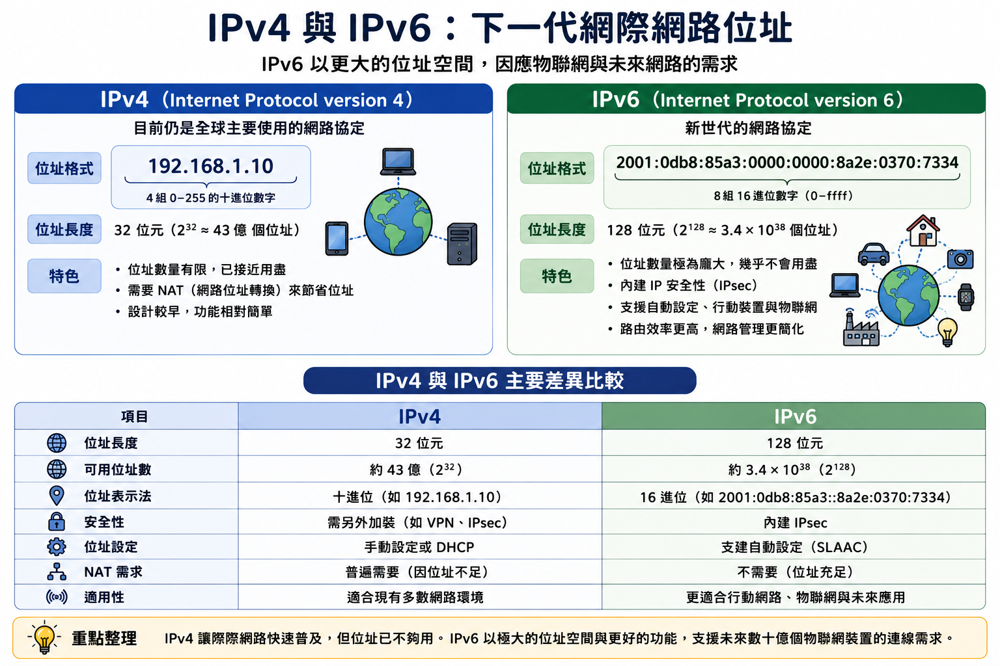

# 網路與網際網路

從連上宿舍 Wi-Fi，到工廠設備把資料送上雲端——理解資料如何在網路中流動

---

## 前言：從連上宿舍 Wi-Fi 談起

各位同學從出生開始就是網路世代，沒有網路，不只沒辦法玩電玩、和朋友線上交流，甚至無法線上購物、請假、查資料。

網路看似像家中水龍頭，一開機就有；但每次你打開筆電連上校園 Wi-Fi，短短幾秒內其實發生了許多事——基地台驗證密碼、分配 IP、DNS 翻譯網址、封包經過多個路由器逐一送達並重組顯示。

---

## 不懂網路，你可能會...

- 感測器突然無法傳資料到 MES，分不清是斷線、IP 衝突還是防火牆問題
- 規劃新廠房網路時，無法評估「這條線的頻寬夠不夠」
- 看到設備規格上的「MQTT」、「Modbus TCP」，不知道那代表什麼
- 廠商說「建議用工業乙太網路取代無線網路」，你無法判斷是否合理

---

## 懂網路，你可以...

- 理解 **IP 位址**、**子網路**、**路由器** 的基本概念，協助診斷工廠連線問題
- 知道 **封包** 如何從感測器傳到雲端，評估延遲的可能原因
- 理解常見 **工業通訊協定** 的用途，和設備廠商有效確認技術需求
- 規劃工廠 **物聯網（IoT）** 架構時，能提出有意義的問題

> **理解網路的核心價值：讓工業工程師看懂資料如何在工廠中流動，在智慧製造的規劃與問題排查中，說出有意義的話、問出有價值的問題**

---

## 你的動作 對應 網路概念

| 你的動作 | 對應的網路概念 |
|---------|--------------|
| 選擇 Wi-Fi 並輸入密碼 | 無線接取點（AP）的認證機制 |
| 等待連線圖示出現 | DHCP 協定分配 IP 位址 |
| 打開瀏覽器輸入網址 | DNS 將域名解析為 IP 位址 |
| 網頁開始載入 | TCP/IP 封包路由與傳輸 |
| 影片流暢播放 | 封包重組與串流解碼 |

---

## 課程主線定位

- 整門課只在講一件事：把 **資料** 有效處理成 **資訊**，再變成能支援決策的 **知識**
- 本章負責的是：讓資料流動起來——分散在裝置、廠區與企業的資料連起來，才能匯集成有用的資訊
- 讀的時候問自己：這項技術為什麼出現？解決了什麼問題？解決之後又帶出什麼新問題？

> **資料 → 資訊 → 知識，是整門課唯一的主軸。**

---

# 第一篇：網路（Network）——基礎架構與連線技術

---

# 一、網路基本概念

網路是把兩台以上的裝置連起來、交換資料的系統。這一章先釐清「網路」到底是什麼、能做什麼，再區分它和大家日常說的「網際網路」有何不同。

理解這個區分，是後續所有網路知識的地基。

---

## 什麼是網路？

**網路（Network）** 是兩台或以上的裝置，透過某種傳輸媒介（有線或無線）相互連接，以交換資料、共享資源的系統。

- 網路中每一個連接裝置稱為 **節點（Node）**：電腦、印表機、感測器、手機，甚至生產機台
- 最簡單的網路只有兩台電腦直接相連
- 最複雜的網路，是連結全球數十億台裝置的網際網路

> **不論規模大小，所有網路的核心目的都相同：讓裝置之間能夠溝通與共享**

---

## 網路的四項根本功能

- **資料傳輸（Data Transfer）**：把資訊從一個裝置傳到另一個，如感測器送量測值到控制系統
- **資源共享（Resource Sharing）**：多台裝置共用印表機、資料庫或軟體授權，降低成本
- **集中管理（Centralized Management）**：從單一位置監控、設定、更新多台遠端裝置
- **協同作業（Collaboration）**：不同地點的人即時存取同一份資料，共同完成工作

---

## 網路 v.s. 網際網路

Internet = inter-（之間）＋ network（網路），直譯就是「網路與網路之間」

| 面向 | 網路（Network） | 網際網路（Internet） |
| --- | --- | --- |
| 定位 | 把裝置連起來的系統 | 把眾多網路連起來的架構 |
| 範圍 | 局部（一棟建築、一個工廠） | 全球數十億台裝置 |
| 通訊協定 | 可自行選用 | 必須共同遵守 TCP/IP |
| 所有權 | 通常單一組織 | 無單一所有者 |

---

<!-- ## 網路與網際網路 -->


---

# 二、網路拓樸（Topology）

**網路拓樸** 描述網路中各節點如何相互連接的佈局方式，決定了網路的可靠性、擴充性、成本與維護難度。

實際工廠不會只用一種拓樸，而是混合搭配。以下四種不是四選一的考題，而是四種工具——重點在於：每一種各付出什麼代價、換到什麼好處。

---

<!-- ## 常見網路拓樸 -->


---

## 星狀拓樸（Star）

所有節點都連到一個中央裝置（通常是 **交換器**），彼此不直接相連，通訊都經中央轉發

- **優點**：任一節點故障不影響他人；新增節點容易；故障診斷簡單
- **缺點**：中央交換器是單點故障（SPOF）；纜線用量大

> **星狀是現代家庭、辦公室與工廠內部網路最常見的選擇，常見的 Wi-Fi 也是星狀**

---

## 匯流排拓樸（Bus）

所有節點共用一條主幹線，訊號沿線傳播，只有目標節點會處理

- **優點**：佈線簡單、成本低
- **缺點**：主幹線斷線即全線癱瘓；節點越多，碰撞與延遲越嚴重

早期乙太網路廣泛使用，今日一般辦公網路已少見，僅部分工業現場匯流排（Fieldbus）仍有應用

---

## 環狀與網狀拓樸

**環狀（Ring）**：每個節點只與前後相鄰節點連接，形成封閉環

- 資料傳輸時間可預測，對即時控制有優勢；但任一節點故障可能中斷整個環
- 用於工業通訊協定、電信骨幹網路（常佈雙向路徑以繞過斷點）

**網狀（Mesh）**：每個節點與多個節點直接相連，資料可走多條路徑

- 容錯性極高，適合關鍵基礎設施與工業無線感測網路；但佈線複雜、成本極高

---

# 三、網路硬體設備

拓樸是網路的「配置圖」，要落實成能運作的網路，得靠實體設備。

從一張巴掌大的網路卡，到機房整櫃的交換器、路由器與防火牆，各自扮演不同角色。以下介紹五種最基礎的設備：網路卡、交換器、路由器、存取點與閘道。

---


## 網路卡（NIC）

**網路介面卡（NIC）** 讓裝置能連接網路，把資料轉換為可傳輸的訊號

- 每台連網裝置都需配備 NIC，今日多已整合進主機板或晶片
- 每張 NIC 有全球唯一的 **MAC 位址**（48 位元，如 `3C:22:FB:A1:0D:5E`）
- MAC 位址像裝置的「身分證號碼」，用於區域網路中識別裝置

---


## 交換器（Switch）

**交換器** 是區域網路的核心連接裝置，提供多個連接埠讓裝置互通

- 會學習並記錄每個埠對應的 MAC 位址
- 只將資料送到目的裝置所在的埠，而非廣播給所有人
- 相較舊式集線器（Hub）的廣播，交換器精確傳送、效率更高

---


## 路由器（Router）

**路由器** 負責在 **不同網路之間** 轉發資料，是網際網路的核心設備

- 依封包中的 **IP 位址** 決定最佳轉發路徑
- 家用路由器其實一機三用：對外路由、Wi-Fi 存取（AP）、內部有線埠（交換器）
- 這也是為什麼「路由器」「AP」「分享器」常被混著講

---


## 存取點（Access Point，AP）

**無線存取點** 將有線網路延伸為無線，讓 Wi-Fi 裝置加入有線網路

- 嚴格意義的 AP 只負責無線訊號收發，**不含路由功能**
- 常用 **乙太網路供電（PoE）**：同一條線既傳資料也供電，省下拉電源的施工
- 大型場所部署數十上百台，由 **無線控制器（WLC）** 統一管理

---

## 閘道（Gateway）

**閘道** 是連接兩個使用 **不同通訊協定** 網路的橋梁，除了轉發還要做協定轉換

- 外觀常與路由器、交換器相似——**設備的區別不在長相，而在它負責做什麼事**
- 交換器看 MAC、路由器看 IP、閘道則要讀懂兩種協定並翻譯

> **工廠典型例子：PLC 用 Modbus／PROFIBUS，MES 用 TCP/IP，工業閘道器在中間翻譯，是工業4.0「OT/IT 整合」的關鍵硬體**

---

<!-- ## 常見網路硬體設備 -->


---

# 四、區域網路（LAN）

**區域網路（LAN）** 是在有限範圍內（一個房間、一棟建築、一個廠區）連接多台裝置的網路，特點是速度快、延遲低、管理集中。

這一章認識有線 LAN 的主流標準——乙太網路，以及如何用 VLAN 把網路切開以兼顧安全與可靠。

---


## 有線區域網路：乙太網路

**乙太網路（Ethernet）** 是有線 LAN 的主流標準（IEEE 802.3）

- 使用雙絞線（Cat5e、Cat6）或光纖，透過 **RJ-45** 接頭連到交換器
- 速度演進：10 Mbps → 100 Mbps → **1 Gbps（主流）** → 10/25/100 Gbps
- 工業環境用強化的 **工業乙太網路**：抗電磁干擾、耐溫、防護等級高

---

## 選購小提醒：網路線

- **Cat5e 就足以跑滿 1 Gbps**（100 公尺內），不必額外花錢
- 拖後腿的通常是老舊 Cat5、劣質線材、接頭壓接不良或線身壓折
- 新買建議直接選 **Cat6**，為升級 2.5G／10G 預留餘裕
- 陷阱：**TIA 從未制定「Cat6e」標準**，那是廠商自創的行銷名稱；Cat6 之上是 Cat6A

---

## 網路分割與隔離（VLAN）

**把網路切開**，是網路設計中很重要的一招

- 工廠內網（Factory LAN）通常與外部網際網路實體隔離或嚴格管控
- 目的一：**安全性**——防止外部攻擊入侵工業控制系統
- 目的二：**可靠性**——不受外部網路波動影響，確保生產穩定
- 內網再依功能切成多區段，用防火牆或 **VLAN** 隔離

> **就算某一段被攻破，攻擊者也無法長驅直入其他區段——這正是資安的「縱深防禦」原則**

---

# 五、無線網路（Wireless）

**Wi-Fi** 讓裝置無需纜線即可連網，是最普及的無線區域網路技術。

這一章認識 Wi-Fi 的世代演進與頻段特性、無線網路的安全設定，以及工廠裡另一種無線需求——讓成百上千個感測器回傳讀值的無線感測網路。

---

## Wi-Fi 世代演進

基於 IEEE 802.11 系列標準，每代帶來更高速度與更好效能

| Wi-Fi 世代 | 標準 | 最高速度 | 主要特性 |
| --- | --- | --- | --- |
| Wi-Fi 4 | 802.11n | 600 Mbps | 雙頻，MIMO |
| Wi-Fi 5 | 802.11ac | 3.5 Gbps | 5 GHz 專用，MU-MIMO |
| Wi-Fi 6 | 802.11ax | 9.6 Gbps | 高密度最佳化、低延遲、省電 |
| Wi-Fi 6E | 802.11ax | 9.6 Gbps | 新增 6 GHz 頻段 |

**2.4 GHz**：穿透力強、速度慢；**5 GHz**：速度快、穿透力弱

---


## 一個盒子裡的三種設備

從無線路由器背面的埠，看懂它身兼多職：

- **藍色 WAN 埠**：接電信業者的線路，是「路由器」對外的一腳
- **黃色 LAN 埠**：接電腦、電視，四個孔合起來是一台小「交換器」
- **四根天線**：就是「AP」的部分

> **安裝口訣：WAN 埠朝外接數據機，LAN 埠朝內接設備，別插錯**

---

## 無線網路安全性

無線訊號在空中傳播，訊號範圍內的裝置理論上都能接收，安全性是重要課題

- **WPA3** 是目前最新標準：更強加密、即使密碼被破解歷史通訊仍受保護
- 較舊的 **WEP** 已被證實不安全，不應再使用
- 公用「免密碼（Open）」Wi-Fi 的資料，其實是以明文在空中飄
- 其他措施：改預設密碼、隱藏 SSID、MAC 過濾、定期更新韌體

---

## 無線感測網路（WSN）

Wi-Fi 是為了讓「人」上網；工廠還要讓成百上千個感測器把讀值送出來

- **WSN** 由大量低功耗無線感測節點組成，具感測、簡單運算、無線通訊能力
- 適合佈線困難的大型廠區、移動設備追蹤、舊廠翻新
- 主要挑戰是 **電池壽命與訊號可靠性**
- 不用耗電的 Wi-Fi，改採低功耗協定（Zigbee、LoRaWAN），並設計休眠機制

---

# 六、廣域網路（WAN）

**廣域網路（WAN）** 跨越城市、國家乃至全球，通常由電信業者提供，企業租用骨幹線路連接各地分支機構。

網際網路本身可視為全球最大的廣域網路。這一章看企業串接跨地分支的幾種主要方式。

---

## 企業使用 WAN 的主要方式

- **專線（Leased Line）**：租用點對點專用線路，頻寬固定、可靠性高，但費用昂貴
- **MPLS／SD-WAN**：讓多個分支透過電信骨幹互聯，有 QoS 保障；SD-WAN 用軟體調度多條線路，成本較低也較彈性
- **VPN（虛擬私人網路）**：在公共網際網路上建加密「虛擬專線」，成本低，中小企業常用

> **一家在台灣、越南、墨西哥設廠的製造商，靠這類技術把三地生產資料即時整合回總部，做出跨廠產能調配**

---

## 趣味小知識：跨國流量是上天還是入海？

答案是 **入海**。

- 全球約 **99% 的國際網路資料** 是透過海底光纖電纜傳輸，而非衛星
- 這些海纜總長超過百萬公里，是名副其實的全球網路命脈
- 某條海纜被船錨或地震扯斷時，一整個地區的網路都可能瞬間變慢
- 台灣對外的網路，也高度倚賴幾條登陸的海底電纜

---

# 七、行動通訊技術（1G–5G）

行動通訊歷經數十年演進，每一代（Generation，G）都帶來速度、容量與功能的重大躍升。

我們用同一系列的手機來對照——從半公斤重的「黑金剛」，到薄得能塞進口袋的智慧型手機，中間隔了三十七年、五個世代。

---


## 1G 與 2G

**1G（1980年代）**：類比訊號，只能傳語音，無加密

- 代表：Motorola「黑金剛」，重達近 800 公克，售價可抵一輛小汽車
- 螢幕是 LED 數字管，只顯示得出數字

**2G（1990年代）**：轉為數位，支援簡訊（SMS）與低速資料

- 代表：Nokia 3310，以「摔不壞」聞名；鍵盤上的字母催生了簡訊文化

---


## 3G 與 4G

**3G（2000年代）**：速度達數 Mbps，開啟行動網際網路時代

- 代表：iPhone 3G（2008），名字直接取自網路規格
- 實體鍵盤消失，正面只剩觸控螢幕——上網需要的是大螢幕

**4G LTE（2010年代）**：數十至上百 Mbps，串流影音、視訊通話成為日常

- 代表：iPhone 5，螢幕明顯變長——網路快到能隨時看影片

---

## 5G 的三大關鍵特性（2020年代起）

| 特性 | 數字 | 意義 |
| --- | --- | --- |
| 超高速（eMBB） | 最高 20 Gbps | 4G 的 20 倍，超高清影像即時傳輸 |
| 超低延遲（URLLC） | < 1 毫秒 | 工業機器人即時控制、自動駕駛 |
| 大規模連接（mMTC） | 每平方公里 100 萬台 | 大規模 IoT 感測器部署 |

---

## 私有 5G 網路

「超低延遲」對工廠意義重大：機器人協作、精密切削常需 < 5 毫秒的即時回饋

- 這道門檻過去只有拉實體線才跨得過，而拉線意味著設備不能移動
- **私有 5G**：企業在廠內部署專屬 5G 基地台，建立只服務本廠的網路
- 優點：更高安全性（資料不離廠）、更可預測的服務品質、更大客製彈性

> **AGV、移動式機器手臂這類「既要動、又要即時控制」的設備，正是私有 5G 最典型的用武之地**

---

# 八、個人網路與短距離通訊

有一類網路範圍只有你伸手可及的幾公尺、甚至幾公分，圍繞著「一個人」打轉。

戴 AirPods 聽音樂、嗶悠遊卡進站、刷學生證開門——背後是同一組概念：以個人為中心、覆蓋範圍極小的短距離無線通訊。

---


## PAN 與藍牙

**個人區域網路（PAN）**：以個人為中心、範圍通常 10 公尺內，連接隨身裝置

**藍牙（Bluetooth）**：最廣泛的短距離無線技術，使用 2.4 GHz

- **藍牙低功耗（BLE）**：省電版本，一顆鈕扣電池可撐數年
- 適合工業資產標籤、穿戴式設備
- AirPods 一邊用藍牙接收音訊，一邊靠 BLE 交換電量與配對狀態

---


## NFC 與 RFID

**NFC（近場通訊）**：極短距離（4 公分內）「碰一下」感應

- 悠遊卡、門禁卡、行動支付、電子票券

**RFID（無線射頻識別）**：由標籤與讀取器組成

- 被動式無電池、成本低、距離短；主動式內建電池、距離達數十公尺
- 不需對準、能穿透包裝、可同時讀多個標籤——叉車開過貨架就完成整排盤點

---

# 九、物聯網與低功耗網路

**物聯網（IoT）** 把感測器、處理器與通訊模組嵌入實體物件，讓它們蒐集資料並透過網路相互通訊。

一台傳統壓縮機只會運轉；一台 IoT 壓縮機會即時回報溫度、振動、電流，並在異常時主動警報。

---

## 從 IoT 到 IIoT、AIoT

- **IoT**：讓物品感知自己的狀態並與外界溝通（掃地機器人、智慧插座就是家用版）
- **工業物聯網（IIoT）**：IoT 用在工業場域，對可靠性、即時性、資安、耐環境要求嚴苛得多
- **AIoT（AI + IoT）**：IoT 負責「感知與蒐集」，AI 負責「判斷與決策」

> **預測性維護是最典型的 AIoT：感測器持續蒐集振動與溫度，AI 學會辨認故障前的微小徵兆，在機器壞掉前就預警**

---

## 低功耗廣域網路（LPWAN）

IoT 設備數量龐大、分布廣、電池供電、每次只傳少量資料——Wi-Fi/4G 功耗太高

- **LoRaWAN**：極低功耗，覆蓋數公里至十幾公里，一顆 AA 電池撐數年；適合農業、智慧城市、偏遠感測器
- **NB-IoT**：基於 4G/5G，電信業者提供覆蓋，訊號能穿透建築；適合智慧電錶
- **Zigbee**：低功耗短距離，可形成網狀網路互相中繼，適合工廠大量感測器

---

<!-- ## 物聯網概念 -->


> **網路把現場資料「送出來」，送出來之後能長出多少價值，是後面資訊系統、資料科學、智慧製造三章要回答的問題**

---

# 十、低軌衛星與新型網路

傳統通訊衛星在 35,786 公里高的靜止軌道（GEO），訊號往返延遲 600 毫秒以上，不適合即時互動。

**低軌衛星（LEO）** 把軌道降到 200–2,000 公里，延遲降到 20–40 毫秒，第一次讓衛星網路真正可用。

---


## 低軌衛星（LEO）概念

- 距離大幅縮短，延遲僅 **20–40 毫秒**，與地面寬頻相近
- 單顆覆蓋範圍小，需數百至數千顆組成 **衛星星座**
- 代表系統：SpaceX 的 **Starlink**（已部署超過五千顆）、Amazon 的 Kuiper
- 讓礦場、海上鑽油平台、偏遠農場第一次接上實用的網路

---

## GEO vs LEO 比較

| 比較項目 | GEO 衛星 | LEO 衛星 |
| --- | --- | --- |
| 軌道高度 | 約 35,786 km | 200–2,000 km |
| 延遲 | 600+ ms | 20–40 ms |
| 覆蓋範圍（單顆） | 全球約 1/3 | 小，需大量衛星 |
| 衛星數量需求 | 少（3顆覆蓋全球） | 數百至數千顆 |
| 適用應用 | 廣播、氣象、GPS | 寬頻網際網路、IoT |

---

## 台灣為什麼還用不到 Starlink？

這不是技術問題，而是卡在法規與國家安全

- 《電信管理法》要求公眾電信網路業者董事長須具中華民國國籍，外資持股受限（≤ 49%）
- SpaceX 堅持在台成立 100% 獨資公司經營，與法規正面衝突，協商破局
- 也有國安疑慮：擔心關鍵通訊基礎設施交由單一外商掌握

> **一項網路技術能不能落地，往往不只取決於技術本身，還牽涉法規、產業政策與地緣政治**

---

# 第二篇：網際網路（Internet）——全球互聯與通訊機制

---

# 十一、網際網路基本概念

**網際網路** 是全球規模的網路系統，由數十億台裝置、數百萬個局部網路，透過共同的 TCP/IP 協定互相連接而成。

它不是某個組織擁有的單一系統，而是無數個局部網路透過共同語言相互串聯的「網路的網路」。

---

## Network vs Internet 的本質差異

- **網路**：把裝置連起來的局部系統（單一組織、可自選協定）
- **網際網路**：讓眾多獨立網路能透過共通的 TCP/IP 互相連通的全球架構

> **工廠內部電話系統是「網路」；透過公共電話網打給客戶，就需要「網際網路」的概念——跨越不同組織、不同系統的互聯**

---

# 十二、網際網路簡史

網際網路的起源可追溯到冷戰時期的軍事研究，一路演變為支撐全球經濟、文化與社會運作的關鍵基礎設施。

從 ARPANET 的第一則訊息，到 TCP/IP 成為共通語言，再到 WWW 讓一般人也能輕鬆上網。

---

## 從 ARPANET 到 WWW

- **1969**：美國國防部建立 **ARPANET**，第一次電腦網路通訊從 UCLA 傳到 SRI
- **1970–80年代**：**TCP/IP** 發展成熟，1983 年 ARPANET 全面採用，成為網路共通語言
- **1989–1991**：CERN 的伯納斯-李提出 **全球資訊網（WWW）**
- **1993**：第一個圖形化瀏覽器 **Mosaic** 發布，讓普通人也能輕鬆上網

> **人類史上第一則網路訊息是個美麗的意外：想傳 "LOGIN"，系統在傳出 "LO" 後就當機了**

---

# 十三、封包交換（Packet Switching）

在網際網路上，資料並非整塊傳送，而是被切割成許多小的 **封包**。

這種設計是網際網路能高效、有韌性運作的關鍵。這一章看封包如何傳遞，以及它和傳統電話網路的根本差異。

---

## 封包的概念

每個封包都包含兩部分：

- **標頭（Header）**：來源與目的地 IP 位址、封包編號、大小等控制資訊
- **資料（Payload）**：實際要傳的內容（檔案的一個片段、網頁的一部分）

一份 10 MB 的生產報告，可能被切成數千個封包，每個約 1,500 位元組，各自獨立在網路上傳送，最後在目的端重新組合。

---

## 封包交換 vs 電路交換

| | 電路交換 | 封包交換 |
| --- | --- | --- |
| 做法 | 通話期間獨佔一條專屬電路 | 多使用者共享線路，封包交錯通過 |
| 效率 | 低（沉默時仍佔用） | 高（沒資料時線路可讓別人用） |
| 韌性 | 電路斷就中斷 | 單一鏈路故障可自動繞道 |
| 代價 | 浪費，但可預測 | 有延遲與抖動 |

> **工業即時控制需要「可預測」，因此常需 QoS 機制或專用網路來保障關鍵資料的優先權**

---

# 十四、通訊協定與分層架構

**通訊協定** 是通訊雙方必須共同遵守的規則，就像人與人溝通要說「同一種語言」。

網路的複雜功能被拆解成多個 **分層**，每一層只負責特定功能。這個「分層」的設計思想，是現代網路最重要的觀念之一。

---

<!-- ## 通訊協定概念 -->


> **沒有統一協定，不同廠商的設備就無法互通；TCP/IP 等開放標準，正是全球數十億台裝置能互相通訊的關鍵**

---

## 分層：用寄一封信來理解

- **寫信**（決定內容）→ 應用層
- **裝信封**（決定平信或掛號）→ 傳輸層
- **填地址**（讓郵局知道送哪）→ 網路層
- **投入郵筒** → 資料鏈結層
- **郵差載運** → 實體層

重點不在有幾層，而在 **每一層只管自己的事，不需要知道其他層怎麼做**——郵差不必看懂信的內容，你也不必管郵差騎機車還開貨車。

---

## 分層的最大好處：可獨立汰換

**改變其中一層，只要動那一層就好，不必換掉整套系統**

- 插網路線改連 Wi-Fi——換掉的只是最底層，瀏覽器、LINE 一行都不必改
- 基地台從 4G 升 5G——手機裡的 App 照跑不誤
- 網頁從 HTTP 改成 HTTPS——沿途路由器完全不需為此更新

> **在工廠：產線從有線改無線，只需更換網路存取層設備，上層的 MES 軟體不必重寫**

---

## TCP/IP 四層架構

| 層次 | 功能 | 代表協定 | 直觀說明 |
| --- | --- | --- | --- |
| **應用層** | 提供使用者服務 | HTTP、DNS、SMTP | 你實際使用的服務 |
| **傳輸層** | 可靠或快速送達 | TCP、UDP | 決定「如何寄送」 |
| **網路層** | 跨網路路由與定址 | IP | 決定「走哪條路」 |
| **網路存取層** | 同一網路內傳輸 | Ethernet、Wi-Fi | 搬運資料的「貨車與道路」 |

發送端逐層封裝、接收端逐層拆解，正是寄信比喻的實際運作

---

## 補充：另一套分層標準——OSI 七層

- ISO 於 1984 年提出 **OSI 參考模型**，把通訊細分為 **七層**
- 值得注意：TCP/IP 其實發展更早（1970 年代成形、1983 年全面採用），OSI 是稍後才提出

| OSI 七層 | TCP/IP 四層 |
| --- | --- |
| 應用層、表現層、會議層 | 應用層 |
| 傳輸層 | 傳輸層 |
| 網路層 | 網路層 |
| 資料鏈結層、實體層 | 網路存取層 |

工程師說的「L7 問題」「L2 交換器」，用的都是 OSI 的層號

---

# 十五、TCP/IP 基本概念

網路層的 **IP** 負責定址與路由，但它「盡力而為」、不保證送達；傳輸層的 **TCP** 與 **UDP** 則在其上，分別提供「可靠」與「快速」兩種選擇。

理解 TCP 與 UDP 的取捨，是看懂工廠各種網路應用行為的基礎。

---

## IP 與 TCP

**IP（網際協定）**：為每台裝置分配唯一 IP 位址，像家庭住址

- 本身 **不可靠（Best-Effort）**：不保證到達、順序、不重複，可靠性交給 TCP

**TCP（傳輸控制協定）**：提供可靠、有序、無差錯的傳輸

- **三向交握**：連線前三次確認雙方就緒
- **確認應答（ACK）**：沒收到確認就重傳
- **流量控制** 與 **擁塞控制**：避免淹沒接收端、避免惡化壅塞

---

## UDP：快速但不保證

**UDP** 不建立連線、不確認、不重傳，簡單把資料包送出去

- 優勢是 **延遲極低**：省去 TCP 的確認與重傳
- 適合：即時影音串流、線上遊戲、DNS 查詢

---

## 該選 TCP 還是 UDP？

| 應用場景 | 適合協定 | 原因 |
| --- | --- | --- |
| 生產報表上傳 ERP | TCP | 資料完整性最重要 |
| 設備即時監控畫面 | UDP | 即時性優先，偶爾遺失一幀可接受 |
| 工業機器人即時控制 | UDP（或專用） | 延遲必須極低，重傳會造成危險 |
| 品質量測記錄存資料庫 | TCP | 每一筆都不能遺失 |

---

# 十六、IP 位址系統

IP 是「網路上的門牌」。這一章拆解它的結構——目前仍廣泛使用的 IPv4、位址空間近乎無限的 IPv6，以及一台裝置連網需要的基本設定。

理解 IP 位址，是初步診斷工廠連線問題的基礎。

---

## IPv4 與 IPv6

**IPv4**：32 位元，四組 0–255 的數字，如 `192.168.1.100`

- 最多約 **43 億** 個位址，已於 2011 年全球耗盡
- **私有 IP**（如 `192.168.x.x`）＋ **NAT**，讓多台裝置共用一個公共 IP

**IPv6**：128 位元，十六進位，如 `2001:0db8:...:7334`

- 約 **3.4 × 10³⁸** 個位址，幾乎不可能耗盡
- 一座配齊 IIoT 的工廠就可能有數千個節點要分配位址

---



## 一台裝置連網的基本設定

- **IP 位址**：裝置在網路中的地址
- **子網路遮罩**：定義哪些位址屬於同一個網路
- **預設閘道**：資料要送到外部時先送往哪裡（通常是路由器）
- **DNS 伺服器**：把網域名稱轉換為 IP

這些可手動設定，也可交由 **DHCP** 自動分配

---

# 十七、全球資訊網（WWW）與瀏覽器

在 WWW 出現之前，每種網路服務各用一套專屬協定，使用者得為每種服務各裝一套軟體、各學一套操作。

WWW 帶來革命性的便利：只要一個瀏覽器、輸入網址，就能進入任何網站。現代網路服務也逐漸「由 HTTP 統一」。

---

## 從專用協定到 WWW

WWW 之前，每種服務各用一套應用層協定：

- 電子郵件用 SMTP／POP、遠端登入用 Telnet、傳檔用 FTP、聊天用 IRC……
- 每接觸一種新服務，就得另裝軟體、另學操作——桌面擺滿彼此不相通的程式

1990 年代初 WWW 出現，只需一個瀏覽器＋網址就能進入任何網站

> **許多原本需要專屬協定的服務紛紛改以網頁提供，現代網路服務逐漸「由 HTTP／HTTPS 統一」**

---

<!-- ## WWW 改變世界 -->


---

## WWW 的三大技術標準

| 技術標準 | 角色 | 說明 |
| --- | --- | --- |
| **HTML** | 呈現 | 描述網頁內容與結構的語言 |
| **HTTP／HTTPS** | 傳輸 | 瀏覽器與伺服器間傳輸網頁的協定，HTTPS 是加密版 |
| **URL** | 定位 | 定位網頁資源的位址格式（網址） |

> **URL 負責「定位」、HTTP 負責「傳輸」、HTML 負責「呈現」——使用者不必懂細節就能漫遊網頁世界**

---

## 瀏覽器的出現與演進

要讓三大標準真正被使用者用到，需要一個把三者整合起來、操作簡單的工具——**瀏覽器**

- **1990**：伯納斯-李寫出第一個瀏覽器 WorldWideWeb，只能在 NeXT 電腦跑
- **1993**：圖形化的 **Mosaic** 問世，讓一般人也能輕鬆上網，引爆 WWW 普及
- **1990 末～2000**：**Netscape** vs 微軟 **IE** 的「瀏覽器大戰」
- **今日**：Chrome、Safari、Firefox、Edge，已是能跑 Web App 的平台

---


## 三十年的變化：Netscape → Chrome

左：Netscape Navigator 1.22（瀏覽器大戰時期）

- 現在最常用的瀏覽器背後只由少數幾種 **瀏覽器引擎** 驅動
- **Blink**（Chrome、Edge、Opera）約 78%
- **WebKit**（Safari、所有 iOS 瀏覽器）約 15%
- **Gecko**（Firefox）約 3%

> **Blink 與 WebKit 就涵蓋全球九成以上的網頁瀏覽（Statcounter, 2026/6）**

---

## 趣味小知識：PTT 是活到 21 世紀的 Telnet

- 台灣人熟悉的 **PTT**，正是至今仍有人在用的 Telnet 服務——BBS 時代的「活化石」
- 沒有 Threads、Dcard 的年代，像老師這輩的大學生靠 PTT 追時事、討論課業、揪團
- 如今 PTT 也 WWW 化了：官方推出網頁版（PTT Web），打開瀏覽器就能看板讀文
- 流量仍高、常帶動新聞話題，但使用者年齡偏長，年輕世代轉向新平台

---

## 用戶端與伺服器（Client-Server）

WWW 運作在 **用戶端—伺服器** 架構之上

- **用戶端（Client）**：提出請求的一方（你的瀏覽器）
- **伺服器（Server）**：回應請求、提供服務的一方（網站主機）
- 職責分工：用戶端負責介面與操作，伺服器負責儲存資料與業務邏輯

> **工業應用：Web-based 監控系統只需開瀏覽器輸入內部網址就能看即時儀表板，無需安裝專用軟體**

---

## 輸入網址後，背後發生了什麼？


> **從 DNS 解析、TCP 連線、HTTPS 握手到瀏覽器渲染，整個過程通常在 1–3 秒內完成**

---

# 十八、網址與網域名稱系統（DNS）

網址（URL）好記，但電腦只認識 IP 位址。**DNS** 就是「網際網路的電話簿」，把人類好記的網域名稱翻譯成電腦能識別的 IP。

這一章拆解 URL 的結構，並看 DNS 如何在你按下 Enter 的瞬間默默運作。

---


## URL 結構

`https://www.example.com/products/item?id=123`

- **協定**：`https://` 是加密版，現代網站應全面採用
- **網域名稱**：人類可讀的主機名稱，如 `www.google.com`
- **路徑**：伺服器上的資源位置
- **查詢參數**：傳給伺服器的額外資訊

---

## DNS 的角色

電腦只認識 IP，不認識 `www.google.com`——**DNS** 負責在中間翻譯

```
輸入 www.google.com
  → 查本機快取（有就直接用）
  → 問 ISP 的 DNS 伺服器
  → 逐層向上查（根 → .com → google.com）
  → 取得 IP（如 142.250.185.46）
  → 瀏覽器向該 IP 發出連線請求
```

整個過程通常在數十毫秒內完成，對使用者幾乎無感

---

## 趣味小知識：好記的 8.8.8.8

- `8.8.8.8` 是 Google 提供的免費公用 DNS 伺服器
- 當年特地爭取到這組「四個 8」，就是看中它極度好記（8 在華人文化裡格外吉利）
- 覺得電信業者的 DNS 太慢時，改成 `8.8.8.8` 往往能讓「查地址」更快
- 工業上，工廠設備連雲端平台時也大量使用 DNS——IP 變動時設備端不必改設定

---

# 十九、當代常見的網際網路服務

我們日常「上網」所做的每一件事，背後都是某種 **網際網路服務**——它們都建立在 TCP/IP 之上，卻各自發展出不同的協定與型態。

這一章綜覽常見服務、深入 VPN，並點出所有服務共同的關鍵趨勢：全面走向 HTTPS 加密。

---

## 網際網路服務百花齊放

| 服務類型 | 用途 | 常見例子 |
| --- | --- | --- |
| 全球資訊網（WWW） | 瀏覽網頁與應用 | 各類網站 |
| 電子郵件 | 非即時訊息往來 | Gmail、Outlook |
| 即時通訊與社群 | 即時交流 | LINE、Facebook |
| 串流影音 | 邊下載邊播放 | YouTube、Netflix |
| 雲端服務 | 儲存、文件、運算 | Google Drive、AWS |
| VPN | 加密的私密通道 | 企業／消費型 VPN |

---

## VPN——在公共網路上打造安全通道

**VPN** 在公共網際網路之上，建立一條經過加密的「虛擬專線」

- **通道化（Tunneling）**：把封包再包一層外殼，像把信裝進不透明公文袋
- **加密（Encryption）**：只有兩端能解密，途中被攔截也讀不到
- **遠端存取 VPN**：讓個別使用者連回公司內網
- **站對站 VPN**：讓兩個網路整體互聯（如海外廠與總部）

> **工業應用：設備供應商遠端登入機台診斷、跨廠串接 MES/ERP；但等於在 OT 網路開了一扇門，須配合最小權限與稽核**

---

## 企業 VPN vs 消費型 VPN

底層技術相同，但目的與連線方向正好相反

| 比較面向 | 企業 VPN | 消費型 VPN（如 NordVPN） |
| --- | --- | --- |
| 主要目的 | 安全存取公司內部資源 | 隱藏身分、保護隱私、跨區存取 |
| 連線方向 | 連回「自己公司」內網 | 繞經「服務商」伺服器再上網 |
| 信任對象 | 自家 IT 部門 | 外部 VPN 服務商 |

---

## 共同趨勢：全面走向 HTTPS 加密

**HTTPS** 是在 HTTP 之上加一層 **TLS** 加密，同時做到 **加密** 與 **驗證**（確認是正牌網站）

- 過去只用在登入、付款；如今是所有網站的 **預設標準**
- 推力：瀏覽器把 HTTP 標為「不安全」、Let's Encrypt 提供免費憑證、搜尋排名優勢
- 不只網頁——電子郵件、API、VPN 也大量採用同一套 TLS

> **加密已從「特殊需求」變成「基本配備」；工廠設備上雲、系統串接、App 存取生產資料，幾乎都要求 HTTPS／TLS**

---

# 二十、行動裝置與網際網路

智慧型手機的普及，把上網從「坐在電腦前」變成隨時隨地。手機隨時隨地都能連線，催生了豐富的 App 生態系。

行動裝置不只是資料的「消費者」，也是強大的「蒐集者」，並帶動了邊緣運算的興起。

---

## App 生態與邊緣運算

- **App 生態系**：每個 App 是針對行動裝置最佳化的軟體
- **API 經濟**：不同服務透過 API 相互呼叫（MES App 呼叫 ERP、再呼叫天氣服務）
- **邊緣運算（Edge Computing）**：部分處理不傳回中央，直接在裝置端完成，降低延遲
  - 巡檢人員的手機 App 用本機 AI 對設備拍照即時判斷異常
- 走進車間的常是 **IP67 防塵防水** 的工業平板，一般手機撐不了油污與粉塵

---

# 二十一、當代網路議題

網路連線普及，資訊安全成為所有組織必須認真對待的議題。工廠的特殊之處在於：控制系統一旦遭攻擊，後果遠比辦公室電腦被駭嚴重。

這一章認識常見威脅、工業控制系統安全、資料隱私與數位落差。

---


## 網路安全基本概念

常見威脅：

- **惡意軟體**：病毒、木馬、勒索軟體
- **釣魚攻擊**：偽裝可信寄件者誘騙洩漏帳密
- **DDoS**：大量偽造請求淹沒伺服器
- **中間人攻擊**：暗中攔截通訊、竊聽或竄改

防護：強密碼、多因素驗證（MFA）、定期更新、使用 HTTPS

---

## 工業控制系統（ICS）安全

**OT Security** 是製造業獨特的挑戰

- 傳統上 ICS 與外部實體隔離，被認為天然安全
- 但工業4.0的 OT/IT 整合，讓 ICS 越來越多連上網路，暴露於風險
- 後果嚴重：產品報廢、設備損毀，甚至人員傷亡
- 2010 年 **Stuxnet（震網）** 針對核設施 PLC，是工業資安史上的重大警示

> **防護原則：網路隔離、最小權限、定期稽核、員工教育訓練**

---

## 資料隱私與數位落差

**資料隱私與保護**：

- 各國制定法規：歐盟 **GDPR**、台灣 **個人資料保護法**
- 要求取得同意、說明用途、安全儲存、不再需要時刪除

**數位落差（Digital Divide）**：

- 不同地區、群體在網路存取能力上的差距
- 偏遠或小型供應商缺乏高速網路，可能成為供應鏈數位化瓶頸
- Starlink 這類 LEO 衛星，正把地理落差補起來

---

# 第三篇：整合觀點（Network + Internet + 工業4.0）

---

# 二十二、從設備到雲端的資料流

一筆感測器資料從產生到支援管理決策，要歷經多個層次的網路傳輸。

以一台 CNC 機床的主軸溫度感測器為例，追蹤這趟旅程，並認識沿途面臨的整合挑戰。

---

<!-- ## 工業物聯網資料流 -->


> **每一個箭頭都是一段網路傳輸，用了不同的網路類型（工廠 LAN、企業 WAN、網際網路）與協定（Modbus、TCP/IP、HTTPS）**

---

## 資料整合的四個挑戰

- **協定異構**：不同廠商設備說不同工業語言，需要閘道器轉換
- **網路可靠性**：工廠環境的電磁干擾可能造成訊號不穩
- **資安邊界**：工廠內網與企業外網的交界需嚴格管控
- **資料時序**：不同設備的資料需統一時間戳記，才能做有意義的關聯分析

---

# 二十三、智慧製造網路架構（概念性）

前一章追的是「一筆資料」的動態旅程；這一章把它凝結成一張靜態的分層地圖。

現代智慧工廠的網路架構，通常以「四層」模型描述，從底層的物理設備到頂層的雲端分析，每一層有其專屬功能與通訊需求。

---

## 四層架構

| 層次 | 內容 | 通訊特點 |
| --- | --- | --- |
| **現場層** | 機台、感測器、機器人 | 即時性極高（毫秒/微秒），工業協定 |
| **控制層** | PLC、SCADA | 低延遲，工業乙太網路 |
| **管理層** | MES、ERP | TCP/IP，延遲寬鬆（秒級） |
| **雲端層** | 大數據、AI 分析 | 網際網路，HTTPS、MQTT |

由下而上，即時性要求逐層放鬆、資料的抽象層次逐層提高

---

<!-- ## 四層架構圖 -->


---

## 這套架構的來歷

- 四層模型脫胎自製造業沿用數十年的 **自動化金字塔**
- 正式標準依據是 **ISA-95（對應 IEC 62264）** 與 1990 年代的 **普渡模型（PERA）**
- ISA-95 原本分五級；本節四層是它的簡化與現代化，並新增了原本沒有的「雲端層」

> **IoT 文獻常見的「感知層／網路層／應用層」三層，講的是同一件事；但網路其實不是某一層，而是貫穿在每兩層之間**

---

# 二十四、工業4.0中的網路角色

網路不只是工業4.0的「配件」，而是使能工業4.0的核心基礎設施。

這一章總結網路在工業4.0中扮演的三個角色：即時連線、資料驅動決策、系統整合。

---

## 三個核心角色

- **即時連線**：讓機台、零件、人員、訂單都能即時感知彼此狀態；網路品質（頻寬、延遲、可靠性）直接決定系統能力上限
- **資料驅動決策**：決策依據從「歷史統計」轉向「即時資料」——問題發生當下就收到警報，而非月底報告才發現
- **系統整合**：**水平整合**（廠內各系統）＋**垂直整合**（現場到雲端）

> **網路是實現水平與垂直整合的媒介——不同層次在毫秒、秒、分鐘的時間尺度下協同，共同確保製程品質**

---

# 二十五、學習重點總結

讀完本章，你應該能理解以下核心概念，並應用於工業場域的思考與決策。

---

## 核心概念（一）

**網路（Network）是連線技術與架構**：從拓樸、硬體設備，到有線與無線技術，再到 5G 與 LEO 衛星，構成支撐工廠智慧化的實體基礎

**網際網路（Internet）是跨網路的全球通訊系統**：本質是「網路的網路」，靠 TCP/IP 讓全球系統溝通；理解封包交換、TCP/UDP、IP、DNS、WWW

---

## 核心概念（二）

**封包、協定與 IP 位址是基礎**：資料以封包傳輸、由路由器逐跳轉發；協定是共同語言，分層設計讓複雜功能可管理

**現代網路支撐工業4.0**：從感測器的 LoRaWAN、到 PLC 的工業乙太網路、到 MES 內網、到雲端的網際網路——垂直整合依賴不同層次的網路協同

---

## 給同學的話

> **網路技術的選擇，直接影響企業的競爭力與風險管理能力——RFID 讓盤點從數天縮短為數小時，5G 私有網路讓即時工業控制成為現實，OT 資安確保生產系統不受攻擊**

- 本章把重點從「會用網路」推進到「看懂網路怎麼運作」
- 下一步，這些網路技術會在最後的智慧工廠案例中，與計算機結構、程式設計、資訊系統、資料科學整合成一條完整的產線
