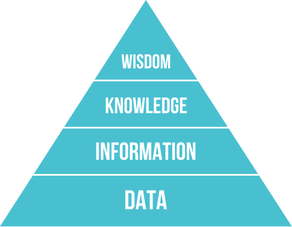
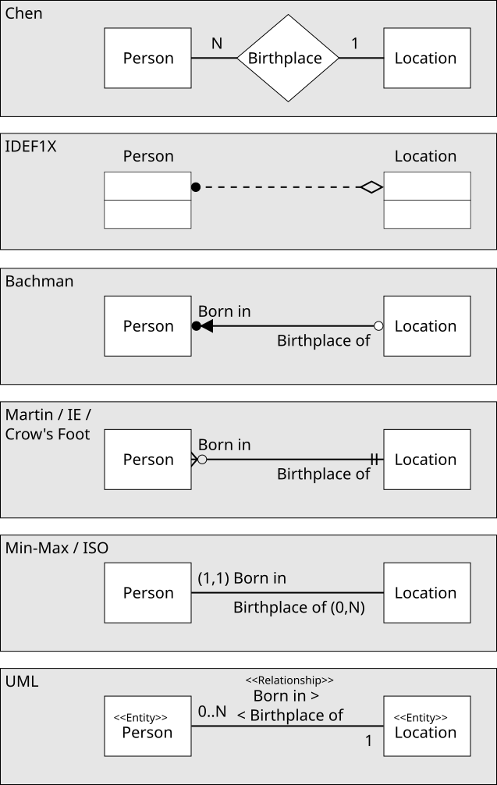

# 資訊系統與資料庫

## 前言：從校園系統談起

你每天都在使用一個資訊系統——**元智大學的 Portal 校務系統**。

當你用學號登入，查詢課表、成績、出缺席紀錄，或是繳交選課志願序，你其實正在和一套「資訊系統與資料庫」互動：

- 你輸入學號密碼，系統到資料庫查詢帳號、比對密碼是否正確
- 你查詢成績，系統彙整各科教師上傳的分數，計算平均並判斷是否及格
- 你繳交選課志願，系統將資料寫入資料庫，與其他學生的志願進行衝突比對

如果不理解資訊系統與資料庫，在企業環境中你可能遇到：

- 遇到「系統維護中」或「資料匯入失敗」只能乾等，不知道背後出了什麼問題
- 主管說「去 ERP 系統拉一份上個月的生產報表」，你不知道報表從哪裡來、資料怎麼存的
- 需要向 IT 部門提出需求，卻說不清楚自己要什麼資料、從哪張表、要哪個時間範圍
- 公司評估要換哪套 MES 或 ERP，你無法從系統架構的角度提供有意義的意見

如果理解資訊系統與資料庫，你可以：

- 理解**資訊系統**的三層架構（使用者介面、應用邏輯、**資料庫**），能判斷問題出在哪一層
- 知道「查詢成績」的背後是一段 SQL 在資料庫執行，理解資料從哪裡來、怎麼被查詢
- 向 IT 部門清楚說明需求：「我需要 A 資料表的 B 欄位，條件是 C，按照 D 排序」
- 評估 **ERP**、**MES**、**CRM** 等系統時，能從資料流與系統整合的角度提出有意義的問題

> **這就是理解資訊系統與資料庫的核心價值**：讓你從「系統使用者」走向「系統理解者」，能和 IT 部門有效溝通，在企業數位化的規劃與評估中扮演更有價值的角色。

| 你在 Portal 的操作 | 對應的資訊系統概念 |
|------------------|-----------------|
| 輸入學號密碼登入 | 身分驗證與資料庫查詢 |
| 查詢課表 | 關聯式查詢（學生 × 課程 × 教室） |
| 查詢成績 | 資料彙整運算與條件判斷 |
| 繳交選課志願 | 資料寫入與衝突比對（交易處理） |
| 查詢出缺席 | 跨系統資料整合（簽到系統 → 校務系統） |

> 本章的目的，就是幫你理解這套「蒐集資料、儲存資料、處理資料、輸出資訊」的機制，如何在企業與工廠的規模下運作，以及 AI 與電子商務如何進一步擴展其能力。

---

## 一、資料、資訊與資訊系統

> **前情提要**：[01-History-of-Computer.md](01-History-of-Computer.md)〈九、現代資訊系統〉已先介紹過網路化資訊系統、雲端運算與物聯網的基本概念，本章在此基礎上深入資訊系統的層級與類型、企業應用系統（ERP/MES/SCM/CRM）與資料庫技術。

### 1. 資料、資訊與知識的差異

在進入正題之前，必須先釐清三個層層遞進、容易混淆的概念。

**資料（Data）** 是未經處理的原始事實，可以是數字、文字、符號、圖片或聲音。資料本身通常沒有明確意義，必須經過整理與詮釋才有用。

**資訊（Information）** 是資料經過整理、分析與脈絡化後，能夠提供意義並協助決策的結果。

**知識（Knowledge）** 是將資訊與過去的經驗、專業判斷結合後，形成可以反覆套用於類似情境的理解與能力。知識不只是「知道發生了什麼」，而是「理解為什麼發生，以及下次如何應對」。

| | 資料（Data） | 資訊（Information） | 知識（Knowledge） |
|---|---|---|---|
| 定義 | 原始、未處理的事實 | 有意義、可用於決策的結果 | 可反覆套用的理解與判斷能力 |
| 來源 | 感測器、輸入、紀錄 | 資料經整理、分析後產生 | 資訊與經驗結合後內化 |
| 範例 | `23.5`、`467`、`OK` | 「今日A線良率 97.5%，高於目標 2.5%」 | 「A線在換刀後良率通常會下滑，需觀察一小時再判斷」 |
| 特性 | 缺乏脈絡 | 有脈絡、有意義 | 可指導行動、具預測與應變能力 |

這三個層次之間的關係可以用一條由下到上的轉化鏈來理解：

```
資料（原始事實）
    ↓ 整理、分析、脈絡化
資訊（有意義的結果）
    ↓ 結合經驗與判斷、反覆驗證
知識（可指導行動的理解）
```



*圖片來源：[維基共享資源「DIKW Pyramid.svg」](https://commons.wikimedia.org/wiki/File:DIKW_Pyramid.svg)，作者 Longlivetheux，授權 CC BY-SA 4.0*

**工業應用範例**：

- **資料**：感測器每秒回傳溫度 `26.1`
- **資訊**：系統彙整後產生「今日 14:00 至 15:00 溫度超標，對應良率下滑 4%」
- **知識**：資深工程師根據多次類似紀錄歸納出「切削液流量不足時，溫度會在午後因累積熱量而超標，調整流量後約 30 分鐘可恢復正常」

> 資訊系統能夠自動完成資料→資訊的轉換；而資訊→知識的這一步，往往仍需要人的經驗與判斷——這也是知識管理系統（KMS）與專家系統存在的根本原因。

傳統上，「知識」的運用高度依賴人類專家：工程師累積多年經驗，才能在看到異常數據時立刻判斷根本原因。為了讓組織的知識不因人員異動而流失，**[專家系統（Expert System）](https://zh.wikipedia.org/wiki/專家系統)** 應運而生——它將領域專家的判斷規則以「若…則…（If-Then）」的形式寫入電腦，讓系統能夠模仿人類專家的推理過程，自動給出建議或診斷。

隨著人工智慧技術的發展，這個能力有了質的飛躍：

- **AI 專家系統（AI-based Expert System）**：不再只靠人工撰寫規則，而是透過機器學習從大量歷史資料中自動歸納出規律，能夠處理更複雜、更模糊的判斷情境，例如從數千筆感測器紀錄中自動識別設備老化的早期徵兆。
- **[AI 代理人（AI Agent）](https://zh.wikipedia.org/wiki/智能代理)**：更進一步，AI 代理人不只能夠「判斷」，還能夠「行動」。它能感知環境、制定計畫、呼叫工具、執行操作，並根據執行結果持續調整策略，在完成複雜任務時幾乎不需要人工介入。例如，一個部署在工廠的 AI 代理人可以自主偵測異常、查詢維修手冊、排程停機、通知相關人員，並記錄本次處置結果供未來學習。

```
資料 → 資訊系統處理 → 資訊
資訊 → 專家系統／AI → 知識與決策
知識與決策 → AI 代理人 → 自主行動與持續學習
```

> 從資料到資訊是「自動化」，從資訊到知識是「智慧化」，從知識到行動是「自主化」——這正是現代 AI 在資訊系統中扮演的核心角色。

### 2. 資訊系統的基本概念

**[資訊系統（Information System，IS）](https://zh.wikipedia.org/wiki/資訊系統)** 是一套將資料轉換成資訊的整合性系統，其基本流程如下（Laudon & Laudon, 2022）：

```
輸入（Input）──→ 處理（Process）──→ 輸出（Output）
     │                 ↕                 ↑
     └────────→ 儲存（Storage）──────────┘
```

以工廠生產報表系統為例：
- **輸入**：各機台感測器資料、操作員手動輸入的產量紀錄
- **處理**：計算良率、OEE、稼動率等關鍵指標
- **儲存**：將每日資料存入資料庫，供未來查詢與比對
- **輸出**：產生每日生產報表、異常警報，供管理者決策

### 3. 資訊系統的組成要素

資訊系統不只是電腦或軟體，而是由五個要素共同構成的整體：

| 要素 | 說明 | 工業範例 |
|------|------|---------|
| **硬體（Hardware）** | 伺服器、工業電腦、感測器、網路設備 | MES 伺服器、PLC、工業相機 |
| **軟體（Software）** | 作業系統、應用程式、套裝系統 | ERP、MES、SCADA 系統 |
| **人員（People）** | 使用者、管理者、IT 人員 | 操作員、工程師、廠長、系統管理員 |
| **流程（Procedure）** | 資料輸入、處理、報表產出的標準流程 | 班次結束後的生產日報作業流程 |
| **資料（Data）** | 原始資料、資料庫、儲存媒體 | 生產紀錄、品質量測值、設備狀態 |

> **關鍵認知**：導入資訊系統不只是購買軟體，而是同步調整流程、訓練人員、整合資料，才能真正發揮效益。許多工廠在導入 ERP 或 MES 時失敗，往往不是技術問題，而是忽略了人員訓練與流程調整。

---

## 二、資訊系統的類型

根據組織的層級與用途，資訊系統可以分為作業、管理、策略三個層次，由下到上資訊的摘要程度越來越高，使用頻率則越來越低（Laudon & Laudon, 2022; O'Brien & Marakas, 2011）。

### 1. 作業層級資訊系統

作業層級系統處理的是日常、大量、重複性的交易資料，是整個組織資訊系統的資料來源基礎。

#### 電子資料處理系統（Electronic Data Processing，EDP）

[EDP](https://zh.wikipedia.org/wiki/數據處理) 將人工的重複性資料處理工作自動化，例如訂單建檔、庫存異動、薪資計算等。其核心目的是「以電腦代替人工執行固定流程」，提高速度與準確性。

**工業應用**：工廠每天的物料入出庫紀錄、排班表計算、計件薪資核算，都是 EDP 的典型應用。

#### 交易處理系統（Transaction Processing System，TPS）

[TPS](https://zh.wikipedia.org/wiki/交易處理系統) 用於記錄與處理企業最底層的日常交易，是 ERP 與 MES 的資料基礎。TPS 的三種處理方式：

| 處理方式 | 說明 | 工業範例 |
|---------|------|---------|
| **批次處理** | 累積資料後一次處理 | 每日班次結束後，一次計算所有機台 OEE |
| **分時處理** | 多人同時共用系統資源 | 多條產線同時向 MES 回報生產進度 |
| **即時處理** | 收到資料後立即處理 | 感測器偵測到異常後立即觸發警報 |

### 2. 管理層級資訊系統

管理層級系統彙整作業層的資料，產生報表與分析，支援中階主管的控制與決策。

#### 管理資訊系統（Management Information System，MIS）

[MIS](https://zh.wikipedia.org/wiki/管理資訊系統) 將 TPS 產生的大量交易資料彙整、分類、統計，以定期報表的形式呈現，供主管進行規劃與管理控制。

**工業應用**：每週產能達成率報表、各機台不良品統計、原物料消耗分析——這些都是 MIS 的典型輸出。MIS 告訴主管「發生了什麼」，但不一定告訴他「為什麼」或「該怎麼辦」。

#### 決策支援系統（Decision Support System，DSS）

[DSS](https://zh.wikipedia.org/wiki/決策支援系統) 協助中高階主管處理較複雜、非例行性的半結構化決策問題。相較於 MIS 偏向例行報表，DSS 更重視模擬、情境分析與多角度判斷。

DSS 通常包含三個部分：

```
資料庫（內部 + 外部資料）
    ↓
資料分析工具（統計模型、模擬工具）
    ↓
使用者介面（讓決策者互動式操作）
```

**工業應用**：「若原料漲價 15%，是否應調整生產組合？」這類非例行性的決策，需要 DSS 整合成本資料、需求預測與模擬工具才能有效分析。

#### 知識管理系統（Knowledge Management System，KMS）

[KMS](https://zh.wikipedia.org/wiki/知識管理) 蒐集、整理、保存與分享組織內的知識資產。知識分為兩類：

- **[內隱知識（Tacit Knowledge）](https://zh.wikipedia.org/wiki/內隱知識)**：個人經驗、技巧與判斷，難以文字化，例如資深工程師對設備異音的判斷能力
- **外顯知識（Explicit Knowledge）**：可文件化、分享的知識，例如設備操作手冊、故障排除 SOP

**工業應用**：工廠建立「設備故障案例知識庫」，記錄歷次故障的現象、診斷過程與解決方法。新進工程師查詢後能更快處理類似問題，不必每次都重新摸索——這就是 KMS 的核心價值。

#### 專家系統（Expert System，ES）

ES 模擬特定領域的專家判斷，由知識庫、推理機與使用者介面構成。使用者輸入事實後，系統依據規則推理，輸出建議或診斷結果。

**工業應用**：「設備診斷專家系統」：操作員輸入「主軸振動加大、電流升高、加工表面粗糙」，系統推理後輸出「刀具磨耗，建議更換刀具並複查主軸軸承」。隨著生成式 AI 的進步，現代專家系統越來越多結合大型語言模型，提供更自然的互動體驗。

> **趣味小知識**：專家系統並不是新概念。1970 年代史丹佛大學開發的醫療專家系統 **MYCIN**，能根據病人症狀推薦抗生素療法，在測試中的判斷準確率甚至勝過部分人類醫師——但它從未真正用於臨床。原因不是技術不行，而是當年沒人能回答一個關鍵問題：如果系統開錯藥，責任該算誰的？這個「AI 該由誰負責」的難題，到今天仍是 AI 落地醫療、製造等高風險場域時繞不開的課題。

### 3. 策略層級資訊系統

策略層級系統服務的是高階主管，提供宏觀、跨部門的整體視野，支援非結構化的長期策略決策。

#### 主管資訊系統（Executive Information System，EIS）

[EIS](https://zh.wikipedia.org/wiki/高階主管資訊系統) 整合企業內部 MIS、DSS 資料與外部市場資訊，以儀表板、摘要圖表與關鍵績效指標的形式呈現，使高階主管能快速掌握全局。

**工業應用**：集團董事長透過 EIS 儀表板，一眼看到全球三座工廠的即時產能、良率、庫存水位與成本差異，快速判斷是否需要調整產能配置。

#### 策略資訊系統（Strategic Information System，SIS）

SIS 整合內部營運資料與外部市場、競爭環境資訊，支援企業分析趨勢與識別策略機會，例如評估新市場進入、競爭對手動向或供應鏈風險。

---

## 三、企業應用系統

### 1. 企業資源規劃（Enterprise Resource Planning，ERP）

[ERP](https://zh.wikipedia.org/wiki/企業資源規劃) 是模組化、整合性的企業應用系統，將企業內部不同部門整合在同一平台中。一套完整的 ERP 系統通常涵蓋：

```
生產製造  →  採購與供應鏈  →  庫存管理
      ↓                            ↓
  品質管理       ERP 核心       銷售與訂單
      ↓                            ↓
  財務會計  ←    人力資源    ←  成本管理
```

**ERP 的核心價值**：打破各部門的「資訊孤島」。過去採購部門不知道生產計畫，財務部門不知道庫存成本；ERP 讓所有部門共用同一套資料，資訊即時流通。

代表性 ERP 系統：[SAP](https://zh.wikipedia.org/wiki/SAP) S/4HANA、Oracle ERP、Microsoft Dynamics 365。

> **趣味小知識**：全球最大的 ERP 廠商 SAP 是家德國公司，1972 年由五位不滿東家的前 IBM 工程師離職創立。公司名 SAP 是德文「Systemanalyse und Programmentwicklung（系統分析與程式開發）」的縮寫。有趣的是，正因為 SAP 把企業流程的「最佳實務」寫死在系統裡，許多企業導入時反而得回頭修改自己的作業流程去遷就系統——這也是「導入 ERP 常常不是裝軟體，而是改組織」這句話的由來。

**ERP 導入的關鍵**：
- 清楚分析企業需求，而非硬套系統預設流程
- 建立跨部門專案團隊與專案經理
- 設定可量化的績效指標（如導入後庫存周轉率提升 X%）
- 提供完善教育訓練——ERP 導入失敗的主要原因往往是人員不熟悉系統

### 2. 製造執行系統（Manufacturing Execution System，MES）

[MES](https://zh.wikipedia.org/wiki/製造執行系統) 位於 ERP（計畫層）與 PLC/[SCADA](https://zh.wikipedia.org/wiki/資料採集與監控系統)（控制層）之間，負責管理工廠車間（Shop Floor）的即時執行狀況。

| 功能 | 說明 |
|------|------|
| 工單管理 | 接收 ERP 下達的工單，分解為具體生產任務 |
| 排程派工 | 即時排程，分配工作到各機台 |
| 生產追蹤 | 即時掌握每張工單的進度 |
| 品質管理 | 記錄量測結果，支援品質追溯 |
| OEE 計算 | 即時計算設備整體效能 |

> MES 是工業4.0「垂直整合」的關鍵中間層：它向上對接 ERP 的計畫，向下連結機台的即時資料，是資料驅動製造的核心樞紐。

### 3. 供應鏈管理（Supply Chain Management，SCM）

[SCM](https://zh.wikipedia.org/wiki/供應鏈管理) 管理產品從原料到消費者的整個流程，透過資訊系統整合供應商、製造商、物流商與銷售端，使供應鏈能更有效率地規劃、控制與協作。

**工業應用**：當 MES 回報某原料即將耗盡，SCM 系統自動計算補貨量，向合格供應商詢價，並根據庫存策略決定是否下單——這整個流程可以在幾分鐘內自動完成，不需人工介入。

### 4. 顧客關係管理（Customer Relationship Management，CRM）

[CRM](https://zh.wikipedia.org/wiki/客戶關係管理) 透過資訊科技蒐集與分析顧客資料，協助企業掌握顧客偏好、改善行銷與銷售流程，並提升顧客滿意度。

| CRM 類型 | 說明 |
|---------|------|
| **操作型** | 自動化銷售、行銷與客服流程 |
| **分析型** | 分析顧客行為與偏好，支援行銷決策 |
| **協作型** | 整合各接觸點（電話、Email、門市）的顧客互動紀錄 |

---

## 四、資料庫基礎概念

### 1. 資料庫的定義

**[資料庫（Database）](https://zh.wikipedia.org/wiki/資料庫)** 是一個或多個彼此相關資料的集合，依照一定格式整合儲存，可供不同使用者與應用程式共享、查詢與管理。

用 Excel 試算表來類比：一張工作表就像一個資料表；多張工作表放在同一個檔案，彼此透過欄位關聯，就接近資料庫的概念——但真正的資料庫系統在管理、安全、效能與並行控制上遠比 Excel 完善。

### 2. 資料的層級

資料在資料庫中由小到大可分為以下層級：

```
位元（Bit）
    ↓
字元（Character）：通常以一個位元組表示
    ↓
欄位（Field）：一個屬性，例如「機台編號」
    ↓
紀錄（Record）：多個相關欄位的組合，例如一筆工單資料
    ↓
資料表（Table）：一組相關紀錄的集合，例如「工單資料表」
    ↓
資料庫（Database）：一或多個資料表的集合
```

### 3. 資料庫系統的組成

**資料庫系統（Database System）** 由兩個核心部分組成：

- **資料庫（Database）**：實際儲存資料的地方
- **[資料庫管理系統（Database Management System，DBMS）](https://zh.wikipedia.org/wiki/資料庫管理系統)**：管理資料庫的軟體，提供以下功能：

| 功能 | 說明 |
|------|------|
| 查詢與存取 | 讓使用者以標準語言查詢資料 |
| 新增、修改、刪除 | 維護資料的完整性 |
| 權限管理 | 控制哪些人可以看到或修改哪些資料 |
| 資料共享 | 讓多個應用程式同時使用同一份資料 |
| 資料備份與還原 | 確保資料安全、防止遺失 |
| 一致性維護 | 防止資料因並行操作而產生矛盾 |

### 4. 使用資料庫的優點

| 優點 | 說明 |
|------|------|
| **資料共享** | 同一份資料可供多個部門與系統使用 |
| **避免重複** | 資料只存一份，不會在各部門各自維護不同版本 |
| **維持一致性** | 修改一處，全系統同步更新 |
| **資料獨立** | 資料結構的改變不影響應用程式的運作 |
| **安全控制** | 依角色設定存取權限，保護敏感資料 |
| **標準化** | 統一欄位名稱、格式與單位，便於跨系統整合 |

**工業情境案例**：過去工廠各部門各自維護 Excel 庫存表，品管部門說庫存 500 個，倉庫說只有 430 個，生產部門說剩 480 個——三份資料互相矛盾。導入 ERP 與資料庫後，庫存資料只有一份，所有部門即時共用，這個問題就消失了。

> **趣味小知識**：資料庫用四個英文字母 **ACID** 來保證交易的可靠：不可分割（Atomicity，要嘛全做、要嘛全不做）、一致（Consistency）、隔離（Isolation）、持久（Durability）。你在網路上刷卡付款時「扣款」與「建立訂單」被綁成同一筆交易——正是 ACID 的「不可分割」特性，確保不會發生「錢被扣了、訂單卻沒成立」，或「重複扣款」這種糟糕的半吊子狀態。

---

## 五、資料庫模型

### 1. 階層式資料庫（Hierarchical Database）

[階層式資料庫](https://zh.wikipedia.org/wiki/層次模型)採用**樹狀結構**，資料分層儲存。每個父節點可有多個子節點，但每個子節點只能有一個父節點，適合表達一對多關係。

```
工廠
├── 製造一課
│   ├── 生產線A
│   └── 生產線B
└── 製造二課
    └── 生產線C
```

- **優點**：結構清楚，搜尋速度快
- **缺點**：無法處理多對多關係（例如一個零件可以由多個供應商供應，同一供應商也供應多個零件）

### 2. 網狀式資料庫（Network Database）

[網狀式資料庫](https://zh.wikipedia.org/wiki/網狀模型)以**圖形結構**描述資料關係，允許一個節點有多個父節點，可以處理多對多關係，比階層式更有彈性。缺點是關係複雜，隨資料量增加，維護難度大幅提高。

### 3. 關聯式資料庫（Relational Database）

[關聯式資料庫（Relational Database）](https://zh.wikipedia.org/wiki/關聯式資料庫)是目前最主流的資料庫模型，以**二維表格**儲存資料。每張資料表由列（紀錄）與欄（欄位）構成，不同資料表之間透過共通欄位建立關聯（Codd, 1970）。


*圖片來源：[維基共享資源「Relational database terms.svg」](https://commons.wikimedia.org/wiki/File:Relational_database_terms.svg)，作者 Booyabazooka，授權 Public Domain*

> **趣味小知識**：今天無所不在的關聯式資料庫，源自 1970 年 IBM 研究員 **Edgar F. Codd** 發表的一篇論文。諷刺的是，IBM 起初對這個構想興趣缺缺，反而讓一家小公司搶先把它商品化——那家公司後來叫做**甲骨文（Oracle）**，成了資料庫巨頭。Codd 本人則在 1981 年獲頒電腦界最高榮譽「圖靈獎」，被尊為關聯式資料庫之父。

**工單資料表**

| 工單編號 | 產品料號 | 計畫數量 | 機台編號 | 狀態 |
|---------|---------|---------|---------|------|
| WO-001 | P-100 | 500 | M-003 | 進行中 |
| WO-002 | P-200 | 320 | M-001 | 待開始 |

**機台資料表**

| 機台編號 | 機台名稱 | 負責技術員 |
|---------|---------|---------|
| M-001 | CNC-A | 王小明 |
| M-003 | CNC-C | 李大華 |

兩張表透過「機台編號」欄位關聯，查詢「WO-001 的負責技術員」時，只需連結兩張表即可得到答案，資料不需重複儲存。

#### 主鍵與外來鍵

**[主鍵（Primary Key，PK）](https://zh.wikipedia.org/wiki/主鍵)**：唯一識別資料表中每一筆紀錄的欄位，不能重複、不能空白。例如「工單編號」就是工單資料表的主鍵。

**[外來鍵（Foreign Key，FK）](https://zh.wikipedia.org/wiki/外鍵)**：其值對應另一資料表的主鍵，用來建立表格間的關聯。例如工單資料表中的「機台編號」是外來鍵，對應機台資料表的主鍵。

資料庫設計常以**[實體關係模型（Entity-Relationship Model，ER 模型）](https://zh.wikipedia.org/wiki/ER模型)** 來規劃資料表與表間關聯，再據以建立實體資料表（Chen, 1976; Elmasri & Navathe, 2016）。



*圖片來源：[維基共享資源「ERD Representation.svg」](https://commons.wikimedia.org/wiki/File:ERD_Representation.svg)，作者 Benthompson，授權 Public Domain*

### 4. 物件導向式資料庫（Object-Oriented Database）

[物件導向式資料庫](https://zh.wikipedia.org/wiki/物件資料庫)將現實世界的實體視為**物件**，物件包含資料（屬性）與行為（方法）。適合處理大型、複雜或多媒體型的資料，例如工業相機的影像與標注資料。目前在一般企業應用中，關聯式資料庫仍是主流。

---

## 六、SQL——資料庫的標準語言

**[SQL（Structured Query Language，結構化查詢語言）](https://zh.wikipedia.org/wiki/SQL)** 是操作關聯式資料庫的標準語言，分為四大類：

| 類型 | 全名 | 用途 | 常見指令 |
|------|------|------|---------|
| **DDL** | 資料定義語言 | 定義資料表結構 | `CREATE`、`ALTER`、`DROP` |
| **DML** | 資料處理語言 | 新增、修改、刪除資料 | `INSERT`、`UPDATE`、`DELETE` |
| **DCL** | 資料控制語言 | 管理存取權限 | `GRANT`、`REVOKE` |
| **DQL** | 資料查詢語言 | 查詢資料 | `SELECT` |

實際工作中最常用的是 `SELECT` 查詢。以下是一個簡單範例：

```sql
-- 查詢今日良率低於 95% 的所有生產線
SELECT 生產線名稱, 良率, 班次
FROM 生產紀錄
WHERE 日期 = '2025-05-21'
  AND 良率 < 0.95
ORDER BY 良率 ASC;
```

這段語法的意義：
- `SELECT`：選取哪些欄位要顯示
- `FROM`：從哪張資料表查詢
- `WHERE`：篩選條件
- `ORDER BY`：排序方式（`ASC` 由小到大）

> 對於工業工程管理的學生，不需要能自己寫複雜的 SQL，但理解 SELECT、FROM、WHERE 的基本邏輯，有助於與 IT 人員溝通查詢需求，以及閱讀 BI 工具背後的資料邏輯。

> **趣味小知識**：SQL 到底該唸「S-Q-L」還是「sequel（西擴）」？其實兩派都對。這個語言 1970 年代誕生於 IBM 時原名叫 **SEQUEL**（Structured English Query Language），後來因為這個名稱與一家英國飛機公司的商標撞名，才被迫改成 SQL。也因為這段歷史，老一輩工程師習慣唸「sequel」，年輕一輩則多半照字母唸「S-Q-L」——下次聽到有人兩種唸法混用，別懷疑，他們講的是同一個東西。

---

## 七、NoSQL 與大數據資料管理

### 1. 為什麼需要 NoSQL？

關聯式資料庫需要事先定義好固定的資料表結構（Schema），適合結構整齊、關聯明確的企業資料。然而，工業4.0與物聯網帶來的資料具有以下特性，讓傳統關聯式資料庫力不從心：

- 格式多樣（感測器數值、影像、日誌文字）
- 資料量巨大（數百萬個感測器持續產生資料）
- 結構彈性（不同機台的參數欄位不同）
- 速度要求極高（毫秒級寫入）

**[NoSQL（Not Only SQL）](https://zh.wikipedia.org/wiki/NoSQL)** 是非關聯式資料庫的統稱，設計上更適合處理上述場景（Silberschatz et al., 2020）。

> **趣味小知識**：「NoSQL」這個名字很容易讓人誤會。它最早在 2009 年被提出時，字面意思真的是「No SQL（不要用 SQL）」，帶點對傳統關聯式資料庫的反叛意味。但後來大家發現這太偏激——這類資料庫其實常常也支援類 SQL 查詢，於是重新詮釋為「**Not Only SQL（不只是 SQL）**」，強調它是關聯式資料庫的補充而非取代。這也呼應了前面說的：實務上兩者往往並肩合作、各司其職。

### 2. NoSQL 的常見模型

| 模型 | 說明 | 代表系統 | 工業應用 |
|------|------|---------|---------|
| **[鍵值（Key-Value）](https://zh.wikipedia.org/wiki/键值数据库)** | 以唯一鍵對應一個值，查詢速度極快 | [Redis](https://zh.wikipedia.org/wiki/Redis) | 設備即時狀態快取 |
| **[文件（Document）](https://zh.wikipedia.org/wiki/面向文档的数据库)** | 儲存 JSON 格式的彈性文件 | [MongoDB](https://zh.wikipedia.org/wiki/MongoDB) | IoT 設備日誌、品質報告 |
| **列式（Column-family）** | 以欄位群組儲存，適合大量讀寫 | [Apache HBase](https://zh.wikipedia.org/wiki/Apache_HBase)、[Cassandra](https://zh.wikipedia.org/wiki/Apache_Cassandra) | 時序感測器資料 |
| **圖形（Graph）** | 節點與關係的網路結構 | Neo4j | 供應鏈網絡、設備依賴關係 |

### 3. 關聯式資料庫 vs. NoSQL

| 面向 | 關聯式資料庫 | NoSQL |
|------|------------|-------|
| 資料結構 | 固定表格結構 | 彈性，可動態調整 |
| 查詢語言 | 標準 SQL | 各系統各有不同 |
| 一致性 | 強一致性 | 通常為最終一致性 |
| 擴展方式 | 垂直擴展（升級單一伺服器） | 水平擴展（增加伺服器數量） |
| 適用場景 | 結構化、交易型資料（ERP、MES） | 大量、快速、非結構化資料（IoT、日誌） |

> **實務上兩者並非對立**：現代工廠的資訊架構往往同時使用關聯式資料庫（存放 ERP、MES 的結構化業務資料）與 NoSQL（存放感測器時序資料或影像分析結果），各司其職。

### 4. 常見資料庫軟體

#### 關聯式資料庫管理系統（RDBMS）

| 軟體 | 授權 | 特點 | 常見應用情境 |
|------|------|------|-------------|
| **[MySQL](https://zh.wikipedia.org/wiki/MySQL)** | 開源（社群版免費） | 輕量、穩定、部署容易 | 中小型網站、電商後台、教學用途 |
| **[PostgreSQL](https://zh.wikipedia.org/wiki/PostgreSQL)** | 開源（完全免費） | 功能完整、支援複雜查詢與 JSON | 中大型系統、需要嚴謹資料一致性 |
| **[Microsoft SQL Server](https://zh.wikipedia.org/wiki/Microsoft_SQL_Server)** | 商業授權 | 與 Windows 生態整合佳，有圖形管理工具 | 企業 ERP、微軟技術棧的系統 |
| **[Oracle Database](https://zh.wikipedia.org/wiki/Oracle資料庫)** | 商業授權 | 效能強、功能豐富，為大型企業標準 | 大型製造業、金融、政府機關 |
| **[SQLite](https://zh.wikipedia.org/wiki/SQLite)** | 開源（完全免費） | 無需伺服器，整個資料庫就是一個檔案 | 嵌入式裝置、App 本機快取、快速原型 |

#### NoSQL 資料庫

| 軟體 | 模型 | 授權 | 常見應用情境 |
|------|------|------|-------------|
| **Redis** | 鍵值 | 開源 | 快取、Session 管理、即時排行榜 |
| **MongoDB** | 文件 | 開源（社群版免費） | IoT 日誌、彈性資料結構、快速開發 |
| **Apache Cassandra** | 列式 | 開源 | 大量寫入的時序資料、感測器紀錄 |
| **[InfluxDB](https://zh.wikipedia.org/wiki/InfluxDB)** | 時序（Time-Series） | 開源（社群版免費） | 工廠感測器、監控指標、效能紀錄 |
| **Neo4j** | 圖形 | 開源（社群版免費） | 供應鏈網絡、推薦系統、關係分析 |

> 選擇資料庫軟體時，需同時考量**授權成本、技術人才、資料特性與系統規模**。例如，中小型工廠導入 MES 時常搭配 MySQL 或 PostgreSQL；大型跨國企業的 ERP 系統則多以 Oracle 或 SQL Server 為核心；而 InfluxDB 則幾乎是工業 IoT 感測器資料的專屬選項。

---

## 八、大數據與資料分析

### 1. 大數據的特性

**[大數據（Big Data）](https://zh.wikipedia.org/wiki/大數據)** 指資料量龐大、產生速度快，且類型多樣，以至於傳統工具難以在合理時間內處理的資料集合（Provost & Fawcett, 2013）。常以多個「V」來描述其特性：

| 特性 | 說明 | 工業範例 |
|------|------|---------|
| **Volume（量）** | 資料量巨大 | 全廠數千個感測器每秒產生的量測值 |
| **Velocity（速）** | 資料產生與處理速度快 | 生產線視覺檢測每秒判斷數十個零件 |
| **Variety（樣）** | 資料類型多樣 | 數值、影像、日誌、聲音同時匯入 |
| **Veracity（真）** | 資料的真實性與準確性 | 感測器老化導致的異常數值需過濾 |
| **Value（值）** | 分析後可產生的商業價值 | 從良率趨勢預測設備故障時間點 |

大數據的規模，最終要落在實體的資料中心裡儲存與運算——雲端業者以成排的伺服器機櫃，支撐起全球工廠與電商每天產生的海量資料。


*圖片來源：[維基共享資源「BalticServers data center.jpg」](https://commons.wikimedia.org/wiki/File:BalticServers_data_center.jpg)，作者 BalticServers.com，授權 CC BY-SA 3.0*

> **趣味小知識**：大家朗朗上口的大數據「3V」——資料量大（Volume）、產生快（Velocity）、種類多（Variety）——其實不是什麼學術定義，而是產業分析師 Doug Laney 早在 2001 年一份內部報告裡提出的觀察。後來大數據熱潮興起，眾人才陸續替它加上真實性（Veracity）、價值（Value）等更多的 V，一路加到「5V」甚至更多，堪稱科技界最愛「集字母」的名詞之一。

### 2. 大數據分析流程

```
採集：從感測器、ERP、MES、網路蒐集資料
    ↓
儲存與清洗：過濾雜訊、填補缺失值、統一格式
    ↓
分析：統計、分類、關聯分析、機器學習模型
    ↓
視覺化：將分析結果轉換為圖表、儀表板
    ↓
決策：管理者根據資訊採取行動
```

### 3. 常見大數據工具

| 工具 | 用途 |
|------|------|
| **[Hadoop](https://zh.wikipedia.org/wiki/Apache_Hadoop)** | 分散式儲存與計算平台，透過大量普通伺服器叢集平行處理資料 |
| **[Apache Spark](https://zh.wikipedia.org/wiki/Apache_Spark)** | 記憶體內大規模資料分析，速度遠快於 Hadoop 的 [MapReduce](https://zh.wikipedia.org/wiki/MapReduce) |
| **Power BI / [Tableau](https://zh.wikipedia.org/wiki/Tableau)** | 資料視覺化與商業智慧工具，拖拉介面產生圖表與儀表板 |
| **[Grafana](https://zh.wikipedia.org/wiki/Grafana)** | 即時監控儀表板，常用於 IoT 與工廠感測器資料的可視化 |

---

## 九、網路、雲端與 AI 對資訊系統的影響

### 1. 網路化資訊系統

網路使資訊系統從單一電腦上的封閉應用，演變為可跨地點、跨設備存取的服務。對工業環境而言，這意味著：

- 跨廠區的資料可即時整合（台灣、越南、墨西哥三廠的產能一眼掌握）
- 工程師可在異地遠端監控設備狀態
- 物聯網設備成為資訊系統的資料來源節點（Xu et al., 2014）
- 雲端 ERP 讓中小企業不必自建伺服器也能使用完整系統

### 2. 雲端運算與資訊系統

[雲端運算](https://zh.wikipedia.org/wiki/雲端運算)讓企業可以透過網際網路租用運算資源，不必自行購置與維護硬體。對資訊系統的影響：


*圖片來源：[維基共享資源「Cloud computing.svg」](https://commons.wikimedia.org/wiki/File:Cloud_computing.svg)，作者 Sam Johnston，授權 CC BY-SA 3.0*

| 優點 | 說明 |
|------|------|
| 降低初期投資 | 不需自建機房、購買伺服器 |
| 彈性擴展 | 資料量暴增時快速增加容量 |
| 全球存取 | 任何地點都能使用相同系統 |
| 自動備份 | 雲端供應商負責資料備援 |

工業4.0的雲端平台（如 Siemens MindSphere、PTC ThingWorx）專為工業 IoT 設計，能夠接收全球工廠的感測資料，並在雲端執行 AI 模型進行預測性維護分析。

### 3. 人工智慧強化資訊系統

AI 技術讓資訊系統從「被動回應」進化到「主動預測」：

| 傳統資訊系統 | AI 強化後 |
|------------|---------|
| 統計設備本月故障次數 | 預測設備三週後可能故障 |
| 記錄不良品數量 | 從影像自動辨識瑕疵類型與原因 |
| 顯示庫存水位 | 預測需求，自動觸發補貨建議 |
| 呈現良率報表 | 分析製程參數與良率的因果關係 |

> **趣味小知識**：資料分析界流傳一個經典故事——某超市分析銷售資料後，發現「啤酒」和「尿布」常一起被買走，推測是年輕爸爸下班買尿布時順手帶啤酒，於是把兩者擺在一起促銷、業績大增。這個「啤酒與尿布」的故事雖然後來被證實多半是行銷傳說、細節難以考證，卻生動點出了資料探勘的精神：從看似無關的資料中，找出人們自己都沒察覺的關聯——這正是今天推薦系統（「買了這個的人也買了…」）的雛形。

---

## 十、電子商務與行動商務

### 1. 電子商務的概念

**[電子商務（Electronic Commerce，E-Commerce）](https://zh.wikipedia.org/wiki/電子商務)** 是指透過網際網路進行商品、服務、資訊與金流交換的商業活動。它不是單純的「網路購物」，而是一套整合網站、資料庫、交易處理系統、物流系統、客服系統、行銷系統與金流系統的整合性資訊系統。

電子商務的基本流程可視為資訊系統的延伸：

| 流程 | 說明 |
|------|------|
| **輸入** | 使用者瀏覽商品、搜尋關鍵字、加入購物車、填寫訂單與付款資料 |
| **處理** | 系統確認庫存、計算價格、套用折扣、處理付款、建立訂單 |
| **儲存** | 資料庫記錄會員、商品、訂單、付款紀錄與物流狀態 |
| **輸出** | 向消費者顯示訂單結果、付款狀態、出貨通知與推薦商品 |

因此，電子商務可以理解為「以網路為基礎的商業資訊系統」，將傳統商業活動數位化，讓消費者不必到實體店面，也能完成查詢、比較、購買、付款與售後服務的全部流程。

### 2. 電子商務中的資訊系統

電子商務平台通常需要多種資訊系統共同運作：

| 系統 | 在電子商務中的角色 |
|------|-----------------|
| **TPS** | 處理訂單建立、付款確認、庫存扣除、發票產生等日常交易 |
| **MIS** | 將銷售資料整理為報表：每日銷售額、熱銷商品、退貨率、不同通路表現 |
| **DSS** | 分析是否調整商品價格、推出促銷、增加倉儲配置、預測未來需求 |
| **CRM** | 記錄消費者瀏覽紀錄、購買習慣，提供個人化推薦、會員分級與售後服務 |

### 3. 電子商務與資料庫

資料庫是電子商務平台的核心基礎。一個電子商務平台的關聯式資料庫通常包含多張相互關聯的資料表：

```
會員資料表（會員編號 PK、姓名、電子郵件、地址）
        │
        │ 外來鍵：會員編號
        ↓
訂單資料表（訂單編號 PK、會員編號 FK、訂單日期、付款狀態）
        │
        │ 外來鍵：訂單編號
        ↓
訂單明細表（明細編號 PK、訂單編號 FK、商品編號 FK、數量、單價）
        │                       │
        │                       │ 外來鍵：商品編號
        ↓                       ↓
物流資料表                商品資料表（商品編號 PK、名稱、價格、庫存）
```

這個設計讓「查詢某會員的所有訂單」、「計算某商品的銷售總量」、「追蹤某筆訂單的物流狀態」都可以透過 SQL 快速完成，且資料不需重複儲存。

### 4. 行動商務的概念

**[行動商務（Mobile Commerce，M-Commerce）](https://zh.wikipedia.org/wiki/行動商務)** 是電子商務的延伸，指使用者透過智慧型手機、平板或其他行動裝置進行商業活動。相較於傳統電子商務，行動商務更強調即時性、個人化、位置感知與[行動支付](https://zh.wikipedia.org/wiki/行動支付)。


*圖片來源：[維基共享資源「QR codes for mobile pay in China.jpg」](https://commons.wikimedia.org/wiki/File:QR_codes_for_mobile_pay_in_China.jpg)，作者 Harald Groven，授權 CC BY-SA 2.0*

> **趣味小知識**：史上第一筆有加密保護的網路購物，據信發生在 1994 年 8 月 11 日——一位美國人透過網站刷卡買了一張 Sting 的 CD《Ten Summoner's Tales》，被《紐約時報》記為線上零售的里程碑。更早之前，1994 年也有工程師成功用網路向 Pizza Hut 訂了一份披薩。短短三十年，當年的新鮮事，已變成今天用手機掃一下 QR Code 就完成的日常。

常見的行動商務應用：

- 使用手機 App 購物（蝦皮、momo、PCHOME）
- 透過行動支付付款（LINE Pay、Apple Pay、街口支付）
- 使用外送平台訂餐（Foodpanda、Uber Eats）
- 掃描 [QR Code](https://zh.wikipedia.org/wiki/QR碼) 取得優惠券或完成付款
- 依據使用者位置推送附近商店優惠
- 即時推播通知訂單、付款或物流狀態

### 5. 行動商務的資料特性與 NoSQL

行動商務產生的資料比傳統電子商務更加多樣，除了商品、訂單與付款資料，還包含使用者位置、App 操作紀錄、推播開啟率、停留時間與即時互動紀錄，具有明顯的大數據特性。

大型電子商務與行動商務平台通常不只依賴關聯式資料庫，而是依資料特性搭配 NoSQL：

| NoSQL 系統 | 在電商平台的用途 |
|-----------|--------------|
| **Redis** | 暫存購物車、會員登入狀態、熱門商品排行 |
| **MongoDB** | 儲存格式彈性的商品資料、使用者評論、活動紀錄 |
| **Cassandra** | 處理大量高頻寫入的交易紀錄與行為資料 |
| **Neo4j** | 分析「買過這個商品的人也買了什麼」的推薦關係 |

> **小結**：電子商務與行動商務是資訊系統、資料庫、網路與資料分析整合應用的最佳示範。從資訊系統角度看，電商平台的核心是一套能夠蒐集、處理、儲存、分析並輸出服務的整合系統；從資料庫角度看，會員、商品、訂單、付款、物流與行為資料，是平台營運與決策不可或缺的基礎。

---

## 十二、資訊系統與資料庫的整合關係

回顧本章的核心架構，資訊系統與資料庫的整合，加上電子商務與 AI 的加入，可以用以下架構圖來理解：

```
【輸入管道】
感測器／操作員          電子商務平台／行動裝置
    （工廠內部）              （外部顧客）
         └─────────────┬────────────────┘
                        ↓
              TPS（交易處理系統）
              記錄每一筆訂單、工單、量測值
                        ↓
        ┌───────────────┴────────────────┐
  關聯式資料庫                         NoSQL 資料庫
 （ERP、MES、訂單、CRM）         （IoT 時序、行為日誌、快取）
        └───────────────┬────────────────┘
                        ↓
          MIS／DSS／KMS／CRM 分析層
          彙整報表、支援決策、管理知識
                        ↓
              AI 分析與預測層
     機器學習模型、推薦系統、異常偵測、需求預測
                        ↓
        ┌───────────────┴────────────────┐
   EIS／SIS（高階策略）            AI 代理人（自主執行）
      提供管理者決策依據           自動排程、補貨、通知、回應
        └───────────────┬────────────────┘
                        ↓
                最終輸出：行動與回饋
         管理者決策 ←→ 系統自動執行 ←→ 顧客體驗
```

**四個核心整合關係**：

1. **資料庫是資訊系統的基礎**：ERP、MES、CRM、電商平台等所有系統，都依賴資料庫來儲存與管理資料；資料庫的品質決定了上層所有分析的可靠性。

2. **資訊系統賦予資料庫意義**：資料庫儲存的是原始資料，資訊系統將其轉化為對決策有用的資訊——TPS 蒐集、MIS 彙整、DSS 分析、EIS 呈現，每一層都是對資料的進一步詮釋。

3. **電子商務擴展了資料的來源與規模**：電商與行動商務將外部顧客的行為（瀏覽、購買、評價、位置）納入資料來源，使 CRM 與 DSS 能夠分析從工廠到消費者的完整價值鏈，而不再只侷限於企業內部。

4. **AI 將資訊系統提升至智慧化與自主化**：AI 專家系統讓電腦能夠模仿人類的判斷（資訊→知識）；AI 代理人則進一步讓系統能自主感知、決策、行動，從預測設備故障到自動調整電商定價，形成「資料驅動→AI 判斷→自主執行」的完整閉環。

---

## 十三、總結

### 對工業工程管理學生的啟示

身為工業工程管理的學生，你未來將是業務需求與 IT 實作之間的橋梁。你不需要成為資料庫工程師，但你需要：

1. **理解資料的價值**：工廠每天產生海量資料，能夠判斷哪些資料值得蒐集、如何轉化為決策資訊，是核心能力
2. **看懂系統層次**：知道 TPS 在底層、MIS 在中層、EIS 在頂層，有助於你在不同場合溝通正確的資訊需求
3. **選對工具**：結構化交易資料用關聯式資料庫，IoT 時序或非結構化資料用 NoSQL，兩者並非互斥
4. **評估導入效益**：ERP、MES 等系統的效益來自整合與流程改造，而非購買軟體本身

> 在工業4.0的時代，理解資訊系統與資料庫，等於理解智慧工廠的神經系統——資料如何流動、如何被管理、如何轉化為行動，決定了一座工廠能否真正實現「資料驅動決策」（Lee et al., 2015）。

**銜接提示**：本章介紹的 ERP、MES、SCM 與資料庫技術，會在全課程最後的 [07-Industry-4.0-and-Smart-Manufacturing.md](07-Industry-4.0-and-Smart-Manufacturing.md) 中，與硬體、程式、資料科學的內容一起，整合成一個完整的智慧工廠案例，屆時可以回頭對照這裡學過的系統架構。

---

## 參考文獻

- Chen, P. P.-S. (1976). The entity-relationship model—Toward a unified view of data. *ACM Transactions on Database Systems, 1*(1), 9–36. https://doi.org/10.1145/320434.320440
- Codd, E. F. (1970). A relational model of data for large shared data banks. *Communications of the ACM, 13*(6), 377–387. https://doi.org/10.1145/362384.362685
- Connolly, T. M., & Begg, C. E. (2015). *Database systems: A practical approach to design, implementation, and management* (6th ed.). Pearson.
- Elmasri, R., & Navathe, S. B. (2016). *Fundamentals of database systems* (7th ed.). Pearson.
- Laudon, K. C., & Laudon, J. P. (2022). *Management information systems: Managing the digital firm* (17th ed.). Pearson.
- Lee, J., Bagheri, B., & Kao, H.-A. (2015). A cyber-physical systems architecture for Industry 4.0-based manufacturing systems. *Manufacturing Letters, 3*, 18–23. https://doi.org/10.1016/j.mfglet.2014.12.001
- O'Brien, J. A., & Marakas, G. M. (2011). *Management information systems* (10th ed.). McGraw-Hill.
- Provost, F., & Fawcett, T. (2013). *Data science for business: What you need to know about data mining and data-analytic thinking*. O'Reilly.
- Silberschatz, A., Korth, H. F., & Sudarshan, S. (2020). *Database system concepts* (7th ed.). McGraw-Hill.
- Stair, R. M., & Reynolds, G. W. (2018). *Principles of information systems* (13th ed.). Cengage Learning.
- Turban, E., Sharda, R., & Delen, D. (2014). *Decision support and business intelligence systems* (10th ed.). Pearson.
- Xu, L. D., He, W., & Li, S. (2014). Internet of things in industries: A survey. *IEEE Transactions on Industrial Informatics, 10*(4), 2233–2243. https://doi.org/10.1109/TII.2014.2300753

---

*本教材為大一計算機概論課程用途，著重概念理解與工業應用情境，建議搭配 ERP 或 MES 系統的實際操作演示，以加深理解與應用能力。*
