# 資訊系統與資料庫

## 前言：從校園系統談起

你每天都在使用一個資訊系統——**元智大學的 Portal 校務系統**。

當你用學號登入，查詢課表、成績、出缺席紀錄，或是繳交選課志願序，你其實正在和一套「資訊系統與資料庫」互動：

- 你輸入學號密碼，系統到資料庫查詢帳號、比對密碼是否正確
- 你查詢成績，系統彙整各科教師上傳的分數，計算平均並判斷是否及格
- 你繳交選課志願，系統將資料寫入資料庫，與其他學生的志願進行衝突比對

如果不理解資訊系統與資料庫，在企業環境中你可能遇到：

- 遇到「系統維護中」或「資料匯入失敗」只能乾等，不知道背後出了什麼問題
- 主管說「去 ERP 系統拉一份上個月的生產報表」，你不知道報表從哪裡來、資料怎麼存的
- 需要向 IT 部門提出需求，卻說不清楚自己要什麼資料、從哪張表、要哪個時間範圍
- 公司評估要換哪套 MES 或 ERP，你無法從系統架構的角度提供有意義的意見

如果理解資訊系統與資料庫，你可以：

- 理解 **資訊系統** 的三層架構（使用者介面、應用邏輯、**資料庫**），能判斷問題出在哪一層
- 知道「查詢成績」的背後是一段 SQL 在資料庫執行，理解資料從哪裡來、怎麼被查詢
- 向 IT 部門清楚說明需求：「我需要 A 資料表的 B 欄位，條件是 C，按照 D 排序」
- 評估 **ERP**、**MES**、**CRM** 等系統時，能從資料流與系統整合的角度提出有意義的問題

> **這就是理解資訊系統與資料庫的核心價值**：讓你從「系統使用者」走向「系統理解者」，能和 IT 部門有效溝通，在企業數位化的規劃與評估中扮演更有價值的角色。

| 你在 Portal 的操作 | 對應的資訊系統概念 |
|------------------|-----------------|
| 輸入學號密碼登入 | 身分驗證與資料庫查詢 |
| 查詢課表 | 關聯式查詢（學生 × 課程 × 教室） |
| 查詢成績 | 資料彙整運算與條件判斷 |
| 繳交選課志願 | 資料寫入與衝突比對（交易處理） |
| 查詢出缺席 | 跨系統資料整合（簽到系統 → 校務系統） |

> 本章的目的，就是幫你理解這套「蒐集資料、儲存資料、處理資料、輸出資訊」的機制，如何在企業與工廠的規模下運作，以及 AI 與電子商務如何進一步擴展其能力。

---

## 一、資料、資訊與資訊系統

> **前情提要**：[01-History-of-Computer.md](01-History-of-Computer.md)〈九、現代資訊系統〉已先介紹過網路化資訊系統、雲端運算與物聯網的基本概念，本章在此基礎上深入資訊系統的層級與類型、企業應用系統（ERP/MES/SCM/CRM）與資料庫技術。

### 1. 資料、資訊與知識的關係

在進入正題之前，必須先釐清三個層層遞進、容易混淆的概念。

**資料（Data）** 是未經處理的原始事實，可以是數字、文字、符號、圖片或聲音。資料本身通常沒有明確意義，必須經過整理與詮釋才有用。

**資訊（Information）** 是資料經過整理、分析與脈絡化後，能夠提供意義並協助決策的結果。

**知識（Knowledge）** 是將資訊與過去的經驗、專業判斷結合後，形成可以反覆套用於類似情境的理解與能力。知識不只是「知道發生了什麼」，而是「理解為什麼發生，以及下次如何應對」。

| | 資料（Data） | 資訊（Information） | 知識（Knowledge） |
|---|---|---|---|
| 定義 | 原始、未處理的事實 | 有意義、可用於決策的結果 | 可反覆套用的理解與判斷能力 |
| 來源 | 感測器、輸入、紀錄 | 資料經整理、分析後產生 | 資訊與經驗結合後內化 |
| 範例（校園） | `58`、`張小明`、`缺席` | 「你本學期平均 71 分，微積分 58 分未達及格標準」 | 「微積分期中考後缺席變多的學生，期末不及格比例偏高，應提早約談輔導」 |
| 範例（工業） | `26.1`、`467`、`OK` | 「今日 14:00 至 15:00 溫度超標，對應良率下滑 4%」 | 「切削液流量不足時，溫度會在午後累積熱量而超標，調整流量後約 30 分鐘可恢復」 |
| 特性 | 缺乏脈絡 | 有脈絡、有意義 | 可指導行動、具預測與應變能力 |

這三個層次之間的關係可以用一條由下到上的轉化鏈來理解：

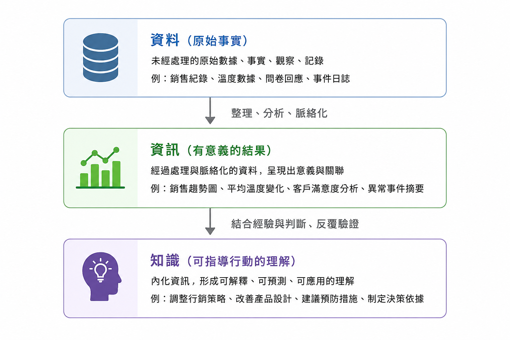

*本圖由 ChatGPT 生成，已由作者審核內容正確性*

> 資訊系統能夠自動完成資料→資訊的轉換；而資訊→知識的這一步，往往仍需要人的經驗與判斷——這也是知識管理系統（KMS）與專家系統存在的根本原因。

傳統上，「知識」的運用高度依賴人類專家：工程師累積多年經驗，才能在看到異常數據時立刻判斷根本原因。為了讓組織的知識不因人員異動而流失，**[專家系統（Expert System）](https://zh.wikipedia.org/wiki/專家系統)** 應運而生——它將領域專家的判斷規則以「若…則…（If-Then）」的形式寫入電腦，讓系統能夠模仿人類專家的推理過程，自動給出建議或診斷。

隨著人工智慧技術的發展，這個能力有了質的飛躍：**AI 專家系統（AI-based Expert System）** 不再只靠人工撰寫規則，而能透過機器學習從大量歷史資料中自動歸納規律，處理更複雜、更模糊的判斷；更進一步的 **[AI 代理人（AI Agent）](https://zh.wikipedia.org/wiki/智能代理)** 則不只「判斷」還能「行動」，會感知環境、擬定計畫、呼叫工具並依執行結果持續修正，幾乎不需人工介入。專家系統的原理、發展史與限制，留待本章後面的〈專家系統（ES）〉詳談；AI 代理人則見 [06-Data-Science-AI-and-Smart-Manufacturing.md](06-Data-Science-AI-and-Smart-Manufacturing.md)。

```
資料 → 資訊系統處理 → 資訊
資訊 → 專家系統／AI → 知識與決策
知識與決策 → AI 代理人 → 自主行動與持續學習
```

> 從資料到資訊是「自動化」，從資訊到知識是「智慧化」，從知識到行動是「自主化」——這正是現代 AI 在資訊系統中扮演的核心角色。

### 2. 資訊系統的基本概念

**[資訊系統（Information System，IS）](https://zh.wikipedia.org/wiki/資訊系統)** 是一套將資料轉換成資訊的整合性系統。要理解它的運作，最好的切入點是 **系統觀念（Systems Concept）** ——這是源自 [一般系統理論（General System Theory）](https://zh.wikipedia.org/wiki/系統論) 的基本觀點：任何一個「系統」，不論是一台機器、一條產線還是一套軟體，都可以拆解成「輸入 → 處理 → 輸出」的流程，再加上支撐這個流程的 **儲存**，以及讓輸出反過來修正輸入的 **回饋**。

資訊系統，就是把這套系統觀念具體套用在「把資料變成資訊」這件事情上（Laudon & Laudon, 2022）：

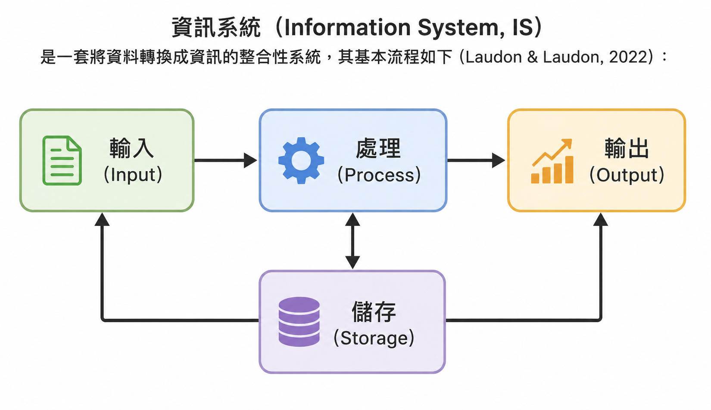

*本圖由 ChatGPT 生成，已由作者審核內容正確性*

- **輸入（Input）**：從外界蒐集原始資料，例如使用者鍵入的表單、感測器回傳的讀數、其他系統傳來的訊息
- **處理（Process）**：依照既定的規則對資料進行運算、比對、彙整或篩選，把原始資料轉換成有意義的資訊
- **儲存（Storage）**：把資料與處理結果保存在資料庫或檔案中，讓系統能隨時取用歷史資料，也讓不同時間點的處理得以延續
- **輸出（Output）**：將處理後的資訊以報表、畫面、警報或訊息的形式，交給使用者或下一個系統
- **回饋（Feedback）**：把輸出的結果或使用者的反應送回輸入端，用來調整下一輪的處理，讓系統能自我修正、持續改善

> **這套「輸入 → 處理 → 儲存 → 輸出」再加上回饋的結構，是現代資訊系統的基本標準型態。** 不論是你手機裡的一個 App、學校的 Portal 校務系統，還是動輒上百個模組的 ERP，只要它是一套資訊系統，骨架幾乎都脫離不了這個系統觀念的結構——差別只在規模大小，以及輸入什麼資料、做什麼處理、輸出什麼資訊。掌握了這個觀念，你就有了一把拆解任何資訊系統的萬用鑰匙：面對一套陌生的系統，先問它「輸入什麼、怎麼處理、存在哪裡、輸出什麼、如何回饋」，就能快速抓到它的骨架。

系統觀念還有一個關鍵的延伸：**一套系統的輸出，可以成為另一套系統的輸入**，多個系統就這樣一個接一個串連起來，共同組成一個規模更大的系統。這就是為什麼前言的表格會出現「簽到系統 → 校務系統」——教室門口的簽到系統，它的輸出（每堂課的刷卡紀錄）正是校務系統出缺席功能的輸入；而校務系統彙整出的成績與出缺席資訊，又可能成為導師輔導系統的輸入。

工廠裡也是同樣的道理：MES 產出的生產與品質資料，會成為 ERP 計算成本與排程的輸入，ERP 的採購決策又回頭驅動倉儲系統的進出貨。因此，一套「大系統」往往不是單一龐然大物，而是許多各自遵循「輸入 → 處理 → 儲存 → 輸出」的子系統，透過彼此的輸入輸出接口串接而成——這也是本章後面〈三、企業應用系統〉會談到的系統整合的基礎。

下面這張美國退伍軍人事務部的財務管理系統框架圖，就是一個典型的例子：整套財務管理不是一個大程式，而是由預算、會計、採購、支付等多個子系統彼此串接、資料互通而成，恰好印證了「大系統由子系統組成」的觀念。

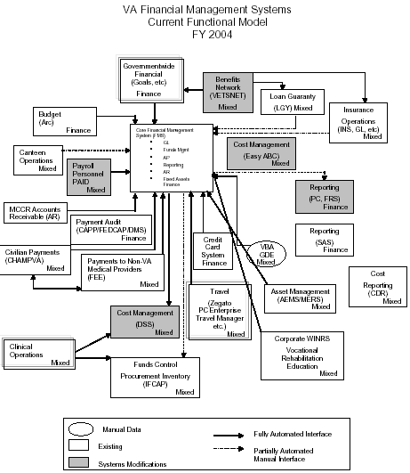

*圖片來源：[Wikimedia Commons「Financial Management System.gif」](https://commons.wikimedia.org/wiki/File:Financial_Management_System.gif)，美國退伍軍人事務部（U.S. Department of Veterans Affairs），公有領域（Public Domain）*

**校園系統觀點**：以你最熟悉的圖書館借還書系統為例，這套系統觀念一目了然——你刷學生證、掃描書本條碼是 **輸入**；系統比對你的借閱權限、計算應還日期是 **處理**；把這筆借閱紀錄寫進資料庫是 **儲存**；螢幕顯示借閱明細、更新你的可借冊數是 **輸出**；當書逾期未還，系統自動寄出催還通知、促使你趕快還書，這筆「還書」動作又回到系統成為新的輸入，就形成了 **回饋** 的閉環。Portal 校務系統的選課、成績查詢，背後也都是同一套結構在運作。

**工業應用**：同樣一套結構，放大到工廠的生產報表系統——**輸入** 是各機台感測器資料與操作員手動輸入的產量紀錄；**處理** 是計算良率、[OEE](https://zh.wikipedia.org/wiki/設備效率評價)、稼動率等關鍵指標；**儲存** 是將每日資料存入資料庫，供未來查詢與比對；**輸出** 是產生每日生產報表與異常警報，供管理者決策；而管理者依報表調整生產參數、再反映到隔日的機台資料上，就構成了 **回饋**。

### 3. 資訊系統的組成要素

資訊系統不只是電腦或軟體，而是由五個要素共同構成的整體：

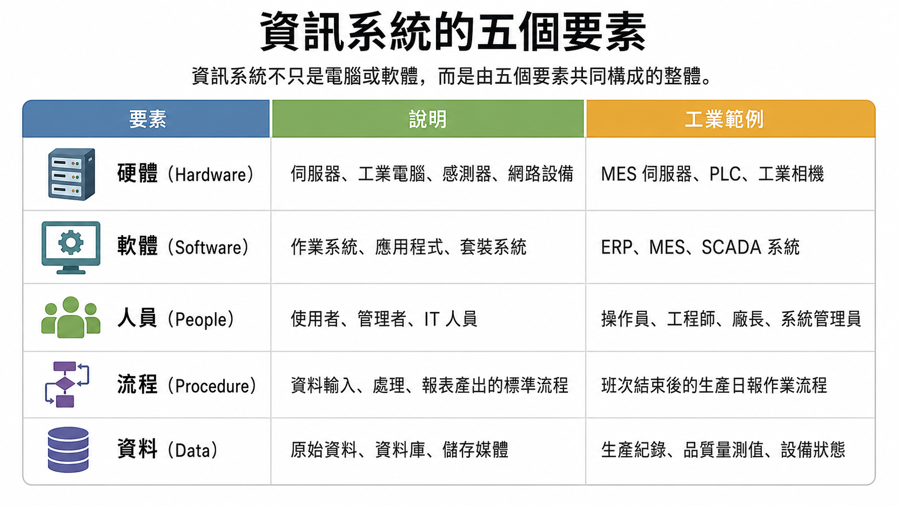

*本圖由 ChatGPT 生成，已由作者審核內容正確性*

> **關鍵認知**：導入資訊系統不只是購買軟體，而是同步調整流程、訓練人員、整合資料，才能真正發揮效益。許多工廠在導入 ERP 或 MES 時失敗，往往不是技術問題，而是忽略了人員訓練與流程調整。

---

## 二、資訊系統的類型

根據組織的層級與用途，資訊系統可以分為 **作業、管理、策略** 三個層次（Laudon & Laudon, 2022; O'Brien & Marakas, 2011）。

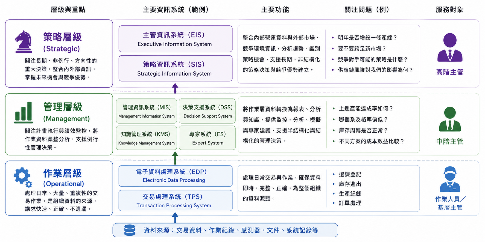

*本圖由 ChatGPT 生成，已由作者審核內容正確性*

這三個層次對應組織中由下而上的三種角色，各自服務的決策性質不同：

| 層級 | 一句定義 | 例子 |
|------|---------|------|
| **作業層級（Operational）** | 服務第一線作業人員與基層主管，處理日常、大量、重複的交易，是全組織的資料源頭 | 選課登記、庫存進出、生產紀錄 |
| **管理層級（Management）** | 服務中階主管，把作業層資料彙整成報表與分析，支援管理控制與決策 | 產能達成率報表、各系及格率統計 |
| **策略層級（Strategic）** | 服務高階主管，整合內外部資訊，支援長期、非例行的方向性決策 | 是否增設產線、要不要跨足新市場 |

由下而上，資訊被摘要、濃縮的程度越來越高，使用的頻率越來越低，但每一次決策的影響範圍與重要性卻越來越大——這正是上圖金字塔造型所要傳達的關係。

### 1. 三個層級是「地圖」，不是硬性歸類

把資訊系統切成作業、管理、策略三層，是為了「概念上好討論」而做的教科書式分類——它源自管理學把組織切成基層、中階、高階的理論，方便你理解各種系統各自在忙什麼。但若把它當成現實中的硬性規則，就會產生兩個常見的誤會：

**誤會一：每種人只用某一層的系統。** 看到「作業層級服務作業人員、管理層級服務中階主管、策略層級服務高階主管」的對應，很容易誤以為基層人員只會用作業系統、中階主管只碰管理系統、策略系統則專屬高階主管，彷彿每種人被綁定在某一層。實際上沒有人規定誰只能用哪一層：中階主管照樣要登入作業系統填自己的請假單、報帳；第一線作業人員也可能去查詢部門的管理報表，了解自己這條線的達成率；高階主管當然也會親自檢視每日的營運日報，而不是只看年度策略分析。**層次分的是「決策的性質」，不是「使用者的職級」**——同一個人，會因為手邊要做的事情不同，而在不同層級的系統之間來回穿梭。

**誤會二：每套系統只屬於某一層。** 實務上你很難找到一套系統剛好只落在單一層級——現代資訊系統越做越龐大，往往同時橫跨好幾個層級，而且系統規模越大，越是包山包海。以本章後面〈三、企業應用系統〉會談到的 ERP 為例，它底層有處理進出貨、訂單、庫存異動的交易功能（作業層級），中間能產出各種產能與成本報表（管理層級），高層還能支援跨廠的產能配置決策分析（策略層級），一套系統就把三個層級全包了。

因此，閱讀以下分類時請把它當成理解資訊系統的「地圖」，而不是現實中每套系統、每個人的硬性歸類。

還有一點要先說明。上面這套「作業／管理／策略」以及底下 EDP、TPS、MIS、DSS 等系統類型的分類，早在 1960 至 1980 年代、大數據與人工智慧技術還遠未普及時就已經成形，至今仍是理解資訊系統最清楚的框架——因為它是依「決策的性質」來切分，而決策的層次不會因為技術改朝換代而消失。

當代的 AI 與大數據並沒有推翻這套分類，而是讓每一層原本的功能變得更強大：作業層蒐集得更即時、管理層分析得更深入、策略層看得更長遠。正因如此，接下來介紹每一種系統類型時，我們都會補上一行「大數據與 AI 的影響」，先讓你對這股變化有個概念；至於 AI 究竟如何改造資訊系統，本章〈七、網路技術對資訊系統的影響〉與 [06-Data-Science-AI-and-Smart-Manufacturing.md](06-Data-Science-AI-and-Smart-Manufacturing.md) 會再深入說明。

### 2. 作業層級資訊系統

作業層級系統處理的是日常、大量、重複性的交易資料，例如每一筆訂單、每一次進出貨、每一張刷卡紀錄。它站在整個組織資訊系統的最前線，是上層所有報表與分析的資料來源基礎——後面各層級看到的每一個數字，追根究柢都是從這一層一筆一筆累積上來的。正因為它是源頭，這一層的兩件事就特別關鍵：資料「怎麼進來」，以及進來的資料「乾不乾淨」。

值得特別強調的是，作業層級系統的資料 **不一定都是靠人一筆一筆輸入的**。很多人以為「交易」就等於有人坐在電腦前打字，但實際上，越是現代化的作業系統，越是把「輸入」這件事交給機器自動完成。

例如：生產線上的感測器每秒自動回報溫度與轉速、條碼與 [RFID](https://zh.wikipedia.org/wiki/無線射頻辨識) 讀取器在物料經過時自動記下進出、電子看板在機台故障時自動產生一筆異常紀錄、上游系統也會直接把資料餵進來（例如電商平台的訂單自動流入出貨系統）。

人工鍵入只是輸入來源的其中一種，尤其在智慧製造的場景中，占比往往越來越低。因此，判斷一套系統是不是作業層級，關鍵在於它處理的是不是「日常、大量、重複的交易」，而不在於這些交易由人還是由機器產生。

這裡有一個容易被忽略、卻至關重要的觀念：**管理層級系統產生的報表與分析，品質完全取決於它底下作業層級系統餵進來的資料。** 資訊領域有一句流傳已久的話——**「垃圾進，垃圾出」（Garbage In, Garbage Out，GIGO）**：如果輸入的是錯誤、遺漏或不即時的資料，那麼再精密的統計、再漂亮的報表，輸出的也只是包裝過的錯誤。

舉例來說，若第一線操作員忘了掃描某批不良品，本章稍後管理層級會談到的 **MIS** 算出來的良率就會虛高，主管據此做的決策自然全盤偏差。正因如此，許多企業在導入或重整資訊系統時，會花大量心力在「資料如何進入系統」這個最前端的階段，反覆推敲三個問題：

- **如何有效輸入**（減少人工鍵入、改用感測器或條碼自動採集，降低出錯機會）
- **如何保證資料品質**（在輸入當下就檢查格式、範圍與必填欄位，不讓錯誤資料進門）
- **如何驗證資料正確**（透過交叉比對、異常偵測或人工抽查，確認資料反映真實）。把輸入這一關把好，後面所有層級的系統才有意義。

作業層級的資訊系統可以包括以下：

#### 電子資料處理系統（Electronic Data Processing，EDP）

---

[EDP](https://zh.wikipedia.org/wiki/數據處理) 將人工的重複性資料處理工作自動化，例如訂單建檔、庫存異動、薪資計算等。其核心目的是「以電腦代替人工執行固定流程」，提高速度與準確性。

**校園情境**：學校每學期把上千筆選課登記、成績登錄、學雜費繳費紀錄自動建檔與計算，取代早年職員逐筆手寫謄抄，就是 EDP 最貼近你的例子。

**工業應用**：工廠每天的物料入出庫紀錄、排班表計算、計件薪資核算，都是 EDP 的典型應用。

**大數據與 AI 的影響**：資料量放大到每日數百萬筆後，AI 能在建檔當下就自動挑出重複或異常紀錄，減少事後人工核對。

#### 交易處理系統（Transaction Processing System，TPS）

---

[TPS](https://zh.wikipedia.org/wiki/交易處理系統) 用於記錄與處理企業最底層的日常交易，是 ERP 與 MES 的資料基礎。你每學期的選課、成績登錄、借還書，其實都是一筆筆「交易」，正是 TPS 在背後處理。

生活中最常見的 TPS，就是商店結帳櫃檯的 **[銷售時點情報系統（Point of Sale，POS）](https://zh.wikipedia.org/wiki/銷售時點情報系統)**。你在便利商店、餐廳或書店消費時，店員刷過條碼、螢幕跳出金額、收據列印出來的那一瞬間，就是一筆交易被 POS 完整記錄下來——它同時扣減庫存、累計營收、寫入銷售明細，正是 TPS「即時、大量、逐筆記錄」特性最貼近日常的樣貌。

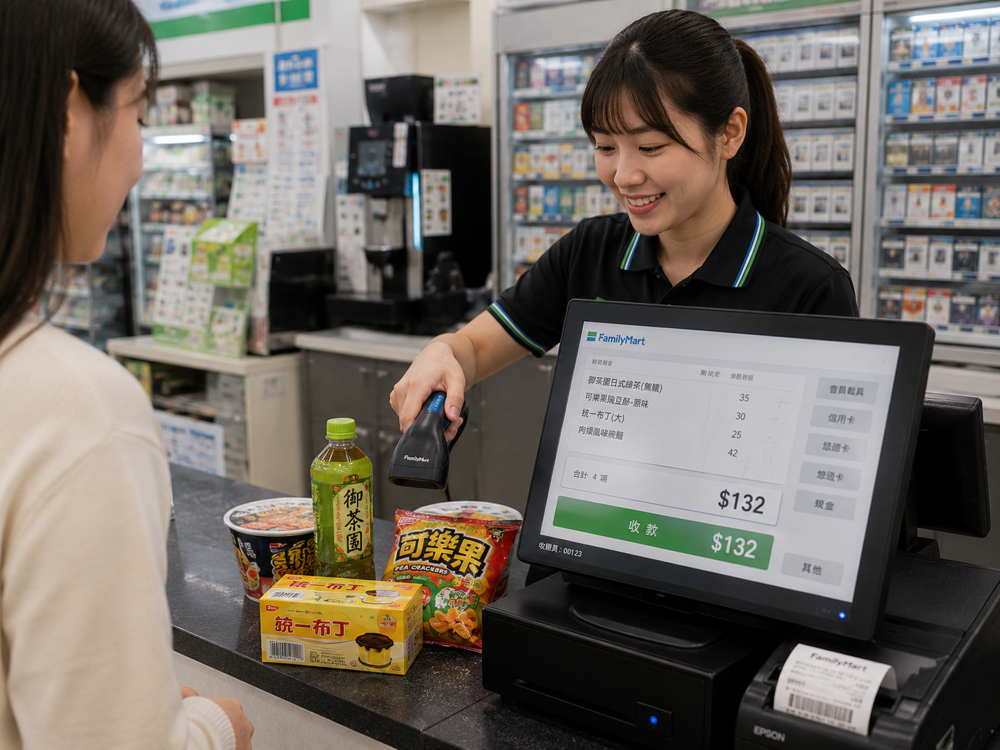

*本圖由 ChatGPT 生成，已由作者審核內容正確性*

TPS 的三種處理方式：

| 處理方式 | 說明 | 校園範例 | 工業範例 |
|---------|------|---------|---------|
| **批次處理** | 累積資料後一次處理 | 學期末一次結算全校成績、計算 GPA | 每日班次結束後，一次計算所有機台 OEE |
| **分時處理** | 多人同時共用系統資源 | 選課期間上千名學生同時上線操作選課系統 | 多條產線同時向 MES 回報生產進度 |
| **即時處理** | 收到資料後立即處理 | 學生刷卡進圖書館，門禁立即驗證學號 | 感測器偵測到異常後立即觸發警報 |

**大數據與 AI 的影響**：每筆交易即時串流進資料庫，AI 能在毫秒間判斷是否異常（如盜刷、庫存數字失真）並即時攔截。

### 3. 管理層級資訊系統

管理層級系統把作業層日積月累的交易資料彙整、分類、統計，轉成主管看得懂、用得上的報表與分析，例如上週的產能達成率、這個月的成本結構、各產線的良率排名。它夾在作業層與策略層之間，服務的是課長、廠長、部門經理這些既要盯緊第一線、又要向上級負責的中階主管。正因為服務的是「每天都得做決定」的人，這一層的系統不會停在把數字排整齊，而是從回顧過去的例行報表，一路延伸到幫忙分析方案、累積組織知識、甚至給出專家般的判斷。

#### 管理資訊系統（Management Information System，MIS）

---

[MIS](https://zh.wikipedia.org/wiki/管理資訊系統) 將 TPS 產生的大量交易資料彙整、分類、統計，以定期報表的形式呈現，供主管進行規劃與管理控制。如果說 TPS 是一筆一筆把交易記下來的「記帳員」，那 MIS 就是把成千上萬筆流水帳整理成月報、季報的「彙整者」——它把散落在各處、單看沒有意義的交易資料，濃縮成主管一眼就能掌握全局的固定格式報表。MIS 有三個鮮明的特徵：

- 它自動生成 **結構固定、定期產生** 的報表（日報、週報、月報），格式事先設計好，時間到了就自動生成，不需臨時客製
- 它處理的是 **已經發生的歷史資料**，回答的是「上週產能達成率多少」「這學期哪個系及格率偏低」這類 **回顧性、例行性** 的問題
- 它的任務是 **監督與控制**——讓主管拿實際結果對照原訂計畫，及早發現偏差，而不是幫主管做出全新的決策（那是後面 DSS 的工作）。

換句話說，MIS 的價值在於把龐雜的作業層資料「看得見、管得住」，是中階主管每天據以掌握營運狀況的儀表板。就像下圖這位便利商店老闆，正盯著電腦螢幕上的月報表——每筆結帳交易由 POS（也就是前面談過的 TPS）逐筆記下，MIS 再把整個月成千上萬筆銷售彙整成「哪些商品最好賣、哪個時段人潮最多、這個月營收比上月成長或衰退」的報表，他不必翻遍每一張發票，看一眼報表就能決定下個月要多進什麼貨、調整哪個班表。

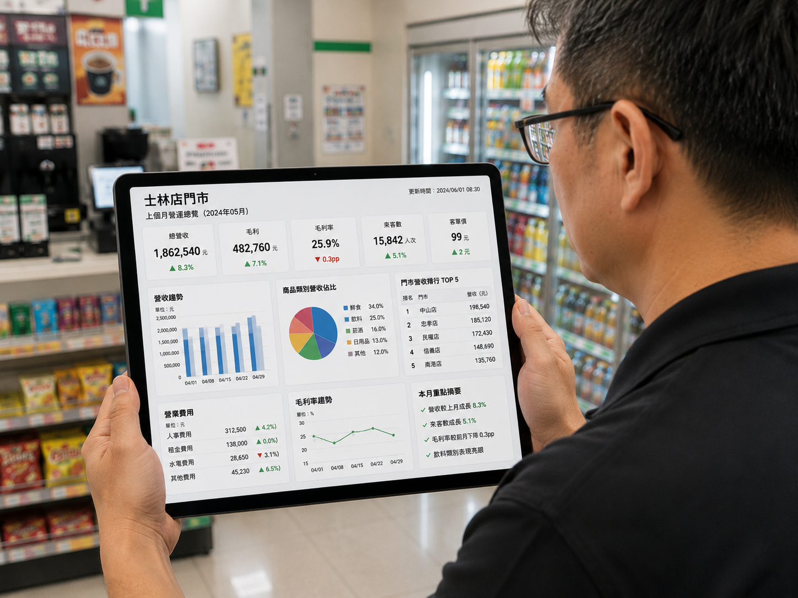

*本圖由 ChatGPT 生成，已由作者審核內容正確性*

**校園情境**：教務處每學期彙整各班成績，產生「各系及格率」「必修課當掉人數」「新生註冊率」等定期報表，供系主任掌握教學狀況，就是校園版的 MIS。

**工業應用**：每週產能達成率報表、各機台不良品統計、原物料消耗分析——這些都是 MIS 的典型輸出。

**大數據與 AI 的影響**：AI 讓報表從定期產出走向即時彙整，還能用自然語言直接回答「這週哪條線最該注意」，MIS 從被動查閱轉為主動提示。

#### 決策支援系統（Decision Support System，DSS）

---

[DSS](https://zh.wikipedia.org/wiki/決策支援系統) 協助中高階主管處理較複雜、非例行性的半結構化決策問題。它和 MIS 有一個本質上的差異：MIS 把資料整理成報表，回答「發生了什麼」，剩下的判斷留給主管自己；DSS 則更進一步，透過模擬、情境分析與多方案比較，直接回答「該往哪個方向走、哪個方案比較好」。

換句話說，**DSS 的價值不在於把資料排成漂亮的表格，而在於幫管理者拍板經營方向、選定解決方案**。同一份成本與需求資料，MIS 頂多告訴你「這季毛利下滑」；DSS 卻能讓你輸入「漲價 10%」「換供應商」「調整產品組合」等不同假設，模擬出各方案的預期結果，把一堆數字收斂成一個可以據以行動的建議。或者假如你是投資專家，想要模擬「利率如果再升一碼、原物料再漲一成，這檔投資組合的報酬與風險會怎麼變化」，DSS 一樣能整合市場行情、歷史走勢與風險模型，把每一種假設情境的可能結果一次算給你看，讓你在真正下單前就先權衡利弊、選出最穩健的配置。


*本圖由 ChatGPT 生成，已由作者審核內容正確性*

DSS 通常包含三個部分：

```
資料庫（內部 + 外部資料）
    ↓
資料分析工具（統計模型、模擬工具、AI 模型、大語言模型）
    ↓
使用者介面（讓決策者互動式操作）
```

**校園情境**：「若把某門必修從大二下移到大三上，會不會拉低整體畢業率、又會不會和其他課衝堂？」這類需要模擬排課與歷屆修課資料的半結構化決策，就需要 DSS 協助分析。

**工業應用**：「若原料漲價 15%，是否應調整生產組合？」這類非例行性的決策，需要 DSS 整合成本資料、需求預測與模擬工具才能有效分析。

**大數據與 AI 的影響**：傳統統計模型並未被淘汰，迴歸、時間序列這些方法至今仍是 DSS 的分析主力；只是在它們之外，又加入了機器學習預測模型，能吸收更多外部大數據、處理非線性關係，讓情境模擬多一種視角、更貼近真實。

#### 知識管理系統（Knowledge Management System，KMS）

---

[KMS](https://zh.wikipedia.org/wiki/知識管理) 蒐集、整理、保存與分享組織內的知識資產。知識分為兩類：

- **[內隱知識（Tacit Knowledge）](https://zh.wikipedia.org/wiki/內隱知識)**：個人經驗、技巧與判斷，難以文字化，例如資深工程師對設備異音的判斷能力
- **外顯知識（Explicit Knowledge）**：可文件化、分享的知識，例如設備操作手冊、故障排除 SOP

KMS 的樣貌這幾年正在劇烈改變。早期的 KMS 比較像一座 **數位檔案庫**：把文件、手冊、案例報告集中存放，建立分類與關鍵字索引，讓員工需要時能搜尋調閱。它的侷限也很明顯——你得先猜對關鍵字，文件還得有人事先整理歸檔；那些散落在資料庫、PDF、簡報，甚至會議錄音與教學影片裡的知識，往往搜不到、也用不上。

> **趣味小知識**：這種「數位檔案庫」型的 KMS 其實近在眼前。[元智大學秘書室的校內法規知識庫](https://www.yzu.edu.tw/admin/so/index.php/tw/2016-01-03-17-48-35/zong-he-xing-gui-zhang) 就是一個典型例子——它把全校的組織章程、人事、教務、學務等各類規章依類別整理成一份份文件，供師生分類瀏覽或關鍵字查詢。你要找某條規定，得先猜它被歸在哪一類、用什麼字眼命名，再自己點開文件逐條讀。這正是本段所說的傳統數位檔案庫：資料齊全、分類清楚，但「找」跟「讀」還是得靠你自己，系統不會幫你把答案整理好。

近年 **[檢索增強生成（Retrieval-Augmented Generation，RAG）](https://zh.wikipedia.org/wiki/檢索增強生成)** 技術與大型語言模型（LLM）的加入，讓 KMS 脫胎換骨。現代 KMS 能把來自不同來源的資料（結構化的資料庫、各種格式的文件檔案，甚至音訊與影片轉出的逐字稿）統一轉換成 **RAG 向量資料**（把文字的語意編碼成一串數學向量，讓機器能依「意思相近」而非「字面相同」來檢索）。當使用者用自然語言提問時，系統會先從這些向量中撈出最相關的片段，再交給 LLM 彙整、生成一段通順的自然語言回答，並附上引用來源。知識的取用因此從「搜尋關鍵字、自己讀文件」升級為「直接問、直接得到整理好的答案」。

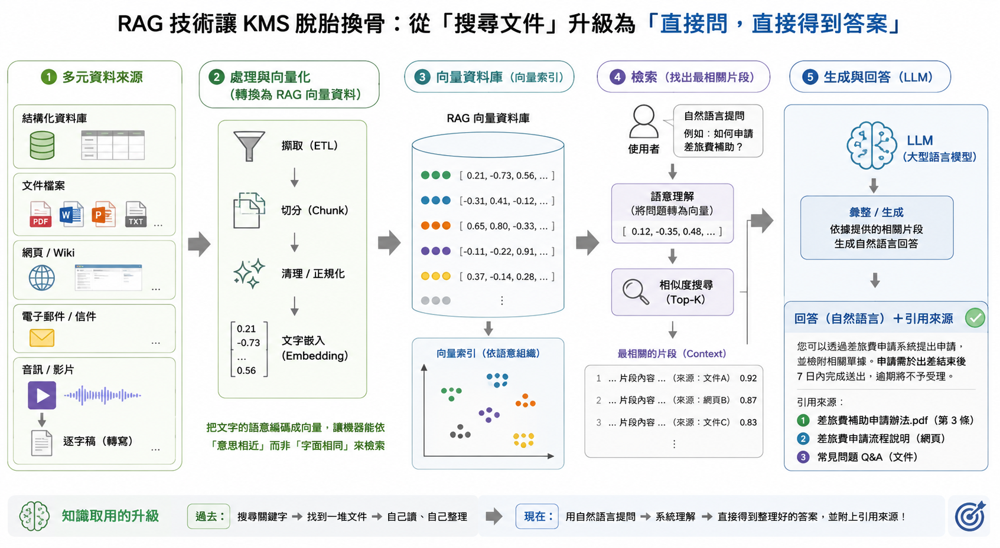

*本圖由 ChatGPT 生成，已由作者審核內容正確性*

講得再白話一點：你只要對現代 KMS 打一句「請幫我整理我們公司過去和 A 公司的採購流程」，系統就會自動把散落在合約、郵件、簡報、報價單裡的相關內容找齊、歸納好，幾秒鐘回你一段條理分明、還附上引用來源的說明——這在過去得靠夠資深的人翻查半天才做得到。

**校園情境**：系上的「教學助教經驗共享區」與「歷屆考古題、解題筆記庫」，讓新任助教與學弟妹快速上手，不必每次重新摸索，就是校園裡的 KMS。

**工業應用**：工廠建立「設備故障案例知識庫」，記錄歷次故障的現象、診斷過程與解決方法。新進工程師查詢後能更快處理類似問題，不必每次都重新摸索——這就是 KMS 的核心價值。

**大數據與 AI 的影響**：除了前述的問答升級，LLM 還能反過來「創造」知識——自動把散落在各案例中的重複現象歸納成新的故障模式或最佳實務，讓知識庫不只是被查詢，還會自己長出新內容。

#### 專家系統（Expert System，ES）

---

ES 模擬特定領域的專家判斷，由 **知識庫、推理機與使用者介面** 構成。使用者輸入事實後，系統依據規則推理，輸出建議或診斷結果。

以最容易理解的 **AI 醫療診斷** 為例，就能看清這三個部分怎麼分工：

 - **知識庫** 存放的是眾多醫師累積的醫學知識與判斷規則（例如「發燒＋咳嗽＋胸部 X 光有陰影 → 高度懷疑肺炎」）
 - **推理機** 是系統的大腦，負責把病人這次的症狀一條一條套進這些規則，逐步推導出最可能的結論
 - **使用者介面** 則讓醫師輸入症狀與檢驗數據、看到系統列出的可能病名與處置建議。你在大醫院看到的智慧問診系統、或手機上輸入症狀就給你初步研判的健康 App，骨架都是這套「知識庫＋推理機＋介面」。它的角色不是取代醫師，而是像一位隨時待命、讀過海量病例的助手，替醫師縮小範圍、提醒容易漏掉的可能性，最後的診斷仍由醫師拍板。


*本圖由 ChatGPT 生成，已由作者審核內容正確性*

其實，專家系統在人工智慧的發展史上大有來頭。它曾是早期 AI 最被寄予厚望的分支——1980 年代第二波 AI 浪潮的主角（見 [06-Data-Science-AI-and-Smart-Manufacturing.md](06-Data-Science-AI-and-Smart-Manufacturing.md)〈AI 的三波發展〉），當時許多人相信，只要把專家的知識一條條寫成規則，電腦就能複製人類專家的判斷。早在 1970 年代，史丹佛大學開發的醫療專家系統 **MYCIN** 就能根據病人症狀推薦抗生素療法，測試中的判斷準確率甚至勝過部分人類醫師——但它從未真正用於臨床。原因不是技術不行，而是當年沒人能回答一個關鍵問題：如果系統開錯藥，責任該算誰的？這個「AI 該由誰負責」的難題，到今天仍是 AI 落地醫療、製造等高風險場域時繞不開的課題。

不過，責任歸屬還只是專家系統眾多罩門的其中之一。它先天上就有幾道難以跨越的高牆，維基百科將其歸納為四點：

 - **知識獲取瓶頸（knowledge acquisition bottleneck）**：要把專家腦中那些說不清、靠經驗累積的知識（也就是前一節 KMS 提過的內隱知識）一條條翻譯成明確的規則，既困難又極度耗時。
 - **缺乏常識與穩健性**：系統只在事先定義好的窄領域內管用，一旦問題超出邊界，就可能推出荒謬的結論（即所謂的「脆性」問題）。
 - **維護困難**：當領域知識改變、要更新規則庫時，新規則常和舊規則產生難以預料的交互影響，牽一髮而動全身。
 - **缺乏學習能力**：傳統專家系統無法從新案例中自我改進，每一次更新都得靠人工介入重寫規則。

這些先天限制，使得專家系統在 [1990 年代第二波「AI 寒冬」](https://zh.wikipedia.org/wiki/人工智慧低谷) 來臨時隨之沉寂。直到近年機器學習與大型語言模型崛起（電腦終於能自己從資料中歸納規則、也能用自然語言互動，恰好補上了當年那幾道缺口），才又把專家系統以全新的面貌重新推到使用者面前。

**校園情境**：「選課諮詢系統」讓你輸入興趣領域與已修課程，系統依「先修科目規則」與「畢業學分規則」推理，推薦下學期該修哪些課，就是專家系統的縮影。

**工業應用**：「設備診斷專家系統」：操作員輸入「主軸振動加大、電流升高、加工表面粗糙」，系統推理後輸出「刀具磨耗，建議更換刀具並複查主軸軸承」。隨著生成式 AI 的進步，現代專家系統越來越多結合大型語言模型，提供更自然的互動體驗。

**大數據與 AI 的影響**：判斷規則不再全靠專家手寫，機器學習能從大量歷史案例中自動歸納，涵蓋更模糊的判斷情境。

### 4. 策略層級資訊系統

策略層級系統服務的是站在組織最高點的高階主管，提供的不是單一部門的細節，而是跨部門、跨廠區甚至跨市場的整體視野，例如該不該蓋新廠、要不要進軍新市場、要用哪種技術卡住競爭對手。這類決策沒有標準答案、影響卻長達數年，屬於高度非結構化的長期策略問題。正因為看的是這麼大的一盤棋，這一層的系統一面要把龐雜的內外部資訊濃縮成高階主管一眼看得懂的全局，一面更要把資訊科技本身當成一種與對手較勁的競爭武器。

#### 主管資訊系統（Executive Information System，EIS）

[EIS](https://zh.wikipedia.org/wiki/高階主管資訊系統) 整合企業內部 MIS、DSS 資料與外部市場資訊，以儀表板、摘要圖表與關鍵績效指標的形式呈現，使高階主管能快速掌握全局。

EIS 和前面的 MIS、DSS 最大的不同，在於它是 **為「沒時間看細節」的高階主管量身打造的**。董事長、執行長每天要掌握的是整個組織的健康狀況，不可能逐張報表細讀，因此 EIS 有三個鮮明特色。

- **高度摘要與視覺化**：把成千上萬筆營運數字濃縮成少數幾個關鍵指標與紅綠燈號，讓人一眼就能判斷「哪裡正常、哪裡出問題」
- **支援逐層鑽取（drill-down）**：當某個指標亮起紅燈，主管可以一層層往下點，從全公司看到單一廠區、再看到單一產線，順著追出問題的根源——這讓 EIS 兼顧了宏觀視野與追查細節的能力，不會只停在漂亮的總表
- **重視例外與趨勢**：EIS 不會把所有正常數字平鋪給你看，而是主動凸顯異常與變化趨勢，因為對高階決策而言，「哪裡不對勁、情勢往哪走」遠比「哪裡都正常」更值得注意。

不過話說回來，**EIS 和 MIS 骨子裡其實相當接近**——兩者都是把下層累積的大量資料摘要成綜觀性的資訊，交給某個層級的主管用來掌握全局，本質上是同一件事在不同高度上的展現。差別主要在服務的對象與摘要的程度：MIS 服務中階主管，把某個部門或某條產線的資料整理成例行報表；EIS 服務最高層，把整個組織、甚至跨廠跨國的資料再進一步濃縮成一眼可讀的儀表板。你幾乎可以把 EIS 想成「站得更高、看得更廣、摘要得更精簡」的 MIS。這也正好再次印證本章前面說過的——作業、管理、策略這些分類是幫助理解的「地圖」，實務上相鄰層級的系統往往界線模糊、彼此重疊。

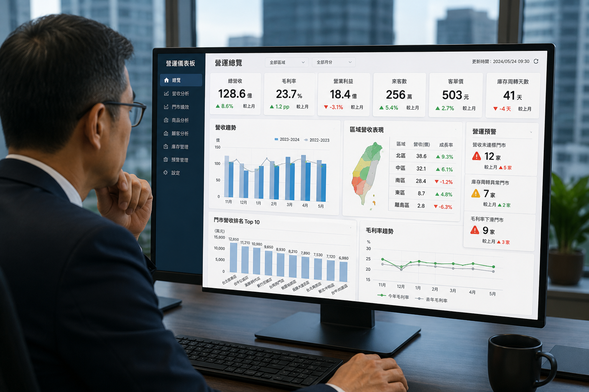

*本圖由 ChatGPT 生成，已由作者審核內容正確性*

**校園情境**：教務長透過校務儀表板，一眼看到全校各系的註冊率、休退學率、師生比與畢業生就業率，快速判斷哪個系所需要投入資源，這就是 EIS 服務高階決策者的角色。

**工業應用**：集團董事長透過 EIS 儀表板，一眼看到全球三座工廠的即時產能、良率、庫存水位與成本差異，快速判斷是否需要調整產能配置。

**大數據與 AI 的影響**：儀表板從每日更新走向即時串流，AI 能主動預警異常趨勢，不必等高階主管自己察覺。

#### 策略資訊系統（Strategic Information System，SIS）

SIS 整合內部營運資料與外部市場、競爭環境資訊，支援企業分析趨勢與識別策略機會，例如評估新市場進入、競爭對手動向或供應鏈風險。

SIS 和前面所有系統之間，有一個層次上的跳躍。MIS、DSS、EIS 說到底都是用資訊系統來「把公司管好」，眼睛向內看；SIS 則是把資訊系統本身當成一件 **競爭武器**，用它去改變公司在市場上的競爭地位，甚至重新定義整個產業的遊戲規則。它關心的不再是「我們內部運作得順不順」，而是「如何用資訊科技打贏對手、築起別人一時跨不過的門檻」。

最經典的例子出現在航空與零售業。美國航空當年靠 [SABRE](https://zh.wikipedia.org/wiki/Sabre_(電腦系統)) 訂位系統，把訂票終端機鋪進全美各地的旅行社，等於搶先掌握了消費者訂票的入口，在對手還來不及反應時就築好了護城河；沃爾瑪則靠一套即時串連門市與供應商的補貨系統，把庫存與物流成本壓到同業難以匹敵，它招牌的「天天低價」策略才得以成立。這些系統的價值不在於「產出漂亮的報表」，而在於它們為企業取得了對手一時追不上的 **結構性優勢**——這正是 SIS 與其他資訊系統最不一樣的地方。

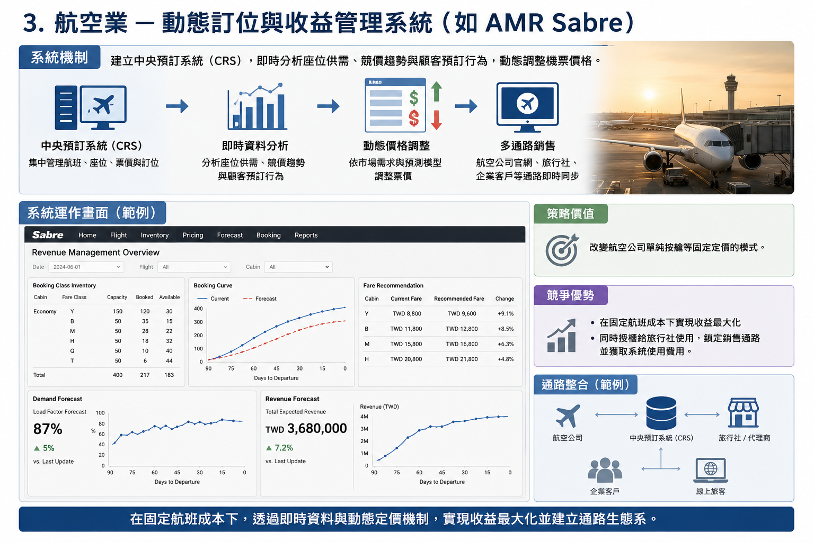

*本圖由 ChatGPT 生成，已由作者審核內容正確性*

以校園來類比，學校分析少子化趨勢與各校招生競爭，搶先設立 AI、半導體等熱門科系，或整併招生不足的系所、把資源集中到最有競爭力的領域，就是策略層級的資訊運用——目的同樣是在激烈的招生競爭中，替自己卡到一個有利的位置。

**大數據與 AI 的影響**：AI 能即時分析輿情、市場與供應鏈等外部大數據，讓趨勢預測與風險預警比過去更快、更全面。

---

## 三、企業應用系統

前面〈二、資訊系統的類型〉是從 **決策層級** 由下而上認識資訊系統——作業、管理、策略，回答的是「這個決策站得多高、看得多遠」。但若改站在 **企業經營管理** 的立場，資訊系統還有另一種同樣實用的切法：依 **管理功能** 橫向劃分。

企業管理常把一家公司的運作歸納成「五管」，也就是[生產](https://zh.wikipedia.org/wiki/生產管理)（產）、[行銷](https://zh.wikipedia.org/wiki/市場行銷)（銷）、[人力資源](https://zh.wikipedia.org/wiki/人力資源管理)（人）、[研發](https://zh.wikipedia.org/wiki/研究與開發)（發）、[財務](https://zh.wikipedia.org/wiki/財務管理)（財）五大功能。每一塊都有對應的資訊系統在支撐：生產排程與品質管制、訂單與顧客經營、薪資與出勤、產品開發、成本與帳務——它們多半是各部門為了自己的業務、各自獨立發展出來的。這就是「功能面」的視角：層級面問的是「決策有多重大」，功能面問的是「這是哪個部門、管哪一塊業務」，兩者像是對同一套企業資訊系統做縱切與橫切，並不衝突。

問題是，五管各自建立的系統一多，部門之間的資料就難以互通、經常重複輸入。**[企業資源規劃（Enterprise Resource Planning，ERP）](https://zh.wikipedia.org/wiki/企業資源規劃)** 的概念正是為此而生：把原本各自為政的五管系統整合起來，讓資料一次輸入、全公司共用。ERP 之外，還有 MES、SCM、CRM 等各有專責的企業應用系統，以下逐一介紹。

### 1. 企業資源規劃（Enterprise Resource Planning，ERP）

ERP 是一種 **以企業功能為觀點**、對組織進行 **模組化** 與 **整合** 的企業應用系統。所謂模組化，是把公司的每一項功能（生產、採購、庫存、銷售、財務、人力資源）各自做成一個獨立模組；所謂整合，則是讓這些模組共用同一套資料、串成連貫的資訊流。市面上多數 ERP 產品，本質上就是把企業內部各部門的功能直接整合進同一個平台。一套完整的 ERP 通常涵蓋以下這些彼此相扣的模組：

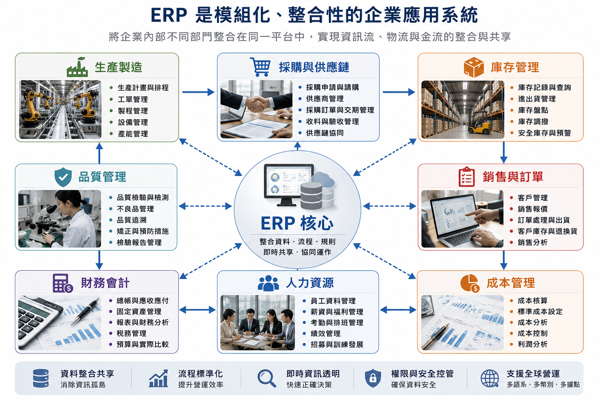

*本圖由 ChatGPT 生成，已由作者審核內容正確性*

正因為 ERP 幾乎把公司所有部門的運作都收進同一套系統，導入它往往是一家企業 **成長到一定規模後才會認真考慮** 的大工程。公司還小、部門單純時，用幾套各自獨立的小軟體就足以應付；等到規模擴大、部門變多、跨部門的流程與帳務越來越糾纏，才真正需要 ERP 把一切收攏到同一套邏輯之下。也因此可以說，**一套 ERP 的資訊流程，幾乎就等於這家公司的營運模式**——訂單怎麼流動、物料怎麼領用、成本怎麼結算、款項怎麼收付，全都被寫進了系統的流程裡。

**ERP 的核心價值**：打破各部門的「資訊孤島」。過去採購部門不知道生產計畫、財務部門不知道庫存成本，每個部門各看各的資料；整合之後，資訊即時流通，全公司據以決策的是同一份真相。

代表性 ERP 系統：[SAP](https://zh.wikipedia.org/wiki/SAP) S/4HANA、Oracle ERP、Microsoft Dynamics 365。

> **補充小知識**：全球最大的 ERP 廠商 SAP 是家德國公司，1972 年由五位不滿東家的前 IBM 工程師離職創立，公司名是德文「Systemanalyse und Programmentwicklung（系統分析與程式開發）」的縮寫。不過 ERP 並非外商專利，台灣也有自己的本土廠商，其中規模最大、市占最高的是 **[鼎新電腦（Digiwin）](https://zh.wikipedia.org/wiki/鼎捷軟件)**：它成立於 1982 年，產品線從中小企業到大型製造業都涵蓋，是許多台灣工廠實際導入的 ERP，也是少數躋身股票上市的本土資訊軟體公司——曾在 2001 年掛牌台灣證交所（代號 2447），2008 年因政策因素下市，之後集團旗下的鼎捷軟件（今鼎捷數智）於 2014 年在中國深圳證交所創業板重新上市（代號 300378），至今仍是上市公司。除了鼎新，正航資訊等也是台灣常見的本土 ERP 品牌；相較於 SAP 這類國際大廠，本土廠商更貼近台灣中小企業的作業習慣與在地法規（如統一發票、報稅格式），導入成本通常也較低。

ERP 並不是新東西，市面上早有像 SAP 這樣發展數十年、相當成熟的產品。大型企業要導入時，通常在兩條路之間抉擇：

- 雇用顧問或軟體廠商 **量身打造**，讓系統盡量貼合自己既有的作業流程
- **直接套用** 產品內建、被業界奉為「最佳實務」的系統邏輯，反過來調整自己的作業去配合它

但不論走哪一條，導入 ERP 對許多公司來說都是一場 **成敗攸關** 的工程——因為它動到的是企業最核心的營運邏輯，一旦失敗（流程對不上、資料一團亂、員工無所適從），輕則勞民傷財、系統形同虛設，重則直接衝擊公司的日常營運。例如前述的 **SAP** 就把企業流程的「最佳實務」寫在系統裡，許多大公司想要導入 SAP 時，反而得回頭修改自己的作業流程去遷就系統，「**導入 ERP 常常不是裝軟體，而是改組織**」。

ERP 名稱裡雖然帶著「企業（Enterprise）」兩字，聽起來像是營利公司專屬，但它的核心概念（把一個組織裡眾多部門的功能整合進同一套系統、共用同一份資料）其實適用於任何「多部門的組織」。

這樣的例子就在你身邊。你天天在用的元智大學 Portal 校務系統，要同時打通教務、學務、總務、人事與會計，某種程度上就是一套「校園版的 ERP」；政府機關要把各科室的行政、公文與預算串在一起，道理也一樣；至於醫院，更是把掛號看診、批價收費、檢驗檢查、藥局發藥到病歷通通整合起來，這套系統還有個專門名稱叫 **[醫院資訊系統（Hospital Information System，HIS）](https://zh.wikipedia.org/wiki/醫院資訊系統)**，本質上就是一套醫療版的 ERP。這些組織雖然不做買賣，卻和企業一樣需要讓眾多部門在同一套系統裡協作——這正是 ERP 概念真正普適的地方。

介紹完作為核心骨幹的 ERP，接下來要談三套最常圍繞著它運作、對製造業也最為關鍵的企業應用系統：**製造執行系統（MES）**、**供應鏈管理（SCM）** 與 **顧客關係管理（CRM）**。ERP 擅長的是把企業「內部」各部門整合起來，但一家公司不會關起門來運作——上游有供應商、下游有顧客，工廠裡還有一台台實際在生產的機器。這三套系統正好各自把整合延伸到一個關鍵方向：**MES 向下**，把 ERP 的生產計畫落實到工廠現場的每一台機台；**SCM 向上游**，把整合延伸到供應商與物料採購；**CRM 向下游**，把整合延伸到顧客與市場需求。ERP 顧內，MES 顧生產、SCM 顧供應、CRM 顧顧客，四者合起來，才拼出一家製造企業從進料、生產、出貨到售後服務完整運作的資訊骨架——這正是它們在工業情境中被視為最重要幾套系統的原因。以下逐一說明。

### 2. 製造執行系統（Manufacturing Execution System，MES）

[MES](https://zh.wikipedia.org/wiki/製造執行系統) 位於 ERP（計畫層）與 PLC/[SCADA](https://zh.wikipedia.org/wiki/資料採集與監控系統)（控制層）之間，負責管理工廠車間（Shop Floor）的即時執行狀況。

| 功能 | 說明 |
|------|------|
| 工單管理 | 接收 ERP 下達的工單，分解為具體生產任務 |
| 排程派工 | 即時排程，分配工作到各機台 |
| 生產追蹤 | 即時掌握每張工單的進度 |
| 品質管理 | 記錄量測結果，支援品質追溯 |
| OEE 計算 | 即時計算設備整體效能 |

> MES 是工業4.0「垂直整合」的關鍵中間層：它向上對接 ERP 的計畫，向下連結機台的即時資料，是資料驅動製造的核心樞紐。

### 3. 供應鏈管理（Supply Chain Management，SCM）

[SCM](https://zh.wikipedia.org/wiki/供應鏈管理) 管理產品從原料到消費者的整個流程，透過資訊系統整合供應商、製造商、物流商與銷售端，使供應鏈能更有效率地規劃、控制與協作。

**工業應用**：當 MES 回報某原料即將耗盡，SCM 系統自動計算補貨量，向合格供應商詢價，並根據庫存策略決定是否下單——這整個流程可以在幾分鐘內自動完成，不需人工介入。

### 4. 顧客關係管理（Customer Relationship Management，CRM）

[CRM](https://zh.wikipedia.org/wiki/客戶關係管理) 透過資訊科技蒐集與分析顧客資料，協助企業掌握顧客偏好、改善行銷與銷售流程，並提升顧客滿意度。

| CRM 類型 | 說明 |
|---------|------|
| **操作型** | 自動化銷售、行銷與客服流程 |
| **分析型** | 分析顧客行為與偏好，支援行銷決策 |
| **協作型** | 整合各接觸點（電話、Email、門市）的顧客互動紀錄 |

---

## 四、資料庫基礎概念

### 1. 資料的層級

要談資料庫，得先看看資料本身在電腦裡是怎麼一層層組織起來的。資料並不是雜亂堆放，而是由小到大分成幾個層級：

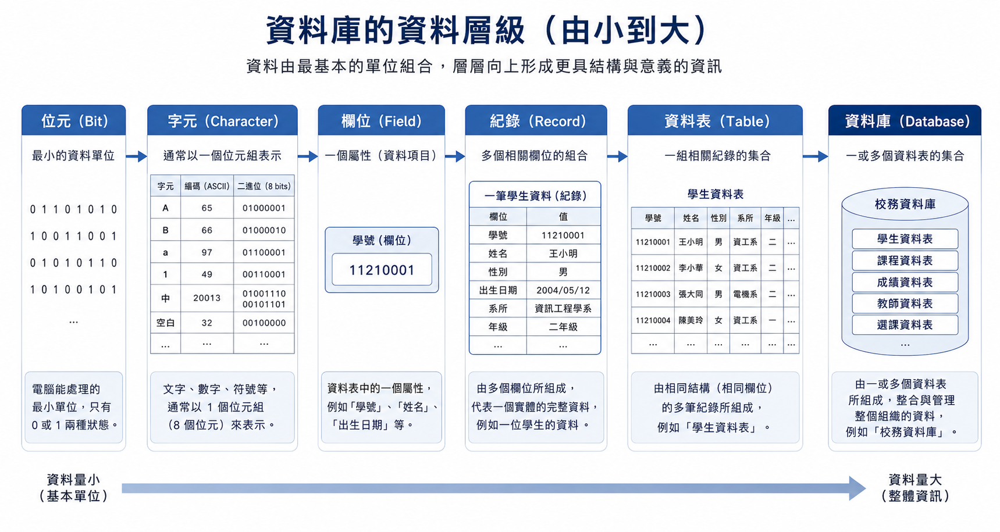

*本圖由 ChatGPT 生成，已由作者審核內容正確性*

最底層是 **字元**（一個數字、字母或符號），往上依序組成 **欄位**（一個屬性，例如「學號」）、**紀錄**（多個相關欄位的組合，例如一位學生的完整基本資料）、**資料表**（一整張「學生資料表」），最上層就是 **[資料庫（Database）](https://zh.wikipedia.org/wiki/資料庫)**——一個或多個彼此相關資料表的集合，依一定格式整合儲存，可供不同使用者與程式共享、查詢與管理。在工廠裡，同一組層級對應的則是「機台編號」這樣的欄位、一筆工單紀錄、整張工單資料表，一路往上組成生產管理資料庫——結構完全一樣，只是換了資料的內容。

用 Excel 試算表來類比最容易懂：一張工作表就像一個資料表；多張工作表放在同一個檔案、彼此透過欄位關聯，就接近資料庫的概念——例如把「學生資料表」「課程資料表」「成績資料表」放進同一個校務資料庫，再用學號、課程代碼互相對應，就是你天天在用的 Portal 背後的樣子。

### 2. 資料是怎麼被管理的：從寫在程式裡到資料庫系統

有了資料，下一個問題是：這些資料該擺在哪裡、由誰來管？這一路的演變，其實就是資料庫系統誕生的故事。

**最早，資料和程式是不分家的。** 早期的程式常把要用的資料直接寫死在程式碼裡——需要哪個數字、哪串文字，就寫在程式當中。資料少時這樣最省事，但只要資料一改，就得回頭改程式、重新編譯，牽一髮而動全身。

**後來，資料被搬出程式，放進獨立的檔案。** 當資料越來越多，工程師把資料從程式裡抽出來，另外存成一個個 **檔案**；程式本身也存成自己的檔案。這裡有個值得停下來想一想的觀念：程式對電腦而言其實也是一種 **資料**——只不過它是描述「資料該如何被處理」的那種資料（程式本身是一連串指令，見 [03-Computer-Program.md](03-Computer-Program.md)）。換句話說，這一步是把「怎麼處理」的資料（程式）和「被處理」的資料（一般資料）分了家，各自獨立存放——從此改資料不必動程式，這是一大進步。

**再後來，檔案多到管不動，就需要專門處理資料的系統。** 隨著資料持續膨脹、檔案越開越多，老問題又浮現了：每一支程式都得自己搞懂各個檔案是怎麼編排的，而且資料量一大、同時存取的人一多，完整性、一致性與安全性還得由每支程式各自想辦法解決，既重複又容易出錯。於是工程師想到：何不比照 **作業系統** 的做法？作業系統把硬體存取的複雜性包起來，讓程式不必直接面對硬碟與記憶體；同樣地，也可以做一套軟體，把「資料存取」的複雜性一手包下，讓應用程式只管「要什麼資料」，不必操心「資料實際怎麼存、怎麼保護」。這套專門處理資料的資訊系統，就是 **資料庫系統**——前面提到的 ERP、MES、CRM 之所以能彼此共用同一份資料，靠的正是它。

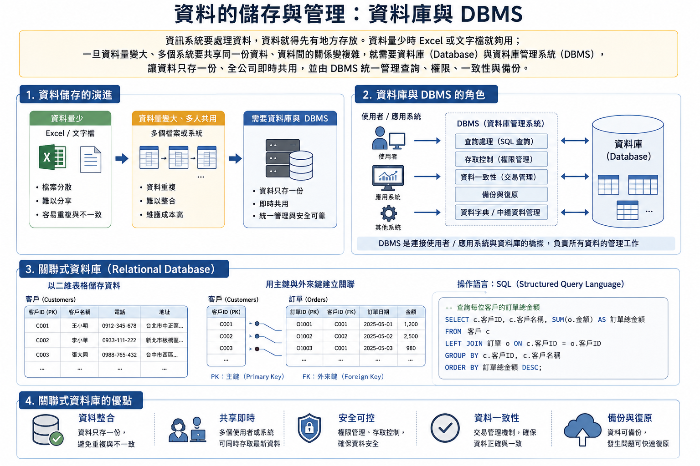

*本圖由 ChatGPT 生成，已由作者審核內容正確性*

### 3. 資料庫、資料庫管理系統與資料庫系統

這三個名詞常被混用，其實各自代表不同的範圍與角色，三者是層層包含的關係：

- **資料庫（Database，DB）** 是「資料本身」——長期儲存在電腦裡、有組織且彼此關聯的資料集合。
- **[資料庫管理系統（Database Management System，DBMS）](https://zh.wikipedia.org/wiki/資料庫管理系統)** 是「管理軟體」——一套專門用來建立、維護、操作與管理資料庫的軟體。資料庫通常不會被人或程式直接翻動，一切查詢、新增、刪除都得透過 DBMS，由它統一處理權限控管、資料安全、備份還原與並行控制等工作。常見的 DBMS 有 MySQL、PostgreSQL、Oracle Database、Microsoft SQL Server 等，一家公司也常同時用上好幾套。
- **資料庫系統（Database System，DBS）** 是「完整的運作環境」——它不只包含資料與 DBMS，還涵蓋跑著它們的 **硬體**（伺服器、硬碟等）、使用資料的 **應用程式**（例如網站後端），以及操作與維護它的 **人員**（資料庫管理員、開發者與使用者）。換句話說，資料庫系統是由 **資料、軟體、硬體、人員** 四種要素共同組成的整體。

這幾個名詞長得很像，用一座 **圖書館** 來想最清楚：

- **資料庫** 是圖書館裡的 **書架與所有藏書**，靜靜保存著內容；
- **DBMS** 是圖書館的 **館員與檢索系統**，負責借還、上架、盤點、控管誰能進出，還要防止書籍損壞；
- **資料庫系統** 則是 **整座運作中的圖書館**——建築（硬體）、藏書（資料）、館員與檢索電腦（軟體），再加上管理圖書館的館員（人），缺一不可。

> **補充小知識**：資料庫系統四要素裡的「人」，在大公司往往是一種正式職務。專門負責規劃、建置、調校與維護資料庫系統，讓它跑得快、不出錯、資料不遺失的人員，職稱就叫 **[資料庫管理員（Database Administrator，DBA）](https://zh.wikipedia.org/wiki/資料庫管理員)**，是資訊部門裡相當關鍵的角色。

也因為牽涉的名詞這麼多，日常口語裡大家往往把整套系統、甚至裡頭的資料，都籠統稱作「**資料庫**」——本章往後也沿用這個習慣，直接用「資料庫」代指整套系統（例如下一節〈使用資料庫的優點〉，講的其實是整個資料庫系統帶來的好處）；你只要記得這個簡稱背後真正指的是誰，概念上就不會混淆。

最貼近生活的例子，就是全球數以千萬計網站採用的部落格與網站系統 **[WordPress](https://zh.wikipedia.org/wiki/WordPress)**——它背後正是用 **[MySQL](https://zh.wikipedia.org/wiki/MySQL)** 這套資料庫來存放每一篇文章與留言。MySQL 是目前最常見的 **開源、免費** 資料庫管理系統（DBMS），下面這張圖就是用管理工具打開一個 WordPress 網站的 MySQL 資料庫，可以看到每篇文章被一列一列地存放在資料表裡。

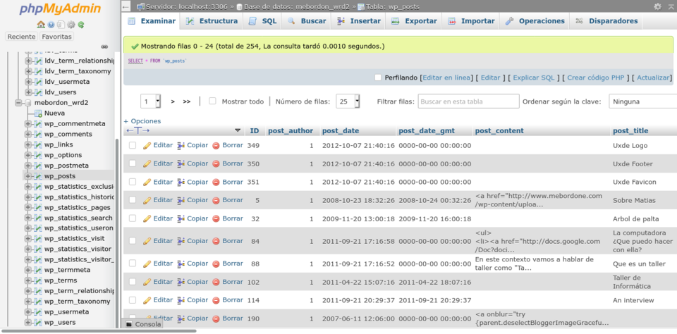

*圖片來源：[維基共享資源「Wordpress - base de datos.png」](https://commons.wikimedia.org/wiki/File:Wordpress_-_base_de_datos.png)，作者 Mebordone，授權 CC BY-SA 4.0*

### 4. 使用資料庫的優點

導入資料庫系統要花錢、也要花人力，企業為什麼還是願意做？因為比起讓各部門各自用檔案或 Excel 東存一份、西存一份，把資料集中起來、交給 DBMS 統一管理，能換來一連串環環相扣的好處。而這些好處說到底都源自同一個關鍵——**同一筆資料只存一份、大家共用**：正因為只存一份，才不會有重複與版本對不起來的問題；正因為集中由一套軟體管理，統一的權限控管、格式標準與備份機制才談得上。以下整理最核心的幾項：

| 優點 | 說明 |
|------|------|
| **資料共享** | 同一份資料可供多個部門與系統使用 |
| **避免重複** | 資料只存一份，不會在各部門各自維護不同版本 |
| **維持一致性** | 修改一處，全系統同步更新 |
| **資料獨立** | 資料結構的改變不影響應用程式的運作 |
| **安全控制** | 依角色設定存取權限，保護敏感資料 |
| **標準化** | 統一欄位名稱、格式與單位，便於跨系統整合 |

**校園情境**：如果你的地址、電話分散存在教務處、學務處、圖書館各自的 Excel，搬家後得通知三個單位分別修改，只要漏改一處就會把掛號信寄到舊地址。集中在校務資料庫後，你在 Portal 更新一次，全校系統同步生效——這正是「避免重複」與「維持一致性」的價值。

**工業情境案例**：過去工廠各部門各自維護 Excel 庫存表，品管部門說庫存 500 個，倉庫說只有 430 個，生產部門說剩 480 個——三份資料互相矛盾。導入 ERP 與資料庫後，庫存資料只有一份，所有部門即時共用，這個問題就消失了。

> **趣味小知識**：資料庫技術的演進，其實就藏在〈五、資料庫模型〉要介紹的幾種「資料庫模型」裡。1960 年代最早的資料庫採用 **階層式** 與 **網狀** 模型，把資料組織成樹狀或網狀結構——IBM 為美國阿波羅登月計畫開發的 IMS，就是這個時代的代表；但這類結構複雜、牽一髮動全身，難以修改與查詢。直到 1970 年，IBM 研究員 **[埃德加·科德（Edgar F. Codd）](https://zh.wikipedia.org/wiki/埃德加·科德)** 提出 **關聯式模型**，主張改用人人都看得懂的二維表格來存放資料，徹底翻轉了這個領域，他也因此獲得電腦界最高榮譽的圖靈獎。1980 年代起，以關聯式模型搭配 SQL 查詢語言的資料庫（如 Oracle）成為市場主流，一路稱霸數十年。所以〈五、資料庫模型〉要介紹的階層式、網狀、關聯式，不只是三種並列的模型，更是一段由繁入簡的演進史。

### 5. 資料還在長大：邁向大數據

資料庫解決了「怎麼把資料管好」的問題，但資料本身並沒有停下腳步，反而越長越快、越長越雜。

一方面是 **量**。一家中大型企業或網路平台累積的資料，早已不是幾 MB、幾 GB，而是動輒以 **TB（terabyte，兆位元組）**、甚至 **PB（petabyte）** 來計算——每一筆交易、每一次點擊、每一顆感測器的讀值都被記錄下來，日積月累就是天文數字。另一方面是 **型態**。資料庫裡存的早已不只是整齊的文字與數字，還有圖片、影片、語音，甚至產品的 3D 模型與感測器串流；這些「長得不規則」的資料，硬要塞進傳統關聯式資料庫的二維表格，往往格格不入。

當資料的規模與複雜度雙雙衝破傳統資料庫的負荷，就催生了 **大數據（Big Data）** 的觀念，以及一整套專門用來因應它的新技術。不過在深入大數據之前，得先把基礎打好：接下來〈五、資料庫模型〉會認識各種資料庫模型（也包括專為海量、雜亂資料而生的 NoSQL），〈六、SQL——資料庫的標準語言〉介紹資料庫的查詢語言，〈九、大數據如何改變資訊系統〉再回頭處理資料爆炸之後的世界。

---

## 五、資料庫模型

### 1. 早期模型：階層式與網狀

在關聯式資料庫普及之前，早期主要有兩種模型，如今多已退居幕後，稍作認識即可：

- **[階層式資料庫（Hierarchical Database）](https://zh.wikipedia.org/wiki/層次模型)**：把資料組織成 **樹狀結構**，一個父節點可以有多個子節點，但每個子節點只能有一個父節點，像「大學→學院→系→班級」那樣層層分支。結構清楚、查詢快，缺點是無法表達多對多關係（例如一個零件由多家供應商供應）。
- **[網狀式資料庫（Network Database）](https://zh.wikipedia.org/wiki/網狀模型)**：改用 **圖形結構**，允許一個節點有多個父節點，因此能處理多對多關係、比階層式有彈性；代價是關係複雜，資料一多，維護難度就大幅提高。

### 2. 關聯式資料庫（Relational Database）

**[關聯式資料庫（Relational Database）](https://zh.wikipedia.org/wiki/關聯式資料庫)** 是目前最主流的資料庫模型，以 **二維表格** 儲存資料。每張資料表由列（紀錄）與欄（欄位）構成，不同資料表之間透過共通欄位建立關聯（Codd, 1970）。

> **趣味小知識**：今天無所不在的關聯式資料庫，源自 1970 年 IBM 研究員 **Edgar F. Codd** 發表的一篇論文。諷刺的是，IBM 起初對這個構想興趣缺缺，反而讓一家小公司搶先把它商品化——那家公司後來叫做 **甲骨文（Oracle）**，成了資料庫巨頭。Codd 本人則在 1981 年獲頒電腦界最高榮譽「圖靈獎」，被尊為關聯式資料庫之父。

甚麼是關聯式資料庫，先用你最熟悉的選課與成績來看。**學生資料表** 記錄每個人的基本資料，**選課成績資料表** 記錄誰修了哪門課、得幾分：

**學生資料表**

| 學號(主鍵) | 姓名 | 系級 |
|------|------|------|
| S1101 | 陳怡君 | 工管二 |
| S1102 | 林志明 | 工管二 |

**選課成績資料表**

| 流水號(主鍵) | 學號(外來鍵) | 課程代碼 | 分數 |
|------|------|---------|------|
| 1 | S1101 | IE201 | 88 |
| 2 | S1102 | IE201 | 76 |

兩張表透過「學號」欄位關聯，查詢「S1101 這學期修了哪些課、各得幾分」時，只需連結兩張表即可得到答案，學生的姓名與系級不必在成績表裡重複儲存一遍。

同樣的關聯，在工廠裡也天天發生。把「學生」換成「機台」、「選課成績」換成「工單」，結構完全一樣：

**機台資料表**

| 機台編號(主鍵) | 機台名稱 | 所在產線 |
|------|------|------|
| M01 | CNC 車床 | A 線 |
| M02 | 五軸加工中心 | B 線 |

**工單資料表**

| 工單編號(主鍵) | 機台編號(外來鍵) | 產品代碼 | 產量 |
|------|------|------|------|
| WO1001 | M01 | P-220 | 480 |
| WO1002 | M02 | P-350 | 300 |

兩張表透過「機台編號」關聯：工單資料表只記機台編號，機台的名稱與所在產線在機台資料表裡放一份就好，不必在每張工單上重複抄寫；想知道「WO1001 是哪台機器做的、在哪條產線」，連結兩張表就查得到。而這裡的工單編號本身就不會重複，可以直接當主鍵，不像成績表那樣得另外補一個流水號。

不論是用「學號」還是「機台編號」來連接，你都會注意到：兩張表裡，一張把連接欄位標成 **主鍵**，另一張標成 **外來鍵**。接下來就說明這組核心概念。

#### 主鍵與外來鍵

**[主鍵（Primary Key，PK）](https://zh.wikipedia.org/wiki/主鍵)**：唯一識別資料表中每一筆紀錄的欄位，不能重複、不能空白。例如「學號」就是學生資料表的主鍵，工廠裡的「工單編號」則是工單資料表的主鍵。有時一張表找不到現成、不重複的欄位可用（像上面的選課成績資料表，同一個學號會因為修了多門課而重複出現，無法單獨當主鍵），這時就常另外補一個從 1 開始、絕不重複的「流水號」欄位來當主鍵。

**[外來鍵（Foreign Key，FK）](https://zh.wikipedia.org/wiki/外鍵)**：其值對應另一資料表的主鍵，用來建立表格間的關聯。例如選課成績資料表中的「學號」是外來鍵，對應學生資料表的主鍵；工單資料表中的「機台編號」是外來鍵，對應機台資料表的主鍵。

實務上，資料庫在正式建表之前，通常會先用 **[實體關係模型（Entity-Relationship Model，ER 模型）](https://zh.wikipedia.org/wiki/ER模型)** 把「有哪些資料表、表與表之間怎麼關聯」在圖上規劃清楚，再據以建立實體的資料表（Chen, 1976; Elmasri & Navathe, 2016）。下面這張圖，就是把前面學生與選課成績的例子畫成 ER 圖的模樣。

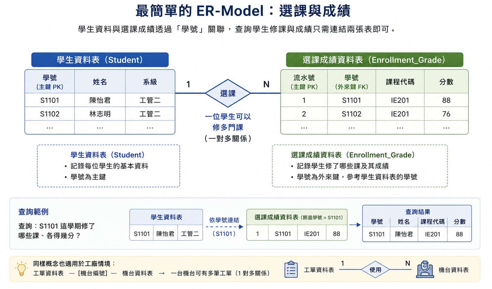

*本圖由 ChatGPT 生成，已由作者審核內容正確性*

### 3. 物件導向式資料庫（Object-Oriented Database）

[物件導向式資料庫](https://zh.wikipedia.org/wiki/物件資料庫)將現實世界的實體視為 **物件**，物件包含資料（屬性）與行為（方法）。適合處理大型、複雜或多媒體型的資料，例如工業相機的影像與標注資料。目前在一般企業應用中，關聯式資料庫仍是主流。

### 4. NoSQL——當關聯式資料庫不夠用的時候

前面幾種模型（尤其是最主流的關聯式）有個共同前提：**資料要先套進固定的表格結構**。你得事先定好有哪些欄位、每一欄放什麼型別，之後每一筆資料都得乖乖照這個格式填。對付結構整齊的企業資料（訂單、庫存、成績）這很好用；但到了工業4.0與物聯網的世界，資料常常長得沒那麼「乖」：

- **格式很雜**：同一批資料裡混著感測器數值、機台日誌文字、產品影像；
- **數量爆炸**：一座工廠可能有數百萬個感測器不停地寫入；
- **結構會變**：這台機器回報 5 個參數、那台回報 12 個，欄位根本對不齊；
- **速度要求高**：資料得在毫秒之間就寫進去。

硬把這些塞進關聯式資料庫「固定表格」的框框，往往綁手綁腳、也跑不夠快。於是出現了另一大類資料庫——**[NoSQL](https://zh.wikipedia.org/wiki/NoSQL)**（Silberschatz et al., 2020）。

顧名思義，NoSQL 是「非關聯式資料庫」的 **統稱**（不是單一產品），它最大的特點就是 **不要求固定的表格結構**：資料可以像一份份文件、一組組鍵值，或一張張關係圖那樣彈性存放，缺一個欄位、多一個欄位都沒關係，也更容易靠「多接幾台伺服器」來分攤爆量的資料。舉個貼近的例子：你的學號、成績是結構整齊的關聯式資料，但校園 App 裡的貼文、社團活動照片、系統操作日誌，格式雜、數量又大，就更適合交給 NoSQL 保存。

那到底該用哪一種？其實兩者 **不是對立、而是分工**，擺在一起比較最清楚：

| 面向 | 關聯式資料庫 | NoSQL |
|------|------------|-------|
| 資料結構 | 固定表格結構 | 彈性，可動態調整 |
| 查詢語言 | 標準 SQL | 各系統各有不同 |
| 一致性 | 強一致性 | 通常為最終一致性 |
| 擴展方式 | 垂直擴展（升級單一伺服器） | 水平擴展（增加伺服器數量） |
| 適用場景 | 結構化、交易型資料（ERP、MES） | 大量、快速、非結構化資料（IoT、日誌） |

現代工廠的資訊架構往往 **兩種並用**：用關聯式資料庫存放 ERP、MES 那些結構化的業務資料，用 NoSQL 存放感測器時序資料或影像分析結果，各司其職。

你或許已經注意到，「**SQL**」這個詞從剛才到現在冒出了好幾次——關聯式資料庫的查詢語言是「標準 SQL」，連 NoSQL 的名字（Not Only SQL）都是在講它。那 SQL 到底是什麼、又是怎麼被拿來對資料庫下指令的？這正是下一節要好好認識的主角。

---

## 六、SQL——資料庫的標準語言

**[SQL（Structured Query Language，結構化查詢語言）](https://zh.wikipedia.org/wiki/SQL)** 是操作關聯式資料庫的 **標準語言**，也是絕大多數關聯式資料庫系統之間的 **共通語言**——不論底層用的是 MySQL、Oracle 還是 SQL Server，你都是用同一套 SQL 對它下指令。事實上，幾乎所有對資料庫的操作（查詢、新增、修改、刪除）說到底都是把需求寫成一句 SQL，交給資料庫管理系統（DBMS）去執行。

這一點在寫程式時最明顯：如果你要寫一支程式去資料庫撈資料，並不是直接叫資料庫把東西吐出來，而是得在程式裡「嵌入」一段 SQL，讓程式透過這段 SQL 和 DBMS 溝通，由 DBMS 執行後再把結果回傳給程式。你或許會覺得：還得多學一種語言、塞進程式裡，不是很麻煩嗎？但正因為有 SQL 這個共通標準，我們才能用同一套查詢方式，把 Python、Java、PHP 等各種程式語言、各種應用軟體，和 MySQL、Oracle、SQL Server 等各種資料庫系統串接在一起——SQL 學會一次，走到哪套資料庫都能通。

SQL 依功能可分為四大類：

| 類型 | 全名 | 用途 | 常見指令 |
|------|------|------|---------|
| **DDL** | 資料定義語言 | 定義資料表結構 | `CREATE`、`ALTER`、`DROP` |
| **DML** | 資料處理語言 | 新增、修改、刪除資料 | `INSERT`、`UPDATE`、`DELETE` |
| **DCL** | 資料控制語言 | 管理存取權限 | `GRANT`、`REVOKE` |
| **DQL** | 資料查詢語言 | 查詢資料 | `SELECT` |

**實際工作中最常用的是 `SELECT` 查詢**。延續上一節的選課成績資料表，如果教務處想找出「這學期成績被當（分數低於 60）同學有哪些人？修了甚麼？分數多少？並且以低到高的分數來排列順序」，可以這樣寫：

```sql
-- 查詢這學期不及格（低於 60 分）的選課紀錄
SELECT 學號, 課程代碼, 分數
FROM 選課成績
WHERE 分數 < 60
ORDER BY 分數 ASC;
```

這段語法的意義：
- `SELECT`：選取哪些欄位要顯示（學號、課程代碼、分數）
- `FROM`：從哪張資料表查詢（選課成績）
- `WHERE`：篩選條件（分數低於 60）
- `ORDER BY`：排序方式（`ASC` 由小到大，最低分排最前面）

同樣的語法結構搬到工廠也完全適用——只要把資料表換成生產紀錄，就能查出「今日良率低於 95% 的所有生產線有哪些？同時也要顯示良率與班次，並且以低到高的良率來排列順序」：

```sql
-- 查詢今日良率低於 95% 的所有生產線
SELECT 生產線名稱, 良率, 班次
FROM 生產紀錄
WHERE 日期 = '2025-05-21'
  AND 良率 < 0.95
ORDER BY 良率 ASC;
```

> 對於工業工程管理的學生，不一定都要自己來寫複雜的 SQL，但仍要理解 SELECT、FROM、WHERE 的基本邏輯，有助於與 IT 人員溝通查詢需求，以及閱讀 BI 工具背後的資料邏輯。
>
> **趣味小知識**：SQL 到底該唸「S-Q-L」還是「sequel（西擴）」？其實兩派都對。這個語言 1970 年代誕生於 IBM 時原名叫 **SEQUEL**（Structured English Query Language），後來因為這個名稱與一家英國飛機公司的商標撞名，才被迫改成 SQL。也因為這段歷史，老一輩工程師習慣唸「sequel」，年輕一輩則多半照字母唸「S-Q-L」——下次聽到有人兩種唸法混用，別懷疑，他們講的是同一個東西。
>
> **為什麼會出現 NoSQL？**：你應該會觀察到，SQL 語言的結構一定是對應到關聯式資料庫那套「固定表格」的嚴謹結構，SQL 它讓查詢精準、資料一致，卻也要求每一筆資料都乖乖照事先定好的格式排好。一旦資料變得巨量、格式雜亂、又要極速寫入（正是前面〈五、資料庫模型〉NoSQL 小節談過的情況），這套嚴謹反而成了束縛。而把這個侷限推到極致的，正是下一節要登場的 **大數據**：當資料大到、雜到某個程度，光靠 SQL 與關聯式資料庫就不夠用了，才需要 NoSQL 這類更有彈性的工具來補位。

---

## 七、網路技術對資訊系統的影響

在網路普及之前，一套資訊系統往往是一座 **孤島**——只能在公司內部那幾台電腦上使用，資料出不去、外界也進不來。網路的出現打破了這道牆：它把散落各地的系統與設備連了起來，資料出得去、外界也進得來，**任何人在地球上任何一個角落，只要能上網，就能存取同一套資訊系統**。這個轉變不只讓組織內部運作更即時，更催生出一整批過去不可能存在的 **新型態商業模式**——其中最貼近你我的，就是本節接下來要談的電子商務與行動商務。

> **前情提要**：網路本身怎麼運作——網路硬體、拓樸、從有線到無線的演進，以及 TCP/IP 等通訊協定——是 [04-Networks-and-Internet.md](04-Networks-and-Internet.md) 的主題，其中〈四、區域網路（LAN）〉〈五、無線網路〉〈七、行動通訊技術（1G–5G）〉幾節與本節關係最密切。本節不重述網路怎麼運作，而是接著問：當資訊系統連上了網路，究竟帶來哪些改變？

### 1. 網路化資訊系統

網路使資訊系統從單一電腦上的封閉應用，演變為可跨地點、跨設備存取的服務。對工業環境而言，這意味著：

- 跨廠區的資料可即時整合（台灣、越南、墨西哥三廠的產能一眼掌握）
- 工程師可在異地遠端監控設備狀態
- 物聯網設備成為資訊系統的資料來源節點（Xu et al., 2014）
- 中小企業不必自建伺服器，也能透過網路租用完整的雲端系統（其背後的雲端運算是什麼、又怎麼運作，留待本節最後一小節再談）

### 2. 電子商務的概念

**[電子商務（Electronic Commerce，E-Commerce）](https://zh.wikipedia.org/wiki/電子商務)** 是指透過網際網路進行商品、服務、資訊與金流交換的商業活動。它不是單純的「網路購物」，而是一套整合網站、資料庫、交易處理系統、物流系統、客服系統、行銷系統與金流系統的整合性資訊系統。你在蝦皮、momo 上買一本二手教科書，從搜尋、比價、下單、線上刷卡到收到出貨通知，背後就是這一整套系統在協作。

電子商務的基本流程可視為資訊系統的延伸：

| 流程 | 說明 |
|------|------|
| **輸入** | 使用者瀏覽商品、搜尋關鍵字、加入購物車、填寫訂單與付款資料 |
| **處理** | 系統確認庫存、計算價格、套用折扣、處理付款、建立訂單 |
| **儲存** | 資料庫記錄會員、商品、訂單、付款紀錄與物流狀態 |
| **輸出** | 向消費者顯示訂單結果、付款狀態、出貨通知與推薦商品 |

因此，電子商務可以理解為「以網路為基礎的商業資訊系統」，將傳統商業活動數位化，讓消費者不必到實體店面，也能完成查詢、比較、購買、付款與售後服務的全部流程。

依照交易雙方的身分，電子商務可分成幾種常見的商業模式：

| 模式 | 交易雙方 | 說明與例子 |
|------|---------|-----------|
| **B2B（Business to Business）** | 企業對企業 | 企業之間的採購與交易，是最貼近製造業的一種——零組件供應商透過採購平台向製造廠報價、接單、對帳，例如阿里巴巴國際站這類企業採購平台 |
| **B2C（Business to Consumer）** | 企業對消費者 | 企業直接把商品賣給一般消費者，是大眾最熟悉的網購型態，例如 momo、PChome |
| **C2C（Consumer to Consumer）** | 消費者對消費者 | 平台媒合個人賣家與個人買家，平台本身不擁有商品，例如蝦皮拍賣、旋轉拍賣 |
| **C2B（Consumer to Business）** | 消費者對企業 | 比較新的型態，由消費者主導、企業回應——消費者先集結需求或提出條件，再由企業決定是否供給，例如群眾募資（消費者先出資，廠商才生產）、社群團購揪單向廠商議價 |

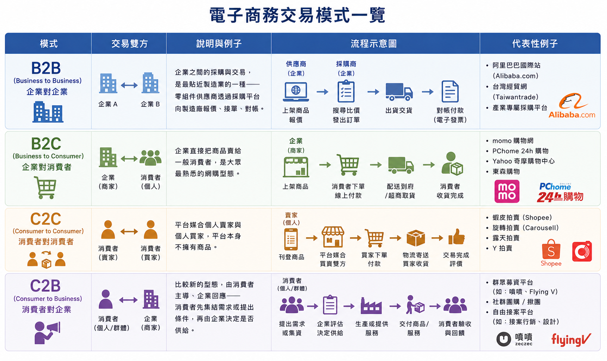

*本圖由 ChatGPT 生成，已由作者審核內容正確性*

對工業工程管理而言，最值得關注的是 **B2B**：製造業的訂單、供應鏈採購、跨企業對帳，大多在 B2B 平台上完成。它與前面〈三、企業應用系統〉談的 SCM（供應鏈管理系統）正是一體兩面——SCM 管的是企業內部與上下游的供應鏈流程，B2B 電商則是這些跨企業交易在網路上實際發生的場所。

### 3. 電子商務中的資訊系統

電子商務並不是獨立於資訊系統之外的新東西，而是資訊系統「往網路、往外部顧客延伸」的結果——它一樣是 **系統觀念**（輸入、處理、儲存、輸出的整體安排），一樣遵循前面〈二、資訊系統的類型〉談過的作業→管理→策略 **系統階層**。差別只在於：過去這些系統服務的是企業內部的員工與管理者，如今它們被電商平台串接起來，同時服務起外部的消費者。一個電子商務平台，往往就是底下這幾種資訊系統協同運作的成果：

| 系統 | 在電子商務中的角色 |
|------|-----------------|
| **TPS** | 處理訂單建立、付款確認、庫存扣除、發票產生等日常交易 |
| **MIS** | 將銷售資料整理為報表：每日銷售額、熱銷商品、退貨率、不同通路表現 |
| **DSS** | 分析是否調整商品價格、推出促銷、增加倉儲配置、預測未來需求 |
| **CRM** | 記錄消費者瀏覽紀錄、購買習慣，提供個人化推薦、會員分級與售後服務 |

換句話說，電商平台把作業層（TPS）、管理層（MIS／DSS）與顧客關係（CRM）串成一條線：顧客一次下單，就同時觸發交易記錄、報表更新與個人化推薦——這正是資訊系統階層在網路情境下的具體展現。

### 4. 電子商務與資料庫

資料庫是電子商務平台的核心基礎。電子商務跟任何資訊系統一樣，它的資料來源與最終儲存都落在資料庫裡。一個電子商務平台的關聯式資料庫通常包含多張相互關聯的資料表：

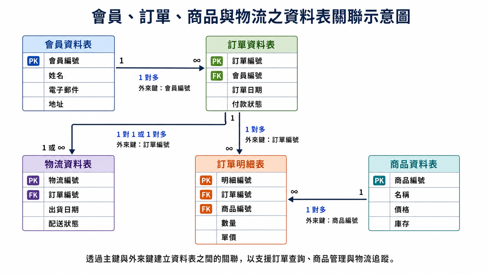

*本圖由 ChatGPT 生成，已由作者審核內容正確性*

這個設計讓「查詢某會員的所有訂單」、「計算某商品的銷售總量」、「追蹤某筆訂單的物流狀態」都可以透過 SQL 快速完成，且資料不需重複儲存。

### 5. 行動商務

正如 [04-Networks-and-Internet.md](04-Networks-and-Internet.md) 所談，網路從有線一路走向無線；當人手一支能上網的智慧型手機，自然有人把電子商務搬到無線的行動網路之上——這就是行動商務。

**[行動商務（Mobile Commerce，M-Commerce）](https://zh.wikipedia.org/wiki/行動商務)** 是電子商務的延伸，指使用者透過智慧型手機、平板或其他行動裝置進行商業活動。相較於傳統電子商務，行動商務更強調即時性、個人化、位置感知與[行動支付](https://zh.wikipedia.org/wiki/行動支付)。

> **趣味小知識**：史上第一筆有加密保護的網路購物，據信發生在 1994 年 8 月 11 日——一位美國人透過網站刷卡買了一張 Sting 的 CD《Ten Summoner's Tales》，被《紐約時報》記為線上零售的里程碑。更早之前，1994 年也有工程師成功用網路向 Pizza Hut 訂了一份披薩。短短三十年，當年的新鮮事，已變成今天用手機掃一下 QR Code 就完成的日常。

常見的行動商務應用：

- 使用手機 App 購物（蝦皮、momo、PCHOME）
- 透過行動支付付款（LINE Pay、Apple Pay、街口支付）
- 使用外送平台訂餐（Foodpanda、Uber Eats）
- 掃描 [QR Code](https://zh.wikipedia.org/wiki/QR碼) 取得優惠券或完成付款
- 依據使用者位置推送附近商店優惠
- 即時推播通知訂單、付款或物流狀態

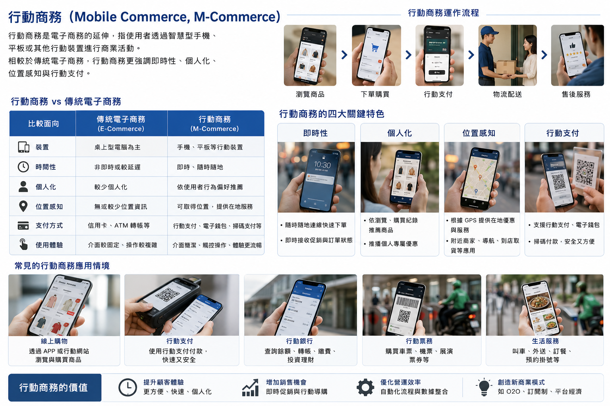

*本圖由 ChatGPT 生成，已由作者審核內容正確性*

這些應用當中，當代最普遍的當屬 **行動支付**——它幾乎是行動商務的共通入口。上面清單裡的購物、訂餐、掃碼優惠，最後幾乎都得回到「付款」這一步；換句話說，許多行動服務都無可避免地要內建行動支付功能，讓使用者不必掏出實體現金或信用卡，動一下手機就能完成交易。


*圖片來源：[維基共享資源「Mobile Payment.jpg」](https://commons.wikimedia.org/wiki/File:Mobile_Payment.jpg)，作者 Richard Tanzer Fotografie／VeroPay，授權 CC BY-SA 3.0*

### 6. 雲端運算與資訊系統

前面談的電子商務與行動商務，要同時服務全球各地、數以百萬計的使用者，背後必須有龐大的運算與儲存能力撐著——而多數企業並不會自己蓋機房來扛這件事，而是交給[雲端運算](https://zh.wikipedia.org/wiki/雲端運算)。所謂雲端運算，是讓使用者透過網際網路，隨需（on-demand）租用運算、儲存與軟體資源，用多少算多少，不必自行購置與維護硬體（Mell & Grance, 2011）。

這件事之所以到今天才變得理所當然，關鍵在網路技術的進步。過去大型資訊系統之所以幾乎都得「本地化」（把伺服器與軟體裝在公司自己的機房裡），正是因為早期網路的頻寬窄、延遲高，龐大的資料唯有在近端的區域網路裡才交換得夠快；系統一旦拉到遠端，光是等資料來回就慢到不堪用。當寬頻與光纖普及、頻寬與延遲不再是瓶頸，情況整個反轉：資訊系統可以擺在遠端的資料中心，使用者透過網路即時取用，與裝在隔壁機房幾乎沒有差別。

這帶來一個對使用者最直接的改變——**取得軟體的方式變了**。在企業端，員工不必再於每台電腦安裝專屬的用戶端程式，只要打開瀏覽器輸入內部網址，就能使用公司內部的 ERP、MES 或報表系統（這正呼應〈七、3〉電子商務所談的主從式架構）。在消費端，一般人也不必再花大錢、佔用硬碟去安裝 Adobe Photoshop、Microsoft Office 這類大型軟體——同樣一個瀏覽器，就能取得與桌面版幾乎一樣的功能，甚至連檔案儲存、影音串流都一併在雲端完成；換一台裝置、換一個地點，打開瀏覽器登入就能接續使用。雲端運算對資訊系統的影響，可歸納如下：

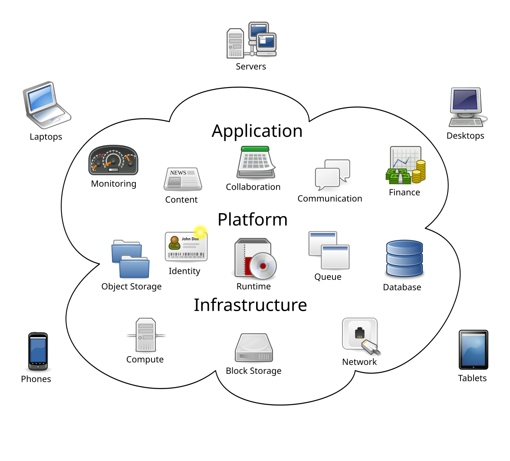

*圖片來源：[維基共享資源「Cloud computing.svg」](https://commons.wikimedia.org/wiki/File:Cloud_computing.svg)，作者 Sam Johnston，授權 CC BY-SA 3.0*

| 優點 | 說明 |
|------|------|
| 降低初期投資 | 不需自建機房、購買伺服器 |
| 彈性擴展 | 資料量暴增時快速增加容量 |
| 全球存取 | 任何地點都能使用相同系統 |
| 自動備份 | 雲端供應商負責資料備援 |

#### 三種雲端服務模式：IaaS、PaaS、SaaS

租用雲端服務時，「供應商幫你顧到哪一層」有程度之分。業界依此把雲端服務分成三種模式（Mell & Grance, 2011），分別是 **[IaaS（Infrastructure as a Service，基礎設施即服務）](https://zh.wikipedia.org/wiki/基础设施即服务)**、**[PaaS（Platform as a Service，平台即服務）](https://zh.wikipedia.org/wiki/平台即服务)**、**[SaaS（Software as a Service，軟體即服務）](https://zh.wikipedia.org/wiki/软件即服务)**。一整套資訊系統要能運作，是一層疊一層的：最底下是機房、伺服器與網路，往上是作業系統與開發環境，最上面才是寫好的應用軟體；三種模式的差別，就在這道階梯上供應商替你扛到第幾階。這件事可以用「租房子」來理解：

- **IaaS 租的是硬體**，像租一間毛胚屋——供應商蓋好地基、接好水電（提供伺服器、儲存與網路），但室內要怎麼隔間、鋪什麼地板、擺哪些家具全得自己來；換成資訊系統，就是作業系統、資料庫到應用程式都由使用者自行安裝與維護。
- **PaaS 租的是開發平台**，像租一間已經裝潢好、水電家電都到位的房子——你只要把家當（自己寫的程式與資料）搬進去就能住，不必操心房子怎麼蓋；換成資訊系統，就是供應商連作業系統與開發環境都備妥，開發者只管把程式部署上去。
- **SaaS 租的是現成軟體**，像住旅館——房間、家具、清潔、備品一應俱全，拎著行李入住就能用；換成資訊系統，就是連應用程式都由供應商寫好、裝好、維運好，使用者打開瀏覽器登入即可。

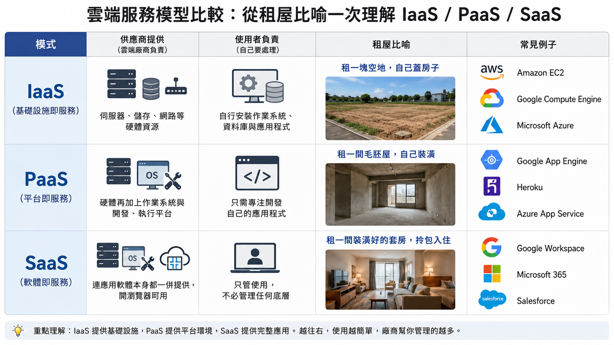

*本圖由 ChatGPT 生成，已由作者審核內容正確性*

根據上述與上圖，愈靠近 SaaS 這端，供應商包辦得愈多、使用者要操心的愈少；愈靠近 IaaS 這端，使用者能掌控與客製的空間愈大，但要自行承擔的維護工作也愈重。前面所說消費者「打開瀏覽器就能用」的體驗，正是 SaaS 的典型樣貌——軟體與資料都放在供應商那端，使用者這端只剩下一個瀏覽器。

**三者當中，對一般讀者而言最親近的其實是 SaaS**。IaaS 與 PaaS 多半是企業資訊部門與軟體開發者才會直接面對的層次，離日常生活較遠；SaaS 卻早已滲進每個人的每一天——寄信、追劇、線上編輯文件、把照片存到雲端，用的幾乎全是 SaaS。換句話說，雖然三種模式並列，但真正貼近消費者、你我天天在用的，正是最上面這一層。

#### 常見的雲端服務

如今我們日常用到的服務，有一大半都是 SaaS。以下依用途整理幾類最常見的雲端服務：

- **辦公室軟體**：[Google Workspace](https://workspace.google.com/)（文件、試算表、簡報）、[Microsoft 365](https://www.microsoft.com/microsoft-365) 網頁版
- **影像與影音編輯**：[Canva](https://www.canva.com/)、[Adobe Express](https://www.adobe.com/express/)、[Photoshop 網頁版](https://www.adobe.com/products/photoshop/web.html)、[CapCut 剪映](https://www.capcut.com/)
- **影音串流**：[Netflix](https://www.netflix.com/)、[YouTube](https://www.youtube.com/)、[Disney+](https://www.disneyplus.com/)、[Spotify](https://www.spotify.com/)、[KKBOX](https://www.kkbox.com/)
- **雲端儲存**：[Google Drive](https://drive.google.com/)、[Dropbox](https://www.dropbox.com/)、[iCloud](https://www.icloud.com/)、[OneDrive](https://www.microsoft.com/microsoft-365/onedrive/online-cloud-storage)
- **通訊與協作**：[Gmail](https://mail.google.com/)、[Slack](https://slack.com/)、[Microsoft Teams](https://www.microsoft.com/microsoft-teams/group-chat-software)、[Notion](https://www.notion.com/)

這些服務的共通點是：軟體與資料都存放在供應商的雲端，使用者只要有網路、有瀏覽器（或一個輕量的 App）就能存取，不必在自己的裝置上安裝笨重的程式、也不必自行保管檔案與備份。

回到工業場景，同樣的服務模式也搬進了工廠：工業4.0的雲端平台（如 Siemens MindSphere、PTC ThingWorx）可視為專為工業 IoT 打造的 PaaS／SaaS，能夠接收全球工廠的感測資料，並在雲端執行 AI 模型進行預測性維護分析。

> **延伸閱讀**：網路與雲端讓資訊系統連上了線，但真正讓它從「被動記錄」進化到「主動預測」的，是人工智慧——它能預測設備何時故障、從影像自動辨識瑕疵、依需求自動觸發補貨。AI 如何強化作業、管理、策略各層級的資訊系統，是 [06-Data-Science-AI-and-Smart-Manufacturing.md](06-Data-Science-AI-and-Smart-Manufacturing.md) 的主題，本章不再展開。

> **小結**：電子商務與行動商務，是資訊系統、資料庫與網路整合應用的最佳示範，也讓我們看清網路技術替資訊系統帶來的最大改變是什麼。在網路出現之前，資訊系統只能在公司內部服務員工與管理者；網路出現之後，資訊服務變得無所不在——從家裡的桌上型電腦、口袋裡的手機與平板，到手腕上的智慧型手錶，無論你人在地球上的哪一個角落，只要有訊號、有網路，就能存取各式各樣的資訊服務。網路技術，把資訊系統從一座孤島，變成了隨處可達的服務。

---

## 八、大數據如何改變資訊系統

讀到這裡，你已經看過網路怎麼把資訊系統連上線、又怎麼撐起電子商務。但網路帶來的不只是新的商業模式——它同時打開了資料的水龍頭：每一次網頁點擊、每一筆線上下單、每一台連網的感測器與手機，無時無刻都在產生資料。再加上前面〈五、資料庫模型〉談過的、資料庫裡的東西本來就越存越多、越存越雜，資料的成長早已不只是「越來越大」而已。當資料同時在量、速度、種類等好幾個面向一起衝高，就形成了一個得專門面對的課題，也就是 **大數據**；而它的難處，習慣用好幾個「V」開頭的關鍵字一次點出來。

### 1. 什麼是大數據？

**[大數據（Big Data）](https://zh.wikipedia.org/wiki/大數據)** 指資料量龐大、產生速度快，且類型多樣，以至於傳統工具難以在合理時間內處理的資料集合（Provost & Fawcett, 2013）。常以多個「V」來描述其特性：

| 特性 | 說明 | 工業範例 |
|------|------|---------|
| **Volume（量）** | 資料量巨大 | 全廠數千個感測器每秒產生的量測值 |
| **Velocity（速）** | 資料產生與處理速度快 | 生產線視覺檢測每秒判斷數十個零件 |
| **Variety（樣）** | 資料類型多樣 | 數值、影像、日誌、聲音同時匯入 |
| **Veracity（真）** | 資料的真實性與準確性 | 感測器老化導致的異常數值需過濾 |
| **Value（值）** | 分析後可產生的商業價值 | 從良率趨勢預測設備故障時間點 |

其實你所在的學校就是個小型的大數據來源：全校師生每天的選課、上網、借書、門禁刷卡不斷累積（量），選課系統開放的瞬間流量暴衝（速），成績、證件照、論壇貼文格式各異（樣）——只是規模遠不及一座工廠或一個電商平台。

大數據的規模，最終都要落在實體的 **資料中心** 裡儲存與運算。不只雲端業者用成排的伺服器機櫃撐起全球工廠與電商的海量資料，連頂尖的科學研究也一樣——下圖就是歐洲核子研究組織（CERN）的資料中心機房。CERN 的 [大型強子對撞機](https://zh.wikipedia.org/wiki/大型强子对撞机) 每秒撞出的實驗數據多到驚人，正是靠這樣一整座塞滿伺服器的機房，才存得下、也算得動。

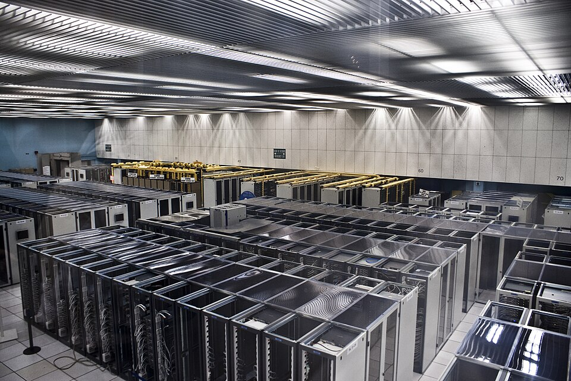

*圖片來源：[維基共享資源「CERN Server 03.jpg」](https://commons.wikimedia.org/wiki/File:CERN_Server_03.jpg)，作者 Florian Hirzinger，授權 CC BY-SA 3.0*

> **趣味小知識**：大家朗朗上口的大數據「3V」——資料量大（Volume）、產生快（Velocity）、種類多（Variety）——其實不是什麼學術定義，而是產業分析師 Doug Laney 早在 2001 年一份內部報告裡提出的觀察。後來大數據熱潮興起，眾人才陸續替它加上真實性（Veracity）、價值（Value）等更多的 V，一路加到「5V」甚至更多，堪稱科技界最愛「集字母」的名詞之一。

### 2. 大數據與資訊系統的關係

收集到一大堆資料，本身並不會自動產生價值——大數據真正的用處，是把原始、雜亂的資料一步步「煉」成能支援決策的資訊與洞見。這一整段從資料進來、到最後化為行動的加工過程，就是 **大數據分析流程**。它通常一關扣著一關，包含以下幾個環節：

```
採集：從感測器、ERP、MES、網路蒐集資料
    ↓
儲存與清洗：過濾雜訊、填補缺失值、統一格式
    ↓
分析：統計、分類、關聯分析、機器學習模型
    ↓
視覺化：將分析結果轉換為圖表、儀表板
    ↓
決策：管理者根據資訊採取行動
```

這條流程並不是憑空冒出來的新東西，它其實把本章前面兩條線索串了起來。**流程最前端的「採集」，靠的正是作業層級系統與企業應用系統**：POS、TPS 記下每一筆交易，〈三、企業應用系統〉談過的 ERP、MES、SCM、CRM 累積訂單、生產、庫存與顧客資料，再加上工廠遍布的 IoT 感測器，它們日復一日產出的巨量紀錄，就是大數據的源頭活水。**而流程最末端的「分析、視覺化與決策」，服務的則是管理層級與策略層級**：清洗、分析後的結果，透過 MIS 的定期報表、DSS 的情境模擬、EIS 的儀表板呈現在中高階主管眼前，支援他們從日常營運的控制，到長期經營策略的規劃，做出各層級的決策。

換句話說，大數據分析流程可以看成〈二、資訊系統的類型〉那座「作業→管理→策略」金字塔的 **放大與自動化版本**：資料一樣由下往上流動，只是規模從「一家公司的資料庫」放大到「巨量、即時、多來源」，中間再換上機器學習、大語言模型等更強的分析引擎。作業層與企業應用系統負責「把資料餵進來」，管理層與策略層負責「把洞見用出去」，大數據分析流程正是串起這兩端的那條輸送帶。

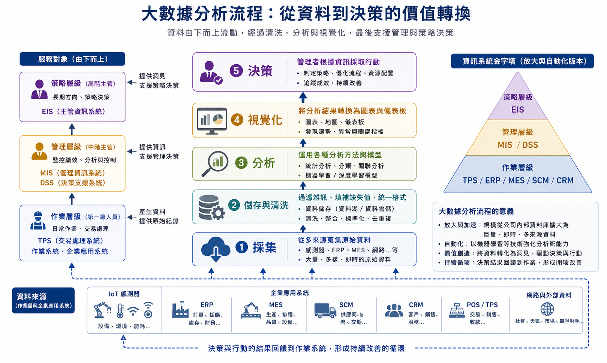

*本圖由 ChatGPT 生成，已由作者審核內容正確性*

> **趣味小知識**：資料分析界流傳一個經典故事——某超市分析銷售資料後，發現「啤酒」和「尿布」常一起被買走，推測是年輕爸爸下班買尿布時順手帶啤酒，於是把兩者擺在一起促銷、業績大增。這個「啤酒與尿布」的故事雖然後來被證實多半是行銷傳說、細節難以考證，卻生動點出了資料探勘（Data Mining）的精神：從看似無關的巨量資料中，找出人們自己都沒察覺的關聯——這正是今天電商推薦系統（「買了這個的人也買了…」）的雛形。

### 3. 大數據讓資訊系統脫胎換骨

大數據的出現，並不是在原本的資訊系統旁邊多蓋一棟新房子，而是回過頭來改造了它原有的每一層。

**資料的存放變了。** 過去企業資料幾乎都塞在單一的關聯式資料庫裡；面對巨量又雜亂的大數據，這已經不夠用，於是關聯式資料庫與 NoSQL 並用，底層還得靠 [Hadoop](https://zh.wikipedia.org/wiki/Apache_Hadoop)、[Apache Spark](https://zh.wikipedia.org/wiki/Apache_Spark) 這類「把資料拆給成百上千台伺服器一起算」的分散式平台，才存得下、也算得動。

**報表的角色變了。** 傳統 MIS 給的是「上個月發生了什麼」的定期回顧報表；有了大數據與即時串流，報表能即時更新，甚至反過來主動示警——不必等主管自己去翻，系統就先提醒你「這條線今天不太對勁」。

**決策的深度變了。** 過去 DSS 主要靠統計模型輔助判斷，如今再加上機器學習，能從海量歷史資料裡自動找出人眼看不出的規律，讓決策從「回顧過去」往「預測未來」推進——例如從良率的細微變化，預先算出某台設備大概什麼時候會故障。

換句話說，大數據並沒有推翻作業、管理、策略那套架構，而是讓每一層都變得更即時、更聰明。而當本章談過的資料庫、企業應用系統、網路與雲端、再加上大數據全部整合在一起，一家企業的資訊系統究竟長什麼樣子？下一節就用一張全景架構圖，把這些元件收攏起來，替整章做個總結。

---

## 九、資訊系統、資料庫、網路科技、大數據的演進關係

本章一路從資料與資訊的分別談起，走過資訊系統的三個層級、企業應用系統、資料庫、網路與電子商務，最後是大數據。這些看似各自獨立的主題，其實是同一套資訊系統的不同切面。這一節把它們收攏起來，回答兩個問題：這麼多元件是怎麼一步步長成今天這個樣子的？而在不斷加入新科技的過程中，又有什麼東西始終沒變？

### 1. 資訊系統是「長」出來的，不是一次蓋好的

資訊系統今天的樣貌，是六十多年來一層一層疊加的結果。每隔一段時間，就有一項新的資訊科技被吸收進來，但沒有任何一項是把前面的打掉重練，而是接在既有的骨架上繼續往外長。

**最早，是把人工帳冊搬進電腦（1950–1960 年代）。** 企業導入電腦做的第一件事，是把原本靠人力謄寫的訂單、薪資、庫存帳冊電子化，這就是最早的電子資料處理（EDP）與交易處理系統（TPS）。這一步確立了資訊系統最根本的骨架：輸入→處理→儲存→輸出，也就是〈一、2〉談過的系統觀念。

**接著，資料需要被好好管理（1970–1980 年代）。** 當電腦記下的資料越來越多、越來越亂，各部門各自為政的檔案開始重複又對不起來，於是有了資料庫，用關聯式模型把資料統一管理、用 SQL 查詢。也差不多在這個時期，管理學把資訊系統依決策的性質分成作業、管理、策略三個層級（〈二〉），MIS 與 DSS 讓底層累積的資料能彙整成報表、支援決策。

**再來，把跨部門的流程串起來（1990 年代）。** 光是各部門有各自的系統還不夠，企業開始追求跨功能的整合，於是有了以企業資源規劃（ERP）為核心的企業應用系統（〈三〉），把採購、生產、庫存、財務、人資接到同一套資料上，再加上管車間即時執行的 MES、管跨企業供應鏈的 SCM，構成企業運作的垂直骨幹。

**然後，資訊系統連上了線（1990 年代末至 2000 年代）。** 網路與網際網路的成熟，讓資訊系統不再只服務公司內部的員工。電子商務（〈七〉）把外部顧客的瀏覽與下單也納了進來，成為新的資料來源；雲端運算則讓企業不必自建機房，只要一個瀏覽器就能使用遠端的資訊系統。資訊系統從一座內部孤島，變成隨處可達的服務。

**最近，資料的規模與分析能力再上一階（2010 年代至今）。** 感測器、行動裝置與電商每分每秒產生的資料，匯成了大數據（〈八〉）；儲存改用關聯式與 NoSQL 並用、底層搭配分散式運算，分析引擎也從統計模型換上機器學習。資訊系統從「回顧過去發生了什麼」，逐漸能「預測接下來會怎樣」。至於讓這一層更聰明的人工智慧，是 [06-Data-Science-AI-and-Smart-Manufacturing.md](06-Data-Science-AI-and-Smart-Manufacturing.md) 的主題，本章不再展開。

### 2. 變的是科技，不變的是核心

把上面這條演變史攤開來看，會發現一件事：加進來的每一樣新東西（資料庫、三層架構、ERP、網路、電商、雲端、大數據）都是在解決「資料變多、變快、變雜，或使用者變遠」帶來的新問題，但它們都沒有動到資訊系統最底層的兩個核心。

**第一個不變的核心，是系統觀念。** 不論外面包了多少層新科技，任何一套資訊系統，拆到最裡面都還是〈一、2〉那五個環節：輸入、處理、儲存、輸出、回饋。ERP 是它、電商平台是它、跑機器學習的大數據平台也是它——差別只在輸入的資料從人工鍵入變成感測器自動上傳、處理的引擎從簡單計算換成分析模型、儲存從單一資料庫變成分散式叢集，但這五個環節一個都沒少。

**第二個不變的核心，是「資料→資訊→決策」的三層結構。** 從 1970 年代的 MIS 到今天的大數據分析流程，資料始終由下往上流動：底層忠實記錄每一筆交易，中層彙整成資訊，上層支援決策。大數據分析流程（〈八、2〉）不過是這座金字塔的放大與自動化版本——規模與工具變了，但「作業層蒐集、管理層彙整、策略層決策」的分工，從第一天到今天都沒變。

換句話說，資訊系統的歷史，是核心不變、外掛不斷增加的歷史。抓住這一點，你就抓得住重點：面對任何一套新潮的系統、任何一個新冒出來的技術名詞，先問它接在這個骨架的哪個位置——它換的是新的輸入方式、新的儲存技術，還是新的分析引擎？把新科技對回這個不變的核心，再複雜的系統也能看懂。

### 3. 把整章收攏成一張圖

下面這張整合架構圖，把本章談過的元件收攏在同一張圖上——它正是上述「核心不變、科技疊加」的一個橫切面：資料從工廠內部與外部顧客兩個管道進來，經 TPS 記錄、存入資料庫，再由上層系統彙整、分析，最終回饋為決策與行動。

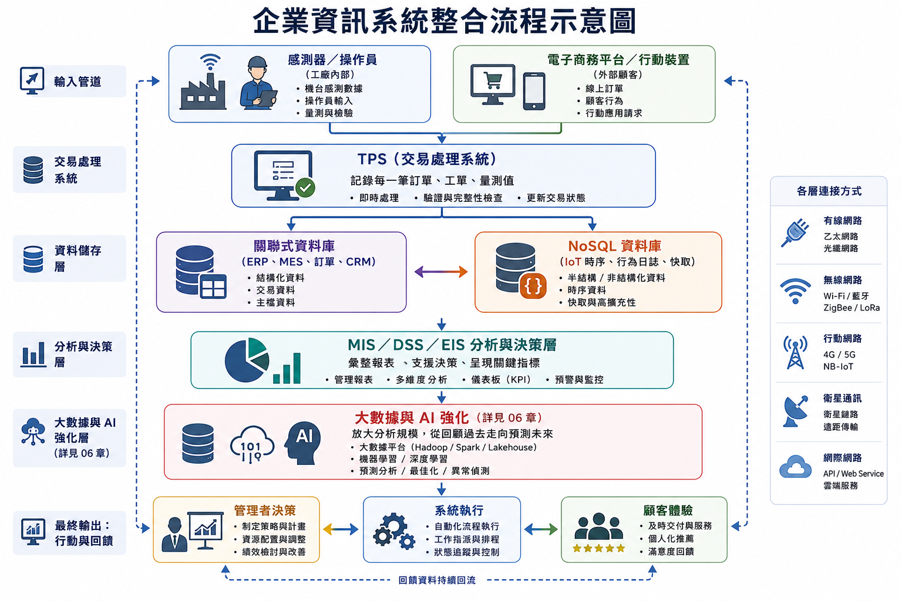

*本圖由 ChatGPT 生成，已由作者審核內容正確性*

從最底層的系統觀念，到最上層的決策與回饋，這張圖也把本章的所有主題收束成一個整體。接下來的學習重點總結，就依這條主線，把你該帶走的核心概念再點一次。

---

## 十、學習重點總結

讀完本章後，你應該能夠理解以下核心概念，並將其應用於工業場域的思考與決策：

**資料、資訊與資訊系統的區別**

資料是未經處理的原始記錄（例如一筆筆的機台溫度讀值），資訊是經過整理、對決策有意義的產物（例如「三號機今天的平均溫度比基準高 8%」）。資訊系統則是把輸入、處理、儲存、輸出串起來，讓這個轉換能持續、穩定發生的整體安排——它包含的不只是軟體，還有人員、流程與制度。工廠每天產生海量資料，能夠判斷哪些資料值得蒐集、如何轉化為決策資訊，是工業工程管理者的核心能力。

**資訊系統的層次：從交易處理到高階決策**

TPS（交易處理系統）在底層負責忠實記錄每一筆事件，MIS（管理資訊系統）在中層彙整成例行報表，DSS（決策支援系統）協助分析與模擬，EIS（高階主管資訊系統）則提供全局的關鍵指標。理解這個層次分工，有助於你在不同場合溝通正確的資訊需求——跟現場要的是 TPS 的原始記錄，跟高層報告的是 EIS 層次的摘要。

**企業應用系統：ERP、MES、SCM 的分工與整合**

ERP 管計畫與資源、MES 管車間的即時執行、SCM 管跨企業的供應鏈，三者透過資料流互相銜接，構成企業的「垂直整合」骨幹。這裡有個容易被忽略的重點：**這些系統的效益來自整合與流程改造，而非購買軟體本身**——導入失敗的案例，多半敗在流程沒理清、資料沒統一，而不是軟體不夠貴。

**資料庫：讓資料能被有效管理與共享**

從資料重複、格式混亂的檔案時代，到以關聯式模型（表格、主鍵、外鍵）統一管理、用 SQL 查詢的資料庫，核心價值在於一致性與共享。理解正規化、鍵值與關聯的概念，能讓你看懂一張生產記錄表為什麼要拆成好幾張表，以及為什麼跨系統整合時「主檔資料不一致」會是那麼大的麻煩。

**SQL、NoSQL 與大數據：選對工具比什麼都重要**

結構化的交易資料用關聯式資料庫與 SQL，IoT 時序資料、非結構化資料（影像、日誌）用 NoSQL，兩者並非互斥，而是各自處理不同性質的問題。大數據的 5V 特性（Volume、Velocity、Variety、Veracity、Value）則說明了為什麼傳統工具在現代資料規模下會失效——而 Veracity（真實性）提醒我們，資料量大不等於資料可信。

**網路、雲端與 AI 如何改變資訊系統**

雲端讓中小企業不必自建機房也能用得起 ERP，網路讓資料跨越廠區與國界流動，AI 則讓系統從「呈現資訊」走向「提出判斷」甚至「自主執行」。這三者疊加的結果，是資訊系統的角色從記錄工具轉變為決策參與者——但資料品質、系統整合與人工監督，仍然是它能否可靠運作的前提。

> 在工業4.0的時代，理解資訊系統與資料庫，等於理解智慧工廠的神經系統——資料如何流動、如何被管理、如何轉化為行動，決定了一座工廠能否真正實現「資料驅動決策」（Lee et al., 2015）。身為工業工程管理的學生，你未來將是業務需求與 IT 實作之間的橋梁；你不需要成為資料庫工程師，但你需要聽得懂兩邊在說什麼。

> **銜接提示**：本章介紹的 ERP、MES、SCM 與資料庫技術，會在全課程最後的 [06-Data-Science-AI-and-Smart-Manufacturing.md](06-Data-Science-AI-and-Smart-Manufacturing.md)〈五、工業4.0與智慧製造：把整條技術鏈放進工廠〉中，與硬體、程式、資料科學的內容一起，整合成一個完整的智慧工廠案例，屆時可以回頭對照這裡學過的系統架構。

---

## 參考文獻

- Chen, P. P.-S. (1976). The entity-relationship model—Toward a unified view of data. *ACM Transactions on Database Systems, 1*(1), 9–36. https://doi.org/10.1145/320434.320440
- Chopra, S., & Meindl, P. (2016). *Supply chain management: Strategy, planning, and operation* (6th ed.). Pearson.
- Codd, E. F. (1970). A relational model of data for large shared data banks. *Communications of the ACM, 13*(6), 377–387. https://doi.org/10.1145/362384.362685
- Connolly, T. M., & Begg, C. E. (2015). *Database systems: A practical approach to design, implementation, and management* (6th ed.). Pearson.
- Date, C. J. (2003). *An introduction to database systems* (8th ed.). Addison-Wesley.
- Davenport, T. H. (1998). Putting the enterprise into the enterprise system. *Harvard Business Review, 76*(4), 121–131.
- Dean, J., & Ghemawat, S. (2008). MapReduce: Simplified data processing on large clusters. *Communications of the ACM, 51*(1), 107–113. https://doi.org/10.1145/1327452.1327492
- Elmasri, R., & Navathe, S. B. (2016). *Fundamentals of database systems* (7th ed.). Pearson.
- Hey, T., Tansley, S., & Tolle, K. (Eds.). (2009). *The fourth paradigm: Data-intensive scientific discovery*. Microsoft Research.
- Inmon, W. H. (2005). *Building the data warehouse* (4th ed.). Wiley.
- Kimball, R., & Ross, M. (2013). *The data warehouse toolkit: The definitive guide to dimensional modeling* (3rd ed.). Wiley.
- Kroenke, D. M., & Auer, D. J. (2016). *Database processing: Fundamentals, design, and implementation* (14th ed.). Pearson.
- Laudon, K. C., & Laudon, J. P. (2022). *Management information systems: Managing the digital firm* (17th ed.). Pearson.
- Lee, J., Bagheri, B., & Kao, H.-A. (2015). A cyber-physical systems architecture for Industry 4.0-based manufacturing systems. *Manufacturing Letters, 3*, 18–23. https://doi.org/10.1016/j.mfglet.2014.12.001
- Mell, P., & Grance, T. (2011). *The NIST definition of cloud computing* (NIST Special Publication 800-145). National Institute of Standards and Technology. https://doi.org/10.6028/NIST.SP.800-145
- Monk, E. F., & Wagner, B. J. (2013). *Concepts in enterprise resource planning* (4th ed.). Cengage Learning.
- O'Brien, J. A., & Marakas, G. M. (2011). *Management information systems* (10th ed.). McGraw-Hill.
- Porter, M. E., & Millar, V. E. (1985). How information gives you competitive advantage. *Harvard Business Review, 63*(4), 149–160.
- Provost, F., & Fawcett, T. (2013). *Data science for business: What you need to know about data mining and data-analytic thinking*. O'Reilly.
- Silberschatz, A., Korth, H. F., & Sudarshan, S. (2020). *Database system concepts* (7th ed.). McGraw-Hill.
- Stair, R. M., & Reynolds, G. W. (2018). *Principles of information systems* (13th ed.). Cengage Learning.
- Stonebraker, M., & Çetintemel, U. (2005). "One size fits all": An idea whose time has come and gone. In *Proceedings of the 21st International Conference on Data Engineering* (pp. 2–11). IEEE. https://doi.org/10.1109/ICDE.2005.1
- Turban, E., Sharda, R., & Delen, D. (2014). *Decision support and business intelligence systems* (10th ed.). Pearson.
- Xu, L. D., He, W., & Li, S. (2014). Internet of things in industries: A survey. *IEEE Transactions on Industrial Informatics, 10*(4), 2233–2243. https://doi.org/10.1109/TII.2014.2300753

---

*本教材為大一計算機概論課程用途，著重概念理解與工業應用情境，建議搭配 ERP 或 MES 系統的實際操作演示，以加深理解與應用能力。*
