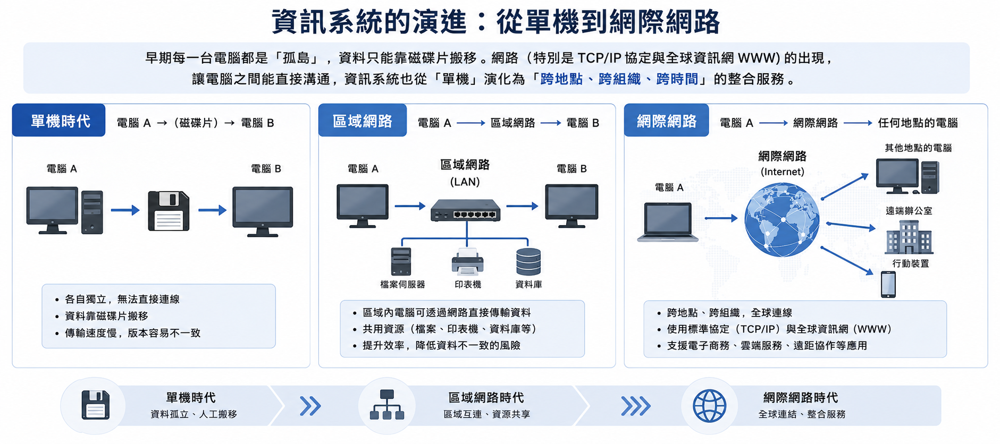
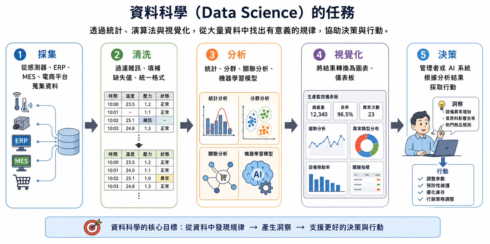
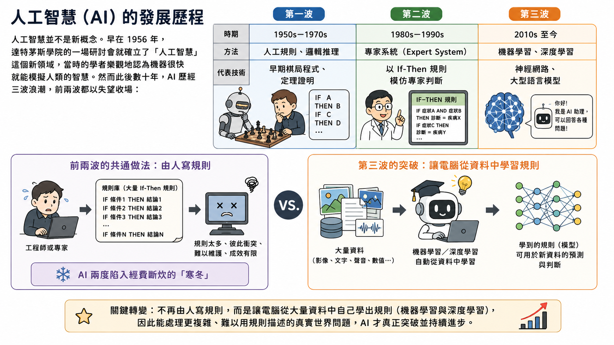
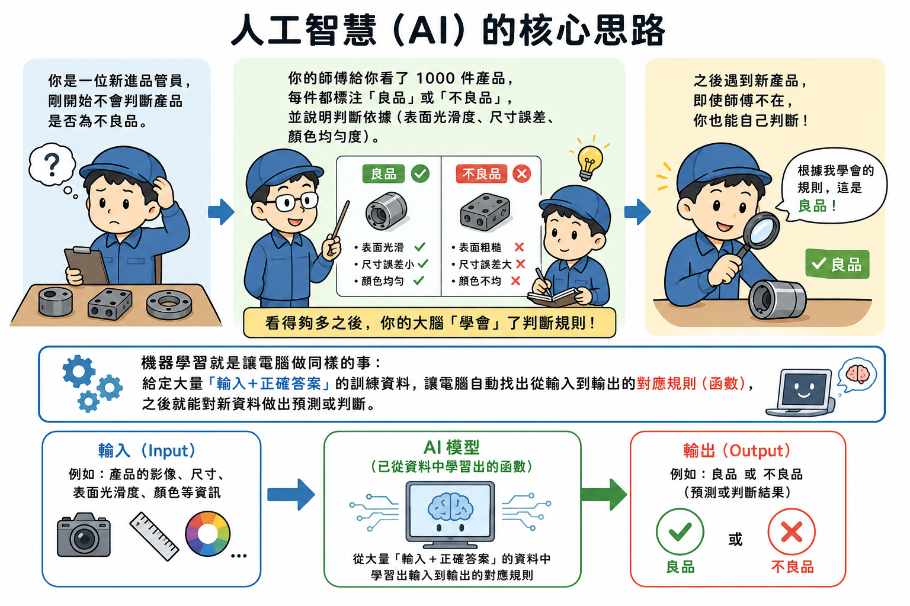
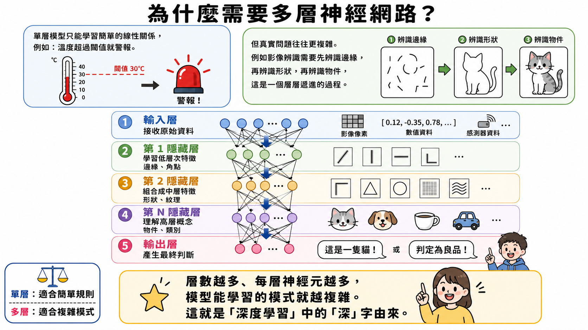
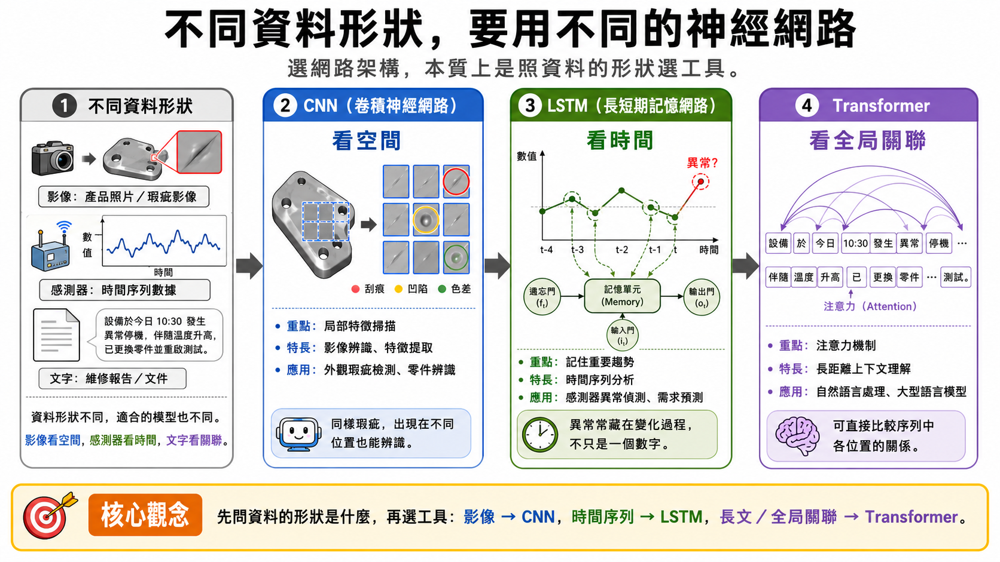
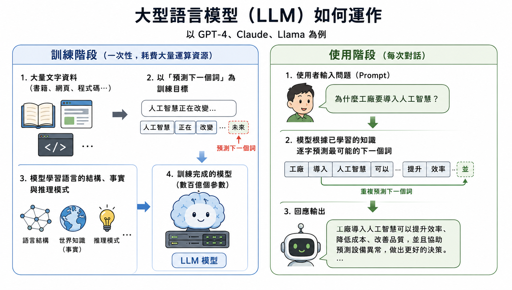
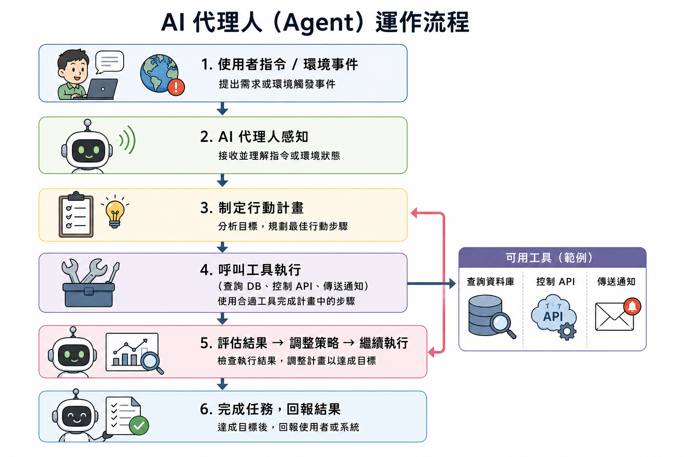
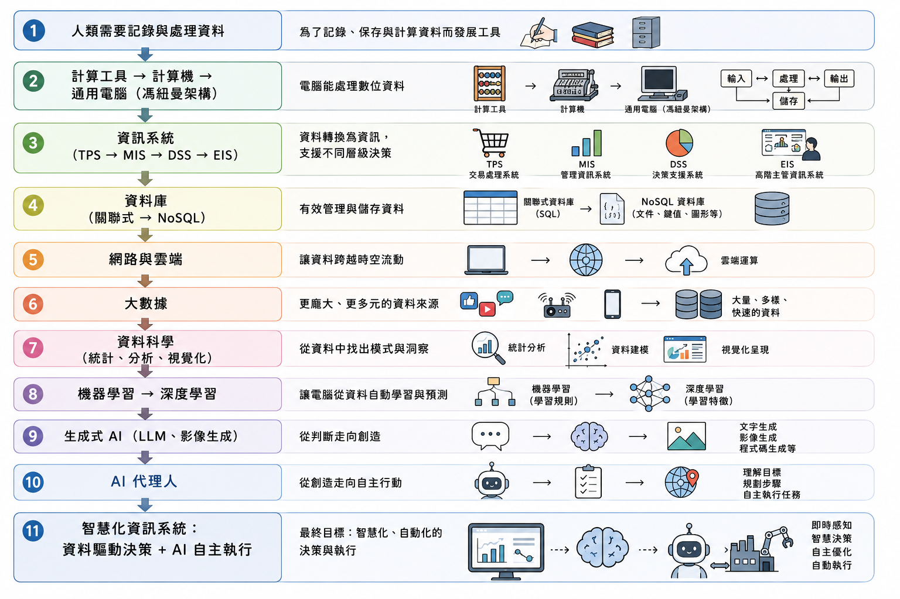
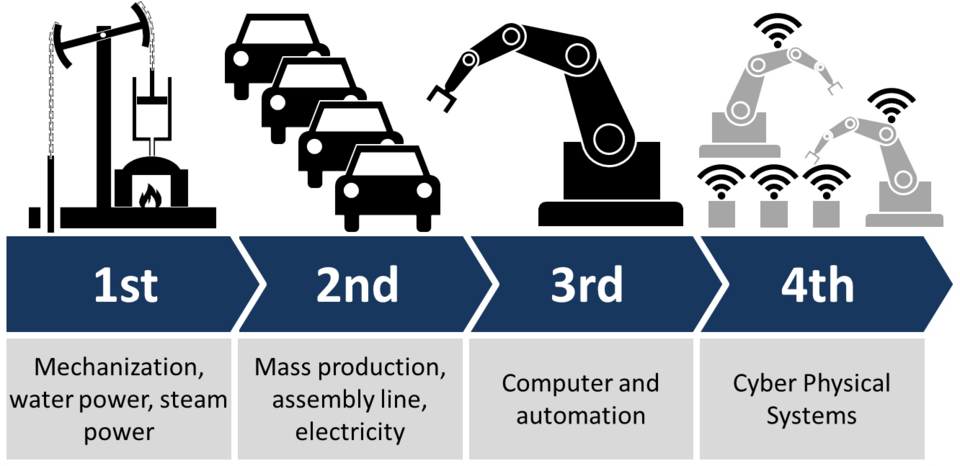

# 資料科學、人工智慧與智慧製造

從老闆一句「我們也要導入 AI」，到一座真正的智慧工廠——把整門課收束成一條從感測器到決策的完整鏈條

---

## 前言：從「老闆說要導入 AI」談起

你的主管走進會議室說：「新聞說某家工廠用 AI 預測機台故障，省下 30% 維修成本，我們也要做。下週報告給我。」

於是你開始研究，馬上撞上一堆問題：

- 「AI 預測」需要什麼資料？資料怎麼收、怎麼存？
- 「訓練模型」是什麼意思？要請誰做？需要多少時間和資料？
- 做出來的預測怎麼知道對不對？準確率 85% 算好嗎？

---

## 不懂資料科學與人工智慧，你可能會...

- 聽到「機器學習模型」、「訓練資料集」、「特徵工程」，完全不知道這些詞在說什麼
- 不理解為什麼要「清洗資料」，也不知道「資料品質差」會對 AI 結果造成什麼影響
- 看到 AI 廠商的分析報告，只能看結論，無法判斷「準確率 85%」代表好還是不好
- 在 AI 導入專案中無法和資料科學家溝通，不知道要提供什麼資料給廠商

---

## 懂資料科學與人工智慧，你可以...

- 理解「**資料** → 特徵 → **模型** → 預測」的基本流程，能參與 AI 專案的需求規劃
- 知道訓練資料品質如何影響模型，能問出「這批感測器資料有多少缺失值？」
- 讀懂 AI 報告中的 **準確率**、**召回率** 等指標，判斷模型是否達到實用標準
- 把整門課串起來：計算機、程式、網路、**資料庫**，理解 AI 如何在這些基礎上運作

> **學習資料科學與人工智慧的核心價值：不是要你訓練模型，而是讓你能和 AI 工程師有效對話、評估方案可行性，在智慧製造轉型中扮演「懂技術的業務端」**

---

## 每一門課，都是 AI 應用的一塊拼圖

| 課程主題 | 在 AI 應用中的角色 |
|---------|----------------|
| 計算機歷史與結構 | 理解 AI 硬體（GPU 加速、記憶體需求）的原理背景 |
| 程式語言與演算法 | 理解 AI 模型的訓練邏輯與演算法基礎 |
| 網路與物聯網 | 理解感測器資料如何從機台傳入 AI 系統 |
| 資訊系統與資料庫 | 理解 AI 所需資料的來源、儲存與查詢 |
| 資料科學 | 理解資料清洗、特徵工程、模型評估的流程 |
| 人工智慧 | 理解機器學習、深度學習、生成式 AI 的原理 |

---

# 一、從資料到知識：一條貫穿全課程的演進主線

先花一節把前面幾章串成一條主線。主角自始至終只有一個——**資料**，而整條線在講同一件事：**資料如何一階一階往上轉化，最後變成知識**。

---

## 這道階梯的四個位置

- **資料（Data）**：電腦與數位化把世界轉成 0 與 1，一堆本身沒有意義的數字
- **資訊（Information）**：資訊系統與資料庫把數字整理、關聯成看得懂、用得上的資訊
- **規模**：網路、雲端與物聯網把各地資訊匯聚成流，堆出「大數據」的規模
- **知識（Knowledge）**：資料科學與 AI 歸納出可重複應用的判斷，回頭指導決策與行動

> **前幾階早就被電腦、資料庫與網路自動化；唯獨最後一階長年只能靠人的經驗——資料一大，這一階就非交給機器不可**

---

## 電腦與數位化：資料這一階的起點

從農業社會的收成課稅、貿易帳目，到工業時代的彈道與橋樑計算，人類一直有「記錄與處理資料」的需求。當需求超出人工的速度與準確度，就驅動了計算機的誕生。

- 電腦的本質：**能依照程式指令處理數位資料的通用機器**
- 讓現實世界進入電腦的前提是 **數位化（Digitization）** ——文字、聲音、影像全部先轉成 0 與 1
- 工廠的溫度感測器每秒把類比訊號轉成數位數值，就是後面一切資料的最初來源
- 第一階到此為止：世界被轉成了資料，但這些數字還不代表任何意義

---

## 資料、資訊與知識：三層轉化鏈

- **資料（Data）**：感測器回傳的數字 `23.5`，本身沒有意義
- **資訊（Information）**：「A 生產線午後溫度超標，對應良率下滑 4%」，能用於決策
- **知識（Knowledge）**：把資訊與經驗結合，形成「下次該如何應對」的理解


---

## 資訊系統：把資料轉成資訊

- **資訊系統（IS）** 就是讓「資料 → 資訊 → 知識」這條轉化鏈得以發生的機制
- 但它真正自動化的主要是 **「資料→資訊」**：很會出報表，看完後「為什麼會這樣、下次該怎麼做」還是得靠人
- 再往上那一階，早年靠 **專家系統** 把老師傅的判斷寫成 If-Then 規則勉強逼近，成效有限

> **「資訊→知識」這一階遲遲交不出去，正是後面資料科學與 AI 要接手的核心課題**

---

## 資料庫：讓資料被管好

- 資料量一大、多系統要共享、關係變複雜，就需要 **資料庫（Database）** 與 **DBMS**——讓資料只存一份、全公司即時共用
- 主流是 **關聯式資料庫**（用 SQL 操作）；工業4.0與 IoT 的多樣、大量、快速資料，又催生了 **NoSQL**

> **資料庫是資料科學與 AI 的原料倉庫——沒有良好的資料管理，再強大的 AI 模型也會因為資料品質低落而失效**

---

## 網路、雲端與物聯網：讓資料匯聚成流

早期每台電腦都是「孤島」，資料只能靠磁碟片搬移。網路（TCP/IP 與全球資訊網）讓電腦直接溝通，資訊系統也從單機演化為跨地點、跨組織的整合服務。



---

## 雲端與物聯網：大數據的管道

- **雲端運算（Cloud Computing）**：運算資源透過網路按需取用，企業不必自建機房就能用 ERP、MES 或 AI 分析服務
- **物聯網（IoT）**：讓工廠裡每一台機器、每一個感測器都成為資料來源

一座現代智慧工廠可能有數萬個感測器，每秒把大量量測資料即時送上雲端。這一階沒有多加一層，卻把前兩階的規模整個放大——要歸納的素材，多到人腦處理不完。

> **網路與雲端，正是把零散資料匯聚成「大數據」的管道**

---

## 大數據：量、速、樣超出人工歸納的極限

| 特性 | 說明 | 工業範例 |
|------|------|---------|
| **Volume（量）** | 資料量龐大 | 全廠數千感測器每秒的量測值 |
| **Velocity（速）** | 產生速度快 | 視覺檢測每秒判斷數十個零件 |
| **Variety（樣）** | 類型多元 | 數值、影像、日誌、聲音同時匯入 |
| **Veracity（真）** | 品質複雜 | 感測器老化的異常數值需過濾 |
| **Value（值）** | 分析後的價值 | 從良率趨勢預測設備故障時間點 |

> **「資料很多」本身並不會自動變成價值——最後那一階「資訊→知識」還沒人接手，這正是下一節「資料科學」登場的原因**

---

# 二、資料科學與人工智慧

面對大數據，人類需要一套能大規模萃取模式的方法，替我們走完「資訊→知識」這最後一階，這就是 **資料科學**；而資料科學方法的成熟，加上運算能力的躍升，又反過來讓沉寂多年的人工智慧重新崛起。

本章節先看資料科學在做什麼，再看它與算力如何一起把 AI 推上舞台，最後深入機器學習與深度學習的原理。

---

## 資料科學：為駕馭大數據而生

**資料科學（Data Science）** 結合統計學、程式演算法與領域知識，目的是從龐大又雜亂的資料中萃取有意義的規律，轉化成能支持決策的洞見。它是一整套流程：



> **採集 → 清洗 → 分析 → 視覺化 → 決策：這條流水線，正是資料科學為了駕馭大數據而存在的理由**

---

## 常見的資料科學任務

- **分類（Classification）**：判斷某產品是良品還是不良品
- **迴歸（Regression）**：預測未來需求量或設備剩餘壽命
- **分群（Clustering）**：找出行為類似的顧客群體
- **關聯分析（Association Analysis）**：發現「買過 A 商品的人通常也買 B 商品」

---

## AI 為何能重新崛起：三波浪潮

| 波次 | 時期 | 方法 | 代表技術 |
|------|------|------|---------|
| **第一波** | 1950s–1970s | 人工規則、邏輯推理 | 早期棋局程式、定理證明 |
| **第二波** | 1980s–1990s | 專家系統 | 以 If-Then 規則模仿專家 |
| **第三波** | 2010s 至今 | 機器學習、深度學習 | 神經網路、大型語言模型 |

前兩波都讓工程師把規則一條條寫進電腦，但真實世界的判斷規則多到寫不完，AI 因此兩度陷入「寒冬」。

---

## 第三波換了路線



**不再由人寫規則，而是讓電腦從大量資料中自己學出規則**（機器學習與深度學習）。這條路要到 2010 年前後才跑得動，因為三個條件恰好齊備：

- **資料**：網路、雲端與物聯網累積出的大數據
- **演算法**：機器學習方法逐漸成熟
- **算力**：GPU 平行運算把數月的訓練壓縮到幾天

---

## 這些演算法其實都是老東西

- **貝氏定理** 源自十八世紀
- **迴歸分析** 是十九世紀的統計方法
- **感知機**（神經網路雛形）1958 年問世
- **CNN**（卷積神經網路）1980 年代末提出
- **隨機森林** 2001 年發表

真正改變的不是「有沒有這些演算法」，而是「跑不跑得動、值不值得跑」。是大數據、GPU 算力與明確的應用需求三者到齊，它們才換上「人工智慧」的名字站上舞台。

> **「人工智慧」這個名字，是 1955 年 John McCarthy 為了向基金會申請經費而發明的，隔年那場達特茅斯研討會被公認為 AI 的誕生地**

---

## AI 的基本邏輯：找到輸入與輸出之間的函數

想像你是新進品管員，師傅給你看 1000 件標好「良品／不良品」的產品並說明依據。看得夠多之後，你的大腦「學會」了判斷規則，之後就能自己判斷。



> **機器學習就是讓電腦做同樣的事：給定大量「輸入＋正確答案」，讓電腦自動找出從輸入到輸出的對應規則（函數）**

---

## 同一個邏輯，套進不同任務

| 輸入 | AI 任務 | 輸出 |
|------|---------|------|
| 設備振動頻率、電流、溫度 | 預測（迴歸） | 預計剩餘可用天數 |
| 產品影像 | 分類 | 良品 / 不良品 |
| 顧客購買紀錄 | 推薦 | 你可能喜歡的商品 |
| 自然語言問題 | 生成 | 文字回答、圖形生成 |

---

## 機器學習：訓練是怎麼運作的？

```
準備訓練資料（有輸入也有正確答案）
        ↓
模型給出預測
        ↓
計算預測與正確答案的差距（誤差）
        ↓
根據誤差自動調整模型內部的參數
        ↓
重複以上，直到誤差夠小
        ↓
訓練完成，模型可用於新資料
```

就像練習射箭：每次射偏後根據偏差調整姿勢，反覆練習直到命中率穩定。

---

## 訓練資料 vs. 測試資料

- **要用「模型從未見過」的資料驗證效果**：把資料分成「訓練集」與「測試集」——只在訓練資料上測試，就像學生只練考古題
- **過度擬合（Overfitting）**：模型「記住」訓練資料的細節而非學到真正規律，遇到新資料就失準——像把考古題答案全背下來，換個說法就不會了

> **「機器學習」一詞來自 IBM 工程師 Arthur Samuel 的下棋程式：他讓它自己跟自己下棋，結果變得比他本人還會下**

---

## 機器學習的四種類型

| 類型 | 資料特性 | 常見任務 | 工業應用 |
|------|---------|---------|---------|
| **監督式** | 每筆有正確答案 | 分類、迴歸 | 缺陷檢測、故障預測 |
| **非監督式** | 沒有標籤 | 分群、關聯 | 找異常模式、顧客分群 |
| **半監督式** | 少量標籤＋大量無標籤 | 分類 | 醫療影像 |
| **強化學習** | 與環境互動、獎懲學習 | 策略最佳化 | 機器人路徑、自動排程 |

> **強化學習最出名的舞台是圍棋：2016 年 AlphaGo 以 4：1 擊敗李世乭，成為「人機大戰」的標誌性時刻**

---

## 深度學習與神經網路：模仿大腦的架構

**深度學習（Deep Learning）** 以多層 **神經網路（Neural Network）** 為核心。單層模型只能學簡單的線性關係，但影像辨識要先辨識邊緣、再辨識形狀、再辨識物件——層層遞進。



> **層數越多、每層神經元越多，模型能學的模式就越複雜——這就是「深度」學習的「深」字由來**

---

## 為什麼「多層」花了十幾年才回來

1958 年心理學家 Frank Rosenblatt 造出單層的 **感知機（Perceptron）**，《紐約時報》甚至說它將能走路、說話、自我複製。

但 1969 年 Minsky 與 Papert 用數學證明：**單層感知機連 XOR 這麼簡單的邏輯都學不會**。神經網路研究經費幾乎全面斷炊，進入「AI 寒冬」。

> **要再等三十多年，多層神經網路才以「深度學習」之名捲土重來，成為今天你手機裡每一個 AI 功能的基礎**

---

## 三種經典架構：照資料的形狀選工具

| 網路架構 | 設計邏輯 | 工業應用 |
|---------|---------|---------|
| **CNN** | 對影像局部特徵敏感 | 外觀瑕疵檢測、零件辨識 |
| **RNN / LSTM** | 具「記憶」，處理前後順序 | 感測器異常偵測、需求預測 |
| **Transformer** | 注意力機制比對序列全局關係 | 自然語言處理、大型語言模型 |



---

## 三種架構，是「怎麼看資料」的差別

- **CNN 看的是「空間」**：在影像各個局部掃描特徵，同一種瑕疵不論落在哪個位置都認得出來
- **LSTM 看的是「時間」**：用「記憶閘門」選擇性記住歷史，異常常藏在「變化的過程」而非單一時間點
- **Transformer 看的是「全局關聯」**：一次把序列所有位置兩兩比對，直接算出「誰和誰有關」，不管相隔多遠

> **面對新問題，先問「這份資料的形狀是什麼」，往往比記住每種網路的名字更關鍵**

---

## 可解釋人工智慧（XAI）：打開黑箱

深度神經網路動輒上億個參數，判斷過程層層交疊，連工程師都很難說清「模型到底根據什麼下這個結論」——這就是 **黑箱（Black Box）** 問題。

- 第二波專家系統：**看得懂，卻不夠強**（能沿 If-Then 規則回溯）
- 第三波深度學習：**強，但看不懂**

工業場域特別在意：AI 說「這顆是不良品」，工程師得知道理由才敢停機、換料；模型有時還會學錯重點（靠背景光影而非刮痕判斷）。

> **準確度與可解釋性常此消彼長——牽涉安全、品質放行或責任歸屬時，寧可選一個判斷看得懂、出事查得到的模型**

---

# 三、當代人工智慧議題

深度學習成熟之後，AI 的能力在近幾年快速外擴——從「判斷與預測」走向「創造內容」，再走向「自主行動」。

本章節先介紹三個最受矚目的當代主題——生成式 AI、大型語言模型、AI 代理人，再回頭盤點 AI 的能力層級（弱 AI 到 AGI）與目前的各種應用類型。

---

## 生成式 AI：從「判斷」到「創造」

前面的 AI 多半是「分析型」——給定輸入，輸出一個判斷。**生成式 AI（Generative AI）** 更進一步，能創造出新的內容。

| 生成類型 | 代表技術 | 輸出範例 |
|---------|---------|---------|
| 文字生成 | GPT（ChatGPT）、Claude | 報告、程式碼、問答 |
| 圖像生成 | Stable Diffusion、DALL-E | 產品設計草圖、廣告視覺 |
| 影片生成 | Sora | 產品展示影片 |
| 語音合成 | TTS 模型 | 語音客服、教學語音 |

---

## Transformer：從翻譯工具長成通用引擎

**Transformer 架構** 是生成式 AI 的核心，最早由 Google 團隊在 2017 年論文「Attention Is All You Need」提出，一開始的用途其實只是 **機器翻譯**（英譯德）。

後來大家發現「先讀懂整段脈絡、再逐步生成」的流程遠不只能翻譯——也能生成文章、程式碼、圖像。

- 在它之前有 **GAN**（生成器與鑑別器互相較勁）與 **擴散模型**（從雜訊逐步去噪）
- Transformer **結構簡潔又統一**，容易放大規模、也容易訓練，於是成了共同骨幹
- 但這不代表 GAN、擴散模型被淘汰——各種模型各有擅場

---

## 注意力機制：同時看整段文字

傳統語言模型按順序讀，讀完一個字才讀下一個。Transformer 則能 **同時看整段文字，並計算每個字與其他所有字之間的關聯程度**。

例如「這台設備的電流昨天午後突然升高，**它** 可能需要維修」——模型需要理解「它」指的是「設備」而非「電流」。

> **論文標題「Attention Is All You Need」向披頭四名曲〈All You Need Is Love〉致敬；而「Transformer」的命名，設計文件裡真的放了六個變形金剛角色插圖**

---

## 大型語言模型（LLM）的核心：預測下一個字



LLM 的核心其實只有一件事：**一個詞元接著一個詞元地「預測下一個字」**——算出最可能的下一個詞元、吐出來、再接回尾端繼續預測，一整句通順的回答就這樣「接龍」生成出來。

---

## Token（詞元）：LLM 的最小單位與計量單位

- **Token（詞元）**：LLM 先把文字切成一個個詞元（約英文半個到一個單字、中文一到兩個字）
- **上下文視窗（Context Window）**：模型一次能讀進、參照的 Token 總量上限；超出的部分會被截斷，模型就「看不到」也「記不得」
- 商用模型幾乎都 **按 Token 計費**，輸入與輸出分別計價——這是工程師會精簡提示的原因

> **衡量一個模型好不好用：它一次「能吃進多少」（上下文視窗）與「能穩定產出多少」，往往比空談它「聰不聰明」更貼近實際**

---

## 幻覺（Hallucination）：說得通不等於是真的

LLM 有時會生成聽起來合理、實際上卻錯誤的內容——捏造數據、引用查無此文的論文。

根本原因：它的訓練目標是「把話講得通順」，而不是「保證每句都屬實」；模型骨子裡是在「預測下一個最可能的詞」，本身沒有查證事實的機制。

- 把 LLM 用在專業或高風險決策時，輸出務必經過 **人工查證**
- 壓低幻覺、讓模型學到一套貼近真實世界運作的邏輯（「世界模型」），公認是通往 **通用人工智慧（AGI）** 最難跨越的一關

---

## 提示詞工程：怎麼問，決定回答的品質

同一個模型，把角色、背景、要求與輸出格式交代清楚，能顯著提升結果的實用性。

- 這已是目前職場使用 AI 工具的重要技能
- 和「算 Token」相輔相成——一個好的提示不只問得準，也問得精簡

當提示詞的運用，從「問一次、答一次」演變成讓模型自己拆解目標、逐步規劃並執行，就邁入了下一節的 AI 代理人。

---

## AI 代理人：從「回答」到「行動」

**AI 代理人（AI Agent）** 是目前 AI 發展最前沿的應用形式。不過「找個小幫手替你打理雜事」這個想法一點都不新。

- 微軟 1997 年 Office 97 裡的 **Clippy（大眼夾）**，你才打出信件開頭，它就蹦出來問「看起來你正在寫一封信，需要幫忙嗎？」
- 但 Clippy 靠 **寫死的規則** 運作，能做的事極其有限，離真正的「代理人」還很遠

> **真正讓這個老概念脫胎換骨的，是 LLM——但要幫它補上兩樣它本來沒有的東西**

---

## 讓 LLM 動起來的兩樣東西

**第一，工具使用（Tool Use / Function Calling）**：讓 LLM 的輸出不再只是文字，而可以是一個「動作指令」，要求外部程式替它查資料庫、呼叫 API、傳送通知。LLM 退居幕後當「大腦」，工具成了它的「手腳與眼睛」。

**第二，自主迴圈**：把「觀察 → 思考 → 行動 → 再觀察」包成反覆執行的迴圈，讓模型持續朝目標推進，直到任務完成。

> **原本被動一問一答的 LLM，一旦接上工具、再套進自主迴圈，就成了能獨立完成多步任務的 AI 代理人**

---

## 一個 AI 代理人具備的能力



1. **感知環境**：接收需求、系統狀態、查詢結果
2. **制定計畫**：把複雜任務拆解為多個步驟
3. **呼叫工具**：搜尋、讀寫資料庫、控制系統、通知
4. **執行行動**：自主完成，不需每步人工確認
5. **反思與調整**：評估是否達成目標，必要時修正

**工業範例**：接到「設備震動超標」警報後，自動查維修知識庫、比對歷史故障、判斷原因、排程停機、通知維修人員。

---

## 這股浪潮，正在變成你的「數位同事」

- 2025 年中之後，**軟體開發** 率先劇變：工程師用自然語言把需求講清楚，就能讓代理人生成、修改、除錯、跑測試（稱為 **vibe coding**）
- 很快擴散到程式以外：整理分析資料、代擬客服訊息、安排行程、彙整會議記錄

> **給同學的提醒：這股趨勢短期內不會回頭，也早已不是程式設計師的專利。趁大學階段親自訂一個 Pro 帳號（如 Claude Code、OpenAI Codex）動手玩，摸清楚它能做到哪、又還做不到哪**

---

## 弱 AI（Narrow AI）

只能在特定領域執行特定任務的 AI 系統，**目前所有實際應用的 AI 都屬於弱 AI**：

- 能擊敗世界棋王的 AlphaGo，只懂下圍棋
- 人臉辨識系統只能辨識臉，不能幫你寫報告
- 聊天機器人能對話，但不具真正理解或意識，仍需使用者提供更詳細指示

---

## 強 AI（Strong AI）與 AGI

**強 AI**：具備與人類相似思維方式的 AI——真正具有理解、意識、自我覺察；「意識」既難定義又難驗證，至今仍停留在理論階段，沒有任何系統被證實達到

**通用人工智慧（AGI）**：能像人類一樣跨領域學習、理解、靈活運用知識解決問題，不需針對每個任務重新訓練

> **AGI 與強 AI 概念高度重疊，但更強調「跨領域實用能力」而非「是否具備意識」，因此更容易被具體定義、測試與逐步逼近**

---

## 為什麼業界追求 AGI 而非強 AI

- OpenAI、Google DeepMind、Anthropic 等以 AGI 為主要長期研發目標
- 評估是否接近 AGI，從單一任務準確率轉向：能否通過專業考試、完成多步驟工作、自主規劃執行複雜流程（即前面談的 **AI 代理人**）
- 當代 AGI 路線聚焦於「高度自主、且在多數具經濟價值的工作上勝過人類」（OpenAI 憲章的判準）

**工業情境**：AGI 等級系統能像資深廠務經理，同時掌握排程、品質、供應鏈、人力調度等跨部門資訊，自主判斷並調整產線、通知供應商、重新分配人力

---

## 那 ChatGPT、Claude 算 AGI 了嗎？

**還不算，但已經是史上最接近 AGI 的一批系統。**

- 微軟研究院測試 GPT-4 後，論文標題是「AGI 的火花」——是火花，不是火
- Google DeepMind 的 AGI 分級架構，把這類聊天機器人放在 **初階 AGI（Emerging AGI）**：已經上路，但仍在第一階

> **能跨領域回答、寫程式、通過專業考試，這在十年前難以想像；但離 AGI 仍有幾道具體的缺口**

---

## 離 AGI 還差哪幾道？

- **學不進去新東西**：訓練結束就定型，聊過的內容不會變成它的本事（**災難性遺忘**）
- **會一本正經地說錯話**：也就是 **幻覺**，且不一定察覺自己何時不可靠
- **任務一長就走偏**：GAIA 評測中，人類正確率約九成，外掛工具的 GPT-4 只有一成多
- **能力呈鋸齒狀**：專業考試過得了，簡單算術卻可能出錯（哈佛與 BCG 的 758 人實驗）
- **碰不到真實世界**：無法自己走到產線量測、動手調機台

> **現在的 AI 像一位博學、反應快，但沒有長期記憶、也不為結果負責的實習生**

---

## AI 應用類型（一）

- **影像辨識**：醫療影像診斷、自動駕駛障礙物偵測、工廠瑕疵檢測
- **語音助理**：Siri、Google Assistant——結合語音辨識、自然語言處理、語音合成
- **推薦系統**：YouTube、Netflix、蝦皮依歷史行為預測興趣內容
- **自動駕駛**：結合影像辨識、感測器融合、地圖資料、深度學習

---

## AI 應用類型（二）

- **自然語言處理與機器翻譯**：Google 翻譯、DeepL，輔助跨國廠務溝通
- **生成式 AI**：直接「創造」全新文字、圖片、程式碼，如 ChatGPT、Midjourney
- **機器人與自動化**：機械手臂、自動導引車（AGV），是工業工程最直接接觸的 AI 應用
- **預測性維護**：從 IoT 感測資料學習正常/異常模式，提前預測機台故障，避免停機損失

---

<!-- ## AI 應用類型一覽 -->


---

# 四、整合視角：資訊科學與 AI 的完整脈絡

到這裡，本課程從第一章到第六章介紹過的技術，其實可以收束成一條前後相扣的主線。

這條主線的驅動力，是一個延續數千年、始終沒變過的人類需求——**把資料記下來、再從資料裡得出有用的結論**。

---

<!-- ## 技術演進的完整脈絡圖 -->



---

## 每個技術節點，解決的是上一代帶出的新麻煩

| 技術 | 核心問題 | 解決方式 |
|------|---------|---------|
| **計算機** | 人工計算太慢、易錯 | 以電子電路自動執行計算 |
| **資訊系統** | 資料沒有意義 | 整合輸入處理儲存輸出，轉為資訊 |
| **資料庫** | 資料重複、難共享 | 結構化儲存、統一管理、多系統共用 |
| **網路** | 資訊困在孤立電腦中 | TCP/IP 互聯，雲端讓服務無所不在 |
| **大數據** | 傳統工具處理不了現代規模 | 分散式運算、NoSQL、串流處理 |

---

## 從判斷到創造，再到自主行動

| 技術 | 核心問題 | 解決方式 |
|------|---------|---------|
| **機器學習** | 複雜問題難用人工規則 | 讓電腦從資料自動學對應關係 |
| **深度學習** | 非結構化資料難分析 | 多層神經網路自動提取特徵 |
| **生成式 AI** | AI 只能判斷、不能創造 | Transformer + 大規模預訓練 |
| **AI 代理人** | AI 只能回答、不能行動 | 結合 LLM 與工具呼叫，自主執行 |

> **看待任何新技術，與其問「它有多厲害」，不如先問「它到底解決了前一代解不了的哪個問題」——才不會被行銷術語牽著走**

---

# 五、工業4.0與智慧製造：把整條技術鏈放進工廠

前面四節，我們把「資料」從產生、儲存、匯聚，一路講到用 AI 從中萃取判斷。

這一節不再介紹新技術，而是把這整條鏈條放進一座真實的工廠，看它們如何協同運作——這正是近十年製造業最熱門的關鍵字。

---

## 工業4.0是什麼

**工業4.0（Industry 4.0）** 是德國政府 2011 年提出的製造業戰略，代表第四次工業革命，以 **數位化、網路化、智慧化** 為核心。



---

## 自動化 ≠ 工業4.0

自動化（讓機器自己動）是第三次工業革命的成果；工業4.0是在自動化基礎上，再加裝感測器、聯網回傳資料、串接雲端與 AI。三個相依的特徵缺一不可：

- **數據驅動**：決策基於資料分析，而非經驗直覺
- **自動化**：製造步驟無需人工即可執行
- **互聯**：機器與系統間資料即時流通

> **互聯讓資料流得出來，自動化讓決策執行得下去，數據驅動是中間那個「想」的環節**

---

## 九大技術支柱：其實大半是前幾章講過的

| 技術支柱 | 一句話說明 |
| --- | --- |
| 大數據分析 | 從海量生產資料找出規律與異常 |
| 工業物聯網（IIoT） | 讓機台與感測器連上網、回報狀態 |
| 雲端運算 | 用網路取用自己算不動的運算與儲存 |
| 系統整合 | 讓各自獨立的系統互相交換資料 |
| 網路安全 | 整合越深，被攻擊的代價越大 |
| 自主機器人 | 能感知環境、彼此協作（如 AGV、Cobot） |
| 數位孿生 | 在電腦裡建分身，先模擬再動手 |
| 增材製造（3D列印） | 用「疊加」而非「切削」來製造 |
| 擴增實境（AR） | 把數位資訊疊在真實視野上 |

---

## 數位轉型：技術只是一半，另一半是組織

**數位轉型（DX）不是** 把紙本換 Excel、給每人發平板，而是以數位技術 **從根本改變業務流程、組織文化與商業模式**。

| 階段 | 在做什麼 | 工廠裡的例子 |
| --- | --- | --- |
| 數位化 Digitization | 類比變數位資料 | 紙本日報表改用 Excel 填 |
| 數位優化 Digitalization | 用數位技術改造流程 | 導入 MES，資料自動上傳 |
| 數位轉型 Transformation | 改變經營模式與組織 | 敢接以往不敢接的急單、小量多樣 |

> **數位轉型走到最深處會改變公司「靠什麼賺錢」——空壓機廠商從「賣設備」轉為「按用掉的壓縮空氣量收費」**

---

## 為什麼約七成的數位轉型會失敗

麥肯錫、BCG 等多份調查都指向同一個數字：**約七成的數位轉型專案未能達成原訂目標**，而失敗原因絕大多數與技術無關——是組織抗拒、目標不明確，或把它當成 IT 部門的專案來管。

老師看過最傳神的一幕：某工廠花大錢導入 MES，系統跑得好好的，但班長私下還是用 Excel 平行記著一本帳，因為「系統上的數字我不信」。

> **系統可以導入，信任不能——這本 Excel，就是那七成失敗率的縮影**

---

## 智慧工廠：從感測器到決策的四層資料流

以一條 **汽車零件加工生產線** 為例，資料從現場一路走到決策：

- **現場層**：機床的振動、溫度、電流感測器與工業相機，經 ADC 轉為數位資料
- **控制層**：PLC 執行即時控制，邊緣電腦跑 AI 模型即時判斷零件有無瑕疵
- **管理層**：MES 存資料、計算 OEE、偵測異常報警，每日匯入 ERP
- **雲端層**：BI 儀表板呈現趨勢；多廠資料匯總後訓練預測模型，再推回邊緣電腦

> **從那顆振動感測器，到主管畫面上的一條良率曲線，正好就是你在前面各章學過的全部東西**

---

## 工廠裡最成熟的三種 AI 應用

| 應用 | 輸入資料 | 產出決策 | 誰在用 |
| --- | --- | --- | --- |
| 預測性維護 | 振動、溫度、電流時序 | 機器還能撐多久、何時維修 | 設備／維護工程師 |
| 品質檢測 | 產品外觀影像 | 良品／不良品、瑕疵在哪 | 品管、製程工程師 |
| 需求預測 | 歷史銷售、季節、經濟指標 | 下個月各產品要生產多少 | 排程、採購、業務 |

> **預測性維護最常被當作工業4.0的代表作，因為它的效益最容易算得出來：一次非計畫停機的損失，減去感測器與系統的成本**

---

## 數位孿生：把試錯成本搬到虛擬世界

**數位孿生（Digital Twin）** 是在電腦裡建立實體對象的虛擬分身，並透過感測器 **持續同步**。「持續同步」正是它與一般 3D 模型的分野——CAD 模型畫完就固定，數位孿生隨實體即時狀態不斷變化。

- 在機台的孿生上問「進給速度調高 10% 會怎樣」，先在電腦裡撞一次
- 對工業工程系學生而言，**它本質上就是模擬（Simulation）**，只是餵給它的是產線上正在發生的真實資料

> **數位孿生的靈魂：先在分身上試，再對本尊動手——阿波羅13號當年用的是實體模擬艙，今天這個分身活在電腦裡，可以有一千個、隨時重來**

---

## 導入的現實：為什麼多數專案會卡住

工業4.0最難的從來不是單一技術，而是 **系統整合**（開放標準如 OPC UA、定義良好的 API、資料格式一致、資安）。但真正讓專案卡住的，往往是課本不太談的四件事：

- **舊機台沒有資料介面**：1998 年的沖床沒網路孔，「先把資料收上來」往往是最貴的一步
- **資料的所有權與部門政治**：製造部為什麼要把即時稼動率開放給財務部看
- **投資報酬難以量化**：你很難為「沒有發生的停機」開發票
- **現場人員的抗拒**：新系統讓做了二十年的「手感」突然不值錢

> **面對廠商的「工業4.0解決方案」，先問：這套系統要解決的，是我真正的痛點，還是它剛好會做的事？**

---

# 六、學習重點總結

讀完本章後，你應該能夠理解以下核心概念，並將其應用於工業場域的思考與決策。

從第一章的算盤走到這裡的智慧工廠，你走過的是同一條線——把世界變成 0 與 1 的資料，讓資料匯聚成資訊，再讓資訊被分析成知識，最後在一座真實工廠裡變成決策。

---

## 核心概念（一）

**AI 不是憑空出現，它站在「資料→資訊→知識」這道階梯的最上層**：數位化產出資料，資訊系統與資料庫把資料變成資訊，網路與雲端把資訊匯聚放大，最後由資料科學與 AI 把資訊淬鍊成知識。當有人問「我們能不能導入 AI」，這道階梯本身就是檢查清單。

**資料科學的價值，在於把資料變成可行動的判斷**：一張沒有人會依它做決定的儀表板，技術上再完整都沒有創造價值。

---

## 核心概念（二）

**機器學習與深度學習：讓電腦從資料中找出規則**：規則明確、例外少的問題，寫程式就好；規則說不清楚但案例很多的問題（如從影像判斷瑕疵），才是機器學習的主場。

**生成式 AI 與 AI 代理人：從判斷走向創造與自主行動**：AI 的角色正從「回答問題」轉向「參與流程」——但責任歸屬、稽核軌跡與人工監督的設計，也變得比以往更重要。

---

## 核心概念（三）

**AI 的限制與資料品質同樣是重點**：模型的表現上限由資料決定。資料有偏誤，模型就複製偏誤；資料標註品質差，再先進的架構也救不回來。

**工業4.0：真正難的是整合而非技術**：它不是一項新技術，而是把前面每一章放進同一座工廠協同運作。約七成的數位轉型專案未能達標，且失敗原因多半與技術無關。

> **評估任何「智慧工廠」專案，先問的不該是「用了幾項先進技術」，而是「它解決了我工廠的哪個真實痛點」**

---

## 對工業工程管理學生的意義

你未來的工作核心，是在人、機器、資料與系統之間建立最佳的運作方式：

1. **看懂系統層次**：知道 TPS 蒐集、MIS 彙整、AI 分析的分工，才能和 IT 溝通正確需求
2. **判斷工具適用性**：結構化用關聯式、即時大量用 NoSQL、複雜判斷用 AI
3. **評估 AI 的價值與限制**：資料品質、模型選擇與人工監督缺一不可
4. **設計 AI 輔助的工作流程**：未來不是 AI 取代人，而是「人 + AI 代理人」合作

---

## 全課程的終點

> **資訊科學的終極目標，不是讓電腦變得更聰明，而是讓人能夠更有效地利用資料做出更好的決策——無論這個「人」是產線上的工程師、倉庫的物流主管，還是整個供應鏈的策略決策者**

工業4.0的時代，「不懂電腦」的工業工程管理畢業生會在升學與就業上吃虧；而且不只製造業，各行各業都在被資訊與人工智慧改寫做事的方式。

**計算機概論，就是你與資訊科技建立對話能力的第一步。**
