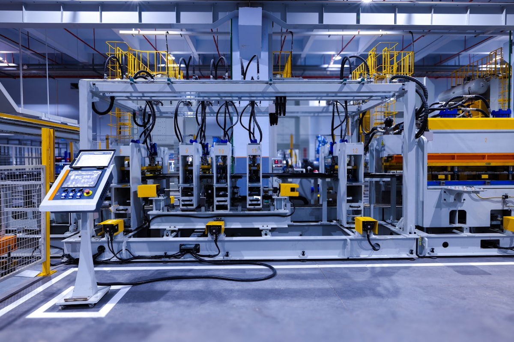

# 工業4.0與智慧製造整合（Industry 4.0 and Smart Manufacturing Integration）

## 前言：從「主管要看一整條產線的即時報表」談起

主管走進辦公室：「我要看整條產線的即時良率、設備稼動率，最好還能預測下週的物料需求，用一個畫面就能看完，這就是大家常說的工業4.0吧？」

你心裡浮現一堆疑問：

- 感測器量到的數字，要經過哪些系統，才會變成主管畫面上的報表？
- PLC、MES、ERP、SCADA 這些系統彼此是什麼關係？誰該負責什麼？
- 工業4.0這個詞喊了十幾年，實際落地到工廠裡，到底長什麼樣子？

如果不理解這些系統如何整合，你可能遇到：

- 只看得懂單一系統的畫面，卻不知道資料是從哪裡來、又會送到哪裡去
- 討論導入專案時，分不清楚哪些是硬體升級、哪些是資訊系統整合、哪些是資料分析的問題
- 面對廠商提出的「工業4.0解決方案」，無法判斷這是真整合，還是換湯不換藥

如果理解這些系統如何整合，你可以：

- 畫出一條產線從感測器到管理決策的完整資料流
- 判斷一個「智慧工廠」專案，究竟缺的是硬體、資訊系統，還是資料分析能力
- 把本課程學過的計算機結構、程式、網路、資訊系統與資料科學，在一個真實案例中重新串起來

> **這就是理解工業4.0整合的核心價值**：這一章不再介紹新技術，而是把前面六章學過的知識，放進一個真實的智慧工廠情境中重新驗證一次，看看它們如何協同運作。

| 課程主題 | 在智慧工廠中對應的角色 |
|---------|----------------|
| [02 電腦架構](02-Computer-Structure.md) | 感測器、PLC、工業電腦等硬體基礎 |
| [03 程式設計](03-Computer-Program.md) | 控制邏輯與資料處理演算法 |
| [04 網路與物聯網](04-Networks-and-Internet.md) | 感測器資料如何傳輸、工業通訊協定 |
| [05 資訊系統與資料庫](05-Information-Systems-and-Database.md) | ERP、MES、SCM 如何管理與儲存資料 |
| [06 資料科學與人工智慧](06-Data-Science-and-AI.md) | 預測性維護、品質檢測等 AI 應用 |

> 本章是全課程的**應用案例整合章節**：透過一個完整的智慧工廠場景，展示前六章的技術如何在真實工廠中協同運作，而不是再介紹新的技術名詞。

---

## 一、工業4.0是什麼

### 1. 四次工業革命與工業4.0的定義

**工業4.0（Industry 4.0）** 是由德國政府於2011年提出的製造業數位轉型戰略，代表著第四次工業革命——以**數位化、網路化、智慧化**為核心，將物理世界的製造流程與數位世界的資料分析深度融合。


*圖片來源：[Wikimedia Commons「Industry 4.0.png」](https://commons.wikimedia.org/wiki/File:Industry_4.0.png)，作者 Christoph Roser（AllAboutLean.com），授權 CC BY-SA 4.0*

上圖是抽象的階段演進示意，下圖則是實際工廠中一條自動化生產線的樣貌——冰箱背板成型產線，機台旁配有觸控式人機介面（HMI）面板供操作員監控與設定參數：



*圖片來源：[Unsplash「A machine that is inside of a building」](https://unsplash.com/photos/a-machine-that-is-inside-of-a-building-SaX8ZBFkLTc)，攝影者 Homa Appliances，Unsplash License*

這類設備本身體現的是「自動化」——第三次工業革命的核心特徵；要真正邁向工業4.0，還需要進一步為機台加裝感測器、聯網回傳資料，並串接雲端分析與 AI 模型，才能達成下面要談的「數據驅動」與「互聯」。**換句話說，一座工廠光是自動化程度很高，並不等於它就是工業4.0。** 這個區分很重要，也是你日後評估一個「智慧工廠」專案時，第一個該問的問題。

> **趣味小知識**：「工業4.0」這個名字，其實**是先有名字才有內容**。2011年4月1日，三位德國人——SAP 創辦人之一、物理學家 Henning Kagermann，人工智慧教授 Wolfgang Wahlster，以及聯邦教研部官員、物理學家 Wolf-Dieter Lukas——聯名發表了一篇文章，第一次用了「Industrie 4.0」這個詞。兩天後漢諾威工業展開幕，總理梅克爾在演說中直接採用了它，這個詞就此傳遍全世界。有趣的是，這是個不折不扣的**行銷式命名**：借用軟體版本號「4.0」的語感，暗示這是繼機械化、電氣化、自動化之後的「第四版」工業。當時它指涉的具體內容其實還相當模糊，是後來十年才慢慢被填滿的。所以當你聽到有人爭論「這到底算不算工業4.0」時，別忘了：這個詞從誕生的第一天起，界線就是浮動的。

### 2. 三大核心特徵

工業4.0的內涵可以濃縮成三個彼此相依的特徵：

**數據驅動（Data-Driven）**——生產的每一個環節都產生並利用資料，決策基於資料分析而非經驗直覺。這是工業4.0與前三次工業革命最根本的差異：前三次改變的是「怎麼做」（用機器做、大量做、自動做），第四次改變的是「怎麼決定要怎麼做」。

**自動化（Automation）**——透過軟硬體整合，讓更多製造步驟無需人工干預即可自動執行。這一項嚴格說來是第三次工業革命的遺產，工業4.0是站在它的肩膀上。

**互聯（Connectivity）**——機器與機器、機器與系統、系統與系統之間深度連結，資料即時流通。沒有互聯，資料出不了那台機器，數據驅動就無從談起。

三者的關係是：**互聯讓資料流得出來，自動化讓決策執行得下去，而數據驅動是中間那個「想」的環節**。缺任何一個，另外兩個都會落空——這也是為什麼工業4.0難的從來不是單一技術，而是整合。

### 3. 九大技術支柱

工業4.0常被歸納為**九大技術支柱**。你會發現其中大半，正是本課程前六章講過的東西——這張表可以當成全課程的索引來讀：

| 技術支柱 | 一句話說明 | 本課程哪裡講過 |
| --- | --- | --- |
| 大數據分析 | 從海量生產資料中找出規律與異常 | [05](05-Information-Systems-and-Database.md)〈九、大數據如何改變資訊系統〉、[06](06-Data-Science-and-AI.md)〈五、第五站：大數據〉 |
| 工業物聯網（IIoT） | 讓機台與感測器連上網、把狀態說出來 | [04](04-Networks-and-Internet.md)〈九、物聯網與低功耗網路〉 |
| 雲端運算 | 用別人的電腦做自己算不動的運算與儲存 | [05](05-Information-Systems-and-Database.md)〈七、網路與雲端對資訊系統的影響〉 |
| 水平與垂直系統整合 | 讓各自獨立的系統互相交換資料 | [04](04-Networks-and-Internet.md)〈二十四、3. 系統整合〉、本章〈七〉 |
| 網路安全 | 整合得越深，被攻擊的代價越大 | [04](04-Networks-and-Internet.md)〈二十一、當代網路議題〉 |
| 自主機器人 | 能感知環境、彼此協作，而非只會重複固定動作 | 本章原創（見下） |
| 模擬（數位孿生） | 在電腦裡建一個分身，先模擬再動手 | 本章〈六、3〉 |
| 增材製造（3D列印） | 用「疊加」而非「切削」來製造 | 本章原創（見下） |
| 擴增實境（AR） | 把數位資訊疊在真實視野上 | 本章原創（見下） |

前五項你都已經認識了，這裡不再重述。後四項前面章節沒談過，簡單補充：

**自主機器人（Autonomous Robots）** 與傳統工業機器人的差別在「自主」二字。傳統機器手臂只是精確地重複同一套預先寫好的動作，你站在它的工作範圍裡它照樣揮下來，所以必須用安全柵欄圍起來。自主機器人則配備感測器，能感知周遭環境、與人共處（稱為**協作機器人，Cobot**），甚至幾台之間互相協調分工。工廠裡的 AGV（自動導引車）會自己避開走道上的人與棧板，就是最常見的例子。

**增材製造（Additive Manufacturing）**，也就是俗稱的 **3D列印**。傳統的加工是「減材」——拿一塊金屬，把不要的部分切掉；增材製造反過來，一層一層把材料疊上去。它的意義不在於快（多半更慢），而在於**複雜的形狀不再更貴**：傳統加工越複雜的零件越難做、越貴，3D列印做複雜零件和做簡單零件的成本差不多。這使得少量、客製、內部結構複雜的零件（如航太的輕量化支架）第一次有了經濟上的可行性。

**擴增實境（Augmented Reality，AR）** 把數位資訊疊加在真實視野上。維修工程師戴上 AR 眼鏡看著一台故障的機器，眼前就浮現出這台機器的內部結構、上次維修紀錄、下一步該拆哪顆螺絲——資訊出現在他需要的位置上，而不是在他手上那本翻不完的手冊裡。

> **趣味小知識**：為什麼是「九」大支柱，不是八大或十大？因為這套分類**不是德國政府的官方定義**，而是波士頓顧問公司（BCG）在2015年的一份報告裡整理出來的。它整理得好、傳播得廣，久而久之就被當成了標準答案。但你若去查其他資料，會看到「八大支柱」「十大技術」等各種版本，內容大同小異。這件事本身就很有教育意義：**工業4.0領域有大量這類由顧問公司、設備廠商創造並推廣的名詞**，它們不是錯的，但也不是什麼不可動搖的真理。日後聽到廠商說「我們的方案完整涵蓋工業4.0九大支柱」時，你會知道該問的不是「有沒有九項」，而是「這九項解決了我工廠的哪個問題」。

## 二、數位轉型（Digital Transformation）

### 1. 數位轉型不只是「把紙本換成電子檔」

**數位轉型（Digital Transformation，DX）** 是本章——甚至是整門課——最容易被誤解的名詞。它**不是**把紙本表單換成 Excel，也不是給每個員工發一台平板。真正的數位轉型，是以數位技術**從根本上改變業務流程、組織文化與商業模式**。

注意這句話裡的三個受詞：流程、文化、商業模式。這正是數位轉型與前面所有技術主題的分野——**它有一半不是技術問題**。你可以把全廠機台都聯上網、把資料都送上雲端，但如果決策方式沒變、部門之間照樣不分享資料、老闆照樣憑經驗拍板，那麼你完成的是一次昂貴的設備升級，不是轉型。

### 2. 數位化的三個階段

英文裡有三個看起來很像、實際上差很多的詞，中文常被混為一談的「數位化」。分清楚它們，是管理者的基本功：

| 階段 | 英文 | 在做什麼 | 工廠裡的例子 |
| --- | --- | --- | --- |
| 數位化 | Digitization | 把類比的東西變成數位資料 | 把紙本生產日報表掃描存檔、改用 Excel 填寫 |
| 數位優化 | Digitalization | 用數位技術改造流程本身 | 導入 MES，讓資料從機台自動上傳，不再需要人工填表 |
| 數位轉型 | Digital Transformation | 改變經營模式與組織 | 因為有了即時產能資料，公司開始接以往不敢接的急單、小量多樣訂單 |

三者是遞進的：**沒有前面兩步，第三步不可能發生；但做完前面兩步，也不保證第三步會自動發生**。絕大多數企業卡在第二階段——系統導入了，流程也順了，但公司做生意的方式和五年前沒有兩樣。

### 3. 轉型的終點：商業模式的改變

數位轉型走到最深處，會改變公司「靠什麼賺錢」。製造業最經典的例子是從**賣設備**轉為**賣服務**（Product-as-a-Service）：

以往，空壓機廠商把機器賣給工廠，一手交錢一手交貨，之後除了維修就沒關係了。現在有些廠商改成這樣做生意：機器免費裝在你廠裡，上面裝滿感測器連回原廠，**你按實際用掉的壓縮空氣量付費**。對客戶來說，省下了一大筆設備採購、不必養維修人力、機器壞了不是自己的損失；對廠商來說，收入從一次性變成持續性，而且因為感測器回傳的資料握在自己手上，他比客戶更清楚機器什麼時候該保養——維修成本反而降低了。

請注意，讓這門生意成立的關鍵是**資料**：沒有感測器與網路，廠商無法知道客戶用了多少、機器狀況如何，這種計費方式就無從實現。這就是「數位技術改變商業模式」的具體樣貌——技術不是重點，技術**讓一種以前不可能的生意變得可能**，才是重點。

> **趣味小知識**：數位轉型的失敗率有多高？麥肯錫、BCG 等顧問公司的多份調查都指向一個令人不安的數字：**約七成的數位轉型專案未能達成原訂目標**。而失敗的原因，絕大多數與技術無關——是組織抗拒、目標不明確、或高層把它當成一個 IT 部門的專案來管。老師看過最傳神的一個場景是：某工廠花大錢導入了 MES，系統跑得好好的，但班長私底下還是用 Excel 平行記著一本帳，因為「系統上的數字我不信」。這一本 Excel，就是那七成失敗率的縮影——**系統可以導入，信任不能**。

## 三、AI 在製造中的應用

前面〈一、3〉的九大支柱裡，大數據分析與雲端運算撐起了 AI 在工廠落地的條件。這一節盤點 AI 在製造現場最成熟的三種應用——重點不在原理（那是 06 章的事），而在於**它吃什麼資料、吐出什麼決策、誰來用**：

| 應用 | 輸入什麼資料 | 產出什麼決策 | 誰在用 |
| --- | --- | --- | --- |
| 預測性維護 | 振動、溫度、電流等感測器的時序資料 | 這台機器大約還能撐多久、何時該安排維修 | 設備／維護工程師 |
| 品質檢測 | 工業相機拍攝的產品外觀影像 | 這件產品是良品還是不良品、瑕疵在哪 | 品管人員、製程工程師 |
| 需求預測 | 歷史銷售、季節趨勢、外部經濟指標 | 下個月各產品要生產多少 | 生產排程、採購、業務 |

這三種應用背後的技術，正是 [06-Data-Science-and-AI.md](06-Data-Science-and-AI.md)〈六、第六站：人工智慧〉介紹的機器學習與深度學習原理；若進一步結合生成式 AI 自主規劃排程或自動回覆異常通報，則是該檔〈七、第七站：生成式 AI 與 AI 代理人〉的應用範圍。

三者之中，**預測性維護**是最常被當作工業4.0代表作的一個，因為它的價值最容易算得出來：一次非計畫停機的損失（停產工時＋趕工成本＋交期延誤），減去感測器與系統的成本，差額就是效益。相較之下，需求預測的準確度提升了幾個百分點值多少錢，往往就沒那麼好說清楚——這件事會在〈七、2〉談導入困難時再回來。

## 四、系統整合概念與資料流

前面提到的智慧工廠，背後其實是多套資訊系統協同運作的結果，這些系統的完整介紹請見 [05-Information-Systems-and-Database.md](05-Information-Systems-and-Database.md)〈三、企業應用系統〉，這裡先快速複習各系統的定位：**ERP**（企業資源規劃）管理訂單、採購、財務等「計畫層」；**MES**（製造執行系統）管理工廠車間的即時執行，是 ERP 與現場設備之間的中間層；**SCM**（供應鏈管理）管理原物料到成品交付的整個鏈條；**SCADA**（監控與資料擷取系統）則負責從 PLC 與感測器蒐集現場資料。

這幾套系統並非孤立運作，而是透過資料流相互整合。一個典型的製造資料流如下。請留意它與 [04-Networks-and-Internet.md](04-Networks-and-Internet.md)〈二十二、從設備到雲端的資料流〉那張圖的差別：**04 章追的是一筆感測器讀值「往上走」的單程旅途，這裡畫的則是一個從客戶訂單出發、繞經現場、再回到 ERP 結算的閉環**。同一座工廠，兩種看法——一個是資料的旅程，一個是生意的循環。

```
客戶訂單
    ↓ ERP
生產計畫 / 物料需求計畫
    ↓ MES
生產工單分配 → 工廠車間執行
    ↑              ↓
PLC/SCADA ← 即時生產資料回饋
    ↓ MES
完工紀錄 → 品質資料 → 生產績效
    ↑ ERP
成本結算 / 庫存更新 / 出貨安排
```

這種垂直整合的資料流，正是工業4.0「資料驅動決策」的實踐基礎。從程式設計的角度看，ERP 的物料需求規劃本質上是「BOM 樹的遍歷＋庫存查詢＋計算」，MES 的生產排程則是「工單佇列＋排序＋機台分配」——這些系統看似龐大複雜，其實都是由基礎的資料結構與演算法堆疊而成，詳見 [03-Computer-Program.md](03-Computer-Program.md)〈十八、系統觀點〉。而讓資訊系統從「被動記錄」進化到「主動預測」的雲端與 AI 強化，則詳見 [05-Information-Systems-and-Database.md](05-Information-Systems-and-Database.md)〈七、網路與雲端對資訊系統的影響〉。

## 五、智慧工廠基礎案例：從感測器到決策的完整資料流

以一條**汽車零件機械加工生產線**為例，說明如何從感測器資料一路到管理決策。這裡的四層，正是 [04-Networks-and-Internet.md](04-Networks-and-Internet.md)〈二十三、智慧製造網路架構（概念性）〉那張架構圖的實際演出：

**第一層：現場層（感測器與機台硬體）**

每台加工機床安裝了多種感測器：主軸振動感測器（監測刀具磨損）、溫度感測器（監測切削液溫度）、電流感測器（監測主軸負載），以及工業相機（拍攝加工完成的零件影像）。這些感測器每秒產生大量的物理量測資料（類比訊號），透過 ADC 轉為數位資料。這條「感測器→ADC→PLC/邊緣裝置→資料處理程式」的完整路徑，以及主軸振動監測的程式邏輯範例，詳見 [03-Computer-Program.md](03-Computer-Program.md)〈十七、工業4.0概念導入〉。

**第二層：控制層（PLC 與邊緣電腦）**

機床上的 PLC 接收感測器資料，執行即時控制邏輯（如：電流超過閾值，立即降低主軸轉速）。同時，一台邊緣運算電腦執行 AI 模型，即時分析工業相機拍攝的零件影像，判斷是否有加工瑕疵。

**第三層：管理層（MES 與 ERP）**

工廠內的 MES 伺服器運行 Linux 作業系統，管理多個行程：接收各機床 PLC 上傳的資料並存入資料庫、更新 SCADA 監控畫面、執行 OEE 計算，以及偵測異常並推送報警。每天結束後，MES 資料自動匯入 ERP，更新庫存、計算生產成本、觸發下一批次的物料採購。

**第四層：雲端層（分析與決策支援）**

管理者透過 BI 儀表板，即時查看各機台的 OEE、良率趨勢。多個廠區的資料在雲端匯總後，還能用來訓練預測模型——例如比對三座廠、上百台同型機床的歷史振動資料，找出「刀具即將磨耗」的共同前兆，再把模型推回各廠的邊緣電腦執行。這是單一工廠的資料量做不到的事。

從第一層那顆振動感測器，到第四層主管畫面上的一條良率曲線，中間跨越了四層架構、數種通訊協定、一套作業系統、若干演算法與一個 AI 模型——而這些，正好就是你在前六章學過的全部東西。**本章開頭主管問的那個問題，答案就是這四層。**

> **趣味小知識**：上面反覆出現的 **OEE（Overall Equipment Effectiveness，設備綜合效率）**，是製造業最通用的設備績效指標，由「可用率 × 效能 × 良率」三者相乘而得。它不是矽谷或德國的產物，而是**日本製造業輸出到全世界的少數管理指標之一**：1960年代由日本設備維護協會（JIPM）的中嶋清一在推行 TPM（全面生產保養）時提出，1982年首次出現在他的著作《TPM 展開》中，1980年代末隨著 TPM 的英譯本傳入西方後才風行全球。所以當你在一個德國廠商的工業4.0儀表板上看到 OEE 這個欄位時，它其實是個有六十年歷史的日本概念——**新技術裝的往往是舊瓶裡的酒**。

## 六、生產流程數位化

### 1. 傳統流程 vs 數位流程

以「生產報表填寫」為例，對比傳統與數位化流程：

| 面向 | 傳統流程 | 數位化流程 |
| --- | --- | --- |
| 資料記錄 | 操作員手寫紙本表單 | 系統自動從 PLC 擷取，或操作員透過 HMI 平板輸入 |
| 彙整 | 班長收集表單，人工加總 | MES 自動彙整，即時更新 |
| 傳遞 | 紙本傳至辦公室，輸入電腦 | 資料直接進入系統，無需二次輸入 |
| 查詢 | 翻找紙本存檔，費時費力 | 系統搜尋，秒速找到任何歷史記錄 |
| 錯誤風險 | 字跡潦草誤讀、計算失誤 | 系統計算，大幅降低人為錯誤 |
| 即時性 | 報表完成才知道結果 | 管理者即時看到最新狀況 |

這正是 [03-Computer-Program.md](03-Computer-Program.md)〈十六、自動化思維〉提到的「報表自動生成」在實際工廠流程中的樣貌：把重複性高、規則明確的工作交給程式，人力才能專注在異常處理與判斷上。

### 2. 資料在流程中的角色

數位化的本質，是讓**資料取代紙張**成為流程的載體。一個零件的「數位身份」從它進入生產線的那一刻就開始建立：哪批原料製作（批次追溯）、在哪台機床加工（設備追溯）、由哪位操作員負責（人員追溯）、加工時的製程參數為何（製程追溯）、品質量測結果（品質追溯）。這些資料全程記錄，形成完整的生產履歷，是品質追溯、問題分析與持續改善的基礎。

這五重追溯之所以重要，在出事的時候最看得出來：某批產品在客戶端出現異常，若有完整的生產履歷，你可以在幾分鐘內查出這批貨用的是哪批原料、在哪台機台、由誰、用什麼參數做出來的，然後精準地只召回受影響的那幾百件；沒有的話，就只能召回整個月的產量。

### 3. 從數位身份到數位孿生（Digital Twin）

一個零件有數位身份，那一台機器呢？一整條產線呢？

把這個想法往上推，就是**數位孿生（Digital Twin）**——在電腦裡建立一個實體對象的虛擬分身，讓它與實體之間**持續同步**。注意「持續同步」這四個字，它正是數位孿生與一般 3D 模型或模擬軟體的分野：一個 CAD 模型畫完就固定在那裡，數位孿生則透過感測器不斷接收實體的即時狀態，實體變了，分身跟著變。

數位孿生有三個層次，一層比一層難：

- **零件的孿生**：就是前面說的數位身份——這個零件的完整生產履歷。
- **機台的孿生**：一台 CNC 機床的虛擬分身，即時反映它的主軸轉速、溫度、刀具磨耗程度。工程師可以在分身上問：「如果我把進給速度調高 10%，會發生什麼事？」——先在電腦裡撞一次，而不是拿真機台試。
- **產線／工廠的孿生**：整條產線的虛擬模型。要調整排程、新增一個工站、改變物料動線時，先在孿生上模擬跑一遍，看看瓶頸會跑到哪裡去。這對工業工程系的學生而言應該格外熟悉——**它本質上就是模擬（Simulation）**，只是餵給它的不再是假設的參數，而是產線上正在發生的真實資料。

數位孿生的價值，說到底是**把「試錯」的成本從實體世界搬到虛擬世界**。實體世界試錯要停機、要耗料、可能撞壞機台；虛擬世界試錯只花電腦運算時間。

> **趣味小知識**：很多文章說數位孿生源自 NASA 的阿波羅13號——太空船在外太空出事，地面工程師在一模一樣的「分身」上試遍各種救援方案，再把可行的做法用無線電傳給太空人。這個故事是真的，但把它說成數位孿生的起源並不精確：**NASA 當年留在地面的是一組實體模擬艙，不是電腦裡的模型**，那是不折不扣的「實體孿生」。「數位孿生」這個概念要到 2002 年前後才由美國密西根大學教授 Michael Grieves 提出雛形，而 Digital Twin 這個名字則是 NASA 的 John Vickers 取的，到 2011 年才正式見於文獻。不過阿波羅13的故事仍然抓住了這個概念的靈魂：**先在分身上試，再對本尊動手**。差別只在於，六十年前那個分身要用鋼鐵打造，今天它活在電腦裡——所以可以有一千個、可以隨時重來、可以快轉。

## 七、工業4.0整體架構

> **前情提要**：[04-Networks-and-Internet.md](04-Networks-and-Internet.md)〈二十三、智慧製造網路架構（概念性）〉已經完整介紹過智慧工廠從現場層、控制層、管理層到雲端層的四層架構，以及每一層之間使用的通訊協定，本節不再重述。這一層一層的東西你都已經認識了，真正難的是把它們**串起來**——這才是本節要談的。至於雲端這一層的資訊系統整合全貌，可對照 [05-Information-Systems-and-Database.md](05-Information-Systems-and-Database.md)〈十、資訊系統與資料庫的整合關係〉的架構圖一起閱讀。

### 1. 系統整合觀念（硬體、軟體、網路）

工業4.0最大的挑戰不在於單一技術，而在於**系統整合**——讓原本各自獨立、可能來自不同廠商、使用不同協定的系統，能夠無縫地交換資料與協同運作。這件事有四個關鍵：

**採用開放的通訊標準。** 如 **OPC UA**，讓不同廠商的設備能用同一種語言溝通。這不只是技術選擇，更是**議價能力**的問題：若你的整套系統綁在某家廠商的專有協定上，日後要加一台別家的機台、或想換個系統，對方開多少錢你都只能接受。這種處境叫做**廠商鎖定（Vendor Lock-in）**，是採購決策時最該提防的陷阱之一。

**用定義良好的 API 交換資料。** 系統之間不該互相直接翻對方的資料庫，而該透過約定好的介面呼叫。這樣一來，某個系統改版時，只要介面不變，其他系統就不必跟著改。

**確保資料格式、單位、命名規則一致。** 這一項聽起來最瑣碎，實務上卻最常出事：A 系統的溫度是攝氏、B 系統是華氏；A 系統的「工單完成」是指加工完，B 系統是指入庫完。這類問題不會讓系統當機，只會讓報表上的數字悄悄地錯——而且往往幾個月後才被發現。

**整體規劃資安架構。** 這一項與前三項有個殘酷的張力：**整合程度越高，一處被攻擊波及全局的風險越大**。過去工廠的控制系統之所以安全，很大一部分原因是它根本沒連網（業界稱為「氣隙隔離」）。工業4.0把這道天然屏障拆掉了，換來資料流通，也換來風險。這正是為什麼 [04-Networks-and-Internet.md](04-Networks-and-Internet.md)〈二十一、2. 工業控制系統（ICS）安全〉要單獨談 OT 資安——**它不是整合完之後再來加的配件，而是整合規劃的一部分**。

> **趣味小知識**：工業4.0的技術核心常被稱為 **CPS（Cyber-Physical System，資訊物理系統）**，也就是本章第一張圖右端那個詞。有趣的是，這個詞比「工業4.0」還早五年出現——2006年由美國國家科學基金會（NSF）的 Helen Gill 提出，用來指稱「運算與物理程序深度結合」的這門新興領域。再往上追，「Cyber-」這個字首源自數學家 Norbert Wiener 在1940年代創立的**控制論（Cybernetics）**，意思是「操舵術」。所以從語源上看，CPS 的意思其實非常樸素：**用運算來為物理世界掌舵**。網路空間（Cyberspace）這個字，也是從同一個字根長出來的。

### 2. 導入的現實：為什麼多數工業4.0專案會卡住

前面談的都是「應該怎麼做」。但如果一切這麼順理成章，為什麼還會有那七成的失敗率？

課本不太談的部分在這裡。以下四個問題，是你未來進到工廠、參與一個數位化專案時，真正會遇到的：

**舊機台沒有資料介面。** 教科書上的工廠，機台都會回傳資料。真實的工廠，可能有一台1998年的沖床，它沒有網路孔、沒有數位輸出，甚至沒有任何電子介面——它就只是很會沖壓，而且還能再用二十年。這種既有設備（業界稱為 **brownfield**，相對於全新建廠的 greenfield）佔了台灣工廠的絕大多數。要讓它「連上網」，得外掛感測器、加裝資料擷取器，成本有時比想像中高，效果卻打折。**「先把資料收上來」這句話，往往是整個專案最貴的一步。**

**資料的所有權與部門政治。** 生產資料在製造部、品質資料在品保部、成本資料在財務部。技術上要把它們串起來不難，難的是**製造部為什麼要把即時稼動率開放給財務部看**？資料一旦透明，績效就無所遁形。許多整合專案卡住的真正原因不在系統，在於沒有人願意當那個先把資料交出來的部門。

**投資報酬難以量化。** 老闆問「這個 MES 導入之後，一年幫我省多少錢？」——這問題比想像中難回答。省下的是「本來會發生但沒發生的停機」，是「本來會出錯但沒出錯的報表」。**你很難為沒有發生的事開發票。** 這使得數位化投資在跟「買一台新機台可以多產出多少」這種提案競爭時，天生吃虧。

**現場人員的抗拒。** 這是最常被低估的一項。對操作員而言，新系統意味著要學新東西、意味著他的每個動作都被記錄下來、意味著他做了二十年累積的「手感」和「訣竅」突然變得不值錢了。如果導入時沒有讓現場一起參與、沒有讓他們看到這件事對自己也有好處，那麼系統會被消極抵抗——用最低限度的方式應付它，然後私下維持原本的做法。

回到本章開頭的問題：**面對廠商提出的「工業4.0解決方案」，你要怎麼判斷它是真整合，還是換湯不換藥？** 現在你有了幾個可以問的問題：它打算怎麼處理我廠裡那些沒有介面的舊機台？它用的是開放標準還是專有協定，將來我想換廠商換得掉嗎？它產出的資料，哪個部門有權限看、誰來維護？以及最重要的——**這套系統要解決的，是我真正的痛點，還是它剛好會做的事？**

---

## 八、學習重點總結

讀完本章後，你應該能夠理解以下核心概念，並將其應用於工業場域的思考與決策：

**全課程回顧：從電晶體到智慧工廠**

本章是全課程的終點，也是一次回望的機會。這門課從第一章的計算機歷史走到這裡，看似跨度很大，但其實是同一條線：

- **[01 計算機歷史](01-History-of-Computer.md)** 告訴你，這一切從把資訊變成 0 與 1 開始。
- **[02 電腦架構](02-Computer-Structure.md)** 告訴你，那些 0 與 1 在什麼樣的硬體上流動——而工廠裡的感測器、PLC、工業電腦，用的是同一套原理。
- **[03 程式設計](03-Computer-Program.md)** 告訴你，怎麼指揮這些硬體做事；ERP 的物料需求規劃拆開來看，也不過是樹的遍歷加上迴圈。
- **[04 網路與網際網路](04-Networks-and-Internet.md)** 告訴你，資料怎麼從一台機器走到另一台——這是智慧工廠四層架構的骨幹。
- **[05 資訊系統與資料庫](05-Information-Systems-and-Database.md)** 告訴你，企業怎麼把這些資料組織成可用的系統：ERP、MES、SCM。
- **[06 資料科學與 AI](06-Data-Science-and-AI.md)** 告訴你，怎麼從累積的資料裡長出預測與判斷的能力。
- **07（本章）** 則把上面全部放進同一座工廠，讓你看見它們如何協同運作。

如果本章只有一句話值得帶走，那就是：**工業4.0不是一項技術，而是一整條從感測器到決策的鏈條——而這條鏈條，你已經一節一節學過了。**

**對工業工程管理學生的啟示**

[05-Information-Systems-and-Database.md](05-Information-Systems-and-Database.md)〈十一、學習重點總結〉曾從資訊系統的角度談過類似的話題；這裡是把整門課放在一起看的版本。

身為工業工程管理的學生，你未來將是連結技術與管理的橋梁。你不需要成為電腦工程師，但你需要：

1. **理解系統能力與限制**：知道資訊系統能做什麼、不能做什麼，才能提出合理的需求
2. **讀懂資料**：能夠解讀 Excel 報表、BI 儀表板、統計圖表，並做出有依據的決策
3. **溝通橋樑**：能將管理需求轉化為技術人員能理解的語言，也能將技術方案解釋給管理者
4. **評估數位化投資**：理解 ERP、MES 等系統的效益與成本，協助決策數位轉型投資的優先順序

這四項能力有個共同點：**它們都站在技術與管理的交界上**。純技術的部分有資訊工程師，純管理的部分有 MBA，但能同時聽懂兩邊在說什麼、並把它們接起來的人始終稀缺——而這正是工業工程與管理這個系所的位置。

工業4.0的時代，「不懂電腦」的IEM畢業生，可能會對未來的升學與就業會有負面影響，而且不僅是工業工程與管理的領域，其實各行各業都受到資訊與人工智慧的影響，計算機概論是你與資訊科技建立對話能力的第一步。

---

## 參考文獻

- Frank, A. G., Dalenogare, L. S., & Ayala, N. F. (2019). Industry 4.0 technologies: Implementation patterns in manufacturing companies. *International Journal of Production Economics, 210*, 15–26. https://doi.org/10.1016/j.ijpe.2019.01.004
- Groover, M. P. (2019). *Automation, production systems, and computer-integrated manufacturing* (5th ed.). Pearson.
- Kagermann, H., Wahlster, W., & Helbig, J. (2013). *Recommendations for implementing the strategic initiative INDUSTRIE 4.0: Final report of the Industrie 4.0 Working Group*. Acatech – National Academy of Science and Engineering.
- Laudon, K. C., & Laudon, J. P. (2022). *Management information systems: Managing the digital firm* (17th ed.). Pearson.
- Lee, J., Bagheri, B., & Kao, H.-A. (2015). A cyber-physical systems architecture for Industry 4.0-based manufacturing systems. *Manufacturing Letters, 3*, 18–23. https://doi.org/10.1016/j.mfglet.2014.12.001
- Nakajima, S. (1988). *Introduction to TPM: Total productive maintenance*. Productivity Press.
- Tao, F., Zhang, H., Liu, A., & Nee, A. Y. C. (2019). Digital twin in industry: State-of-the-art. *IEEE Transactions on Industrial Informatics, 15*(4), 2405–2415. https://doi.org/10.1109/TII.2018.2873186
- Vial, G. (2019). Understanding digital transformation: A review and a research agenda. *The Journal of Strategic Information Systems, 28*(2), 118–144. https://doi.org/10.1016/j.jsis.2019.01.003

---

*本教材為大一計算機概論課程用途，著重概念理解與工業應用情境。建議搭配實際案例討論、軟體操作練習（Excel 資料分析、SCADA 模擬環境）與工廠參訪，以加深理解與應用能力。*
