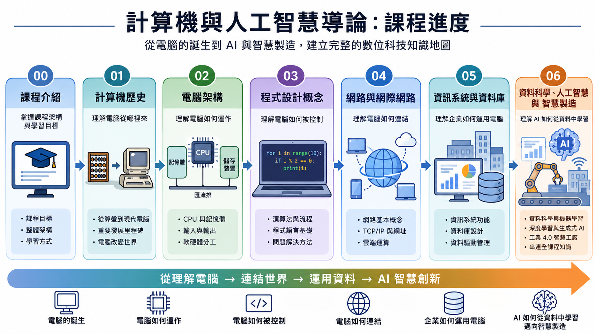

# 資訊與人工智慧概論 教材 — Introduction to Information Technology & AI

> **元智大學「資訊與人工智慧概論」課程教材**（呂卓勲老師負責部分），修課對象為工業工程與管理系學生。全文以 **繁體中文（台灣用語）** 撰寫，技術名詞首次出現時附上英文原文，並搭配製造業／工業工程的實際應用範例。

**關鍵字 Keywords**：資訊科技概論、計算機概論、人工智慧、資料科學、工業工程、元智大學、大學課程教材。

> **閱讀建議**：本教材是一套 **完整的書籍內容**，包含大量文字、表格與架構圖，少部分程式碼。強烈建議使用 **電腦或平板等較大螢幕** 好好閱讀，才會比較輕鬆；手機螢幕過窄會導致排版跑掉、長段落與表格難以閱讀，體驗不佳。
>
> 手機並非不能看，但較適合拿來翻閱 **投影片、當複習重點** 之用，真正要靜下來讀完整章內容，仍建議同學使用較大螢幕。

---

## 📚 教材清單

| 檔案 | 主題 | 說明 | 投影片版本 | 練習筆記本 |
|------|------|------|------|------|
| [00-Course-Introduction.md](00-Course-Introduction.md) | 課程介紹 | 課程概要、評分方式、考試規定、不可抗力認定、出席規範、請假規定 | [Slides](00-Course-Introduction.slides.md) | — |
| [00-Course-Rules-Quiz.md](00-Course-Rules-Quiz.md) | 課程規範理解測驗 | 20 題是非題的自我檢核，附解答與出處；不計分、不用繳交 | — | — |
| [01-History-of-Computer.md](01-History-of-Computer.md) | 計算機歷史 | 計算工具演進、二進位系統、數位化、網路起源、AI 發展簡史 | [Slides](01-History-of-Computer.slides.md) | — |
| [02-Computer-Structure.md](02-Computer-Structure.md) | 電腦硬體、作業系統與應用軟體 | CPU、記憶體、儲存裝置、作業系統、應用軟體、工業4.0 | [Slides](02-Computer-Structure.slides.md) | [Notebook](notebooks/Computer-Structure-Examples.ipynb) |
| [03-Computer-Program.md](03-Computer-Program.md) | 程式設計概念 | 演算法、程式語言、資料結構、工業工程應用 | [Slides](03-Computer-Program.slides.md) | [Notebook](notebooks/Computer-Program-Examples.ipynb) |
| [04-Networks-and-Internet.md](04-Networks-and-Internet.md) | 網路與網際網路 | 網路硬體與拓樸、無線與行動通訊、物聯網、TCP/IP、WWW 與 DNS、網際網路服務與資安、智慧製造網路 | [Slides](04-Networks-and-Internet.slides.md) | — |
| [05-Information-Systems-and-Database.md](05-Information-Systems-and-Database.md) | 資訊系統與資料庫 | 資訊系統類型（TPS/MIS/DSS/EIS）、ERP/MES/CRM、關聯式資料庫、SQL、NoSQL、大數據、電子商務 | [Slides](05-Information-Systems-and-Database.slides.md) | — |
| [06-Data-Science-AI-and-Smart-Manufacturing.md](06-Data-Science-AI-and-Smart-Manufacturing.md) | 資料科學、人工智慧與智慧製造 | 從計算機到 AI 的完整脈絡、機器學習、深度學習、生成式 AI、AI 代理人，並以工業4.0智慧工廠案例整合全課程（全課程終點章節） | [Slides](06-Data-Science-AI-and-Smart-Manufacturing.slides.md) | — |

尚未提供投影片或練習筆記本、或本來就不需要的項目，欄位標示為「—」。

---

## 📖 如何使用這份教材

本教材同時包含三種內容：**Markdown 課文**、**Marp 投影片**（檔名為 `0X-XXX.slides.md`）與 **Jupyter 練習筆記本**（集中放在 [`notebooks/`](notebooks/) 資料夾）。以下依你的需求分成「簡單用法」與「進階用法」——如果你不熟悉開發工具，或只想省事，**直接看簡單用法即可，完全不需要安裝任何軟體**。

### 🟢 簡單用法（不用安裝任何工具，推薦）

- **直接在 GitHub 上閱讀（最簡易）**：點選上方〈📚 教材清單〉的檔案連結，即可在瀏覽器線上閱覽。課文（`.md`）在 GitHub 上會自動渲染成排版好的網頁；投影片（`.slides.md`）也能直接開啟，但 GitHub 不會把它排成一頁一頁的簡報，看起來會 **比較接近條列筆記** 的感覺。
- **投影片 PDF**：若想要與上課簡報 **完全相同** 的呈現效果，最省事的方式是到課程 Portal 網站下載老師預先產生的 PDF 版本。但請注意：本 GitHub 儲存庫會持續更新與修正，網路版本通常較新，Portal 上的 PDF 可能是先前某個時間點的版本，兩者若有出入，**以本儲存庫的最新內容為準**。
- **練習筆記本**：`notebooks/` 資料夾內的 `.ipynb` 檔可直接在 GitHub 上瀏覽，或上傳到 [Google Colab](https://colab.research.google.com/) 線上執行，同樣不需在自己的電腦安裝 Python。

### 🔵 進階用法（適合能自行下載專案的人）

若你熟悉開發工具、願意把整個專案下載（clone）到自己的電腦，可以得到更好的閱讀與離線使用體驗：

1. **下載專案**：點按本頁右上角綠色的 **Code** 按鈕，選擇「Download ZIP」下載壓縮檔並解壓縮；若已安裝 [Git](https://git-scm.com/)，也可用指令 `git clone` 取得，日後執行 `git pull` 即可更新到最新內容。
2. **用 Chrome 擴充套件閱讀 Markdown**：到 Chrome 線上應用程式商店搜尋並安裝 Markdown Reader（或 Markdown Viewer）這類擴充套件，在擴充套件的詳細資訊頁面把「允許存取檔案網址」的選項打開，之後直接把下載下來的 `.md` 檔拖進 Chrome，就能得到帶目錄、排版清爽的閱讀效果，離線也能看。這個方式需要 **先把專案下載到本機** 才能使用。
3. **用 Marp 看投影片的實際效果**：在 [VS Code](https://code.visualstudio.com/) 中安裝 [Marp for VS Code](https://marketplace.visualstudio.com/items?itemName=marp-team.marp-vscode) 擴充套件，開啟 `.slides.md` 檔案後點選編輯器右上角的預覽圖示，即可即時看到 **一頁一頁的投影片效果**，也能直接從預覽畫面匯出為 PDF 或 PPTX，取得與上課簡報相同的呈現。
4. **在本機執行練習筆記本**：用 [JupyterLab](https://jupyter.org/) 或 VS Code 開啟 `notebooks/` 內的 `.ipynb`，即可在自己的電腦上逐格執行、修改程式碼來練習。

### 🤖 搭配 AI 工具延伸學習

每份教材都是純文字的 Markdown，可以 **直接貼給生成式 AI**（如 ChatGPT、Claude），請它幫你整理重點、出練習題、解釋不懂的段落，或 **轉換成其他格式與文件樣式**（例如心智圖、表格、簡報大綱、Word 文件等）。使用時請留意本教材的授權與可使用範圍，詳見下方〈📄 授權與使用聲明〉。

---

## 🧭 課程地圖

*本圖由 ChatGPT 生成，已由作者審核內容正確性*

---

## 🤖 AI 協作聲明

本教材內容除作者自行撰寫外，部分段落與圖片透過生成式 AI（如 ChatGPT、Claude）協作產生，並由作者審閱與編修。惟 AI 生成內容仍可能存在錯誤或過時資訊，雖作者盡力糾正與編輯，若您仍發現內容有誤，歡迎透過 Issue 回報。

若圖片為 AI 生成，會在圖片下方以圖說標註（例如「本圖由 ChatGPT 生成，已由作者審核內容正確性」）；引用自外部來源（如維基百科）的圖片，則會標註原始出處與連結，該等圖片仍依其原始授權條款使用，版權歸屬原作者或原出處所有，不適用下方之整體授權聲明。

---

## 🔗 延伸閱讀連結說明

本教材各章節內文中，技術名詞、歷史人物與事件大量附上[維基百科（Wikipedia）](https://zh.wikipedia.org/)連結，作為延伸閱讀之用。請將這些連結視為認識一個新名詞最簡單的起點，而不是終點——任何知識都值得自己再多找資料查證、多方比對。就網路上的免費知識來源而言，維基百科的條目經過大量網友協作編輯與相互審核，已經是相對中立且涵蓋面向較全面的選擇；但若真心想把一個主題學透，建議進一步：

- 參考本課程推薦的教科書
- 元智圖書館實體書與電子書，可以到[這裡](https://www.yzu.edu.tw/library/index.php/tw/guan-cang-zi-yuan)搜尋
- 查閱各章節〈參考文獻〉所列的學術專書與期刊論文——每章皆收錄該領域公認的經典教科書與原典／里程碑論文（以 APA 格式、依作者姓氏排序），是深入該主題的可靠起點
- 使用搜尋引擎交叉比對不同來源的說法
- 詢問生成式 AI，請它換個角度解釋、舉例或延伸提問

---

## 🎓 作為研究所「計算機概論」考科的參考用途

本教材也適合作為報考 **資訊相關領域研究所** 時「計算機概論」考科的入門讀物。不過請務必把它定位成 **概論級（入門入口）教材**：它的目標是幫你建立各主題的基本觀念與整體脈絡，讓你有個穩固的起點，而不是涵蓋研究所考試所需的全部深度。把每一章讀熟、把脈絡讀通之後，再依你報考的方向往下延伸查閱與搜尋：

- **報考資訊管理研究所（資管所）**：以 [05-Information-Systems-and-Database.md](05-Information-Systems-and-Database.md)〈資訊系統與資料庫〉為核心，建議再自行延伸搜尋資訊系統相關主題的更深入內容
- **報考資訊工程／資訊科學研究所（資工／資科所）**：請務必延伸電腦硬體與軟體（[02-Computer-Structure.md](02-Computer-Structure.md)）、程式設計（[03-Computer-Program.md](03-Computer-Program.md)）與電腦網路（[04-Networks-and-Internet.md](04-Networks-and-Internet.md)）等相關領域的進階內容
- **人工智慧與資料科學（[06-Data-Science-AI-and-Smart-Manufacturing.md](06-Data-Science-AI-and-Smart-Manufacturing.md)）**：上述三類研究所都會用到，是共同的重點

無論報考哪一類，本教材都只是一個入門入口——它幫你把觀念打底、把技術地圖攤開，真正要應考仍須依各校考古題與指定教科書再往深處鑽研。好好把這份教材讀完，一定能幫助你在後續的延伸學習上事半功倍。

---

## 📄 授權與使用聲明

本教材（不含下述例外項目）採用 [CC BY-NC-SA 4.0（姓名標示－非商業性－相同方式分享）](https://creativecommons.org/licenses/by-nc-sa/4.0/deed.zh-hant) 授權釋出。你可以自由 **分享**（重製、散布）與 **改作**（修改、轉化、部分引用）本教材內容，但須符合以下條件：

- **姓名標示**：需註明原作者（Cho-Hsun Lu）與本專案連結
- **非商業性**：不得用於商業目的
- **相同方式分享**：若對本教材進行改作，需以相同授權條款釋出

**例外項目（不適用上述授權）**：

- 引用自維基百科等外部來源的圖片，依其原始授權條款使用，版權歸屬原作者或原出處，詳見各圖片下方的來源標註
- 內容中提及之特定廠商、品牌或產品名稱（如 Google、Microsoft、IBM、OpenAI、Apple 等），其名稱、商標與相關權利均屬各該公司或商標權人所有，本教材與其並無隸屬或合作關係
- `.claude/skills/speak-human-tw/` 這套「說人話」去 AI 味改寫工具，移植自 [Raymond Hou（雷蒙三十）的 speak-human-tw 專案](https://github.com/Raymondhou0917/speak-human-tw)，依其原始 **MIT 授權** 使用，版權歸屬原作者 © 2026 Raymond Hou（雷蒙三十），完整授權條款見該資料夾內的 [LICENSE](.claude/skills/speak-human-tw/LICENSE)

**免責聲明**：本教材以現狀（AS IS）提供，作者已盡力確保內容正確，但不保證內容完全正確、完整或適用於特定情境，使用者應自行判斷並承擔使用風險。

© 2026 Cho-Hsun Lu
